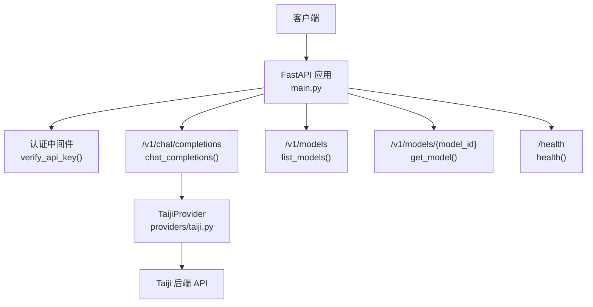
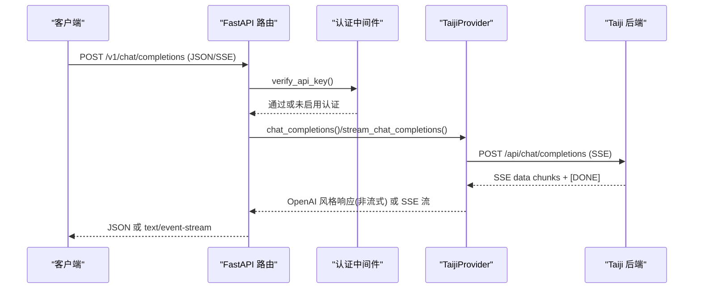
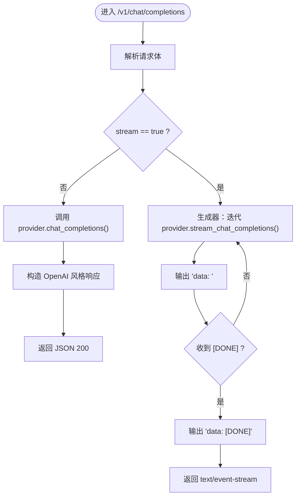
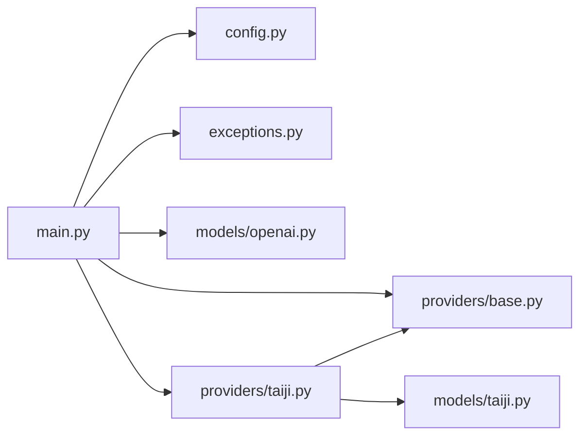

# API 参考文档

<cite>
**本文引用的文件**
- [src/openai_provider/main.py](file://src/openai_provider/main.py)
- [src/openai_provider/config.py](file://src/openai_provider/config.py)
- [src/openai_provider/exceptions.py](file://src/openai_provider/exceptions.py)
- [src/openai_provider/models/openai.py](file://src/openai_provider/models/openai.py)
- [src/openai_provider/providers/base.py](file://src/openai_provider/providers/base.py)
- [src/openai_provider/providers/taiji.py](file://src/openai_provider/providers/taiji.py)
- [src/openai_provider/models/taiji.py](file://src/openai_provider/models/taiji.py)
- [tests/e2e/conftest.py](file://tests/e2e/conftest.py)
- [tests/e2e/test_01_health_models.py](file://tests/e2e/test_01_health_models.py)
- [tests/e2e/test_02_chat_non_stream.py](file://tests/e2e/test_02_chat_non_stream.py)
- [tests/e2e/test_03_chat_streaming.py](file://tests/e2e/test_03_chat_streaming.py)
- [tests/e2e/test_04_tool_calls.py](file://tests/e2e/test_04_tool_calls.py)
- [tests/e2e/test_05_error_handling.py](file://tests/e2e/test_05_error_handling.py)
</cite>

## 目录
1. [简介](#简介)
2. [项目结构](#项目结构)
3. [核心组件](#核心组件)
4. [架构总览](#架构总览)
5. [详细端点说明](#详细端点说明)
6. [依赖关系分析](#依赖关系分析)
7. [性能与流式特性](#性能与流式特性)
8. [故障排查指南](#故障排查指南)
9. [结论](#结论)
10. [附录：客户端集成示例与最佳实践](#附录客户端集成示例与最佳实践)

## 简介
本仓库实现了一个 OpenAI 兼容的网关服务，提供 /v1/chat/completions、/v1/models、/health 等标准端点，将请求转发至 Taiji LLM 后端并返回 OpenAI 风格的响应。支持非流式与流式（SSE）两种模式，并提供工具调用（function calling）能力与推理内容分离（reasoning_content）。

## 项目结构
- 应用入口与路由定义位于主模块中，包含认证中间件、CORS、异常处理以及所有 HTTP 端点。
- 模型定义采用 Pydantic，统一了 OpenAI 风格请求/响应结构与流式增量结构。
- Provider 抽象层定义了统一的接口，TaijiProvider 实现了具体的网络请求、SSE 解析、tool_calls 提取与 token 统计。
- 配置通过环境变量加载，支持 .env 文件与默认值兜底。
- E2E 测试覆盖了健康检查、模型发现、非流式/流式对话、工具调用与错误处理等场景。

图表来源
- [src/openai_provider/main.py:128-317](file://src/openai_provider/main.py#L128-L317)
- [src/openai_provider/providers/taiji.py:46-120](file://src/openai_provider/providers/taiji.py#L46-L120)

章节来源
- [src/openai_provider/main.py:1-342](file://src/openai_provider/main.py#L1-L342)
- [src/openai_provider/config.py:1-56](file://src/openai_provider/config.py#L1-L56)

## 核心组件
- 认证与中间件
  - Bearer Token 可选认证：若未配置 API_KEY 则跳过认证；否则校验 Authorization: Bearer <key>，失败返回 401 且错误体遵循 OpenAI 风格。
- 路由与控制器
  - /health：健康检查，返回 {"status": "ok"}。
  - /v1/models：列出可用模型（当前仅暴露 taiji）。
  - /v1/models/{model_id}：按 ID 获取模型元信息。
  - /api/v1/models：/v1/models 的别名。
  - /api/tags：Ollama 兼容空标签端点。
  - /v1/props、/props：用于客户端特性探测的空对象。
  - /version：版本信息。
  - /v1/chat/completions：OpenAI 兼容聊天补全，支持 stream=true 的 SSE 流式响应与非流式 JSON 响应。
- Provider 抽象与实现
  - BaseProvider：定义 chat_completions 与 stream_chat_completions 两个抽象方法。
  - TaijiProvider：负责构建请求、调用 Taiji 后端、解析 SSE、提取 tool_calls、剥离 think 标签、计算 usage。
- 数据模型
  - OpenAI 风格请求/响应模型（含 tools/tool_choice、stream delta、usage 等）。
  - Taiji 请求体模型（透传 temperature、max_tokens 等）。

章节来源
- [src/openai_provider/main.py:105-317](file://src/openai_provider/main.py#L105-L317)
- [src/openai_provider/providers/base.py:1-46](file://src/openai_provider/providers/base.py#L1-L46)
- [src/openai_provider/providers/taiji.py:46-120](file://src/openai_provider/providers/taiji.py#L46-L120)
- [src/openai_provider/models/openai.py:1-177](file://src/openai_provider/models/openai.py#L1-L177)
- [src/openai_provider/models/taiji.py:1-31](file://src/openai_provider/models/taiji.py#L1-L31)

## 架构总览
整体流程：客户端 → FastAPI 路由 → 认证中间件 → Provider 调用 Taiji 后端 → 返回 OpenAI 风格响应（JSON 或 SSE）。

图表来源
- [src/openai_provider/main.py:134-257](file://src/openai_provider/main.py#L134-L257)
- [src/openai_provider/providers/taiji.py:670-780](file://src/openai_provider/providers/taiji.py#L670-L780)

## 详细端点说明

### 通用说明
- 基础 URL：由部署决定（例如 http://localhost:8080）。
- 认证方式：可选 Bearer Token。若服务端未配置 API_KEY，则无需认证；否则需在请求头携带 Authorization: Bearer <key>。
- 错误格式：所有错误均返回 OpenAI 风格错误体，形如 {"error":{"message":"...","type":"...","code":null}}。

章节来源
- [src/openai_provider/main.py:105-126](file://src/openai_provider/main.py#L105-L126)
- [src/openai_provider/main.py:319-330](file://src/openai_provider/main.py#L319-L330)

---

### GET /health
- 描述：健康检查。
- 请求：无。
- 响应：
  - 200 OK，Content-Type: application/json
  - 响应体：{"status": "ok"}
- 认证：不需要。
- 错误：无。

章节来源
- [src/openai_provider/main.py:128-131](file://src/openai_provider/main.py#L128-L131)
- [tests/e2e/test_01_health_models.py:11-19](file://tests/e2e/test_01_health_models.py#L11-L19)

---

### GET /version
- 描述：版本信息，供客户端兼容性检测。
- 请求：无。
- 响应：
  - 200 OK，application/json
  - 响应体：{"version": "1.0.0", "provider": "taiji"}
- 认证：不需要。

章节来源
- [src/openai_provider/main.py:313-316](file://src/openai_provider/main.py#L313-L316)
- [tests/e2e/test_01_health_models.py:24-30](file://tests/e2e/test_01_health_models.py#L24-L30)

---

### GET /v1/models
- 描述：列出可用模型。
- 请求：无。
- 响应：
  - 200 OK，application/json
  - 响应体：
    - object: "list"
    - data: 数组，每项为模型元信息，包含 id、object="model"、created、owned_by、context_length、max_completion_tokens。
- 认证：可选（取决于是否配置 API_KEY）。
- 错误：无。

章节来源
- [src/openai_provider/main.py:272-278](file://src/openai_provider/main.py#L272-L278)
- [src/openai_provider/main.py:260-269](file://src/openai_provider/main.py#L260-L269)
- [tests/e2e/test_01_health_models.py:52-68](file://tests/e2e/test_01_health_models.py#L52-L68)

---

### GET /v1/models/{model_id}
- 描述：按 ID 获取模型元信息。
- 路径参数：
  - model_id: 字符串，例如 "taiji"。
- 响应：
  - 200 OK：返回模型元信息（同 /v1/models 中的单条记录）。
  - 404 Not Found：当 model_id 不为 "taiji" 时返回 OpenAI 风格错误体。
- 认证：可选。

章节来源
- [src/openai_provider/main.py:281-286](file://src/openai_provider/main.py#L281-L286)
- [tests/e2e/test_01_health_models.py:70-82](file://tests/e2e/test_01_health_models.py#L70-L82)

---

### GET /api/v1/models
- 描述：/v1/models 的别名，便于某些客户端发现模型。
- 行为：与 /v1/models 一致。
- 认证：可选。

章节来源
- [src/openai_provider/main.py:289-292](file://src/openai_provider/main.py#L289-L292)
- [tests/e2e/test_01_health_models.py:83-87](file://tests/e2e/test_01_health_models.py#L83-L87)

---

### GET /api/tags
- 描述：Ollama 兼容的空标签端点。
- 响应：{"models": []}
- 认证：不需要。

章节来源
- [src/openai_provider/main.py:295-298](file://src/openai_provider/main.py#L295-L298)
- [tests/e2e/test_01_health_models.py:44-47](file://tests/e2e/test_01_health_models.py#L44-L47)

---

### GET /v1/props 与 GET /props
- 描述：用于客户端特性探测的空对象端点。
- 响应：{}
- 认证：不需要。

章节来源
- [src/openai_provider/main.py:301-310](file://src/openai_provider/main.py#L301-L310)
- [tests/e2e/test_01_health_models.py:35-39](file://tests/e2e/test_01_health_models.py#L35-L39)

---

### POST /v1/chat/completions
- 描述：OpenAI 兼容的聊天补全端点，支持非流式与流式（SSE）。
- 请求：
  - Content-Type: application/json
  - 请求体字段（OpenAI 风格）：
    - model: 字符串，必填。当前支持 "taiji"。
    - messages: 消息数组，必填。元素包含 role（system/user/assistant/tool）、content、name、tool_call_id、tool_calls 等。
    - temperature: 浮点数，范围 [0, 2]，默认 0.7。
    - max_tokens: 整数，≥1，可选。
    - top_p: 浮点数，范围 [0, 1]，默认 1.0。
    - n: 整数，范围 [1, 10]，默认 1。
    - stream: 布尔，默认 false。true 时返回 SSE 流。
    - stop: 字符串或字符串数组，可选。
    - presence_penalty: 浮点数，范围 [-2, 2]，默认 0。
    - frequency_penalty: 浮点数，范围 [-2, 2]，默认 0。
    - user: 字符串，可选。
    - tools: 工具定义数组，可选。每个工具包含 type="function" 与 function{name, description, parameters}。
    - tool_choice: 字符串或对象，可选。支持 "auto"/"none"/"required" 或指定函数名的对象。
    - 其他未知字段将被忽略。
  - 认证（可选）：Authorization: Bearer <key>（若服务端配置了 API_KEY）。
- 非流式响应（stream=false）：
  - 200 OK，application/json
  - 响应体：
    - id: 字符串，以 "chatcmpl-" 开头。
    - object: "chat.completion"
    - created: Unix 时间戳（秒）。
    - model: 字符串。
    - choices: 数组，至少一项。每项包含 index、message{role="assistant", content?, reasoning_content?, tool_calls?}、finish_reason（"stop" 或 "tool_calls" 等）。
    - usage: {prompt_tokens, completion_tokens, total_tokens}，其中 total_tokens = prompt_tokens + completion_tokens。
    - system_fingerprint: 可选。
- 流式响应（stream=true）：
  - 200 OK，Content-Type: text/event-stream
  - 响应头：Cache-Control: no-cache，Connection: keep-alive
  - 事件格式：每行以 "data: " 前缀，最后以 "data: [DONE]" 结束。
  - 每个 chunk 为 OpenAI 风格的 chat.completion.chunk：
    - id、object="chat.completion.chunk"、created、model、choices[delta{role?, content?, reasoning_content?, tool_calls?}, finish_reason?]、usage（在最后一个 finish chunk 中出现）。
  - 首个 chunk 通常携带 role="assistant"。
  - finish_reason 仅在最后一个有效 chunk 出现。
  - 若检测到 tool_calls，finish_reason 可能为 "tool_calls"。
- 错误处理：
  - 400 Bad Request：请求体验证失败（非法 JSON、缺少必填字段、字段越界等），返回 OpenAI 风格错误体。
  - 401 Unauthorized：认证失败（当配置了 API_KEY 且 Bearer token 不匹配）。
  - 404/405：未找到或方法不允许，返回 OpenAI 风格错误体。
  - 502 Bad Gateway：上游 Provider 错误（超时、HTTP 错误、业务错误等），返回 OpenAI 风格错误体。
- 备注：
  - 支持工具调用：tools 与 tool_choice 会被转换为提示词指令，并在响应中解析出 tool_calls。
  - 支持推理内容分离：think 标签内容会放入 reasoning_content，并从 content 中移除。
  - 超长上下文会被智能截断，保留 system 与最近对话片段。

章节来源
- [src/openai_provider/main.py:134-257](file://src/openai_provider/main.py#L134-L257)
- [src/openai_provider/models/openai.py:83-177](file://src/openai_provider/models/openai.py#L83-L177)
- [src/openai_provider/providers/taiji.py:520-600](file://src/openai_provider/providers/taiji.py#L520-L600)
- [src/openai_provider/providers/taiji.py:670-780](file://src/openai_provider/providers/taiji.py#L670-L780)
- [tests/e2e/test_02_chat_non_stream.py:13-58](file://tests/e2e/test_02_chat_non_stream.py#L13-L58)
- [tests/e2e/test_03_chat_streaming.py:13-70](file://tests/e2e/test_03_chat_streaming.py#L13-L70)
- [tests/e2e/test_04_tool_calls.py:52-102](file://tests/e2e/test_04_tool_calls.py#L52-L102)
- [tests/e2e/test_05_error_handling.py:11-55](file://tests/e2e/test_05_error_handling.py#L11-L55)

#### 流式处理流程图（SSE）

图表来源
- [src/openai_provider/main.py:185-218](file://src/openai_provider/main.py#L185-L218)
- [src/openai_provider/providers/taiji.py:782-800](file://src/openai_provider/providers/taiji.py#L782-L800)

## 依赖关系分析
- 模块耦合
  - main.py 依赖 config、exceptions、models.openai、providers.TaijiProvider。
  - providers.base 定义抽象接口，providers.taiji 实现具体逻辑。
  - models.openai 定义 OpenAI 风格数据结构，models.taiji 定义后端请求体。
- 外部依赖
  - FastAPI、Uvicorn、httpx、Pydantic、pydantic-settings。
- 潜在循环依赖
  - 未发现直接循环导入；Provider 与模型之间通过类型引用解耦。

图表来源
- [src/openai_provider/main.py:1-27](file://src/openai_provider/main.py#L1-L27)
- [src/openai_provider/providers/base.py:1-46](file://src/openai_provider/providers/base.py#L1-L46)
- [src/openai_provider/providers/taiji.py:1-41](file://src/openai_provider/providers/taiji.py#L1-L41)

章节来源
- [src/openai_provider/main.py:1-27](file://src/openai_provider/main.py#L1-L27)
- [src/openai_provider/providers/base.py:1-46](file://src/openai_provider/providers/base.py#L1-L46)
- [src/openai_provider/providers/taiji.py:1-41](file://src/openai_provider/providers/taiji.py#L1-L41)

## 性能与流式特性
- 流式响应
  - 使用 StreamingResponse 推送 SSE，设置 no-cache 与 keep-alive 头，确保实时性。
  - 首个 chunk 携带 role=assistant，最后一个有效 chunk 携带 finish_reason 与 usage。
- 上下文截断
  - 智能截断策略优先保留 system 与 tools 提示，从后往前添加最近对话，必要时对旧消息进行尾部截断并插入提示。
- Token 计数
  - 优先使用上游返回的 token 信息；缺失时回退到基于 tiktoken 或字符估算。
  - total_tokens 始终等于 prompt_tokens + completion_tokens，符合 OpenAI 规范。
- 并发与稳定性
  - 使用异步 httpx 客户端，超时控制与连接释放。
  - 针对上游 502 的自动重试在 E2E 客户端中实现（测试侧）。

章节来源
- [src/openai_provider/main.py:211-218](file://src/openai_provider/main.py#L211-L218)
- [src/openai_provider/providers/taiji.py:206-318](file://src/openai_provider/providers/taiji.py#L206-L318)
- [src/openai_provider/providers/taiji.py:737-758](file://src/openai_provider/providers/taiji.py#L737-L758)
- [tests/e2e/conftest.py:47-75](file://tests/e2e/conftest.py#L47-L75)

## 故障排查指南
- 常见状态码与含义
  - 200：成功。
  - 400：请求体验证失败（非法 JSON、缺少必填字段、字段越界等）。
  - 401：认证失败（Bearer token 不匹配或未提供）。
  - 404/405：资源不存在或方法不允许。
  - 502：上游 Provider 错误（超时、HTTP 错误、业务错误等）。
- 错误体格式
  - 统一为 {"error":{"message":"...","type":"...","code":null}}。
- 定位建议
  - 查看原始请求/响应日志（raw_request/raw_response），关注 request_id。
  - 检查 Provider 日志（provider_request/provider_response），确认上游状态码与延迟。
  - 对于流式错误，注意 SSE 中可能出现 error chunk，需按 OpenAI 风格处理。

章节来源
- [src/openai_provider/main.py:163-183](file://src/openai_provider/main.py#L163-L183)
- [src/openai_provider/main.py:221-241](file://src/openai_provider/main.py#L221-L241)
- [src/openai_provider/main.py:319-330](file://src/openai_provider/main.py#L319-L330)
- [src/openai_provider/exceptions.py:8-40](file://src/openai_provider/exceptions.py#L8-L40)

## 结论
该服务提供了完整的 OpenAI 兼容接口，覆盖健康检查、模型发现、聊天补全（非流式与流式）、工具调用与推理内容分离。通过结构化异常与统一错误体，提升了可观测性与客户端兼容性。建议在客户端集成时严格遵循 OpenAI 风格的数据结构与错误处理约定，并合理处理 SSE 流与工具调用往返。

## 附录：客户端集成示例与最佳实践

### 基本请求示例（非流式）
- 方法：POST
- URL：/v1/chat/completions
- 请求体要点：
  - model: "taiji"
  - messages: [{"role": "user", "content": "..."}]
- 响应要点：
  - choices[0].message.content 为非空文本
  - usage.total_tokens = prompt_tokens + completion_tokens

章节来源
- [tests/e2e/test_02_chat_non_stream.py:13-58](file://tests/e2e/test_02_chat_non_stream.py#L13-L58)

### 流式请求示例（SSE）
- 方法：POST
- URL：/v1/chat/completions
- 请求体：在非流式基础上增加 "stream": true
- 响应要点：
  - Content-Type: text/event-stream
  - 首 chunk 包含 role="assistant"
  - 末个有效 chunk 包含 finish_reason 与 usage
  - 结尾为 "data: [DONE]"

章节来源
- [tests/e2e/test_03_chat_streaming.py:13-70](file://tests/e2e/test_03_chat_streaming.py#L13-L70)

### 工具调用示例
- 请求体包含 tools 与可选 tool_choice
- 响应中 message.tool_calls 为函数调用列表，arguments 为合法 JSON 字符串
- 多轮往返：将 assistant 的 tool_calls 与 tool 角色的结果拼接回传给模型

章节来源
- [tests/e2e/test_04_tool_calls.py:52-102](file://tests/e2e/test_04_tool_calls.py#L52-L102)
- [tests/e2e/test_04_tool_calls.py:189-226](file://tests/e2e/test_04_tool_calls.py#L189-L226)

### 认证与 CORS
- 认证：可选 Bearer Token；未配置 API_KEY 时不强制认证。
- CORS：允许跨域，预检与实际请求均返回相应头。

章节来源
- [src/openai_provider/main.py:105-126](file://src/openai_provider/main.py#L105-L126)
- [tests/e2e/test_02_chat_non_stream.py:156-178](file://tests/e2e/test_02_chat_non_stream.py#L156-L178)

### 最佳实践
- 客户端应容忍未知字段（extra="ignore"），避免升级导致的不兼容。
- 流式客户端需正确处理 role 首次出现、finish_reason 时机与 [DONE] 终止。
- 工具调用场景下，client 需维护 tool_call_id 并在后续消息中以 role="tool" 返回执行结果。
- 遇到 502 时实施指数退避重试；对限流（429）进行等待与重试。

章节来源
- [src/openai_provider/models/openai.py:83-101](file://src/openai_provider/models/openai.py#L83-L101)
- [tests/e2e/conftest.py:47-75](file://tests/e2e/conftest.py#L47-L75)