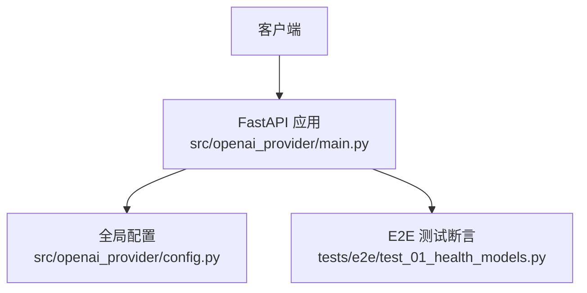
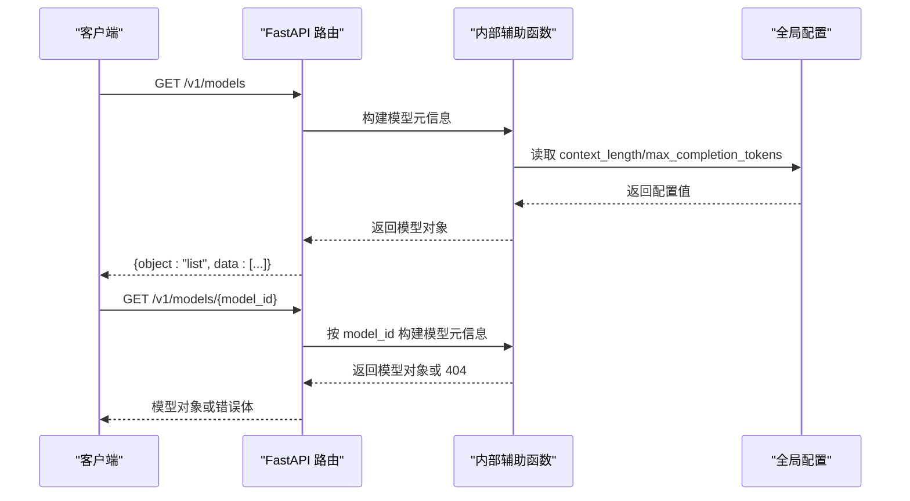
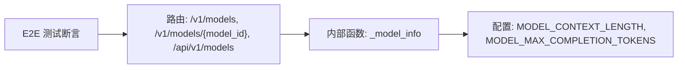

# 模型管理 API

<cite>
**本文引用的文件**   
- [main.py](file://src/openai_provider/main.py)
- [config.py](file://src/openai_provider/config.py)
- [test_01_health_models.py](file://tests/e2e/test_01_health_models.py)
</cite>

## 目录
1. [简介](#简介)
2. [项目结构](#项目结构)
3. [核心组件](#核心组件)
4. [架构总览](#架构总览)
5. [详细端点分析](#详细端点分析)
6. [依赖关系分析](#依赖关系分析)
7. [性能与可用性建议](#性能与可用性建议)
8. [故障排查指南](#故障排查指南)
9. [结论](#结论)
10. [附录：最佳实践](#附录最佳实践)

## 简介
本文件为模型管理相关端点的 API 文档，覆盖以下能力：
- GET /v1/models：列出所有可用模型
- GET /v1/models/{model_id}：查询特定模型的详情
- GET /api/v1/models：/v1/models 的别名端点

同时记录返回的模型信息结构（包含 id、object、created、owned_by、context_length、max_completion_tokens 等字段），并提供模型发现与选择的最佳实践。

## 项目结构
与模型管理相关的实现集中在应用主入口中，配置项通过全局设置注入到响应结构中；E2E 测试覆盖了关键行为断言。

图表来源
- [main.py:272-292](file://src/openai_provider/main.py#L272-L292)
- [config.py:42-44](file://src/openai_provider/config.py#L42-L44)
- [test_01_health_models.py:50-87](file://tests/e2e/test_01_health_models.py#L50-L87)

章节来源
- [main.py:272-292](file://src/openai_provider/main.py#L272-L292)
- [config.py:42-44](file://src/openai_provider/config.py#L42-L44)
- [test_01_health_models.py:50-87](file://tests/e2e/test_01_health_models.py#L50-L87)

## 核心组件
- 模型元数据构造：内部函数负责生成单个模型的元信息对象，包含 id、object、created、owned_by、context_length、max_completion_tokens 等字段。
- 列表端点：返回 object=list 的列表结构，data 数组中包含一个或多个模型对象。
- 详情端点：根据 model_id 返回对应模型对象，未命中时返回 404。
- 别名端点：/api/v1/models 与 /v1/models 返回一致结果。
- 配置注入：context_length 与 max_completion_tokens 来自全局配置。

章节来源
- [main.py:260-292](file://src/openai_provider/main.py#L260-L292)
- [config.py:42-44](file://src/openai_provider/config.py#L42-L44)

## 架构总览
模型管理端点属于轻量级“服务发现”能力，不涉及后端 LLM 调用，仅基于本地配置返回模型元信息。

图表来源
- [main.py:260-292](file://src/openai_provider/main.py#L260-L292)
- [config.py:42-44](file://src/openai_provider/config.py#L42-L44)

## 详细端点分析

### GET /v1/models
- 功能：列出所有可用模型
- 请求方法：GET
- 路径：/v1/models
- 认证：可选（若启用 API_KEY）
- 成功响应状态码：200
- 成功响应体结构：
  - object: 固定为 list
  - data: 模型对象数组，每个元素包含：
    - id: 字符串，模型标识
    - object: 固定为 model
    - created: 整数，创建时间戳
    - owned_by: 字符串，拥有者标识
    - context_length: 整数，上下文长度上限
    - max_completion_tokens: 整数，最大补全 token 数
- 失败响应：
  - 当启用认证且缺少或错误的 API Key 时，返回 401，错误体遵循 OpenAI 风格
  - 其他异常由统一异常处理器转换为 OpenAI 风格错误体

章节来源
- [main.py:272-278](file://src/openai_provider/main.py#L272-L278)
- [main.py:260-269](file://src/openai_provider/main.py#L260-L269)
- [main.py:319-330](file://src/openai_provider/main.py#L319-L330)
- [test_01_health_models.py:52-68](file://tests/e2e/test_01_health_models.py#L52-L68)

### GET /v1/models/{model_id}
- 功能：查询指定模型的详细信息
- 请求方法：GET
- 路径参数：
  - model_id: 字符串，模型 ID
- 认证：可选（若启用 API_KEY）
- 成功响应状态码：200
- 成功响应体结构：与单个模型对象一致（见上节字段说明）
- 失败响应：
  - 404：当 model_id 不存在时，返回 OpenAI 风格错误体
  - 401：当启用认证且缺少或错误的 API Key 时

章节来源
- [main.py:281-286](file://src/openai_provider/main.py#L281-L286)
- [main.py:260-269](file://src/openai_provider/main.py#L260-L269)
- [test_01_health_models.py:70-81](file://tests/e2e/test_01_health_models.py#L70-L81)

### GET /api/v1/models
- 功能：/v1/models 的别名端点，用于部分客户端的模型发现
- 请求方法：GET
- 路径：/api/v1/models
- 认证：可选（若启用 API_KEY）
- 成功响应状态码：200
- 成功响应体结构：与 /v1/models 完全一致
- 失败响应：同 /v1/models

章节来源
- [main.py:289-292](file://src/openai_provider/main.py#L289-L292)
- [test_01_health_models.py:83-87](file://tests/e2e/test_01_health_models.py#L83-L87)

### 模型信息结构定义
- id: 字符串，模型唯一标识
- object: 固定为 model
- created: 整数，创建时间戳
- owned_by: 字符串，拥有者标识
- context_length: 整数，上下文长度上限，来源于配置
- max_completion_tokens: 整数，最大补全 token 数，来源于配置

章节来源
- [main.py:260-269](file://src/openai_provider/main.py#L260-L269)
- [config.py:42-44](file://src/openai_provider/config.py#L42-L44)

## 依赖关系分析
- 路由层依赖内部辅助函数以构造模型元信息
- 模型元信息中的数值型能力字段从全局配置读取
- E2E 测试对返回结构与字段进行断言，确保兼容性

图表来源
- [main.py:260-292](file://src/openai_provider/main.py#L260-L292)
- [config.py:42-44](file://src/openai_provider/config.py#L42-L44)
- [test_01_health_models.py:50-87](file://tests/e2e/test_01_health_models.py#L50-L87)

章节来源
- [main.py:260-292](file://src/openai_provider/main.py#L260-L292)
- [config.py:42-44](file://src/openai_provider/config.py#L42-L44)
- [test_01_health_models.py:50-87](file://tests/e2e/test_01_health_models.py#L50-L87)

## 性能与可用性建议
- 模型列表与详情均为纯内存构造，无外部 I/O，延迟极低，适合高频探测
- 建议在客户端侧缓存模型列表，减少重复请求
- 若启用认证，注意在客户端侧复用连接并合理重试，避免频繁鉴权失败导致的抖动

[本节为通用建议，不直接分析具体文件]

## 故障排查指南
- 401 未认证：检查是否配置了 API_KEY，并确保请求头携带正确的 Bearer Token
- 404 模型不存在：确认 model_id 是否为支持的标识（例如当前实现支持 “taiji”）
- 字段缺失或不完整：参考 E2E 测试中对必需字段的断言，逐项核对返回体

章节来源
- [main.py:319-330](file://src/openai_provider/main.py#L319-L330)
- [test_01_health_models.py:77-81](file://tests/e2e/test_01_health_models.py#L77-L81)

## 结论
模型管理 API 提供简洁稳定的模型发现能力，兼容主流 OpenAI 客户端的期望格式。通过统一的错误体结构与可选认证机制，便于集成与排障。建议在生产环境中结合缓存与合理的重试策略，以获得更佳的稳定性与性能。

[本节为总结性内容，不直接分析具体文件]

## 附录：最佳实践
- 模型发现流程
  - 启动后先调用 /v1/models 获取模型列表
  - 如需特定模型能力，再调用 /v1/models/{model_id} 获取详情
  - 对于某些客户端，可优先使用 /api/v1/models 作为别名入口
- 选择模型的建议
  - 依据 context_length 判断输入上下文容量需求
  - 依据 max_completion_tokens 评估输出长度上限
  - 将模型列表缓存至本地，降低网络开销
- 兼容性与健壮性
  - 处理 401/404 等错误，遵循 OpenAI 风格错误体
  - 对未知 model_id 做降级策略（如回退到默认模型或提示用户）
  - 在批量任务前做一次模型探测，避免运行时才发现不可用

[本节为通用指导，不直接分析具体文件]