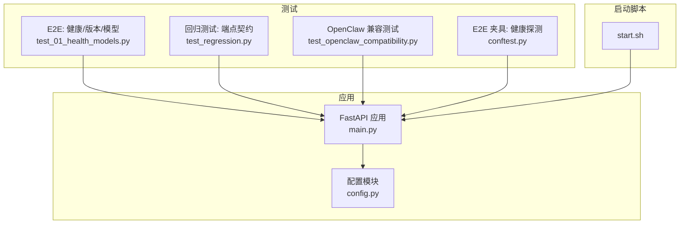
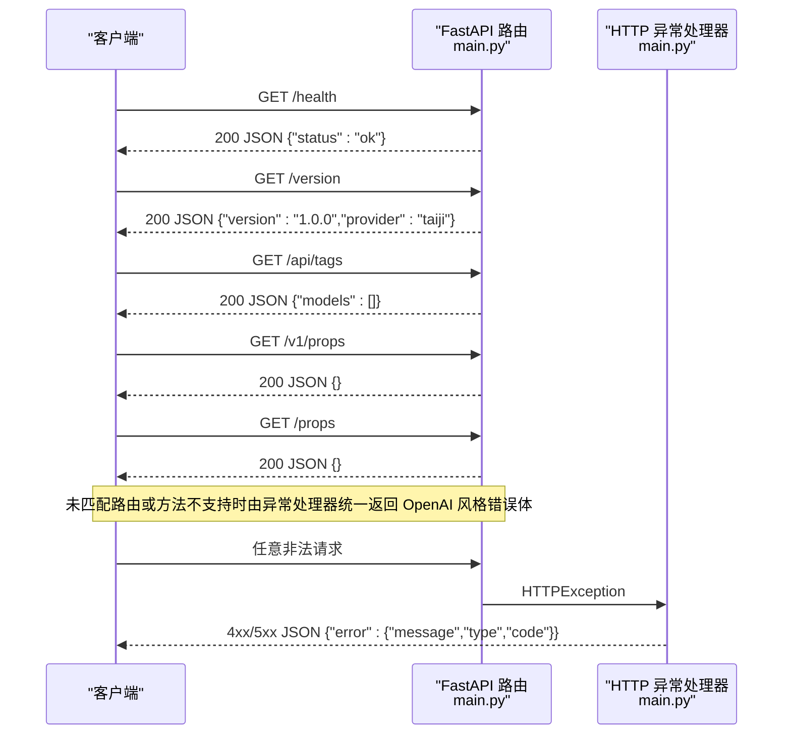
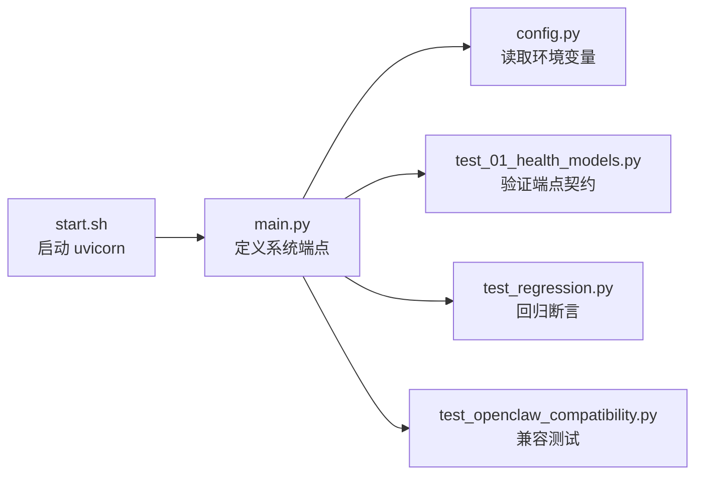

# 系统端点

<cite>
**本文引用的文件**   
- [src/openai_provider/main.py](file://src/openai_provider/main.py)
- [src/openai_provider/config.py](file://src/openai_provider/config.py)
- [tests/e2e/test_01_health_models.py](file://tests/e2e/test_01_health_models.py)
- [tests/test_regression.py](file://tests/test_regression.py)
- [tests/test_openclaw_compatibility.py](file://tests/test_openclaw_compatibility.py)
- [tests/e2e/conftest.py](file://tests/e2e/conftest.py)
- [start.sh](file://start.sh)
</cite>

## 目录
1. [简介](#简介)
2. [项目结构](#项目结构)
3. [核心组件](#核心组件)
4. [架构总览](#架构总览)
5. [详细组件分析](#详细组件分析)
6. [依赖关系分析](#依赖关系分析)
7. [性能考虑](#性能考虑)
8. [故障排查指南](#故障排查指南)
9. [结论](#结论)
10. [附录：监控与健康检查集成示例](#附录监控与健康检查集成示例)

## 简介
本章节面向系统管理与兼容性检测，聚焦以下系统级与兼容层端点：
- /health：健康检查
- /version：版本信息
- /api/tags、/v1/props、/props：Ollama 兼容客户端功能探测的辅助端点

这些端点用于服务可用性探测、能力发现与兼容性判断，是运维监控与多客户端生态对接的关键入口。

## 项目结构
系统基于 FastAPI 构建，所有系统端点集中在主应用模块中定义；配置通过环境变量加载；测试用例覆盖了各端点的行为契约。

图表来源
- [src/openai_provider/main.py:128-316](file://src/openai_provider/main.py#L128-L316)
- [src/openai_provider/config.py:12-56](file://src/openai_provider/config.py#L12-L56)
- [tests/e2e/test_01_health_models.py:1-103](file://tests/e2e/test_01_health_models.py#L1-L103)
- [tests/test_regression.py:214-254](file://tests/test_regression.py#L214-L254)
- [tests/test_openclaw_compatibility.py:375-407](file://tests/test_openclaw_compatibility.py#L375-L407)
- [tests/e2e/conftest.py:27-40](file://tests/e2e/conftest.py#L27-L40)
- [start.sh:98-122](file://start.sh#L98-L122)

章节来源
- [src/openai_provider/main.py:128-316](file://src/openai_provider/main.py#L128-L316)
- [src/openai_provider/config.py:12-56](file://src/openai_provider/config.py#L12-L56)
- [tests/e2e/test_01_health_models.py:1-103](file://tests/e2e/test_01_health_models.py#L1-L103)
- [tests/test_regression.py:214-254](file://tests/test_regression.py#L214-L254)
- [tests/test_openclaw_compatibility.py:375-407](file://tests/test_openclaw_compatibility.py#L375-L407)
- [tests/e2e/conftest.py:27-40](file://tests/e2e/conftest.py#L27-L40)
- [start.sh:98-122](file://start.sh#L98-L122)

## 核心组件
- 健康检查 /health：返回固定状态对象，用于快速存活探测。
- 版本信息 /version：返回版本号与提供商标识，供客户端进行兼容性判断。
- 兼容性端点：
  - /api/tags：为 Ollama 兼容客户端提供空标签列表。
  - /v1/props 与 /props：为空对象，用于客户端特性探测。

章节来源
- [src/openai_provider/main.py:128-131](file://src/openai_provider/main.py#L128-L131)
- [src/openai_provider/main.py:295-316](file://src/openai_provider/main.py#L295-L316)
- [tests/e2e/test_01_health_models.py:9-47](file://tests/e2e/test_01_health_models.py#L9-L47)
- [tests/test_regression.py:227-254](file://tests/test_regression.py#L227-L254)

## 架构总览
下图展示了系统端点在请求处理中的位置与响应路径，以及错误处理的统一出口。

图表来源
- [src/openai_provider/main.py:128-131](file://src/openai_provider/main.py#L128-L131)
- [src/openai_provider/main.py:295-316](file://src/openai_provider/main.py#L295-L316)
- [src/openai_provider/main.py:319-330](file://src/openai_provider/main.py#L319-L330)

## 详细组件分析

### 健康检查 /health
- 用途：服务存活探测与负载均衡健康检查。
- 方法：GET
- 路径：/health
- 成功响应：
  - 状态码：200
  - Content-Type：application/json
  - 响应体：包含字段 status，值为字符串 "ok"
- 失败场景：无业务逻辑失败；若服务不可用则无法到达该端点。

章节来源
- [src/openai_provider/main.py:128-131](file://src/openai_provider/main.py#L128-L131)
- [tests/e2e/test_01_health_models.py:11-19](file://tests/e2e/test_01_health_models.py#L11-L19)
- [tests/test_openclaw_compatibility.py:379-383](file://tests/test_openclaw_compatibility.py#L379-L383)

### 版本信息 /version
- 用途：客户端兼容性检查与日志审计。
- 方法：GET
- 路径：/version
- 成功响应：
  - 状态码：200
  - Content-Type：application/json
  - 响应体：
    - version：字符串，当前服务版本
    - provider：字符串，提供商标识（例如 "taiji"）
- 失败场景：无业务逻辑失败；若服务不可用则无法到达该端点。

章节来源
- [src/openai_provider/main.py:313-316](file://src/openai_provider/main.py#L313-L316)
- [tests/e2e/test_01_health_models.py:24-30](file://tests/e2e/test_01_health_models.py#L24-L30)
- [tests/test_regression.py:246-249](file://tests/test_regression.py#L246-L249)

### 兼容性端点：/api/tags
- 用途：为 Ollama 兼容客户端提供“模型标签”发现接口，当前实现返回空列表以表明无可用标签。
- 方法：GET
- 路径：/api/tags
- 成功响应：
  - 状态码：200
  - Content-Type：application/json
  - 响应体：{"models": []}
- 失败场景：无业务逻辑失败。

章节来源
- [src/openai_provider/main.py:295-298](file://src/openai_provider/main.py#L295-L298)
- [tests/e2e/test_01_health_models.py:44-47](file://tests/e2e/test_01_health_models.py#L44-L47)
- [tests/test_regression.py:227-230](file://tests/test_regression.py#L227-L230)

### 兼容性端点：/v1/props 与 /props
- 用途：客户端特性探测，便于不同客户端在运行时判断是否启用某些能力。
- 方法：GET
- 路径：/v1/props 与 /props
- 成功响应：
  - 状态码：200
  - Content-Type：application/json
  - 响应体：{}（空对象）
- 失败场景：无业务逻辑失败。

章节来源
- [src/openai_provider/main.py:301-310](file://src/openai_provider/main.py#L301-L310)
- [tests/e2e/test_01_health_models.py:35-39](file://tests/e2e/test_01_health_models.py#L35-L39)
- [tests/test_regression.py:241-254](file://tests/test_regression.py#L241-L254)

### 错误处理与统一格式
- 当请求不匹配任何路由或方法不被允许时，统一由异常处理器转换为 OpenAI 风格的错误体，包含 error.message、error.type、error.code 等字段。
- 典型状态码：
  - 404：未找到
  - 405：方法不允许
  - 其他 4xx/5xx：按具体异常映射

章节来源
- [src/openai_provider/main.py:319-330](file://src/openai_provider/main.py#L319-L330)
- [tests/e2e/test_01_health_models.py:92-102](file://tests/e2e/test_01_health_models.py#L92-L102)
- [tests/test_regression.py:237-240](file://tests/test_regression.py#L237-L240)

## 依赖关系分析
- 应用入口 main.py 定义了所有系统端点，并依赖配置模块 config.py 提供的默认值与环境变量覆盖。
- 测试套件对端点行为进行断言，确保契约稳定。
- 启动脚本 start.sh 负责运行 uvicorn 暴露服务端口，从而对外提供上述端点。

图表来源
- [src/openai_provider/main.py:128-316](file://src/openai_provider/main.py#L128-L316)
- [src/openai_provider/config.py:12-56](file://src/openai_provider/config.py#L12-L56)
- [tests/e2e/test_01_health_models.py:1-103](file://tests/e2e/test_01_health_models.py#L1-L103)
- [tests/test_regression.py:214-254](file://tests/test_regression.py#L214-L254)
- [tests/test_openclaw_compatibility.py:375-407](file://tests/test_openclaw_compatibility.py#L375-L407)
- [start.sh:98-122](file://start.sh#L98-L122)

章节来源
- [src/openai_provider/main.py:128-316](file://src/openai_provider/main.py#L128-L316)
- [src/openai_provider/config.py:12-56](file://src/openai_provider/config.py#L12-L56)
- [tests/e2e/test_01_health_models.py:1-103](file://tests/e2e/test_01_health_models.py#L1-L103)
- [tests/test_regression.py:214-254](file://tests/test_regression.py#L214-L254)
- [tests/test_openclaw_compatibility.py:375-407](file://tests/test_openclaw_compatibility.py#L375-L407)
- [start.sh:98-122](file://start.sh#L98-L122)

## 性能考虑
- /health 与 /version 均为轻量级端点，无外部 I/O，适合高频探测。
- /api/tags、/v1/props、/props 返回静态数据，开销极低。
- 建议将健康检查间隔控制在秒级，避免对网关造成压力。

[本节为通用指导，无需引用具体文件]

## 故障排查指南
- 健康检查失败：
  - 确认服务已启动且监听地址与端口正确。
  - 使用 E2E 夹具中的健康探测逻辑进行自检。
- 版本或兼容性端点返回非 200：
  - 检查是否存在反向代理拦截或自定义中间件修改了响应。
  - 查看全局异常处理器是否被触发，确认错误体结构是否符合预期。
- 认证相关：
  - 若启用了 API_KEY 校验，请确保请求头携带正确的 Bearer Token。

章节来源
- [tests/e2e/conftest.py:27-40](file://tests/e2e/conftest.py#L27-L40)
- [src/openai_provider/main.py:319-330](file://src/openai_provider/main.py#L319-L330)
- [src/openai_provider/config.py:35-47](file://src/openai_provider/config.py#L35-L47)

## 结论
本系统提供了简洁而稳定的管理端点集合，满足健康检查、版本探测与 Ollama 兼容客户端的功能探测需求。配合完善的测试用例，可保障端点契约长期稳定，便于在生产环境中进行自动化监控与集成。

[本节为总结性内容，无需引用具体文件]

## 附录：监控与健康检查集成示例
以下为常见集成方式与调用示例（以 curl 为例），可根据实际部署环境替换主机与端口。

- 健康检查
  - 命令：curl http://localhost:8080/health
  - 期望：200，JSON 包含 {"status":"ok"}

- 版本信息
  - 命令：curl http://localhost:8080/version
  - 期望：200，JSON 包含 version 与 provider 字段

- 兼容性端点
  - 命令：curl http://localhost:8080/api/tags
  - 期望：200，JSON 包含 {"models":[]}
  - 命令：curl http://localhost:8080/v1/props
  - 期望：200，JSON 包含 {}
  - 命令：curl http://localhost:8080/props
  - 期望：200，JSON 包含 {}

- 错误处理示例（未匹配路由）
  - 命令：curl http://localhost:8080/v1/nonexistent
  - 期望：404，JSON 包含 OpenAI 风格错误体

- 方法不允许示例
  - 命令：curl -X DELETE http://localhost:8080/v1/chat/completions
  - 期望：405，JSON 包含 OpenAI 风格错误体

章节来源
- [tests/e2e/test_01_health_models.py:11-47](file://tests/e2e/test_01_health_models.py#L11-L47)
- [tests/test_regression.py:227-254](file://tests/test_regression.py#L227-L254)
- [tests/e2e/test_01_health_models.py:92-102](file://tests/e2e/test_01_health_models.py#L92-L102)