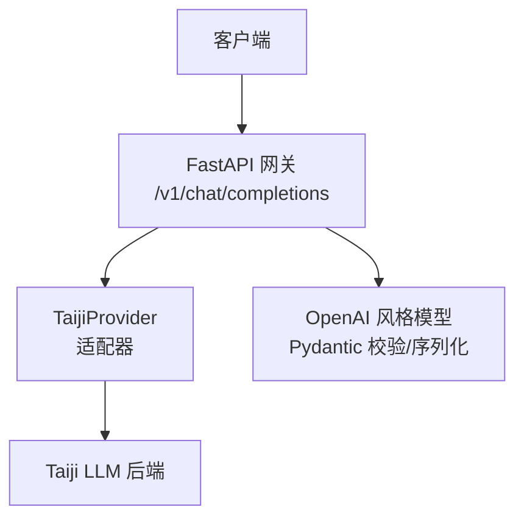
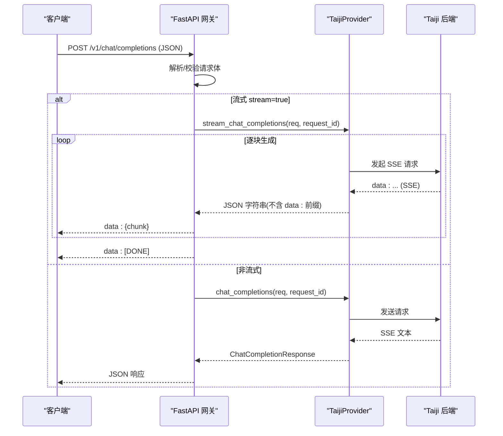
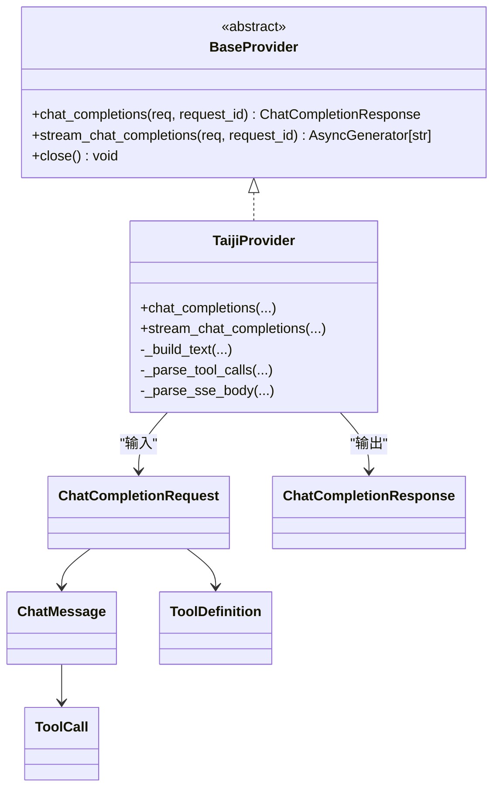

# 聊天完成 API

<cite>
**本文引用的文件**   
- [main.py](file://src/openai_provider/main.py)
- [openai.py](file://src/openai_provider/models/openai.py)
- [taiji.py](file://src/openai_provider/providers/taiji.py)
- [base.py](file://src/openai_provider/providers/base.py)
- [exceptions.py](file://src/openai_provider/exceptions.py)
- [test_03_chat_streaming.py](file://tests/e2e/test_03_chat_streaming.py)
- [test_04_tool_calls.py](file://tests/e2e/test_04_tool_calls.py)
- [test_05_error_handling.py](file://tests/e2e/test_05_error_handling.py)
- [conftest.py](file://tests/e2e/conftest.py)
</cite>

## 目录
1. [简介](#简介)
2. [项目结构](#项目结构)
3. [核心组件](#核心组件)
4. [架构总览](#架构总览)
5. [详细组件分析](#详细组件分析)
6. [依赖关系分析](#依赖关系分析)
7. [性能与限制](#性能与限制)
8. [故障排查指南](#故障排查指南)
9. [结论](#结论)
10. [附录：请求/响应规范与示例](#附录请求响应规范与示例)

## 简介
本文件为 /v1/chat/completions 端点的完整 API 文档，面向使用 OpenAI 兼容接口的客户端。该端点支持非流式与流式（SSE）两种模式，并原生支持工具调用（tool_calls）。服务端基于 FastAPI 实现，将请求转换为后端 Taiji LLM 的调用，并以 OpenAI 风格返回结果。

## 项目结构
本项目采用“网关 + Provider”的分层设计：
- 网关层（FastAPI）：负责路由、鉴权、请求解析、错误统一格式、SSE 封装。
- Provider 层：将 OpenAI 请求适配到具体后端（当前为 Taiji），处理文本构建、SSE 解析、工具调用提取等。
- 模型层：定义 OpenAI 风格的请求/响应 Pydantic 模型，确保字段校验与序列化一致性。

图表来源
- [main.py:134-257](file://src/openai_provider/main.py#L134-L257)
- [taiji.py:46-120](file://src/openai_provider/providers/taiji.py#L46-L120)
- [openai.py:83-101](file://src/openai_provider/models/openai.py#L83-L101)

章节来源
- [main.py:1-342](file://src/openai_provider/main.py#L1-L342)
- [openai.py:1-177](file://src/openai_provider/models/openai.py#L1-L177)

## 核心组件
- 网关入口与路由：提供 /v1/chat/completions，统一鉴权、日志、错误体格式化，支持 SSE。
- Provider 适配器：构造后端请求、解析 SSE、提取 tool_calls、剥离思考标签、统计 token。
- 模型定义：ChatCompletionRequest/Response、流式 chunk、工具定义与调用对象。
- 异常体系：区分超时、HTTP 错误、业务错误、网络错误，便于上层统一处理。

章节来源
- [main.py:134-257](file://src/openai_provider/main.py#L134-L257)
- [taiji.py:520-600](file://src/openai_provider/providers/taiji.py#L520-L600)
- [openai.py:83-101](file://src/openai_provider/models/openai.py#L83-L101)
- [exceptions.py:1-40](file://src/openai_provider/exceptions.py#L1-L40)

## 架构总览
以下序列图展示一次完整的非流式调用流程；流式流程类似，但返回的是 SSE 数据块。

图表来源
- [main.py:134-257](file://src/openai_provider/main.py#L134-L257)
- [taiji.py:670-780](file://src/openai_provider/providers/taiji.py#L670-L780)
- [taiji.py:782-800](file://src/openai_provider/providers/taiji.py#L782-L800)

## 详细组件分析

### 端点：POST /v1/chat/completions
- 方法：POST
- 路径：/v1/chat/completions
- 内容类型：application/json
- 认证：可选。若配置了 API_KEY，需在 Authorization: Bearer <key> 中携带。未配置时不强制鉴权。
- 行为：
  - 读取原始请求体并记录日志。
  - 使用 Pydantic 模型校验请求体。
  - 根据 stream 字段选择流式或非流式处理。
  - 统一错误体格式，遵循 OpenAI 风格。

章节来源
- [main.py:134-257](file://src/openai_provider/main.py#L134-L257)
- [main.py:108-126](file://src/openai_provider/main.py#L108-L126)

#### 请求参数说明（OpenAI 兼容）
- model: string，必填。当前固定为 "taiji"。
- messages: array[object]，必填。消息列表，每条包含：
  - role: enum["system","user","assistant","tool"]
  - content: string | null
  - name: string | null
  - tool_call_id: string | null（当 role=tool 时使用）
  - tool_calls: array[ToolCall] | null（当 role=assistant 时使用）
- temperature: number，范围 [0, 2]，默认 0.7
- max_tokens: integer，>=1，默认不限制
- top_p: number，范围 [0, 1]，默认 1.0
- n: integer，范围 [1, 10]，默认 1
- stream: boolean，默认 false
- stop: string | array[string] | null
- presence_penalty: number，范围 [-2, 2]，默认 0
- frequency_penalty: number，范围 [-2, 2]，默认 0
- user: string | null
- tools: array[ToolDefinition] | null
- tool_choice: string | ToolChoice | null

章节来源
- [openai.py:83-101](file://src/openai_provider/models/openai.py#L83-L101)
- [openai.py:73-81](file://src/openai_provider/models/openai.py#L73-L81)
- [openai.py:31-67](file://src/openai_provider/models/openai.py#L31-L67)

#### 工具定义与调用
- ToolDefinition：type="function"，function.name/description/parameters
- ToolCall：id/type/function.name/function.arguments
- 支持在 assistant 消息中返回 tool_calls，并在后续以 role="tool" 的消息回传执行结果，形成多轮往返。

章节来源
- [openai.py:31-67](file://src/openai_provider/models/openai.py#L31-L67)
- [openai.py:73-81](file://src/openai_provider/models/openai.py#L73-L81)
- [test_04_tool_calls.py:50-102](file://tests/e2e/test_04_tool_calls.py#L50-L102)

#### 非流式响应
- object: "chat.completion"
- choices: array[choice]
  - message.role = "assistant"
  - message.content | reasoning_content | tool_calls
  - finish_reason: "stop" 或 "tool_calls"
- usage: {prompt_tokens, completion_tokens, total_tokens}

章节来源
- [openai.py:133-143](file://src/openai_provider/models/openai.py#L133-L143)
- [openai.py:107-122](file://src/openai_provider/models/openai.py#L107-L122)
- [taiji.py:760-780](file://src/openai_provider/providers/taiji.py#L760-L780)

#### 流式响应（SSE）
- Content-Type: text/event-stream
- 每个数据块为 JSON，object="chat.completion.chunk"
- 首个 chunk 包含 delta.role="assistant"
- 最后一个有效 chunk 包含 finish_reason（通常为 "stop" 或 "tool_calls"），且可能包含 usage
- 结尾以 data: [DONE] 结束
- 支持增量 tool_calls（delta.tool_calls 拼接后得到完整函数名与参数）

章节来源
- [main.py:185-218](file://src/openai_provider/main.py#L185-L218)
- [openai.py:149-177](file://src/openai_provider/models/openai.py#L149-L177)
- [test_03_chat_streaming.py:11-70](file://tests/e2e/test_03_chat_streaming.py#L11-L70)
- [test_03_chat_streaming.py:72-108](file://tests/e2e/test_03_chat_streaming.py#L72-L108)
- [test_04_tool_calls.py:104-154](file://tests/e2e/test_04_tool_calls.py#L104-L154)

#### 工具调用机制（tool_calls）
- 支持三种输出格式的解析：DSML XML、标准 XML、JSON
- 自动从文本中剥离 tool_calls 块，保留纯文本 content
- 当检测到 tool_calls 时，finish_reason 设为 "tool_calls"
- 流式模式下，delta.tool_calls 可增量拼接出完整 function.name 与 arguments

章节来源
- [taiji.py:350-482](file://src/openai_provider/providers/taiji.py#L350-L482)
- [taiji.py:484-499](file://src/openai_provider/providers/taiji.py#L484-L499)
- [taiji.py:722-735](file://src/openai_provider/providers/taiji.py#L722-L735)
- [test_04_tool_calls.py:104-154](file://tests/e2e/test_04_tool_calls.py#L104-L154)

#### 思考过程（reasoning_content）
- 支持从响应中提取 think 标签内的推理内容，作为 reasoning_content 返回
- 流式与非流式均支持，最终 content 会去除 think 标签内容

章节来源
- [taiji.py:511-518](file://src/openai_provider/providers/taiji.py#L511-L518)
- [openai.py:107-114](file://src/openai_provider/models/openai.py#L107-L114)
- [openai.py:149-156](file://src/openai_provider/models/openai.py#L149-L156)

#### 令牌计数与截断策略
- 请求侧按角色、名称、tool_calls 等估算 prompt_tokens
- 响应侧优先使用后端返回的 token 信息，否则基于文本估算
- 超长上下文会被智能截断，保留 system 与最近对话片段，并插入提示

章节来源
- [taiji.py:77-120](file://src/openai_provider/providers/taiji.py#L77-L120)
- [taiji.py:206-318](file://src/openai_provider/providers/taiji.py#L206-L318)
- [taiji.py:737-758](file://src/openai_provider/providers/taiji.py#L737-L758)

## 依赖关系分析
- 网关依赖 Provider 抽象接口与具体实现（TaijiProvider）
- Provider 依赖 OpenAI 风格模型进行校验与序列化
- 异常体系贯穿 Provider 与网关，保证错误体一致

图表来源
- [base.py:7-46](file://src/openai_provider/providers/base.py#L7-L46)
- [taiji.py:46-120](file://src/openai_provider/providers/taiji.py#L46-L120)
- [openai.py:83-101](file://src/openai_provider/models/openai.py#L83-L101)
- [openai.py:73-81](file://src/openai_provider/models/openai.py#L73-L81)
- [openai.py:31-67](file://src/openai_provider/models/openai.py#L31-L67)

章节来源
- [base.py:1-46](file://src/openai_provider/providers/base.py#L1-L46)
- [taiji.py:46-120](file://src/openai_provider/providers/taiji.py#L46-L120)
- [openai.py:1-177](file://src/openai_provider/models/openai.py#L1-L177)

## 性能与限制
- 超时：Provider 层对后端请求设置超时，超时异常被捕获并转为 502 错误体。
- 限流/业务错误：后端可能用 HTTP 200 包装业务错误，网关会检测并转为 provider_error。
- 大请求：超长上下文会被智能截断，避免超出后端限制。
- 并发：网关无状态，可水平扩展；测试覆盖并发场景。

章节来源
- [taiji.py:670-707](file://src/openai_provider/providers/taiji.py#L670-L707)
- [taiji.py:712-721](file://src/openai_provider/providers/taiji.py#L712-L721)
- [taiji.py:206-318](file://src/openai_provider/providers/taiji.py#L206-L318)
- [test_05_error_handling.py:79-107](file://tests/e2e/test_05_error_handling.py#L79-L107)

## 故障排查指南
- 请求体无效（空、非法 JSON、role 非法）：返回 400/422，error.type="invalid_request_error"
- 认证失败（Bearer Token 不正确）：返回 401，error.type="authentication_error"
- 后端网络/超时：返回 502，error.type="provider_error"
- 后端业务错误（err/msg/code）：返回 502，error.type="provider_error"
- 不支持的路径/方法：返回 404/405，error.type 依状态码而定

章节来源
- [main.py:163-183](file://src/openai_provider/main.py#L163-L183)
- [main.py:221-241](file://src/openai_provider/main.py#L221-L241)
- [main.py:319-330](file://src/openai_provider/main.py#L319-L330)
- [test_05_error_handling.py:9-55](file://tests/e2e/test_05_error_handling.py#L9-L55)
- [test_e2e.py:830-841](file://tests/test_e2e.py#L830-L841)

## 结论
/v1/chat/completions 提供了与 OpenAI 一致的 Chat Completions 接口，支持非流式与流式响应，并具备完善的工具调用支持与错误处理。通过 Provider 抽象，系统易于扩展新的后端。

## 附录：请求/响应规范与示例

### 非流式请求示例
- 最小请求体：包含 model 与 messages
- 带工具调用：传入 tools，期望返回 tool_calls 与 finish_reason="tool_calls"

章节来源
- [conftest.py:94-105](file://tests/e2e/conftest.py#L94-L105)
- [test_04_tool_calls.py:50-102](file://tests/e2e/test_04_tool_calls.py#L50-L102)

### 非流式响应示例
- object="chat.completion"
- choices[0].message 包含 content/reasoning_content/tool_calls
- usage 包含 prompt_tokens/completion_tokens/total_tokens

章节来源
- [openai.py:133-143](file://src/openai_provider/models/openai.py#L133-L143)
- [taiji.py:760-780](file://src/openai_provider/providers/taiji.py#L760-L780)

### 流式请求示例
- 在请求体中添加 stream=true
- 服务端返回 text/event-stream，每行 data: {json}，最后 data: [DONE]

章节来源
- [test_03_chat_streaming.py:11-70](file://tests/e2e/test_03_chat_streaming.py#L11-L70)
- [test_03_chat_streaming.py:72-108](file://tests/e2e/test_03_chat_streaming.py#L72-L108)

### 流式响应示例
- 首个 chunk 包含 delta.role="assistant"
- 中间 chunk 包含增量 content 或 tool_calls
- 倒数第二个 chunk 包含 finish_reason
- 末尾 data: [DONE]

章节来源
- [test_03_chat_streaming.py:30-43](file://tests/e2e/test_03_chat_streaming.py#L30-L43)
- [test_03_chat_streaming.py:72-108](file://tests/e2e/test_03_chat_streaming.py#L72-L108)

### 工具调用（tool_calls）示例
- 非流式：assistant.message.tool_calls 存在，finish_reason="tool_calls"
- 流式：delta.tool_calls 增量拼接，最终得到完整 function.name 与 arguments
- 多轮往返：assistant(tool_calls) → tool(result) → assistant(content)

章节来源
- [test_04_tool_calls.py:50-102](file://tests/e2e/test_04_tool_calls.py#L50-L102)
- [test_04_tool_calls.py:104-154](file://tests/e2e/test_04_tool_calls.py#L104-L154)
- [test_04_tool_calls.py:189-226](file://tests/e2e/test_04_tool_calls.py#L189-L226)

### 客户端集成（Python OpenAI SDK）
- 将 base_url 指向本服务地址
- 使用 openai.OpenAI(base_url=..., api_key=...) 初始化客户端
- 调用 client.chat.completions.create(model="taiji", messages=[...], stream=True/False)
- 流式模式下迭代 response 获取增量内容或 tool_calls

章节来源
- [conftest.py:94-105](file://tests/e2e/conftest.py#L94-L105)
- [test_03_chat_streaming.py:11-70](file://tests/e2e/test_03_chat_streaming.py#L11-L70)
- [test_04_tool_calls.py:50-102](file://tests/e2e/test_04_tool_calls.py#L50-L102)

### 错误处理与状态码
- 400/422：请求体无效或字段校验失败，error.type="invalid_request_error"
- 401：认证失败（当配置 API_KEY 时），error.type="authentication_error"
- 404/405：路径或方法不支持，error.type 依状态码而定
- 502：后端错误或超时，error.type="provider_error"

章节来源
- [main.py:163-183](file://src/openai_provider/main.py#L163-L183)
- [main.py:221-241](file://src/openai_provider/main.py#L221-L241)
- [main.py:319-330](file://src/openai_provider/main.py#L319-L330)
- [test_05_error_handling.py:9-55](file://tests/e2e/test_05_error_handling.py#L9-L55)
- [test_e2e.py:830-841](file://tests/test_e2e.py#L830-L841)