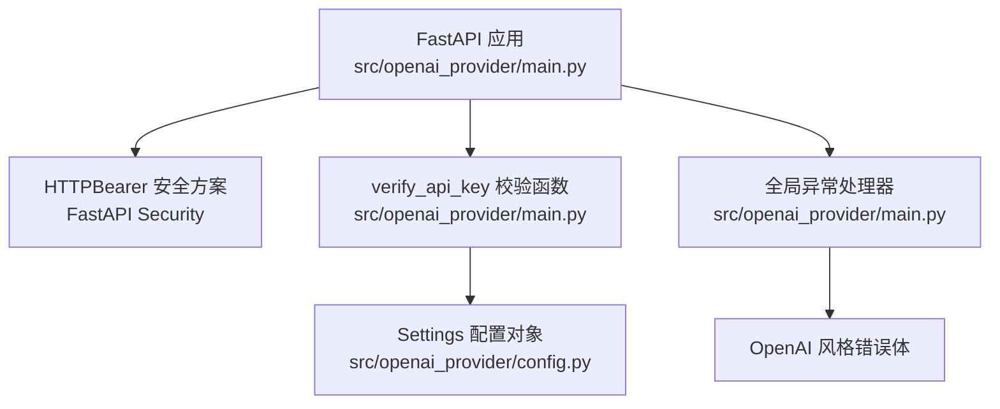
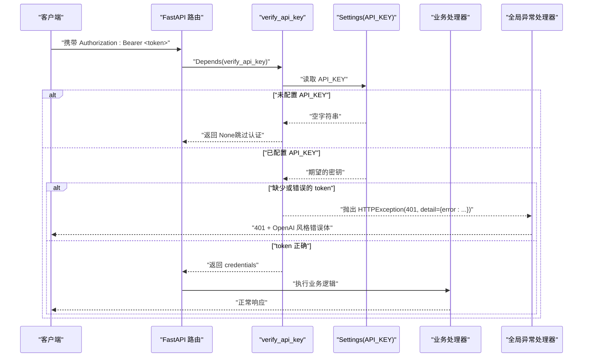
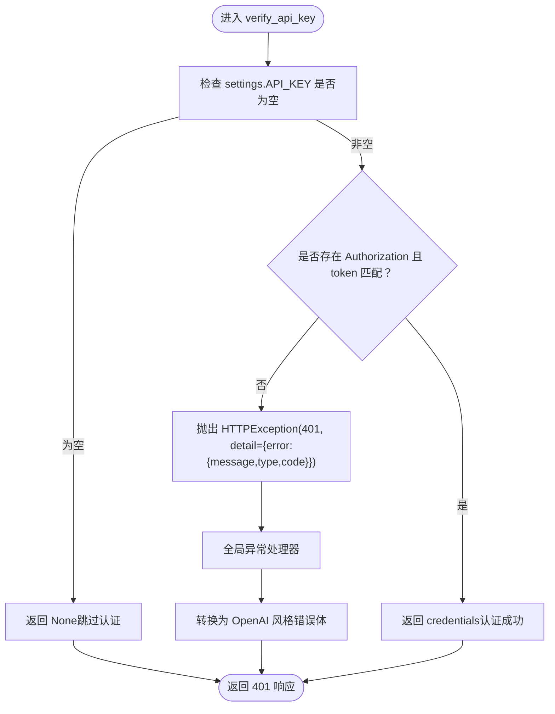
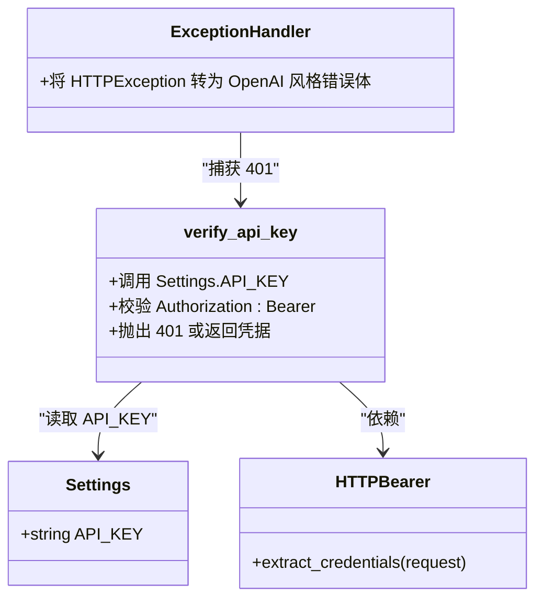

# 认证机制

<cite>
**本文引用的文件**
- [main.py](file://src/openai_provider/main.py)
- [config.py](file://src/openai_provider/config.py)
- [exceptions.py](file://src/openai_provider/exceptions.py)
- [test_chat.py](file://tests/test_chat.py)
- [test_hermes_compatibility.py](file://tests/test_hermes_compatibility.py)
- [test_05_error_handling.py](file://tests/e2e/test_05_error_handling.py)
</cite>

## 目录
1. [简介](#简介)
2. [项目结构](#项目结构)
3. [核心组件](#核心组件)
4. [架构总览](#架构总览)
5. [详细组件分析](#详细组件分析)
6. [依赖关系分析](#依赖关系分析)
7. [性能与安全性考虑](#性能与安全性考虑)
8. [故障排查指南](#故障排查指南)
9. [结论](#结论)
10. [附录：客户端集成示例与安全最佳实践](#附录客户端集成示例与安全最佳实践)

## 简介
本文件面向 API 使用者与维护者，系统化说明本服务的 Bearer Token 认证机制、API_KEY 环境变量配置方式、认证中间件工作原理、未配置 API_KEY 时的行为、认证失败的错误响应格式与状态码，并提供客户端集成示例与安全最佳实践。

## 项目结构
认证相关实现集中在应用主入口与配置模块中，并通过测试用例覆盖关键路径。

图表来源
- [main.py:101-126](file://src/openai_provider/main.py#L101-L126)
- [main.py:319-330](file://src/openai_provider/main.py#L319-L330)
- [config.py:35-36](file://src/openai_provider/config.py#L35-L36)

章节来源
- [main.py:101-126](file://src/openai_provider/main.py#L101-L126)
- [config.py:35-36](file://src/openai_provider/config.py#L35-L36)

## 核心组件
- HTTPBearer 安全方案：用于从请求头中提取 Authorization: Bearer <token>。
- verify_api_key 依赖注入函数：根据是否配置 API_KEY 决定是否启用认证，并校验 token。
- Settings 配置对象：提供 API_KEY 环境变量读取与默认值。
- 全局异常处理器：将 HTTPException 转换为 OpenAI 风格的错误体（包含 error.message、error.type、error.code）。

章节来源
- [main.py:105-125](file://src/openai_provider/main.py#L105-L125)
- [config.py:35-36](file://src/openai_provider/config.py#L35-L36)
- [main.py:319-330](file://src/openai_provider/main.py#L319-L330)

## 架构总览
下图展示了认证在请求处理链路中的位置与数据流。

图表来源
- [main.py:105-125](file://src/openai_provider/main.py#L105-L125)
- [main.py:319-330](file://src/openai_provider/main.py#L319-L330)
- [config.py:35-36](file://src/openai_provider/config.py#L35-L36)

## 详细组件分析

### Bearer Token 认证实现
- 使用 FastAPI 的 HTTPBearer 安全方案，自动从请求头解析 Authorization: Bearer <token>。
- 通过 Depends(security) 注入到 verify_api_key 函数，得到可选的凭据对象。
- 若 settings.API_KEY 为空，则直接放行（不启用认证）。
- 若已设置 API_KEY，但请求未携带 Authorization 头或 token 不匹配，则抛出 401 异常。

章节来源
- [main.py:105-125](file://src/openai_provider/main.py#L105-L125)
- [config.py:35-36](file://src/openai_provider/config.py#L35-L36)

### API_KEY 环境变量设置与使用
- 配置项名称：API_KEY
- 读取顺序：环境变量 > .env 文件 > 默认值（空字符串）
- 当 API_KEY 为空时，所有受保护端点均无需认证即可访问。
- 当 API_KEY 非空时，必须携带正确的 Authorization: Bearer <token> 才能访问。

章节来源
- [config.py:18-22](file://src/openai_provider/config.py#L18-L22)
- [config.py:35-36](file://src/openai_provider/config.py#L35-L36)

### 认证中间件工作原理与未配置 API_KEY 的行为
- 每个需要认证的端点通过 _auth=Depends(verify_api_key) 声明依赖。
- 当 API_KEY 未配置时，verify_api_key 直接返回 None，相当于“关闭认证”。
- 当 API_KEY 已配置时，任何缺失或不匹配的 Bearer token 都会触发 401 错误。

章节来源
- [main.py:108-125](file://src/openai_provider/main.py#L108-L125)
- [main.py:134-137](file://src/openai_provider/main.py#L134-L137)
- [main.py:272-278](file://src/openai_provider/main.py#L272-L278)
- [main.py:281-286](file://src/openai_provider/main.py#L281-L286)

### 认证失败的错误响应格式与状态码
- 状态码：401
- 响应体为 OpenAI 风格错误体，包含以下字段：
  - error.message：错误描述
  - error.type：authentication_error
  - error.code：invalid_api_key
- 该格式由全局异常处理器统一转换，确保与其他错误类型保持一致。

图表来源
- [main.py:108-125](file://src/openai_provider/main.py#L108-L125)
- [main.py:319-330](file://src/openai_provider/main.py#L319-L330)

章节来源
- [main.py:114-124](file://src/openai_provider/main.py#L114-L124)
- [main.py:319-330](file://src/openai_provider/main.py#L319-L330)

### 受保护的端点范围
- /v1/chat/completions：聊天补全接口
- /v1/models：列出模型
- /v1/models/{model_id}：获取指定模型
- /api/v1/models：模型列表别名

以上端点均通过 _auth=Depends(verify_api_key) 进行认证保护。

章节来源
- [main.py:134-137](file://src/openai_provider/main.py#L134-L137)
- [main.py:272-278](file://src/openai_provider/main.py#L272-L278)
- [main.py:281-286](file://src/openai_provider/main.py#L281-L286)
- [main.py:289-292](file://src/openai_provider/main.py#L289-L292)

### 测试覆盖的关键场景
- 未配置 API_KEY 时，无需认证可访问受保护端点。
- 配置 API_KEY 后，携带正确 Bearer token 可通过。
- 配置 API_KEY 后，携带错误或缺失 token 返回 401，且错误体符合 OpenAI 风格。
- Hermes 兼容场景下，同样遵循 Bearer token 校验规则。

章节来源
- [test_chat.py:455-507](file://tests/test_chat.py#L455-L507)
- [test_hermes_compatibility.py:386-405](file://tests/test_hermes_compatibility.py#L386-L405)
- [test_05_error_handling.py:111-127](file://tests/e2e/test_05_error_handling.py#L111-L127)

## 依赖关系分析
- main.py 依赖 config.Settings 以读取 API_KEY。
- main.py 使用 FastAPI 的 HTTPBearer 和 HTTPAuthorizationCredentials 完成凭据提取。
- 全局异常处理器统一输出 OpenAI 风格错误体，保证客户端一致性。

图表来源
- [main.py:105-125](file://src/openai_provider/main.py#L105-L125)
- [main.py:319-330](file://src/openai_provider/main.py#L319-L330)
- [config.py:35-36](file://src/openai_provider/config.py#L35-L36)

章节来源
- [main.py:105-125](file://src/openai_provider/main.py#L105-L125)
- [main.py:319-330](file://src/openai_provider/main.py#L319-L330)
- [config.py:35-36](file://src/openai_provider/config.py#L35-L36)

## 性能与安全性考虑
- 认证开销极低：仅比较字符串，无外部 I/O。
- 建议在生产环境始终配置 API_KEY，避免服务暴露于公网。
- 传输层务必使用 HTTPS，防止 Bearer token 被窃听。
- 定期轮换 API_KEY，最小化泄露影响面。
- 结合网关或反向代理进行速率限制与 IP 白名单，增强防护。

[本节为通用指导，不涉及具体文件分析]

## 故障排查指南
- 确认 API_KEY 是否正确配置（环境变量或 .env），并确保其非空。
- 检查请求头是否包含 Authorization: Bearer <token>，注意大小写与空格。
- 若返回 401，查看响应体中的 error.type 与 error.code，确认是否为 authentication_error 与 invalid_api_key。
- 若未配置 API_KEY，预期行为是不需要认证；如需强制认证，请设置 API_KEY。

章节来源
- [main.py:108-125](file://src/openai_provider/main.py#L108-L125)
- [main.py:319-330](file://src/openai_provider/main.py#L319-L330)
- [config.py:35-36](file://src/openai_provider/config.py#L35-L36)

## 结论
本服务采用轻量级的 Bearer Token 认证机制，通过 API_KEY 环境变量控制是否启用认证。未配置 API_KEY 时，认证功能默认关闭；一旦配置，所有受保护端点均需携带正确的 Authorization: Bearer <token>。认证失败统一返回 401 与 OpenAI 风格错误体，便于客户端一致化处理。

[本节为总结性内容，不涉及具体文件分析]

## 附录：客户端集成示例与安全最佳实践

### 客户端集成示例（Python requests）
- 在未配置 API_KEY 的情况下，可直接调用受保护端点。
- 在已配置 API_KEY 的情况下，需在请求头中添加 Authorization: Bearer <your-api-key>。

示例路径参考：
- [test_chat.py:466-477](file://tests/test_chat.py#L466-L477)
- [test_hermes_compatibility.py:386-405](file://tests/test_hermes_compatibility.py#L386-L405)

### 客户端集成示例（cURL）
- 未配置 API_KEY：
  - curl https://host/v1/models
- 已配置 API_KEY：
  - curl -H "Authorization: Bearer YOUR_API_KEY" https://host/v1/models

示例路径参考：
- [test_chat.py:466-477](file://tests/test_chat.py#L466-L477)

### 安全最佳实践
- 生产环境必须设置 API_KEY，并在部署时通过环境变量或密钥管理服务注入。
- 使用 HTTPS 传输，避免明文传递 Bearer token。
- 对 API_KEY 进行最小权限与生命周期管理，定期轮换。
- 结合 WAF/网关策略，限制来源 IP 与请求频率。
- 记录并监控 401 错误，及时发现异常访问。

[本节为通用指导，不涉及具体文件分析]