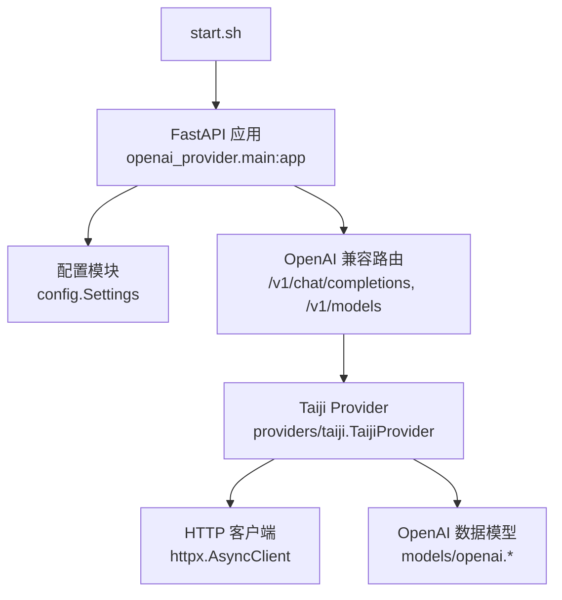
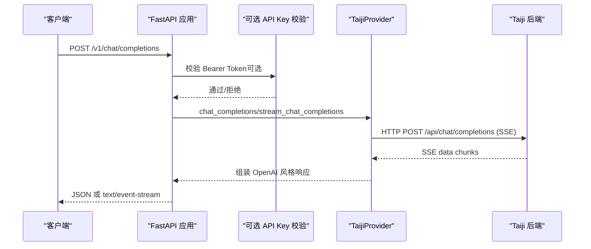
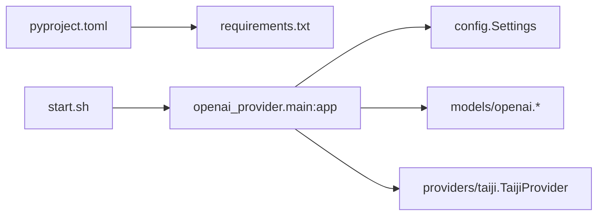

# 快速开始

<cite>
**本文引用的文件**
- [pyproject.toml](file://pyproject.toml)
- [requirements.txt](file://requirements.txt)
- [start.sh](file://start.sh)
- [src/openai_provider/main.py](file://src/openai_provider/main.py)
- [src/openai_provider/config.py](file://src/openai_provider/config.py)
- [src/openai_provider/providers/taiji.py](file://src/openai_provider/providers/taiji.py)
- [src/openai_provider/models/openai.py](file://src/openai_provider/models/openai.py)
- [tests/e2e/conftest.py](file://tests/e2e/conftest.py)
- [tests/e2e/test_01_health_models.py](file://tests/e2e/test_01_health_models.py)
- [scripts/probe_taiji_limit.py](file://scripts/probe_taiji_limit.py)
</cite>

## 目录
1. [简介](#简介)
2. [项目结构](#项目结构)
3. [核心组件](#核心组件)
4. [架构总览](#架构总览)
5. [详细组件分析](#详细组件分析)
6. [依赖关系分析](#依赖关系分析)
7. [性能与容量建议](#性能与容量建议)
8. [故障排除指南](#故障排除指南)
9. [结论](#结论)
10. [附录：常用命令与配置模板](#附录常用命令与配置模板)

## 简介
本指南帮助你在几分钟内运行并测试 OpenAI 兼容的 Taiji 网关。你将完成环境准备、依赖安装、配置设置、服务启动以及基本 API 验证，确保服务正常工作。

## 项目结构
仓库采用分层组织：
- src/openai_provider：应用源码（FastAPI 路由、Provider 实现、数据模型、配置）
- tests/e2e：端到端测试用例（健康检查、模型列表、聊天接口等）
- scripts：辅助脚本（如探测后端限制）
- start.sh：一键启动脚本（支持 dev/prod 模式与环境变量）

图表来源
- [start.sh:1-123](file://start.sh#L1-L123)
- [src/openai_provider/main.py:1-342](file://src/openai_provider/main.py#L1-L342)
- [src/openai_provider/config.py:1-56](file://src/openai_provider/config.py#L1-L56)
- [src/openai_provider/providers/taiji.py:1-800](file://src/openai_provider/providers/taiji.py#L1-L800)
- [src/openai_provider/models/openai.py:1-177](file://src/openai_provider/models/openai.py#L1-L177)

章节来源
- [pyproject.toml:1-55](file://pyproject.toml#L1-L55)
- [requirements.txt:1-13](file://requirements.txt#L1-L13)
- [start.sh:1-123](file://start.sh#L1-L123)

## 核心组件
- FastAPI 应用与路由：提供 OpenAI 兼容端点（/v1/chat/completions、/v1/models、/health、/version 等），统一错误格式与 CORS。
- 配置中心：基于 pydantic-settings 的环境变量读取与校验，支持 .env 文件。
- Taiji Provider：将 OpenAI 请求转换为 Taiji 后端调用，处理 SSE 解析、工具调用提取、思考内容分离与 token 统计。
- 数据模型：OpenAI 风格的请求/响应 Pydantic 模型，保证序列化行为一致。

章节来源
- [src/openai_provider/main.py:1-342](file://src/openai_provider/main.py#L1-L342)
- [src/openai_provider/config.py:1-56](file://src/openai_provider/config.py#L1-L56)
- [src/openai_provider/providers/taiji.py:1-800](file://src/openai_provider/providers/taiji.py#L1-L800)
- [src/openai_provider/models/openai.py:1-177](file://src/openai_provider/models/openai.py#L1-L177)

## 架构总览
下图展示了从客户端到 Taiji 后端的完整请求链路，包括认证、CORS、日志、SSE 流式与非流式处理。

图表来源
- [src/openai_provider/main.py:134-257](file://src/openai_provider/main.py#L134-L257)
- [src/openai_provider/providers/taiji.py:670-800](file://src/openai_provider/providers/taiji.py#L670-L800)

## 详细组件分析

### 配置模块（Settings）
- 读取顺序：环境变量 > .env 文件 > 默认值
- 关键项：
  - TAIJI_BASE_URL、TAIJI_API_KEY、TAIJI_SESSION_ID、TAIJI_SESSION_COOKIE
  - APP_HOST、APP_PORT
  - MODEL_CONTEXT_LENGTH、MODEL_MAX_COMPLETION_TOKENS
  - CORS_ORIGINS、API_KEY（可选）
- 提供 content_fields_list 属性用于解析内容字段优先级。

章节来源
- [src/openai_provider/config.py:12-56](file://src/openai_provider/config.py#L12-L56)

### FastAPI 应用与路由
- 生命周期：初始化日志、关闭时清理 Provider 资源
- 中间件：CORS（可配置允许来源）
- 认证：可选 Bearer Token（当 API_KEY 未配置则跳过）
- 主要端点：
  - GET /health：健康检查
  - GET /version：版本信息
  - GET /v1/models、GET /v1/models/{model_id}：模型发现
  - POST /v1/chat/completions：非流式与流式聊天补全
- 异常处理：统一返回 OpenAI 风格错误体

章节来源
- [src/openai_provider/main.py:81-131](file://src/openai_provider/main.py#L81-L131)
- [src/openai_provider/main.py:134-257](file://src/openai_provider/main.py#L134-L257)
- [src/openai_provider/main.py:272-317](file://src/openai_provider/main.py#L272-L317)
- [src/openai_provider/main.py:319-331](file://src/openai_provider/main.py#L319-L331)

### Taiji Provider
- 请求构建：将 OpenAI messages 转为纯文本，智能截断以适配后端长度限制
- 工具调用：支持 XML/JSON 格式的 tool_calls 解析与剥离
- 思考内容：分离 <think>...</think> 为 reasoning_content
- Token 统计：优先使用后端返回的 token 信息，否则估算
- 流式处理：按 SSE 分块生成 OpenAI 风格的 chunk，最后发送 [DONE]

章节来源
- [src/openai_provider/providers/taiji.py:206-318](file://src/openai_provider/providers/taiji.py#L206-L318)
- [src/openai_provider/providers/taiji.py:350-500](file://src/openai_provider/providers/taiji.py#L350-L500)
- [src/openai_provider/providers/taiji.py:520-600](file://src/openai_provider/providers/taiji.py#L520-L600)
- [src/openai_provider/providers/taiji.py:633-668](file://src/openai_provider/providers/taiji.py#L633-L668)
- [src/openai_provider/providers/taiji.py:670-780](file://src/openai_provider/providers/taiji.py#L670-L780)

### OpenAI 数据模型
- 基础模型：默认排除 None 字段，匹配 OpenAI 行为
- 请求模型：ChatCompletionRequest（含 temperature、max_tokens、tools、tool_choice 等）
- 响应模型：ChatCompletionResponse、Usage、流式 ChatCompletionStreamResponse

章节来源
- [src/openai_provider/models/openai.py:12-25](file://src/openai_provider/models/openai.py#L12-L25)
- [src/openai_provider/models/openai.py:83-101](file://src/openai_provider/models/openai.py#L83-L101)
- [src/openai_provider/models/openai.py:133-177](file://src/openai_provider/models/openai.py#L133-L177)

## 依赖关系分析
- 运行时依赖：fastapi、uvicorn[standard]、httpx、pydantic、pydantic-settings
- 开发依赖：pytest、pytest-asyncio、mypy、ruff
- 启动入口：start.sh 负责检测 Python、依赖、设置 PYTHONPATH 并启动 uvicorn

图表来源
- [pyproject.toml:1-55](file://pyproject.toml#L1-L55)
- [requirements.txt:1-13](file://requirements.txt#L1-L13)
- [start.sh:1-123](file://start.sh#L1-L123)

章节来源
- [pyproject.toml:1-55](file://pyproject.toml#L1-L55)
- [requirements.txt:1-13](file://requirements.txt#L1-L13)
- [start.sh:1-123](file://start.sh#L1-L123)

## 性能与容量建议
- 文本长度限制：后端单条文本最大字符数约 830000，网关保守设置为 800000；可通过 TAIJI_MAX_TEXT_LENGTH 调整
- 上下文长度与最大输出 tokens：通过 MODEL_CONTEXT_LENGTH、MODEL_MAX_COMPLETION_TOKENS 暴露给客户端
- 并发与 Worker：生产模式可使用多 worker（UVICORN_WORKERS），根据 CPU 核数与负载调优
- 超时与重试：Provider 内部 httpx 超时为 60s；E2E 测试包含对 502 的重试逻辑

章节来源
- [src/openai_provider/config.py:24-47](file://src/openai_provider/config.py#L24-L47)
- [src/openai_provider/providers/taiji.py:556-593](file://src/openai_provider/providers/taiji.py#L556-L593)
- [tests/e2e/conftest.py:22-40](file://tests/e2e/conftest.py#L22-L40)

## 故障排除指南
- 无法访问后端
  - 确认 TAIJI_BASE_URL、TAIJI_API_KEY、TAIJI_SESSION_COOKIE 已正确配置
  - 参考探针脚本定位后端限制与错误码
- 端口占用或服务未启动
  - 使用 start.sh --port 指定端口，查看控制台输出
  - 通过 /health 端点验证服务存活
- 认证失败
  - 若设置了 API_KEY，需在请求头携带正确的 Bearer Token
- 404/405 错误
  - 网关会将 HTTPException 转换为 OpenAI 风格错误体，便于客户端统一处理
- 流式响应问题
  - 检查服务端是否返回 text/event-stream 且包含 data: 行与 [DONE] 结束标记

章节来源
- [src/openai_provider/main.py:319-331](file://src/openai_provider/main.py#L319-L331)
- [tests/e2e/test_01_health_models.py:92-103](file://tests/e2e/test_01_health_models.py#L92-L103)
- [scripts/probe_taiji_limit.py:26-76](file://scripts/probe_taiji_limit.py#L26-L76)

## 结论
通过以上步骤，你可以在几分钟内完成环境准备、安装依赖、配置参数、启动服务并进行基本 API 测试。该网关提供了 OpenAI 兼容的接口，同时具备完善的日志、错误处理与流式支持，适合快速集成与验证。

## 附录：常用命令与配置模板

- 环境准备
  - 安装 Python 3.11+
  - 安装依赖：pip install -r requirements.txt

- 启动服务
  - 开发模式（热重载）：bash start.sh dev --port 8080
  - 生产模式（单进程）：bash start.sh prod --port 8080
  - 生产模式（多 worker）：bash start.sh prod --port 8080 --workers 2

- 环境变量（可在 .env 中配置或通过 shell export）
  - TAIJI_BASE_URL：后端地址
  - TAIJI_API_KEY：后端鉴权密钥
  - TAIJI_SESSION_ID：会话标识（整数）
  - TAIJI_SESSION_COOKIE：会话 Cookie
  - APP_HOST：监听地址（默认 0.0.0.0）
  - APP_PORT：监听端口（默认 8080）
  - MODEL_CONTEXT_LENGTH：上下文长度（默认 200000）
  - MODEL_MAX_COMPLETION_TOKENS：最大输出 tokens（默认 4096）
  - CORS_ORIGINS：允许的跨域来源（逗号分隔，默认 *）
  - API_KEY：网关可选认证密钥（Bearer Token）

- 基本 API 测试
  - 健康检查：curl http://localhost:8080/health
  - 版本信息：curl http://localhost:8080/version
  - 模型列表：curl http://localhost:8080/v1/models
  - 非流式聊天：POST /v1/chat/completions，body 包含 model 与 messages
  - 流式聊天：同上，但增加 stream=true，接收 text/event-stream

- 端到端测试（需先启动服务）
  - 设置环境变量 E2E_BASE_URL=http://localhost:8080
  - 运行 pytest tests/e2e

章节来源
- [start.sh:1-123](file://start.sh#L1-L123)
- [src/openai_provider/config.py:12-56](file://src/openai_provider/config.py#L12-L56)
- [tests/e2e/conftest.py:1-40](file://tests/e2e/conftest.py#L1-L40)
- [tests/e2e/test_01_health_models.py:1-48](file://tests/e2e/test_01_health_models.py#L1-L48)