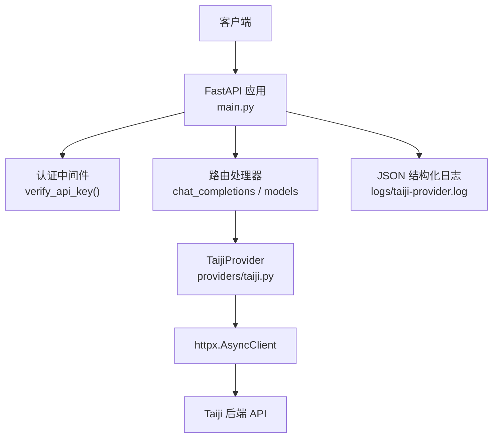
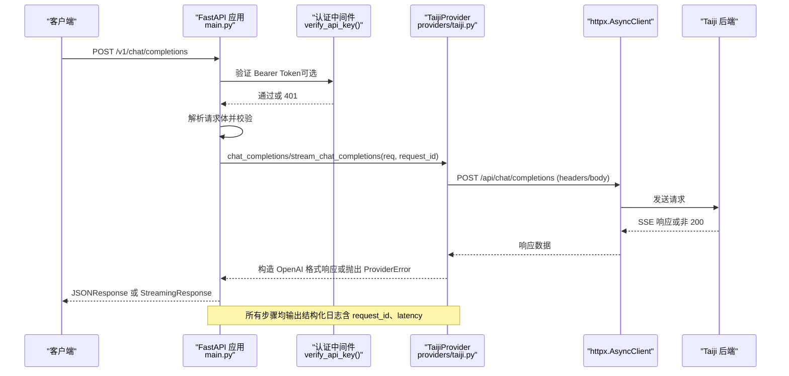
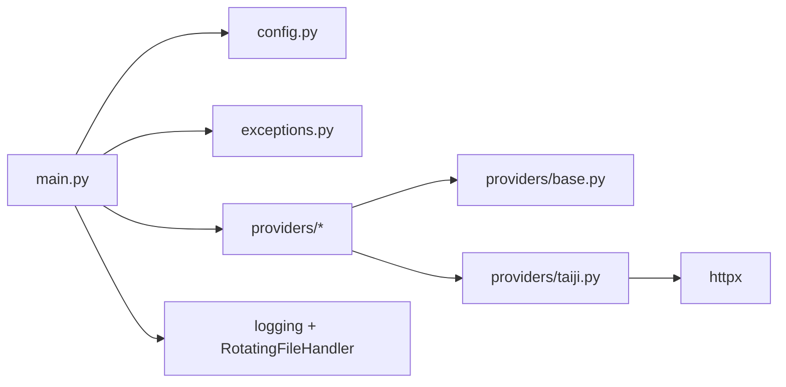

# 故障排除

<cite>
**本文引用的文件**   
- [main.py](file://src/openai_provider/main.py)
- [exceptions.py](file://src/openai_provider/exceptions.py)
- [config.py](file://src/openai_provider/config.py)
- [base.py](file://src/openai_provider/providers/base.py)
- [taiji.py](file://src/openai_provider/providers/taiji.py)
- [test_05_error_handling.py](file://tests/e2e/test_05_error_handling.py)
- [probe_taiji_limit.py](file://scripts/probe_taiji_limit.py)
- [start.sh](file://start.sh)
- [pyproject.toml](file://pyproject.toml)
</cite>

## 目录
1. [简介](#简介)
2. [项目结构](#项目结构)
3. [核心组件](#核心组件)
4. [架构总览](#架构总览)
5. [详细组件分析](#详细组件分析)
6. [依赖关系分析](#依赖关系分析)
7. [性能与容量规划](#性能与容量规划)
8. [故障排查指南](#故障排查指南)
9. [结论](#结论)
10. [附录：错误码与日志字段](#附录错误码与日志字段)

## 简介
本指南面向运维、开发与集成方，聚焦连接问题、认证失败、性能瓶颈与内存泄漏等常见问题的定位与修复。文档提供可操作的调试技巧、诊断工具使用方法、日志分析要点、性能监控指标、错误码含义，以及复现问题、收集诊断信息、提交有效 bug 报告的标准流程，并给出社区支持与求助渠道建议。

## 项目结构
本项目是一个 OpenAI 兼容的网关服务，将请求转发到 Taiji LLM 后端，支持非流式与流式（SSE）两种模式，并提供健康检查、模型列表等辅助端点。关键模块职责如下：
- main.py：FastAPI 应用入口、中间件、路由、异常映射、结构化日志配置
- providers/base.py：Provider 抽象接口
- providers/taiji.py：Taiji Provider 实现（请求构建、SSE 解析、tool_calls 处理、token 估算）
- config.py：基于环境变量与 .env 的配置加载
- exceptions.py：统一的 Provider 异常体系
- start.sh：开发/生产启动脚本
- pyproject.toml：依赖与工具链配置
- tests/e2e/test_05_error_handling.py：错误处理与边界场景 E2E 用例
- scripts/probe_taiji_limit.py：探测 Taiji 文本长度上限的工具

图表来源
- [main.py:134-257](file://src/openai_provider/main.py#L134-L257)
- [taiji.py:520-600](file://src/openai_provider/providers/taiji.py#L520-L600)

章节来源
- [main.py:1-342](file://src/openai_provider/main.py#L1-L342)
- [config.py:1-56](file://src/openai_provider/config.py#L1-L56)
- [start.sh:1-123](file://start.sh#L1-L123)
- [pyproject.toml:1-55](file://pyproject.toml#L1-L55)

## 核心组件
- 配置系统：通过环境变量与 .env 加载，包含 Taiji 后端地址、密钥、会话标识、CORS、端口、模型能力等。
- 认证中间件：可选 Bearer Token 校验，未配置时放行；配置后不匹配返回 401。
- Provider 抽象：统一 chat_completions 与 stream_chat_completions 接口。
- Taiji Provider：负责请求构建、SSE 响应解析、think 标签分离、tool_calls 提取、token 计数与使用量统计。
- 异常体系：ProviderError 及其子类，区分超时、HTTP 错误、业务错误、网络层错误。
- 日志系统：JSON 结构化日志，按 logger 名分组（raw_request、raw_response、provider_request、provider_response），带 request_id、timestamp、latency。

章节来源
- [config.py:12-56](file://src/openai_provider/config.py#L12-L56)
- [main.py:105-126](file://src/openai_provider/main.py#L105-L126)
- [base.py:7-46](file://src/openai_provider/providers/base.py#L7-L46)
- [taiji.py:46-121](file://src/openai_provider/providers/taiji.py#L46-L121)
- [exceptions.py:8-40](file://src/openai_provider/exceptions.py#L8-L40)
- [main.py:32-68](file://src/openai_provider/main.py#L32-L68)

## 架构总览
下图展示一次 Chat Completions 请求从客户端到 Taiji 后端的完整调用链，包括认证、请求体解析、Provider 调用、异常映射与日志记录。

图表来源
- [main.py:134-257](file://src/openai_provider/main.py#L134-L257)
- [taiji.py:670-780](file://src/openai_provider/providers/taiji.py#L670-L780)
- [taiji.py:782-996](file://src/openai_provider/providers/taiji.py#L782-L996)

## 详细组件分析

### 认证与鉴权
- 行为：若未设置 API_KEY，则跳过认证；否则要求 Authorization: Bearer <API_KEY>，不匹配返回 401 且错误体为 OpenAI 风格。
- 常见问题：
  - 客户端未携带 Authorization 头导致 401（当 API_KEY 已配置）。
  - 多环境共用同一 API_KEY 导致误拒绝。
- 定位方法：
  - 查看 raw_request 日志中的 headers 是否包含正确的 Authorization。
  - 检查环境变量 API_KEY 是否与客户端一致。
- 修复建议：
  - 在 .env 中正确设置 API_KEY。
  - 客户端确保传递正确的 Bearer Token。

章节来源
- [main.py:105-126](file://src/openai_provider/main.py#L105-L126)
- [test_05_error_handling.py:109-128](file://tests/e2e/test_05_error_handling.py#L109-L128)

### 请求校验与参数映射
- 行为：对请求体进行 Pydantic 校验，非法 JSON 或无效 role 等返回 400/422；超长 prompt 会被接受或返回合理错误（取决于后端限制）。
- 常见问题：
  - messages 为空数组导致下游报错。
  - 非 JSON 请求体导致 400。
- 定位方法：
  - 查看 raw_request 日志中的 body 前 5000 字符。
  - 参考 E2E 用例覆盖的边界情况。
- 修复建议：
  - 客户端严格遵循 OpenAI 请求格式。
  - 避免空 messages 数组。

章节来源
- [main.py:162-183](file://src/openai_provider/main.py#L162-L183)
- [test_05_error_handling.py:9-55](file://tests/e2e/test_05_error_handling.py#L9-L55)

### 非流式与流式响应
- 非流式：Provider 返回 ChatCompletionResponse，主路由封装为 JSONResponse。
- 流式：Provider 生成 SSE data 行，主路由以 StreamingResponse 返回 text/event-stream。
- 常见问题：
  - 流式响应缺少 data: 前缀或 [DONE] 终止符。
  - 流式 content-type 不是 text/event-stream。
- 定位方法：
  - 检查 raw_response 日志中的 chunks 预览与 total_chunks。
  - 确认响应头 Content-Type 是否为 text/event-stream。
- 修复建议：
  - 客户端正确处理 SSE 协议。
  - 关注 think 标签与 tool_calls 的增量输出顺序。

章节来源
- [main.py:185-218](file://src/openai_provider/main.py#L185-L218)
- [taiji.py:782-996](file://src/openai_provider/providers/taiji.py#L782-L996)

### Tool Calls 与 Think 标签
- Tool Calls：支持 XML/DSML 与 JSON 两种格式，自动剥离 tool_calls 块并返回 finish_reason=tool_calls。
- Think 标签：实时抽取 reasoning_content，并在流式中分片发送。
- 常见问题：
  - 模型输出不符合预期格式导致无法解析 tool_calls。
  - think 标签跨 chunk 时推理内容不完整。
- 定位方法：
  - 查看 provider_response 日志中的 parsed_tool_calls_count、total_reasoning_length 等摘要。
  - 检查原始 SSE 数据流。
- 修复建议：
  - 调整 tools 提示词与约束，引导模型输出标准格式。
  - 客户端聚合 reasoning_content 后再渲染。

章节来源
- [taiji.py:350-500](file://src/openai_provider/providers/taiji.py#L350-L500)
- [taiji.py:800-996](file://src/openai_provider/providers/taiji.py#L800-L996)

### 令牌计数与使用量
- Prompt tokens：截断前的原始消息 token 数，用于上层触发上下文压缩策略。
- Completion tokens：优先使用 Taiji 返回的 completionTokens，否则估算。
- Total tokens：始终等于 prompt + completion，符合 OpenAI 规范。
- 常见问题：
  - 估算偏差导致计费或限流判断不准确。
- 定位方法：
  - 查看 provider_response 日志中的 usage 字段。
- 修复建议：
  - 安装 tiktoken 以获得更精确的 token 计数。

章节来源
- [taiji.py:66-95](file://src/openai_provider/providers/taiji.py#L66-L95)
- [taiji.py:737-780](file://src/openai_provider/providers/taiji.py#L737-L780)
- [taiji.py:930-954](file://src/openai_provider/providers/taiji.py#L930-L954)

### 异常体系与错误映射
- 自定义异常：
  - TaijiTimeoutError：网络超时
  - TaijiHTTPError：非 200 状态码
  - TaijiBusinessError：HTTP 200 但包含 err/msg/code 等业务错误
  - TaijiRequestError：DNS、连接拒绝等网络层错误
- 错误映射：
  - ProviderError -> 502 + OpenAI 风格 error 体
  - HTTPException -> 保持原状态码并转换为 OpenAI 风格 error 体
- 常见问题：
  - 上游 429/5xx 被包装为 502，需结合日志定位真实原因。
- 定位方法：
  - 查看 provider_response 日志中的 status_code、body 前 5000 字符。
  - 根据异常类型快速分类问题。

章节来源
- [exceptions.py:8-40](file://src/openai_provider/exceptions.py#L8-L40)
- [main.py:221-241](file://src/openai_provider/main.py#L221-L241)
- [main.py:319-330](file://src/openai_provider/main.py#L319-L330)
- [test_e2e.py:104-152](file://tests/test_e2e.py#L104-L152)

## 依赖关系分析
- FastAPI 与 Uvicorn：提供 Web 框架与 ASGI 服务器。
- httpx：异步 HTTP 客户端，用于调用 Taiji 后端。
- Pydantic/Settings：配置加载与类型校验。
- tiktoken（可选）：精确 token 计数。

图表来源
- [main.py:1-30](file://src/openai_provider/main.py#L1-L30)
- [taiji.py:16-40](file://src/openai_provider/providers/taiji.py#L16-L40)
- [pyproject.toml:10-16](file://pyproject.toml#L10-L16)

章节来源
- [pyproject.toml:1-55](file://pyproject.toml#L1-L55)

## 性能与容量规划
- 超时与延迟：
  - httpx 默认超时 60s，可在 Provider 初始化处调整。
  - 关注 provider_response 日志中的 latency_ms。
- 文本长度限制：
  - 内置最大文本长度约 800K，超出会强制截断并记录警告。
  - 可使用 probe_taiji_limit.py 探测实际后端限制。
- 并发与 Worker：
  - 单进程适合开发；生产建议使用多 worker（UVICORN_WORKERS）。
- 资源清理：
  - Provider 关闭时释放 httpx 客户端连接池，避免连接泄漏。
- 内存管理：
  - 流式处理逐块生成 SSE，避免一次性加载大响应。
  - 注意 think 标签缓冲与 tool_calls 缓冲的大小。

章节来源
- [taiji.py:593-600](file://src/openai_provider/providers/taiji.py#L593-L600)
- [taiji.py:531-537](file://src/openai_provider/providers/taiji.py#L531-L537)
- [start.sh:100-122](file://start.sh#L100-L122)
- [taiji.py:925-926](file://src/openai_provider/providers/taiji.py#L925-L926)
- [probe_taiji_limit.py:1-145](file://scripts/probe_taiji_limit.py#L1-L145)

## 故障排查指南

### 连接问题
症状
- 请求频繁超时或 DNS 解析失败。
- 返回 502 且错误类型为 provider_error。

定位步骤
- 检查 TAIJI_BASE_URL、TAIJI_API_KEY、TAIJI_SESSION_COOKIE 是否正确。
- 查看 provider_request 日志中的 URL、headers、cookies。
- 使用 probe_taiji_limit.py 直接测试后端连通性与文本长度限制。
- 观察 provider_response 日志中的 status_code 与 body 前 5000 字符。

修复建议
- 修正环境变量或 .env 配置。
- 检查防火墙与代理设置。
- 如出现 429，实施退避重试策略。

章节来源
- [taiji.py:558-600](file://src/openai_provider/providers/taiji.py#L558-L600)
- [taiji.py:670-704](file://src/openai_provider/providers/taiji.py#L670-L704)
- [probe_taiji_limit.py:26-76](file://scripts/probe_taiji_limit.py#L26-L76)

### 认证失败
症状
- 返回 401，错误体包含 authentication_error。
- 客户端未携带 Authorization 头或 Bearer Token 不正确。

定位步骤
- 查看 raw_request 日志中的 headers，确认 Authorization 是否存在且值正确。
- 检查 API_KEY 环境变量是否配置。

修复建议
- 在 .env 中设置 API_KEY，并确保客户端传递相同值。
- 若无需认证，请移除 API_KEY。

章节来源
- [main.py:108-126](file://src/openai_provider/main.py#L108-L126)
- [test_05_error_handling.py:109-128](file://tests/e2e/test_05_error_handling.py#L109-L128)

### 请求校验错误
症状
- 返回 400/422，错误类型为 invalid_request_error。
- 空请求体、非法 JSON、messages 为空、role 非法。

定位步骤
- 查看 raw_request 日志中的 body 前 5000 字符。
- 对照 OpenAI 请求格式规范。

修复建议
- 客户端严格校验请求体。
- 避免空 messages 数组。

章节来源
- [main.py:162-183](file://src/openai_provider/main.py#L162-L183)
- [test_05_error_handling.py:9-55](file://tests/e2e/test_05_error_handling.py#L9-L55)

### 流式响应异常
症状
- 客户端未收到 text/event-stream。
- SSE 数据缺失 data: 前缀或未收到 [DONE]。

定位步骤
- 检查响应头 Content-Type。
- 查看 raw_response 日志中的 streaming 摘要与 chunks 预览。

修复建议
- 客户端按 SSE 协议消费数据。
- 关注 think 标签与 tool_calls 的顺序。

章节来源
- [main.py:185-218](file://src/openai_provider/main.py#L185-L218)
- [taiji.py:800-996](file://src/openai_provider/providers/taiji.py#L800-L996)

### 性能问题与内存泄漏
症状
- 高延迟、吞吐下降。
- 内存持续增长或连接池耗尽。

定位步骤
- 关注 provider_response 日志中的 latency_ms、total_content_length、total_reasoning_length。
- 检查 uvicorn workers 数量与进程内存占用。
- 确认 Provider.close() 是否被调用（应用生命周期中已注册）。

修复建议
- 增加 UVICORN_WORKERS 提升并发。
- 调整超时与最大文本长度。
- 安装 tiktoken 提高 token 计数精度。
- 监控日志轮转大小与磁盘空间。

章节来源
- [start.sh:100-122](file://start.sh#L100-L122)
- [taiji.py:928-996](file://src/openai_provider/providers/taiji.py#L928-L996)
- [main.py:81-89](file://src/openai_provider/main.py#L81-L89)

### 日志分析与诊断工具
- 日志位置：logs/taiji-provider.log（按 10MB 轮转，保留 5 份）。
- 日志级别：root 为 DEBUG；raw_request、raw_response、provider_request、provider_response 均为 DEBUG。
- 关键字段：
  - request_id：关联一次请求的全链路日志。
  - timestamp、level、logger：时间戳、级别、logger 名。
  - extra：包含 method、path、headers、body、status_code、latency_ms、chunks_preview 等。
- 常用命令：
  - grep 过滤特定 request_id。
  - awk/sed 提取 latency_ms 分布。
  - jq 解析 JSON 日志。

章节来源
- [main.py:32-68](file://src/openai_provider/main.py#L32-L68)

### 复现问题与收集诊断信息
- 最小化复现：
  - 使用 E2E 用例作为模板，构造最小请求体。
  - 固定 model、messages、stream 等参数。
- 收集信息：
  - 服务端 logs/taiji-provider.log 中与 request_id 相关的所有条目。
  - 客户端请求体与响应体（脱敏）。
  - 环境变量（不含敏感值）、启动参数、uvicorn workers 数量。
- 提交 Bug 报告：
  - 描述现象与期望行为。
  - 附上最小复现步骤与日志片段。
  - 标注异常类型与 HTTP 状态码。

章节来源
- [test_05_error_handling.py:1-155](file://tests/e2e/test_05_error_handling.py#L1-155)
- [main.py:49-68](file://src/openai_provider/main.py#L49-L68)

### 社区支持与获取帮助
- 仓库 Issues：提交问题时附上日志与复现步骤。
- 讨论区：参与功能与问题讨论。
- 文档与示例：参考 E2E 用例与探针脚本。

[本节为通用建议，不直接分析具体文件]

## 结论
通过结构化日志、统一异常体系与清晰的错误映射，本服务提供了良好的可观测性与可维护性。针对连接、认证、校验、流式、性能与内存等问题，建议按照本文的定位步骤逐一排查，并结合探针脚本与 E2E 用例进行验证。持续优化超时、文本长度与并发配置，可获得更稳定的服务表现。

## 附录：错误码与日志字段

### 错误码与类型
- 401：authentication_error（invalid_api_key）
- 400/422：invalid_request_error（请求校验失败）
- 502：provider_error（ProviderError 映射）
- 其他 HTTP 状态码：server_error 或 invalid_request_error（依据状态码）

章节来源
- [main.py:108-126](file://src/openai_provider/main.py#L108-L126)
- [main.py:221-241](file://src/openai_provider/main.py#L221-L241)
- [main.py:319-330](file://src/openai_provider/main.py#L319-L330)

### 日志字段说明
- timestamp：UTC ISO 时间戳
- level：日志级别
- logger：logger 名称（raw_request、raw_response、provider_request、provider_response）
- message：日志消息
- request_id：请求唯一标识
- extra.method/path/headers/body/status_code/latency_ms/chunks_preview：上下文信息

章节来源
- [main.py:32-68](file://src/openai_provider/main.py#L32-L68)