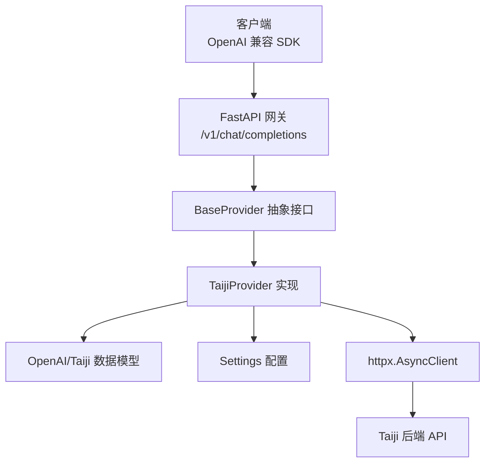
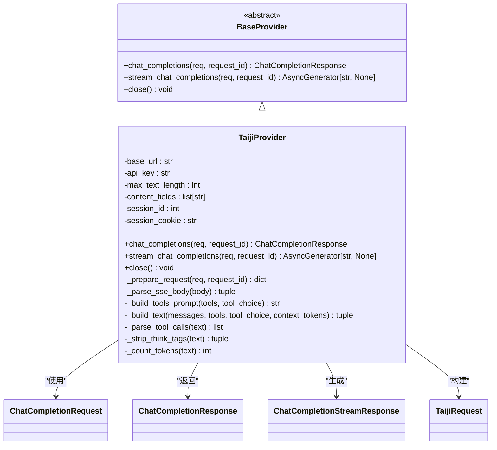
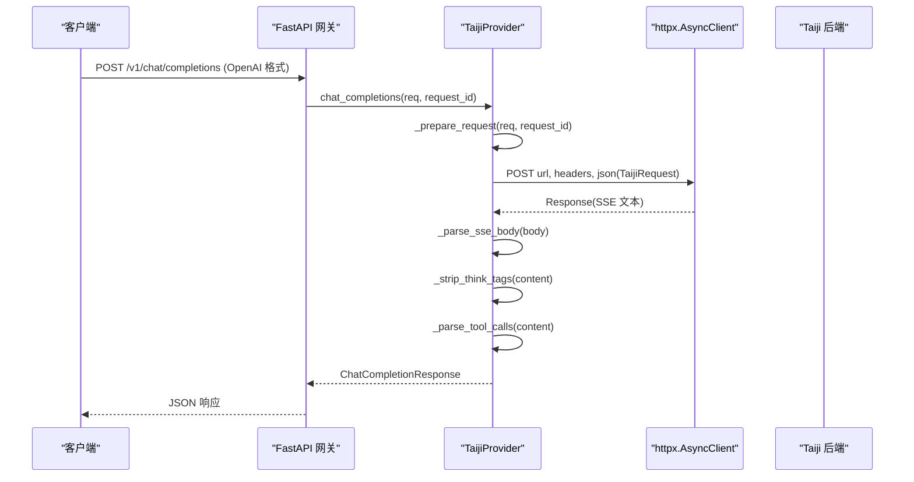
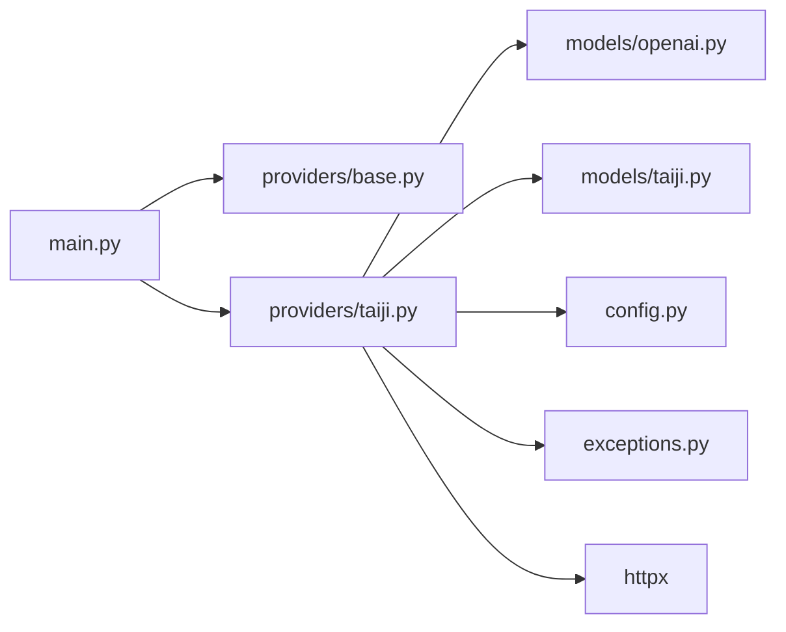

# Provider 抽象层设计

<cite>
**本文引用的文件**   
- [src/openai_provider/providers/base.py](file://src/openai_provider/providers/base.py)
- [src/openai_provider/providers/taiji.py](file://src/openai_provider/providers/taiji.py)
- [src/openai_provider/models/openai.py](file://src/openai_provider/models/openai.py)
- [src/openai_provider/models/taiji.py](file://src/openai_provider/models/taiji.py)
- [src/openai_provider/config.py](file://src/openai_provider/config.py)
- [src/openai_provider/exceptions.py](file://src/openai_provider/exceptions.py)
- [src/openai_provider/main.py](file://src/openai_provider/main.py)
- [tests/test_chat.py](file://tests/test_chat.py)
- [tests/e2e/test_02_chat_non_stream.py](file://tests/e2e/test_02_chat_non_stream.py)
- [tests/e2e/test_03_chat_streaming.py](file://tests/e2e/test_03_chat_streaming.py)
</cite>

## 目录
1. [引言](#引言)
2. [项目结构](#项目结构)
3. [核心组件](#核心组件)
4. [架构总览](#架构总览)
5. [详细组件分析](#详细组件分析)
6. [依赖关系分析](#依赖关系分析)
7. [性能与扩展性考量](#性能与扩展性考量)
8. [故障排查指南](#故障排查指南)
9. [结论](#结论)
10. [附录：自定义 Provider 实现指南](#附录自定义-provider-实现指南)

## 引言
本文件围绕 Provider 抽象层的设计进行系统化说明，重点解释 BaseProvider 抽象基类的设计原理、接口规范与扩展机制；对比非流式与流式 Chat Completions 两种调用模式的差异；阐述 Provider 模式如何支持多后端适配，并通过继承与覆写实现新的 LLM 后端集成。文档包含具体代码示例路径、最佳实践与常见陷阱，帮助读者快速理解并落地扩展。

## 项目结构
本项目采用“网关 + Provider 抽象 + 模型定义”的分层组织方式：
- 网关层（FastAPI）：提供 OpenAI 兼容的 REST/SSE 端点，负责请求解析、鉴权、日志与错误映射。
- Provider 抽象层：定义统一的 Provider 接口，屏蔽不同后端的差异。
- 模型层：OpenAI 兼容的请求/响应模型与后端特定请求体模型。
- 配置与异常：集中管理环境变量与结构化异常体系。

图表来源
- [src/openai_provider/main.py:134-257](file://src/openai_provider/main.py#L134-L257)
- [src/openai_provider/providers/base.py:7-46](file://src/openai_provider/providers/base.py#L7-L46)
- [src/openai_provider/providers/taiji.py:46-601](file://src/openai_provider/providers/taiji.py#L46-L601)
- [src/openai_provider/models/openai.py:83-177](file://src/openai_provider/models/openai.py#L83-L177)
- [src/openai_provider/models/taiji.py:8-31](file://src/openai_provider/models/taiji.py#L8-L31)
- [src/openai_provider/config.py:12-56](file://src/openai_provider/config.py#L12-L56)

章节来源
- [src/openai_provider/main.py:1-342](file://src/openai_provider/main.py#L1-L342)
- [src/openai_provider/providers/base.py:1-46](file://src/openai_provider/providers/base.py#L1-L46)
- [src/openai_provider/providers/taiji.py:1-800](file://src/openai_provider/providers/taiji.py#L1-L800)
- [src/openai_provider/models/openai.py:1-177](file://src/openai_provider/models/openai.py#L1-L177)
- [src/openai_provider/models/taiji.py:1-31](file://src/openai_provider/models/taiji.py#L1-L31)
- [src/openai_provider/config.py:1-56](file://src/openai_provider/config.py#L1-L56)

## 核心组件
- BaseProvider 抽象基类：定义统一接口 chat_completions 与 stream_chat_completions，以及可选资源释放 close。
- TaijiProvider 实现：将 OpenAI 格式请求转换为 Taiji 后端请求，处理 SSE 解析、tool_calls 提取、think 标签分离、token 计数等。
- 数据模型：OpenAI 兼容的 ChatCompletionRequest/Response 及流式 chunk 模型；Taiji 专用请求体模型。
- 配置系统：基于 pydantic-settings 的环境变量配置，含 Taiji 后端 URL、密钥、文本长度限制、内容字段优先级等。
- 异常体系：ProviderError 及其子类，区分超时、HTTP、业务、网络层错误。

章节来源
- [src/openai_provider/providers/base.py:7-46](file://src/openai_provider/providers/base.py#L7-L46)
- [src/openai_provider/providers/taiji.py:46-601](file://src/openai_provider/providers/taiji.py#L46-L601)
- [src/openai_provider/models/openai.py:83-177](file://src/openai_provider/models/openai.py#L83-L177)
- [src/openai_provider/models/taiji.py:8-31](file://src/openai_provider/models/taiji.py#L8-L31)
- [src/openai_provider/config.py:12-56](file://src/openai_provider/config.py#L12-L56)
- [src/openai_provider/exceptions.py:8-40](file://src/openai_provider/exceptions.py#L8-L40)

## 架构总览
Provider 抽象层通过统一接口隔离后端差异，网关仅依赖抽象接口，从而实现对多后端的灵活扩展。当前已实现 TaijiProvider，未来可新增其他 Provider 并在网关中注册路由或按模型名选择对应 Provider。

图表来源
- [src/openai_provider/providers/base.py:7-46](file://src/openai_provider/providers/base.py#L7-L46)
- [src/openai_provider/providers/taiji.py:46-601](file://src/openai_provider/providers/taiji.py#L46-L601)
- [src/openai_provider/models/openai.py:83-177](file://src/openai_provider/models/openai.py#L83-L177)
- [src/openai_provider/models/taiji.py:8-31](file://src/openai_provider/models/taiji.py#L8-L31)

## 详细组件分析

### BaseProvider 抽象基类
- 设计目标：为所有后端 Provider 提供统一契约，确保网关对后端无感知。
- 抽象方法：
  - chat_completions：非流式完成，接收 OpenAI 格式请求，返回标准响应。
  - stream_chat_completions：流式完成，yield OpenAI 格式的 JSON 字符串（不含 data: 前缀），由网关包装为 SSE。
  - close：可选的资源释放钩子，供子类覆写。
- 扩展机制：新增后端只需继承 BaseProvider 并实现上述方法，即可无缝接入网关。

章节来源
- [src/openai_provider/providers/base.py:7-46](file://src/openai_provider/providers/base.py#L7-L46)

### TaijiProvider 实现要点
- 请求准备：
  - 从配置读取 base_url、api_key、最大文本长度、会话 ID/Cookie 等。
  - 将 OpenAI messages 转为 Taiji 文本，内置智能截断策略，保证不超过后端限制。
  - 构造 headers、cookies、URL 与请求体（TaijiRequest）。
- 非流式流程：
  - 发送 POST 请求，解析 SSE 文本，拼接 content，剥离 think 标签，检测 tool_calls，计算 usage。
  - 将结果封装为 ChatCompletionResponse。
- 流式流程：
  - 以 SSE 形式逐块 yield OpenAI 格式的 chunk，首个 chunk 携带 role=assistant，结束 chunk 携带 finish_reason 与 usage。
  - 实时分离 reasoning_content（think 标签内容）与最终 content。
- 工具调用（Tool Calls）：
  - 支持 XML/DSML 与 JSON 两种格式解析，自动清理 tool_calls 块，保持 content 纯净。
- Token 统计：
  - 优先使用后端返回的 token 信息，否则回退到估算策略；total_tokens 严格等于 prompt_tokens + completion_tokens。

图表来源
- [src/openai_provider/main.py:134-257](file://src/openai_provider/main.py#L134-L257)
- [src/openai_provider/providers/taiji.py:670-780](file://src/openai_provider/providers/taiji.py#L670-L780)
- [src/openai_provider/providers/taiji.py:520-601](file://src/openai_provider/providers/taiji.py#L520-L601)
- [src/openai_provider/providers/taiji.py:633-668](file://src/openai_provider/providers/taiji.py#L633-L668)

章节来源
- [src/openai_provider/providers/taiji.py:46-800](file://src/openai_provider/providers/taiji.py#L46-L800)
- [src/openai_provider/models/openai.py:83-177](file://src/openai_provider/models/openai.py#L83-L177)
- [src/openai_provider/models/taiji.py:8-31](file://src/openai_provider/models/taiji.py#L8-L31)
- [src/openai_provider/config.py:12-56](file://src/openai_provider/config.py#L12-L56)

### 非流式与流式调用模式差异
- 非流式：
  - 一次完整请求，等待后端全部输出后返回单一 JSON 响应。
  - 适合批处理或对延迟不敏感的场景。
  - 在 Provider 内部需先拼接 SSE 文本再解析，最后一次性返回。
- 流式：
  - 以 SSE 分块传输，首个 chunk 携带 role，后续增量 content，最后一个 chunk 携带 finish_reason 与 usage。
  - 适合实时对话体验，降低首字节延迟。
  - 网关负责将 Provider 生成的 JSON 字符串包装为 data: ... 行，并以 text/event-stream 返回。

章节来源
- [src/openai_provider/main.py:185-218](file://src/openai_provider/main.py#L185-L218)
- [src/openai_provider/providers/taiji.py:782-800](file://src/openai_provider/providers/taiji.py#L782-L800)

### Provider 模式的多后端适配
- 解耦原则：
  - 网关只依赖 BaseProvider 接口，不关心具体后端实现。
  - 新增后端时，仅需实现 BaseProvider 的子类，并在网关中注册路由或按模型名选择 Provider。
- 当前状态：
  - 已实现 TaijiProvider，覆盖非流式与流式两种模式。
  - 未来可扩展更多后端（如本地 Ollama、其他云厂商 API），复用同一套网关逻辑。

章节来源
- [src/openai_provider/providers/__init__.py:1-4](file://src/openai_provider/providers/__init__.py#L1-L4)
- [src/openai_provider/main.py:78-89](file://src/openai_provider/main.py#L78-L89)

## 依赖关系分析
- 模块耦合：
  - main.py 依赖 providers.base.BaseProvider 与 providers.taiji.TaijiProvider。
  - TaijiProvider 依赖 models.openai.*、models.taiji.TaijiRequest、config.Settings、exceptions.* 与 httpx。
- 外部依赖：
  - FastAPI、httpx、pydantic、pydantic-settings、tiktoken（可选，用于 token 估算）。
- 潜在循环依赖：
  - 当前未见循环导入；Provider 与模型之间单向依赖清晰。

图表来源
- [src/openai_provider/main.py:1-342](file://src/openai_provider/main.py#L1-L342)
- [src/openai_provider/providers/base.py:1-46](file://src/openai_provider/providers/base.py#L1-L46)
- [src/openai_provider/providers/taiji.py:1-800](file://src/openai_provider/providers/taiji.py#L1-L800)
- [src/openai_provider/models/openai.py:1-177](file://src/openai_provider/models/openai.py#L1-L177)
- [src/openai_provider/models/taiji.py:1-31](file://src/openai_provider/models/taiji.py#L1-L31)
- [src/openai_provider/config.py:1-56](file://src/openai_provider/config.py#L1-L56)
- [src/openai_provider/exceptions.py:1-40](file://src/openai_provider/exceptions.py#L1-L40)

章节来源
- [src/openai_provider/main.py:1-342](file://src/openai_provider/main.py#L1-L342)
- [src/openai_provider/providers/base.py:1-46](file://src/openai_provider/providers/base.py#L1-L46)
- [src/openai_provider/providers/taiji.py:1-800](file://src/openai_provider/providers/taiji.py#L1-L800)
- [src/openai_provider/models/openai.py:1-177](file://src/openai_provider/models/openai.py#L1-L177)
- [src/openai_provider/models/taiji.py:1-31](file://src/openai_provider/models/taiji.py#L1-L31)
- [src/openai_provider/config.py:1-56](file://src/openai_provider/config.py#L1-L56)
- [src/openai_provider/exceptions.py:1-40](file://src/openai_provider/exceptions.py#L1-L40)

## 性能与扩展性考量
- 文本截断策略：
  - 始终保留 system 消息与工具提示，从最近对话向前填充，超出限制时截断旧消息并插入提示，避免丢失关键上下文。
- Token 统计优化：
  - 优先使用后端返回的 token 信息，减少估算误差；当缺失时回退到字符估算，确保 total_tokens 一致性。
- 流式处理：
  - 首个 chunk 携带 role，减少客户端解析复杂度；reasoning_content 独立推送，提升可读性与调试效率。
- 连接池与超时：
  - 使用 httpx.AsyncClient 并设置合理超时；在 close 中预留资源释放钩子，便于未来引入连接池复用。
- 扩展性：
  - 新增 Provider 无需改动网关主流程；可通过配置或路由表动态选择后端。

[本节为通用指导，不直接分析具体文件]

## 故障排查指南
- 认证失败：
  - 检查 API_KEY 是否配置正确；未配置时默认跳过认证。
- 后端错误：
  - HTTP 非 200 会抛出 TaijiHTTPError；业务错误（err/msg/code）会抛出 TaijiBusinessError；网络层错误抛出 TaijiRequestError；超时抛出 TaijiTimeoutError。
- 请求校验失败：
  - 非法 JSON 或缺少必要字段会返回 400；未知字段会被忽略，不会导致验证失败。
- 流式问题：
  - 确认第一个 chunk 包含 role=assistant；最后一个 chunk 包含 finish_reason 与 usage；结尾必须有 data: [DONE]。
- 日志定位：
  - 网关记录原始请求与响应；Provider 记录请求与响应细节，便于追踪 SSE 解析与 token 统计。

章节来源
- [src/openai_provider/exceptions.py:8-40](file://src/openai_provider/exceptions.py#L8-L40)
- [src/openai_provider/main.py:134-257](file://src/openai_provider/main.py#L134-L257)
- [tests/test_chat.py:74-128](file://tests/test_chat.py#L74-L128)
- [tests/e2e/test_02_chat_non_stream.py:1-179](file://tests/e2e/test_02_chat_non_stream.py#L1-L179)
- [tests/e2e/test_03_chat_streaming.py:1-146](file://tests/e2e/test_03_chat_streaming.py#L1-L146)

## 结论
Provider 抽象层通过 BaseProvider 定义了清晰的接口契约，使网关与后端解耦，实现了良好的扩展性与可维护性。当前 TaijiProvider 覆盖了非流式与流式两种模式，并提供了完善的错误处理、SSE 解析、tool_calls 支持与 token 统计。未来新增后端只需实现 BaseProvider 子类，即可快速接入现有网关。

[本节为总结，不直接分析具体文件]

## 附录：自定义 Provider 实现指南

### 步骤概览
- 新建 Provider 子类：
  - 继承 BaseProvider，实现 chat_completions 与 stream_chat_completions。
  - 按需覆写 close 以释放资源（如连接池）。
- 请求转换：
  - 将 OpenAI 格式请求转换为后端特定格式（参考 TaijiRequest）。
  - 处理参数映射、headers、cookies、URL 等。
- 响应解析：
  - 非流式：解析后端响应，构造 ChatCompletionResponse。
  - 流式：yield OpenAI 格式的 JSON 字符串，首个 chunk 携带 role，结束 chunk 携带 finish_reason 与 usage。
- 错误处理：
  - 使用 ProviderError 及其子类表达错误类型，便于上层捕获与映射。
- 测试验证：
  - 编写单元测试与 E2E 测试，覆盖成功、错误、流式、tool_calls、think 标签等场景。

### 关键实现要点
- 非流式流程建议：
  - 准备请求 -> 发送请求 -> 解析响应 -> 构造 Usage -> 返回 ChatCompletionResponse。
- 流式流程建议：
  - 初始化 completion_id、created、role_sent 标志 -> 迭代后端 SSE -> 构建 delta -> yield JSON -> 结束 chunk 携带 finish_reason 与 usage。
- Tool Calls 与 Think 标签：
  - 若后端返回混合内容，建议先提取 tool_calls 与 reasoning_content，再清理 content，确保 OpenAI 兼容性。
- Token 统计：
  - 优先使用后端返回的 token 信息；缺失时回退估算，并确保 total_tokens = prompt_tokens + completion_tokens。

### 代码示例路径
- 抽象接口定义：
  - [src/openai_provider/providers/base.py:7-46](file://src/openai_provider/providers/base.py#L7-L46)
- 非流式实现参考：
  - [src/openai_provider/providers/taiji.py:670-780](file://src/openai_provider/providers/taiji.py#L670-L780)
- 流式实现参考：
  - [src/openai_provider/providers/taiji.py:782-800](file://src/openai_provider/providers/taiji.py#L782-L800)
- 请求准备与 SSE 解析：
  - [src/openai_provider/providers/taiji.py:520-601](file://src/openai_provider/providers/taiji.py#L520-L601)
  - [src/openai_provider/providers/taiji.py:633-668](file://src/openai_provider/providers/taiji.py#L633-L668)
- 数据模型参考：
  - [src/openai_provider/models/openai.py:83-177](file://src/openai_provider/models/openai.py#L83-L177)
  - [src/openai_provider/models/taiji.py:8-31](file://src/openai_provider/models/taiji.py#L8-L31)
- 配置与异常：
  - [src/openai_provider/config.py:12-56](file://src/openai_provider/config.py#L12-L56)
  - [src/openai_provider/exceptions.py:8-40](file://src/openai_provider/exceptions.py#L8-L40)

### 最佳实践
- 明确职责边界：Provider 专注后端适配与协议转换，网关负责路由、鉴权与日志。
- 严格遵循 OpenAI 格式：确保 object、choices、usage 等字段符合规范，提升客户端兼容性。
- 健壮的错误处理：区分网络、HTTP、业务错误，向上层抛出结构化异常。
- 可观测性：记录请求/响应关键信息，便于问题定位与性能分析。
- 向后兼容：忽略未知字段，避免破坏现有客户端行为。

### 常见陷阱
- 忘记在首个流式 chunk 携带 role=assistant，导致客户端解析失败。
- 未在结束 chunk 携带 finish_reason 与 usage，影响客户端状态机。
- 未正确处理 think 标签，导致 content 中包含推理过程。
- 未清理 tool_calls 块，导致 content 与 tool_calls 重复。
- 未保证 total_tokens 一致性，违反 OpenAI 规范。

章节来源
- [src/openai_provider/providers/base.py:7-46](file://src/openai_provider/providers/base.py#L7-L46)
- [src/openai_provider/providers/taiji.py:46-800](file://src/openai_provider/providers/taiji.py#L46-L800)
- [src/openai_provider/models/openai.py:83-177](file://src/openai_provider/models/openai.py#L83-L177)
- [src/openai_provider/models/taiji.py:8-31](file://src/openai_provider/models/taiji.py#L8-L31)
- [src/openai_provider/config.py:12-56](file://src/openai_provider/config.py#L12-L56)
- [src/openai_provider/exceptions.py:8-40](file://src/openai_provider/exceptions.py#L8-L40)
- [tests/test_chat.py:74-128](file://tests/test_chat.py#L74-L128)
- [tests/e2e/test_02_chat_non_stream.py:1-179](file://tests/e2e/test_02_chat_non_stream.py#L1-L179)
- [tests/e2e/test_03_chat_streaming.py:1-146](file://tests/e2e/test_03_chat_streaming.py#L1-L146)