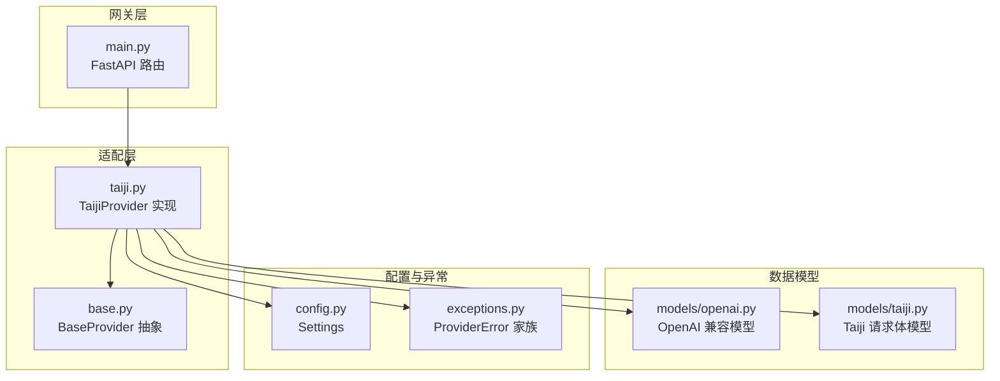
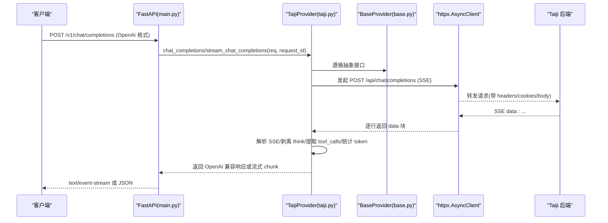
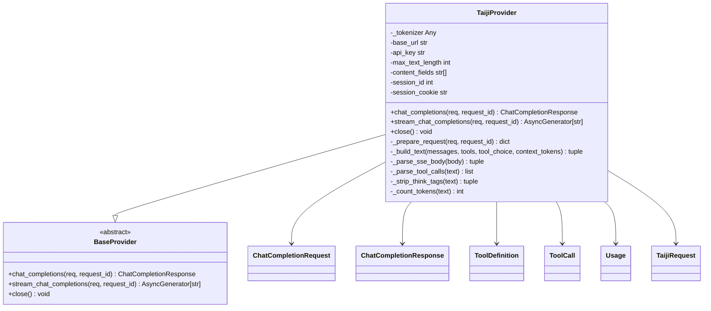
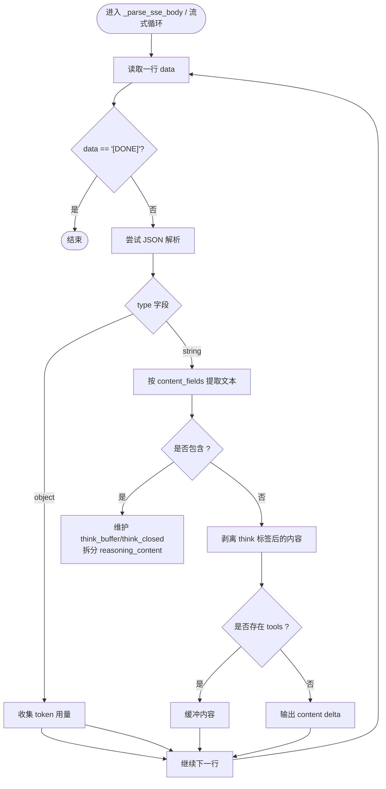
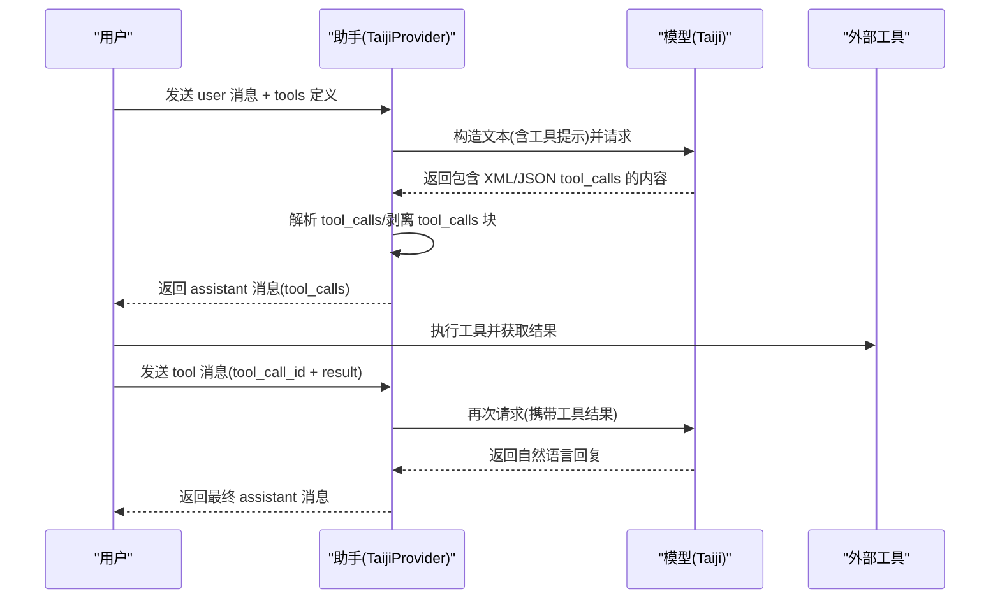
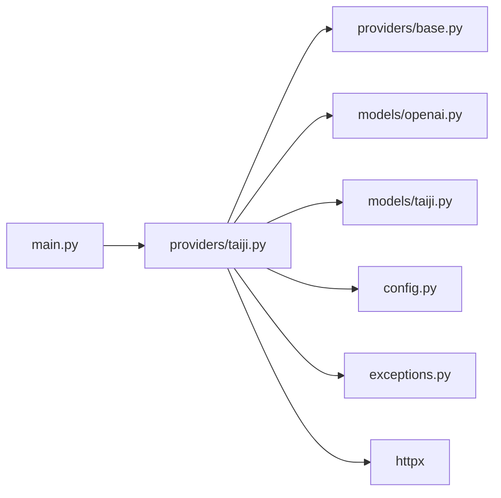

# Taiji 后端适配实现

<cite>
**本文引用的文件**   
- [src/openai_provider/providers/taiji.py](file://src/openai_provider/providers/taiji.py)
- [src/openai_provider/providers/base.py](file://src/openai_provider/providers/base.py)
- [src/openai_provider/models/openai.py](file://src/openai_provider/models/openai.py)
- [src/openai_provider/models/taiji.py](file://src/openai_provider/models/taiji.py)
- [src/openai_provider/config.py](file://src/openai_provider/config.py)
- [src/openai_provider/exceptions.py](file://src/openai_provider/exceptions.py)
- [src/openai_provider/main.py](file://src/openai_provider/main.py)
- [tests/e2e/test_03_chat_streaming.py](file://tests/e2e/test_03_chat_streaming.py)
- [tests/e2e/test_04_tool_calls.py](file://tests/e2e/test_04_tool_calls.py)
- [tests/e2e/test_05_error_handling.py](file://tests/e2e/test_05_error_handling.py)
</cite>

## 目录
1. [简介](#简介)
2. [项目结构](#项目结构)
3. [核心组件](#核心组件)
4. [架构总览](#架构总览)
5. [详细组件分析](#详细组件分析)
6. [依赖关系分析](#依赖关系分析)
7. [性能与超时配置](#性能与超时配置)
8. [故障排查指南](#故障排查指南)
9. [结论](#结论)
10. [附录：API 调用示例与调试技巧](#附录api-调用示例与调试技巧)

## 简介
本文件面向“Taiji 后端适配”的实现，系统性阐述 TaijiProvider 如何继承 BaseProvider 并实现 OpenAI Chat Completions 到 Taiji 后端的适配。文档覆盖以下关键点：
- 请求转换：OpenAI 格式到 Taiji 格式的映射规则（含工具定义注入、文本构建与截断策略）
- SSE 响应解析：增量数据处理、think 标签分离、token 用量统计
- 工具调用处理：XML/JSON 双格式解析、多轮对话支持
- 错误处理：HTTP 异常、业务异常、超时与重试建议
- 性能与超时：连接池、超时、日志与可观测性
- API 示例与调试技巧

## 项目结构
该仓库采用“按功能分层 + Provider 抽象”的组织方式：
- providers：Provider 抽象与具体实现（BaseProvider、TaijiProvider）
- models：OpenAI 兼容模型与 Taiji 请求体模型
- config：基于环境变量与 .env 的配置管理
- exceptions：结构化异常体系
- main：FastAPI 网关入口，提供 /v1/chat/completions 等端点
- tests/e2e：端到端测试，覆盖流式、工具调用、错误处理等场景

图表来源
- [src/openai_provider/main.py:134-257](file://src/openai_provider/main.py#L134-L257)
- [src/openai_provider/providers/base.py:7-46](file://src/openai_provider/providers/base.py#L7-L46)
- [src/openai_provider/providers/taiji.py:46-120](file://src/openai_provider/providers/taiji.py#L46-L120)
- [src/openai_provider/models/openai.py:83-177](file://src/openai_provider/models/openai.py#L83-L177)
- [src/openai_provider/models/taiji.py:8-31](file://src/openai_provider/models/taiji.py#L8-L31)
- [src/openai_provider/config.py:12-56](file://src/openai_provider/config.py#L12-L56)
- [src/openai_provider/exceptions.py:8-40](file://src/openai_provider/exceptions.py#L8-L40)

章节来源
- [src/openai_provider/main.py:1-342](file://src/openai_provider/main.py#L1-L342)
- [src/openai_provider/providers/base.py:1-46](file://src/openai_provider/providers/base.py#L1-L46)
- [src/openai_provider/providers/taiji.py:1-996](file://src/openai_provider/providers/taiji.py#L1-L996)
- [src/openai_provider/models/openai.py:1-177](file://src/openai_provider/models/openai.py#L1-L177)
- [src/openai_provider/models/taiji.py:1-31](file://src/openai_provider/models/taiji.py#L1-L31)
- [src/openai_provider/config.py:1-56](file://src/openai_provider/config.py#L1-L56)
- [src/openai_provider/exceptions.py:1-40](file://src/openai_provider/exceptions.py#L1-L40)

## 核心组件
- BaseProvider：定义 chat_completions 与 stream_chat_completions 两个抽象方法，统一非流式与流式接口契约。
- TaijiProvider：实现上述接口，负责：
  - 将 OpenAI 消息序列转换为 Taiji 纯文本（含 system/tools 提示注入与长度截断）
  - 构造 HTTP 请求头与 Cookie，调用 Taiji /api/chat/completions
  - 解析 SSE 响应，提取 content/reasoning_content/tool_calls/token 用量
  - 输出 OpenAI 兼容的响应或流式 chunk
- OpenAI 模型：ChatCompletionRequest/Response、Delta、ToolCall 等，保证与 OpenAI 客户端兼容
- Taiji 模型：TaijiRequest 透传可选参数（temperature、max_tokens 等），支持 extra="allow"
- Config：从环境变量加载 Taiji 基础 URL、API Key、最大文本长度、内容字段优先级、会话 ID/Cookie 等
- Exceptions：ProviderError 及其子类，区分超时、HTTP 错误、业务错误、网络错误

章节来源
- [src/openai_provider/providers/base.py:7-46](file://src/openai_provider/providers/base.py#L7-L46)
- [src/openai_provider/providers/taiji.py:46-120](file://src/openai_provider/providers/taiji.py#L46-L120)
- [src/openai_provider/models/openai.py:83-177](file://src/openai_provider/models/openai.py#L83-L177)
- [src/openai_provider/models/taiji.py:8-31](file://src/openai_provider/models/taiji.py#L8-L31)
- [src/openai_provider/config.py:12-56](file://src/openai_provider/config.py#L12-L56)
- [src/openai_provider/exceptions.py:8-40](file://src/openai_provider/exceptions.py#L8-L40)

## 架构总览
整体流程：客户端通过 FastAPI 网关发送 OpenAI 兼容请求，TaijiProvider 将其转换为 Taiji 后端请求，接收 SSE 流并按需转换为 OpenAI 兼容的 JSON 或 SSE 流返回。

图表来源
- [src/openai_provider/main.py:134-257](file://src/openai_provider/main.py#L134-L257)
- [src/openai_provider/providers/taiji.py:670-780](file://src/openai_provider/providers/taiji.py#L670-L780)
- [src/openai_provider/providers/taiji.py:782-996](file://src/openai_provider/providers/taiji.py#L782-L996)
- [src/openai_provider/providers/base.py:14-42](file://src/openai_provider/providers/base.py#L14-L42)

## 详细组件分析

### 类与继承关系

图表来源
- [src/openai_provider/providers/base.py:7-46](file://src/openai_provider/providers/base.py#L7-L46)
- [src/openai_provider/providers/taiji.py:46-120](file://src/openai_provider/providers/taiji.py#L46-L120)
- [src/openai_provider/models/openai.py:83-177](file://src/openai_provider/models/openai.py#L83-L177)
- [src/openai_provider/models/taiji.py:8-31](file://src/openai_provider/models/taiji.py#L8-L31)

#### 请求转换过程（OpenAI → Taiji）
- 工具提示注入：当存在 tools 时，在 system 部分追加“工具目录 + 选择规则 + 响应格式（XML/DSML）+ 行为约束 + tool_choice 强制策略”，引导模型以 XML 形式输出 tool_calls。
- 文本构建与截断：
  - 始终包含所有 system 消息与工具提示（最高优先级）
  - 从最近的消息向前添加，直到接近 TAIJI_MAX_TEXT_LENGTH
  - 若最后一条仍放不下，则进行合理截断并插入“上下文被截断”的提示
  - 最终确保不超过限制；超过则硬截断并记录警告
- 参数透传：temperature、max_tokens、top_p、presence_penalty、frequency_penalty 等直接透传给 TaijiRequest
- 会话与认证：使用 sessionId、Cookie（server_name_session）、Authorization、User-Agent、Origin、Referer 等头部
- 请求体：text、sessionId、files、thinking、webSearch 等，extra 字段允许透传其他参数

章节来源
- [src/openai_provider/providers/taiji.py:122-204](file://src/openai_provider/providers/taiji.py#L122-L204)
- [src/openai_provider/providers/taiji.py:206-318](file://src/openai_provider/providers/taiji.py#L206-L318)
- [src/openai_provider/providers/taiji.py:520-600](file://src/openai_provider/providers/taiji.py#L520-L600)
- [src/openai_provider/models/taiji.py:8-22](file://src/openai_provider/models/taiji.py#L8-L22)

#### SSE 响应解析机制（增量处理与状态管理）
- 非流式路径：读取完整响应文本，逐行解析 data: 前缀，拼接 string 类型内容，object 类型用于提取 token 用量信息，[DONE] 终止
- 流式路径：
  - 实时解析每行 data，跳过非 data 行
  - object 类型仅收集 token 用量，不输出
  - string 类型提取实际内容，优先按配置的 content_fields 列表顺序取值
  - think 标签处理：
    - 检测 <think>...</think> 边界，将思考内容作为 reasoning_content 增量推送
    - 支持跨 chunk 的 think 开始/结束，维护 think_buffer 与 think_closed 状态
  - 工具模式下的缓冲策略：
    - 当存在 tools 时，先缓存内容，待流结束后再判定是否为 tool_call
    - 若非 tool_call，则将缓存内容一次性输出
    - 若是 tool_call，先输出剩余文本（如有），再输出 tool_calls delta，并以 finish_reason=tool_calls 结束
- Token 用量：
  - 优先使用 Taiji 返回的 promptTokens/completionTokens/useTokens/contextTokens
  - 否则估算 completion_tokens（基于 content + reasoning_content + tool_calls 序列化）
  - total_tokens = prompt_tokens + completion_tokens，保持 OpenAI 规范一致性

图表来源
- [src/openai_provider/providers/taiji.py:633-668](file://src/openai_provider/providers/taiji.py#L633-L668)
- [src/openai_provider/providers/taiji.py:801-996](file://src/openai_provider/providers/taiji.py#L801-L996)
- [src/openai_provider/providers/taiji.py:501-518](file://src/openai_provider/providers/taiji.py#L501-L518)

章节来源
- [src/openai_provider/providers/taiji.py:633-668](file://src/openai_provider/providers/taiji.py#L633-L668)
- [src/openai_provider/providers/taiji.py:801-996](file://src/openai_provider/providers/taiji.py#L801-L996)

#### 工具调用处理流程（XML/JSON 解析与多轮对话）
- 解析优先级：
  - 优先尝试 XML/DSML 格式：<｜｜DSML｜｜tool_calls>...</｜｜DSML｜｜tool_calls> 或 <tool_calls>...</tool_calls>
  - 回退到 JSON 格式：{"tool_calls": [...]}
- XML 解析细节：
  - 支持闭合与开放标签两种情况
  - 支持 DSML 与标准 XML 两种参数标签
  - 支持简单键值对参数
  - 为每个 invoke 生成唯一 id 与 function.name/arguments(JSON 字符串)
- 清理内容：
  - 移除响应中的 tool_calls 块，保留自然语言说明（若有）
- 多轮对话支持：
  - assistant 消息携带 tool_calls
  - 客户端执行工具后将结果以 role=tool 的消息回传（包含 tool_call_id）
  - 模型根据工具结果生成最终自然语言回复

图表来源
- [src/openai_provider/providers/taiji.py:350-482](file://src/openai_provider/providers/taiji.py#L350-L482)
- [src/openai_provider/providers/taiji.py:484-518](file://src/openai_provider/providers/taiji.py#L484-L518)
- [tests/e2e/test_04_tool_calls.py:189-226](file://tests/e2e/test_04_tool_calls.py#L189-L226)

章节来源
- [src/openai_provider/providers/taiji.py:350-482](file://src/openai_provider/providers/taiji.py#L350-L482)
- [src/openai_provider/providers/taiji.py:484-518](file://src/openai_provider/providers/taiji.py#L484-L518)
- [tests/e2e/test_04_tool_calls.py:50-102](file://tests/e2e/test_04_tool_calls.py#L50-L102)
- [tests/e2e/test_04_tool_calls.py:104-154](file://tests/e2e/test_04_tool_calls.py#L104-L154)
- [tests/e2e/test_04_tool_calls.py:156-187](file://tests/e2e/test_04_tool_calls.py#L156-L187)
- [tests/e2e/test_04_tool_calls.py:189-226](file://tests/e2e/test_04_tool_calls.py#L189-L226)

#### 错误处理策略
- 网络层异常：
  - httpx.TimeoutException → TaijiTimeoutError
  - httpx.HTTPError → TaijiRequestError
- HTTP 状态码异常：
  - 非 200 → TaijiHTTPError(status_code, message)
- 业务错误（HTTP 200 包装）：
  - 检测到 err/msg/code 字段 → TaijiBusinessError(message)
- 网关层：
  - ProviderError 统一捕获，返回 OpenAI 风格错误体（type=provider_error）
  - 流式路径中异常会被封装为 error chunk 并继续输出 [DONE]

章节来源
- [src/openai_provider/exceptions.py:8-40](file://src/openai_provider/exceptions.py#L8-L40)
- [src/openai_provider/providers/taiji.py:670-780](file://src/openai_provider/providers/taiji.py#L670-L780)
- [src/openai_provider/providers/taiji.py:801-996](file://src/openai_provider/providers/taiji.py#L801-L996)
- [src/openai_provider/main.py:220-257](file://src/openai_provider/main.py#L220-L257)

#### 超时配置与重试机制
- 超时：
  - httpx.AsyncClient(timeout=60.0)，适用于非流式与流式路径
- 重试：
  - 当前未内置自动重试逻辑
  - 建议在网关层或服务编排层实现幂等重试（如指数退避），注意避免重复计费与副作用

章节来源
- [src/openai_provider/providers/taiji.py:593-600](file://src/openai_provider/providers/taiji.py#L593-L600)
- [src/openai_provider/providers/taiji.py:801-996](file://src/openai_provider/providers/taiji.py#L801-L996)

## 依赖关系分析
- 模块耦合：
  - main.py 依赖 TaijiProvider 与 OpenAI 模型，负责路由与鉴权
  - TaijiProvider 依赖 BaseProvider 接口、OpenAI/Taiji 模型、Config、Exceptions、httpx
- 外部依赖：
  - httpx：异步 HTTP 客户端
  - tiktoken（可选）：用于更精确的 token 计数，缺失时回退字符估算
- 潜在环依赖：无
- 扩展点：
  - 新增 Provider 只需实现 BaseProvider 接口
  - 可通过 settings.content_fields_list 调整 Taiji 响应字段优先级

图表来源
- [src/openai_provider/main.py:134-257](file://src/openai_provider/main.py#L134-L257)
- [src/openai_provider/providers/taiji.py:1-45](file://src/openai_provider/providers/taiji.py#L1-L45)

章节来源
- [src/openai_provider/main.py:1-342](file://src/openai_provider/main.py#L1-L342)
- [src/openai_provider/providers/taiji.py:1-120](file://src/openai_provider/providers/taiji.py#L1-L120)

## 性能与超时配置
- 连接与超时：
  - 每次请求创建 httpx.AsyncClient(timeout=60.0)，并在 finally 中关闭
  - 流式路径使用 client.stream 逐行迭代，降低内存占用
- Token 计数：
  - 优先使用 tiktoken（cl100k_base），缺失时回退字符估算
  - 非流式与流式均使用原始 prompt_tokens（截断前计算），保证上层感知真实请求大小
- 日志与可观测性：
  - 结构化 JSON 日志，记录请求/响应摘要、延迟、内容预览、工具调用检测结果等
  - 流式路径记录总内容长度、reasoning 长度、tool_calls 数量等

章节来源
- [src/openai_provider/providers/taiji.py:65-95](file://src/openai_provider/providers/taiji.py#L65-L95)
- [src/openai_provider/providers/taiji.py:593-600](file://src/openai_provider/providers/taiji.py#L593-L600)
- [src/openai_provider/providers/taiji.py:737-758](file://src/openai_provider/providers/taiji.py#L737-L758)
- [src/openai_provider/providers/taiji.py:928-996](file://src/openai_provider/providers/taiji.py#L928-L996)
- [src/openai_provider/main.py:32-69](file://src/openai_provider/main.py#L32-L69)

## 故障排查指南
- 常见错误分类与定位：
  - 超时：检查 TAIJI_BASE_URL 可达性与网络状况，必要时增大超时
  - HTTP 错误：关注 status_code 与 body 前 500 字符
  - 业务错误：检查 err/msg/code 字段，确认认证、参数合法性
  - 流式中断：确认 SSE 格式正确，data: [DONE] 结尾
- 诊断要点：
  - 查看 provider_request/provider_response 日志，关注 url、headers、body、latency_ms
  - 流式路径下观察 total_content_length、total_reasoning_length、parsed_tool_calls_count
- 测试用例参考：
  - 流式基本流程、finish_reason 时机、usage 完整性
  - 工具调用解析与多轮往返
  - 并发健康检查与并发聊天请求

章节来源
- [src/openai_provider/exceptions.py:8-40](file://src/openai_provider/exceptions.py#L8-L40)
- [src/openai_provider/providers/taiji.py:670-780](file://src/openai_provider/providers/taiji.py#L670-L780)
- [src/openai_provider/providers/taiji.py:928-996](file://src/openai_provider/providers/taiji.py#L928-L996)
- [tests/e2e/test_03_chat_streaming.py:11-108](file://tests/e2e/test_03_chat_streaming.py#L11-L108)
- [tests/e2e/test_04_tool_calls.py:50-102](file://tests/e2e/test_04_tool_calls.py#L50-L102)
- [tests/e2e/test_05_error_handling.py:9-55](file://tests/e2e/test_05_error_handling.py#L9-L55)

## 结论
TaijiProvider 通过清晰的抽象与模块化设计，实现了 OpenAI Chat Completions 到 Taiji 后端的稳定适配。其关键优势包括：
- 灵活的请求转换与智能截断，保障超长上下文的可用性
- 完善的 SSE 解析与 think 标签分离，兼顾推理内容与最终答案
- 强大的工具调用解析（XML/JSON）与多轮对话支持
- 明确的错误分类与结构化日志，便于问题定位与优化

## 附录：API 调用示例与调试技巧

### 非流式调用示例
- 端点：POST /v1/chat/completions
- 请求体字段：model、messages、tools（可选）、tool_choice（可选）、temperature、max_tokens 等
- 响应体：OpenAI 兼容的 ChatCompletionResponse，包含 choices、usage、finish_reason

章节来源
- [src/openai_provider/main.py:134-257](file://src/openai_provider/main.py#L134-L257)
- [src/openai_provider/models/openai.py:133-143](file://src/openai_provider/models/openai.py#L133-L143)

### 流式调用示例
- 端点：POST /v1/chat/completions?stream=true
- 响应类型：text/event-stream
- 每条数据：data: {json}，最终以 data: [DONE] 结束
- 首个 chunk 应包含 role=assistant，最后一个 finish chunk 包含 usage

章节来源
- [src/openai_provider/main.py:185-218](file://src/openai_provider/main.py#L185-L218)
- [tests/e2e/test_03_chat_streaming.py:11-70](file://tests/e2e/test_03_chat_streaming.py#L11-L70)

### 工具调用示例
- 请求中包含 tools 定义，模型可能返回 tool_calls（XML/JSON）
- 多轮对话：assistant(tool_calls) → tool(result) → assistant(自然语言)

章节来源
- [tests/e2e/test_04_tool_calls.py:50-102](file://tests/e2e/test_04_tool_calls.py#L50-L102)
- [tests/e2e/test_04_tool_calls.py:189-226](file://tests/e2e/test_04_tool_calls.py#L189-L226)

### 调试技巧
- 启用结构化日志，查看 provider_request/provider_response 的详细摘要
- 针对流式路径，关注 total_content_length、total_reasoning_length、tool_call_detected
- 校验 SSE 格式：确保 data: 前缀与 [DONE] 结尾
- 验证 usage：prompt_tokens、completion_tokens、total_tokens 的一致性

章节来源
- [src/openai_provider/main.py:32-69](file://src/openai_provider/main.py#L32-L69)
- [src/openai_provider/providers/taiji.py:928-996](file://src/openai_provider/providers/taiji.py#L928-L996)
- [tests/e2e/test_03_chat_streaming.py:91-108](file://tests/e2e/test_03_chat_streaming.py#L91-L108)