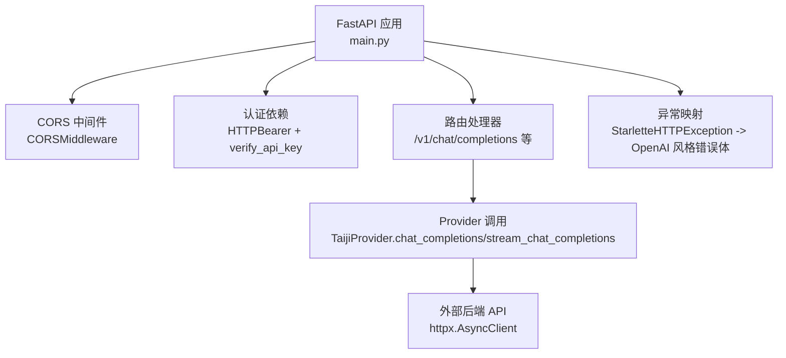
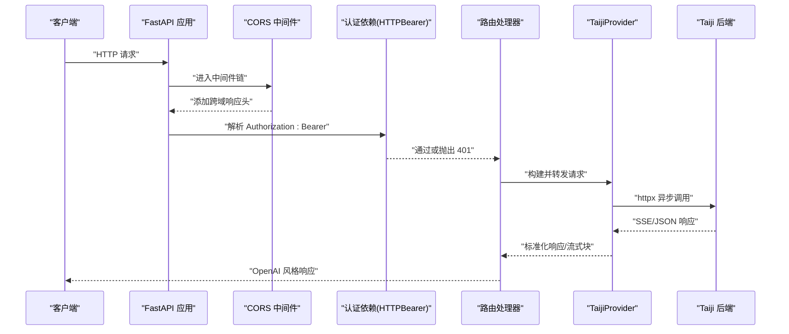
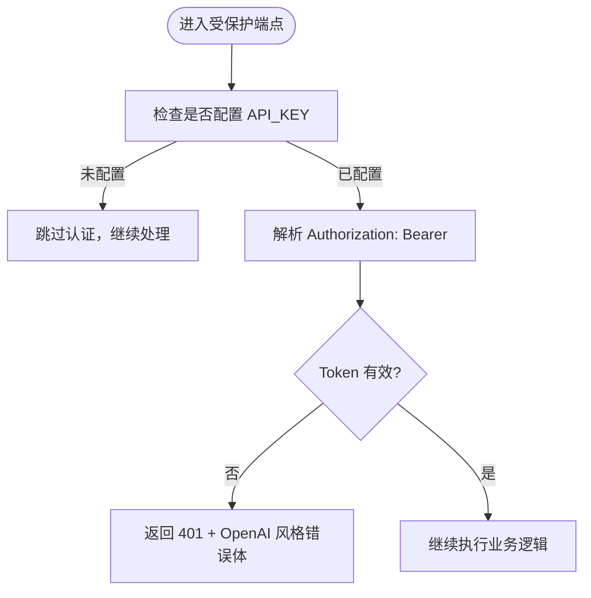
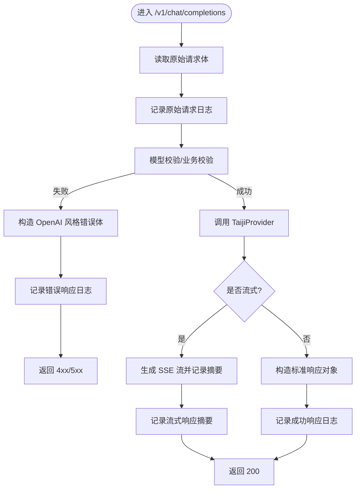
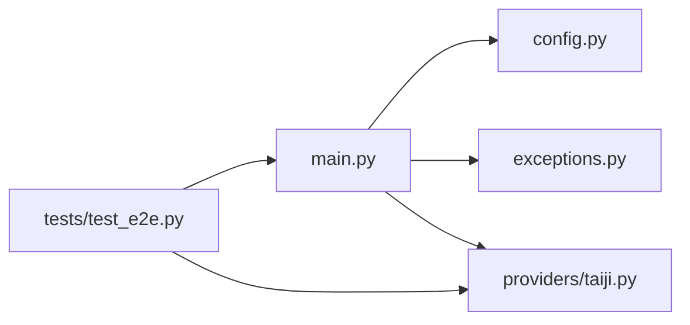

# 中间件机制

<cite>
**本文引用的文件**
- [src/openai_provider/main.py](file://src/openai_provider/main.py)
- [src/openai_provider/config.py](file://src/openai_provider/config.py)
- [src/openai_provider/exceptions.py](file://src/openai_provider/exceptions.py)
- [src/openai_provider/providers/taiji.py](file://src/openai_provider/providers/taiji.py)
- [tests/test_e2e.py](file://tests/test_e2e.py)
</cite>

## 目录
1. [简介](#简介)
2. [项目结构](#项目结构)
3. [核心组件](#核心组件)
4. [架构总览](#架构总览)
5. [详细组件分析](#详细组件分析)
6. [依赖关系分析](#依赖关系分析)
7. [性能考量](#性能考量)
8. [故障排查指南](#故障排查指南)
9. [结论](#结论)
10. [附录](#附录)

## 简介
本文件围绕 FastAPI 中间件机制在本仓库中的落地与扩展，系统性说明：
- 中间件的注册顺序与执行链路（CORS、认证、日志等横切关注点）
- 认证中间件实现原理（Bearer Token 校验流程与权限检查）
- 请求/响应拦截器设计模式与自定义中间件接入方式
- 性能监控中间件的设计要点（请求耗时统计、错误率监控）
- 中间件开发最佳实践与调试技巧

## 项目结构
本项目采用“应用入口 + Provider 抽象 + 配置 + 异常体系”的清晰分层。中间件相关能力集中在应用入口中，通过 FastAPI 提供的 add_middleware 和 Depends 机制组合使用。

图表来源
- [src/openai_provider/main.py:89-126](file://src/openai_provider/main.py#L89-L126)
- [src/openai_provider/providers/taiji.py:670-780](file://src/openai_provider/providers/taiji.py#L670-L780)

章节来源
- [src/openai_provider/main.py:89-126](file://src/openai_provider/main.py#L89-L126)
- [src/openai_provider/config.py:12-56](file://src/openai_provider/config.py#L12-L56)

## 核心组件
- CORS 中间件：基于 FastAPI 内置 CORSMiddleware，支持通过环境变量动态配置允许的来源。
- 认证中间件：基于 HTTPBearer 的可选认证，由环境变量 API_KEY 控制是否启用；未配置时跳过认证。
- 结构化日志：在应用生命周期内初始化 JSON 格式日志，记录原始请求、原始响应、Provider 请求/响应等关键信息。
- 异常映射：将 Starlette/FastAPI 的 HTTPException 统一转换为 OpenAI 风格的错误体，便于客户端一致处理。

章节来源
- [src/openai_provider/main.py:91-126](file://src/openai_provider/main.py#L91-L126)
- [src/openai_provider/main.py:319-330](file://src/openai_provider/main.py#L319-L330)
- [src/openai_provider/config.py:35-47](file://src/openai_provider/config.py#L35-L47)

## 架构总览
下图展示了从客户端到后端的全链路，以及中间件在其中的作用位置与数据流向。

图表来源
- [src/openai_provider/main.py:91-126](file://src/openai_provider/main.py#L91-L126)
- [src/openai_provider/providers/taiji.py:670-780](file://src/openai_provider/providers/taiji.py#L670-L780)

## 详细组件分析

### CORS 中间件
- 注册位置：应用启动后通过 app.add_middleware 注册。
- 配置来源：从配置模块读取 CORS_ORIGINS（逗号分隔），默认允许所有来源。
- 行为验证：E2E 测试覆盖了预检请求返回正确跨域头的场景。

章节来源
- [src/openai_provider/main.py:91-99](file://src/openai_provider/main.py#L91-L99)
- [src/openai_provider/config.py:46-47](file://src/openai_provider/config.py#L46-L47)
- [tests/test_e2e.py:236-254](file://tests/test_e2e.py#L236-L254)

### 认证中间件（Bearer Token）
- 实现方式：使用 HTTPBearer(auto_error=False) 作为依赖注入，结合 verify_api_key 函数完成校验。
- 开关策略：当未设置 API_KEY 环境变量时，直接放行；否则比对请求头中的 Bearer token 与配置值，不匹配则返回 401。
- 错误体格式：遵循 OpenAI 风格 error 对象，包含 message、type、code 字段。
- 适用端点：在需要保护的端点中使用 _auth=Depends(verify_api_key) 进行保护。

图表来源
- [src/openai_provider/main.py:105-126](file://src/openai_provider/main.py#L105-L126)

章节来源
- [src/openai_provider/main.py:105-126](file://src/openai_provider/main.py#L105-L126)

### 请求/响应拦截器设计模式
当前项目在路由层实现了“请求/响应拦截”的常见模式：
- 请求侧：读取原始请求体、生成 request_id、记录原始请求日志。
- 响应侧：根据成功/失败路径分别记录原始响应日志，并将异常统一映射为 OpenAI 风格错误体。
- 流式场景：对 SSE 流进行分块收集与最终汇总日志，便于问题定位。

图表来源
- [src/openai_provider/main.py:134-257](file://src/openai_provider/main.py#L134-L257)

章节来源
- [src/openai_provider/main.py:134-257](file://src/openai_provider/main.py#L134-L257)

### 异常映射与错误处理
- 全局异常处理器：捕获 StarletteHTTPException，将其转换为 OpenAI 风格错误体，保证客户端一致性。
- Provider 异常体系：定义 ProviderError 及其子类（超时、HTTP 错误、业务错误、网络错误），在 Provider 层抛出并在路由层按语义映射为合适的 HTTP 状态码。

章节来源
- [src/openai_provider/main.py:319-330](file://src/openai_provider/main.py#L319-L330)
- [src/openai_provider/exceptions.py:8-40](file://src/openai_provider/exceptions.py#L8-L40)
- [src/openai_provider/providers/taiji.py:670-780](file://src/openai_provider/providers/taiji.py#L670-L780)

### 自定义中间件接入指南
虽然当前仓库未提供独立的自定义中间件类，但可通过以下两种方式快速接入：
- 使用 app.add_middleware 注册 Starlette/FastAPI 中间件类，置于 CORS 之后、认证之前或之后，以控制执行顺序。
- 使用 Depends 注入轻量级“依赖型中间件”，适合做参数校验、上下文注入、简单鉴权等横切逻辑。

建议的注册顺序（示例思路）：
- 最外层：CORS
- 安全层：认证（Bearer Token）
- 可观测性：请求耗时统计、错误率埋点
- 业务层：路由处理器

注意：
- 中间件执行顺序即注册顺序，先注册的先执行、后返回。
- 对于流式响应，需在中间件中谨慎处理 StreamingResponse，避免阻塞或重复消费请求体。

章节来源
- [src/openai_provider/main.py:91-99](file://src/openai_provider/main.py#L91-L99)
- [src/openai_provider/main.py:105-126](file://src/openai_provider/main.py#L105-L126)

## 依赖关系分析
- main.py 依赖 config.settings 获取运行时配置（如 CORS_ORIGINS、API_KEY）。
- main.py 依赖 exceptions.ProviderError 及子类用于异常分类与映射。
- providers/taiji.py 依赖 httpx 发起外部请求，并在内部记录 provider_request/provider_response 日志。
- tests/test_e2e.py 覆盖 CORS、异常映射、流式边界等关键路径，确保中间件行为稳定。

图表来源
- [src/openai_provider/main.py:23-26](file://src/openai_provider/main.py#L23-L26)
- [src/openai_provider/providers/taiji.py:18-40](file://src/openai_provider/providers/taiji.py#L18-L40)
- [tests/test_e2e.py:24-34](file://tests/test_e2e.py#L24-L34)

章节来源
- [src/openai_provider/main.py:23-26](file://src/openai_provider/main.py#L23-L26)
- [src/openai_provider/providers/taiji.py:18-40](file://src/openai_provider/providers/taiji.py#L18-L40)
- [tests/test_e2e.py:24-34](file://tests/test_e2e.py#L24-L34)

## 性能考量
- 请求耗时统计：可在自定义中间件中使用 time.perf_counter 包裹请求处理，计算端到端耗时并写入结构化日志。
- 错误率监控：在中间件中对异常进行分类计数（如 4xx/5xx、ProviderError 子类），输出指标或上报监控系统。
- 流式响应优化：避免在中间件中缓存完整响应体；仅记录必要的元信息（如总块数、首尾预览），减少内存占用。
- 日志轮转：当前已配置 RotatingFileHandler，限制单文件大小与备份数量，避免磁盘膨胀。

[本节为通用指导，无需源码引用]

## 故障排查指南
- 认证失败：确认 API_KEY 是否配置，Authorization 头是否为正确的 Bearer token；查看 401 响应体的 OpenAI 风格错误信息。
- CORS 问题：检查 CORS_ORIGINS 配置是否正确，浏览器控制台是否出现跨域错误；E2E 测试已覆盖预检请求。
- Provider 错误：区分超时、HTTP 错误、业务错误、网络错误四类异常，结合 provider_request/provider_response 日志定位。
- 流式异常：流式过程中若发生异常，会发送错误 chunk 并最终结束流；检查日志中的流式摘要与错误消息。

章节来源
- [src/openai_provider/main.py:105-126](file://src/openai_provider/main.py#L105-L126)
- [src/openai_provider/exceptions.py:8-40](file://src/openai_provider/exceptions.py#L8-L40)
- [src/openai_provider/providers/taiji.py:670-780](file://src/openai_provider/providers/taiji.py#L670-L780)
- [tests/test_e2e.py:158-230](file://tests/test_e2e.py#L158-L230)

## 结论
本项目在 FastAPI 基础上，通过内置中间件与依赖注入的组合，实现了 CORS、认证、结构化日志与异常映射等横切能力。现有实现简洁且易于扩展，建议在后续迭代中引入统一的性能监控与错误率埋点中间件，进一步提升可观测性与稳定性。

[本节为总结，无需源码引用]

## 附录

### 中间件开发最佳实践
- 明确职责边界：每个中间件只做一件事（如只负责跨域、只负责认证、只负责计时）。
- 保持幂等与无副作用：避免在中间件中修改共享状态；如需上下文，使用 Request.state。
- 谨慎处理流式响应：不要尝试读取或缓存整个流；仅在必要时记录元信息。
- 错误分类与提示：将异常分类并返回一致的 OpenAI 风格错误体，便于客户端统一处理。
- 可配置化：通过环境变量或配置文件控制中间件开关与参数（如 CORS_ORIGINS、API_KEY）。

[本节为通用指导，无需源码引用]