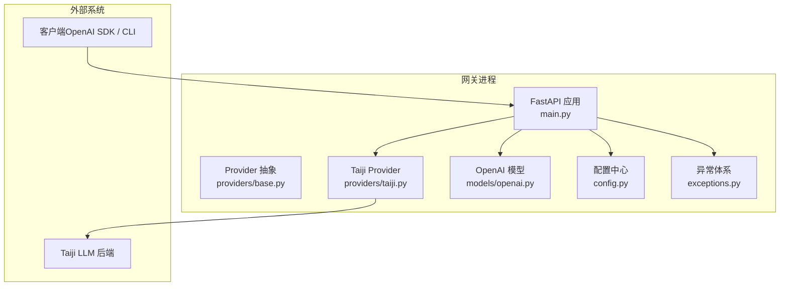
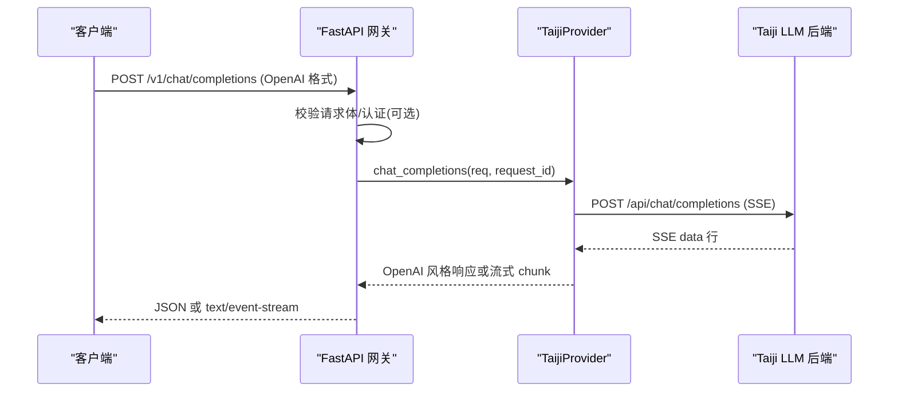
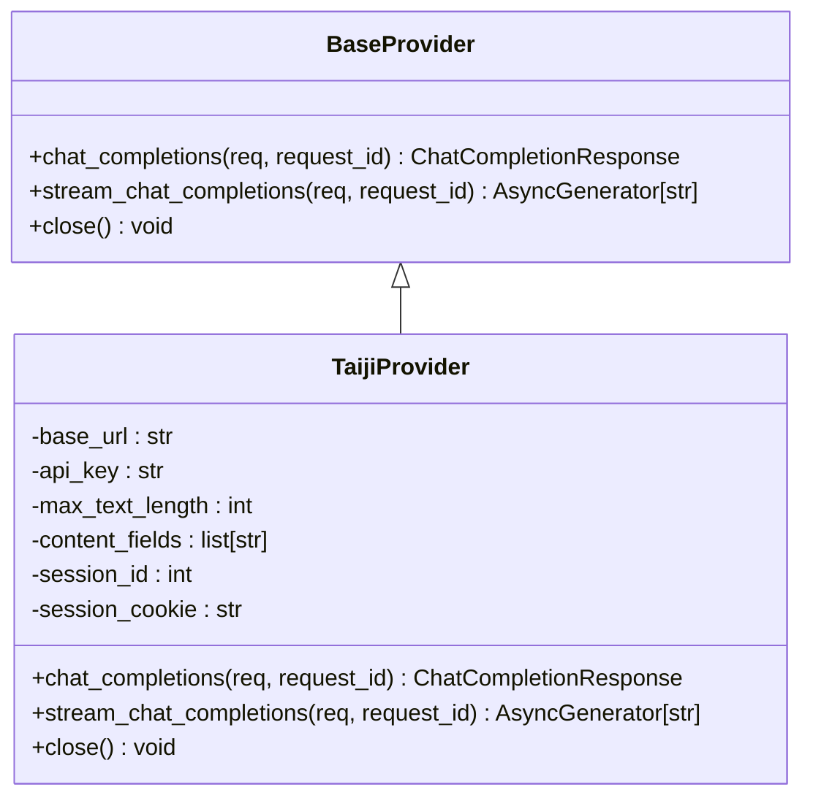
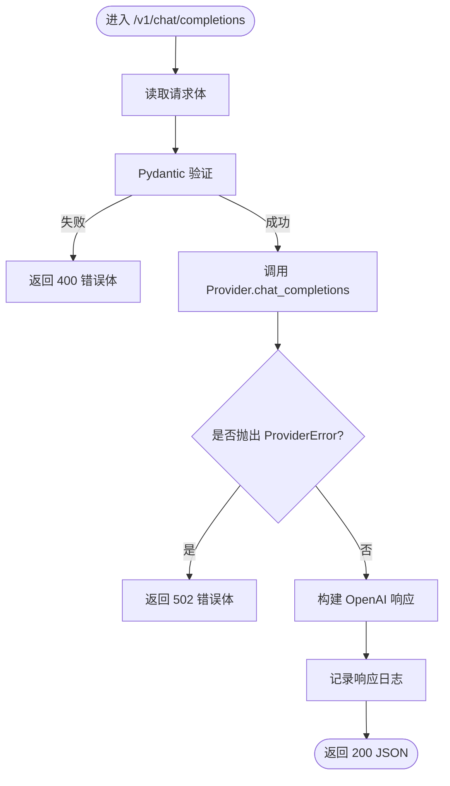
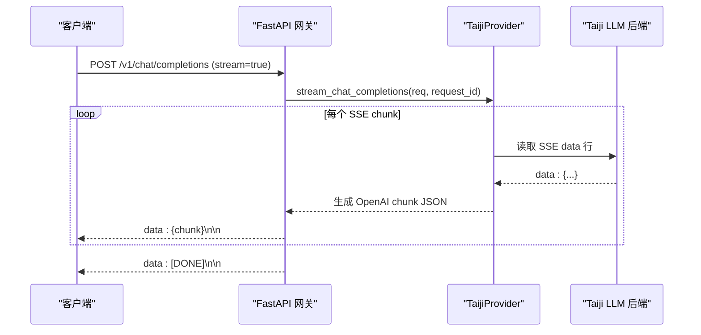
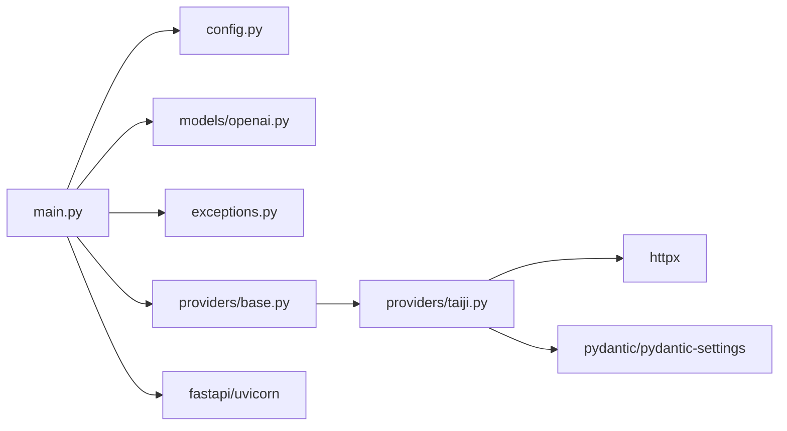

# 架构设计

<cite>
**本文引用的文件**   
- [src/openai_provider/main.py](file://src/openai_provider/main.py)
- [src/openai_provider/config.py](file://src/openai_provider/config.py)
- [src/openai_provider/providers/base.py](file://src/openai_provider/providers/base.py)
- [src/openai_provider/providers/taiji.py](file://src/openai_provider/providers/taiji.py)
- [src/openai_provider/models/openai.py](file://src/openai_provider/models/openai.py)
- [src/openai_provider/exceptions.py](file://src/openai_provider/exceptions.py)
- [pyproject.toml](file://pyproject.toml)
- [requirements.txt](file://requirements.txt)
- [start.sh](file://start.sh)
- [tests/conftest.py](file://tests/conftest.py)
- [tests/e2e/test_01_health_models.py](file://tests/e2e/test_01_health_models.py)
</cite>

## 目录
1. [引言](#引言)
2. [项目结构](#项目结构)
3. [核心组件](#核心组件)
4. [架构总览](#架构总览)
5. [详细组件分析](#详细组件分析)
6. [依赖关系分析](#依赖关系分析)
7. [性能与可扩展性](#性能与可扩展性)
8. [横切关注点：安全、监控与灾难恢复](#横切关注点安全监控与灾难恢复)
9. [基础设施与部署拓扑](#基础设施与部署拓扑)
10. [故障排查指南](#故障排查指南)
11. [结论](#结论)
12. [附录：技术栈与兼容性](#附录技术栈与兼容性)

## 引言
本项目是一个 OpenAI 兼容的网关服务，将标准 OpenAI Chat Completions API 请求转发到 Taiji LLM 后端，并返回 OpenAI 风格的响应。系统采用 Provider 抽象层隔离后端差异，当前仅实现 TaijiProvider；同时提供模型发现、健康检查、版本信息以及可选的 Bearer Token 认证等能力。

## 项目结构
- 应用入口与路由：FastAPI 应用定义、中间件、异常处理、端点实现位于主模块。
- Provider 抽象层：定义统一接口，屏蔽后端差异。
- 具体 Provider：TaijiProvider 负责将 OpenAI 请求转换为 Taiji 调用，解析 SSE 响应，提取工具调用与推理内容。
- 数据模型：OpenAI 风格请求/响应 Pydantic 模型。
- 配置：基于环境变量与 .env 文件的集中式配置。
- 启动脚本：支持开发/生产模式与多 worker 运行。
- 测试：E2E 与单元测试覆盖健康检查、模型发现、流式与非流式行为。

图表来源
- [src/openai_provider/main.py:1-120](file://src/openai_provider/main.py#L1-L120)
- [src/openai_provider/providers/base.py:1-46](file://src/openai_provider/providers/base.py#L1-L46)
- [src/openai_provider/providers/taiji.py:1-120](file://src/openai_provider/providers/taiji.py#L1-L120)
- [src/openai_provider/models/openai.py:1-60](file://src/openai_provider/models/openai.py#L1-L60)
- [src/openai_provider/config.py:1-56](file://src/openai_provider/config.py#L1-L56)
- [src/openai_provider/exceptions.py:1-40](file://src/openai_provider/exceptions.py#L1-L40)

章节来源
- [src/openai_provider/main.py:1-120](file://src/openai_provider/main.py#L1-L120)
- [src/openai_provider/config.py:1-56](file://src/openai_provider/config.py#L1-L56)
- [src/openai_provider/providers/base.py:1-46](file://src/openai_provider/providers/base.py#L1-L46)
- [src/openai_provider/providers/taiji.py:1-120](file://src/openai_provider/providers/taiji.py#L1-L120)
- [src/openai_provider/models/openai.py:1-60](file://src/openai_provider/models/openai.py#L1-L60)
- [src/openai_provider/exceptions.py:1-40](file://src/openai_provider/exceptions.py#L1-L40)

## 核心组件
- FastAPI 应用与路由：提供 /v1/chat/completions、/v1/models、/health、/version 等端点，统一错误格式为 OpenAI 风格。
- Provider 抽象层：BaseProvider 定义 chat_completions 与 stream_chat_completions 两个异步方法，强制所有后端实现一致接口。
- TaijiProvider：实现 OpenAI 到 Taiji 的请求转换、SSE 解析、tool_calls 提取、think 标签分离、token 用量估算与透传。
- 数据模型：OpenAI 风格请求/响应 Pydantic 模型，默认排除 None 字段以匹配 OpenAI 行为。
- 配置系统：通过 pydantic-settings 从环境变量与 .env 加载，包含后端地址、认证、CORS、模型能力等。
- 异常体系：结构化异常区分超时、HTTP 错误、业务错误与网络错误，便于上层统一处理。

章节来源
- [src/openai_provider/main.py:128-342](file://src/openai_provider/main.py#L128-L342)
- [src/openai_provider/providers/base.py:1-46](file://src/openai_provider/providers/base.py#L1-L46)
- [src/openai_provider/providers/taiji.py:46-120](file://src/openai_provider/providers/taiji.py#L46-L120)
- [src/openai_provider/models/openai.py:1-177](file://src/openai_provider/models/openai.py#L1-L177)
- [src/openai_provider/config.py:1-56](file://src/openai_provider/config.py#L1-L56)
- [src/openai_provider/exceptions.py:1-40](file://src/openai_provider/exceptions.py#L1-L40)

## 架构总览
系统上下文图展示了客户端、网关与 Taiji 后端的交互边界与协议。

图表来源
- [src/openai_provider/main.py:134-257](file://src/openai_provider/main.py#L134-L257)
- [src/openai_provider/providers/taiji.py:670-780](file://src/openai_provider/providers/taiji.py#L670-L780)

## 详细组件分析

### Provider 抽象层设计与职责
- BaseProvider 定义了两个核心异步方法：非流式 chat_completions 与流式 stream_chat_completions，并预留 close 生命周期钩子。
- 该抽象确保上层路由无需关心后端细节，未来可新增其他 Provider 实现而无需改动网关逻辑。

图表来源
- [src/openai_provider/providers/base.py:1-46](file://src/openai_provider/providers/base.py#L1-L46)
- [src/openai_provider/providers/taiji.py:46-120](file://src/openai_provider/providers/taiji.py#L46-L120)

章节来源
- [src/openai_provider/providers/base.py:1-46](file://src/openai_provider/providers/base.py#L1-L46)
- [src/openai_provider/providers/taiji.py:46-120](file://src/openai_provider/providers/taiji.py#L46-L120)

### 请求处理流程（非流式）
- 路由接收请求，记录原始请求日志，解析为 OpenAI 请求模型。
- 调用 Provider 的非流式方法，捕获 ProviderError 并转换为 OpenAI 风格错误体。
- 构造响应并记录最终输出。

图表来源
- [src/openai_provider/main.py:134-257](file://src/openai_provider/main.py#L134-L257)
- [src/openai_provider/providers/taiji.py:670-780](file://src/openai_provider/providers/taiji.py#L670-L780)

章节来源
- [src/openai_provider/main.py:134-257](file://src/openai_provider/main.py#L134-L257)
- [src/openai_provider/providers/taiji.py:670-780](file://src/openai_provider/providers/taiji.py#L670-L780)

### 请求处理流程（流式）
- 当请求设置 stream=True 时，网关使用 StreamingResponse 发送 text/event-stream。
- Provider 生成 SSE data 行，网关在每块后追加 data: 前缀并在结束时发送 [DONE]。
- 流式过程中记录 chunk 数量与预览，便于调试。

图表来源
- [src/openai_provider/main.py:185-218](file://src/openai_provider/main.py#L185-L218)
- [src/openai_provider/providers/taiji.py:782-800](file://src/openai_provider/providers/taiji.py#L782-L800)

章节来源
- [src/openai_provider/main.py:185-218](file://src/openai_provider/main.py#L185-L218)
- [src/openai_provider/providers/taiji.py:782-800](file://src/openai_provider/providers/taiji.py#L782-L800)

### 模型发现与辅助端点
- GET /v1/models 返回可用模型列表，当前固定为 taiji，包含 context_length 与 max_completion_tokens。
- GET /v1/models/{model_id} 按 ID 查询模型，未知返回 404。
- GET /api/v1/models 作为别名端点。
- GET /api/tags 返回空模型列表以满足 Ollama 兼容客户端。
- GET /props 与 GET /v1/props 用于特性探测。
- GET /version 返回版本与 provider 标识。

章节来源
- [src/openai_provider/main.py:260-317](file://src/openai_provider/main.py#L260-L317)
- [tests/e2e/test_01_health_models.py:50-88](file://tests/e2e/test_01_health_models.py#L50-L88)

### 认证与 CORS
- 可选 Bearer Token 认证：若未配置 API_KEY 则跳过认证；否则校验 Authorization 头中的 token。
- CORS 中间件：通过环境变量 CORS_ORIGINS 控制允许的来源，默认允许全部。

章节来源
- [src/openai_provider/main.py:105-126](file://src/openai_provider/main.py#L105-L126)
- [src/openai_provider/main.py:91-99](file://src/openai_provider/main.py#L91-L99)
- [src/openai_provider/config.py:35-47](file://src/openai_provider/config.py#L35-L47)

### 日志与结构化输出
- 自定义 JSONFormatter 输出结构化日志，包含时间戳、级别、logger、消息、request_id 与额外字段。
- 日志写入 logs/taiji-provider.log，按大小轮转，保留最近 5 份。
- 关键路径记录 raw_request/raw_response/provider_request/provider_response 日志。

章节来源
- [src/openai_provider/main.py:32-70](file://src/openai_provider/main.py#L32-L70)
- [src/openai_provider/main.py:148-160](file://src/openai_provider/main.py#L148-L160)
- [src/openai_provider/main.py:245-255](file://src/openai_provider/main.py#L245-L255)

### 异常处理与错误体标准化
- HTTPException 处理器将所有 HTTP 异常转换为 OpenAI 风格错误体，包含 message、type、code。
- ProviderError 及其子类用于区分超时、HTTP 错误、业务错误与网络错误，上层根据类型返回不同状态码。

章节来源
- [src/openai_provider/main.py:319-331](file://src/openai_provider/main.py#L319-L331)
- [src/openai_provider/exceptions.py:1-40](file://src/openai_provider/exceptions.py#L1-L40)

### 数据模型与序列化策略
- OpenAIModel 基类默认 exclude_none=True，避免返回 None 字段，符合 OpenAI 行为。
- 请求/响应模型涵盖 messages、tools、tool_choice、usage、delta 等字段，支持流式与非流式。

章节来源
- [src/openai_provider/models/openai.py:12-25](file://src/openai_provider/models/openai.py#L12-L25)
- [src/openai_provider/models/openai.py:83-101](file://src/openai_provider/models/openai.py#L83-L101)
- [src/openai_provider/models/openai.py:133-177](file://src/openai_provider/models/openai.py#L133-L177)

### 配置系统与运行时参数
- Settings 类通过 pydantic-settings 从环境变量与 .env 加载，支持默认值与范围约束。
- 关键配置包括后端地址、API Key、最大文本长度、内容字段优先级、会话标识与 Cookie、监听端口、模型能力、CORS 等。

章节来源
- [src/openai_provider/config.py:12-56](file://src/openai_provider/config.py#L12-L56)

### 启动与运行模式
- start.sh 支持 dev/prod 模式，自动检测 Python 与依赖，支持 --port/--host/--workers 参数。
- 生产模式可启用多 worker，提升并发处理能力。

章节来源
- [start.sh:1-123](file://start.sh#L1-L123)

## 依赖关系分析
- 运行时依赖：fastapi、uvicorn[standard]、httpx、pydantic、pydantic-settings。
- 可选依赖：tiktoken（用于更精确的 token 计数，缺失时回退字符估算）。
- 测试依赖：pytest、pytest-asyncio、mypy、ruff。

图表来源
- [src/openai_provider/main.py:1-30](file://src/openai_provider/main.py#L1-L30)
- [src/openai_provider/providers/taiji.py:16-40](file://src/openai_provider/providers/taiji.py#L16-L40)
- [pyproject.toml:10-16](file://pyproject.toml#L10-L16)
- [requirements.txt:1-13](file://requirements.txt#L1-L13)

章节来源
- [pyproject.toml:10-16](file://pyproject.toml#L10-L16)
- [requirements.txt:1-13](file://requirements.txt#L1-L13)

## 性能与可扩展性
- 连接管理：每次请求创建 httpx.AsyncClient 并在 finally 中关闭，避免连接泄漏；生产环境建议复用连接池以提升吞吐。
- 流式传输：text/event-stream 降低首字节延迟，适合长对话与工具调用场景。
- Token 估算：优先使用 tiktoken 精确计数，缺失时回退字符估算，保证可用性。
- 上下文截断：智能截断策略保留 system 与 tools prompt，尽量保留最近对话，必要时提示截断。
- 可扩展性：新增后端只需实现 BaseProvider 接口并通过测试，无需修改网关路由。

章节来源
- [src/openai_provider/providers/taiji.py:66-95](file://src/openai_provider/providers/taiji.py#L66-L95)
- [src/openai_provider/providers/taiji.py:206-318](file://src/openai_provider/providers/taiji.py#L206-L318)
- [src/openai_provider/providers/taiji.py:670-780](file://src/openai_provider/providers/taiji.py#L670-L780)

## 横切关注点：安全、监控与灾难恢复
- 安全性
  - 可选 Bearer Token 认证，未配置 API_KEY 时不启用。
  - CORS 可通过环境变量限制来源。
  - 敏感头（如 authorization）在日志中脱敏。
- 监控与可观测性
  - 结构化 JSON 日志，包含 request_id、耗时、状态码与响应预览。
  - 健康检查 /health 与版本 /version 便于探针与编排平台集成。
- 灾难恢复
  - ProviderError 分类使上层能针对超时、HTTP 错误、业务错误进行重试或降级。
  - 流式错误会在 SSE 中返回 error chunk，客户端可据此中断或重试。

章节来源
- [src/openai_provider/main.py:105-126](file://src/openai_provider/main.py#L105-L126)
- [src/openai_provider/main.py:319-331](file://src/openai_provider/main.py#L319-L331)
- [src/openai_provider/exceptions.py:1-40](file://src/openai_provider/exceptions.py#L1-L40)

## 基础设施与部署拓扑
- 运行时要求
  - Python >= 3.11
  - 依赖安装：pip install -r requirements.txt 或 uv pip install -e .
- 部署方式
  - 单进程：./start.sh prod --port 8080
  - 多 worker：./start.sh prod --workers N --port 8080
  - 开发模式：./start.sh dev --reload
- 反向代理与负载均衡
  - 建议置于 Nginx/Traefik 之后，启用 HTTPS、限流与访问日志。
  - 结合容器编排（Kubernetes/Docker Compose）进行水平扩展与健康检查。

章节来源
- [start.sh:1-123](file://start.sh#L1-L123)
- [pyproject.toml:9](file://pyproject.toml#L9)
- [requirements.txt:1-6](file://requirements.txt#L1-L6)

## 故障排查指南
- 常见问题
  - 401 认证失败：检查 API_KEY 与 Authorization 头。
  - 404 模型不存在：确认 model_id 为 taiji。
  - 502 上游错误：查看 provider_request/provider_response 日志，定位 Taiji 后端状态码与响应体。
  - 流式无输出：检查 SSE 解析与 content_fields 配置。
- 诊断步骤
  - 启用 DEBUG 级别日志，观察 raw_request/raw_response。
  - 使用 /health 与 /version 验证服务可用性。
  - 使用 tests/conftest.py 提供的 SSE mock 复现问题。

章节来源
- [src/openai_provider/main.py:148-160](file://src/openai_provider/main.py#L148-L160)
- [src/openai_provider/main.py:245-255](file://src/openai_provider/main.py#L245-L255)
- [tests/conftest.py:16-92](file://tests/conftest.py#L16-L92)

## 结论
本系统通过 Provider 抽象层实现了 OpenAI 兼容网关与 Taiji 后端的解耦，具备清晰的组件边界、标准化的错误体与结构化日志，满足流式与非流式对话、工具调用与推理内容透传等需求。通过环境变量与 .env 的配置化方式，系统具备良好的可移植性与可扩展性，易于在生产环境中部署与运维。

## 附录：技术栈与兼容性
- 语言与框架
  - Python >= 3.11
  - FastAPI >= 0.110.0
  - Uvicorn >= 0.29.0
  - Pydantic >= 2.6.0
  - Pydantic-settings >= 2.2.0
  - httpx >= 0.27.0
- 可选库
  - tiktoken（用于精确 token 计数，缺失时回退字符估算）
- 测试与质量
  - pytest、pytest-asyncio、mypy、ruff

章节来源
- [pyproject.toml:10-16](file://pyproject.toml#L10-L16)
- [requirements.txt:1-13](file://requirements.txt#L1-L13)