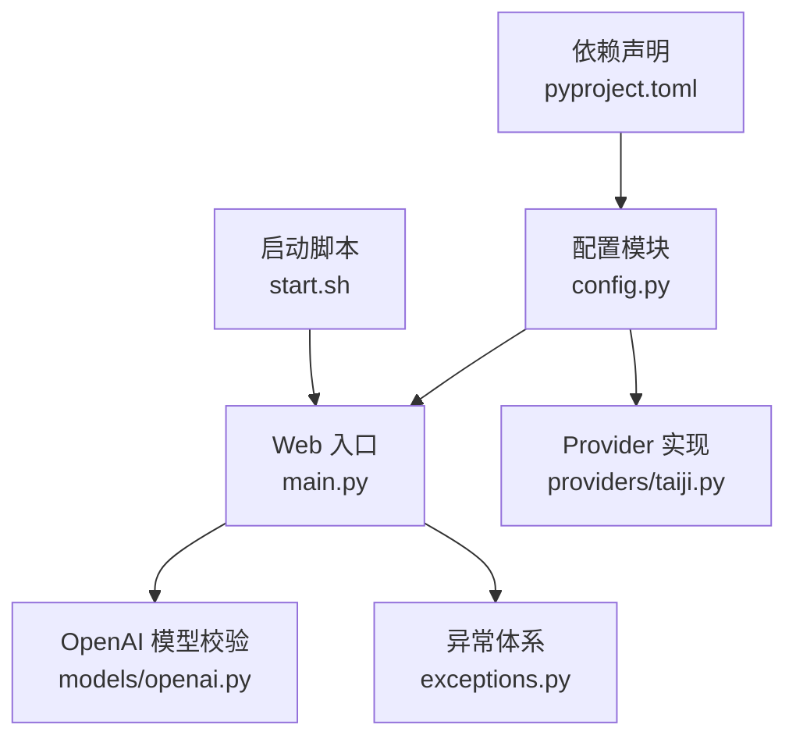
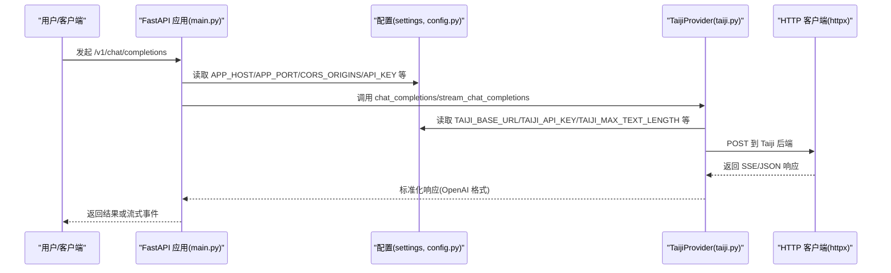
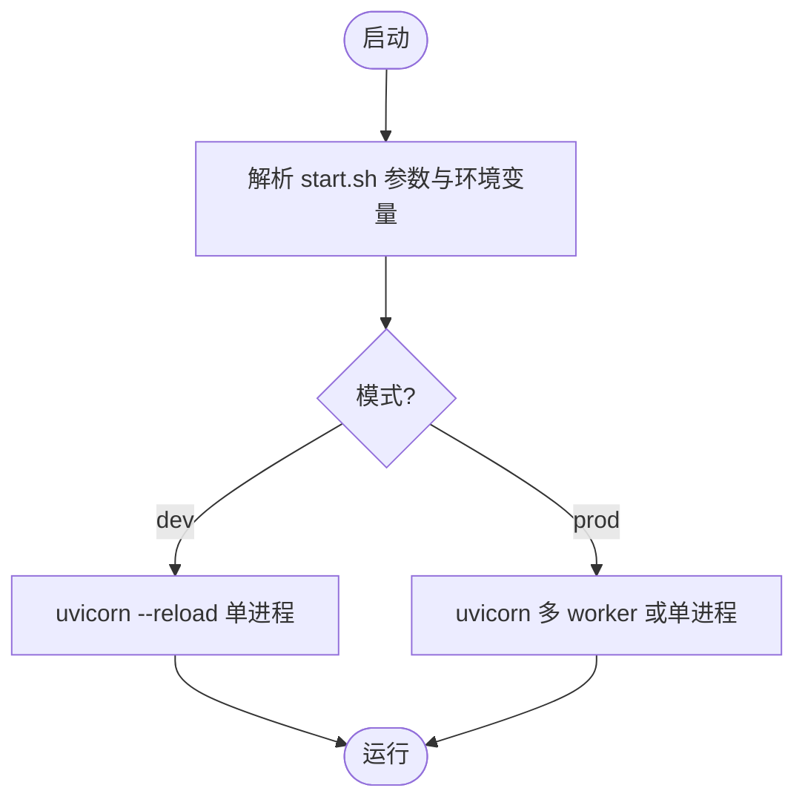
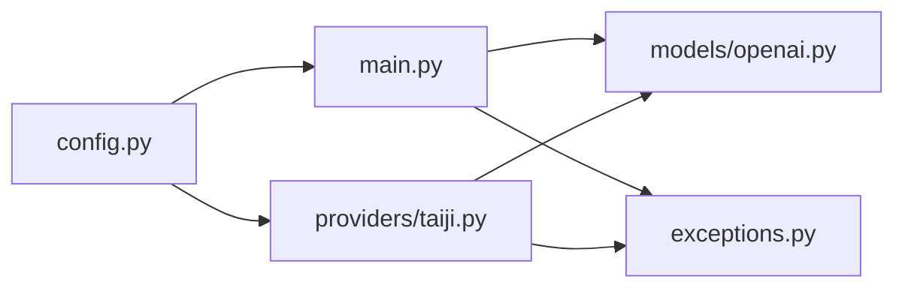

# 配置管理系统

<cite>
**本文引用的文件**   
- [src/openai_provider/config.py](file://src/openai_provider/config.py)
- [src/openai_provider/main.py](file://src/openai_provider/main.py)
- [src/openai_provider/providers/taiji.py](file://src/openai_provider/providers/taiji.py)
- [src/openai_provider/models/openai.py](file://src/openai_provider/models/openai.py)
- [src/openai_provider/exceptions.py](file://src/openai_provider/exceptions.py)
- [pyproject.toml](file://pyproject.toml)
- [start.sh](file://start.sh)
</cite>

## 目录
1. [简介](#简介)
2. [项目结构](#项目结构)
3. [核心组件](#核心组件)
4. [架构总览](#架构总览)
5. [详细组件分析](#详细组件分析)
6. [依赖关系分析](#依赖关系分析)
7. [性能与容量规划](#性能与容量规划)
8. [故障排查指南](#故障排查指南)
9. [结论](#结论)
10. [附录：部署场景配置示例](#附录部署场景配置示例)

## 简介
本文件面向“配置管理系统”，聚焦于基于 Pydantic 的配置模型设计、环境变量映射、类型验证与默认值管理；解释所有配置项的作用、取值范围与相互依赖；说明运行时热重载与环境切换策略；给出安全最佳实践（敏感信息管理、访问控制）；并提供开发、测试、生产环境的配置示例；最后总结配置校验失败时的错误处理与回退机制。

## 项目结构
本项目采用分层组织方式，配置集中在单一模块中，通过全局实例被应用各层共享使用。关键路径如下：
- 配置定义与加载：src/openai_provider/config.py
- Web 服务入口与中间件：src/openai_provider/main.py
- Provider 实现（读取配置并调用后端）：src/openai_provider/providers/taiji.py
- OpenAI 兼容数据模型（用于请求/响应校验）：src/openai_provider/models/openai.py
- 自定义异常体系：src/openai_provider/exceptions.py
- 启动脚本与环境模式切换：start.sh
- 依赖声明与构建配置：pyproject.toml

图表来源
- [src/openai_provider/config.py:12-55](file://src/openai_provider/config.py#L12-L55)
- [src/openai_provider/main.py:81-99](file://src/openai_provider/main.py#L81-L99)
- [src/openai_provider/providers/taiji.py:46-61](file://src/openai_provider/providers/taiji.py#L46-L61)
- [src/openai_provider/models/openai.py:83-101](file://src/openai_provider/models/openai.py#L83-L101)
- [src/openai_provider/exceptions.py:8-40](file://src/openai_provider/exceptions.py#L8-L40)
- [start.sh:98-122](file://start.sh#L98-L122)
- [pyproject.toml:10-16](file://pyproject.toml#L10-L16)

章节来源
- [src/openai_provider/config.py:12-55](file://src/openai_provider/config.py#L12-L55)
- [src/openai_provider/main.py:81-99](file://src/openai_provider/main.py#L81-L99)
- [src/openai_provider/providers/taiji.py:46-61](file://src/openai_provider/providers/taiji.py#L46-L61)
- [src/openai_provider/models/openai.py:83-101](file://src/openai_provider/models/openai.py#L83-L101)
- [src/openai_provider/exceptions.py:8-40](file://src/openai_provider/exceptions.py#L8-L40)
- [start.sh:98-122](file://start.sh#L98-L122)
- [pyproject.toml:10-16](file://pyproject.toml#L10-L16)

## 核心组件
- Settings 配置类：基于 pydantic-settings 的 BaseSettings，统一从环境变量读取，支持 .env 文件与默认值兜底，提供字段级类型与范围约束。
- 全局 settings 实例：在模块导入时创建，供 main 和 provider 直接消费。
- 启动脚本 start.sh：封装 uvicorn 启动参数，支持 dev/prod 模式与 --port/--host/--workers 等选项，结合环境变量完成环境切换。

章节来源
- [src/openai_provider/config.py:12-55](file://src/openai_provider/config.py#L12-L55)
- [start.sh:98-122](file://start.sh#L98-L122)

## 架构总览
配置系统在整个系统中的位置与交互如下：
- 应用启动时，main 模块导入 config.settings，初始化 CORS、鉴权中间件等。
- Provider 在构造时读取配置项，建立对后端的连接参数与行为开关。
- 启动脚本根据传入参数与环境变量决定运行模式（是否启用热重载、worker 数量）。

图表来源
- [src/openai_provider/main.py:134-257](file://src/openai_provider/main.py#L134-L257)
- [src/openai_provider/config.py:12-55](file://src/openai_provider/config.py#L12-L55)
- [src/openai_provider/providers/taiji.py:520-600](file://src/openai_provider/providers/taiji.py#L520-L600)

## 详细组件分析

### 配置模型设计与环境变量映射
- 基础能力
  - 读取顺序：环境变量 > .env 文件 > 默认值。
  - 忽略多余环境变量：extra="ignore"，避免未知键导致启动失败。
  - 编码设置：.env 文件使用 utf-8 编码。
- 字段与约束
  - 字符串型：如 TAIJI_BASE_URL、TAIJI_API_KEY、CORS_ORIGINS、API_KEY、APP_HOST。
  - 整型带范围：如 TAIJI_MAX_TEXT_LENGTH、APP_PORT、MODEL_CONTEXT_LENGTH、MODEL_MAX_COMPLETION_TOKENS，均使用 Field 进行 ge/le 约束。
  - 列表派生属性：content_fields_list 将逗号分隔的 TAIJI_CONTENT_FIELDS 解析为列表，便于下游按优先级提取内容字段。
- 默认值与用途
  - TAIJI_BASE_URL：后端地址，默认指向线上地址。
  - TAIJI_API_KEY：后端认证凭据。
  - TAIJI_MAX_TEXT_LENGTH：限制单次文本长度，防止超出后端限制。
  - TAIJI_CONTENT_FIELDS：SSE 响应中提取文本的字段名序列。
  - TAIJI_SESSION_ID/TAIJI_SESSION_COOKIE：会话标识与 Cookie，用于维持会话上下文。
  - API_KEY：Provider 侧可选鉴权密钥，未配置则跳过鉴权。
  - APP_HOST/APP_PORT：服务监听地址与端口。
  - MODEL_CONTEXT_LENGTH/MODEL_MAX_COMPLETION_TOKENS：对外暴露的模型能力元信息。
  - CORS_ORIGINS：跨域白名单，逗号分隔。

章节来源
- [src/openai_provider/config.py:12-55](file://src/openai_provider/config.py#L12-L55)

### 配置项详解与依赖关系
- 后端相关
  - TAIJI_BASE_URL：影响 Provider 请求 URL 前缀。
  - TAIJI_API_KEY：作为 Authorization 头传递至后端。
  - TAIJI_MAX_TEXT_LENGTH：Provider 在拼接消息时会做截断保护，超过阈值会强制截断并记录告警日志。
  - TAIJI_CONTENT_FIELDS：Provider 解析 SSE 响应时按此顺序尝试提取文本。
  - TAIJI_SESSION_ID/TAIJI_SESSION_COOKIE：Provider 在请求时携带，用于会话保持。
- 服务相关
  - APP_HOST/APP_PORT：由 main 启动 uvicorn 时使用。
  - CORS_ORIGINS：应用启动时解析为列表并注入 CORSMiddleware。
- 模型能力
  - MODEL_CONTEXT_LENGTH/MODEL_MAX_COMPLETION_TOKENS：/v1/models 接口返回的元信息，影响客户端行为。
- 鉴权
  - API_KEY：若为空则不启用鉴权；非空则要求请求携带匹配的 Bearer token。

依赖关系要点
- main 依赖 settings 中的 APP_HOST、APP_PORT、CORS_ORIGINS、API_KEY。
- Provider 依赖 settings 中的 TAIJI_* 系列字段。
- content_fields_list 是 TAIJI_CONTENT_FIELDS 的派生视图，二者存在强耦合。

章节来源
- [src/openai_provider/main.py:91-99](file://src/openai_provider/main.py#L91-L99)
- [src/openai_provider/main.py:108-125](file://src/openai_provider/main.py#L108-L125)
- [src/openai_provider/providers/taiji.py:53-61](file://src/openai_provider/providers/taiji.py#L53-L61)
- [src/openai_provider/providers/taiji.py:520-600](file://src/openai_provider/providers/taiji.py#L520-L600)
- [src/openai_provider/config.py:49-52](file://src/openai_provider/config.py#L49-L52)

### 运行时热重载与环境切换策略
- 热重载
  - 开发模式：start.sh 以 --reload 启动 uvicorn，修改代码后自动重启进程，便于调试。
  - 生产模式：不使用 --reload，可通过多 worker 提升吞吐。
- 环境切换
  - 通过命令行参数 dev/prod 选择模式。
  - 通过环境变量覆盖端口、主机、worker 数等。
  - 注意：当前 main 中 uvicorn.run 显式关闭了 reload，但实际推荐通过 start.sh 启动以启用 --reload。

图表来源
- [start.sh:98-122](file://start.sh#L98-L122)

章节来源
- [start.sh:98-122](file://start.sh#L98-L122)
- [src/openai_provider/main.py:333-341](file://src/openai_provider/main.py#L333-L341)

### 安全配置最佳实践
- 敏感信息管理
  - 将 TAIJI_API_KEY、API_KEY、TAIJI_SESSION_COOKIE 等敏感信息放入受控的环境变量或密钥管理服务，不要硬编码进代码或提交到版本库。
  - .env 文件仅用于本地开发，不应包含真实生产凭据。
- 访问控制
  - 建议在生产环境始终设置 API_KEY，并在网关层配合 TLS、IP 白名单、速率限制等策略。
  - CORS_ORIGINS 应明确列出可信域名，避免使用通配符 "*"。
- 最小权限原则
  - TAIJI_SESSION_COOKIE 仅在需要会话保持时配置，且定期轮换。
  - 合理设置 TAIJI_MAX_TEXT_LENGTH，避免过大请求带来资源消耗风险。

[本节为通用安全建议，不直接分析具体文件]

### 配置验证失败时的错误处理与回退机制
- 配置阶段
  - 当环境变量类型错误或违反 Field 约束（如端口不在合法范围），BaseSettings 会在实例化时报错，阻止应用启动，从而避免运行期不一致。
- 请求阶段
  - 请求体校验失败：main 捕获 JSON 解析/模型校验异常，返回 400 标准错误体。
  - Provider 错误：网络超时、HTTP 错误、业务错误分别抛出结构化异常，main 将其转换为 OpenAI 风格错误体（如 502）。
- 回退策略
  - Token 计数：若 tiktoken 不可用，回退为字符估算。
  - 文本长度：超过 TAIJI_MAX_TEXT_LENGTH 时强制截断并记录告警。
  - 内容提取：按 TAIJI_CONTENT_FIELDS 优先级尝试，最终兜底返回整个 JSON 字符串。

章节来源
- [src/openai_provider/main.py:163-183](file://src/openai_provider/main.py#L163-L183)
- [src/openai_provider/main.py:221-241](file://src/openai_provider/main.py#L221-L241)
- [src/openai_provider/providers/taiji.py:66-75](file://src/openai_provider/providers/taiji.py#L66-L75)
- [src/openai_provider/providers/taiji.py:531-537](file://src/openai_provider/providers/taiji.py#L531-L537)
- [src/openai_provider/providers/taiji.py:501-509](file://src/openai_provider/providers/taiji.py#L501-L509)
- [src/openai_provider/exceptions.py:8-40](file://src/openai_provider/exceptions.py#L8-L40)

## 依赖关系分析
- 外部依赖
  - fastapi、uvicorn、httpx、pydantic、pydantic-settings 均在 pyproject.toml 中声明。
- 内部依赖
  - main 依赖 config.settings、exceptions、models/openai、providers/taiji。
  - providers/taiji 依赖 config.settings、models/openai、exceptions。
  - models/openai 为纯数据模型，无运行时副作用。

图表来源
- [src/openai_provider/config.py:12-55](file://src/openai_provider/config.py#L12-L55)
- [src/openai_provider/main.py:23-26](file://src/openai_provider/main.py#L23-L26)
- [src/openai_provider/providers/taiji.py:18-40](file://src/openai_provider/providers/taiji.py#L18-L40)
- [pyproject.toml:10-16](file://pyproject.toml#L10-L16)

章节来源
- [pyproject.toml:10-16](file://pyproject.toml#L10-L16)
- [src/openai_provider/main.py:23-26](file://src/openai_provider/main.py#L23-L26)
- [src/openai_provider/providers/taiji.py:18-40](file://src/openai_provider/providers/taiji.py#L18-L40)

## 性能与容量规划
- 文本长度上限
  - TAIJI_MAX_TEXT_LENGTH 直接影响 Provider 的截断策略与内存占用。建议根据后端能力与典型负载调优。
- 并发与 Worker
  - 生产环境建议使用多 worker 模式，结合容器编排横向扩展。
- 令牌统计
  - 优先使用后端返回的 token 信息，否则回退估算，避免过度计算。

[本节为通用性能建议，不直接分析具体文件]

## 故障排查指南
- 常见错误定位
  - 配置校验失败：检查环境变量类型与范围是否符合 Field 约束。
  - 鉴权失败：确认 API_KEY 是否正确设置，客户端是否携带正确 Bearer token。
  - 后端错误：查看 Provider 抛出的结构化异常类型（超时、HTTP、业务错误），并结合日志定位。
- 日志与可观测性
  - 原始请求/响应日志已开启，可在 logs/ 目录下查看结构化日志，辅助问题定位。

章节来源
- [src/openai_provider/main.py:49-69](file://src/openai_provider/main.py#L49-L69)
- [src/openai_provider/exceptions.py:8-40](file://src/openai_provider/exceptions.py#L8-L40)

## 结论
本配置管理系统以 pydantic-settings 为核心，实现了集中、可验证、可扩展的配置管理。通过环境变量与 .env 文件的组合，兼顾开发与生产的灵活性；通过 Field 约束与结构化异常，提升了健壮性与可维护性。配合启动脚本的环境切换与热重载，能够快速迭代与稳定交付。

[本节为总结性内容，不直接分析具体文件]

## 附录：部署场景配置示例

- 开发环境
  - 目标：快速迭代，启用热重载，宽松跨域。
  - 关键配置建议：
    - APP_HOST=0.0.0.0
    - APP_PORT=8080
    - CORS_ORIGINS=*
    - API_KEY=""（本地调试可关闭鉴权）
    - TAIJI_BASE_URL 指向开发后端
    - TAIJI_API_KEY 填入开发凭据
    - TAIJI_MAX_TEXT_LENGTH 适当降低以节省资源
  - 启动方式：./start.sh dev --port 8080

- 测试环境
  - 目标：模拟生产行为，启用鉴权与严格跨域。
  - 关键配置建议：
    - APP_HOST=0.0.0.0
    - APP_PORT=8080
    - CORS_ORIGINS=https://test.example.com
    - API_KEY=<测试密钥>
    - TAIJI_BASE_URL 指向测试后端
    - TAIJI_API_KEY 填入测试凭据
    - TAIJI_MAX_TEXT_LENGTH 与生产一致
  - 启动方式：./start.sh prod --port 8080

- 生产环境
  - 目标：高可用、安全、可观测。
  - 关键配置建议：
    - APP_HOST=0.0.0.0
    - APP_PORT=8080
    - CORS_ORIGINS 精确列出可信域名
    - API_KEY 必须设置，并与网关层联动
    - TAIJI_BASE_URL 指向生产后端
    - TAIJI_API_KEY 通过密钥管理服务注入
    - TAIJI_MAX_TEXT_LENGTH 按后端能力设定
    - 使用多 worker 启动：./start.sh prod --workers N
  - 其他：配合 TLS、反向代理、限流、审计日志等基础设施。

[本节为概念性示例，不直接分析具体文件]