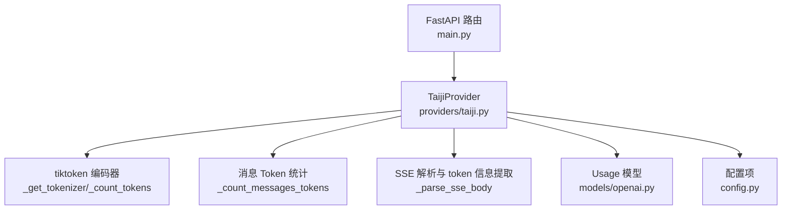
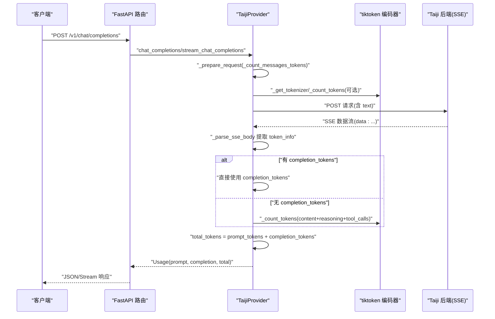
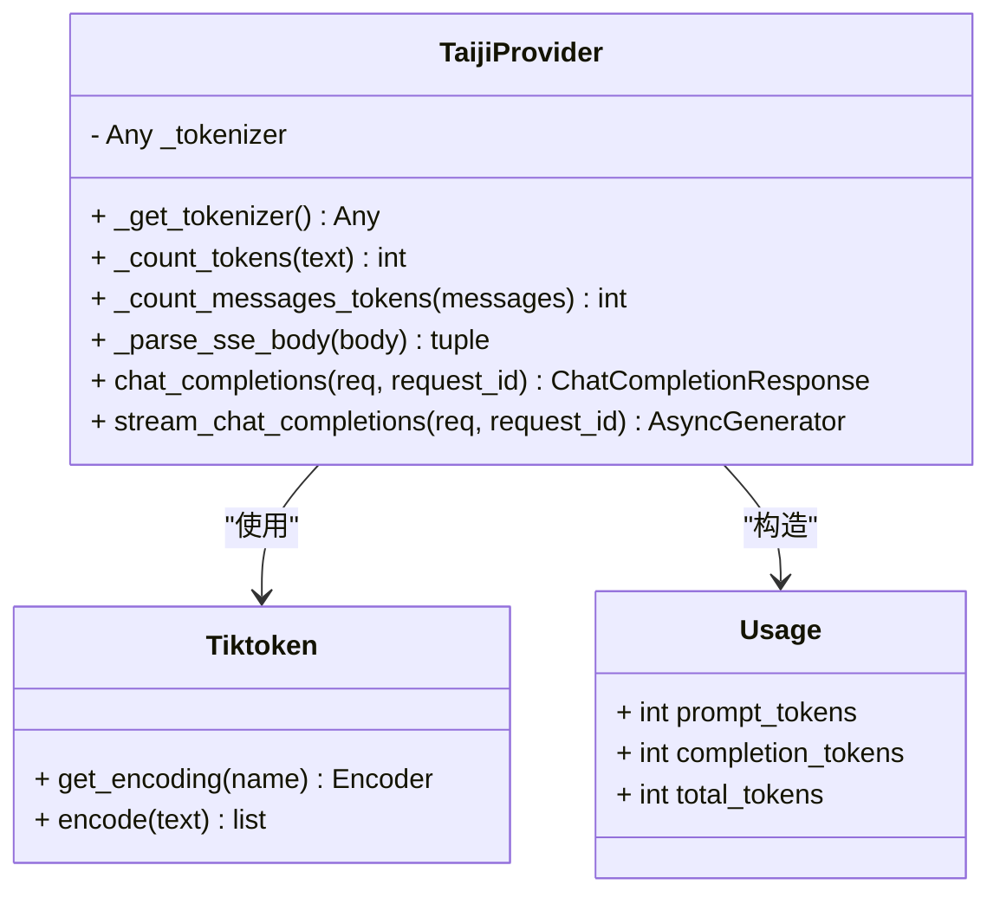
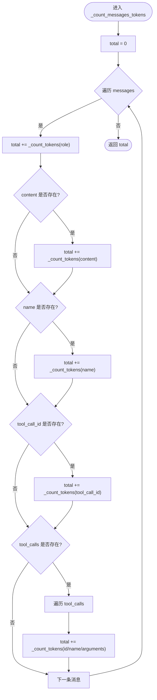
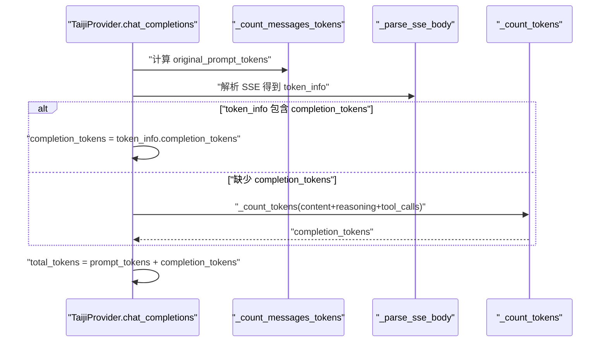
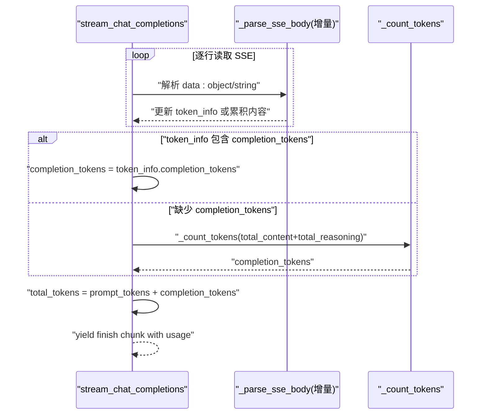
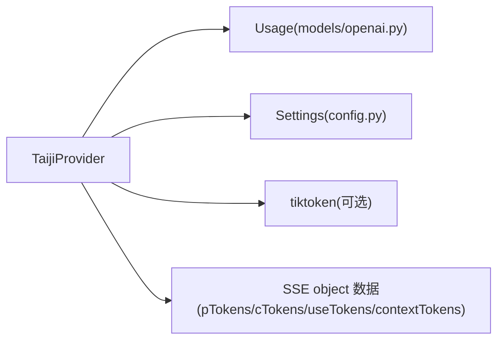

# Token 使用统计

<cite>
**本文引用的文件**   
- [src/openai_provider/providers/taiji.py](file://src/openai_provider/providers/taiji.py)
- [src/openai_provider/models/openai.py](file://src/openai_provider/models/openai.py)
- [src/openai_provider/config.py](file://src/openai_provider/config.py)
- [tests/test_regression.py](file://tests/test_regression.py)
</cite>

## 目录
1. [简介](#简介)
2. [项目结构](#项目结构)
3. [核心组件](#核心组件)
4. [架构总览](#架构总览)
5. [详细组件分析](#详细组件分析)
6. [依赖关系分析](#依赖关系分析)
7. [性能考量](#性能考量)
8. [故障排查指南](#故障排查指南)
9. [结论](#结论)
10. [附录](#附录)

## 简介
本技术文档聚焦于“Token 使用统计”功能，系统性阐述以下要点：
- Token 计数的实现原理与关键方法
- tiktoken 编码器的使用与回退策略
- 消息级 Token 计算与总 Token 统计
- tool_calls 参数 Token 的处理方式
- 中英文混合文本的计数行为
- 集成不同编码器、自定义计数策略的方法
- 性能优化建议与准确性/误差范围说明

## 项目结构
本项目为 OpenAI 兼容网关，将请求转发至 Taiji LLM 后端。Token 统计逻辑集中在 Provider 层，负责：
- 构建请求前对 prompt 进行消息级 Token 估算
- 解析 SSE 响应中的 token 信息（如可用）
- 在缺失服务端 token 时，基于本地编码器或字符估算回退完成 completion_tokens 与 total_tokens 的计算

图表来源
- [src/openai_provider/providers/taiji.py:65-120](file://src/openai_provider/providers/taiji.py#L65-L120)
- [src/openai_provider/models/openai.py:125-131](file://src/openai_provider/models/openai.py#L125-L131)
- [src/openai_provider/config.py:24-33](file://src/openai_provider/config.py#L24-L33)

章节来源
- [src/openai_provider/providers/taiji.py:65-120](file://src/openai_provider/providers/taiji.py#L65-L120)
- [src/openai_provider/models/openai.py:125-131](file://src/openai_provider/models/openai.py#L125-L131)
- [src/openai_provider/config.py:24-33](file://src/openai_provider/config.py#L24-L33)

## 核心组件
- 编码器获取与缓存
  - _get_tokenizer：惰性加载 tiktoken 编码器（cl100k_base），失败则记录警告并将内部编码器置空以启用回退。
- 文本 Token 计数
  - _count_tokens：优先使用 tiktoken.encode；不可用时采用字符估算回退（中文按约每 2 字符≈1 token，英文等按约每 4 字符≈1 token）。
- 消息级 Token 统计
  - _count_messages_tokens：遍历 messages，累加 role、content、name、tool_call_id 以及每个 tool_calls 的 id、function.name、function.arguments 的 Token 数。
- SSE 响应 token 信息提取
  - _parse_sse_body：从 type=object 的数据块中抽取 promptTokens、completionTokens、useTokens、contextTokens 等字段。
- 非流式/流式响应中的 Usage 组装
  - chat_completions 与 stream_chat_completions：优先使用服务端返回的 completion_tokens；否则基于 content/reasoning_content/tool_calls 拼接后调用 _count_tokens 估算；total_tokens = prompt_tokens + completion_tokens。

章节来源
- [src/openai_provider/providers/taiji.py:65-94](file://src/openai_provider/providers/taiji.py#L65-L94)
- [src/openai_provider/providers/taiji.py:96-120](file://src/openai_provider/providers/taiji.py#L96-L120)
- [src/openai_provider/providers/taiji.py:633-668](file://src/openai_provider/providers/taiji.py#L633-L668)
- [src/openai_provider/providers/taiji.py:737-758](file://src/openai_provider/providers/taiji.py#L737-L758)
- [src/openai_provider/providers/taiji.py:930-954](file://src/openai_provider/providers/taiji.py#L930-L954)

## 架构总览
下图展示了 Token 统计在非流式与流式路径中的关键流程与数据流向。

图表来源
- [src/openai_provider/providers/taiji.py:520-600](file://src/openai_provider/providers/taiji.py#L520-L600)
- [src/openai_provider/providers/taiji.py:633-668](file://src/openai_provider/providers/taiji.py#L633-L668)
- [src/openai_provider/providers/taiji.py:737-758](file://src/openai_provider/providers/taiji.py#L737-L758)
- [src/openai_provider/providers/taiji.py:930-954](file://src/openai_provider/providers/taiji.py#L930-L954)

## 详细组件分析

### 编码器与回退策略
- 编码器选择
  - 默认使用 cl100k_base（gpt-3.5/gpt-4 系列常用编码），通过 tiktoken.get_encoding 获取并缓存到实例变量。
- 回退策略
  - 当 tiktoken 未安装或导入失败时，记录警告日志，并在后续计数中使用字符估算：
    - 中文区间判断：\u4e00-\u9fff
    - 估算公式：max(1, 中文数 // 2 + 其他字符数 // 4)
- 适用场景
  - 生产环境建议安装 tiktoken 以获得更精确的计数；若受限环境无法安装，回退策略仍可工作但存在误差。

章节来源
- [src/openai_provider/providers/taiji.py:65-94](file://src/openai_provider/providers/taiji.py#L65-L94)

#### 类与方法关系图

图表来源
- [src/openai_provider/providers/taiji.py:65-120](file://src/openai_provider/providers/taiji.py#L65-L120)
- [src/openai_provider/models/openai.py:125-131](file://src/openai_provider/models/openai.py#L125-L131)

### 消息级 Token 计算与 tool_calls 处理
- 遍历每条消息，累加：
  - role、content、name、tool_call_id
  - 对于 tool_calls：id、function.name、function.arguments 均参与计数
- 注意：arguments 是字符串形式，直接计入其 Token 数，避免重复序列化带来的额外开销。

章节来源
- [src/openai_provider/providers/taiji.py:96-120](file://src/openai_provider/providers/taiji.py#L96-L120)

#### 流程图：消息 Token 累计

图表来源
- [src/openai_provider/providers/taiji.py:96-120](file://src/openai_provider/providers/taiji.py#L96-L120)

### 非流式响应中的 Token 统计
- prompt_tokens：使用原始消息统计值（截断前的真实请求大小），确保上层系统能正确触发上下文压缩等策略。
- completion_tokens：
  - 优先使用 SSE object 数据中的 completion_tokens
  - 否则根据 content、reasoning_content、tool_calls 拼接后的文本调用 _count_tokens 估算
- total_tokens：严格等于 prompt_tokens + completion_tokens，符合 OpenAI 规范

章节来源
- [src/openai_provider/providers/taiji.py:737-758](file://src/openai_provider/providers/taiji.py#L737-L758)

#### 序列图：非流式 Token 统计

图表来源
- [src/openai_provider/providers/taiji.py:520-600](file://src/openai_provider/providers/taiji.py#L520-L600)
- [src/openai_provider/providers/taiji.py:633-668](file://src/openai_provider/providers/taiji.py#L633-L668)
- [src/openai_provider/providers/taiji.py:737-758](file://src/openai_provider/providers/taiji.py#L737-L758)

### 流式响应中的 Token 统计
- 与流式内容聚合同步：
  - 维护 total_content、total_reasoning，并在结束时统一计算 completion_tokens
  - 同样优先使用 SSE object 中的 completion_tokens，否则基于已聚合文本估算
- 最终在结束 chunk 中附带 usage，包含 prompt_tokens、completion_tokens、total_tokens

章节来源
- [src/openai_provider/providers/taiji.py:930-954](file://src/openai_provider/providers/taiji.py#L930-L954)

#### 序列图：流式 Token 统计

图表来源
- [src/openai_provider/providers/taiji.py:800-996](file://src/openai_provider/providers/taiji.py#L800-L996)

### 中英文混合文本的计数行为
- 使用 tiktoken 时：遵循 cl100k_base 的分词规则，对中英文混合文本给出较准确的 token 数。
- 回退策略下：
  - 中文按约每 2 字符≈1 token
  - 英文及其他字符按约每 4 字符≈1 token
  - 该策略对纯中文或纯英文场景相对稳健，但对复杂混合文本存在一定误差

章节来源
- [src/openai_provider/providers/taiji.py:77-94](file://src/openai_provider/providers/taiji.py#L77-L94)

### 集成不同的 Token 编码器与自定义计数策略
- 替换编码器
  - 可在 _get_tokenizer 中切换 tiktoken 的 encoding name（例如 gpt-4o 相关编码），或在外部注入自定义编码器实例。
- 自定义计数策略
  - 可重写 _count_tokens 以实现特定语言或领域分词器（如 jieba、sentencepiece 等）的接入。
  - 也可在 _count_messages_tokens 中扩展字段或调整权重（例如对 JSON arguments 做特殊处理）。
- 注意事项
  - 保持与现有 Usage 语义一致：prompt_tokens 应为截断前的真实请求大小；completion_tokens 需与 total_tokens 保持一致性约束。

章节来源
- [src/openai_provider/providers/taiji.py:65-94](file://src/openai_provider/providers/taiji.py#L65-94)
- [src/openai_provider/providers/taiji.py:96-120](file://src/openai_provider/providers/taiji.py#L96-L120)

### 性能优化建议
- 预装 tiktoken 以避免回退分支与额外正则/循环开销
- 复用实例级 _tokenizer 缓存（当前已实现惰性加载与缓存）
- 减少不必要的字符串拼接与序列化：
  - 在估算 completion_tokens 时仅拼接必要部分（content、reasoning_content、tool_calls 的 model_dump）
- 在高并发场景下，考虑进程内共享只读编码器实例（当前单进程内已缓存）

章节来源
- [src/openai_provider/providers/taiji.py:65-94](file://src/openai_provider/providers/taiji.py#L65-94)
- [src/openai_provider/providers/taiji.py:737-758](file://src/openai_provider/providers/taiji.py#L737-L758)
- [src/openai_provider/providers/taiji.py:930-954](file://src/openai_provider/providers/taiji.py#L930-L954)

## 依赖关系分析
- 模块耦合
  - Provider 依赖 models.openai.Usage 输出标准 Usage 结构
  - Provider 依赖 config.Settings 获取最大文本长度等配置
  - Provider 依赖 tiktoken（可选）用于精确计数
- 外部接口
  - SSE 对象类型数据中包含 promptTokens、completionTokens、useTokens、contextTokens 等字段，用于优先取用服务端统计

图表来源
- [src/openai_provider/providers/taiji.py:633-668](file://src/openai_provider/providers/taiji.py#L633-L668)
- [src/openai_provider/models/openai.py:125-131](file://src/openai_provider/models/openai.py#L125-L131)
- [src/openai_provider/config.py:24-33](file://src/openai_provider/config.py#L24-L33)

章节来源
- [src/openai_provider/providers/taiji.py:633-668](file://src/openai_provider/providers/taiji.py#L633-L668)
- [src/openai_provider/models/openai.py:125-131](file://src/openai_provider/models/openai.py#L125-L131)
- [src/openai_provider/config.py:24-33](file://src/openai_provider/config.py#L24-L33)

## 性能考量
- 时间复杂度
  - _count_tokens：O(n)，n 为文本长度（tiktoken 或回退估算）
  - _count_messages_tokens：O(m·n)，m 为消息数量，n 为平均消息长度
- 空间复杂度
  - 主要消耗在字符串拼接与临时列表，整体线性增长
- 优化点
  - 避免重复编码：尽量复用 _tokenizer 实例
  - 仅在必要时估算 completion_tokens（优先使用 SSE 提供的数值）
  - 控制工具调用参数的序列化体积（arguments 过大时可考虑采样或摘要）

[本节为通用性能讨论，不直接分析具体文件]

## 故障排查指南
- 常见告警
  - “tiktoken not available, falling back to character-based estimation”：表示未安装 tiktoken，系统将使用字符估算。可通过安装依赖解决。
- 验证用例
  - 测试覆盖非流式与流式两种路径下的 completion_tokens 取值，确认 SSE object 数据被正确解析并写入 usage。
- 定位步骤
  - 检查 SSE object 数据是否包含 completionTokens/promptTokens/useTokens
  - 核对 _count_messages_tokens 是否正确遍历了所有消息字段与 tool_calls
  - 确认 total_tokens 是否等于 prompt_tokens + completion_tokens

章节来源
- [logs/taiji-provider.log](file://logs/taiji-provider.log)
- [tests/test_regression.py:147-175](file://tests/test_regression.py#L147-L175)

## 结论
- 本实现以 tiktoken 为主、字符估算回退为辅，兼顾精度与可用性
- 消息级统计覆盖 role/content/name/tool_call_id 及 tool_calls 的关键字段，保证 prompt_tokens 的完整性
- 非流式与流式路径均优先使用 SSE 提供的 completion_tokens，缺失时再估算，且 total_tokens 严格满足 OpenAI 规范
- 针对中英文混合文本，tiktoken 提供较高精度；回退策略具备基本稳健性但存在误差
- 通过合理集成与优化，可在保证准确性的同时提升统计性能

[本节为总结性内容，不直接分析具体文件]

## 附录

### 代码片段路径参考
- 编码器获取与回退
  - [src/openai_provider/providers/taiji.py:65-94](file://src/openai_provider/providers/taiji.py#L65-L94)
- 消息级 Token 统计
  - [src/openai_provider/providers/taiji.py:96-120](file://src/openai_provider/providers/taiji.py#L96-L120)
- SSE token 信息提取
  - [src/openai_provider/providers/taiji.py:633-668](file://src/openai_provider/providers/taiji.py#L633-L668)
- 非流式 Usage 组装
  - [src/openai_provider/providers/taiji.py:737-758](file://src/openai_provider/providers/taiji.py#L737-L758)
- 流式 Usage 组装
  - [src/openai_provider/providers/taiji.py:930-954](file://src/openai_provider/providers/taiji.py#L930-L954)
- Usage 模型定义
  - [src/openai_provider/models/openai.py:125-131](file://src/openai_provider/models/openai.py#L125-L131)
- 配置项（最大文本长度、会话信息等）
  - [src/openai_provider/config.py:24-33](file://src/openai_provider/config.py#L24-L33)
- 回归测试（SSE token 字段校验）
  - [tests/test_regression.py:147-175](file://tests/test_regression.py#L147-L175)