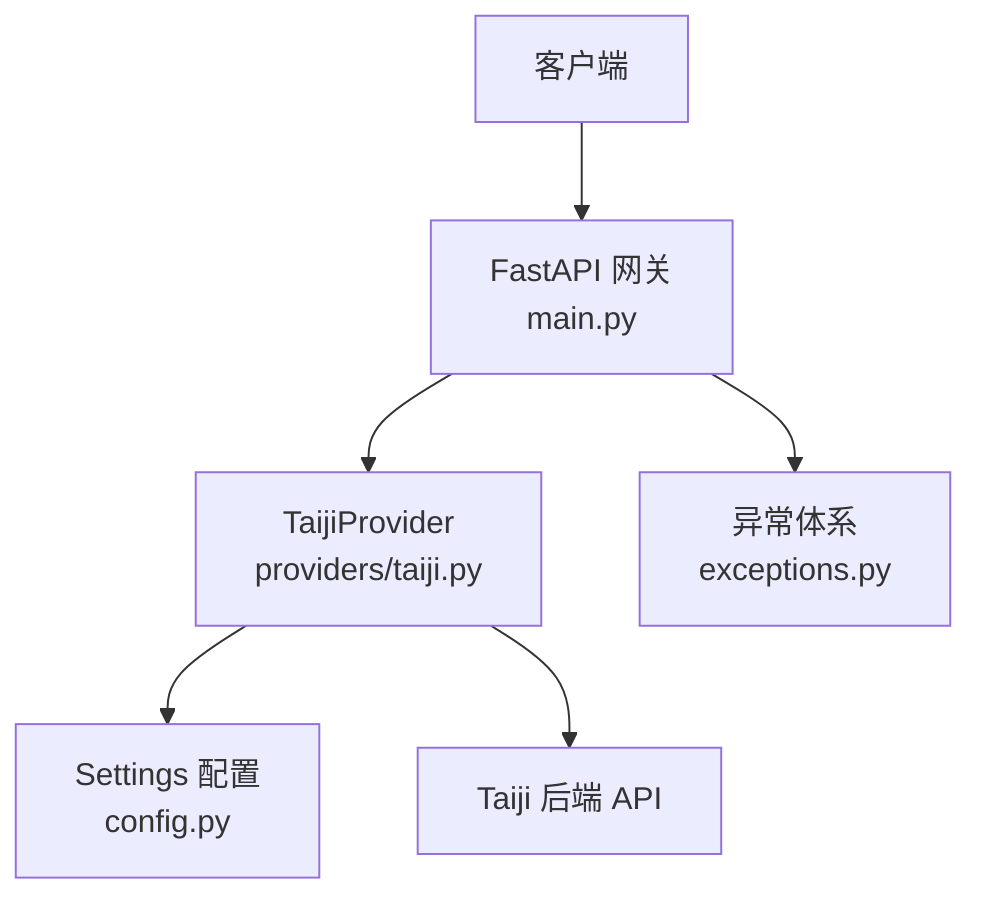
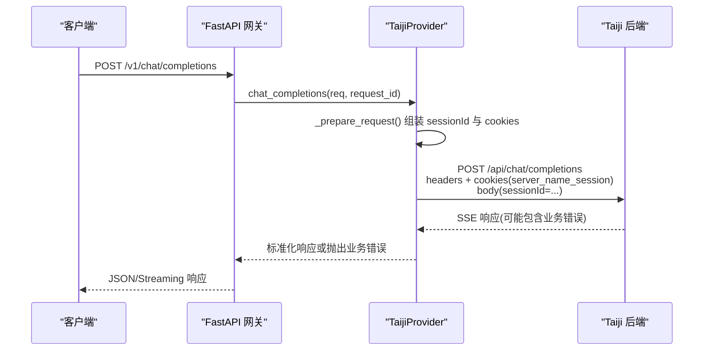
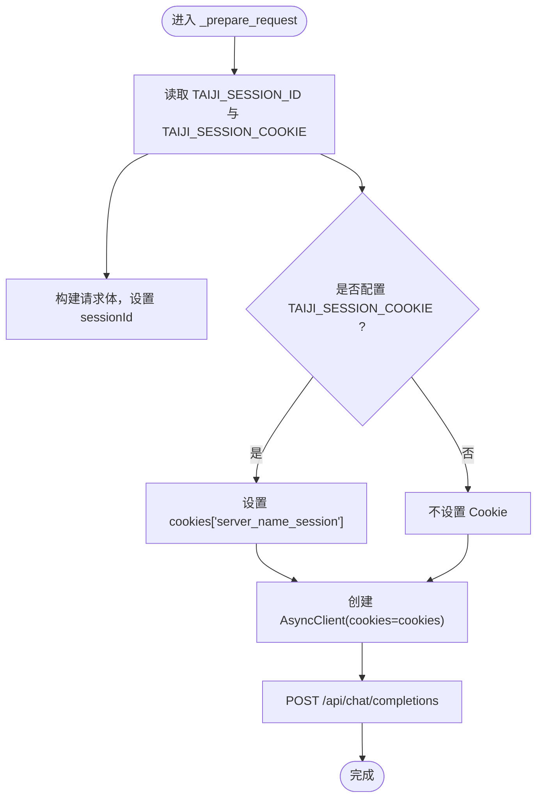
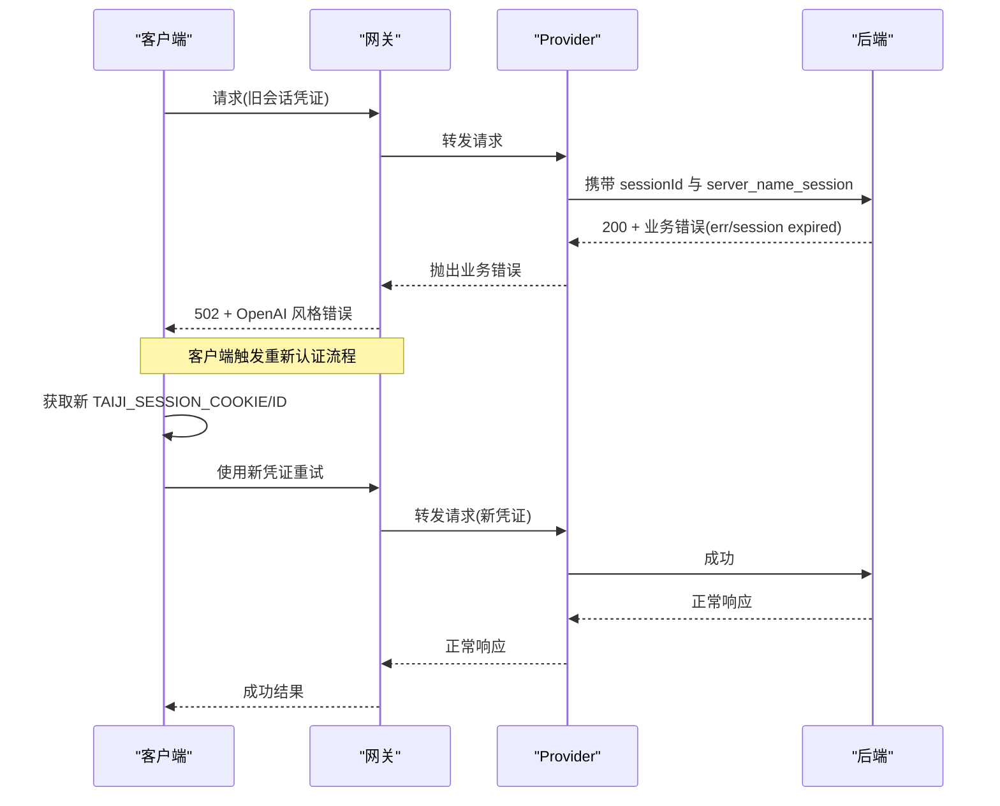
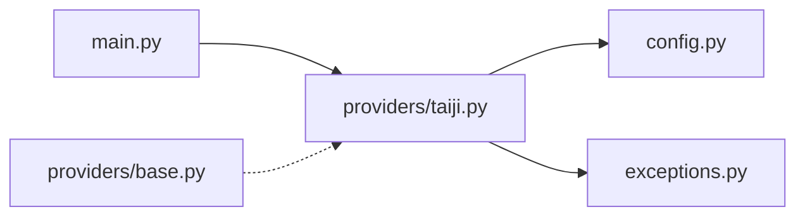

# 会话管理

<cite>
**本文引用的文件**   
- [src/openai_provider/main.py](file://src/openai_provider/main.py)
- [src/openai_provider/config.py](file://src/openai_provider/config.py)
- [src/openai_provider/providers/taiji.py](file://src/openai_provider/providers/taiji.py)
- [src/openai_provider/providers/base.py](file://src/openai_provider/providers/base.py)
- [src/openai_provider/exceptions.py](file://src/openai_provider/exceptions.py)
- [tests/e2e/conftest.py](file://tests/e2e/conftest.py)
- [tests/test_regression.py](file://tests/test_regression.py)
</cite>

## 目录
1. [简介](#简介)
2. [项目结构](#项目结构)
3. [核心组件](#核心组件)
4. [架构总览](#架构总览)
5. [详细组件分析](#详细组件分析)
6. [依赖关系分析](#依赖关系分析)
7. [性能考量](#性能考量)
8. [故障排查指南](#故障排查指南)
9. [结论](#结论)
10. [附录](#附录)

## 简介
本技术文档聚焦于“会话管理”能力，围绕会话 ID 与 Cookie 的传递、状态维护与生命周期展开。系统通过配置项注入会话标识（sessionId）与会话凭证（server_name_session cookie），在每次请求中携带至后端服务，从而维持跨请求的对话上下文。同时，文档说明如何处理会话过期与重新认证、如何在多进程或多实例下实现会话池管理，以及最佳实践与故障恢复策略。

## 项目结构
本项目为 OpenAI 兼容网关，将标准 Chat Completions 请求转发到 Taiji 后端。会话相关的关键位置如下：
- 配置层：集中读取环境变量并暴露会话参数
- Provider 层：构建请求体与 Cookie，发起 HTTP 调用
- 网关层：统一入口、日志与错误处理
- 异常体系：区分网络、HTTP 与业务错误（含会话过期等）

图表来源
- [src/openai_provider/main.py:134-257](file://src/openai_provider/main.py#L134-L257)
- [src/openai_provider/providers/taiji.py:520-600](file://src/openai_provider/providers/taiji.py#L520-L600)
- [src/openai_provider/config.py:12-56](file://src/openai_provider/config.py#L12-L56)
- [src/openai_provider/exceptions.py:8-40](file://src/openai_provider/exceptions.py#L8-L40)

章节来源
- [src/openai_provider/main.py:1-342](file://src/openai_provider/main.py#L1-L342)
- [src/openai_provider/config.py:1-56](file://src/openai_provider/config.py#L1-L56)

## 核心组件
- 配置模块 Settings：提供 TAIJI_SESSION_ID 与 TAIJI_SESSION_COOKIE 等会话相关配置项，支持 .env 与环境变量覆盖。
- Provider 抽象接口 BaseProvider：定义非流式与流式两种 Chat Completions 方法，供具体 Provider 实现。
- TaijiProvider：负责将 OpenAI 请求转换为 Taiji 请求，构造 sessionId 与 server_name_session cookie，并处理 SSE 响应解析与错误分类。
- 异常体系：将超时、HTTP 错误、业务错误（如会话过期）结构化，便于上层统一处理。

章节来源
- [src/openai_provider/config.py:24-34](file://src/openai_provider/config.py#L24-L34)
- [src/openai_provider/providers/base.py:7-46](file://src/openai_provider/providers/base.py#L7-L46)
- [src/openai_provider/providers/taiji.py:46-60](file://src/openai_provider/providers/taiji.py#L46-L60)
- [src/openai_provider/exceptions.py:8-40](file://src/openai_provider/exceptions.py#L8-L40)

## 架构总览
下图展示了从客户端到后端的完整链路，重点标注了会话 ID 与 Cookie 的传递路径。

图表来源
- [src/openai_provider/main.py:134-257](file://src/openai_provider/main.py#L134-L257)
- [src/openai_provider/providers/taiji.py:520-600](file://src/openai_provider/providers/taiji.py#L520-L600)
- [src/openai_provider/providers/taiji.py:670-780](file://src/openai_provider/providers/taiji.py#L670-L780)

## 详细组件分析

### 会话初始化与配置
- 会话标识与会话凭证由配置模块集中管理，支持通过环境变量或 .env 文件设置：
  - TAIJI_SESSION_ID：会话 ID（整数）
  - TAIJI_SESSION_COOKIE：会话 Cookie 值（字符串）
- Provider 初始化时读取这些配置，作为后续请求的默认会话上下文。

章节来源
- [src/openai_provider/config.py:24-34](file://src/openai_provider/config.py#L24-L34)
- [src/openai_provider/providers/taiji.py:53-60](file://src/openai_provider/providers/taiji.py#L53-L60)

### 会话 ID 与 Cookie 的传递机制
- 请求体中的会话 ID：
  - 在构建 Taiji 请求时，使用配置中的 TAIJI_SESSION_ID 填充 body 的 sessionId 字段。
- Cookie 中的会话凭证：
  - 若配置了 TAIJI_SESSION_COOKIE，则在请求头中附带名为 server_name_session 的 Cookie。
- HTTP 客户端：
  - 使用 httpx.AsyncClient 并在构造时传入 cookies，确保每个请求自动携带会话凭证。

图表来源
- [src/openai_provider/providers/taiji.py:520-600](file://src/openai_provider/providers/taiji.py#L520-L600)

章节来源
- [src/openai_provider/providers/taiji.py:556-593](file://src/openai_provider/providers/taiji.py#L556-L593)

### 会话状态维护与生命周期
- 会话状态由后端基于 sessionId 与 server_name_session 共同维护。前端多次请求携带相同 sessionId 与有效 Cookie，即可保持上下文连续性。
- 生命周期管理要点：
  - 会话初始化：启动前在配置中设置 TAIJI_SESSION_ID 与 TAIJI_SESSION_COOKIE。
  - 会话续期：当检测到业务错误提示会话过期时，应触发重新认证流程以获取新的会话凭证。
  - 会话失效：后端返回业务错误（例如 err/msg/code 指示会话过期）时，网关需向上层暴露明确错误码，以便客户端执行重认证。

章节来源
- [src/openai_provider/providers/taiji.py:710-720](file://src/openai_provider/providers/taiji.py#L710-L720)
- [src/openai_provider/exceptions.py:28-33](file://src/openai_provider/exceptions.py#L28-L33)

### 会话过期与重新认证处理
- 错误检测：
  - 后端有时用 HTTP 200 包装业务错误，响应体中包含 err/msg/code 字段。Provider 会解析该结构并抛出业务错误异常。
- 错误传播：
  - 网关捕获 ProviderError 并将其转换为 OpenAI 风格的错误响应（如 502）。
- 重新认证策略：
  - 客户端收到业务错误后，应调用外部登录/鉴权接口获取新的 TAIJI_SESSION_COOKIE 与 TAIJI_SESSION_ID，并更新配置或会话池。
  - 重试策略：在凭证更新后，对失败请求进行有限次数的重试。

图表来源
- [src/openai_provider/providers/taiji.py:710-720](file://src/openai_provider/providers/taiji.py#L710-L720)
- [src/openai_provider/main.py:220-241](file://src/openai_provider/main.py#L220-L241)
- [tests/test_regression.py:108-115](file://tests/test_regression.py#L108-L115)

章节来源
- [src/openai_provider/providers/taiji.py:710-720](file://src/openai_provider/providers/taiji.py#L710-L720)
- [src/openai_provider/main.py:220-241](file://src/openai_provider/main.py#L220-L241)
- [tests/test_regression.py:108-115](file://tests/test_regression.py#L108-L115)

### 跨请求的会话状态处理
- 同一会话在多轮对话中保持一致性：
  - 所有请求均携带相同的 sessionId 与有效的 server_name_session。
  - 后端据此维护上下文，保证连续对话体验。
- 客户端侧建议：
  - 缓存最新会话凭证，避免频繁重新认证。
  - 在首次请求失败且确认为会话过期时，再触发重新认证。

章节来源
- [src/openai_provider/providers/taiji.py:556-593](file://src/openai_provider/providers/taiji.py#L556-L593)

### 会话池管理
- 目标：在多用户或多租户场景下，为不同会话维护独立的凭证集合，避免共享导致的上下文污染。
- 设计要点：
  - 会话键：建议使用外部身份标识（如用户 ID）映射到会话凭证。
  - 存储介质：内存字典（单进程）、Redis（分布式）或持久化数据库。
  - 生命周期：
    - 创建：首次认证成功后写入池。
    - 续期：定时刷新或按需刷新。
    - 清理：过期或长时间未使用的会话移除。
  - 并发安全：读写加锁或使用线程安全数据结构。
- 当前代码现状：
  - 现有实现为全局配置注入，未内置会话池；可在应用启动阶段加载初始会话，或在运行时动态更新。

章节来源
- [src/openai_provider/config.py:24-34](file://src/openai_provider/config.py#L24-L34)
- [src/openai_provider/providers/taiji.py:53-60](file://src/openai_provider/providers/taiji.py#L53-L60)

### 配置示例与最佳实践
- 配置项说明：
  - TAIJI_BASE_URL：后端地址
  - TAIJI_API_KEY：后端鉴权密钥
  - TAIJI_SESSION_ID：会话 ID
  - TAIJI_SESSION_COOKIE：会话 Cookie
  - APP_HOST/APP_PORT：服务监听地址与端口
  - CORS_ORIGINS：跨域白名单
- 最佳实践：
  - 使用环境变量或 .env 管理敏感信息，避免硬编码。
  - 在生产环境启用最小权限原则，仅暴露必要的环境变量。
  - 定期轮换会话凭证，降低泄露风险。
  - 结合健康检查端点监控服务可用性。

章节来源
- [src/openai_provider/config.py:24-47](file://src/openai_provider/config.py#L24-L47)
- [src/openai_provider/main.py:128-131](file://src/openai_provider/main.py#L128-L131)

### 端到端测试中的会话配置
- E2E 测试要求：
  - 服务已启动并可访问
  - .env 中配置 TAIJI_API_KEY 与 TAIJI_SESSION_COOKIE
- 测试客户端具备重试逻辑，用于应对临时限流或超时。

章节来源
- [tests/e2e/conftest.py:1-25](file://tests/e2e/conftest.py#L1-L25)

## 依赖关系分析
- 组件耦合：
  - main.py 依赖 providers/taiji.py 与 config.py
  - taiji.py 依赖 config.py 与 exceptions.py
  - base.py 提供抽象接口，taiji.py 实现
- 外部依赖：
  - FastAPI、httpx、pydantic-settings
- 潜在循环依赖：
  - 当前无循环导入，结构清晰

图表来源
- [src/openai_provider/main.py:1-30](file://src/openai_provider/main.py#L1-L30)
- [src/openai_provider/providers/taiji.py:1-40](file://src/openai_provider/providers/taiji.py#L1-L40)
- [src/openai_provider/providers/base.py:1-10](file://src/openai_provider/providers/base.py#L1-L10)
- [src/openai_provider/exceptions.py:1-10](file://src/openai_provider/exceptions.py#L1-L10)

章节来源
- [src/openai_provider/main.py:1-30](file://src/openai_provider/main.py#L1-L30)
- [src/openai_provider/providers/taiji.py:1-40](file://src/openai_provider/providers/taiji.py#L1-L40)
- [src/openai_provider/providers/base.py:1-10](file://src/openai_provider/providers/base.py#L1-L10)
- [src/openai_provider/exceptions.py:1-10](file://src/openai_provider/exceptions.py#L1-L10)

## 性能考量
- 连接复用：
  - 当前实现为每次请求创建新的 httpx.AsyncClient，存在连接开销。可考虑引入连接池或长连接以提升吞吐。
- 超时与重试：
  - 合理设置超时时间，并结合指数退避重试策略，提高鲁棒性。
- 日志体积：
  - 结构化日志有助于定位问题，但需注意控制日志大小与轮转策略，避免磁盘压力。

[本节为通用指导，无需源码引用]

## 故障排查指南
- 常见问题与定位：
  - 会话过期：后端返回业务错误（err/msg/code），网关转为 502。检查 TAIJI_SESSION_COOKIE 是否有效。
  - 网络错误：DNS 或连接拒绝导致请求失败，查看 ProviderError 子类消息。
  - 超时：超过 60s 的请求会被判定为超时，调整超时或优化后端响应。
- 诊断步骤：
  - 查看 provider_request/provider_response 日志，确认 sessionId 与 cookies 是否正确携带。
  - 验证后端健康检查端点是否正常。
  - 使用 E2E 测试套件复现问题，观察重试行为。

章节来源
- [src/openai_provider/providers/taiji.py:670-780](file://src/openai_provider/providers/taiji.py#L670-L780)
- [src/openai_provider/main.py:220-241](file://src/openai_provider/main.py#L220-L241)
- [tests/e2e/conftest.py:47-74](file://tests/e2e/conftest.py#L47-L74)

## 结论
本项目的会话管理通过配置注入与请求携带的方式，实现了跨请求的会话上下文维护。会话过期通过业务错误识别与上层重试/重新认证策略进行处理。未来可在此基础上扩展会话池管理，提升多用户场景下的可扩展性与安全性。

[本节为总结，无需源码引用]

## 附录
- 关键配置项清单：
  - TAIJI_BASE_URL
  - TAIJI_API_KEY
  - TAIJI_SESSION_ID
  - TAIJI_SESSION_COOKIE
  - APP_HOST
  - APP_PORT
  - CORS_ORIGINS
- 关键函数与路径参考：
  - 会话参数注入与请求构建：_prepare_request
  - 业务错误检测与转换：chat_completions 中的 SSE 解析与错误判断
  - 网关错误处理：ProviderError 捕获与 OpenAI 风格响应

章节来源
- [src/openai_provider/config.py:24-47](file://src/openai_provider/config.py#L24-L47)
- [src/openai_provider/providers/taiji.py:520-600](file://src/openai_provider/providers/taiji.py#L520-L600)
- [src/openai_provider/providers/taiji.py:710-720](file://src/openai_provider/providers/taiji.py#L710-L720)
- [src/openai_provider/main.py:220-241](file://src/openai_provider/main.py#L220-L241)