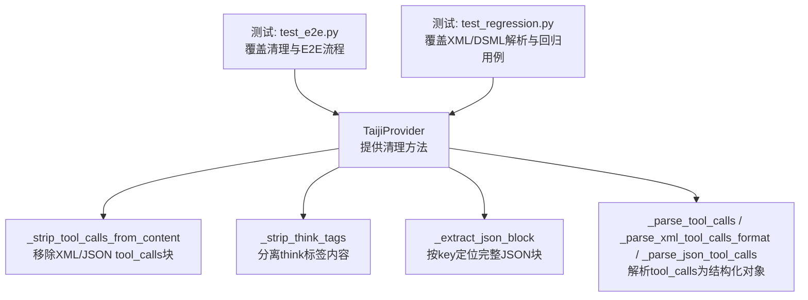
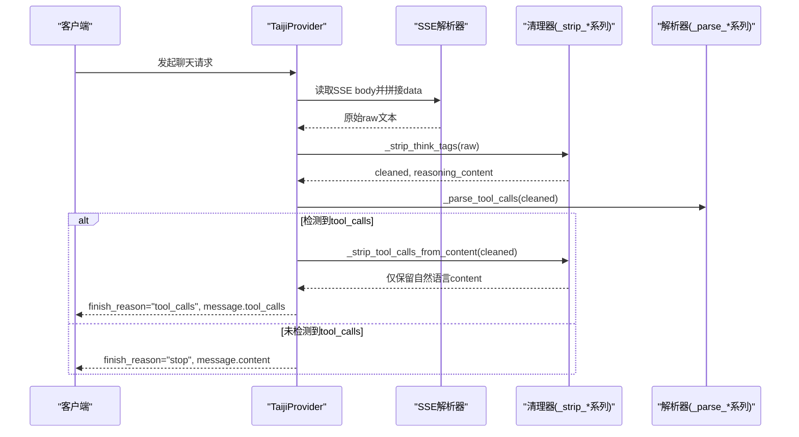
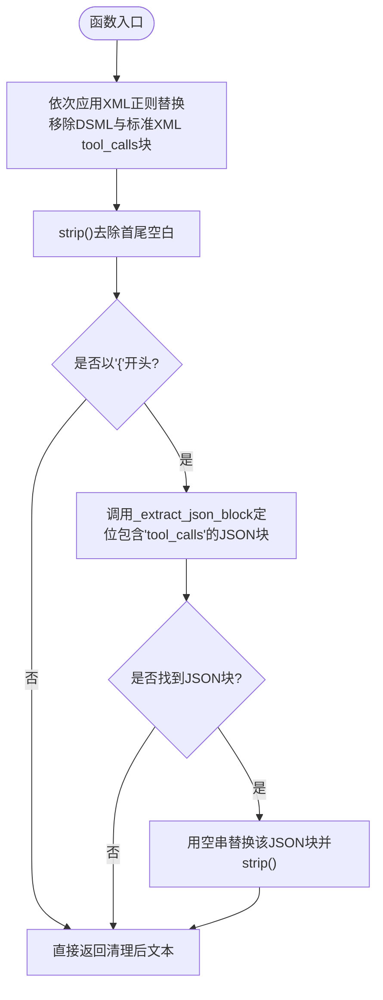
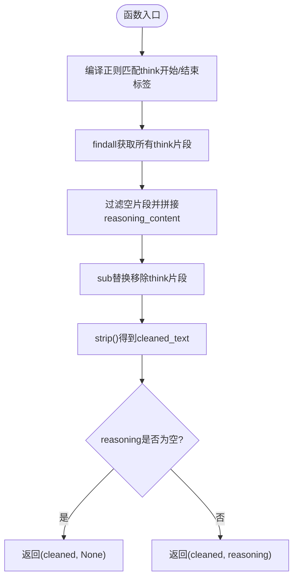
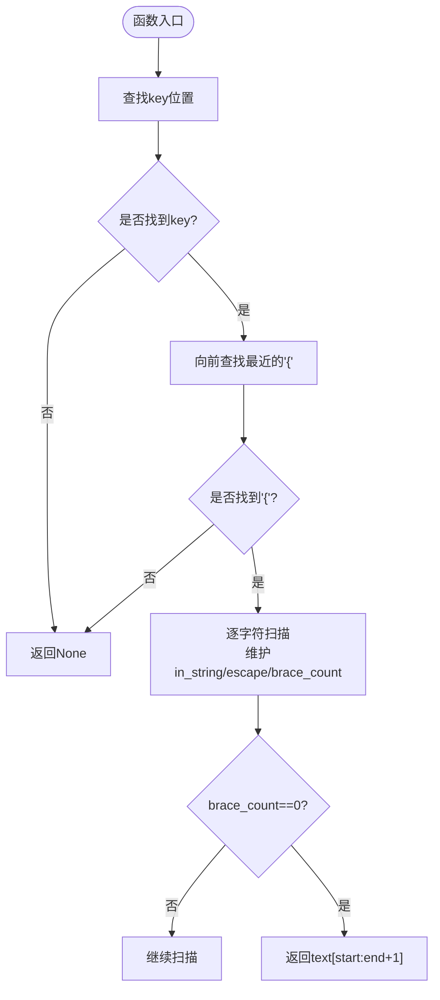
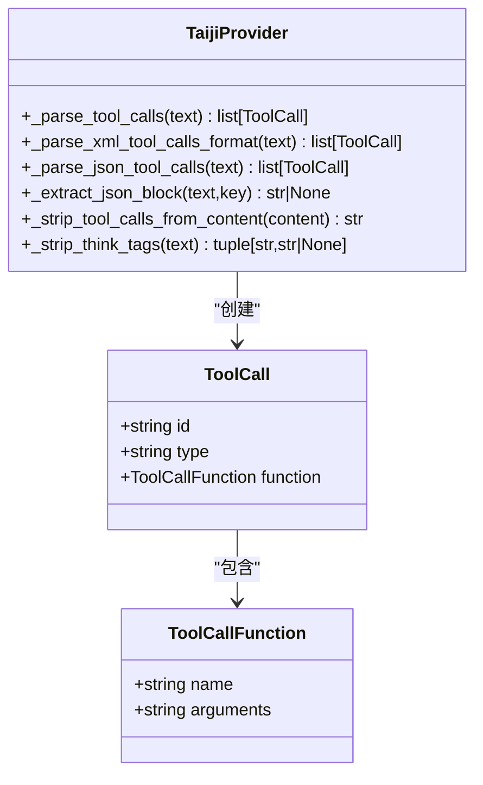
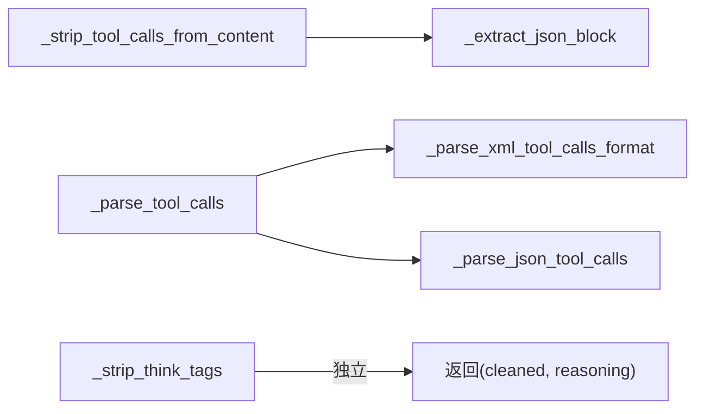

# 内容清理机制

<cite>
**本文引用的文件**
- [src/openai_provider/providers/taiji.py](file://src/openai_provider/providers/taiji.py)
- [tests/test_e2e.py](file://tests/test_e2e.py)
- [tests/test_regression.py](file://tests/test_regression.py)
</cite>

## 目录
1. [简介](#简介)
2. [项目结构](#项目结构)
3. [核心组件](#核心组件)
4. [架构总览](#架构总览)
5. [详细组件分析](#详细组件分析)
6. [依赖关系分析](#依赖关系分析)
7. [性能考量](#性能考量)
8. [故障排查指南](#故障排查指南)
9. [结论](#结论)
10. [附录](#附录)

## 简介
本技术文档聚焦于“内容清理机制”，深入解析以下两个关键方法：
- _strip_tool_calls_from_content：从模型输出中移除 XML/JSON 格式的 tool_calls 块，确保最终 content 不包含工具调用标记。
- _strip_think_tags：分离并提取思考过程（think）标签内的内容，返回清理后的正文与 reasoning_content。

文档将详细说明正则表达式匹配模式、嵌套结构处理、特殊字符转义策略、边界情况处理，并通过测试用例路径展示不同输入格式下的清理效果与质量保证。

## 项目结构
与内容清理相关的实现集中在 TaijiProvider 类中，配套测试覆盖多种输入格式与边界场景。

图表来源
- [src/openai_provider/providers/taiji.py:484-518](file://src/openai_provider/providers/taiji.py#L484-L518)
- [src/openai_provider/providers/taiji.py:320-482](file://src/openai_provider/providers/taiji.py#L320-L482)
- [tests/test_e2e.py:723-763](file://tests/test_e2e.py#L723-L763)
- [tests/test_regression.py:178-211](file://tests/test_regression.py#L178-L211)

章节来源
- [src/openai_provider/providers/taiji.py:484-518](file://src/openai_provider/providers/taiji.py#L484-L518)
- [tests/test_e2e.py:723-763](file://tests/test_e2e.py#L723-L763)
- [tests/test_regression.py:178-211](file://tests/test_regression.py#L178-L211)

## 核心组件
- _strip_tool_calls_from_content(content: str) -> str
  - 目标：从文本中移除所有 XML/JSON 格式的 tool_calls 块，返回仅保留自然语言内容的字符串。
  - 关键点：
    - 支持 DSML 与标准 XML 两种变体。
    - 支持 JSON 形式的 {"tool_calls": [...]} 整体移除。
    - 使用 re.DOTALL 跨行匹配，避免换行导致的不匹配。
    - 对 JSON 采用“按 key 向前找 {”的块定位策略，保证嵌套结构完整性。
- _strip_think_tags(text: str) -> tuple[str, str | None]
  - 目标：去除 think 标签（开始/结束标记），返回 (cleaned_text, reasoning_content)。
  - 关键点：
    - 使用非贪婪匹配收集所有 think 片段，拼接为 reasoning_content。
    - 若 reasoning_content 为空则返回 None，保持下游字段一致性。
    - 流式模式下会多次调用该方法以增量处理 think 内容。

章节来源
- [src/openai_provider/providers/taiji.py:484-499](file://src/openai_provider/providers/taiji.py#L484-L499)
- [src/openai_provider/providers/taiji.py:511-518](file://src/openai_provider/providers/taiji.py#L511-L518)

## 架构总览
内容清理在响应解析流程中的位置如下：

图表来源
- [src/openai_provider/providers/taiji.py:633-668](file://src/openai_provider/providers/taiji.py#L633-L668)
- [src/openai_provider/providers/taiji.py:722-735](file://src/openai_provider/providers/taiji.py#L722-L735)
- [src/openai_provider/providers/taiji.py:484-499](file://src/openai_provider/providers/taiji.py#L484-L499)
- [src/openai_provider/providers/taiji.py:511-518](file://src/openai_provider/providers/taiji.py#L511-L518)
- [src/openai_provider/providers/taiji.py:350-482](file://src/openai_provider/providers/taiji.py#L350-L482)

## 详细组件分析

### 组件A：_strip_tool_calls_from_content 分析与流程图
- 功能要点
  - 先通过正则移除两类 XML 块：
    - DSML 变体：包含特定前缀的 tool_calls 标签。
    - 标准 XML：普通 <tool_calls>...</tool_calls> 或开放到末尾的情况。
  - 再检测是否以 { 开头，若是则尝试用 _extract_json_block 定位包含 "tool_calls" 键的完整 JSON 对象，并将其从文本中替换为空。
  - 最后 strip 空白，返回清理结果。
- 正则与匹配策略
  - 使用 re.DOTALL 允许跨行匹配，确保多行 XML/JSON 也能被正确识别。
  - 对于 XML 闭合缺失的场景，提供开放标签到末尾的 fallback 模式，提高鲁棒性。
- JSON 块定位
  - _extract_json_block 从 key 向前查找最近的 {，然后逐字符扫描，考虑字符串内转义和引号状态，维护括号计数，直到找到匹配的 }，从而精准提取嵌套 JSON。
- 边界与已知局限
  - 当 DSML 正则分支匹配到 $ 时，可能吞掉后续内容；测试注释已明确该已知限制。
  - JSON 定位要求 key 前有 {，否则无法定位起始位置。

图表来源
- [src/openai_provider/providers/taiji.py:484-499](file://src/openai_provider/providers/taiji.py#L484-L499)
- [src/openai_provider/providers/taiji.py:320-348](file://src/openai_provider/providers/taiji.py#L320-L348)

章节来源
- [src/openai_provider/providers/taiji.py:484-499](file://src/openai_provider/providers/taiji.py#L484-L499)
- [src/openai_provider/providers/taiji.py:320-348](file://src/openai_provider/providers/taiji.py#L320-L348)
- [tests/test_e2e.py:723-763](file://tests/test_e2e.py#L723-L763)

### 组件B：_strip_think_tags 分析与流程图
- 功能要点
  - 使用非贪婪匹配收集所有 think 片段，拼接为 reasoning_content。
  - 将 think 片段从原文中删除，得到 cleaned_text。
  - 若 reasoning_content 为空则返回 None，避免下游出现空字段。
- 流式处理配合
  - 在非流式路径中，先对拼接后的 raw 文本执行一次清理。
  - 在流式路径中，针对每个 chunk 实时判断是否进入/退出 think 区间，必要时合并 think_buffer 后再统一清理，确保 reasoning_content 增量发送且无重复。

图表来源
- [src/openai_provider/providers/taiji.py:511-518](file://src/openai_provider/providers/taiji.py#L511-L518)
- [src/openai_provider/providers/taiji.py:852-900](file://src/openai_provider/providers/taiji.py#L852-L900)

章节来源
- [src/openai_provider/providers/taiji.py:511-518](file://src/openai_provider/providers/taiji.py#L511-L518)
- [src/openai_provider/providers/taiji.py:852-900](file://src/openai_provider/providers/taiji.py#L852-L900)

### 组件C：JSON 块提取与嵌套处理（_extract_json_block）
- 设计思路
  - 从 key 向前寻找最近的 {，作为候选起始位置。
  - 逐字符扫描，维护 in_string 与 escape 状态，忽略字符串内的 { 与 }。
  - 维护 brace_count，当回到 0 时即完成一个完整 JSON 对象的提取。
- 复杂度
  - 时间 O(n)，空间 O(1)（不计返回切片）。
- 适用场景
  - 用于在任意文本中定位包含指定 key 的完整 JSON 对象，便于后续替换或解析。

图表来源
- [src/openai_provider/providers/taiji.py:320-348](file://src/openai_provider/providers/taiji.py#L320-L348)

章节来源
- [src/openai_provider/providers/taiji.py:320-348](file://src/openai_provider/providers/taiji.py#L320-L348)

### 组件D：tool_calls 解析（_parse_tool_calls 及其子方法）
- 支持格式
  - DSML XML：带特定前缀的 tool_calls/invoke/parameter 标签。
  - 标准 XML：普通 tool_calls/invoke/parameter 标签。
  - JSON：{"tool_calls": [{"id": "...", "function": {...}}]}。
- 解析顺序
  - 优先尝试 XML 解析，失败再回退到 JSON。
- 输出
  - 返回 ToolCall 列表，供上层设置 finish_reason 与 message.tool_calls。

图表来源
- [src/openai_provider/providers/taiji.py:350-482](file://src/openai_provider/providers/taiji.py#L350-L482)

章节来源
- [src/openai_provider/providers/taiji.py:350-482](file://src/openai_provider/providers/taiji.py#L350-L482)
- [tests/test_regression.py:178-211](file://tests/test_regression.py#L178-L211)

## 依赖关系分析
- 模块内依赖
  - _strip_tool_calls_from_content 依赖 _extract_json_block 进行 JSON 块定位。
  - _strip_think_tags 独立运行，不依赖其他清理方法。
  - _parse_tool_calls 组合 XML/JSON 解析逻辑，供上层决定是否触发 tool_calls 流程。
- 外部依赖
  - 使用 Python 标准库 re、json 等。
  - 流式处理中多次调用清理方法，需保证幂等性与增量一致性。

图表来源
- [src/openai_provider/providers/taiji.py:484-499](file://src/openai_provider/providers/taiji.py#L484-L499)
- [src/openai_provider/providers/taiji.py:320-348](file://src/openai_provider/providers/taiji.py#L320-L348)
- [src/openai_provider/providers/taiji.py:350-482](file://src/openai_provider/providers/taiji.py#L350-L482)
- [src/openai_provider/providers/taiji.py:511-518](file://src/openai_provider/providers/taiji.py#L511-L518)

章节来源
- [src/openai_provider/providers/taiji.py:484-499](file://src/openai_provider/providers/taiji.py#L484-L499)
- [src/openai_provider/providers/taiji.py:320-348](file://src/openai_provider/providers/taiji.py#L320-L348)
- [src/openai_provider/providers/taiji.py:350-482](file://src/openai_provider/providers/taiji.py#L350-L482)
- [src/openai_provider/providers/taiji.py:511-518](file://src/openai_provider/providers/taiji.py#L511-L518)

## 性能考量
- 正则替换
  - 使用 re.sub 一次性替换，re.DOTALL 跨行匹配，避免多次循环。
  - 注意：当存在多个 XML 块时，逐个 pattern 替换可能导致中间结果变化，但当前实现顺序固定，行为可预期。
- JSON 块定位
  - _extract_json_block 线性扫描，时间复杂度 O(n)，适合中等长度文本。
  - 仅在 content 以 { 开头时才执行，减少不必要的开销。
- 流式处理
  - 流式路径下对每个 chunk 调用 _strip_think_tags，并在 think 区间内进行缓冲与去重，避免重复发送 reasoning_content。
  - 建议：在高吞吐场景下，可对频繁使用的正则进行预编译（当前已使用 compile）。

[本节为通用指导，无需源码引用]

## 故障排查指南
- 现象：DSML 正则分支吞噬了后续内容
  - 原因：当 DSML 匹配分支使用 $ 结尾时，可能吞掉紧随其后的文本。
  - 处理：测试注释已标注该已知局限；如需严格保留后续内容，可优化正则以避免贪婪吞字。
  - 参考用例路径：[tests/test_e2e.py:735-741](file://tests/test_e2e.py#L735-L741)
- 现象：JSON tool_calls 未被移除
  - 原因：_extract_json_block 需要 key 前有 { 才能定位起始位置。
  - 处理：确保 JSON 块结构符合预期，或在调用前规范化文本。
  - 参考用例路径：[tests/test_e2e.py:743-749](file://tests/test_e2e.py#L743-L749)
- 现象：think 标签未正确分离
  - 原因：think 标签跨 chunk 到达，需在流式路径中合并 think_buffer 后再清理。
  - 处理：检查流式处理逻辑是否正确累积与收尾 think 片段。
  - 参考路径：[src/openai_provider/providers/taiji.py:852-900](file://src/openai_provider/providers/taiji.py#L852-L900)

章节来源
- [tests/test_e2e.py:735-749](file://tests/test_e2e.py#L735-L749)
- [src/openai_provider/providers/taiji.py:852-900](file://src/openai_provider/providers/taiji.py#L852-L900)

## 结论
- _strip_tool_calls_from_content 通过“正则移除 XML + JSON 块定位替换”的组合策略，有效从模型输出中剔除工具调用标记，保证 content 纯净。
- _strip_think_tags 以非贪婪匹配收集 think 片段，既分离推理内容又保持正文整洁，且在流式路径中具备增量处理能力。
- 配套测试覆盖了标准 XML、DSML、JSON 以及混合场景，验证了清理质量与边界行为。
- 建议在后续迭代中关注 DSML 正则的吞字问题，并对高吞吐场景进一步优化正则与缓存策略。

[本节为总结性内容，无需源码引用]

## 附录
- 典型输入格式与清理效果（以测试用例路径为例）
  - 标准 XML 单工具调用：见 [tests/test_regression.py:23-29](file://tests/test_regression.py#L23-L29)
  - 标准 XML 多工具调用：见 [tests/test_regression.py:31-40](file://tests/test_regression.py#L31-L40)
  - DSML XML：见 [tests/test_regression.py:42-48](file://tests/test_regression.py#L42-L48)
  - 混合文本含 XML 块：见 [tests/test_e2e.py:418-434](file://tests/test_e2e.py#L418-L434)
  - JSON tool_calls 嵌入：见 [tests/test_e2e.py:743-749](file://tests/test_e2e.py#L743-L749)
  - 无 tool_calls 保持不变：见 [tests/test_e2e.py:751-754](file://tests/test_e2e.py#L751-L754)
  - 多 XML 块同时清理：见 [tests/test_e2e.py:756-763](file://tests/test_e2e.py#L756-L763)

章节来源
- [tests/test_regression.py:23-48](file://tests/test_regression.py#L23-L48)
- [tests/test_e2e.py:418-434](file://tests/test_e2e.py#L418-L434)
- [tests/test_e2e.py:743-763](file://tests/test_e2e.py#L743-L763)