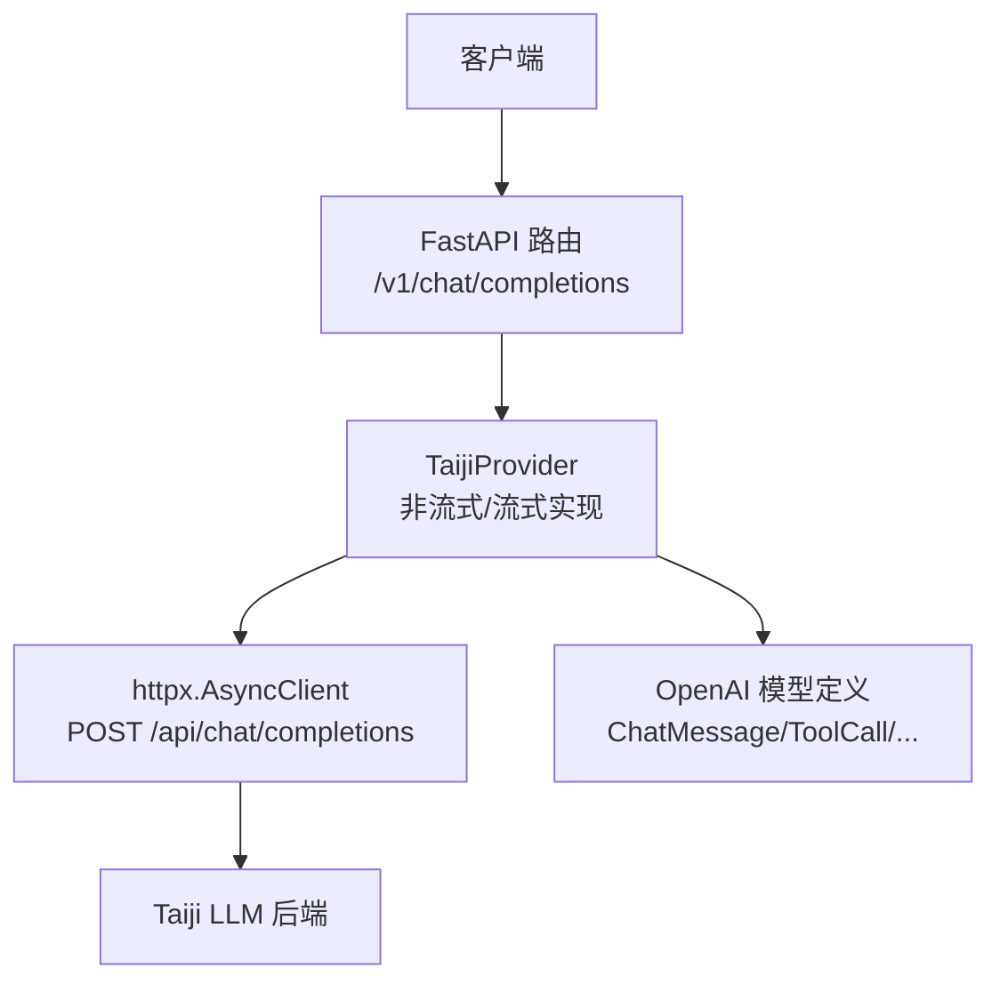
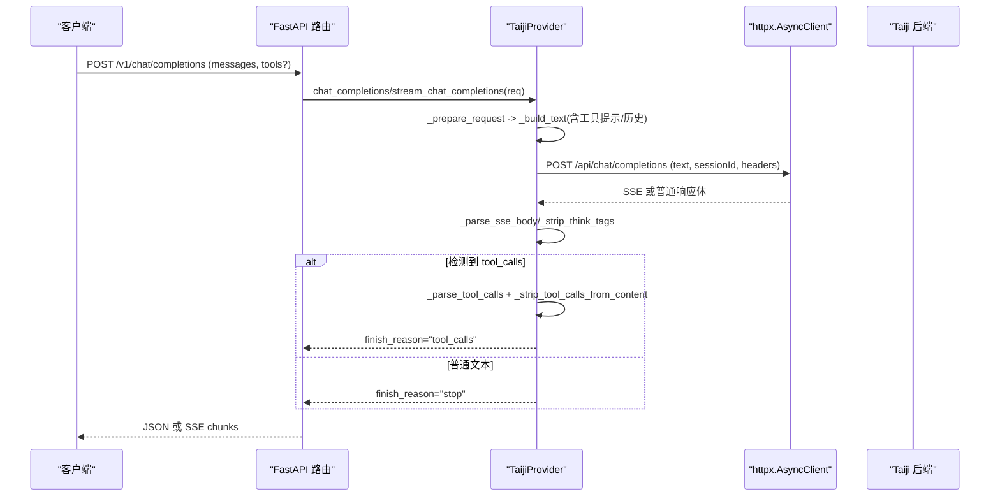
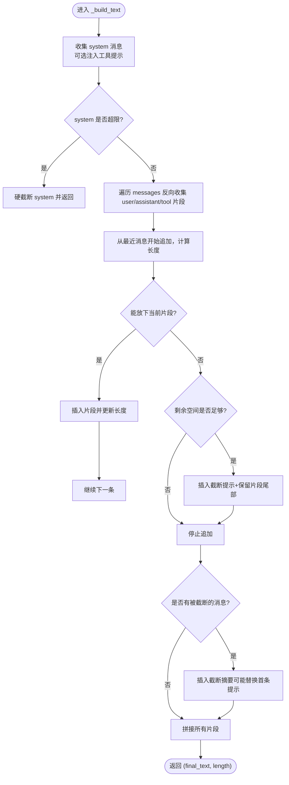
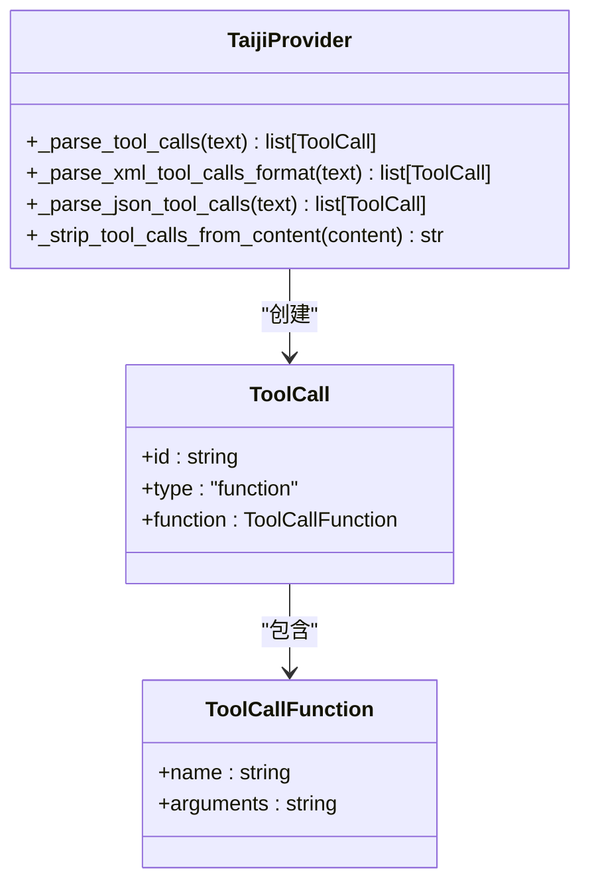
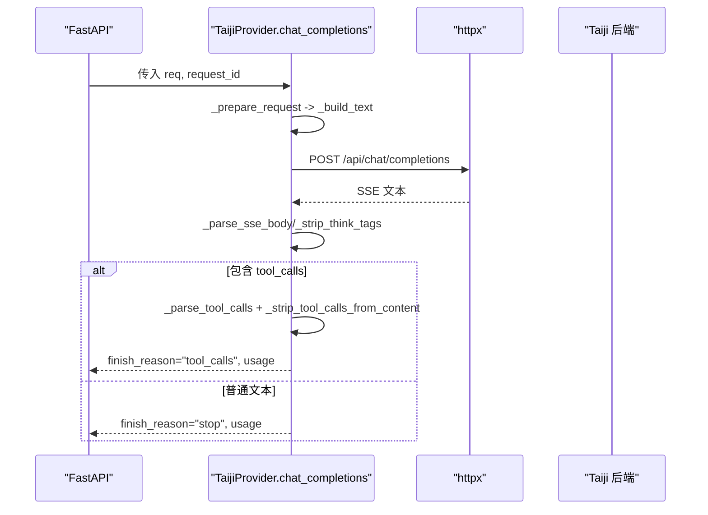
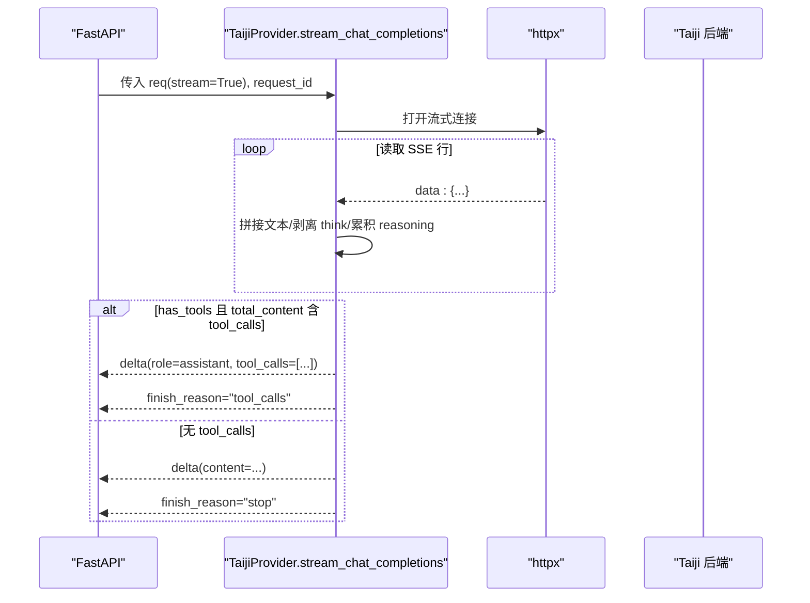
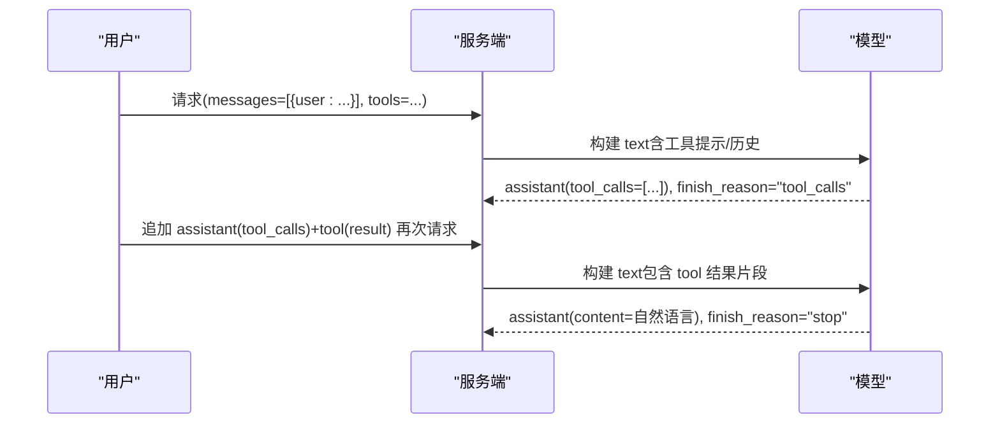
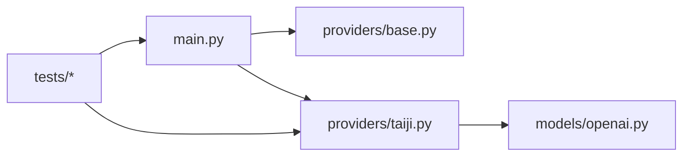

# 多轮对话处理

<cite>
**本文引用的文件**   
- [src/openai_provider/main.py](file://src/openai_provider/main.py)
- [src/openai_provider/providers/taiji.py](file://src/openai_provider/providers/taiji.py)
- [src/openai_provider/providers/base.py](file://src/openai_provider/providers/base.py)
- [src/openai_provider/models/openai.py](file://src/openai_provider/models/openai.py)
- [tests/e2e/test_04_tool_calls.py](file://tests/e2e/test_04_tool_calls.py)
- [tests/test_tools.py](file://tests/test_tools.py)
</cite>

## 目录
1. [简介](#简介)
2. [项目结构](#项目结构)
3. [核心组件](#核心组件)
4. [架构总览](#架构总览)
5. [详细组件分析](#详细组件分析)
6. [依赖关系分析](#依赖关系分析)
7. [性能考量](#性能考量)
8. [故障排查指南](#故障排查指南)
9. [结论](#结论)
10. [附录：最佳实践与示例路径](#附录最佳实践与示例路径)

## 简介
本技术文档聚焦于“多轮对话处理”能力，特别是工具调用（tool_calls）在多轮对话中的生命周期管理。内容涵盖：
- 工具调用的触发、解析、结果回传与上下文维护
- 消息序列构建与角色转换（user/assistant/tool）
- _build_text 方法对包含 tool_calls 的消息的处理策略
- 会话上下文的智能截断策略与长度管理
- 流式与非流式两种模式下的完整流程与差异
- 结合测试用例的端到端示例路径，帮助读者快速理解并落地

## 项目结构
本项目为 OpenAI 兼容网关，将 Chat Completions 请求转发至 Taiji LLM 后端，并在过程中完成工具定义注入、tool_calls 解析、思考过程剥离、token 计数等关键逻辑。

图表来源
- [src/openai_provider/main.py:134-257](file://src/openai_provider/main.py#L134-L257)
- [src/openai_provider/providers/taiji.py:520-600](file://src/openai_provider/providers/taiji.py#L520-L600)
- [src/openai_provider/models/openai.py:73-101](file://src/openai_provider/models/openai.py#L73-L101)

章节来源
- [src/openai_provider/main.py:134-257](file://src/openai_provider/main.py#L134-L257)
- [src/openai_provider/providers/base.py:7-46](file://src/openai_provider/providers/base.py#L7-L46)

## 核心组件
- FastAPI 入口与路由：负责接收 OpenAI 风格请求、鉴权、日志记录、流式响应封装。
- Provider 抽象基类：定义 chat_completions 与 stream_chat_completions 接口。
- TaijiProvider 实现：
  - 构建文本：_build_text（含系统提示、工具说明、对话历史拼接与智能截断）
  - 工具解析：_parse_tool_calls（支持 XML/DSML 与 JSON 格式）
  - 流式处理：stream_chat_completions（缓冲、think 标签分离、tool_calls 判定与输出）
  - Token 统计：_count_tokens/_count_messages_tokens
- OpenAI 模型定义：统一消息、工具、请求/响应结构。

章节来源
- [src/openai_provider/providers/base.py:7-46](file://src/openai_provider/providers/base.py#L7-L46)
- [src/openai_provider/providers/taiji.py:46-121](file://src/openai_provider/providers/taiji.py#L46-L121)
- [src/openai_provider/models/openai.py:73-101](file://src/openai_provider/models/openai.py#L73-L101)

## 架构总览
下图展示从客户端到后端的完整调用链，以及 provider 内部的关键处理步骤。

图表来源
- [src/openai_provider/main.py:134-257](file://src/openai_provider/main.py#L134-L257)
- [src/openai_provider/providers/taiji.py:520-600](file://src/openai_provider/providers/taiji.py#L520-L600)
- [src/openai_provider/providers/taiji.py:670-780](file://src/openai_provider/providers/taiji.py#L670-L780)
- [src/openai_provider/providers/taiji.py:782-977](file://src/openai_provider/providers/taiji.py#L782-L977)

## 详细组件分析

### 组件一：消息构建与上下文截断（_build_text）
_build_text 负责将 OpenAI messages 数组转换为 taiji 可接受的纯文本，同时执行智能截断策略，确保不超过最大文本长度限制。其核心要点如下：
- 优先级最高：始终包含 system 消息；若存在 tools，则注入工具说明与行为约束（由 _build_tools_prompt 生成）。
- 对话历史收集：按 user/assistant/tool 三类角色分别格式化，assistant 消息会附带已执行的 tool_calls 信息，tool 消息会携带 tool_call_id 以便关联。
- 自近及远添加：从最近的消息开始向前追加，直到接近上限。
- 智能截断：当单条消息无法放入时，若剩余空间足够，插入“更早上下文被截断”的提示并保留该消息尾部片段；否则直接停止。最后根据截断数量追加摘要提示。
- 返回最终文本与实际字符长度，供后续强制硬截断保护使用。

图表来源
- [src/openai_provider/providers/taiji.py:206-318](file://src/openai_provider/providers/taiji.py#L206-L318)

章节来源
- [src/openai_provider/providers/taiji.py:206-318](file://src/openai_provider/providers/taiji.py#L206-L318)
- [src/openai_provider/providers/taiji.py:122-204](file://src/openai_provider/providers/taiji.py#L122-L204)

### 组件二：工具调用解析与清理（XML/JSON 双格式）
- 解析器支持三种常见格式：
  - DSML XML：以特定标记包裹的 tool_calls/invoke/parameter 标签
  - 标准 XML：<tool_calls><invoke ...></invoke></tool_calls>
  - JSON：{"tool_calls": [...]}
- 解析失败时回退到 JSON 提取；若仍失败则返回空列表。
- 清理器会从文本中移除 tool_calls 块，保证最终 content 不包含工具调用结构。

图表来源
- [src/openai_provider/providers/taiji.py:350-499](file://src/openai_provider/providers/taiji.py#L350-L499)
- [src/openai_provider/models/openai.py:46-60](file://src/openai_provider/models/openai.py#L46-L60)

章节来源
- [src/openai_provider/providers/taiji.py:350-499](file://src/openai_provider/providers/taiji.py#L350-L499)
- [src/openai_provider/models/openai.py:46-60](file://src/openai_provider/models/openai.py#L46-L60)

### 组件三：非流式调用流程（chat_completions）
- 准备阶段：计算原始 prompt token 数，构建 text（含工具提示），必要时硬截断。
- 调用后端：POST 请求，SSE 响应体解析，剥离 think 标签，提取 token 用量。
- 工具判定：若检测到 tool_calls，则清理 content 并设置 finish_reason="tool_calls"；否则 finish_reason="stop"。
- 构造响应：组装 message（role=assistant）、usage（prompt/completion/total）。

图表来源
- [src/openai_provider/providers/taiji.py:520-600](file://src/openai_provider/providers/taiji.py#L520-L600)
- [src/openai_provider/providers/taiji.py:670-780](file://src/openai_provider/providers/taiji.py#L670-L780)

章节来源
- [src/openai_provider/providers/taiji.py:520-600](file://src/openai_provider/providers/taiji.py#L520-L600)
- [src/openai_provider/providers/taiji.py:670-780](file://src/openai_provider/providers/taiji.py#L670-L780)

### 组件四：流式调用流程（stream_chat_completions）
- 初始化：生成 completion_id/created，维护 role_sent、content_buffer、reasoning 缓冲、token_info。
- 逐行解析 SSE：拼接字符串型数据，剥离 think 标签，累积 reasoning 与 content。
- 流结束判定：
  - 若存在 tools，则在结束后尝试解析 total_content 中的 tool_calls。
  - 若有 tool_calls：先输出剩余文本（如有），再输出 tool_calls delta，并以 finish_reason="tool_calls" 结束。
  - 若无 tool_calls：将缓冲内容一次性输出，finish_reason="stop"。
- 非工具场景：正常流式输出 content，结束时发送 stop。

图表来源
- [src/openai_provider/providers/taiji.py:782-977](file://src/openai_provider/providers/taiji.py#L782-L977)

章节来源
- [src/openai_provider/providers/taiji.py:782-977](file://src/openai_provider/providers/taiji.py#L782-L977)

### 组件五：多轮对话与工具往返（user → assistant(tool_calls) → tool → assistant）
- 第一轮：用户提问，模型返回 assistant 消息，其中包含 tool_calls（finish_reason="tool_calls"）。
- 第二轮：客户端将 assistant 消息与 tool 结果消息追加到 messages 中再次发起请求。
- 第三轮：模型基于工具结果生成自然语言回复（finish_reason="stop"）。

图表来源
- [tests/e2e/test_04_tool_calls.py:189-226](file://tests/e2e/test_04_tool_calls.py#L189-L226)
- [src/openai_provider/providers/taiji.py:251-271](file://src/openai_provider/providers/taiji.py#L251-L271)

章节来源
- [tests/e2e/test_04_tool_calls.py:189-226](file://tests/e2e/test_04_tool_calls.py#L189-L226)
- [src/openai_provider/providers/taiji.py:251-271](file://src/openai_provider/providers/taiji.py#L251-L271)

## 依赖关系分析
- main.py 通过依赖注入持有 TaijiProvider 实例，路由层仅做鉴权、日志与响应封装。
- providers.base 定义了 Provider 抽象接口，taiji.py 提供具体实现。
- models.openai 提供统一的 Pydantic 模型，用于请求/响应校验与序列化。
- tests 覆盖非流式/流式工具调用、tool_choice 参数、多轮往返等关键路径。

图表来源
- [src/openai_provider/main.py:78-89](file://src/openai_provider/main.py#L78-L89)
- [src/openai_provider/providers/base.py:7-46](file://src/openai_provider/providers/base.py#L7-L46)
- [src/openai_provider/providers/taiji.py:46-58](file://src/openai_provider/providers/taiji.py#L46-L58)
- [src/openai_provider/models/openai.py:73-101](file://src/openai_provider/models/openai.py#L73-L101)
- [tests/test_tools.py:1-10](file://tests/test_tools.py#L1-L10)

章节来源
- [src/openai_provider/main.py:78-89](file://src/openai_provider/main.py#L78-L89)
- [src/openai_provider/providers/base.py:7-46](file://src/openai_provider/providers/base.py#L7-L46)
- [src/openai_provider/providers/taiji.py:46-58](file://src/openai_provider/providers/taiji.py#L46-L58)
- [src/openai_provider/models/openai.py:73-101](file://src/openai_provider/models/openai.py#L73-L101)
- [tests/test_tools.py:1-10](file://tests/test_tools.py#L1-L10)

## 性能考量
- Token 计数：优先使用 tiktoken（cl100k_base），不可用时回退到字符估算（中文约 1.5 字符/token，英文约 4 字符/token）。
- 上下文长度：_build_text 在拼接阶段即进行软截断，并在 _prepare_request 中进行硬截断保护，避免超出后端限制。
- 流式处理：stream_chat_completions 采用缓冲与增量输出，减少内存峰值；tool_calls 仅在流结束后统一解析与输出，降低中间状态复杂度。
- 建议：
  - 合理设置 TAIJI_MAX_TEXT_LENGTH，并结合业务场景调整截断阈值。
  - 控制 tools 定义的体积，避免系统提示过长导致频繁截断。
  - 在高频多轮场景中，尽量精简 tool 描述与参数 schema。

章节来源
- [src/openai_provider/providers/taiji.py:65-95](file://src/openai_provider/providers/taiji.py#L65-L95)
- [src/openai_provider/providers/taiji.py:206-318](file://src/openai_provider/providers/taiji.py#L206-L318)
- [src/openai_provider/providers/taiji.py:520-600](file://src/openai_provider/providers/taiji.py#L520-L600)
- [src/openai_provider/providers/taiji.py:782-977](file://src/openai_provider/providers/taiji.py#L782-L977)

## 故障排查指南
- 认证错误：若未配置 API_KEY，鉴权跳过；否则不匹配将返回 401。检查环境变量与请求头 Authorization。
- 请求校验失败：非法请求体会返回 400，查看 raw_request 日志定位问题。
- 后端业务错误：即使 HTTP 200，也可能包装业务错误（err/msg/code），会被识别为 TaijiBusinessError。
- 超时/网络异常：捕获 httpx.TimeoutException/HTTPError，抛出对应 ProviderError。
- 工具调用未触发：确认 tools 定义正确、tool_choice 参数符合预期；检查 _build_tools_prompt 注入是否生效。
- 流式输出异常：检查 SSE 行解析与 think 标签剥离逻辑，确认 content_buffer 与 reasoning 累积是否正确。

章节来源
- [src/openai_provider/main.py:108-126](file://src/openai_provider/main.py#L108-L126)
- [src/openai_provider/main.py:163-183](file://src/openai_provider/main.py#L163-L183)
- [src/openai_provider/providers/taiji.py:670-721](file://src/openai_provider/providers/taiji.py#L670-L721)
- [src/openai_provider/providers/taiji.py:633-668](file://src/openai_provider/providers/taiji.py#L633-L668)

## 结论
本实现通过清晰的 Provider 抽象与 OpenAI 兼容模型，实现了多轮对话中工具调用的全链路管理：从工具提示注入、tool_calls 解析、结果回传到上下文智能截断，均具备完善的处理逻辑与测试覆盖。对于生产环境，建议关注上下文长度与工具定义体积，结合流式输出优化用户体验。

## 附录：最佳实践与示例路径
- 多轮工具往返示例（非流式）：
  - [tests/e2e/test_04_tool_calls.py:189-226](file://tests/e2e/test_04_tool_calls.py#L189-L226)
- 流式工具调用与工具选择参数：
  - [tests/test_tools.py:241-325](file://tests/test_tools.py#L241-L325)
  - [tests/e2e/test_04_tool_calls.py:104-154](file://tests/e2e/test_04_tool_calls.py#L104-L154)
- _build_text 与上下文截断：
  - [src/openai_provider/providers/taiji.py:206-318](file://src/openai_provider/providers/taiji.py#L206-L318)
- 工具解析与清理：
  - [src/openai_provider/providers/taiji.py:350-499](file://src/openai_provider/providers/taiji.py#L350-L499)
- 非流式/流式主流程：
  - [src/openai_provider/providers/taiji.py:670-780](file://src/openai_provider/providers/taiji.py#L670-L780)
  - [src/openai_provider/providers/taiji.py:782-977](file://src/openai_provider/providers/taiji.py#L782-L977)