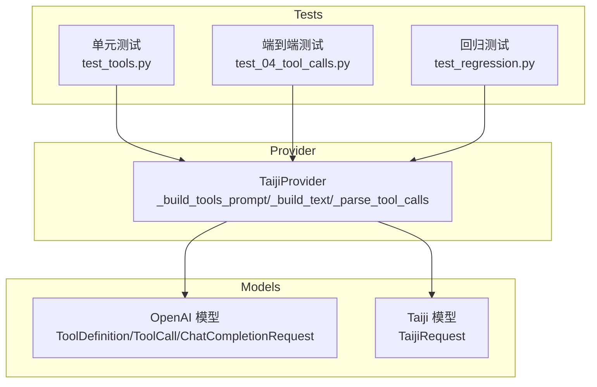
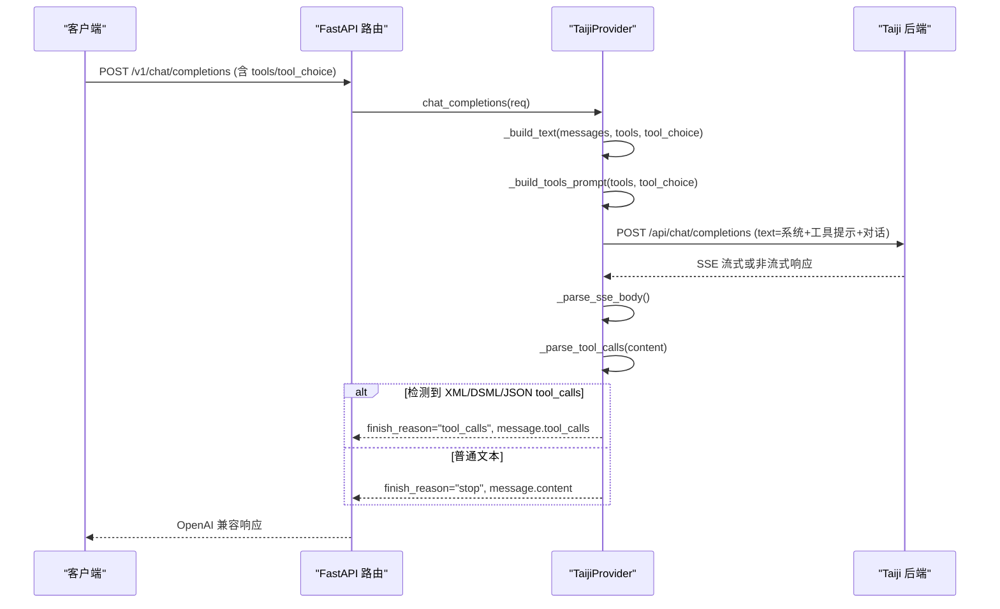
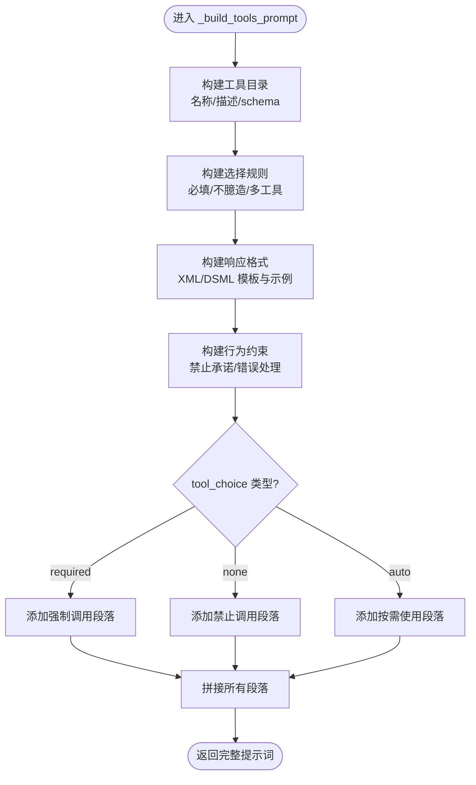
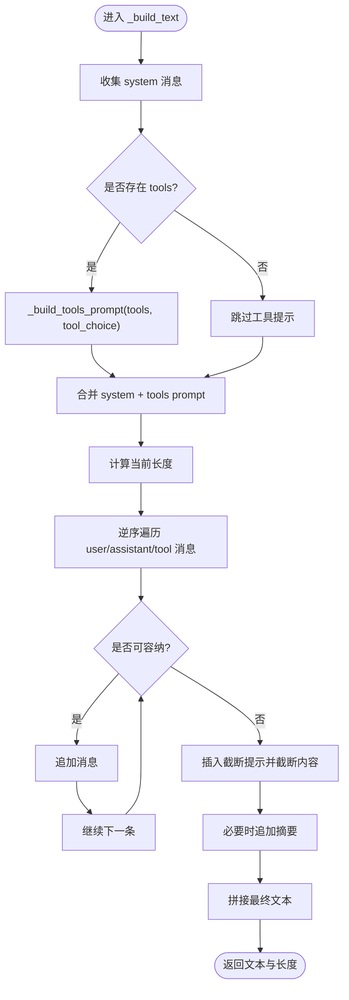
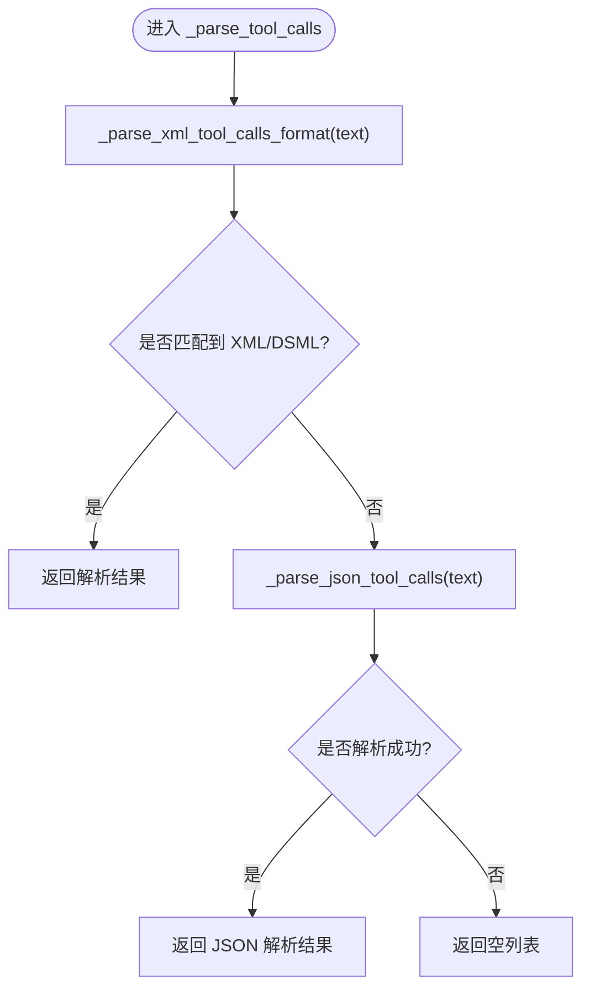
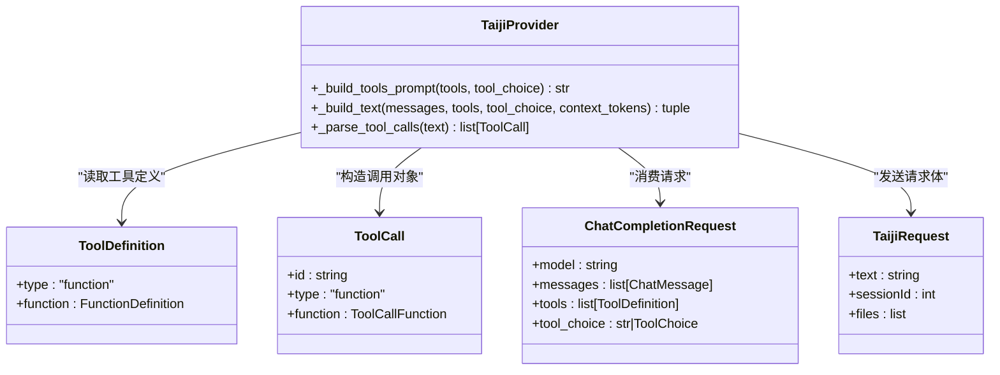

# 工具定义生成

<cite>
**本文引用的文件**   
- [src/openai_provider/providers/taiji.py](file://src/openai_provider/providers/taiji.py)
- [src/openai_provider/models/openai.py](file://src/openai_provider/models/openai.py)
- [src/openai_provider/models/taiji.py](file://src/openai_provider/models/taiji.py)
- [tests/test_tools.py](file://tests/test_tools.py)
- [tests/e2e/test_04_tool_calls.py](file://tests/e2e/test_04_tool_calls.py)
- [tests/test_regression.py](file://tests/test_regression.py)
</cite>

## 目录
1. [简介](#简介)
2. [项目结构](#项目结构)
3. [核心组件](#核心组件)
4. [架构总览](#架构总览)
5. [详细组件分析](#详细组件分析)
6. [依赖关系分析](#依赖关系分析)
7. [性能考量](#性能考量)
8. [故障排查指南](#故障排查指南)
9. [结论](#结论)
10. [附录](#附录)

## 简介
本技术文档聚焦于“工具定义生成”能力，深入解释 _build_tools_prompt 方法如何将 OpenAI tools 定义转换为 Taiji LLM 可理解的 XML/DSML 格式指令。内容涵盖：
- 工具目录生成、选择规则构建、响应格式规范与行为约束的生成逻辑
- 参数 schema 转换与 tool_choice 参数的处理（auto/required/none）
- 工具提示词的结构化组织方式与安全性考虑
- 解析侧对 XML/DSML 格式的兼容策略与错误回退路径

## 项目结构
围绕工具定义生成的关键代码位于 Provider 层与模型层：
- Provider 层负责将 OpenAI 请求中的 tools 注入到发送给 Taiji 的文本中，并在收到响应后解析 XML/DSML 或 JSON 格式的 tool_calls
- 模型层定义了 OpenAI 兼容的工具定义、调用结构与请求/响应体

图表来源
- [src/openai_provider/providers/taiji.py:122-204](file://src/openai_provider/providers/taiji.py#L122-L204)
- [src/openai_provider/models/openai.py:31-100](file://src/openai_provider/models/openai.py#L31-L100)
- [src/openai_provider/models/taiji.py:8-21](file://src/openai_provider/models/taiji.py#L8-L21)
- [tests/test_tools.py:134-168](file://tests/test_tools.py#L134-L168)
- [tests/e2e/test_04_tool_calls.py:12-47](file://tests/e2e/test_04_tool_calls.py#L12-L47)
- [tests/test_regression.py:182-211](file://tests/test_regression.py#L182-L211)

章节来源
- [src/openai_provider/providers/taiji.py:122-204](file://src/openai_provider/providers/taiji.py#L122-L204)
- [src/openai_provider/models/openai.py:31-100](file://src/openai_provider/models/openai.py#L31-L100)
- [src/openai_provider/models/taiji.py:8-21](file://src/openai_provider/models/taiji.py#L8-L21)

## 核心组件
- _build_tools_prompt(tools, tool_choice="auto")
  - 将 OpenAI tools 列表转换为结构化自然语言指令，包含：
    - 工具目录：名称、描述、参数 schema
    - 工具选择规则：如何选择工具、如何处理缺失参数
    - 响应格式：强制使用 XML/DSML 而非 JSON
    - 行为约束：禁止承诺延迟执行、错误处理建议等
    - tool_choice 强制策略：required/none/auto
- _build_text(messages, tools, tool_choice, context_tokens)
  - 组装最终发送给 Taiji 的纯文本，优先保留 system 消息与 tools prompt，智能截断对话历史
- _parse_tool_calls(text)
  - 从模型输出中提取 tool_calls，支持 DSML、标准 XML 与 JSON 回退
- 相关数据模型
  - ToolDefinition、ToolCall、ChatCompletionRequest 等用于承载 OpenAI 兼容的工具定义与调用结构
  - TaijiRequest 用于封装发送给 Taiji 的请求体

章节来源
- [src/openai_provider/providers/taiji.py:122-204](file://src/openai_provider/providers/taiji.py#L122-L204)
- [src/openai_provider/providers/taiji.py:206-318](file://src/openai_provider/providers/taiji.py#L206-L318)
- [src/openai_provider/providers/taiji.py:350-482](file://src/openai_provider/providers/taiji.py#L350-L482)
- [src/openai_provider/models/openai.py:31-100](file://src/openai_provider/models/openai.py#L31-L100)
- [src/openai_provider/models/taiji.py:8-21](file://src/openai_provider/models/taiji.py#L8-L21)

## 架构总览
下图展示了从 OpenAI 请求到 Taiji 响应返回的完整流程，重点标注了工具提示词注入与解析环节。

图表来源
- [src/openai_provider/providers/taiji.py:520-600](file://src/openai_provider/providers/taiji.py#L520-L600)
- [src/openai_provider/providers/taiji.py:670-780](file://src/openai_provider/providers/taiji.py#L670-L780)
- [src/openai_provider/providers/taiji.py:350-482](file://src/openai_provider/providers/taiji.py#L350-L482)

## 详细组件分析

### _build_tools_prompt 方法详解
该方法将 OpenAI 的 tools 定义转换为一段面向模型的“系统级指令”，由 _build_text 注入为 system 消息的一部分。其结构分为五个部分：

- 工具目录
  - 遍历 tools，输出每个工具的序号、名称、可选描述与参数 schema（JSON 字符串）
- 工具选择规则
  - 指导模型如何分析用户意图、选择最合适的工具、确保必填参数齐全、禁止臆造参数值
- 响应格式规范
  - 明确强制使用 XML/DSML 格式，给出单条与多条工具调用的模板示例，强调参数必须作为独立 <parameter name="..."> 标签出现
- 行为约束
  - 禁止承诺延后执行；遇到缺失信息应直接询问用户；错误时向用户说明并建议替代方案
- tool_choice 强制策略
  - required：必须调用至少一个工具
  - none：禁止调用任何工具，仅自然语言回复
  - auto：按需使用工具，适合需要实时/计算信息的场景

图表来源
- [src/openai_provider/providers/taiji.py:122-204](file://src/openai_provider/providers/taiji.py#L122-L204)

章节来源
- [src/openai_provider/providers/taiji.py:122-204](file://src/openai_provider/providers/taiji.py#L122-L204)

### _build_text 与工具提示词注入
_build_text 负责将 messages 转换为单一文本，优先级如下：
- 始终包含 system 消息与 tools prompt（最高优先级）
- 从后往前追加最近的对话，直到接近最大长度限制
- 若连最后一条都放不下，则进行截断并插入截断提示
- 当存在 tools 时，通过 _build_tools_prompt 生成系统级指令并注入

图表来源
- [src/openai_provider/providers/taiji.py:206-318](file://src/openai_provider/providers/taiji.py#L206-L318)

章节来源
- [src/openai_provider/providers/taiji.py:206-318](file://src/openai_provider/providers/taiji.py#L206-L318)

### 响应解析：XML/DSML 与 JSON 回退
_parse_tool_calls 按以下顺序尝试解析：
- 优先解析 XML/DSML 格式（支持闭合与开放标签两种情况）
- 若无匹配，回退到 JSON 格式 {"tool_calls": [...]}

XML/DSML 解析要点：
- 支持两类根标签：<｜｜DSML｜｜tool_calls> 与 <tool_calls>
- 支持两类 invoke 标签：<｜｜DSML｜｜invoke name="..."> 与 <invoke name="...">
- 支持三类参数提取：
  - DSML 参数：<｜｜DSML｜｜parameter name="...">value</｜｜DSML｜｜parameter>
  - 标准参数：<parameter name="...">value</parameter>
  - 简单键值：<key>value</key>（排除已知的控制标签名）
- 未找到任何匹配时返回空列表

图表来源
- [src/openai_provider/providers/taiji.py:350-482](file://src/openai_provider/providers/taiji.py#L350-L482)

章节来源
- [src/openai_provider/providers/taiji.py:350-482](file://src/openai_provider/providers/taiji.py#L350-L482)

### 工具函数定义与参数 Schema 转换
- 工具定义遵循 OpenAI 兼容结构：type="function"，function 包含 name/description/parameters
- parameters 以 JSON Schema 形式提供，_build_tools_prompt 会将其序列化为字符串嵌入提示词
- 在解析阶段，XML/DSML 的参数值被提取为字符串，再统一序列化为 JSON 字符串放入 ToolCall.function.arguments

章节来源
- [src/openai_provider/models/openai.py:31-67](file://src/openai_provider/models/openai.py#L31-L67)
- [src/openai_provider/providers/taiji.py:122-204](file://src/openai_provider/providers/taiji.py#L122-L204)
- [src/openai_provider/providers/taiji.py:453-482](file://src/openai_provider/providers/taiji.py#L453-L482)

### tool_choice 参数处理（auto/required/none）
- 默认值为 "auto"
- 在 _prepare_request 中，若 req.tool_choice 为对象则忽略并回退为 "auto"
- 根据 tool_choice 的值，_build_tools_prompt 会追加不同的强制段落：
  - required：必须调用至少一个工具
  - none：禁止调用任何工具
  - auto：按需使用工具

章节来源
- [src/openai_provider/providers/taiji.py:520-530](file://src/openai_provider/providers/taiji.py#L520-L530)
- [src/openai_provider/providers/taiji.py:189-204](file://src/openai_provider/providers/taiji.py#L189-L204)
- [tests/e2e/test_04_tool_calls.py:156-186](file://tests/e2e/test_04_tool_calls.py#L156-L186)

### 安全性考虑
- 参数值安全：
  - 提示词明确要求参数值置于 <parameter name="..."> 标签内，避免将参数作为属性拼接到 <invoke> 上
  - 特殊字符建议使用实体引用或直接放在标签之间，解析器会处理
- 行为约束：
  - 禁止模型承诺延后执行，要求有足够信息时立即调用工具
  - 遇到缺失信息应直接询问用户，而不是猜测参数
- 格式约束：
  - 强制使用 XML/DSML 格式，避免 JSON 混入导致解析歧义
- 输入校验：
  - 解析失败时回退到 JSON 或返回空列表，避免崩溃

章节来源
- [src/openai_provider/providers/taiji.py:146-188](file://src/openai_provider/providers/taiji.py#L146-L188)
- [src/openai_provider/providers/taiji.py:453-482](file://src/openai_provider/providers/taiji.py#L453-L482)

## 依赖关系分析
- Provider 依赖 OpenAI 模型定义（ToolDefinition、ToolCall、ChatCompletionRequest）
- Provider 依赖 Taiji 模型定义（TaijiRequest）
- 测试覆盖：
  - 单元测试验证工具提示词注入与解析
  - E2E 测试验证真实调用下的 tool_calls 结构与 tool_choice 行为
  - 回归测试验证 XML/DSML 解析的鲁棒性

图表来源
- [src/openai_provider/providers/taiji.py:122-204](file://src/openai_provider/providers/taiji.py#L122-L204)
- [src/openai_provider/models/openai.py:31-100](file://src/openai_provider/models/openai.py#L31-L100)
- [src/openai_provider/models/taiji.py:8-21](file://src/openai_provider/models/taiji.py#L8-L21)

章节来源
- [src/openai_provider/providers/taiji.py:122-204](file://src/openai_provider/providers/taiji.py#L122-L204)
- [src/openai_provider/models/openai.py:31-100](file://src/openai_provider/models/openai.py#L31-L100)
- [src/openai_provider/models/taiji.py:8-21](file://src/openai_provider/models/taiji.py#L8-L21)

## 性能考量
- 提示词长度控制：_build_text 会计算 system 与对话部分的长度，超过限制时进行智能截断并插入提示，避免超长请求
- Token 计数：使用 tiktoken 估算 token 数，回退为基于字符的估算，保证在无外部依赖时的可用性
- 解析效率：XML/DSML 解析采用正则表达式，先尝试闭合标签，再尝试开放标签，减少不必要的回溯

章节来源
- [src/openai_provider/providers/taiji.py:206-318](file://src/openai_provider/providers/taiji.py#L206-L318)
- [src/openai_provider/providers/taiji.py:65-95](file://src/openai_provider/providers/taiji.py#L65-L95)
- [src/openai_provider/providers/taiji.py:399-482](file://src/openai_provider/providers/taiji.py#L399-L482)

## 故障排查指南
- 现象：模型返回 JSON 而非 XML/DSML
  - 检查提示词是否包含“强制使用 XML/DSML”的段落
  - 确认 _build_tools_prompt 已被注入到 system 消息中
- 现象：tool_choice=none 仍返回 tool_calls
  - 检查 _build_tools_prompt 是否正确追加“禁止调用”段落
  - 确认 _prepare_request 中 tool_choice 未被对象类型覆盖
- 现象：参数解析为空或异常
  - 检查 XML/DSML 标签是否闭合
  - 确认参数是否以 <parameter name="..."> 形式出现
  - 查看 _parse_xml_tool_calls_format 的正则匹配是否命中
- 现象：长上下文被截断导致工具调用不完整
  - 调整 max_text_length 或优化消息结构，确保 system 与 tools prompt 优先保留

章节来源
- [src/openai_provider/providers/taiji.py:146-204](file://src/openai_provider/providers/taiji.py#L146-L204)
- [src/openai_provider/providers/taiji.py:520-530](file://src/openai_provider/providers/taiji.py#L520-L530)
- [src/openai_provider/providers/taiji.py:399-482](file://src/openai_provider/providers/taiji.py#L399-L482)

## 结论
_build_tools_prompt 通过将 OpenAI tools 定义转化为结构化自然语言指令，结合 _build_text 的系统级注入与 _parse_tool_calls 的多格式解析，实现了 OpenAI 工具调用协议与 Taiji 后端之间的无缝桥接。该设计在保证灵活性的同时，强化了格式约束与行为引导，提升了工具调用的稳定性与安全性。

## 附录

### 工具定义示例（参考路径）
- 工具定义与参数 schema 示例见测试文件：
  - [tests/e2e/test_04_tool_calls.py:12-47](file://tests/e2e/test_04_tool_calls.py#L12-L47)
- 工具提示词注入验证：
  - [tests/test_tools.py:134-168](file://tests/test_tools.py#L134-L168)
- XML/DSML 解析用例：
  - [tests/test_regression.py:182-211](file://tests/test_regression.py#L182-L211)

章节来源
- [tests/e2e/test_04_tool_calls.py:12-47](file://tests/e2e/test_04_tool_calls.py#L12-L47)
- [tests/test_tools.py:134-168](file://tests/test_tools.py#L134-L168)
- [tests/test_regression.py:182-211](file://tests/test_regression.py#L182-L211)