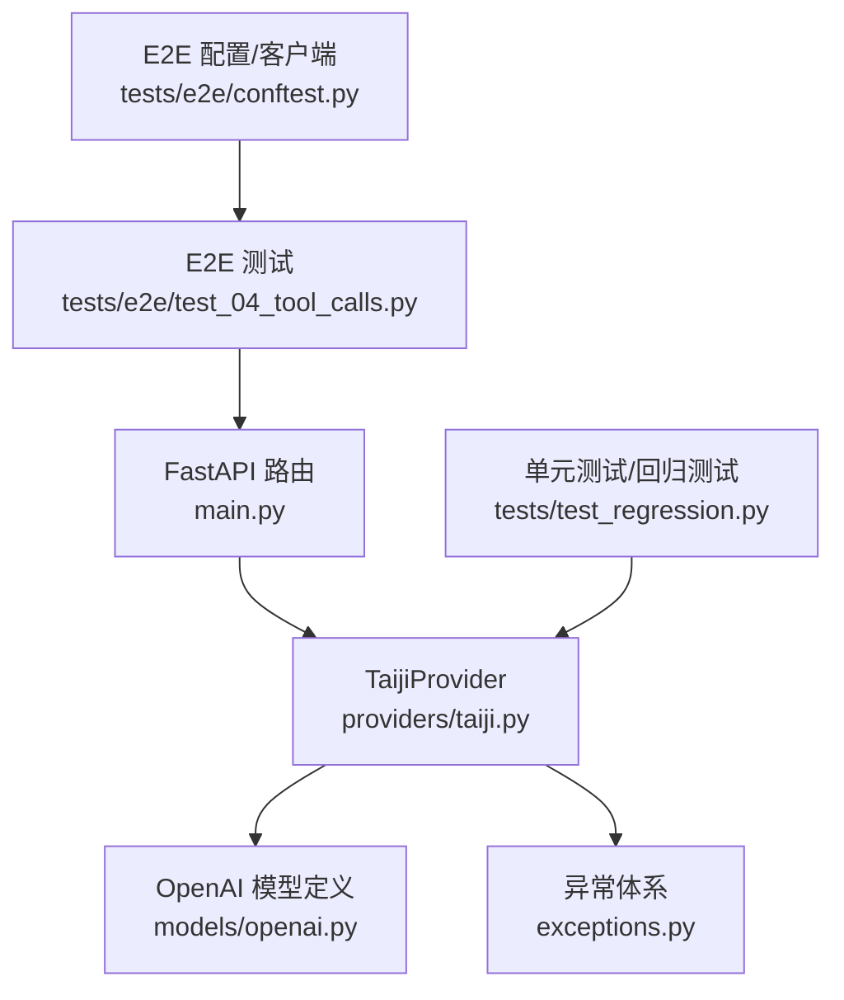
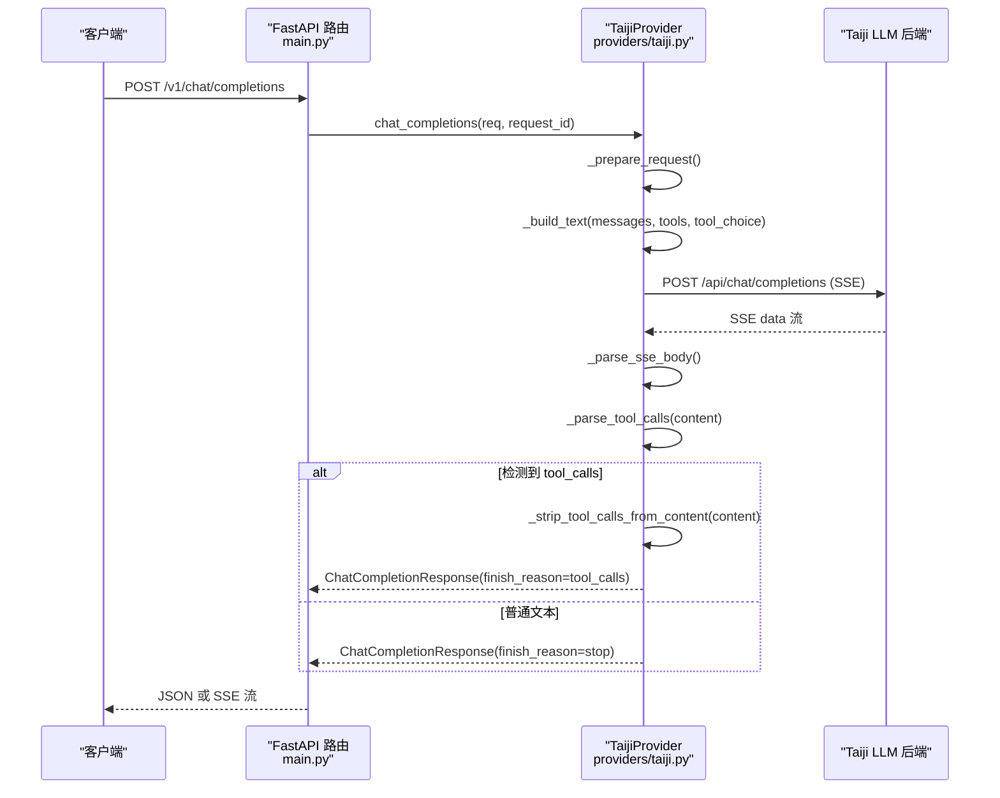
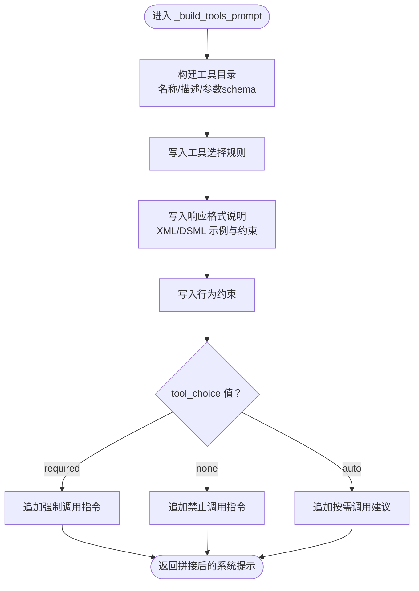
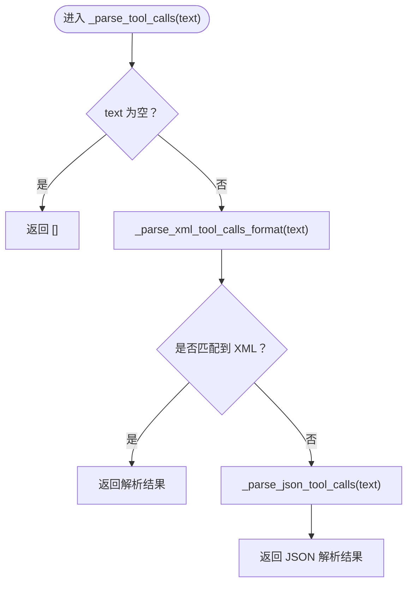
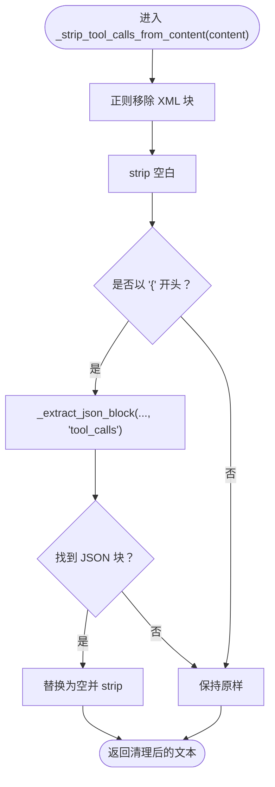
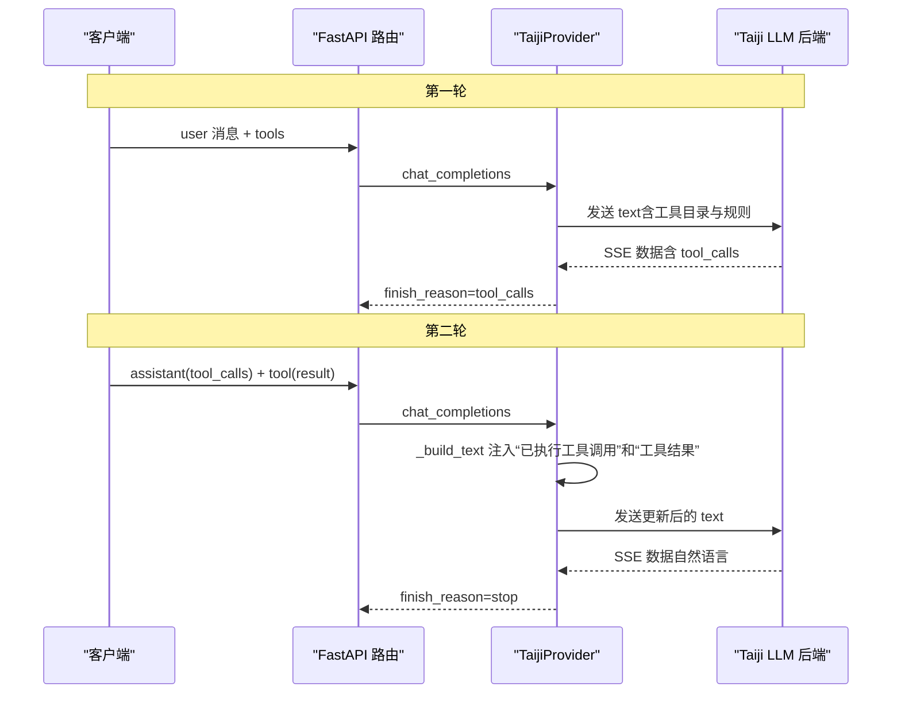
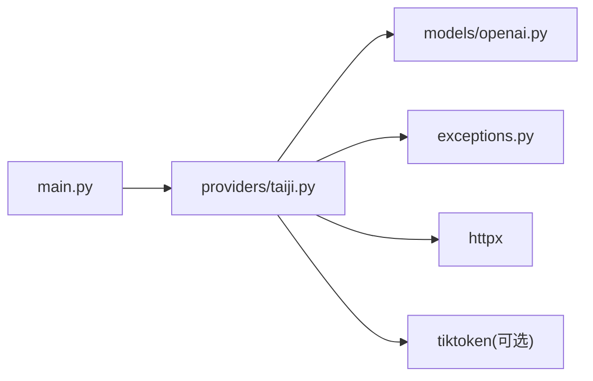

# 工具调用系统

<cite>
**本文引用的文件列表**
- [src/openai_provider/providers/taiji.py](file://src/openai_provider/providers/taiji.py)
- [src/openai_provider/models/openai.py](file://src/openai_provider/models/openai.py)
- [src/openai_provider/exceptions.py](file://src/openai_provider/exceptions.py)
- [src/openai_provider/main.py](file://src/openai_provider/main.py)
- [tests/test_regression.py](file://tests/test_regression.py)
- [tests/e2e/test_04_tool_calls.py](file://tests/e2e/test_04_tool_calls.py)
- [tests/e2e/conftest.py](file://tests/e2e/conftest.py)
</cite>

## 目录
1. [简介](#简介)
2. [项目结构](#项目结构)
3. [核心组件](#核心组件)
4. [架构总览](#架构总览)
5. [详细组件分析](#详细组件分析)
6. [依赖关系分析](#依赖关系分析)
7. [性能考量](#性能考量)
8. [故障排查指南](#故障排查指南)
9. [结论](#结论)
10. [附录](#附录)

## 简介
本技术文档聚焦于“工具调用系统”的完整生命周期，涵盖：
- 工具定义生成与注入（_build_tools_prompt）
- 多格式解析（DSML XML、标准 XML、JSON）（_parse_tool_calls）
- 清理工具调用标记（_strip_tool_calls_from_content）
- 多轮对话支持与参数传递
- 错误处理策略与安全性考虑

该实现以 OpenAI Chat Completions 兼容接口为入口，将请求转换为 Taiji LLM 后端可理解的文本，并在响应中识别与提取 tool_calls，最终返回符合 OpenAI 规范的响应。

## 项目结构
围绕工具调用的关键代码位于 Provider 层与模型定义层，测试覆盖回归与端到端场景。

图表来源
- [src/openai_provider/main.py:134-257](file://src/openai_provider/main.py#L134-L257)
- [src/openai_provider/providers/taiji.py:122-204](file://src/openai_provider/providers/taiji.py#L122-L204)
- [src/openai_provider/models/openai.py:83-101](file://src/openai_provider/models/openai.py#L83-L101)
- [src/openai_provider/exceptions.py:8-40](file://src/openai_provider/exceptions.py#L8-L40)
- [tests/test_regression.py:178-211](file://tests/test_regression.py#L178-L211)
- [tests/e2e/test_04_tool_calls.py:189-225](file://tests/e2e/test_04_tool_calls.py#L189-L225)
- [tests/e2e/conftest.py:108-123](file://tests/e2e/conftest.py#L108-L123)

章节来源
- [src/openai_provider/main.py:134-257](file://src/openai_provider/main.py#L134-L257)
- [src/openai_provider/providers/taiji.py:122-204](file://src/openai_provider/providers/taiji.py#L122-L204)
- [src/openai_provider/models/openai.py:83-101](file://src/openai_provider/models/openai.py#L83-L101)
- [src/openai_provider/exceptions.py:8-40](file://src/openai_provider/exceptions.py#L8-L40)
- [tests/test_regression.py:178-211](file://tests/test_regression.py#L178-L211)
- [tests/e2e/test_04_tool_calls.py:189-225](file://tests/e2e/test_04_tool_calls.py#L189-L225)
- [tests/e2e/conftest.py:108-123](file://tests/e2e/conftest.py#L108-L123)

## 核心组件
- 工具定义与消息模型：在 OpenAI 兼容模型中定义 ToolDefinition、ToolCall、ChatMessage、ChatCompletionRequest 等，支持 tools 与 tool_choice 字段。
- Provider 实现：负责构建发送给后端的纯文本（包含工具目录与选择规则）、解析 SSE 响应、提取并标准化 tool_calls、清理多余内容、构造 OpenAI 风格响应。
- 异常体系：区分超时、HTTP 错误、业务错误、网络错误，便于上层统一处理。

章节来源
- [src/openai_provider/models/openai.py:31-101](file://src/openai_provider/models/openai.py#L31-L101)
- [src/openai_provider/providers/taiji.py:350-499](file://src/openai_provider/providers/taiji.py#L350-L499)
- [src/openai_provider/exceptions.py:8-40](file://src/openai_provider/exceptions.py#L8-L40)

## 架构总览
从客户端到后端再到响应的整体流程如下：

图表来源
- [src/openai_provider/main.py:134-257](file://src/openai_provider/main.py#L134-L257)
- [src/openai_provider/providers/taiji.py:670-780](file://src/openai_provider/providers/taiji.py#L670-L780)
- [src/openai_provider/providers/taiji.py:520-600](file://src/openai_provider/providers/taiji.py#L520-L600)
- [src/openai_provider/providers/taiji.py:633-668](file://src/openai_provider/providers/taiji.py#L633-L668)
- [src/openai_provider/providers/taiji.py:350-499](file://src/openai_provider/providers/taiji.py#L350-L499)

## 详细组件分析

### 工具目录与选择规则生成（_build_tools_prompt）
- 功能要点
  - 生成“工具目录”，列出每个工具的函数名、描述与参数 schema。
  - 明确“工具选择规则”，包括如何选择工具、如何处理缺失参数、禁止臆造参数值等。
  - 指定“响应格式”，强制使用 XML 风格的 tool_calls 语法，避免 JSON。
  - 行为约束：要求立即执行、结果自然融入回复、错误提示与替代方案。
  - tool_choice 控制：required 强制调用；none 禁止调用；auto 按需调用。
- 输出影响
  - 通过 _build_text 注入到 system 部分，作为最高优先级上下文。
  - 影响模型是否触发 tool_calls 以及调用哪个工具。

图表来源
- [src/openai_provider/providers/taiji.py:122-204](file://src/openai_provider/providers/taiji.py#L122-L204)

章节来源
- [src/openai_provider/providers/taiji.py:122-204](file://src/openai_provider/providers/taiji.py#L122-L204)

### 多格式工具调用解析（_parse_tool_calls）
- 支持的三种格式
  - DSML XML：以特殊分隔符包裹的 tool_calls/invoke/parameter 标签。
  - 标准 XML：<tool_calls><invoke name="...">...</invoke></tool_calls>。
  - JSON：{"tool_calls": [{"id":"...", "function":{"name":"...","arguments":"..."}}]}。
- 解析顺序
  - 优先尝试 XML 解析（含 DSML 与标准两种变体）。
  - 若未匹配，回退到 JSON 提取（支持嵌套 JSON 块）。
- 参数提取
  - 支持 <parameter name="x">value</parameter> 与简单 <key>value</key> 形式。
  - 将提取的参数序列化为 JSON 字符串，放入 ToolCall.function.arguments。
- 健壮性
  - 空输入、无匹配时返回空列表。
  - JSON 解析失败时安全回退。

图表来源
- [src/openai_provider/providers/taiji.py:350-398](file://src/openai_provider/providers/taiji.py#L350-L398)
- [src/openai_provider/providers/taiji.py:399-482](file://src/openai_provider/providers/taiji.py#L399-L482)

章节来源
- [src/openai_provider/providers/taiji.py:350-482](file://src/openai_provider/providers/taiji.py#L350-L482)
- [tests/test_regression.py:178-211](file://tests/test_regression.py#L178-L211)

### 清理工具调用标记（_strip_tool_calls_from_content）
- 目标
  - 从文本中移除 XML/JSON 格式的 tool_calls 块，仅保留自然语言内容。
- 策略
  - 正则移除 DSML 与标准 XML 的 tool_calls 块。
  - 若剩余文本以 { 开头，尝试提取包含 "tool_calls" 键的 JSON 块并移除。
  - 最后 strip 空白字符。
- 注意事项
  - DSML 的正则分支可能吞掉后续内容，属于已知限制。

图表来源
- [src/openai_provider/providers/taiji.py:484-499](file://src/openai_provider/providers/taiji.py#L484-L499)
- [src/openai_provider/providers/taiji.py:320-348](file://src/openai_provider/providers/taiji.py#L320-L348)

章节来源
- [src/openai_provider/providers/taiji.py:484-499](file://src/openai_provider/providers/taiji.py#L484-L499)
- [tests/test_e2e.py:723-754](file://tests/test_e2e.py#L723-L754)

### 多轮对话支持与工具链执行
- 非流式往返
  - 第一轮：用户提问 → 模型返回 tool_calls（finish_reason=tool_calls）。
  - 第二轮：将 assistant 消息（含 tool_calls）与 tool 角色消息（tool_call_id + content）拼入 messages，再次请求，得到自然语言回复。
- 流式往返
  - 流式 chunk 中先输出 role+content（若有），再输出 tool_calls delta，并以 finish_reason=tool_calls 结束；随后客户端组织下一轮请求。
- 上下文构建
  - _build_text 会将 assistant 的 tool_calls 信息以“已执行的工具调用”摘要形式注入，以便模型理解历史。
  - tool 角色消息会被包装为“[Tool Result for ...]: ...”注入。

图表来源
- [src/openai_provider/providers/taiji.py:206-318](file://src/openai_provider/providers/taiji.py#L206-L318)
- [src/openai_provider/providers/taiji.py:670-780](file://src/openai_provider/providers/taiji.py#L670-L780)
- [tests/e2e/test_04_tool_calls.py:189-225](file://tests/e2e/test_04_tool_calls.py#L189-L225)

章节来源
- [src/openai_provider/providers/taiji.py:206-318](file://src/openai_provider/providers/taiji.py#L206-L318)
- [tests/e2e/test_04_tool_calls.py:189-225](file://tests/e2e/test_04_tool_calls.py#L189-L225)

### 参数验证与安全性考虑
- 参数校验
  - 工具参数由模型按 XML/JSON 格式提供，解析器将其转为字典并序列化。
  - 建议在应用层对 arguments 进行二次校验（类型、必填项、取值范围），以确保下游工具的安全性与正确性。
- 安全边界
  - 禁止臆造参数值：工具选择规则明确要求只使用用户提供或上下文中推导的值。
  - 特殊字符处理：XML 参数值中的特殊字符应使用实体引用或置于标签内，解析器会处理。
  - 输入长度限制：_build_text 有最大文本长度限制，超出时会截断并提示。
  - 认证与鉴权：可选 API Key 校验，防止未授权访问。
  - 错误隔离：Provider 抛出结构化异常，上层统一转换为 OpenAI 风格错误体。

章节来源
- [src/openai_provider/providers/taiji.py:138-179](file://src/openai_provider/providers/taiji.py#L138-L179)
- [src/openai_provider/providers/taiji.py:206-318](file://src/openai_provider/providers/taiji.py#L206-L318)
- [src/openai_provider/main.py:108-126](file://src/openai_provider/main.py#L108-L126)
- [src/openai_provider/exceptions.py:8-40](file://src/openai_provider/exceptions.py#L8-L40)

### 具体用法示例（路径指引）
- 定义工具函数（OpenAI 风格）
  - 参考请求体中的 tools 字段定义，见：
    - [tests/e2e/test_04_tool_calls.py:12-47](file://tests/e2e/test_04_tool_calls.py#L12-L47)
- 处理工具调用结果
  - 非流式：检查 finish_reason 与 message.tool_calls，见：
    - [tests/test_regression.py:178-211](file://tests/test_regression.py#L178-L211)
  - 流式：收集 delta.tool_calls 并合并 arguments，见：
    - [tests/e2e/test_04_tool_calls.py:106-141](file://tests/e2e/test_04_tool_calls.py#L106-L141)
- 实现多轮工具链执行
  - 将 assistant(tool_calls) 与 tool(result) 拼入 messages 再次请求，见：
    - [tests/e2e/test_04_tool_calls.py:189-225](file://tests/e2e/test_04_tool_calls.py#L189-L225)

## 依赖关系分析
- 模块耦合
  - main.py 依赖 providers/taiji.py 完成核心逻辑。
  - taiji.py 依赖 models/openai.py 的数据结构与 exceptions.py 的错误类型。
- 外部依赖
  - httpx 用于 HTTP 请求与 SSE 流读取。
  - tiktoken（可选）用于 token 估算。
- 潜在循环依赖
  - 当前未见循环导入；Provider 与 Models 单向依赖。

图表来源
- [src/openai_provider/main.py:134-257](file://src/openai_provider/main.py#L134-L257)
- [src/openai_provider/providers/taiji.py:1-40](file://src/openai_provider/providers/taiji.py#L1-L40)
- [src/openai_provider/models/openai.py:1-25](file://src/openai_provider/models/openai.py#L1-L25)
- [src/openai_provider/exceptions.py:1-40](file://src/openai_provider/exceptions.py#L1-L40)

章节来源
- [src/openai_provider/main.py:134-257](file://src/openai_provider/main.py#L134-L257)
- [src/openai_provider/providers/taiji.py:1-40](file://src/openai_provider/providers/taiji.py#L1-L40)
- [src/openai_provider/models/openai.py:1-25](file://src/openai_provider/models/openai.py#L1-L25)
- [src/openai_provider/exceptions.py:1-40](file://src/openai_provider/exceptions.py#L1-L40)

## 性能考量
- Token 计数
  - 优先使用 tiktoken 精确计数，回退到字符估算。
  - 使用原始 prompt_tokens（截断前）以保证计费一致性。
- 文本构建与截断
  - _build_text 智能截断，确保系统提示与工具目录不被破坏。
- 流式处理
  - 流式模式下缓冲内容，最后一次性输出，减少碎片化。
- I/O 与超时
  - 设置合理超时，捕获超时与网络错误，避免资源泄漏。

章节来源
- [src/openai_provider/providers/taiji.py:65-95](file://src/openai_provider/providers/taiji.py#L65-L95)
- [src/openai_provider/providers/taiji.py:206-318](file://src/openai_provider/providers/taiji.py#L206-L318)
- [src/openai_provider/providers/taiji.py:670-780](file://src/openai_provider/providers/taiji.py#L670-L780)

## 故障排查指南
- 常见错误分类
  - 超时：TaijiTimeoutError
  - HTTP 错误：TaijiHTTPError（非 200）
  - 业务错误：TaijiBusinessError（HTTP 200 但包含 err/msg/code）
  - 网络错误：TaijiRequestError（DNS/连接拒绝等）
- 定位步骤
  - 查看 raw_request/raw_response 日志，确认请求体与响应体。
  - 检查 SSE 数据行是否包含 tool_calls 或业务错误对象。
  - 对于 tool_calls 未触发的情况，确认 tools 与 tool_choice 是否正确注入。
- 恢复策略
  - 重试机制：E2E 客户端对 502 自动重试。
  - 降级：当无法解析 tool_calls 时，按普通文本处理并返回 stop。

章节来源
- [src/openai_provider/exceptions.py:8-40](file://src/openai_provider/exceptions.py#L8-L40)
- [src/openai_provider/main.py:163-183](file://src/openai_provider/main.py#L163-L183)
- [src/openai_provider/providers/taiji.py:670-780](file://src/openai_provider/providers/taiji.py#L670-L780)
- [tests/e2e/conftest.py:47-75](file://tests/e2e/conftest.py#L47-L75)

## 结论
本工具调用系统通过清晰的提示工程（工具目录与选择规则）、稳健的多格式解析（DSML XML、标准 XML、JSON）、严格的清理策略与完善的错误处理，实现了与 OpenAI 兼容的工具调用体验。结合多轮对话支持，可在真实场景中稳定驱动工具链执行。

## 附录
- 相关测试用例路径
  - XML 工具调用解析：[tests/test_regression.py:178-211](file://tests/test_regression.py#L178-L211)
  - 清理工具调用标记：[tests/test_e2e.py:723-754](file://tests/test_e2e.py#L723-L754)
  - 多轮工具往返：[tests/e2e/test_04_tool_calls.py:189-225](file://tests/e2e/test_04_tool_calls.py#L189-L225)
  - SSE 解析辅助：[tests/e2e/conftest.py:108-123](file://tests/e2e/conftest.py#L108-L123)