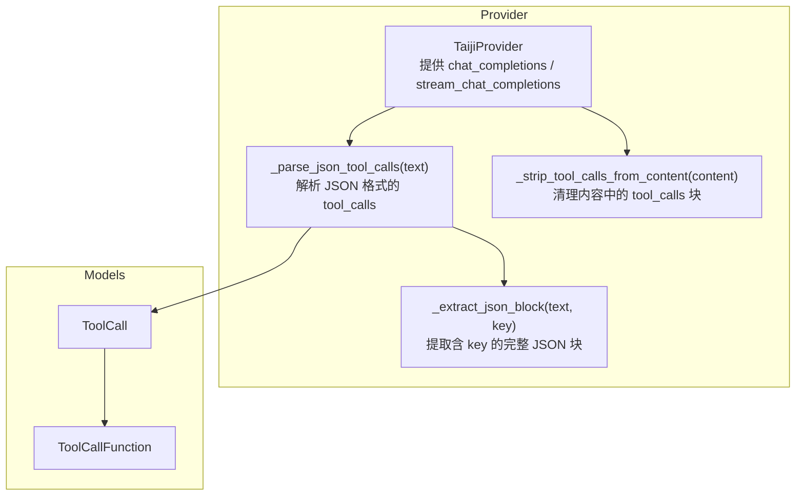
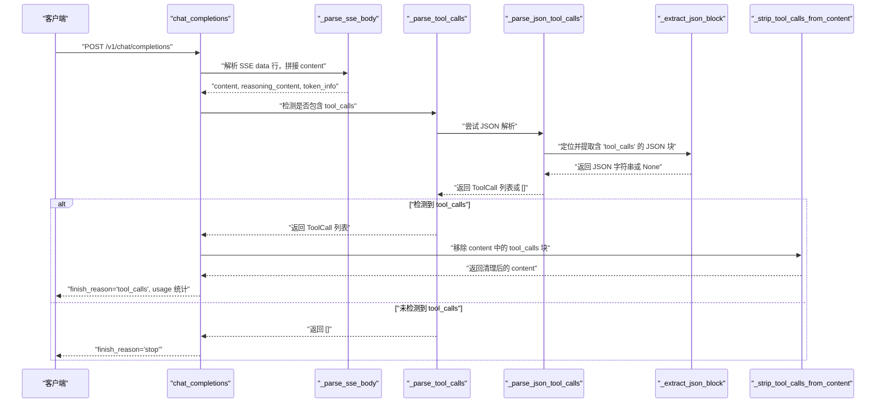
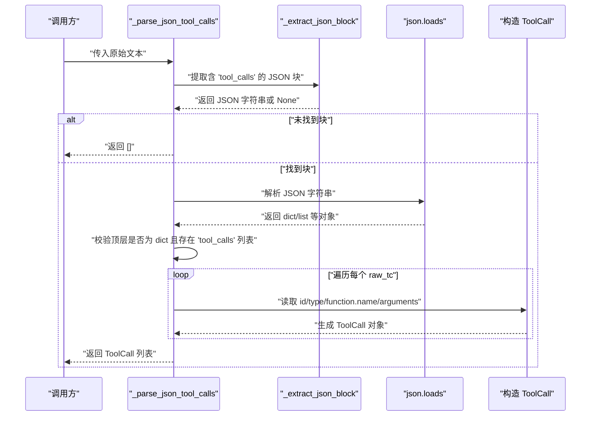
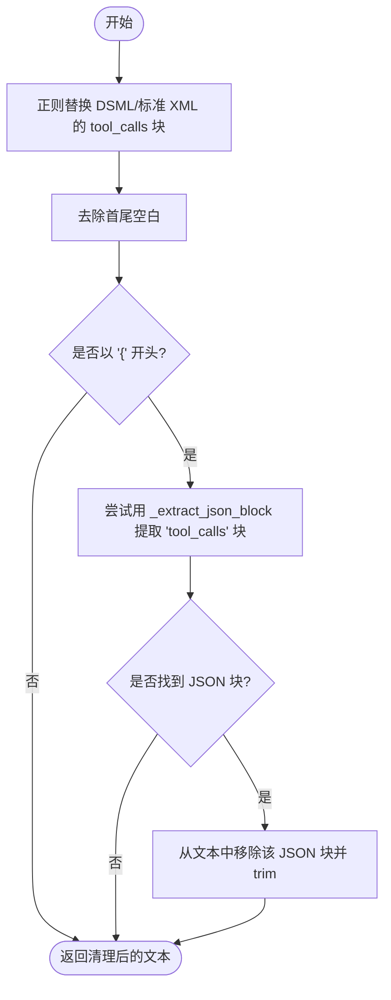
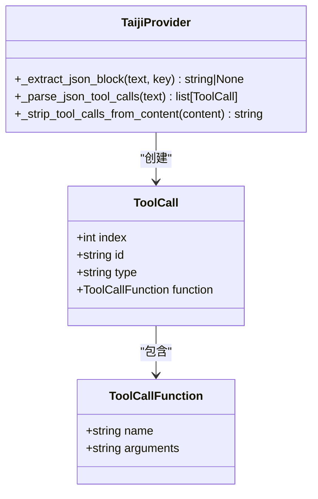

# JSON 解析器

<cite>
**本文引用的文件**
- [src/openai_provider/providers/taiji.py](file://src/openai_provider/providers/taiji.py)
- [src/openai_provider/models/openai.py](file://src/openai_provider/models/openai.py)
- [tests/e2e/test_04_tool_calls.py](file://tests/e2e/test_04_tool_calls.py)
- [tests/test_e2e.py](file://tests/test_e2e.py)
</cite>

## 目录
1. [简介](#简介)
2. [项目结构](#项目结构)
3. [核心组件](#核心组件)
4. [架构总览](#架构总览)
5. [详细组件分析](#详细组件分析)
6. [依赖关系分析](#依赖关系分析)
7. [性能考量](#性能考量)
8. [故障排查指南](#故障排查指南)
9. [结论](#结论)
10. [附录：输入输出示例与边界情况](#附录输入输出示例与边界情况)

## 简介
本技术文档聚焦于 OpenAI 兼容的 tool_calls JSON 格式解析能力，重点解释以下两个方法：
- _parse_json_tool_calls：从文本中解析形如 {"tool_calls": [{"id": "...", "function": {...}}]} 的结构，并生成 ToolCall 对象列表。
- _extract_json_block：在任意文本中定位包含指定 key 的完整 JSON 对象（支持嵌套），实现括号计数、字符串转义与边界处理。

文档同时覆盖错误处理策略、默认值生成（如 id 的 UUID 片段）、类型校验机制，并提供可复现的测试用例路径与流程图示，帮助读者快速理解与集成。

## 项目结构
本项目为 OpenAI Provider 适配层，负责将 OpenAI Chat Completions 请求转发至 Taiji 后端，并在响应中识别与提取 tool_calls。JSON 解析逻辑位于 provider 实现中，数据模型定义在 models 模块中。



图示来源
- [src/openai_provider/providers/taiji.py:320-397](file://src/openai_provider/providers/taiji.py#L320-L397)
- [src/openai_provider/models/openai.py:46-60](file://src/openai_provider/models/openai.py#L46-L60)

章节来源
- [src/openai_provider/providers/taiji.py:320-397](file://src/openai_provider/providers/taiji.py#L320-L397)
- [src/openai_provider/models/openai.py:46-60](file://src/openai_provider/models/openai.py#L46-L60)

## 核心组件
- _extract_json_block(text, key)
  - 功能：在文本中查找 key，向前回退寻找最近的左花括号作为起始位置，随后使用“括号计数 + 字符串状态机”算法扫描，返回完整的 JSON 对象字符串；若失败则返回 None。
  - 关键点：
    - 跳过字符串内的引号与转义字符，避免误判括号。
    - 仅对非字符串区域的 { 和 } 进行计数，当计数归零时即完成匹配。
    - 未找到 key 或找不到前导 { 时直接返回 None。
- _parse_json_tool_calls(text)
  - 功能：调用 _extract_json_block 提取包含 "tool_calls" 键的 JSON 块，再解析为 Python 对象，遍历数组项构造 ToolCall 列表。
  - 容错：
    - 若 block 不存在、JSON 解析失败、字段类型不符，均返回空列表。
    - 缺失 id 时自动生成以 "call_" 前缀加随机十六进制片段组成的 id。
    - type 默认为 "function"，name/arguments 缺失时使用空串/空对象字符串兜底。

章节来源
- [src/openai_provider/providers/taiji.py:320-348](file://src/openai_provider/providers/taiji.py#L320-L348)
- [src/openai_provider/providers/taiji.py:371-397](file://src/openai_provider/providers/taiji.py#L371-L397)
- [src/openai_provider/models/openai.py:46-60](file://src/openai_provider/models/openai.py#L46-L60)

## 架构总览
下图展示了从 SSE 响应到最终 OpenAI 风格响应的关键流程，其中 JSON tool_calls 的解析发生在 content 提取之后、finish_reason 判定之前。



图示来源
- [src/openai_provider/providers/taiji.py:633-668](file://src/openai_provider/providers/taiji.py#L633-L668)
- [src/openai_provider/providers/taiji.py:350-397](file://src/openai_provider/providers/taiji.py#L350-L397)
- [src/openai_provider/providers/taiji.py:484-499](file://src/openai_provider/providers/taiji.py#L484-L499)

## 详细组件分析

### 组件一：_extract_json_block 算法详解
该方法是整个 JSON 解析的关键前置步骤，其目标是“在任意文本中精准切分出包含目标 key 的完整 JSON 对象”。

```mermaid
flowchart TD
Start(["函数入口"]) --> FindKey["查找 key 的位置"]
FindKey --> KeyFound{"是否找到 key?"}
KeyFound -- "否" --> ReturnNone["返回 None"]
KeyFound -- "是" --> FindLB["在 key 之前找最近的一个 '{'"]
FindLB --> LBFound{"是否找到左花括号?"}
LBFound -- "否" --> ReturnNone
LBFound -- "是" --> Init["初始化 brace_count=0<br/>in_string=False<br/>escape=False<br/>end=start"]
Init --> Loop{"遍历字符直到结束"}
Loop --> EscapeCheck{"escape 标志为真?"}
EscapeCheck -- "是" --> ResetEscape["重置 escape=False"] --> NextChar["继续下一个字符"]
EscapeCheck -- "否" --> Backslash{"当前字符是 '\\\\' ?"}
Backslash -- "是" --> SetEscape["设置 escape=True"] --> NextChar
Backslash -- "否" --> Quote{"当前字符是 '\"' ?"}
Quote -- "是" --> ToggleString["翻转 in_string 状态"] --> NextChar
Quote -- "否" --> InStr{"是否在字符串内?"}
InStr -- "是" --> NextChar
InStr -- "否" --> Brace{"当前字符是 '{' 或 '}' ?"}
Brace -- "'{'" --> IncCount["brace_count += 1"] --> NextChar
Brace -- "'}'" --> DecCount["brace_count -= 1"] --> ZeroCheck{"brace_count == 0 ?"}
ZeroCheck -- "是" --> ReturnBlock["返回 text[start:end+1]"]
ZeroCheck -- "否" --> NextChar
NextChar --> Loop
Loop --> EndReached["到达文本末尾"] --> ReturnNone
```

图示来源
- [src/openai_provider/providers/taiji.py:320-348](file://src/openai_provider/providers/taiji.py#L320-L348)

要点说明
- 字符串感知：遇到双引号切换 in_string 状态，确保字符串内部的 { 和 } 不被当作结构分隔符。
- 转义处理：遇到反斜杠设置 escape 标志，下一位字符将被忽略（包括转义的引号）。
- 括号计数：仅在非字符串区域对 { 和 } 计数，当计数归零时即表示一个完整对象结束。
- 边界情况：
  - 未找到 key 或找不到前导 {：直接返回 None。
  - 文本结尾未闭合：返回 None，避免截断不完整 JSON。

章节来源
- [src/openai_provider/providers/taiji.py:320-348](file://src/openai_provider/providers/taiji.py#L320-L348)

### 组件二：_parse_json_tool_calls 解析流程
该方法负责将提取到的 JSON 块转换为 ToolCall 列表，遵循 OpenAI 兼容结构。



图示来源
- [src/openai_provider/providers/taiji.py:371-397](file://src/openai_provider/providers/taiji.py#L371-L397)

行为与容错
- 类型校验：
  - 顶层对象必须是 dict，且 "tool_calls" 字段必须为 list，否则返回空列表。
  - 每个元素必须是 dict，否则跳过。
- 默认值生成：
  - id：若缺失，则以 "call_" 前缀加上随机十六进制片段生成。
  - type：若缺失，默认为 "function"。
  - function.name：若缺失，使用空字符串。
  - function.arguments：若缺失，使用 "{}" 字符串。
- 异常处理：
  - 捕获 JSONDecodeError、KeyError、TypeError，统一返回空列表，保证上层稳定。

章节来源
- [src/openai_provider/providers/taiji.py:371-397](file://src/openai_provider/providers/taiji.py#L371-L397)
- [src/openai_provider/models/openai.py:46-60](file://src/openai_provider/models/openai.py#L46-L60)

### 组件三：_strip_tool_calls_from_content 清理逻辑
当检测到 tool_calls 后，需要从 content 中移除 XML/JSON 形式的 tool_calls 块，避免污染自然语言输出。



图示来源
- [src/openai_provider/providers/taiji.py:484-499](file://src/openai_provider/providers/taiji.py#L484-L499)

章节来源
- [src/openai_provider/providers/taiji.py:484-499](file://src/openai_provider/providers/taiji.py#L484-L499)

## 依赖关系分析
- 数据模型依赖
  - ToolCall 与 ToolCallFunction 定义在 models/openai.py，被 provider 用于构建结构化结果。
- 运行时依赖
  - json：用于解析 JSON 块。
  - uuid：用于生成 id 的随机片段。
  - re：用于 XML 模式匹配与清理。
- 外部交互
  - 上游通过 chat_completions 调用，内部先解析 SSE 响应，再执行 tool_calls 检测与清理。



图示来源
- [src/openai_provider/models/openai.py:46-60](file://src/openai_provider/models/openai.py#L46-L60)
- [src/openai_provider/providers/taiji.py:320-397](file://src/openai_provider/providers/taiji.py#L320-L397)

章节来源
- [src/openai_provider/models/openai.py:46-60](file://src/openai_provider/models/openai.py#L46-L60)
- [src/openai_provider/providers/taiji.py:320-397](file://src/openai_provider/providers/taiji.py#L320-L397)

## 性能考量
- 时间复杂度
  - _extract_json_block：O(n)，单次线性扫描，n 为文本长度。
  - _parse_json_tool_calls：O(n + m)，n 为文本长度，m 为 tool_calls 数组长度（逐条构造对象）。
- 空间复杂度
  - 主要消耗来自中间 JSON 字符串切片与解析对象，整体 O(n)。
- 优化建议
  - 对于超长文本，优先使用流式处理与增量解析，减少一次性内存占用。
  - 若频繁调用，可对 _extract_json_block 的 key 搜索进行缓存或索引优化（例如记录上一次命中位置）。

## 故障排查指南
常见问题与定位思路
- 未解析出 tool_calls
  - 检查文本中是否存在 "tool_calls" 键以及前导 "{"。
  - 确认 JSON 块是否完整闭合，_extract_json_block 会返回 None 导致解析失败。
- 解析成功但结果为空列表
  - 检查 "tool_calls" 是否为数组，且每个元素是否为字典。
  - 检查 JSON 解析是否抛出异常（非法 JSON、转义问题）。
- 生成的 id 不符合预期
  - 若输入未提供 id，系统将以 "call_" 前缀加随机片段生成。
- 清理后 content 为空
  - 若工具调用为纯 JSON/XML 块且无其他文本，清理后可能为空，此时 content 会被置为 None。

章节来源
- [src/openai_provider/providers/taiji.py:371-397](file://src/openai_provider/providers/taiji.py#L371-L397)
- [src/openai_provider/providers/taiji.py:484-499](file://src/openai_provider/providers/taiji.py#L484-L499)

## 结论
- _extract_json_block 提供了健壮的“带字符串感知的括号计数”算法，能准确提取任意文本中的完整 JSON 对象。
- _parse_json_tool_calls 严格遵循 OpenAI 兼容结构，具备完善的类型校验与默认值生成，并对异常进行稳健处理。
- 结合 _strip_tool_calls_from_content，可在保留自然语言内容的同时正确分离工具调用信息，保障下游消费的一致性。

## 附录：输入输出示例与边界情况
以下为可直接用于验证的行为描述与对应测试路径（不展示具体代码内容）：

- 正常 JSON 格式
  - 输入：包含 {"tool_calls": [{"id": "...", "type": "function", "function": {"name": "...", "arguments": "{...}"}}]} 的文本。
  - 输出：ToolCall 列表，id/name/arguments/type 按规则填充。
  - 参考路径：[tests/e2e/test_04_tool_calls.py:50-104](file://tests/e2e/test_04_tool_calls.py#L50-L104)

- 缺失 id 时的默认生成
  - 行为：若 raw_tc 未提供 id，则生成以 "call_" 前缀加随机十六进制片段的 id。
  - 参考路径：[src/openai_provider/providers/taiji.py:371-397](file://src/openai_provider/providers/taiji.py#L371-L397)

- 缺失 function 字段或字段类型不符
  - 行为：跳过该条目或采用默认值（name 为空串，arguments 为空对象字符串）。
  - 参考路径：[src/openai_provider/providers/taiji.py:371-397](file://src/openai_provider/providers/taiji.py#L371-L397)

- JSON 解析失败
  - 行为：捕获 JSONDecodeError 并返回空列表，不影响整体流程。
  - 参考路径：[src/openai_provider/providers/taiji.py:371-397](file://src/openai_provider/providers/taiji.py#L371-L397)

- 嵌套 JSON 与转义处理
  - 行为：_extract_json_block 能正确处理字符串内的引号与转义，避免误判括号。
  - 参考路径：[src/openai_provider/providers/taiji.py:320-348](file://src/openai_provider/providers/taiji.py#L320-L348)

- 清理 JSON tool_calls 块
  - 行为：当 content 以 "{" 开头且包含 "tool_calls" 时，会尝试提取并移除该 JSON 块。
  - 参考路径：[tests/test_e2e.py:744-749](file://tests/test_e2e.py#L744-L749)

- 流式场景下的 tool_calls 参数拼接与校验
  - 行为：流式 chunk 中 arguments 可能分片到达，最终拼接应为合法 JSON。
  - 参考路径：[tests/e2e/test_04_tool_calls.py:133-141](file://tests/e2e/test_04_tool_calls.py#L133-L141)