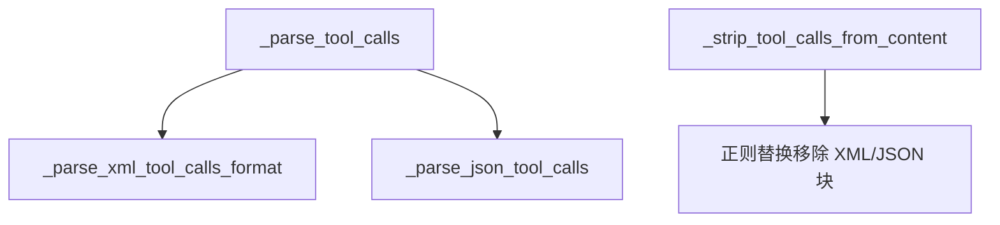
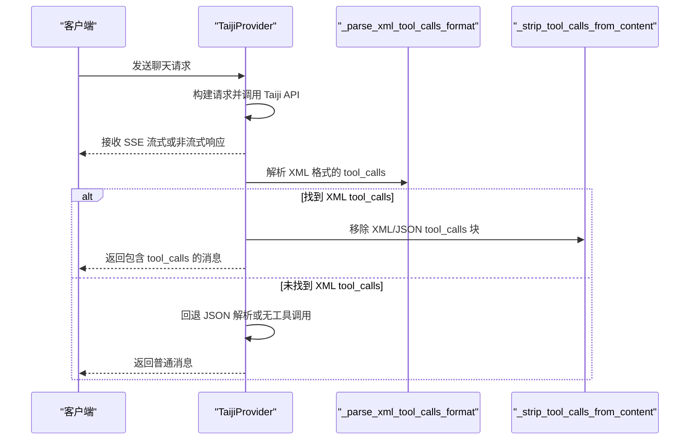
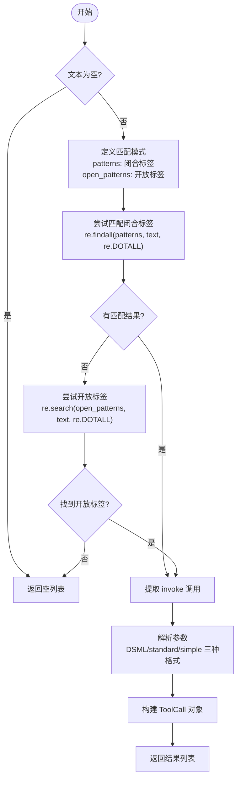
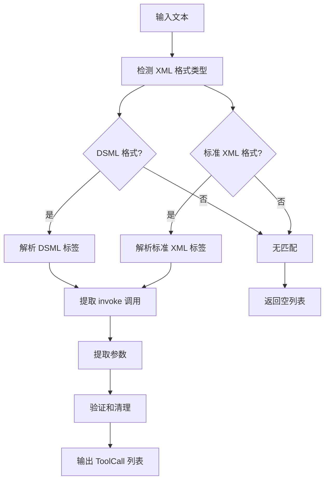
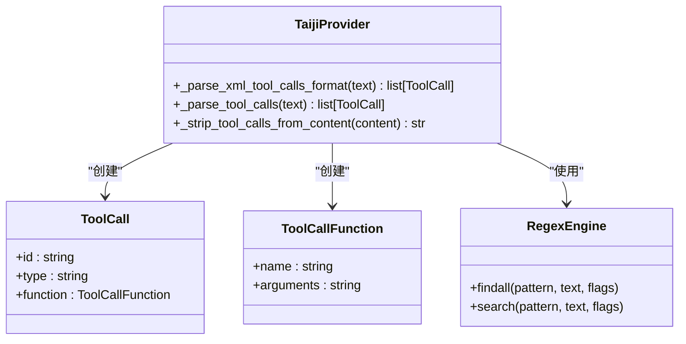

# XML 解析器

<cite>
**本文引用的文件**   
- [taiji.py](file://src/openai_provider/providers/taiji.py)
- [test_regression.py](file://tests/test_regression.py)
</cite>

## 目录
1. [简介](#简介)
2. [项目结构](#项目结构)
3. [核心组件](#核心组件)
4. [架构总览](#架构总览)
5. [详细组件分析](#详细组件分析)
6. [依赖关系分析](#依赖关系分析)
7. [性能考量](#性能考量)
8. [故障排查指南](#故障排查指南)
9. [结论](#结论)
10. [附录](#附录)

## 简介
本技术文档聚焦于 XML 格式解析器，特别是 _parse_xml_tool_calls_format 方法。该方法用于从模型输出中识别并解析工具调用（tool_calls），支持两种 XML 变体：
- DSML 格式：使用 <｜｜DSML｜｜tool_calls> 和 <｜｜DSML｜｜invoke> 等标签
- 标准 XML 格式：使用 <tool_calls> 和 <invoke> 等标签

文档将深入解释正则表达式匹配模式、闭合标签处理逻辑、开放标签回退机制，以及参数提取的三种方式：
- DSML 参数格式：<｜｜DSML｜｜parameter name="xxx">value</｜｜DSML｜｜parameter>
- 标准 parameter 标签：<parameter name="xxx">value</parameter>
- 简单 key-value 格式：<key>value</key>

同时提供具体输入输出示例、边界情况与错误恢复策略说明。

## 项目结构
XML 解析相关实现位于 TaijiProvider 类中，主要方法包括：
- _parse_tool_calls：统一入口，优先尝试 XML 解析，失败则回退到 JSON
- _parse_xml_tool_calls_format：解析 XML 格式的 tool_calls
- _strip_tool_calls_from_content：从文本中移除 XML/JSON 的 tool_calls 块，保留纯文本内容



图表来源
- [taiji.py:350-369](file://src/openai_provider/providers/taiji.py#L350-L369)
- [taiji.py:399-482](file://src/openai_provider/providers/taiji.py#L399-L482)
- [taiji.py:484-499](file://src/openai_provider/providers/taiji.py#L484-L499)

章节来源
- [taiji.py:350-369](file://src/openai_provider/providers/taiji.py#L350-L369)
- [taiji.py:399-482](file://src/openai_provider/providers/taiji.py#L399-L482)
- [taiji.py:484-499](file://src/openai_provider/providers/taiji.py#L484-L499)

## 核心组件
- _parse_xml_tool_calls_format：核心解析器，负责识别并解析 XML 格式的 tool_calls，返回 ToolCall 列表
- _parse_tool_calls：调度器，先尝试 XML 解析，再回退 JSON
- _strip_tool_calls_from_content：清理函数，从响应文本中剔除 tool_calls 块，避免污染自然语言内容

章节来源
- [taiji.py:399-482](file://src/openai_provider/providers/taiji.py#L399-L482)
- [taiji.py:350-369](file://src/openai_provider/providers/taiji.py#L350-L369)
- [taiji.py:484-499](file://src/openai_provider/providers/taiji.py#L484-L499)

## 架构总览
下图展示了从模型 SSE 响应到最终 OpenAI 兼容输出的关键流程，重点突出 XML 解析在其中的位置与作用。



图表来源
- [taiji.py:670-780](file://src/openai_provider/providers/taiji.py#L670-L780)
- [taiji.py:399-482](file://src/openai_provider/providers/taiji.py#L399-L482)
- [taiji.py:484-499](file://src/openai_provider/providers/taiji.py#L484-L499)

## 详细组件分析

### _parse_xml_tool_calls_format 方法详解
该方法实现了完整的 XML 解析逻辑，支持 DSML 和标准 XML 两种格式。

#### 正则表达式匹配模式


图表来源
- [taiji.py:399-482](file://src/openai_provider/providers/taiji.py#L399-L482)

#### 闭合标签处理逻辑
- 首先尝试匹配完整的闭合标签对，如 `<｜｜DSML｜｜tool_calls>...</｜｜DSML｜｜/tool_calls>` 或 `<tool_calls>...</tool_calls>`
- 使用 `re.findall` 配合 `re.DOTALL` 标志，确保能跨行匹配多行 XML 内容
- 如果找到匹配结果，直接提取内容进行处理

#### 开放标签回退机制
- 当没有闭合标签时，回退到开放标签匹配，如 `<｜｜DSML｜｜tool_calls>(.*)` 或 `<tool_calls>(.*)`
- 使用 `re.search` 匹配从开放标签到文本末尾的所有内容
- 这种设计确保了即使模型输出被截断或不完整，也能尽可能解析出有效的工具调用

#### 参数提取的三种方式
1. **DSML 参数格式**：`<｜｜DSML｜｜parameter name="xxx">value</｜｜DSML｜｜parameter>`
   - 正则：`r'<｜｜DSML｜｜parameter\s+name="([^"]+)"[^>]*>(.*?)</｜｜DSML｜｜parameter>'`
   - 支持额外的属性如 `string="true"`

2. **标准 parameter 标签**：`<parameter name="xxx">value</parameter>`
   - 正则：`r'<parameter\s*name="([^"]+)"[^>]*>(.*?)</parameter>'`
   - 允许标签名和属性间有空格或无空格

3. **简单 key-value 格式**：`<key>value</key>`
   - 正则：`r'<([^/\s>]+)>([^<]+)</\1>'`
   - 自动排除已知的 XML 标签名（invoke, parameter, tool_calls, function_calls）

#### 错误处理和边界情况
- 空文本检查：直接返回空列表
- 无匹配结果：返回空列表而非抛出异常
- 参数值清理：使用 `.strip()` 去除多余空白字符
- 唯一 ID 生成：为每个 ToolCall 生成唯一的 UUID

章节来源
- [taiji.py:399-482](file://src/openai_provider/providers/taiji.py#L399-L482)

### 支持的 XML 格式示例

#### 标准 XML 格式
```xml
<tool_calls>
  <invoke name="get_weather">
    <parameter name="city">Beijing</parameter>
  </invoke>
</tool_calls>
```

#### DSML 格式
```xml
<｜｜DSML｜｜tool_calls>
  <｜｜DSML｜｜invoke name="calculate">
    <｜｜DSML｜｜parameter name="expression">2+3</｜｜｜DSML｜｜parameter>
  </｜｜DSML｜｜invoke>
</｜｜DSML｜｜tool_calls>
```

#### 复杂参数示例
```xml
<tool_calls>
  <invoke name="search">
    <parameter name="query">news</parameter>
    <parameter name="limit">10</parameter>
    <parameter name="category">technology</parameter>
  </invoke>
</tool_calls>
```

章节来源
- [test_regression.py:23-48](file://tests/test_regression.py#L23-L48)

### 解析流程图


图表来源
- [taiji.py:399-482](file://src/openai_provider/providers/taiji.py#L399-L482)

## 依赖关系分析
XML 解析器与其他组件的依赖关系如下：



图表来源
- [taiji.py:399-482](file://src/openai_provider/providers/taiji.py#L399-L482)

章节来源
- [taiji.py:399-482](file://src/openai_provider/providers/taiji.py#L399-L482)

## 性能考量
- **正则表达式优化**：使用 `re.DOTALL` 标志进行跨行匹配，避免多次扫描
- **短路逻辑**：一旦找到闭合标签匹配，立即停止尝试开放标签
- **内存效率**：使用生成器模式处理大量 XML 内容
- **错误恢复**：解析失败时返回空列表而非抛出异常，保证系统稳定性

## 故障排查指南

### 常见问题及解决方案

#### 问题1：XML 标签不匹配
**现象**：无法解析工具调用
**原因**：标签格式不符合预期
**解决**：检查是否使用了正确的标签名称和属性格式

#### 问题2：参数提取失败
**现象**：参数值为空或格式错误
**原因**：参数标签格式不正确
**解决**：确保使用 `<parameter name="param_name">value</parameter>` 格式

#### 问题3：嵌套标签冲突
**现象**：复杂参数结构解析错误
**原因**：简单 key-value 格式与标准 parameter 标签冲突
**解决**：优先使用标准 parameter 标签格式

### 调试技巧
- 启用详细日志记录，查看正则匹配过程
- 使用单元测试验证特定 XML 格式的解析结果
- 逐步测试不同格式的输入，定位解析问题

章节来源
- [test_regression.py:178-211](file://tests/test_regression.py#L178-L211)

## 结论
_parse_xml_tool_calls_format 方法提供了一个健壮的 XML 解析器，支持多种格式变体和参数提取方式。通过合理的错误处理和回退机制，确保了在不同场景下的稳定性和兼容性。该实现充分考虑了实际使用中的各种边界情况，为 AI 代理的工具调用功能提供了可靠的基础设施。

## 附录

### 正则表达式模式参考

#### 闭合标签模式
- DSML: `r'<｜｜DSML｜｜tool_calls>(.*?)<｜｜DSML｜｜/tool_calls>'`
- 标准: `r'<tool_calls>(.*?)</tool_calls>'`

#### 开放标签模式
- DSML: `r'<｜｜DSML｜｜tool_calls>(.*)'`
- 标准: `r'<tool_calls>(.*)'`

#### Invoke 标签模式
- DSML: `r'<｜｜DSML｜｜invoke\s+name="([^"]+)"[^>]*>(.*?)(?:<｜｜DSML｜｜/invoke>|$)'`
- 标准: `r'<invoke\s*name="([^"]+)"[^>]*>(.*?)(?:</invoke>|$)'`

#### 参数提取模式
- DSML: `r'<｜｜DSML｜｜parameter\s+name="([^"]+)"[^>]*>(.*?)</｜｜DSML｜｜parameter>'`
- 标准: `r'<parameter\s*name="([^"]+)"[^>]*>(.*?)</parameter>'`
- 简单: `r'<([^/\s>]+)>([^<]+)</\1>'`

章节来源
- [taiji.py:399-482](file://src/openai_provider/providers/taiji.py#L399-L482)