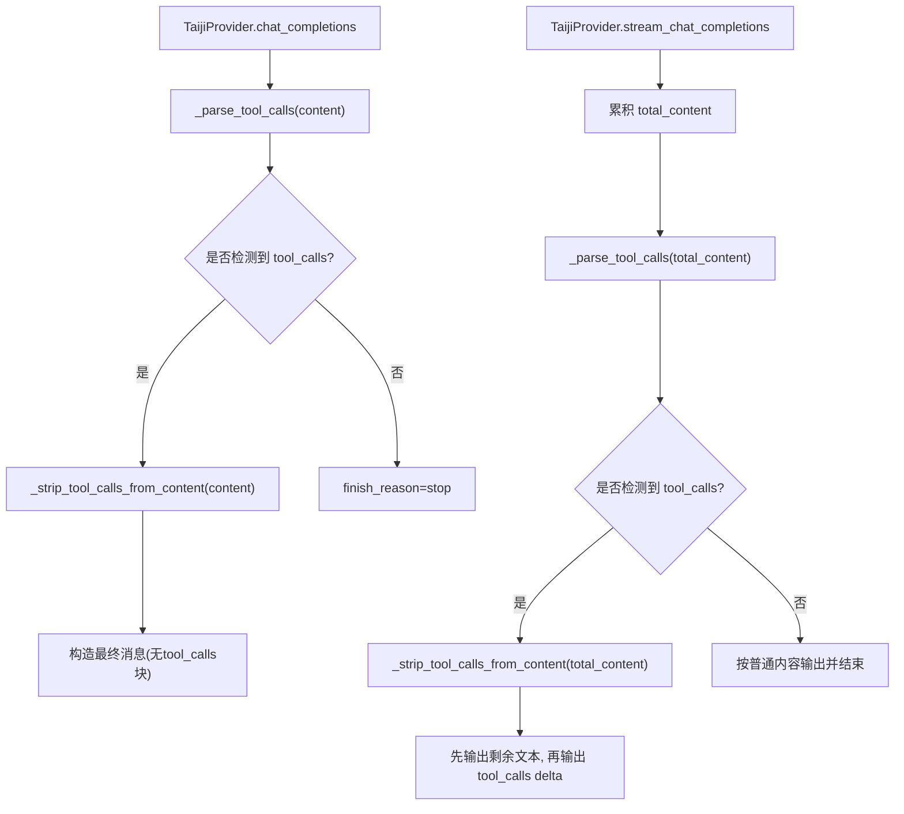
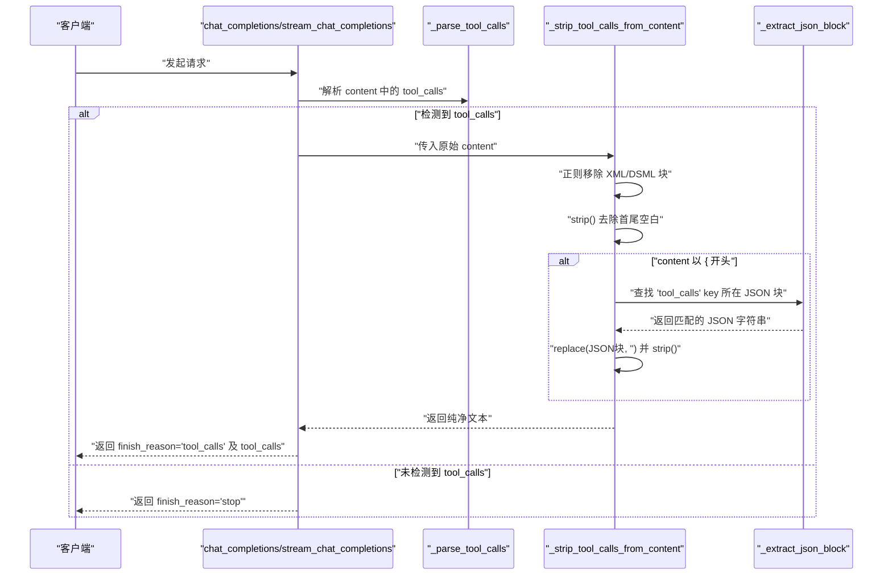
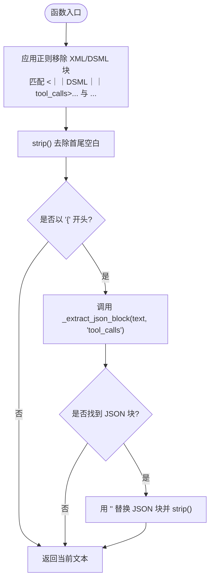
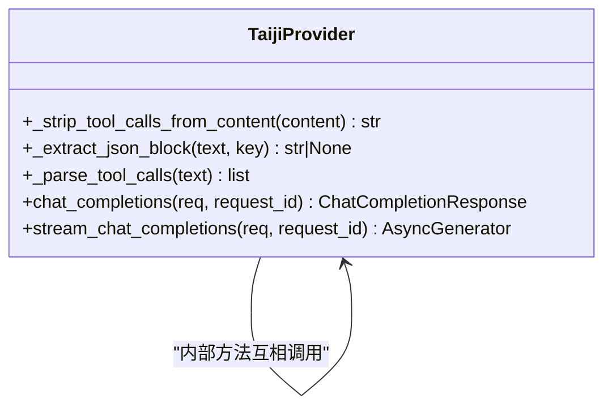

# 内容清理器

<cite>
**本文引用的文件**   
- [src/openai_provider/providers/taiji.py](file://src/openai_provider/providers/taiji.py)
- [tests/test_e2e.py](file://tests/test_e2e.py)
</cite>

## 目录
1. [简介](#简介)
2. [项目结构](#项目结构)
3. [核心组件](#核心组件)
4. [架构总览](#架构总览)
5. [详细组件分析](#详细组件分析)
6. [依赖关系分析](#依赖关系分析)
7. [性能考量](#性能考量)
8. [故障排查指南](#故障排查指南)
9. [结论](#结论)

## 简介
本技术文档聚焦于“内容清理器”的核心方法 _strip_tool_calls_from_content，该方法用于从模型返回的文本中移除 XML/JSON 格式的 tool_calls 块，从而得到纯净的对话内容。文档将深入解析其正则匹配策略、JSON 块的智能提取与替换逻辑、空白字符处理以及边界情况处理，并结合测试用例展示混合内容的清理效果与工具调用分离的处理流程。

## 项目结构
该功能位于 TaijiProvider 类中，属于 OpenAI Provider 适配层的一部分，负责将上游 OpenAI Chat Completions 请求转发到 Taiji 后端，并对响应进行解析、清洗与结构化。_strip_tool_calls_from_content 在以下两个关键路径中被调用：
- 非流式响应：在 chat_completions 中，先解析 tool_calls，再对 content 执行清理。
- 流式响应：在 stream_chat_completions 中，流结束后统一判断是否为 tool_call，若是则先输出剩余文本，再输出 tool_calls delta。

图表来源
- [src/openai_provider/providers/taiji.py:670-780](file://src/openai_provider/providers/taiji.py#L670-L780)
- [src/openai_provider/providers/taiji.py:782-996](file://src/openai_provider/providers/taiji.py#L782-L996)

章节来源
- [src/openai_provider/providers/taiji.py:484-499](file://src/openai_provider/providers/taiji.py#L484-L499)
- [src/openai_provider/providers/taiji.py:670-780](file://src/openai_provider/providers/taiji.py#L670-L780)
- [src/openai_provider/providers/taiji.py:782-996](file://src/openai_provider/providers/taiji.py#L782-L996)

## 核心组件
- _strip_tool_calls_from_content：从文本中移除 XML/JSON 格式的 tool_calls 块，返回清理后的文本。
- _extract_json_block：从文本中提取包含指定 key 的完整 JSON 对象（支持嵌套），为 JSON 模式下的智能提取提供支撑。
- _parse_tool_calls：检测并解析 tool_calls（XML/DSML 或 JSON），供清理器前置判断使用。

章节来源
- [src/openai_provider/providers/taiji.py:484-499](file://src/openai_provider/providers/taiji.py#L484-L499)
- [src/openai_provider/providers/taiji.py:320-348](file://src/openai_provider/providers/taiji.py#L320-L348)
- [src/openai_provider/providers/taiji.py:350-369](file://src/openai_provider/providers/taiji.py#L350-L369)

## 架构总览
下图展示了 _strip_tool_calls_from_content 在整个响应处理链路中的位置与作用：

图表来源
- [src/openai_provider/providers/taiji.py:484-499](file://src/openai_provider/providers/taiji.py#L484-L499)
- [src/openai_provider/providers/taiji.py:320-348](file://src/openai_provider/providers/taiji.py#L320-L348)
- [src/openai_provider/providers/taiji.py:670-780](file://src/openai_provider/providers/taiji.py#L670-L780)
- [src/openai_provider/providers/taiji.py:782-996](file://src/openai_provider/providers/taiji.py#L782-L996)

## 详细组件分析

### _strip_tool_calls_from_content 实现要点
- 输入：原始文本 content（可能包含 XML/DSML 或 JSON 格式的 tool_calls 块）。
- 输出：清理后的文本（已移除 tool_calls 块，并去除首尾空白）。
- 处理步骤：
  - 使用两组正则表达式分别匹配 DSML 和标准 XML 的 tool_calls 块，采用非贪婪匹配并在闭合标签缺失时回退到行尾。
  - 对所有匹配结果执行替换为空字符串，随后对整体文本执行 strip()。
  - 若清理后文本以 { 开头，则尝试通过 _extract_json_block 定位包含 "tool_calls" key 的完整 JSON 对象，并将其从文本中移除，再次 strip()。
  - 返回最终文本。

图表来源
- [src/openai_provider/providers/taiji.py:484-499](file://src/openai_provider/providers/taiji.py#L484-L499)
- [src/openai_provider/providers/taiji.py:320-348](file://src/openai_provider/providers/taiji.py#L320-L348)

章节来源
- [src/openai_provider/providers/taiji.py:484-499](file://src/openai_provider/providers/taiji.py#L484-L499)

#### XML 模式的正则表达式匹配
- 支持两种变体：
  - DSML 格式：<｜｜DSML｜｜tool_calls> ... <｜｜DSML｜｜/tool_calls>
  - 标准 XML 格式：<tool_calls> ... </tool_calls>
- 当缺少闭合标签时，正则回退到匹配开放标签至文本末尾（$），确保不遗漏不完整片段。
- 使用 re.DOTALL 标志允许跨行匹配，避免换行导致匹配失败。

注意：DSML 的正则在闭合标签缺失时会匹配到 $，可能导致后续内容被吞掉。测试用例对此行为有明确注释说明。

章节来源
- [src/openai_provider/providers/taiji.py:484-499](file://src/openai_provider/providers/taiji.py#L484-L499)
- [tests/test_e2e.py:735-742](file://tests/test_e2e.py#L735-L742)

#### JSON 块的智能提取与替换逻辑
- 触发条件：清理后的文本以 { 开头。
- 提取策略：
  - 在文本中查找 "tool_calls" 键的位置。
  - 向前扫描最近的 { 作为起始位置。
  - 向后遍历字符，维护括号计数与字符串状态，遇到闭合 } 且计数归零时，返回完整的 JSON 子串。
- 替换策略：
  - 使用 replace(json_block, '') 移除整个 JSON 块。
  - 再次 strip() 去除残留空白。

章节来源
- [src/openai_provider/providers/taiji.py:320-348](file://src/openai_provider/providers/taiji.py#L320-L348)
- [src/openai_provider/providers/taiji.py:484-499](file://src/openai_provider/providers/taiji.py#L484-L499)

#### 空白字符处理与边界情况
- 每次替换后均执行 strip()，确保不会遗留多余空白。
- 当 content 仅包含 tool_calls 块时，清理后可能为空或纯空白，上层逻辑会将其置为 None。
- 对于没有 tool_calls 的普通文本，直接原样返回。

章节来源
- [src/openai_provider/providers/taiji.py:484-499](file://src/openai_provider/providers/taiji.py#L484-L499)
- [src/openai_provider/providers/taiji.py:724-735](file://src/openai_provider/providers/taiji.py#L724-L735)

#### 代码示例与清理效果（基于测试）
以下为测试覆盖的典型场景与预期效果（以路径引用代替具体代码）：
- 标准 XML 单工具调用嵌入文本：前后文本保留，XML 块被移除。
  - 参考：[tests/test_e2e.py:728-733](file://tests/test_e2e.py#L728-L733)
- DSML 格式：应被正确移除；但已知 regex 局限可能导致后续内容被吞掉。
  - 参考：[tests/test_e2e.py:735-742](file://tests/test_e2e.py#L735-L742)
- JSON 形式的 tool_calls 嵌套在更大 JSON 中：整个 JSON 块被移除，结果为空或空白。
  - 参考：[tests/test_e2e.py:743-749](file://tests/test_e2e.py#L743-L749)
- 无 tool_calls 的普通文本：保持不变。
  - 参考：[tests/test_e2e.py:751-754](file://tests/test_e2e.py#L751-L754)
- 多个 XML 块混合：所有 XML 块被移除，其余文本保留。
  - 参考：[tests/test_e2e.py:756-762](file://tests/test_e2e.py#L756-L762)

章节来源
- [tests/test_e2e.py:723-762](file://tests/test_e2e.py#L723-L762)

#### 与工具调用分离的流程
- 非流式：
  - 先调用 _parse_tool_calls 检测是否存在 tool_calls。
  - 若存在，调用 _strip_tool_calls_from_content 清理 content，并将 tool_calls 单独放入 message.tool_calls，finish_reason 设为 "tool_calls"。
  - 若不存在，finish_reason 设为 "stop"。
- 流式：
  - 累积 total_content，流结束后统一调用 _parse_tool_calls。
  - 若检测到 tool_calls，先输出 remaining_text（经清理后的文本），再输出 tool_calls delta，最后发送 finish chunk。
  - 否则，按普通内容输出并结束。

章节来源
- [src/openai_provider/providers/taiji.py:670-780](file://src/openai_provider/providers/taiji.py#L670-L780)
- [src/openai_provider/providers/taiji.py:782-996](file://src/openai_provider/providers/taiji.py#L782-L996)

## 依赖关系分析
- _strip_tool_calls_from_content 依赖：
  - re.sub：用于正则替换。
  - _extract_json_block：用于 JSON 块提取。
- 上游调用者：
  - chat_completions：在非流式路径中调用。
  - stream_chat_completions：在流式路径中调用。

图表来源
- [src/openai_provider/providers/taiji.py:484-499](file://src/openai_provider/providers/taiji.py#L484-L499)
- [src/openai_provider/providers/taiji.py:320-348](file://src/openai_provider/providers/taiji.py#L320-L348)
- [src/openai_provider/providers/taiji.py:670-780](file://src/openai_provider/providers/taiji.py#L670-L780)
- [src/openai_provider/providers/taiji.py:782-996](file://src/openai_provider/providers/taiji.py#L782-L996)

章节来源
- [src/openai_provider/providers/taiji.py:484-499](file://src/openai_provider/providers/taiji.py#L484-L499)
- [src/openai_provider/providers/taiji.py:320-348](file://src/openai_provider/providers/taiji.py#L320-L348)
- [src/openai_provider/providers/taiji.py:670-780](file://src/openai_provider/providers/taiji.py#L670-L780)
- [src/openai_provider/providers/taiji.py:782-996](file://src/openai_provider/providers/taiji.py#L782-L996)

## 性能考量
- 正则替换的时间复杂度与文本长度线性相关，通常开销较小。
- JSON 块提取需要一次线性扫描，最坏情况下逐字符检查括号与字符串状态，时间复杂度 O(n)。
- 多次 strip() 与 replace() 操作均为线性时间，整体复杂度仍为 O(n)。
- 建议：
  - 若未来需支持更复杂的 JSON 结构，可考虑引入轻量级 JSON 解析器以提升鲁棒性。
  - 对超长文本，可在调用前做快速预检（如仅在前缀范围内搜索 key），减少不必要的扫描。

## 故障排查指南
- DSML 正则吞掉后续内容：
  - 现象：当 DSML 缺少闭合标签时，正则匹配到 $，可能吞噬其后文本。
  - 排查：检查模型输出是否包含闭合标签；必要时调整正则策略或增加容错。
  - 参考：[tests/test_e2e.py:735-742](file://tests/test_e2e.py#L735-L742)
- JSON 提取失败：
  - 现象：_extract_json_block 找不到 "tool_calls" 或无法定位完整 JSON 块。
  - 排查：确认 text 以 { 开头且包含 "tool_calls" 键；检查转义与嵌套是否正确。
  - 参考：[src/openai_provider/providers/taiji.py:320-348](file://src/openai_provider/providers/taiji.py#L320-L348)
- 清理后内容为空：
  - 现象：content 仅包含 tool_calls 块，清理后为空或空白。
  - 处理：上层逻辑会将 content 置为 None，避免下游误判。
  - 参考：[src/openai_provider/providers/taiji.py:724-735](file://src/openai_provider/providers/taiji.py#L724-L735)

章节来源
- [tests/test_e2e.py:735-742](file://tests/test_e2e.py#L735-L742)
- [src/openai_provider/providers/taiji.py:320-348](file://src/openai_provider/providers/taiji.py#L320-L348)
- [src/openai_provider/providers/taiji.py:724-735](file://src/openai_provider/providers/taiji.py#L724-L735)

## 结论
_strip_tool_calls_from_content 通过“正则移除 XML/DSML 块 + 智能提取并替换 JSON 块”的组合策略，有效实现了从混合文本中剥离 tool_calls 的能力，同时兼顾空白字符处理与常见边界情况。配合 _parse_tool_calls 的前置检测与上层流程的 finish_reason 控制，系统能够在非流式与流式两种模式下稳定地分离工具调用与对话内容。测试覆盖了典型场景与已知局限，为后续优化提供了明确的改进方向。