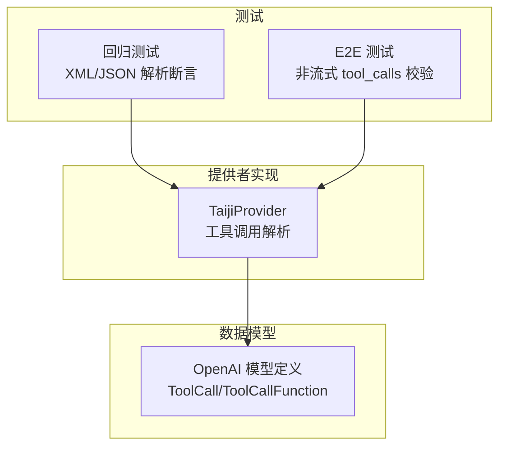
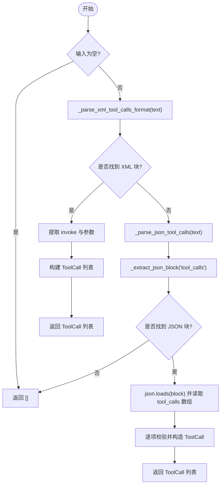
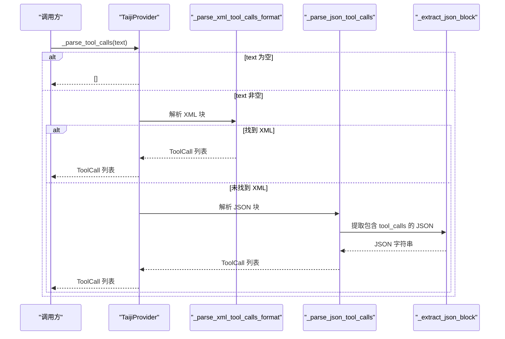
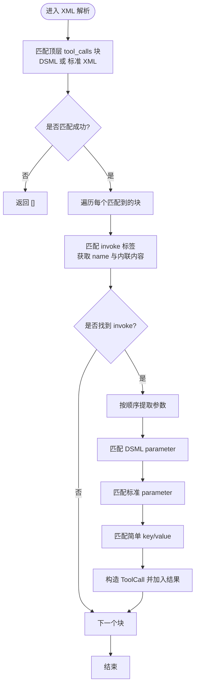
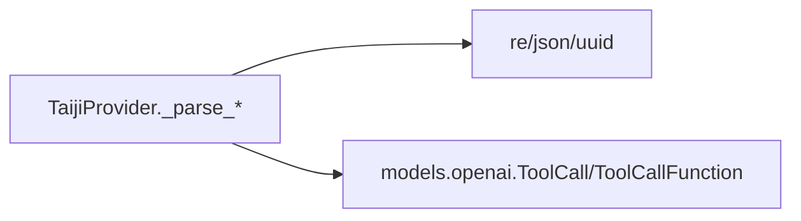

# 格式解析器

<cite>
**本文引用的文件**   
- [taiji.py](file://src/openai_provider/providers/taiji.py)
- [openai.py](file://src/openai_provider/models/openai.py)
- [test_regression.py](file://tests/test_regression.py)
- [test_04_tool_calls.py](file://tests/e2e/test_04_tool_calls.py)
</cite>

## 目录
1. [简介](#简介)
2. [项目结构](#项目结构)
3. [核心组件](#核心组件)
4. [架构总览](#架构总览)
5. [详细组件分析](#详细组件分析)
6. [依赖关系分析](#依赖关系分析)
7. [性能考量](#性能考量)
8. [故障排查指南](#故障排查指南)
9. [结论](#结论)

## 简介
本技术文档聚焦于“格式解析器”子系统，详细说明 TaijiProvider 中的 tool_calls 解析流程，重点覆盖以下方法：
- _parse_tool_calls：统一入口，支持 DSML XML、标准 XML 与 JSON 三种格式。
- _parse_xml_tool_calls_format：处理 DSML 标签（｜｜DSML｜｜tool_calls）和标准 XML 标签（tool_calls），提取 invoke 及参数。
- _parse_json_tool_calls：从文本中定位并解析 {"tool_calls": [...]} 的 JSON 块。

文档将给出正则匹配模式、参数提取逻辑、错误处理策略，并通过测试用例路径展示输入输出行为。

## 项目结构
与解析器相关的代码主要位于 provider 层与模型定义层，测试覆盖回归与端到端场景。

图表来源
- [taiji.py:350-482](file://src/openai_provider/providers/taiji.py#L350-L482)
- [openai.py:46-60](file://src/openai_provider/models/openai.py#L46-L60)
- [test_regression.py:178-211](file://tests/test_regression.py#L178-L211)
- [test_04_tool_calls.py:50-104](file://tests/e2e/test_04_tool_calls.py#L50-L104)

章节来源
- [taiji.py:350-482](file://src/openai_provider/providers/taiji.py#L350-L482)
- [openai.py:46-60](file://src/openai_provider/models/openai.py#L46-L60)
- [test_regression.py:178-211](file://tests/test_regression.py#L178-L211)
- [test_04_tool_calls.py:50-104](file://tests/e2e/test_04_tool_calls.py#L50-L104)

## 核心组件
- 统一解析入口：_parse_tool_calls
  - 优先尝试 XML 解析；若失败则回退到 JSON 解析。
  - 空输入直接返回空列表。
- XML 解析器：_parse_xml_tool_calls_format
  - 同时支持 DSML 与标准 XML 两种变体。
  - 支持闭合标签与开放标签（无闭合时取至末尾）。
  - 提取 invoke 名称与参数，兼容多种参数写法。
- JSON 解析器：_parse_json_tool_calls
  - 使用 _extract_json_block 定位包含 "tool_calls" 键的完整 JSON 对象。
  - 解析后构造 ToolCall 列表，缺失 id 时生成随机 id。

章节来源
- [taiji.py:350-398](file://src/openai_provider/providers/taiji.py#L350-L398)
- [taiji.py:399-482](file://src/openai_provider/providers/taiji.py#L399-L482)
- [taiji.py:320-348](file://src/openai_provider/providers/taiji.py#L320-L348)

## 架构总览
下图展示了从响应内容到结构化 ToolCall 的解析流程，以及在不同格式下的分支处理。

图表来源
- [taiji.py:350-398](file://src/openai_provider/providers/taiji.py#L350-L398)
- [taiji.py:399-482](file://src/openai_provider/providers/taiji.py#L399-L482)
- [taiji.py:320-348](file://src/openai_provider/providers/taiji.py#L320-L348)

## 详细组件分析

### 统一入口：_parse_tool_calls
- 职责
  - 接收原始文本，按优先级尝试 XML 与 JSON 解析。
  - 未检测到任何 tool_calls 时返回空列表。
- 关键行为
  - 空字符串或 None 直接返回 []。
  - 先调用 XML 解析器；若返回结果则直接返回。
  - 否则调用 JSON 解析器作为回退。

章节来源
- [taiji.py:350-369](file://src/openai_provider/providers/taiji.py#L350-L369)

### XML 解析器：_parse_xml_tool_calls_format
- 支持的标签变体
  - DSML：｜｜DSML｜｜tool_calls 与 ｜｜DSML｜｜invoke、｜｜DSML｜｜parameter
  - 标准 XML：<tool_calls>、<invoke name="...">、<parameter name="...">
- 匹配策略
  - 优先匹配闭合标签对；若无闭合，则匹配开放标签至文本末尾。
  - 使用 re.DOTALL 以跨行匹配。
- 参数提取顺序
  - 首先匹配 DSML 参数 <｜｜DSML｜｜parameter name="...">...</｜｜DSML｜｜parameter>
  - 其次匹配标准参数 <parameter name="...">...</parameter>
  - 最后回退到简单键值 <key>value</key>，但排除保留标签名
- 返回值
  - 每个 invoke 对应一个 ToolCall，id 为自动生成，type 固定为 function，arguments 为 JSON 字符串。

正则表达式模式说明（仅描述，不展示具体代码）
- 顶层块匹配
  - DSML 闭合：｜｜DSML｜｜tool_calls ... ｜｜DSML｜｜/tool_calls
  - 标准闭合：<tool_calls> ... </tool_calls>
  - 开放标签（无闭合）：｜｜DSML｜｜tool_calls(.*) 或 <tool_calls>(.*)
- invoke 匹配
  - DSML：<｜｜DSML｜｜invoke\s+name="([^"]+)"[^>]*>(.*?)(?:<｜｜DSML｜｜/invoke>|$)
  - 标准：<invoke\s*name="([^"]+)"[^>]*>(.*?)(?:</invoke>|$)
- 参数匹配
  - DSML 参数：<｜｜DSML｜｜parameter\s+name="([^"]+)"[^>]*>(.*?)</｜｜DSML｜｜parameter>
  - 标准参数：<parameter\s*name="([^"]+)"[^>]*>(.*?)</parameter>
  - 简单键值：<([^/\s>]+)>([^<]+)</\1>（过滤保留标签名）

错误处理与边界情况
- 无匹配时返回空列表。
- 参数重复同名时后者覆盖前者（字典赋值语义）。
- 当存在嵌套或转义字符时，re.DOTALL 配合非贪婪匹配尽量稳健。

章节来源
- [taiji.py:399-482](file://src/openai_provider/providers/taiji.py#L399-L482)

### JSON 解析器：_parse_json_tool_calls
- 职责
  - 从文本中提取包含 "tool_calls" 键的完整 JSON 对象，并解析为 ToolCall 列表。
- 关键步骤
  - 使用 _extract_json_block 向前查找最近的 {，向后计数括号以定位匹配的 }，从而支持嵌套 JSON。
  - 解析后检查 tool_calls 是否为数组，逐项构造 ToolCall。
  - 若缺少 id，则生成随机 id；function.arguments 默认 "{}"。
- 异常处理
  - 捕获 JSON 解码错误、键缺失或类型错误，均返回空列表。

章节来源
- [taiji.py:370-398](file://src/openai_provider/providers/taiji.py#L370-L398)
- [taiji.py:320-348](file://src/openai_provider/providers/taiji.py#L320-L348)

### 辅助清理：_strip_tool_calls_from_content
- 作用
  - 在得到 tool_calls 后，从原始文本中移除 XML/JSON 格式的 tool_calls 块，返回干净的自然语言内容。
- 行为
  - 先移除 DSML 与标准 XML 的 tool_calls 块。
  - 再尝试移除嵌入的 JSON tool_calls 块。
  - 最终 strip 空白。

章节来源
- [taiji.py:484-499](file://src/openai_provider/providers/taiji.py#L484-L499)

### 数据模型：ToolCall / ToolCallFunction
- ToolCallFunction
  - name：函数名
  - arguments：参数字符串（JSON 序列化后的字符串）
- ToolCall
  - index：可选索引
  - id：唯一标识（XML 解析时自动生成）
  - type：固定为 "function"
  - function：ToolCallFunction 实例

章节来源
- [openai.py:46-60](file://src/openai_provider/models/openai.py#L46-L60)

### 序列图：解析流程（含调用链）

图表来源
- [taiji.py:350-398](file://src/openai_provider/providers/taiji.py#L350-L398)
- [taiji.py:399-482](file://src/openai_provider/providers/taiji.py#L399-L482)
- [taiji.py:320-348](file://src/openai_provider/providers/taiji.py#L320-L348)

### 流程图：XML 参数提取逻辑

图表来源
- [taiji.py:399-482](file://src/openai_provider/providers/taiji.py#L399-L482)

### 示例与测试用例路径
- 标准 XML 单条调用
  - 输入：包含 <tool_calls><invoke name="get_weather"><parameter name="city">Beijing</parameter></invoke></tool_calls>
  - 输出：ToolCall 列表长度为 1，function.name 为 get_weather，arguments 可反序列化为 {"city":"Beijing"}
  - 参考路径：[test_regression.py:187-192](file://tests/test_regression.py#L187-L192)
- 标准 XML 多条调用
  - 输入：包含两个 invoke（get_weather 与 search）
  - 输出：ToolCall 列表长度为 2，包含两个函数名
  - 参考路径：[test_regression.py:194-199](file://tests/test_regression.py#L194-L199)
- DSML 格式
  - 输入：包含 ｜｜DSML｜｜tool_calls 与 ｜｜DSML｜｜invoke、｜｜DSML｜｜parameter
  - 输出：ToolCall 列表长度为 1，function.name 为 calculate，arguments 可反序列化为 {"expression":"2+3"}
  - 参考路径：[test_regression.py:201-206](file://tests/test_regression.py#L201-L206)
- 空输入与无效文本
  - 输入：""、None、"Hello world"
  - 输出：[]
  - 参考路径：[test_regression.py:208-211](file://tests/test_regression.py#L208-L211)
- E2E 非流式 tool_calls 校验
  - 断言：返回的 message.tool_calls 为非空列表，每项包含 id、type="function"、function.name 合法，arguments 可反序列化为 dict
  - 参考路径：[test_04_tool_calls.py:52-74](file://tests/e2e/test_04_tool_calls.py#L52-L74)

章节来源
- [test_regression.py:178-211](file://tests/test_regression.py#L178-L211)
- [test_04_tool_calls.py:50-104](file://tests/e2e/test_04_tool_calls.py#L50-L104)

## 依赖关系分析
- 模块耦合
  - TaijiProvider 依赖 OpenAI 模型定义（ToolCall、ToolCallFunction）以产出标准化结构。
  - 解析器内部通过正则与 JSON 库完成解析，不引入外部解析器。
- 外部依赖
  - Python 标准库：re、json、uuid
  - Pydantic 模型：用于序列化与字段约束
- 潜在循环依赖
  - 当前实现无循环依赖；解析器仅消费文本并产出模型对象。

图表来源
- [taiji.py:350-482](file://src/openai_provider/providers/taiji.py#L350-L482)
- [openai.py:46-60](file://src/openai_provider/models/openai.py#L46-L60)

章节来源
- [taiji.py:350-482](file://src/openai_provider/providers/taiji.py#L350-L482)
- [openai.py:46-60](file://src/openai_provider/models/openai.py#L46-L60)

## 性能考量
- 正则匹配复杂度
  - 顶层块匹配为线性扫描，re.findall/re.search 在单次文本上开销可控。
  - 多模式并行尝试（闭合 vs 开放）避免多次全量扫描。
- JSON 块提取
  - _extract_json_block 采用一次线性扫描与括号计数，时间复杂度 O(n)，空间复杂度 O(1)。
- 参数提取
  - 三次正则扫描（DSML 参数、标准参数、简单键值）均为局部子串扫描，整体仍近似线性。
- 建议优化
  - 若需更高性能，可考虑预编译正则对象（当前已使用常量模式，可在类初始化处缓存）。
  - 对于超长文本，可先做快速启发式检测（如是否存在 <tool_calls> 或 "tool_calls" 关键字）以减少不必要的解析。

[本节为通用指导，无需特定文件引用]

## 故障排查指南
- 常见问题
  - 未检测到 tool_calls：检查输入是否包含正确的标签或 JSON 块；确认没有多余截断导致标签不完整。
  - 参数丢失或错位：确认参数标签名与属性正确；注意 DSML 与标准 XML 混用时可能覆盖同名参数。
  - JSON 解析失败：确保 "tool_calls" 键前存在完整的 {，且嵌套层级正确。
- 调试建议
  - 打印 _parse_xml_tool_calls_format 的中间匹配结果，确认顶层块与 invoke 是否被捕获。
  - 打印 _extract_json_block 的定位范围，验证 JSON 块边界是否正确。
  - 在 _parse_json_tool_calls 中捕获并记录 JSONDecodeError 的具体位置信息。
- 相关测试
  - 回归测试覆盖了空输入、无效文本、DSML 与标准 XML 的多场景。
  - E2E 测试验证了非流式接口下 tool_calls 的结构与 finish_reason。

章节来源
- [test_regression.py:178-211](file://tests/test_regression.py#L178-L211)
- [test_04_tool_calls.py:50-104](file://tests/e2e/test_04_tool_calls.py#L50-L104)

## 结论
该格式解析器通过统一的入口方法兼容 DSML XML、标准 XML 与 JSON 三种 tool_calls 格式，具备较强的鲁棒性与可扩展性。其设计要点包括：
- 优先 XML 解析，失败回退 JSON，兼顾不同模型输出风格。
- 支持闭合与开放标签，提升对不完整响应的容忍度。
- 参数提取遵循明确优先级，避免歧义。
- 完善的异常处理与测试覆盖，保障稳定性。

[本节为总结性内容，无需特定文件引用]