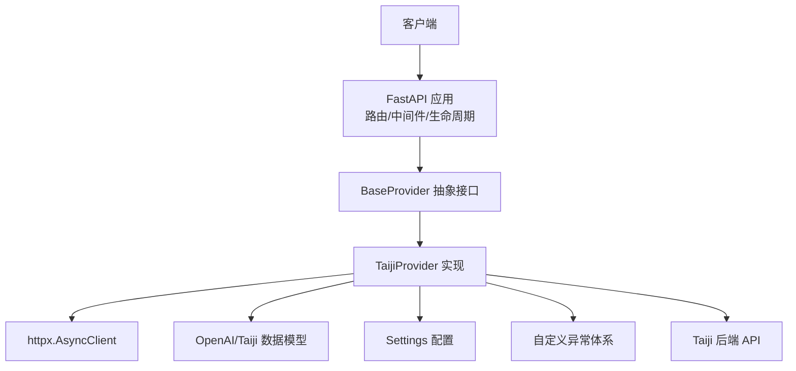
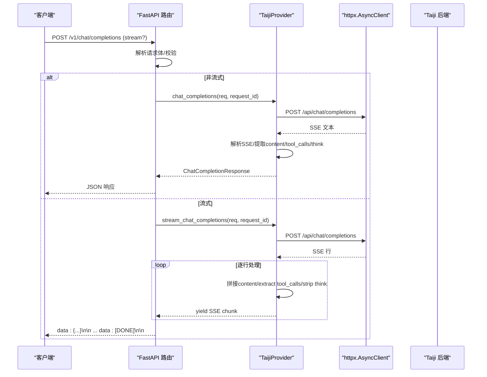
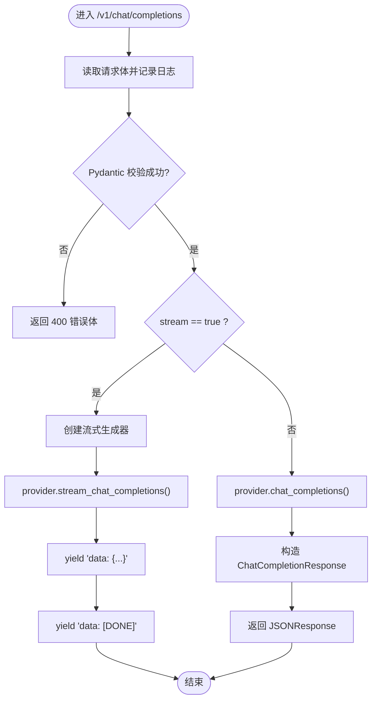
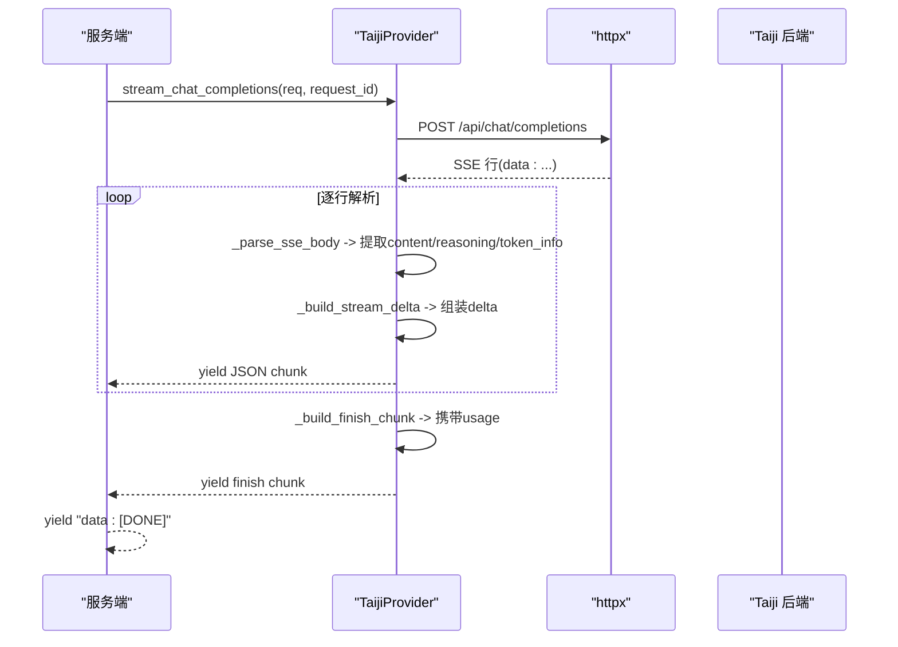
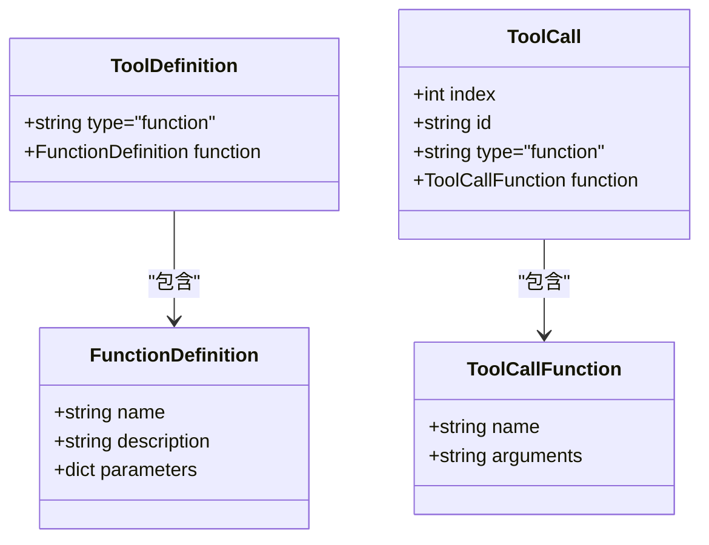
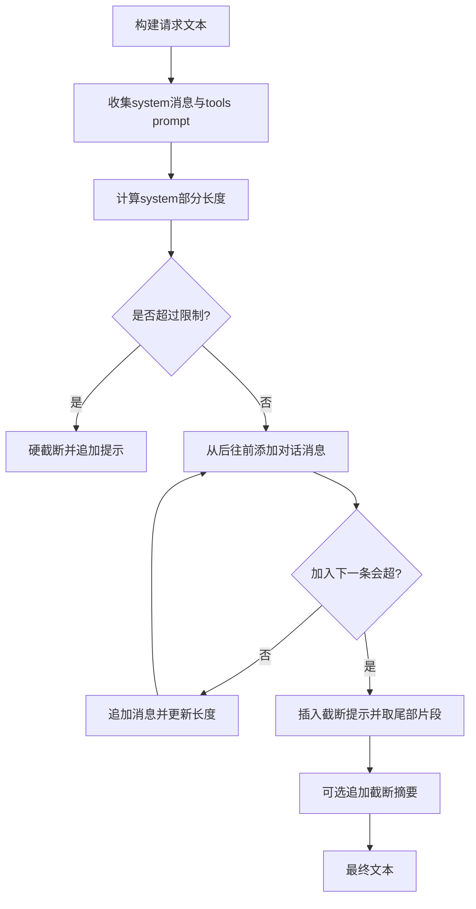
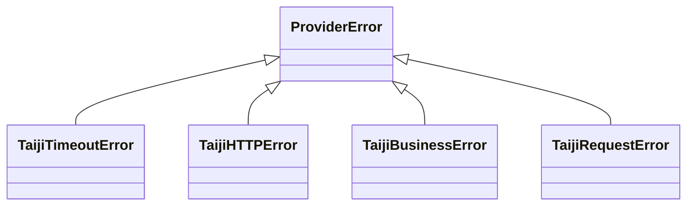
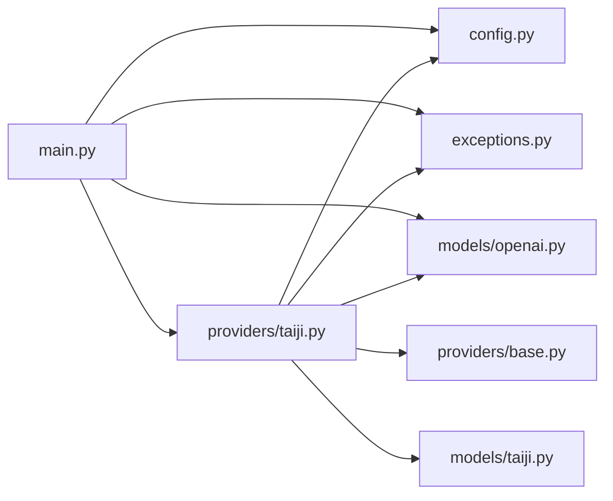

# 核心功能详解

<cite>
**本文引用的文件列表**
- [main.py](file://src/openai_provider/main.py)
- [config.py](file://src/openai_provider/config.py)
- [exceptions.py](file://src/openai_provider/exceptions.py)
- [base.py](file://src/openai_provider/providers/base.py)
- [taiji.py](file://src/openai_provider/providers/taiji.py)
- [openai.py](file://src/openai_provider/models/openai.py)
- [taiji_models.py](file://src/openai_provider/models/taiji.py)
- [test_03_chat_streaming.py](file://tests/e2e/test_03_chat_streaming.py)
- [test_04_tool_calls.py](file://tests/e2e/test_04_tool_calls.py)
- [test_05_error_handling.py](file://tests/e2e/test_05_error_handling.py)
- [conftest.py](file://tests/e2e/conftest.py)
</cite>

## 目录
1. [简介](#简介)
2. [项目结构](#项目结构)
3. [核心组件](#核心组件)
4. [架构总览](#架构总览)
5. [详细组件分析](#详细组件分析)
6. [依赖关系分析](#依赖关系分析)
7. [性能考量](#性能考量)
8. [故障排查指南](#故障排查指南)
9. [结论](#结论)
10. [附录](#附录)

## 简介
本项目是一个 OpenAI 兼容的网关服务，将标准 OpenAI Chat Completions 请求转发到 Taiji LLM 后端，并返回与 OpenAI 一致的响应格式。它实现了：
- Chat Completions 处理流程（非流式与流式）
- 流式响应机制（SSE）
- 工具调用系统（tool_calls）
- 会话管理（基于 sessionId 和 cookie）
- 结构化异常与错误映射
- 配置与环境变量管理

文档面向初学者与有经验的开发者，既提供高层概览，也深入到代码级实现细节、调用关系、接口定义与使用模式，并给出性能优化建议与常见问题解决方案。

## 项目结构
仓库采用分层组织方式：
- API 层：FastAPI 路由与中间件（认证、CORS、日志）
- Provider 抽象层：统一接口 BaseProvider
- Provider 实现：TaijiProvider（OpenAI → Taiji SSE 转译、tool_calls 解析、think 标签剥离、token 统计）
- 数据模型：OpenAI 兼容模型与 Taiji 请求体模型
- 配置：环境变量驱动的 Settings
- 异常体系：ProviderError 及其子类
- 测试：E2E 用例覆盖流式、工具调用、错误处理等



图表来源
- [main.py:134-257](file://src/openai_provider/main.py#L134-L257)
- [base.py:7-46](file://src/openai_provider/providers/base.py#L7-L46)
- [taiji.py:46-120](file://src/openai_provider/providers/taiji.py#L46-L120)
- [openai.py:83-177](file://src/openai_provider/models/openai.py#L83-L177)
- [taiji_models.py:8-21](file://src/openai_provider/models/taiji.py#L8-L21)
- [config.py:12-56](file://src/openai_provider/config.py#L12-L56)
- [exceptions.py:8-40](file://src/openai_provider/exceptions.py#L8-L40)

章节来源
- [main.py:1-342](file://src/openai_provider/main.py#L1-L342)
- [pyproject.toml:1-55](file://pyproject.toml#L1-L55)

## 核心组件
- FastAPI 应用与路由
  - /v1/chat/completions：支持 stream=true/false；非流式返回 JSON，流式返回 text/event-stream
  - /v1/models、/v1/models/{model_id}、/api/v1/models、/api/tags、/v1/props、/props、/version：兼容 OpenAI/Ollama 探测端点
  - /health：健康检查
- Provider 抽象与实现
  - BaseProvider：定义 chat_completions 与 stream_chat_completions 两个异步方法
  - TaijiProvider：实现请求构建、SSE 解析、tool_calls 提取、reasoning_content 分离、token 计数
- 数据模型
  - OpenAI 兼容模型：ChatCompletionRequest/Response、Delta、ToolCall 等
  - Taiji 请求体：TaijiRequest（text、sessionId、files 等）
- 配置
  - Settings：从环境变量加载 TAIJI_BASE_URL、TAIJI_API_KEY、会话参数、模型能力、CORS 等
- 异常体系
  - ProviderError 基类及超时、HTTP、业务、网络层错误子类
- 日志
  - JSON 结构化日志，按请求 ID 关联，记录原始请求与响应摘要

章节来源
- [main.py:128-317](file://src/openai_provider/main.py#L128-L317)
- [base.py:7-46](file://src/openai_provider/providers/base.py#L7-L46)
- [taiji.py:46-120](file://src/openai_provider/providers/taiji.py#L46-L120)
- [openai.py:83-177](file://src/openai_provider/models/openai.py#L83-L177)
- [taiji_models.py:8-21](file://src/openai_provider/models/taiji.py#L8-L21)
- [config.py:12-56](file://src/openai_provider/config.py#L12-L56)
- [exceptions.py:8-40](file://src/openai_provider/exceptions.py#L8-L40)

## 架构总览
整体调用链如下：
- 客户端通过 OpenAI SDK 或 curl 调用 /v1/chat/completions
- FastAPI 路由接收请求，校验并解析为 ChatCompletionRequest
- 根据 stream 标志选择非流式或流式路径
- 调用 TaijiProvider 执行实际请求与响应转译
- 返回 OpenAI 兼容的 JSON 或 SSE 流



图表来源
- [main.py:134-257](file://src/openai_provider/main.py#L134-L257)
- [taiji.py:670-781](file://src/openai_provider/providers/taiji.py#L670-L781)
- [taiji.py:782-800](file://src/openai_provider/providers/taiji.py#L782-L800)

## 详细组件分析

### Chat Completions 处理流程
- 入口路由 /v1/chat/completions
  - 读取原始请求体并记录 raw_request 日志
  - 使用 Pydantic 验证为 ChatCompletionRequest
  - 若 stream=true，进入流式分支；否则走非流式分支
- 非流式分支
  - 调用 provider.chat_completions
  - 捕获 ProviderError 并转换为 OpenAI 风格错误体
  - 返回 JSONResponse
- 流式分支
  - 生成器逐块 yield f"data: {chunk}\n\n"
  - 结束时发送 data: [DONE]
  - 设置 SSE 响应头（no-cache、keep-alive）



图表来源
- [main.py:134-257](file://src/openai_provider/main.py#L134-L257)

章节来源
- [main.py:134-257](file://src/openai_provider/main.py#L134-L257)

### 流式响应机制（SSE）
- 服务端行为
  - 响应 Content-Type: text/event-stream
  - 每个 chunk 以 "data: <JSON>\n\n" 形式发送
  - 最后一个正常 chunk 携带 finish_reason，随后发送 "data: [DONE]"
- 客户端期望
  - 第一个 chunk 包含 role=assistant
  - 所有 chunk 共享同一 id 与 model
  - 拼接 content delta 得到完整回复
- 实现要点
  - 在 TaijiProvider 中解析 taiji SSE body，提取 string/object 类型
  - 拼接内容并剥离 think 标签，保留 reasoning_content
  - 构建 OpenAI 风格的 ChatCompletionStreamResponse 并序列化



图表来源
- [taiji.py:633-668](file://src/openai_provider/providers/taiji.py#L633-L668)
- [taiji.py:602-631](file://src/openai_provider/providers/taiji.py#L602-L631)
- [main.py:185-218](file://src/openai_provider/main.py#L185-L218)

章节来源
- [taiji.py:633-668](file://src/openai_provider/providers/taiji.py#L633-L668)
- [taiji.py:602-631](file://src/openai_provider/providers/taiji.py#L602-L631)
- [test_03_chat_streaming.py:1-146](file://tests/e2e/test_03_chat_streaming.py#L1-L146)

### 工具调用系统（tool_calls）
- 工具定义注入
  - 将 OpenAI tools 定义转换为 taiji 可理解的指令（XML/DSML 格式），并通过 system prompt 注入
  - 支持 tool_choice 控制：auto/required/none
- 输出解析
  - 优先尝试 XML/DSML 格式解析，回退到 JSON 格式
  - 支持多 invoke 标签与多种参数格式
  - 清理 content 中的 tool_calls 块，避免重复
- 多轮往返
  - assistant 消息携带 tool_calls，后续 user/tool 消息传入结果，模型基于结果生成自然语言回复



图表来源
- [openai.py:31-67](file://src/openai_provider/models/openai.py#L31-L67)
- [taiji.py:122-204](file://src/openai_provider/providers/taiji.py#L122-L204)
- [taiji.py:350-482](file://src/openai_provider/providers/taiji.py#L350-L482)

章节来源
- [taiji.py:122-204](file://src/openai_provider/providers/taiji.py#L122-L204)
- [taiji.py:350-482](file://src/openai_provider/providers/taiji.py#L350-L482)
- [test_04_tool_calls.py:1-226](file://tests/e2e/test_04_tool_calls.py#L1-L226)

### 会话管理
- 会话标识与会话 Cookie
  - 通过 TAIJI_SESSION_ID 与 TAIJI_SESSION_COOKIE 维护会话上下文
  - 请求时附加 cookies，确保后端识别同一会话
- 上下文长度与截断策略
  - 智能截断：始终包含 system 与 tools prompt，从后往前添加最近对话，必要时截断旧消息并提示
  - 最大文本长度由 TAIJI_MAX_TEXT_LENGTH 控制



图表来源
- [taiji.py:206-318](file://src/openai_provider/providers/taiji.py#L206-L318)

章节来源
- [config.py:24-34](file://src/openai_provider/config.py#L24-L34)
- [taiji.py:206-318](file://src/openai_provider/providers/taiji.py#L206-L318)

### 数据模型与接口定义
- OpenAI 兼容模型
  - ChatCompletionRequest：包含 model、messages、temperature、max_tokens、top_p、n、stream、stop、penalties、user、tools、tool_choice
  - ChatCompletionResponse：包含 id、object、created、model、choices、usage、system_fingerprint
  - 流式模型：ChatCompletionStreamResponse、ChatCompletionStreamChoice、ChatCompletionDelta
- Taiji 请求体
  - TaijiRequest：text、sessionId、files、thinking、webSearch，允许透传额外字段

```mermaid
erDiagram
CHAT_COMPLETION_REQUEST {
string model
array messages
float temperature
int max_tokens
float top_p
int n
boolean stream
string stop
float presence_penalty
float frequency_penalty
string user
array tools
object tool_choice
}
CHAT_COMPLETION_RESPONSE {
string id
string object="chat.completion"
int created
string model
array choices
Usage usage
string system_fingerprint
}
USAGE {
int prompt_tokens
int completion_tokens
int total_tokens
}
CHAT_COMPLETION_REQUEST ||--o{ CHAT_MESSAGE : "包含"
CHAT_COMPLETION_RESPONSE ||--o{ CHAT_COMPLETION_CHOICE : "包含"
CHAT_COMPLETION_CHOICE ||--|| CHAT_COMPLETION_MESSAGE : "包含"
CHAT_COMPLETION_RESPONSE ||--|| USAGE : "包含"
```

图表来源
- [openai.py:83-177](file://src/openai_provider/models/openai.py#L83-L177)
- [taiji_models.py:8-21](file://src/openai_provider/models/taiji.py#L8-L21)

章节来源
- [openai.py:83-177](file://src/openai_provider/models/openai.py#L83-L177)
- [taiji_models.py:8-21](file://src/openai_provider/models/taiji.py#L8-L21)

### 异常体系与错误映射
- 自定义异常
  - ProviderError：基类
  - TaijiTimeoutError：超时
  - TaijiHTTPError：非 200 状态码
  - TaijiBusinessError：HTTP 200 包装的业务错误（err/msg/code）
  - TaijiRequestError：网络层错误
- 错误映射
  - 非流式：捕获 ProviderError，返回 502 与 OpenAI 风格错误体
  - 全局异常处理器：将 HTTPException 转为 OpenAI 风格错误体



图表来源
- [exceptions.py:8-40](file://src/openai_provider/exceptions.py#L8-L40)
- [main.py:319-330](file://src/openai_provider/main.py#L319-L330)

章节来源
- [exceptions.py:8-40](file://src/openai_provider/exceptions.py#L8-L40)
- [main.py:220-241](file://src/openai_provider/main.py#L220-L241)
- [main.py:319-330](file://src/openai_provider/main.py#L319-L330)

## 依赖关系分析
- 模块耦合
  - main.py 依赖 config、exceptions、models.openai、providers.TaijiProvider
  - providers.base 定义抽象接口，providers.taiji 实现具体逻辑
  - models.openai 与 models.taiji 分别描述 OpenAI 兼容结构与后端请求体
- 外部依赖
  - FastAPI、uvicorn、httpx、pydantic、pydantic-settings
- 潜在循环依赖
  - 当前结构清晰，未见循环导入



图表来源
- [main.py:1-30](file://src/openai_provider/main.py#L1-L30)
- [taiji.py:1-45](file://src/openai_provider/providers/taiji.py#L1-L45)
- [base.py:1-10](file://src/openai_provider/providers/base.py#L1-L10)

章节来源
- [main.py:1-30](file://src/openai_provider/main.py#L1-L30)
- [taiji.py:1-45](file://src/openai_provider/providers/taiji.py#L1-L45)

## 性能考量
- Token 计数
  - 优先使用 tiktoken（cl100k_base）估算 token；不可用时回退字符估计
  - 对 messages 进行增量计数，考虑 role、content、name、tool_call_id、tool_calls
- 上下文截断
  - 智能截断策略保证 system 与 tools prompt 优先保留，最近对话尽量完整
  - 超长情况硬截断并追加提示，避免超出后端限制
- 流式处理
  - 逐行解析 SSE，减少内存占用
  - 仅在最后 chunk 携带 finish_reason 与 usage，降低传输开销
- 连接与超时
  - httpx.AsyncClient 超时时间合理设置，避免长时间阻塞
  - 资源释放：在非流式路径中显式关闭 client

章节来源
- [taiji.py:65-95](file://src/openai_provider/providers/taiji.py#L65-L95)
- [taiji.py:206-318](file://src/openai_provider/providers/taiji.py#L206-L318)
- [taiji.py:670-781](file://src/openai_provider/providers/taiji.py#L670-L781)

## 故障排查指南
- 常见错误与定位
  - 请求体无效：返回 400，检查 JSON 结构与必填字段
  - 非法 role：返回 400/422，确认 role 为 system/user/assistant/tool
  - 空 messages：可能返回 400/422 或 502，取决于后端实现
  - 超长 prompt：可能被接受或返回 400/413，关注截断策略
  - 流式响应缺失 [DONE]：检查 SSE 解析与生成器逻辑
  - 工具调用未触发：确认 tools 定义与 tool_choice 参数
- 认证问题
  - 未配置 API_KEY：跳过认证
  - 错误的 Bearer Token：返回 401
- 并发与稳定性
  - 并发健康检查应全部成功
  - 并发聊天请求应返回不同 id
- 调试建议
  - 启用 JSON 结构化日志，查看 raw_request/raw_response/provider_request/provider_response
  - 使用 E2E 测试夹具 parse_sse_chunks 解析 SSE 响应

章节来源
- [test_05_error_handling.py:1-155](file://tests/e2e/test_05_error_handling.py#L1-L155)
- [conftest.py:108-123](file://tests/e2e/conftest.py#L108-L123)
- [main.py:319-330](file://src/openai_provider/main.py#L319-L330)

## 结论
本网关通过清晰的 Provider 抽象与实现，将 OpenAI 兼容接口与 Taiji 后端解耦，提供了健壮的 Chat Completions 处理能力，包括流式响应、工具调用与会话管理。其模块化设计便于扩展新的后端，完善的异常体系与日志机制提升了可观测性与可维护性。结合智能截断与 token 估算，系统在性能与兼容性方面达到良好平衡。

## 附录
- 使用模式示例（仅路径引用）
  - 非流式调用：参考 [test_04_tool_calls.py:50-102](file://tests/e2e/test_04_tool_calls.py#L50-L102)
  - 流式调用：参考 [test_03_chat_streaming.py:11-70](file://tests/e2e/test_03_chat_streaming.py#L11-L70)
  - 工具调用多轮往返：参考 [test_04_tool_calls.py:189-226](file://tests/e2e/test_04_tool_calls.py#L189-L226)
  - 错误处理边界场景：参考 [test_05_error_handling.py:9-55](file://tests/e2e/test_05_error_handling.py#L9-L55)