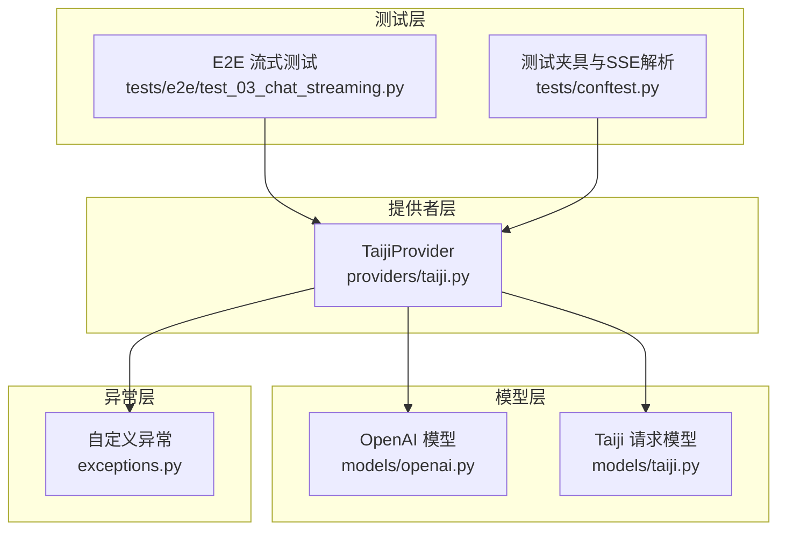
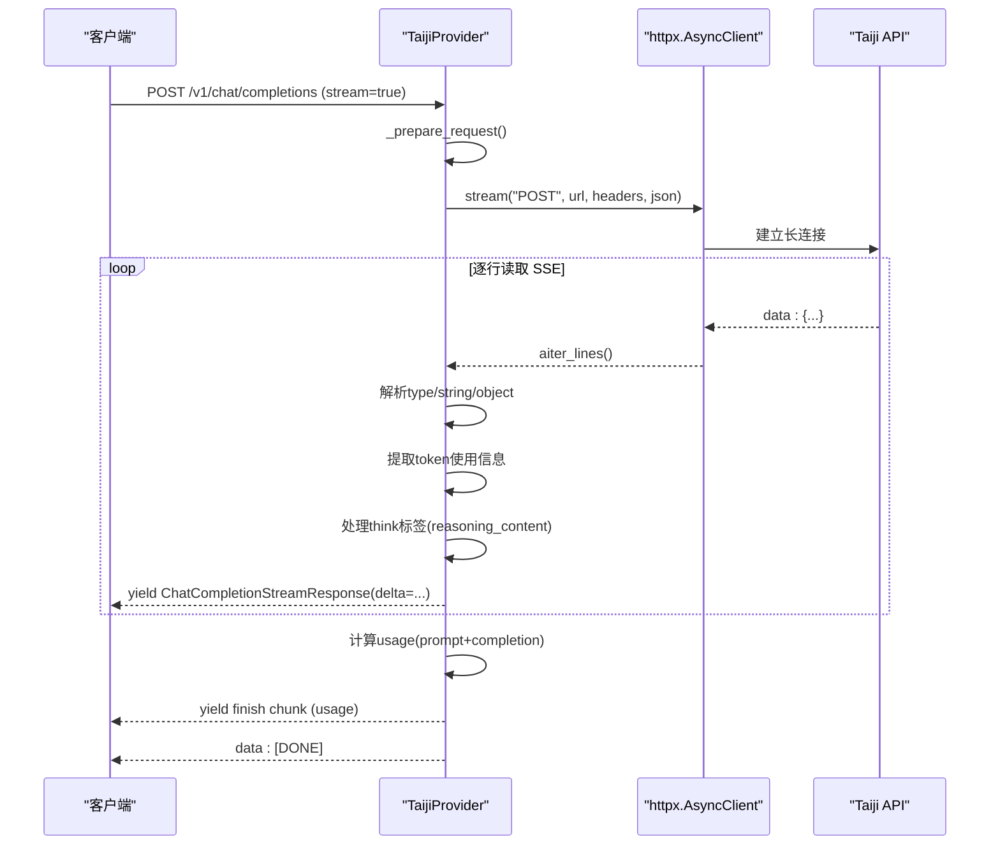
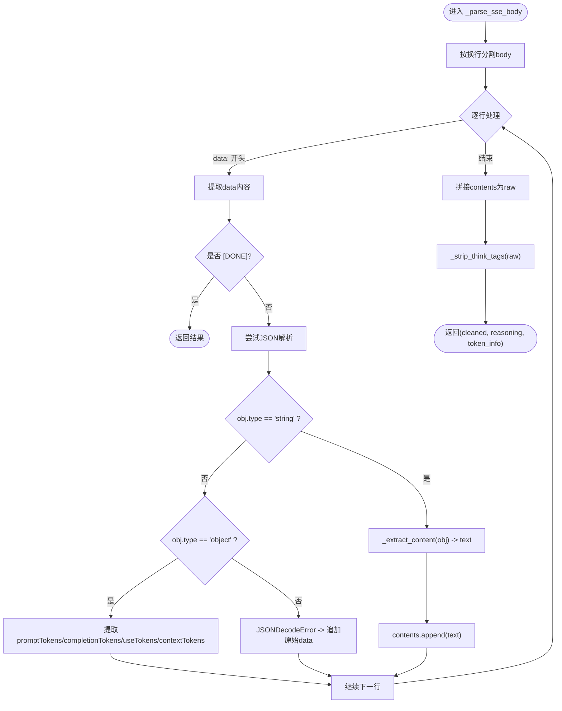
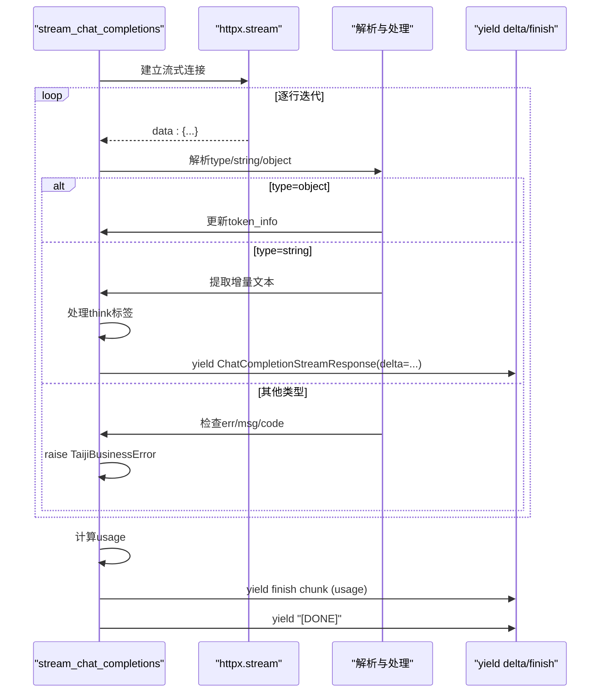
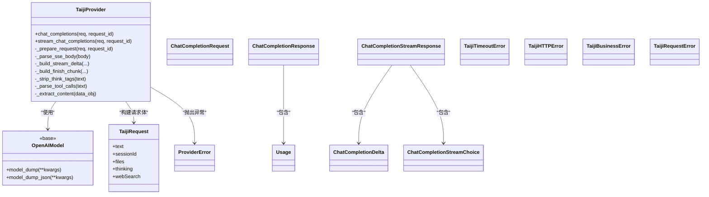

# 流式响应机制

<cite>
**本文引用的文件**   
- [src/openai_provider/providers/taiji.py](file://src/openai_provider/providers/taiji.py)
- [src/openai_provider/models/openai.py](file://src/openai_provider/models/openai.py)
- [src/openai_provider/models/taiji.py](file://src/openai_provider/models/taiji.py)
- [src/openai_provider/exceptions.py](file://src/openai_provider/exceptions.py)
- [tests/e2e/test_03_chat_streaming.py](file://tests/e2e/test_03_chat_streaming.py)
- [tests/conftest.py](file://tests/conftest.py)
</cite>

## 目录
1. [简介](#简介)
2. [项目结构](#项目结构)
3. [核心组件](#核心组件)
4. [架构总览](#架构总览)
5. [详细组件分析](#详细组件分析)
6. [依赖关系分析](#依赖关系分析)
7. [性能考量](#性能考量)
8. [故障排查指南](#故障排查指南)
9. [结论](#结论)
10. [附录](#附录)

## 简介
本技术文档聚焦于流式响应机制，围绕 SSE（Server-Sent Events）在 Taiji Provider 中的实现进行深入解析。内容涵盖：
- 流式请求建立与增量数据接收
- SSE 响应解析与内容拼接
- _parse_sse_body 方法对不同类型数据块的处理、token 使用信息提取以及 think 标签处理逻辑
- 异步流式传输的实现方式
- 错误与超时处理策略
- 与 OpenAI SDK 的兼容性设计
- 性能优化策略与调试技巧

## 项目结构
本项目采用“提供者 + 模型”分层组织：
- providers/taiji.py：实现 TaijiProvider，负责将 OpenAI Chat Completions 请求转发到 Taiji 后端，并处理 SSE 流式响应转译
- models/openai.py：定义 OpenAI 兼容的请求/响应模型（含流式与非流式）
- models/taiji.py：定义 Taiji API 请求体模型
- exceptions.py：自定义异常体系，区分超时、HTTP 错误、业务错误等
- tests/e2e/test_03_chat_streaming.py：E2E 测试验证 SSE 格式、chunk 结构、finish_reason 时机、[DONE] 标记等
- tests/conftest.py：共享 fixtures 和 SSE 解析辅助函数

图表来源
- [src/openai_provider/providers/taiji.py:46-120](file://src/openai_provider/providers/taiji.py#L46-L120)
- [src/openai_provider/models/openai.py:83-177](file://src/openai_provider/models/openai.py#L83-L177)
- [src/openai_provider/models/taiji.py:8-31](file://src/openai_provider/models/taiji.py#L8-L31)
- [src/openai_provider/exceptions.py:8-40](file://src/openai_provider/exceptions.py#L8-L40)
- [tests/e2e/test_03_chat_streaming.py:11-62](file://tests/e2e/test_03_chat_streaming.py#L11-L62)
- [tests/conftest.py:45-91](file://tests/conftest.py#L45-L91)

章节来源
- [src/openai_provider/providers/taiji.py:46-120](file://src/openai_provider/providers/taiji.py#L46-L120)
- [src/openai_provider/models/openai.py:83-177](file://src/openai_provider/models/openai.py#L83-L177)
- [src/openai_provider/models/taiji.py:8-31](file://src/openai_provider/models/taiji.py#L8-L31)
- [src/openai_provider/exceptions.py:8-40](file://src/openai_provider/exceptions.py#L8-L40)
- [tests/e2e/test_03_chat_streaming.py:11-62](file://tests/e2e/test_03_chat_streaming.py#L11-L62)
- [tests/conftest.py:45-91](file://tests/conftest.py#L45-L91)

## 核心组件
- TaijiProvider：封装了非流式 chat_completions 与流式 stream_chat_completions 两种模式；负责构建请求、调用 Taiji API、解析 SSE 响应、提取 token 使用信息、分离 think 标签、检测 tool_calls，并以 OpenAI SSE 格式输出
- OpenAI 模型：定义 ChatCompletionRequest、ChatCompletionResponse、ChatCompletionStreamResponse 等，确保与 OpenAI SDK 兼容
- Taiji 请求模型：定义 TaijiRequest，支持透传 temperature、max_tokens 等可选参数
- 自定义异常：ProviderError 及其子类用于区分超时、HTTP 错误、业务错误和网络错误

章节来源
- [src/openai_provider/providers/taiji.py:46-120](file://src/openai_provider/providers/taiji.py#L46-L120)
- [src/openai_provider/models/openai.py:83-177](file://src/openai_provider/models/openai.py#L83-L177)
- [src/openai_provider/models/taiji.py:8-31](file://src/openai_provider/models/taiji.py#L8-L31)
- [src/openai_provider/exceptions.py:8-40](file://src/openai_provider/exceptions.py#L8-L40)

## 架构总览
整体流程如下：
- 客户端通过 /v1/chat/completions 发起请求，若 stream=true，则进入流式路径
- TaijiProvider._prepare_request 构建请求体与 HTTP 头，设置 accept=text/event-stream
- 流式模式下使用 httpx.AsyncClient.stream 进行增量读取
- 逐行解析 SSE data 行，根据 type 字段分流处理：
  - string：增量文本内容
  - object：提取 token 使用信息（promptTokens、completionTokens、useTokens、contextTokens）
  - 其他：检查业务错误字段（err/msg/code）
- 实时处理 think 标签，将 reasoning_content 作为独立 delta 发送
- 当存在 tools 时，缓冲内容并在流结束后统一判断是否为 tool_call
- 最后发送 finish chunk（包含 usage），并以 data: [DONE] 结束

图表来源
- [src/openai_provider/providers/taiji.py:782-996](file://src/openai_provider/providers/taiji.py#L782-L996)
- [src/openai_provider/providers/taiji.py:633-668](file://src/openai_provider/providers/taiji.py#L633-L668)
- [src/openai_provider/models/openai.py:149-177](file://src/openai_provider/models/openai.py#L149-L177)

## 详细组件分析

### SSE 响应解析与内容拼接：_parse_sse_body
该方法是核心解析器，用于从完整 SSE 文本中提取并拼接所有 data 行内容，返回 cleaned_text、reasoning_content 与 token_info。

处理要点：
- 按行遍历 body，跳过非 data: 前缀的行
- 遇到 data: [DONE] 提前终止
- 尝试 JSON 解析：
  - type="string"：通过 _extract_content 提取实际文本并追加到 contents
  - type="object"：从 data 字段中抽取 promptTokens、completionTokens、useTokens、contextTokens 等信息
  - JSON 解析失败：将原始 data 字符串追加到 contents（容错）
- 拼接后去除 think 标签，返回清理后的内容与推理内容
- 返回 token_info 供后续 Usage 计算

图表来源
- [src/openai_provider/providers/taiji.py:633-668](file://src/openai_provider/providers/taiji.py#L633-L668)
- [src/openai_provider/providers/taiji.py:501-518](file://src/openai_provider/providers/taiji.py#L501-L518)

章节来源
- [src/openai_provider/providers/taiji.py:633-668](file://src/openai_provider/providers/taiji.py#L633-L668)
- [src/openai_provider/providers/taiji.py:501-518](file://src/openai_provider/providers/taiji.py#L501-L518)

### 流式生成器：stream_chat_completions
该方法实现了真正的增量流式传输：
- 使用 httpx.AsyncClient.stream 建立长连接
- 逐行读取 SSE，跳过非 data: 行
- 解析 JSON，根据 type 分流：
  - object：仅收集 token 使用信息，不产生 delta
  - string：提取增量文本
  - 其他：检查 err/msg/code 字段，抛出业务错误
- 实时处理 think 标签：
  - 检测到 <think> 开始但未结束时，将增量作为 reasoning_content 发送
  - 在同一 chunk 内或跨 chunk 闭合时，正确拆分 reasoning 与 content
- 当 has_tools 为真时，先缓冲内容，流结束后再统一判断是否为 tool_call
- 最终发送 finish chunk（包含 usage），并以 data: [DONE] 结束

图表来源
- [src/openai_provider/providers/taiji.py:782-996](file://src/openai_provider/providers/taiji.py#L782-L996)

章节来源
- [src/openai_provider/providers/taiji.py:782-996](file://src/openai_provider/providers/taiji.py#L782-L996)

### think 标签处理逻辑
- 使用正则表达式匹配 <think>...</think> 标签
- 流式模式下实时检测标签边界：
  - 未闭合：将增量作为 reasoning_content 发送
  - 同一 chunk 内闭合：拆分 reasoning 与 content
  - 跨 chunk 闭合：维护 think_buffer，累计推理内容，并在闭合时发送剩余部分
- 非工具模式下，reasoning_content 会作为独立 delta 发送；工具模式下，仅在流结束后统一处理

章节来源
- [src/openai_provider/providers/taiji.py:511-518](file://src/openai_provider/providers/taiji.py#L511-L518)
- [src/openai_provider/providers/taiji.py:852-909](file://src/openai_provider/providers/taiji.py#L852-L909)

### token 使用信息提取
- 从 type="object" 的 data.data 字段中提取：
  - promptTokens -> prompt_tokens
  - completionTokens -> completion_tokens
  - useTokens -> total_tokens
  - contextTokens -> context_tokens
- 若缺失 completion_tokens，则基于已输出的 content 与 reasoning_content 估算
- total_tokens 始终等于 prompt_tokens + completion_tokens，符合 OpenAI 规范

章节来源
- [src/openai_provider/providers/taiji.py:652-664](file://src/openai_provider/providers/taiji.py#L652-L664)
- [src/openai_provider/providers/taiji.py:832-840](file://src/openai_provider/providers/taiji.py#L832-L840)
- [src/openai_provider/providers/taiji.py:934-948](file://src/openai_provider/providers/taiji.py#L934-L948)

### 与 OpenAI SDK 的兼容性
- 响应对象严格遵循 OpenAI 模型定义：
  - 非流式：ChatCompletionResponse
  - 流式：ChatCompletionStreamResponse（object="chat.completion.chunk"）
- 首个 delta 携带 role="assistant"
- 最后一个有效 chunk 携带 finish_reason（stop 或 tool_calls）
- 以 data: [DONE] 结束流
- Content-Type 设置为 text/event-stream，并附带 no-cache 与 keep-alive 头（由上层路由设置，测试验证）

章节来源
- [src/openai_provider/models/openai.py:149-177](file://src/openai_provider/models/openai.py#L149-L177)
- [tests/e2e/test_03_chat_streaming.py:13-28](file://tests/e2e/test_03_chat_streaming.py#L13-L28)
- [tests/e2e/test_03_chat_streaming.py:30-43](file://tests/e2e/test_03_chat_streaming.py#L30-L43)

## 依赖关系分析
- TaijiProvider 依赖：
  - httpx.AsyncClient：用于发起 HTTP 请求与流式读取
  - OpenAI 模型：用于构造标准响应对象
  - TaijiRequest：用于构建后端请求体
  - 自定义异常：用于结构化错误传播
- 测试依赖：
  - pytest fixtures：提供 SSE mock 与解析辅助函数
  - E2E 测试：验证 SSE 格式、chunk 结构、finish_reason 时机、[DONE] 标记等

图表来源
- [src/openai_provider/providers/taiji.py:46-120](file://src/openai_provider/providers/taiji.py#L46-L120)
- [src/openai_provider/models/openai.py:12-25](file://src/openai_provider/models/openai.py#L12-L25)
- [src/openai_provider/models/openai.py:83-177](file://src/openai_provider/models/openai.py#L83-L177)
- [src/openai_provider/models/taiji.py:8-31](file://src/openai_provider/models/taiji.py#L8-L31)
- [src/openai_provider/exceptions.py:8-40](file://src/openai_provider/exceptions.py#L8-L40)

章节来源
- [src/openai_provider/providers/taiji.py:46-120](file://src/openai_provider/providers/taiji.py#L46-L120)
- [src/openai_provider/models/openai.py:83-177](file://src/openai_provider/models/openai.py#L83-L177)
- [src/openai_provider/models/taiji.py:8-31](file://src/openai_provider/models/taiji.py#L8-L31)
- [src/openai_provider/exceptions.py:8-40](file://src/openai_provider/exceptions.py#L8-L40)

## 性能考量
- 增量处理：使用 async for line in response.aiter_lines() 逐行读取，避免一次性加载整个响应体，降低内存占用
- 缓冲策略：当 has_tools 为真时，先缓冲内容，流结束后统一判断是否为 tool_call，减少中间解析开销
- Token 估算回退：若缺少 completion_tokens，基于已输出内容进行估算，保证 Usage 完整性
- 日志采样：记录 latency_ms、total_content_length、total_reasoning_length 等关键指标，便于性能监控
- 资源释放：finally 块中确保 client.aclose() 被调用，防止连接泄漏

章节来源
- [src/openai_provider/providers/taiji.py:800-996](file://src/openai_provider/providers/taiji.py#L800-L996)

## 故障排查指南
- 超时错误：捕获 httpx.TimeoutException 并转换为 TaijiTimeoutError
- HTTP 错误：捕获 httpx.HTTPError 并转换为 TaijiRequestError；非 200 状态码转换为 TaijiHTTPError
- 业务错误：检测 err/msg/code 字段，转换为 TaijiBusinessError
- 网络层错误：DNS 解析失败、连接拒绝等，统一包装为 TaijiRequestError
- 调试技巧：
  - 启用 provider_request 与 provider_response 日志，查看请求头、响应体、延迟等
  - 使用 parse_sse_chunks 辅助函数解析 SSE 响应，验证 chunk 结构与 finish_reason 时机
  - 针对 think 标签问题，检查 _strip_think_tags 的正则匹配与流式缓冲区逻辑

章节来源
- [src/openai_provider/exceptions.py:8-40](file://src/openai_provider/exceptions.py#L8-L40)
- [src/openai_provider/providers/taiji.py:921-926](file://src/openai_provider/providers/taiji.py#L921-L926)
- [tests/conftest.py:80-91](file://tests/conftest.py#L80-L91)

## 结论
本实现通过 TaijiProvider 将 Taiji 后端的 SSE 流式响应无缝转译为 OpenAI 兼容格式，支持增量文本、推理内容、工具调用与 token 使用统计。其设计兼顾了性能、健壮性与可观测性，并通过完善的异常体系与测试用例保障稳定性。对于需要与 OpenAI SDK 集成的场景，该实现提供了即插即用的流式能力。

## 附录
- 代码示例路径（不包含具体代码内容）：
  - 流式请求建立与增量接收：[src/openai_provider/providers/taiji.py:782-996](file://src/openai_provider/providers/taiji.py#L782-L996)
  - SSE 响应解析与内容拼接：[src/openai_provider/providers/taiji.py:633-668](file://src/openai_provider/providers/taiji.py#L633-L668)
  - think 标签处理逻辑：[src/openai_provider/providers/taiji.py:511-518](file://src/openai_provider/providers/taiji.py#L511-L518), [src/openai_provider/providers/taiji.py:852-909](file://src/openai_provider/providers/taiji.py#L852-L909)
  - token 使用信息提取：[src/openai_provider/providers/taiji.py:652-664](file://src/openai_provider/providers/taiji.py#L652-L664), [src/openai_provider/providers/taiji.py:832-840](file://src/openai_provider/providers/taiji.py#L832-L840)
  - 错误与超时处理：[src/openai_provider/exceptions.py:8-40](file://src/openai_provider/exceptions.py#L8-L40), [src/openai_provider/providers/taiji.py:921-926](file://src/openai_provider/providers/taiji.py#L921-L926)
  - OpenAI 兼容性验证：[tests/e2e/test_03_chat_streaming.py:13-62](file://tests/e2e/test_03_chat_streaming.py#L13-L62)