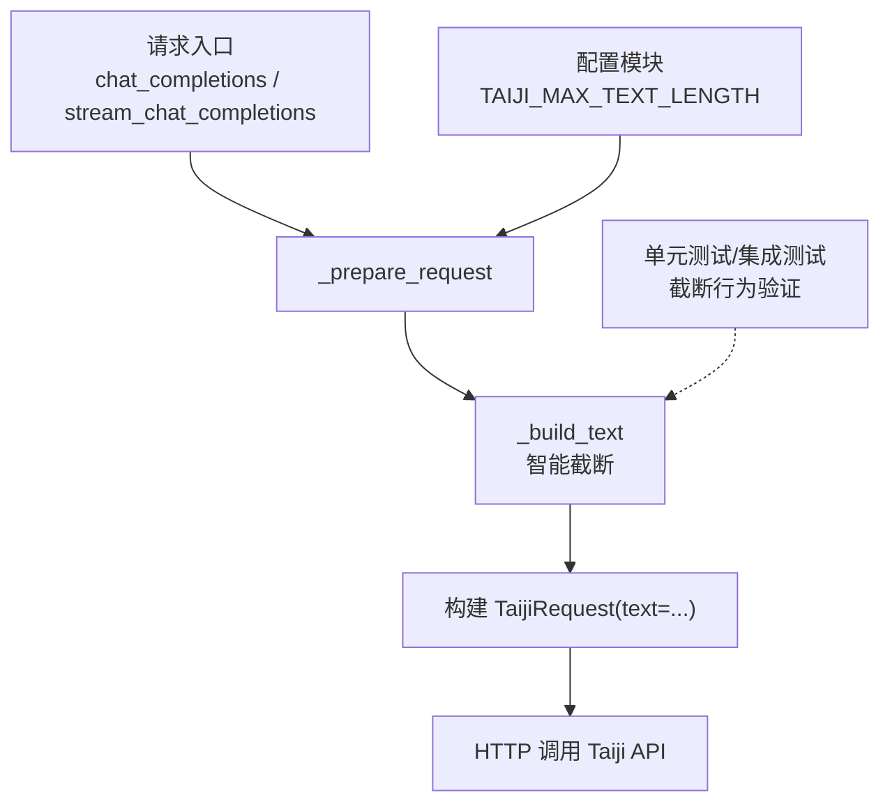
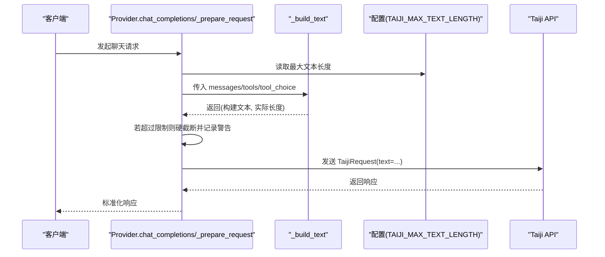
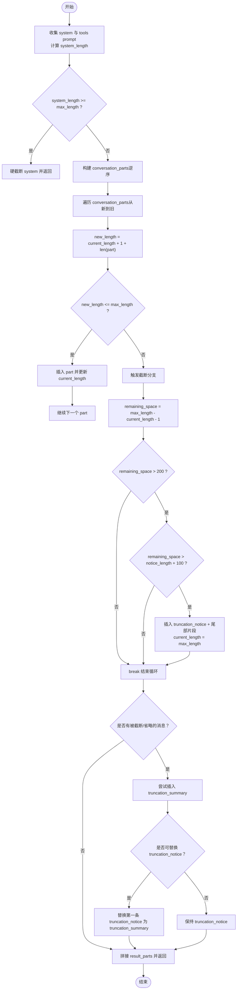
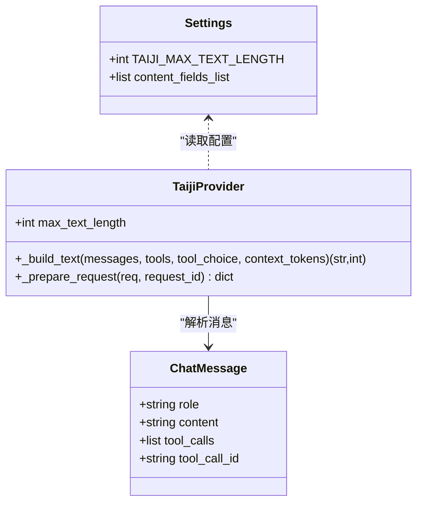

# 文本截断策略

<cite>
**本文引用的文件**   
- [src/openai_provider/providers/taiji.py](file://src/openai_provider/providers/taiji.py)
- [src/openai_provider/config.py](file://src/openai_provider/config.py)
- [tests/test_regression.py](file://tests/test_regression.py)
- [tests/test_chat.py](file://tests/test_chat.py)
- [tests/test_integration.py](file://tests/test_integration.py)
</cite>

## 目录
1. [简介](#简介)
2. [项目结构](#项目结构)
3. [核心组件](#核心组件)
4. [架构总览](#架构总览)
5. [详细组件分析](#详细组件分析)
6. [依赖关系分析](#依赖关系分析)
7. [性能考量](#性能考量)
8. [故障排查指南](#故障排查指南)
9. [结论](#结论)
10. [附录：配置与调优建议](#附录配置与调优建议)

## 简介
本技术文档聚焦于智能文本截断策略，深入解析 _build_text 方法中的截断算法实现。该策略确保在不超过后端限制的前提下，尽可能保留对模型理解最关键的上下文信息，并通过明确的提示让模型感知到上下文被截断的事实。文档涵盖优先级策略（system 消息最高）、空间计算逻辑、渐进式截断机制、截断决策过程、truncation_notice 与 truncation_summary 的生成逻辑，以及不同场景下的行为示例与配置调优建议。

## 项目结构
与文本截断策略直接相关的代码位于 Provider 层与配置模块中：
- Provider 层负责将 OpenAI 风格的 messages 转换为 Taiji 纯文本，并执行智能截断。
- 配置模块提供最大文本长度等关键参数。
- 测试用例覆盖多轮对话、工具调用、超长文本截断等边界场景。

图表来源
- [src/openai_provider/providers/taiji.py:520-600](file://src/openai_provider/providers/taiji.py#L520-L600)
- [src/openai_provider/config.py:24-28](file://src/openai_provider/config.py#L24-L28)

章节来源
- [src/openai_provider/providers/taiji.py:520-600](file://src/openai_provider/providers/taiji.py#L520-L600)
- [src/openai_provider/config.py:24-28](file://src/openai_provider/config.py#L24-L28)

## 核心组件
- _build_text：核心截断函数，负责按优先级收集 system 与 tools prompt，从后向前添加最近对话，必要时进行单条消息尾部保留截断，并插入截断提示与摘要。
- _prepare_request：调用 _build_text 并做硬截断兜底，记录日志，构造最终请求体。
- 配置项 TAIJI_MAX_TEXT_LENGTH：决定最大文本长度阈值。

章节来源
- [src/openai_provider/providers/taiji.py:206-318](file://src/openai_provider/providers/taiji.py#L206-L318)
- [src/openai_provider/providers/taiji.py:520-600](file://src/openai_provider/providers/taiji.py#L520-L600)
- [src/openai_provider/config.py:24-28](file://src/openai_provider/config.py#L24-L28)

## 架构总览
下图展示了从请求进入、文本构建与截断、到最终发送请求的关键流程。

图表来源
- [src/openai_provider/providers/taiji.py:520-600](file://src/openai_provider/providers/taiji.py#L520-L600)
- [src/openai_provider/providers/taiji.py:206-318](file://src/openai_provider/providers/taiji.py#L206-L318)
- [src/openai_provider/config.py:24-28](file://src/openai_provider/config.py#L24-L28)

## 详细组件分析

### _build_text 截断算法详解
_build_text 的核心目标是：在不超过 TAIJI_MAX_TEXT_LENGTH 的前提下，最大化保留对模型有用的上下文，并以明确提示告知模型“上下文已被截断”。

#### 优先级策略
- 最高优先级：所有 system 消息与 tools prompt（当存在 tools 时）。这些内容始终优先保留，因为它们是系统指令与工具使用说明，直接影响模型行为。
- 次高优先级：最近的对话历史（user/assistant/tool），从后往前逐步添加，直到接近或达到限制。

#### 空间计算逻辑
- 初始 current_length 为 system 部分拼接后的字符长度。
- 遍历 conversation_parts 逆序（即从最新到最旧）：
  - 计算 new_length = current_length + 1 + len(part)，其中 +1 为换行分隔符。
  - 若 new_length <= max_length，则将 part 插入到 system 之后，更新 current_length。
  - 否则触发截断分支：
    - truncated_count += 1
    - remaining_space = max_length - current_length - 1
    - 若 remaining_space > 200，且剩余空间足够容纳“截断提示”+至少 100 个字符的内容片段，则：
      - 生成 truncation_notice
      - 取 part 的最后 max_content_len 个字符作为 truncated_content（尾部保留策略）
      - 将 truncation_notice + truncated_content 插入到 system 之后
      - current_length = max_length，结束循环

#### 渐进式截断机制
- 仅对“无法完整放入”的那一条消息进行截断，其余更早的消息将被省略。
- 如果剩余空间不足以容纳“截断提示”+最小内容片段，则不插入任何内容，直接 break。

#### 截断提示与摘要
- truncation_notice：用于告知模型“早期上下文因大小限制被截断”，并附带少量最近内容片段（尾部保留）。
- truncation_summary：统计被截断或省略的消息数量，以自然语言说明。
  - 若当前长度 + summary 长度未超限，则插入到 system 之后。
  - 若已接近上限但仍有少量空间，则用 truncation_summary 替换之前插入的 truncation_notice，保证模型能获知“有消息被截断/省略”的信息。

#### 截断决策流程图

图表来源
- [src/openai_provider/providers/taiji.py:206-318](file://src/openai_provider/providers/taiji.py#L206-L318)

章节来源
- [src/openai_provider/providers/taiji.py:206-318](file://src/openai_provider/providers/taiji.py#L206-L318)

### 截断决策过程与尾部保留策略
- 剩余空间计算：每次加入新 part 前都显式计算 new_length，避免越界。
- 何时插入截断提示：当遇到第一条无法完整放入的消息时，若剩余空间满足阈值条件，则插入 truncation_notice 并附加尾部片段。
- 尾部保留策略：对超长消息采用“尾部保留”，即保留 part 的最后若干字符，尽量保留最新消息片段，提升上下文连贯性。
- 截断摘要生成：根据 truncated_count 生成自然语言摘要，并在可能情况下替换 truncation_notice，确保模型明确知晓“有消息被截断/省略”。

章节来源
- [src/openai_provider/providers/taiji.py:272-318](file://src/openai_provider/providers/taiji.py#L272-L318)

### 不同场景下的截断行为示例
以下为基于现有测试与实现的典型场景说明（不展示具体代码内容，仅提供路径参考）：
- 多轮对话包含 system/user/assistant：_build_text 会正确保留 system 并按顺序插入 user/assistant 内容。
  - 参考：[tests/test_regression.py:266-275](file://tests/test_regression.py#L266-L275)
- tool 角色消息：tool 结果会被格式化并插入到对话序列中。
  - 参考：[tests/test_regression.py:277-283](file://tests/test_regression.py#L277-L283)
- assistant 携带 tool_calls：会在输出中包含工具调用信息，便于后续处理。
  - 参考：[tests/test_regression.py:285-301](file://tests/test_regression.py#L285-L301)
- 超长文本截断：当单条用户消息过长时，最终发出的 text 会被限制在最大长度以内。
  - 参考：[tests/test_chat.py:374-397](file://tests/test_chat.py#L374-L397)
- 集成测试长文本：端到端验证长文本不会导致错误，且响应格式合规。
  - 参考：[tests/test_integration.py:68-84](file://tests/test_integration.py#L68-L84)

章节来源
- [tests/test_regression.py:266-301](file://tests/test_regression.py#L266-L301)
- [tests/test_chat.py:374-397](file://tests/test_chat.py#L374-L397)
- [tests/test_integration.py:68-84](file://tests/test_integration.py#L68-L84)

### 与 _prepare_request 的协作与兜底
- _prepare_request 在调用 _build_text 后会检查最终文本长度，若仍超过限制，则进行硬截断并记录警告日志，确保请求体绝对不超限。
- 同时，原始 prompt_tokens 在截断前计算，以保证下游使用统计准确。

章节来源
- [src/openai_provider/providers/taiji.py:520-600](file://src/openai_provider/providers/taiji.py#L520-L600)

## 依赖关系分析
- _build_text 依赖：
  - 配置项 TAIJI_MAX_TEXT_LENGTH（来自 config.py）
  - 工具定义与工具选择（tools、tool_choice）
  - ChatMessage 对象（role、content、tool_calls、tool_call_id）
- _prepare_request 依赖：
  - _build_text 的输出
  - 日志记录器
  - httpx 异步客户端

图表来源
- [src/openai_provider/config.py:24-28](file://src/openai_provider/config.py#L24-L28)
- [src/openai_provider/providers/taiji.py:206-318](file://src/openai_provider/providers/taiji.py#L206-L318)
- [src/openai_provider/providers/taiji.py:520-600](file://src/openai_provider/providers/taiji.py#L520-L600)

章节来源
- [src/openai_provider/config.py:24-28](file://src/openai_provider/config.py#L24-L28)
- [src/openai_provider/providers/taiji.py:206-318](file://src/openai_provider/providers/taiji.py#L206-L318)
- [src/openai_provider/providers/taiji.py:520-600](file://src/openai_provider/providers/taiji.py#L520-L600)

## 性能考量
- 时间复杂度：_build_text 主要遍历 messages 一次（构建 system 与 conversation_parts），再逆序遍历 conversation_parts 进行插入与截断判断，整体近似 O(n)。
- 空间复杂度：result_parts 与 conversation_parts 存储中间片段，近似 O(n)。
- 优化机会：
  - 若 messages 规模极大，可考虑在构建 conversation_parts 阶段进行初步长度估算，减少不必要的插入操作。
  - 对于频繁截断的场景，可在上层应用引入消息压缩或历史摘要策略，降低 _build_text 的负载。

[本节为通用性能讨论，不直接分析具体文件]

## 故障排查指南
- 现象：请求体仍然超过限制
  - 原因：_build_text 未能完全控制长度（极端情况）
  - 处理：_prepare_request 会进行硬截断并记录警告；检查 TAIJI_MAX_TEXT_LENGTH 配置与实际后端限制是否一致
  - 参考：[src/openai_provider/providers/taiji.py:520-600](file://src/openai_provider/providers/taiji.py#L520-L600)
- 现象：模型未感知上下文被截断
  - 原因：剩余空间不足，未插入 truncation_notice 或 truncation_summary
  - 处理：适当增大 TAIJI_MAX_TEXT_LENGTH 或减少历史消息量，确保能插入提示
  - 参考：[src/openai_provider/providers/taiji.py:290-315](file://src/openai_provider/providers/taiji.py#L290-L315)
- 现象：超长单条消息导致尾部丢失过多
  - 原因：尾部保留策略只保留最后若干字符
  - 处理：在上层拆分超长消息或提供结构化输入，减少单次截断影响
  - 参考：[tests/test_chat.py:374-397](file://tests/test_chat.py#L374-L397)

章节来源
- [src/openai_provider/providers/taiji.py:520-600](file://src/openai_provider/providers/taiji.py#L520-L600)
- [src/openai_provider/providers/taiji.py:290-315](file://src/openai_provider/providers/taiji.py#L290-L315)
- [tests/test_chat.py:374-397](file://tests/test_chat.py#L374-L397)

## 结论
_build_text 的智能截断策略通过严格的优先级与空间计算，确保 system 与工具说明不被丢弃，同时在对话历史中尽可能保留最近内容，并通过明确的提示与摘要让模型感知上下文被截断的情况。配合 _prepare_request 的硬截断兜底，整体方案在保证安全性的同时兼顾了可用性与用户体验。

[本节为总结性内容，不直接分析具体文件]

## 附录：配置与调优建议
- 配置项
  - TAIJI_MAX_TEXT_LENGTH：最大文本长度阈值，默认保守设置为 800000，可根据后端实测上限调整
    - 参考：[src/openai_provider/config.py:24-28](file://src/openai_provider/config.py#L24-L28)
- 调优建议
  - 合理设置 TAIJI_MAX_TEXT_LENGTH：建议略低于后端实测上限，留出安全余量
  - 控制历史消息数量：在应用层维护会话窗口，避免一次性传入过多历史
  - 拆分超长消息：将大段文本拆分为多条短消息，减少单次截断的影响
  - 增强提示工程：在 system 中明确告知模型“可能收到截断上下文”，提升鲁棒性
  - 监控与日志：关注 _prepare_request 的警告日志，评估截断频率与影响范围

章节来源
- [src/openai_provider/config.py:24-28](file://src/openai_provider/config.py#L24-L28)
- [src/openai_provider/providers/taiji.py:520-600](file://src/openai_provider/providers/taiji.py#L520-L600)