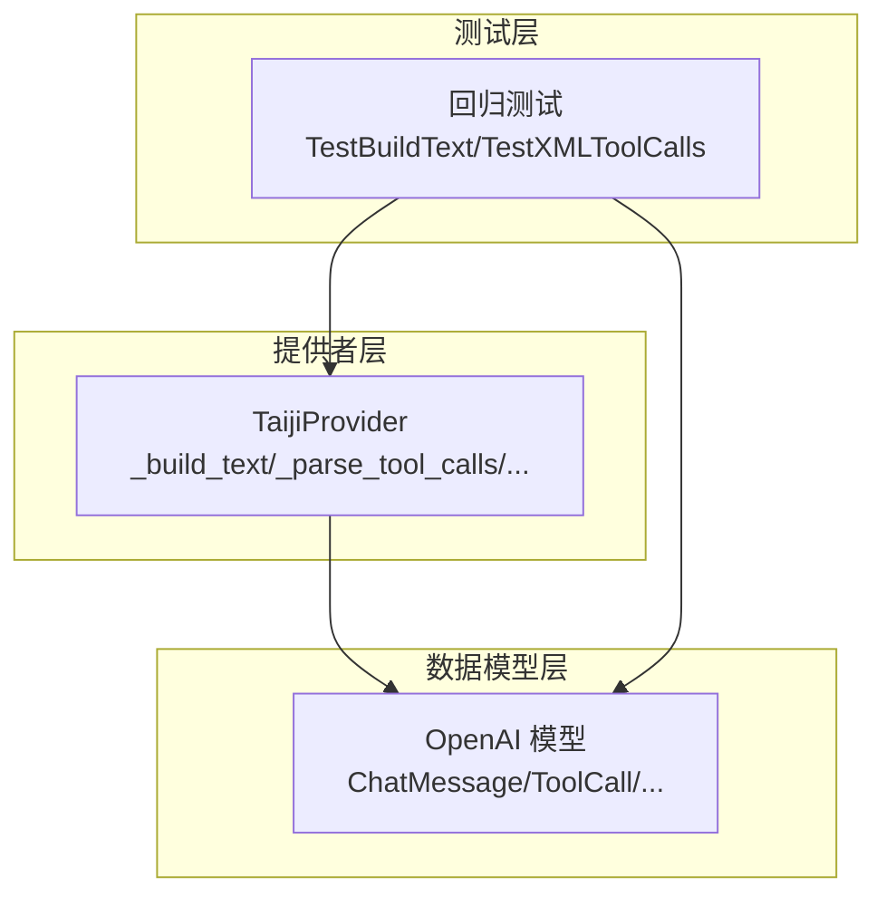
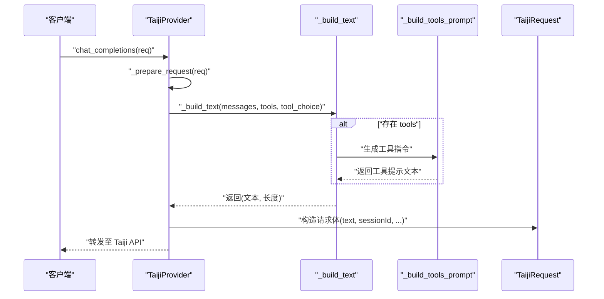
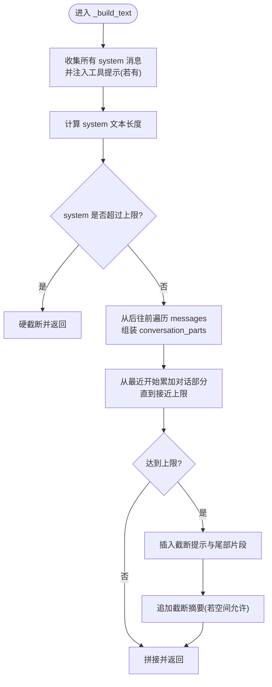
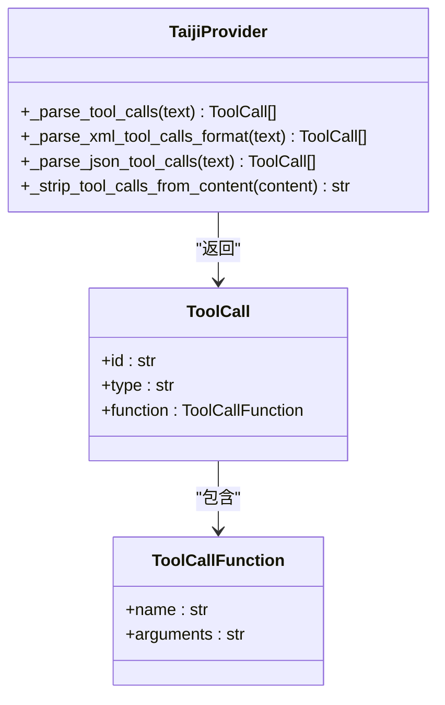
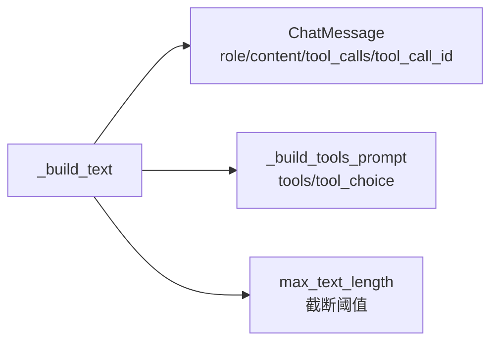

# 消息构建与转换

<cite>
**本文引用的文件**
- [src/openai_provider/providers/taiji.py](file://src/openai_provider/providers/taiji.py)
- [src/openai_provider/models/openai.py](file://src/openai_provider/models/openai.py)
- [tests/test_regression.py](file://tests/test_regression.py)
</cite>

## 目录
1. [简介](#简介)
2. [项目结构](#项目结构)
3. [核心组件](#核心组件)
4. [架构总览](#架构总览)
5. [详细组件分析](#详细组件分析)
6. [依赖关系分析](#依赖关系分析)
7. [性能考量](#性能考量)
8. [故障排查指南](#故障排查指南)
9. [结论](#结论)
10. [附录](#附录)

## 简介
本技术文档聚焦于“消息构建与转换”能力，深入解析 _build_text 方法如何将 OpenAI 格式的 messages 数组转换为 Taiji 后端可理解的纯文本格式。文档涵盖：
- system、user、assistant、tool 四类角色消息的处理逻辑与优先级
- assistant 消息中工具调用信息的合并策略
- tool 消息结果的格式化方式
- 从后往前添加最近对话的顺序策略
- 截断与转义处理机制
- 复杂场景示例（多轮对话、工具调用历史、系统提示）
- 最佳实践与性能优化建议

## 项目结构
本项目采用按功能分层组织的方式：
- providers：提供不同 LLM 后端的适配实现，其中 taiji.py 包含将 OpenAI 请求转为 Taiji API 的核心逻辑
- models：定义 OpenAI 兼容的数据模型（如 ChatMessage、ToolCall、ChatCompletionRequest 等）
- tests：回归测试覆盖关键路径，包括 _build_text 的行为验证

图表来源
- [src/openai_provider/providers/taiji.py:206-318](file://src/openai_provider/providers/taiji.py#L206-L318)
- [src/openai_provider/models/openai.py:73-101](file://src/openai_provider/models/openai.py#L73-L101)
- [tests/test_regression.py:266-302](file://tests/test_regression.py#L266-L302)

章节来源
- [src/openai_provider/providers/taiji.py:1-60](file://src/openai_provider/providers/taiji.py#L1-L60)
- [src/openai_provider/models/openai.py:1-177](file://src/openai_provider/models/openai.py#L1-L177)
- [tests/test_regression.py:257-378](file://tests/test_regression.py#L257-L378)

## 核心组件
- TaijiProvider._build_text：核心方法，负责将 OpenAI messages 列表转换为 Taiji 纯文本，并执行智能截断与顺序控制
- TaijiProvider._build_tools_prompt：根据 tools 定义与 tool_choice 生成系统级工具使用指令
- TaijiProvider._parse_tool_calls：解析模型输出中的工具调用（支持 XML/DSML 与 JSON）
- OpenAI 模型：ChatMessage、ToolCall、ToolDefinition、ChatCompletionRequest 等

章节来源
- [src/openai_provider/providers/taiji.py:206-318](file://src/openai_provider/providers/taiji.py#L206-L318)
- [src/openai_provider/providers/taiji.py:122-204](file://src/openai_provider/providers/taiji.py#L122-L204)
- [src/openai_provider/providers/taiji.py:350-482](file://src/openai_provider/providers/taiji.py#L350-L482)
- [src/openai_provider/models/openai.py:73-101](file://src/openai_provider/models/openai.py#L73-L101)

## 架构总览
_build_text 在整体流程中的位置如下：
- 上层入口通过 chat_completions/stream_chat_completions 调用 _prepare_request
- _prepare_request 计算原始 prompt token 数，并调用 _build_text 构建最终文本
- 构建后的文本被封装为 TaijiRequest 发送请求；响应阶段再解析 tool_calls 与思考标签

图表来源
- [src/openai_provider/providers/taiji.py:520-600](file://src/openai_provider/providers/taiji.py#L520-L600)
- [src/openai_provider/providers/taiji.py:206-318](file://src/openai_provider/providers/taiji.py#L206-L318)
- [src/openai_provider/providers/taiji.py:122-204](file://src/openai_provider/providers/taiji.py#L122-L204)

## 详细组件分析

### _build_text 方法与消息构建流程
_build_text 将 OpenAI messages 转换为 Taiji 纯文本，遵循以下策略：
- 最高优先级：始终包含所有 system 消息与工具提示（若存在）
- 对话消息顺序：从后往前遍历 messages，优先保留最近的 user/assistant/tool 消息
- 角色前缀标记：
  - system：以 “[System]: ” 前缀拼接
  - user：以 “[User]: ” 前缀拼接
  - assistant：以 “[Assistant]: ” 前缀拼接；若存在 tool_calls，追加 “[Tool Calls Executed]: ” 行，汇总已执行的工具名与参数
  - tool：以 “[Tool Result for {tool_call_id}]: ” 前缀拼接结果内容
- 智能截断：当接近最大长度限制时，插入截断提示，并尽可能保留旧消息的尾部片段；最后补充一条摘要说明被截断的消息数量
- 长度计算：返回最终文本与其字符长度，供上层进行硬截断保护

图表来源
- [src/openai_provider/providers/taiji.py:206-318](file://src/openai_provider/providers/taiji.py#L206-L318)

章节来源
- [src/openai_provider/providers/taiji.py:206-318](file://src/openai_provider/providers/taiji.py#L206-L318)
- [tests/test_regression.py:266-302](file://tests/test_regression.py#L266-L302)

#### 角色处理细节
- system 消息：全部保留，作为最高优先级上下文
- user 消息：直接以 “[User]: ” 前缀加入
- assistant 消息：
  - 基础内容为 “[Assistant]: ” 前缀
  - 若包含 tool_calls，则追加一行汇总信息，列出每个工具的名称与参数
- tool 消息：以 “[Tool Result for {tool_call_id}]: ” 前缀包装结果内容，便于后续追踪与调试

章节来源
- [src/openai_provider/providers/taiji.py:252-271](file://src/openai_provider/providers/taiji.py#L252-L271)
- [tests/test_regression.py:277-302](file://tests/test_regression.py#L277-L302)

#### 工具提示注入与 tool_choice 影响
- 当存在 tools 定义时，_build_text 会调用 _build_tools_prompt 生成一段系统级指令，指导模型如何选择合适的工具并以 XML/DSML 或 JSON 格式输出
- tool_choice 的值会影响行为约束段落：
  - required：强制要求至少调用一个工具
  - none：禁止调用任何工具
  - auto：按需选择工具

章节来源
- [src/openai_provider/providers/taiji.py:122-204](file://src/openai_provider/providers/taiji.py#L122-L204)
- [src/openai_provider/providers/taiji.py:238-241](file://src/openai_provider/providers/taiji.py#L238-L241)

#### 截断与转义处理
- 截断策略：
  - 若 system 部分自身超过上限，直接硬截断并返回
  - 否则从最近消息向前累加；遇到无法完整放入的消息时，插入截断提示，并尽量保留该消息的尾部片段
  - 最后尝试追加一条摘要，告知用户有多少条早期消息被截断或省略
- 转义处理：
  - 工具提示中对特殊 XML 字符有明确指引，建议使用实体引用或将值放在标签内由解析器处理
  - 工具调用解析器对 XML/JSON 均具备容错能力，避免非法字符导致解析失败

章节来源
- [src/openai_provider/providers/taiji.py:246-318](file://src/openai_provider/providers/taiji.py#L246-L318)
- [src/openai_provider/providers/taiji.py:173-179](file://src/openai_provider/providers/taiji.py#L173-L179)

### 工具调用解析与清理
- _parse_tool_calls：统一入口，优先尝试 XML/DSML 解析，失败则回退到 JSON 解析
- _parse_xml_tool_calls_format：支持标准 XML 与 DSML 两种变体，提取 invoke 名称与参数
- _parse_json_tool_calls：从文本中提取包含 “tool_calls” 的完整 JSON 块，并解析为 ToolCall 列表
- _strip_tool_calls_from_content：从最终文本中移除工具调用块，确保返回给用户的 content 干净

图表来源
- [src/openai_provider/providers/taiji.py:350-482](file://src/openai_provider/providers/taiji.py#L350-L482)
- [src/openai_provider/models/openai.py:46-60](file://src/openai_provider/models/openai.py#L46-L60)

章节来源
- [src/openai_provider/providers/taiji.py:350-482](file://src/openai_provider/providers/taiji.py#L350-L482)
- [tests/test_regression.py:187-211](file://tests/test_regression.py#L187-L211)

### 复杂场景示例与最佳实践
- 多轮对话：messages 中包含多条 user/assistant 交替消息，_build_text 会从后往前保留最近的对话片段，确保最新上下文优先
- 工具调用历史：assistant 消息携带 tool_calls，_build_text 会在文本中追加 “[Tool Calls Executed]: ” 行，记录已调用的工具名与参数；tool 消息则以 “[Tool Result for {id}]: ” 形式呈现结果
- 系统提示：system 消息与工具提示始终位于最前，保证模型理解任务背景与工具使用规则
- 最佳实践：
  - 合理设置 max_tokens 与 temperature，避免过长输出导致截断
  - 在需要严格工具调用时使用 tool_choice="required"，在不需要工具时使用 tool_choice="none"
  - 对于长对话，建议在上层做会话压缩或分段，减少 _build_text 的截断压力
  - 注意工具参数的特殊字符，遵循工具提示中的转义建议

章节来源
- [src/openai_provider/providers/taiji.py:206-318](file://src/openai_provider/providers/taiji.py#L206-L318)
- [src/openai_provider/providers/taiji.py:122-204](file://src/openai_provider/providers/taiji.py#L122-L204)
- [tests/test_regression.py:266-302](file://tests/test_regression.py#L266-L302)

## 依赖关系分析
_build_text 依赖 OpenAI 模型对象来读取 role、content、tool_calls、tool_call_id 等字段；同时依赖 _build_tools_prompt 生成工具提示。

图表来源
- [src/openai_provider/providers/taiji.py:206-318](file://src/openai_provider/providers/taiji.py#L206-L318)
- [src/openai_provider/models/openai.py:73-101](file://src/openai_provider/models/openai.py#L73-L101)

章节来源
- [src/openai_provider/providers/taiji.py:206-318](file://src/openai_provider/providers/taiji.py#L206-L318)
- [src/openai_provider/models/openai.py:73-101](file://src/openai_provider/models/openai.py#L73-L101)

## 性能考量
- 文本长度控制：_build_text 在构建过程中实时计算长度，避免超出上限；必要时进行软截断与摘要提示
- Token 计数：上层在 _prepare_request 中统计原始 prompt tokens，用于计费与压缩触发；_build_text 仅基于字符长度进行截断判断
- 流式处理：stream_chat_completions 在流结束后统一判定是否为 tool_calls，减少中间状态开销
- 解析效率：XML/JSON 解析采用正则与栈式括号计数，兼顾速度与鲁棒性

[本节为通用性能讨论，不直接分析具体文件]

## 故障排查指南
- 工具调用未识别：检查模型输出是否包含 XML/DSML 或 JSON 格式的 tool_calls；确认 _parse_tool_calls 能正确匹配
- 内容被过度截断：检查 max_text_length 配置与 messages 总量；适当调整上层会话管理策略
- 特殊字符导致解析失败：遵循工具提示中的转义建议，或使用标签包裹值让解析器处理
- 业务错误伪装 HTTP 200：非流式与流式均检测响应体中的 err/msg/code 字段，抛出相应异常

章节来源
- [src/openai_provider/providers/taiji.py:350-482](file://src/openai_provider/providers/taiji.py#L350-L482)
- [src/openai_provider/providers/taiji.py:670-780](file://src/openai_provider/providers/taiji.py#L670-L780)
- [src/openai_provider/providers/taiji.py:782-996](file://src/openai_provider/providers/taiji.py#L782-L996)

## 结论
_build_text 实现了从 OpenAI messages 到 Taiji 纯文本的高效转换，具备明确的优先级策略、角色前缀标记、工具调用合并与结果格式化、以及智能截断机制。配合 _build_tools_prompt 与工具解析器，系统在复杂对话与工具调用场景中表现稳健。建议在实际使用中结合会话压缩与合理的参数配置，以获得更好的性能与用户体验。

[本节为总结性内容，不直接分析具体文件]

## 附录
- 相关测试用例路径：
  - 多轮对话与角色前缀：[tests/test_regression.py:266-276](file://tests/test_regression.py#L266-L276)
  - tool 消息结果格式化：[tests/test_regression.py:277-283](file://tests/test_regression.py#L277-L283)
  - assistant 含 tool_calls 的合并：[tests/test_regression.py:285-302](file://tests/test_regression.py#L285-L302)
  - XML/DSML 工具调用解析：[tests/test_regression.py:187-211](file://tests/test_regression.py#L187-L211)

章节来源
- [tests/test_regression.py:266-302](file://tests/test_regression.py#L266-L302)
- [tests/test_regression.py:187-211](file://tests/test_regression.py#L187-L211)