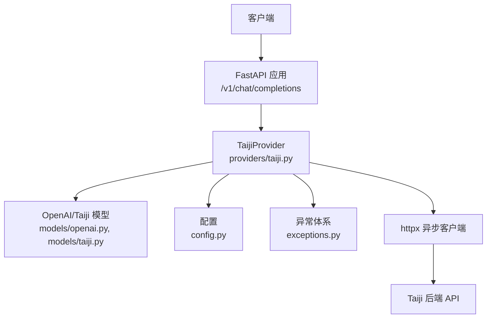
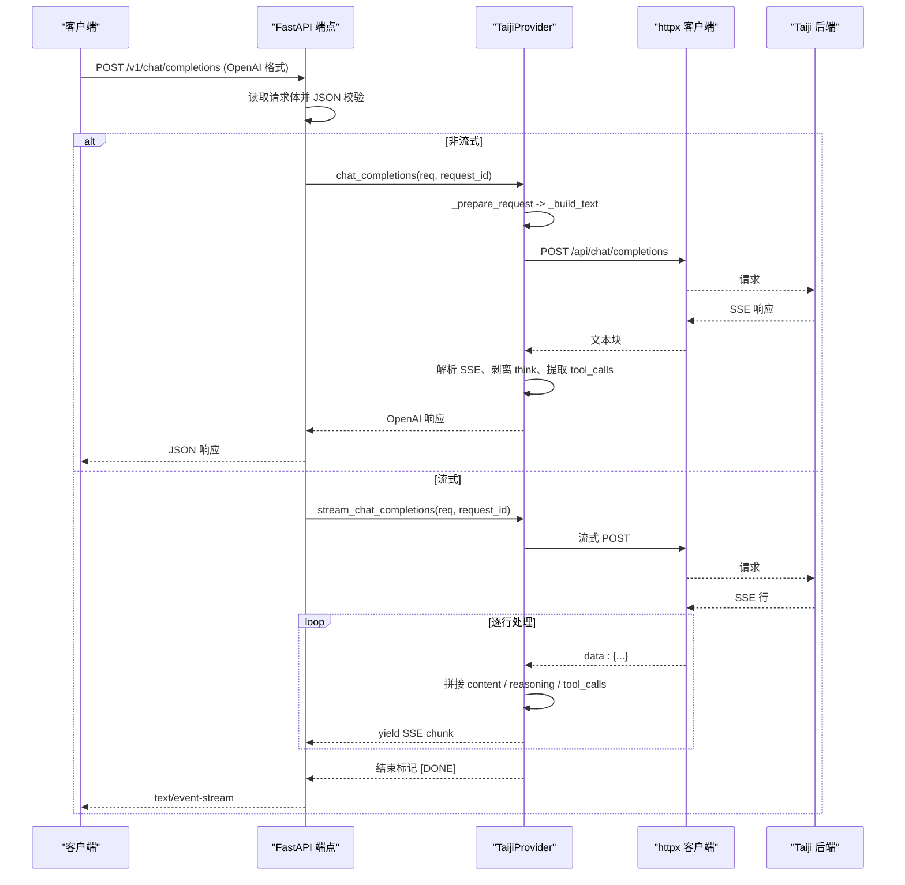
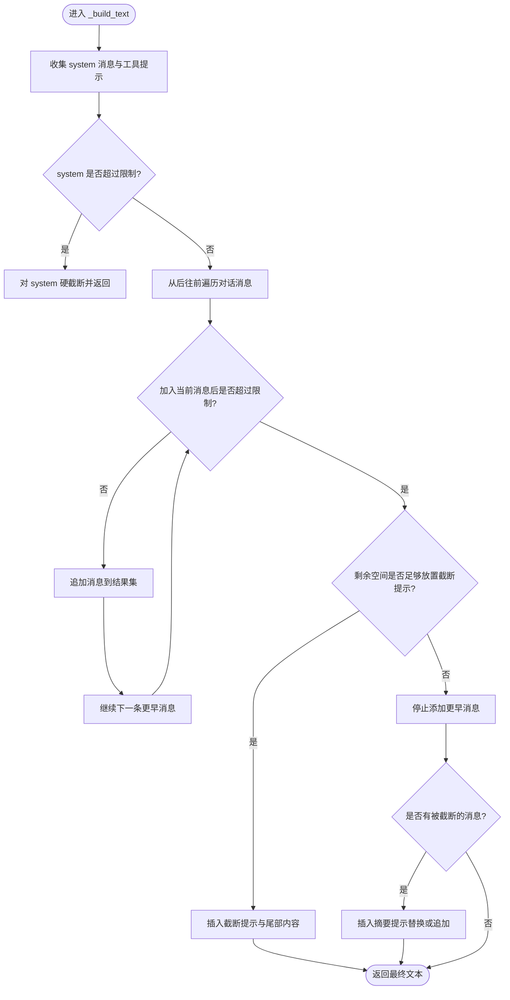
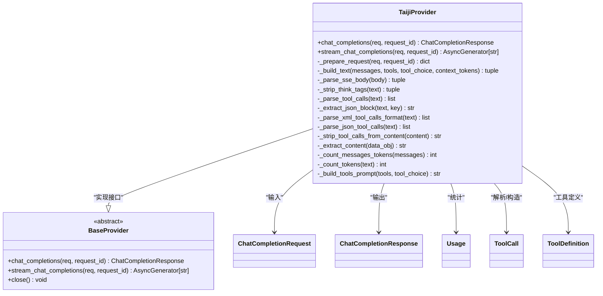
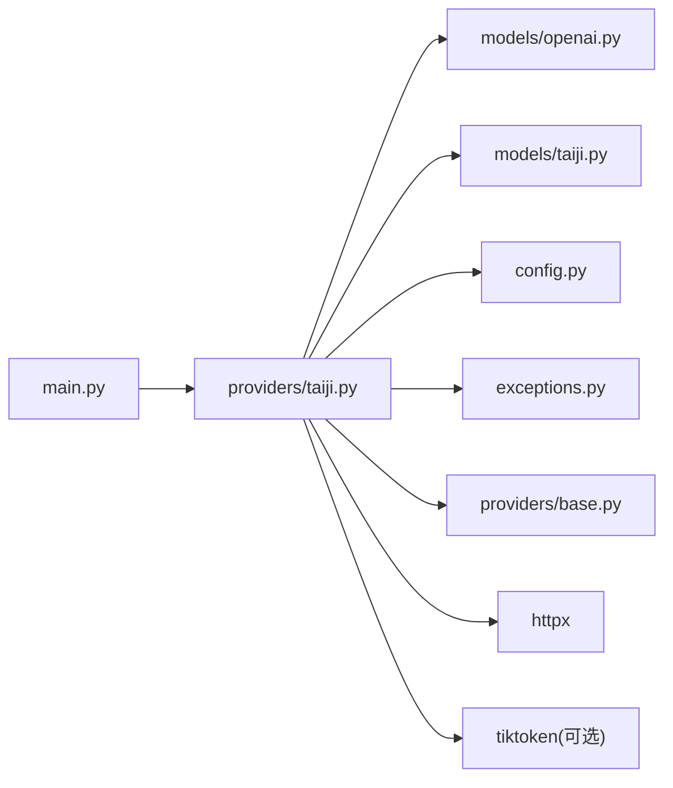

# 聊天完成处理

<cite>
**本文引用的文件**   
- [main.py](file://src/openai_provider/main.py)
- [taiji.py](file://src/openai_provider/providers/taiji.py)
- [openai.py](file://src/openai_provider/models/openai.py)
- [taiji_models.py](file://src/openai_provider/models/taiji.py)
- [config.py](file://src/openai_provider/config.py)
- [exceptions.py](file://src/openai_provider/exceptions.py)
- [base.py](file://src/openai_provider/providers/base.py)
- [test_chat.py](file://tests/test_chat.py)
</cite>

## 目录
1. [简介](#简介)
2. [项目结构](#项目结构)
3. [核心组件](#核心组件)
4. [架构总览](#架构总览)
5. [详细组件分析](#详细组件分析)
6. [依赖关系分析](#依赖关系分析)
7. [性能考量](#性能考量)
8. [故障排查指南](#故障排查指南)
9. [结论](#结论)
10. [附录：消息构建与截断示例路径](#附录消息构建与截断示例路径)

## 简介
本技术文档聚焦于“聊天完成处理”功能，围绕 OpenAI 兼容的 Chat Completions API 在 Taiji Provider 中的完整处理流程展开。内容涵盖请求验证、消息构建、文本截断策略、响应解析与格式转换，并重点深入 _build_text 方法的智能截断算法：如何优先保留 system 消息和工具提示、从后往前添加对话历史、以及超长文本的处理策略。同时说明如何处理 user、assistant、tool 三类消息，如何将 OpenAI 格式的消息转换为 Taiji 后端可理解的纯文本，并提供与其他组件的集成关系、性能优化建议与最佳实践。

## 项目结构
该仓库采用分层组织方式：
- 入口与路由层：FastAPI 应用定义与端点实现
- Provider 层：OpenAI 到 Taiji 的请求适配与响应解析
- 模型层：OpenAI 兼容请求/响应模型与 Taiji 请求体模型
- 配置与异常：集中式配置与结构化异常体系
- 测试：覆盖非流式、流式、工具调用、错误处理等场景

图表来源
- [main.py:134-257](file://src/openai_provider/main.py#L134-L257)
- [taiji.py:46-121](file://src/openai_provider/providers/taiji.py#L46-L121)
- [openai.py:83-101](file://src/openai_provider/models/openai.py#L83-L101)
- [taiji_models.py:8-21](file://src/openai_provider/models/taiji.py#L8-L21)
- [config.py:24-34](file://src/openai_provider/config.py#L24-L34)
- [exceptions.py:8-40](file://src/openai_provider/exceptions.py#L8-L40)

章节来源
- [main.py:1-342](file://src/openai_provider/main.py#L1-L342)
- [taiji.py:1-996](file://src/openai_provider/providers/taiji.py#L1-L996)
- [openai.py:1-177](file://src/openai_provider/models/openai.py#L1-L177)
- [taiji_models.py:1-31](file://src/openai_provider/models/taiji.py#L1-L31)
- [config.py:1-56](file://src/openai_provider/config.py#L1-L56)
- [exceptions.py:1-40](file://src/openai_provider/exceptions.py#L1-L40)
- [base.py:1-46](file://src/openai_provider/providers/base.py#L1-L46)

## 核心组件
- FastAPI 应用与路由：提供 /v1/chat/completions 端点，负责请求体读取、JSON 校验、流式与非流式分支、统一错误包装与日志记录。
- TaijiProvider：实现 OpenAI 到 Taiji 的适配，包括消息构建（_build_text）、工具提示生成（_build_tools_prompt）、SSE 响应解析、think 标签分离、tool_calls 提取与清理、token 计数与使用统计。
- 模型定义：OpenAI 兼容的 ChatCompletionRequest/Response 及流式 chunk 模型；Taiji 请求体模型。
- 配置与异常：通过环境变量加载配置；将网络、HTTP、业务错误抽象为结构化异常。

章节来源
- [main.py:134-257](file://src/openai_provider/main.py#L134-L257)
- [taiji.py:46-121](file://src/openai_provider/providers/taiji.py#L46-L121)
- [openai.py:83-101](file://src/openai_provider/models/openai.py#L83-L101)
- [taiji_models.py:8-21](file://src/openai_provider/models/taiji.py#L8-L21)
- [config.py:12-56](file://src/openai_provider/config.py#L12-L56)
- [exceptions.py:8-40](file://src/openai_provider/exceptions.py#L8-L40)

## 架构总览
整体数据流如下：
- 客户端发送 OpenAI 格式的 Chat Completion 请求至 FastAPI 端点
- 端点解析并校验请求体，按 stream 标志选择流式或非流式路径
- Provider 将 messages 转为 Taiji 纯文本（含系统提示与工具提示），构造 Taiji 请求
- 调用 Taiji 后端（支持 SSE），解析返回的 data 行，提取 content、reasoning_content、tool_calls
- 将结果转换为 OpenAI 兼容响应或流式 chunk，并计算 token 用量

图表来源
- [main.py:134-257](file://src/openai_provider/main.py#L134-L257)
- [taiji.py:670-780](file://src/openai_provider/providers/taiji.py#L670-L780)
- [taiji.py:782-996](file://src/openai_provider/providers/taiji.py#L782-L996)

## 详细组件分析

### 请求验证与路由处理
- 读取原始请求体并进行 UTF-8 解码，记录原始请求日志
- 使用 Pydantic 模型进行严格校验，失败时返回 OpenAI 风格错误体
- 根据 stream 标志分流：
  - 非流式：调用 Provider 的非流式方法，返回 JSON
  - 流式：以 StreamingResponse 输出 SSE，并在末尾追加 [DONE]
- 全局异常处理器将 HTTPException 转换为 OpenAI 风格错误体

章节来源
- [main.py:134-257](file://src/openai_provider/main.py#L134-L257)
- [main.py:319-331](file://src/openai_provider/main.py#L319-L331)

### 消息构建与文本截断（_build_text）
_build_text 的核心职责是将 OpenAI messages 数组转换为 Taiji 可接受的纯文本，并确保不超过最大长度限制。其智能截断策略如下：
- 优先级最高：始终包含所有 system 消息与工具提示（若存在 tools）
- 从后往前添加最近的对话（user、assistant、tool），直到接近限制
- 如果连最后一条消息都放不下，则对该消息进行尾部截断，并插入截断提示
- 当有被截断的历史消息时，插入摘要提示，告知模型上下文被截断
- 最终文本由系统部分与对话部分拼接而成，返回文本与实际字符长度

图表来源
- [taiji.py:206-318](file://src/openai_provider/providers/taiji.py#L206-L318)

章节来源
- [taiji.py:206-318](file://src/openai_provider/providers/taiji.py#L206-L318)

#### 工具提示生成（_build_tools_prompt）
- 将 OpenAI tools 定义转换为自然语言指令，明确工具目录、选择规则、响应格式（XML/DSML）、行为约束与 tool_choice 强制策略
- 用于注入 system 部分，确保模型理解何时以及如何调用工具

章节来源
- [taiji.py:122-204](file://src/openai_provider/providers/taiji.py#L122-L204)

#### 不同消息类型的处理
- user：直接以 “[User]: ...” 形式加入对话历史
- assistant：若包含 tool_calls，则在文本中附加已执行工具的调用信息，便于上下文连贯
- tool：以 “[Tool Result for <id>]: ...” 形式加入，保持工具执行结果的可见性

章节来源
- [taiji.py:252-271](file://src/openai_provider/providers/taiji.py#L252-L271)

### 响应解析与格式转换
- SSE 解析：逐行读取 data: 前缀的内容，跳过 [DONE]，按 type 字段区分字符串内容与对象类型（token 用量）
- 文本提取：按配置的 content_fields_list 优先级从响应对象中提取文本
- think 标签分离：去除 <think>...</think> 包裹的思考过程，返回 cleaned_text 与 reasoning_content
- tool_calls 解析：支持 XML/DSML 与 JSON 两种格式，提取函数名与参数，并清理文本中的 tool_calls 块
- 非流式响应：组装 OpenAI 风格的 ChatCompletionResponse，包含 usage（prompt_tokens、completion_tokens、total_tokens）
- 流式响应：实时构建 delta chunk，role 仅在首个 chunk 设置，content 与 reasoning_content 增量推送，结束时输出 finish_reason 与 usage

图表来源
- [taiji.py:46-121](file://src/openai_provider/providers/taiji.py#L46-L121)
- [taiji.py:670-780](file://src/openai_provider/providers/taiji.py#L670-L780)
- [taiji.py:782-996](file://src/openai_provider/providers/taiji.py#L782-L996)
- [openai.py:83-101](file://src/openai_provider/models/openai.py#L83-L101)
- [openai.py:133-143](file://src/openai_provider/models/openai.py#L133-L143)
- [openai.py:125-131](file://src/openai_provider/models/openai.py#L125-L131)
- [openai.py:53-60](file://src/openai_provider/models/openai.py#L53-L60)
- [openai.py:39-44](file://src/openai_provider/models/openai.py#L39-L44)
- [base.py:7-46](file://src/openai_provider/providers/base.py#L7-L46)

章节来源
- [taiji.py:633-668](file://src/openai_provider/providers/taiji.py#L633-L668)
- [taiji.py:501-518](file://src/openai_provider/providers/taiji.py#L501-L518)
- [taiji.py:350-499](file://src/openai_provider/providers/taiji.py#L350-L499)
- [taiji.py:670-780](file://src/openai_provider/providers/taiji.py#L670-L780)
- [taiji.py:782-996](file://src/openai_provider/providers/taiji.py#L782-L996)

### 与其他组件的集成关系
- FastAPI 应用：负责生命周期管理、CORS、认证中间件、端点路由与统一错误处理
- Provider 抽象基类：定义 chat_completions 与 stream_chat_completions 接口，保证可扩展性
- 配置模块：集中读取环境变量，提供默认值与类型校验
- 异常体系：将超时、HTTP、业务错误分类，便于上层捕获与用户友好提示
- 模型层：Pydantic 模型确保请求/响应的结构与序列化一致性

章节来源
- [main.py:78-126](file://src/openai_provider/main.py#L78-L126)
- [base.py:7-46](file://src/openai_provider/providers/base.py#L7-L46)
- [config.py:12-56](file://src/openai_provider/config.py#L12-L56)
- [exceptions.py:8-40](file://src/openai_provider/exceptions.py#L8-L40)

## 依赖关系分析
- 外部依赖：httpx（异步 HTTP 客户端）、tiktoken（可选，用于精确 token 计数）
- 内部依赖：
  - main.py 依赖 providers/taiji.py、models/openai.py、config.py、exceptions.py
  - taiji.py 依赖 models/openai.py、models/taiji.py、config.py、exceptions.py、providers/base.py
  - openai.py 仅依赖 pydantic
  - taiji_models.py 仅依赖 pydantic

图表来源
- [main.py:23-27](file://src/openai_provider/main.py#L23-L27)
- [taiji.py:18-40](file://src/openai_provider/providers/taiji.py#L18-L40)
- [openai.py:1-6](file://src/openai_provider/models/openai.py#L1-L6)
- [taiji_models.py:1-6](file://src/openai_provider/models/taiji.py#L1-L6)
- [config.py:1-10](file://src/openai_provider/config.py#L1-L10)
- [exceptions.py:1-6](file://src/openai_provider/exceptions.py#L1-L6)
- [base.py:1-5](file://src/openai_provider/providers/base.py#L1-L5)

章节来源
- [main.py:1-342](file://src/openai_provider/main.py#L1-L342)
- [taiji.py:1-996](file://src/openai_provider/providers/taiji.py#L1-L996)
- [openai.py:1-177](file://src/openai_provider/models/openai.py#L1-L177)
- [taiji_models.py:1-31](file://src/openai_provider/models/taiji.py#L1-L31)
- [config.py:1-56](file://src/openai_provider/config.py#L1-L56)
- [exceptions.py:1-40](file://src/openai_provider/exceptions.py#L1-L40)
- [base.py:1-46](file://src/openai_provider/providers/base.py#L1-L46)

## 性能考量
- Token 计数优化：
  - 优先使用 tiktoken 进行精确计数；不可用时回退到基于字符的估算（中文约 1.5 字符/token，英文约 4 字符/token）
  - 对 prompt 使用原始消息列表的 token 数（截断前），以保证上层代理能感知真实请求大小
  - completion_tokens 优先使用 Taiji 返回的数值，否则基于返回内容进行估算
- 文本截断策略：
  - 智能截断避免丢弃 system 与工具提示，最大限度保留关键上下文
  - 对超长消息进行尾部截断并插入提示，减少无效传输
- 流式处理：
  - 实时解析 SSE，边接收边转发，降低端到端延迟
  - 对 think 标签进行流式分离，先推送 reasoning_content，再推送 content，提升用户体验
- 资源管理：
  - httpx 客户端在 finally 中关闭，避免连接泄漏
  - 日志轮转与结构化日志便于问题定位与性能监控

[本节为通用指导，不直接分析具体文件]

## 故障排查指南
- 请求校验失败：检查 messages 结构是否符合 OpenAI 规范，确认必填字段齐全
- 认证失败：确认 API_KEY 配置正确且携带 Bearer token
- 网络/HTTP 错误：查看 ProviderError 子类（TaijiTimeoutError、TaijiHTTPError、TaijiRequestError）
- 业务错误：即使 HTTP 200，也可能包含 err/msg/code 字段，需作为业务错误处理
- Think 标签未剥离：确认 _strip_think_tags 逻辑是否正确匹配 <think>...</think>
- Tool calls 未识别：检查 XML/DSML 或 JSON 格式是否符合预期，必要时调整正则模式
- Token 统计不一致：确认 prompt_tokens 使用原始消息计数，completion_tokens 优先使用 Taiji 返回

章节来源
- [exceptions.py:8-40](file://src/openai_provider/exceptions.py#L8-L40)
- [taiji.py:633-668](file://src/openai_provider/providers/taiji.py#L633-L668)
- [taiji.py:501-518](file://src/openai_provider/providers/taiji.py#L501-L518)
- [taiji.py:350-499](file://src/openai_provider/providers/taiji.py#L350-L499)
- [main.py:319-331](file://src/openai_provider/main.py#L319-L331)

## 结论
本方案实现了 OpenAI 兼容的 Chat Completions API 到 Taiji 后端的完整适配，具备健壮的消息构建与智能截断、灵活的 tool_calls 解析、完善的流式与非流式处理、以及清晰的异常与日志体系。通过合理的性能优化与最佳实践，可在高并发与长上下文场景下保持稳定与高效。

[本节为总结，不直接分析具体文件]

## 附录：消息构建与截断示例路径
以下示例路径展示了如何处理不同类型的消息与截断策略，便于快速定位实现细节：
- 非流式 Chat Completions 主流程与错误处理
  - [main.py:134-257](file://src/openai_provider/main.py#L134-L257)
- Provider 非流式实现与响应组装
  - [taiji.py:670-780](file://src/openai_provider/providers/taiji.py#L670-L780)
- Provider 流式实现与 SSE 解析
  - [taiji.py:782-996](file://src/openai_provider/providers/taiji.py#L782-L996)
- 智能截断算法 _build_text
  - [taiji.py:206-318](file://src/openai_provider/providers/taiji.py#L206-L318)
- 工具提示生成 _build_tools_prompt
  - [taiji.py:122-204](file://src/openai_provider/providers/taiji.py#L122-L204)
- Think 标签剥离与 reasoning_content 提取
  - [taiji.py:501-518](file://src/openai_provider/providers/taiji.py#L501-L518)
- Tool calls 解析（XML/DSML 与 JSON）
  - [taiji.py:350-499](file://src/openai_provider/providers/taiji.py#L350-L499)
- OpenAI 兼容模型定义
  - [openai.py:83-101](file://src/openai_provider/models/openai.py#L83-L101)
  - [openai.py:133-143](file://src/openai_provider/models/openai.py#L133-L143)
- Taiji 请求体模型
  - [taiji_models.py:8-21](file://src/openai_provider/models/taiji.py#L8-L21)
- 配置项与环境变量
  - [config.py:24-34](file://src/openai_provider/config.py#L24-L34)
- 测试用例参考（非流式、流式、think、截断、认证）
  - [test_chat.py:74-128](file://tests/test_chat.py#L74-L128)
  - [test_chat.py:160-247](file://tests/test_chat.py#L160-L247)
  - [test_chat.py:375-398](file://tests/test_chat.py#L375-L398)
  - [test_chat.py:455-507](file://tests/test_chat.py#L455-L507)