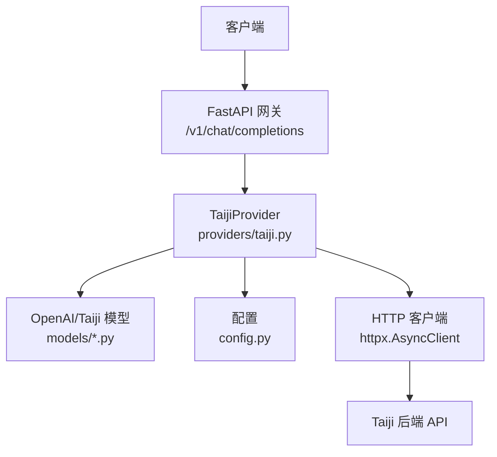
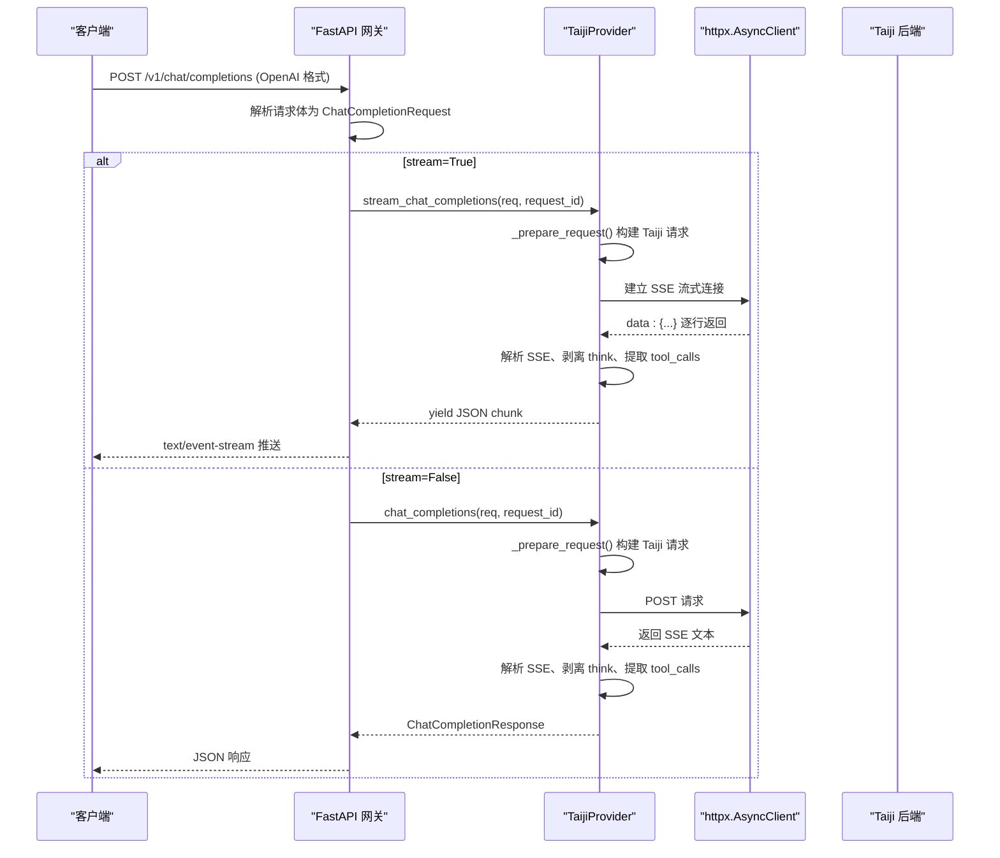
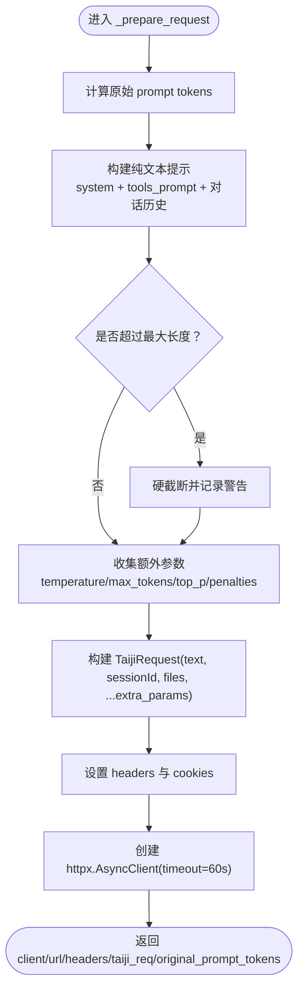
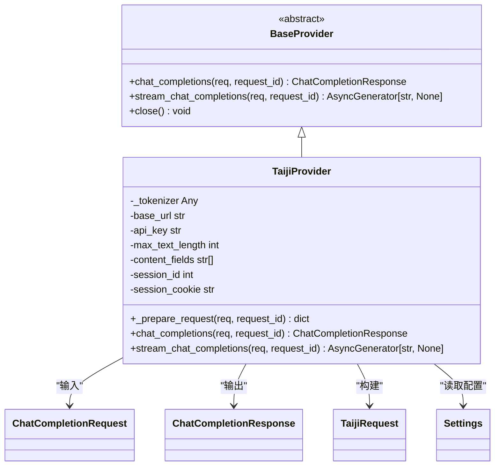
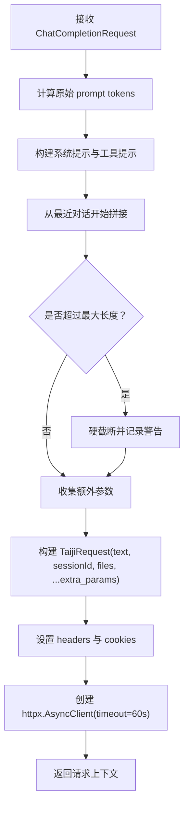

# 请求处理流程

<cite>
**本文引用的文件**   
- [main.py](file://src/openai_provider/main.py)
- [taiji.py](file://src/openai_provider/providers/taiji.py)
- [openai.py](file://src/openai_provider/models/openai.py)
- [taiji.py](file://src/openai_provider/models/taiji.py)
- [config.py](file://src/openai_provider/config.py)
- [base.py](file://src/openai_provider/providers/base.py)
- [exceptions.py](file://src/openai_provider/exceptions.py)
- [test_chat.py](file://tests/test_chat.py)
- [test_04_tool_calls.py](file://tests/e2e/test_04_tool_calls.py)
</cite>

## 目录
1. [简介](#简介)
2. [项目结构](#项目结构)
3. [核心组件](#核心组件)
4. [架构总览](#架构总览)
5. [详细组件分析](#详细组件分析)
6. [依赖关系分析](#依赖关系分析)
7. [性能考量](#性能考量)
8. [故障排查指南](#故障排查指南)
9. [结论](#结论)
10. [附录](#附录)

## 简介
本技术文档聚焦于聊天完成请求的完整处理流程，围绕 OpenAI 兼容接口 /v1/chat/completions 的请求进入、参数校验与解析、工具选择（tool_choice）处理、会话管理（sessionId 与 cookie）、以及将 OpenAI 格式请求转换为 Taiji 后端可理解的请求体等关键环节展开。重点说明 _prepare_request 方法如何构建 Taiji API 请求，包括消息 token 计数、文本长度检查、额外参数透传（temperature、max_tokens、top_p 等），并覆盖 HTTP 客户端配置、超时处理、错误转换机制。文末提供性能优化建议与最佳实践。

## 项目结构
该仓库采用“网关 + Provider”的分层设计：
- 网关层（FastAPI）：负责路由、认证、请求/响应日志、OpenAI 风格错误包装。
- Provider 层：实现具体后端适配（TaijiProvider），负责请求构造、SSE 解析、工具调用提取、思考内容分离、token 统计等。
- 模型层：定义 OpenAI 兼容的请求/响应模型与 Taiji 内部请求模型。
- 配置层：集中读取环境变量，提供默认值与类型校验。
- 异常层：结构化异常体系，便于上层统一处理。

图表来源
- [main.py:134-257](file://src/openai_provider/main.py#L134-L257)
- [taiji.py:520-600](file://src/openai_provider/providers/taiji.py#L520-L600)
- [openai.py:83-101](file://src/openai_provider/models/openai.py#L83-L101)
- [taiji.py:8-21](file://src/openai_provider/models/taiji.py#L8-L21)
- [config.py:12-56](file://src/openai_provider/config.py#L12-L56)

章节来源
- [main.py:1-342](file://src/openai_provider/main.py#L1-L342)
- [taiji.py:1-996](file://src/openai_provider/providers/taiji.py#L1-L996)
- [openai.py:1-177](file://src/openai_provider/models/openai.py#L1-L177)
- [taiji.py:1-31](file://src/openai_provider/models/taiji.py#L1-L31)
- [config.py:1-56](file://src/openai_provider/config.py#L1-L56)

## 核心组件
- FastAPI 入口与路由：提供 OpenAI 兼容端点，统一鉴权、日志、错误包装。
- TaijiProvider：核心适配器，负责请求构建、SSE 流式处理、工具调用解析、思考内容剥离、token 统计。
- 模型定义：OpenAI 兼容请求/响应模型；Taiji 内部请求模型。
- 配置模块：集中管理后端地址、密钥、会话标识、最大文本长度、CORS 等。
- 异常体系：区分超时、HTTP 错误、业务错误、网络错误。

章节来源
- [main.py:134-257](file://src/openai_provider/main.py#L134-L257)
- [taiji.py:46-121](file://src/openai_provider/providers/taiji.py#L46-L121)
- [openai.py:83-177](file://src/openai_provider/models/openai.py#L83-L177)
- [taiji.py:8-21](file://src/openai_provider/models/taiji.py#L8-L21)
- [config.py:12-56](file://src/openai_provider/config.py#L12-L56)
- [exceptions.py:8-40](file://src/openai_provider/exceptions.py#L8-L40)

## 架构总览
从客户端到 Taiji 后端的端到端流程如下：

图表来源
- [main.py:134-257](file://src/openai_provider/main.py#L134-L257)
- [taiji.py:670-780](file://src/openai_provider/providers/taiji.py#L670-L780)
- [taiji.py:782-996](file://src/openai_provider/providers/taiji.py#L782-L996)

## 详细组件分析

### 请求入口与验证（/v1/chat/completions）
- 接收原始请求体，记录原始请求日志（包含方法、路径、头部与截断后的 body）。
- 使用 Pydantic 模型对请求体进行严格校验，失败时返回 OpenAI 风格的 400 错误体。
- 根据 stream 字段分流：
  - 流式：生成 StreamingResponse，逐块转发 SSE 数据，并在末尾追加 [DONE]。
  - 非流式：调用 Provider 获取完整响应，再返回 JSON。

章节来源
- [main.py:134-257](file://src/openai_provider/main.py#L134-L257)

### 模型定义与参数解析（ChatCompletionRequest）
- 支持 model、messages、temperature、max_tokens、top_p、n、stream、stop、presence_penalty、frequency_penalty、user、tools、tool_choice 等字段。
- 通过 extra="ignore" 忽略未知字段，提升兼容性（例如 Hermes Agent 可能发送 thinking/reasoning 等扩展字段）。
- 工具相关：
  - tools：函数定义列表，用于提示词注入与后续解析。
  - tool_choice：字符串或对象，支持 auto/none/required 语义，或指定特定函数名。

章节来源
- [openai.py:83-101](file://src/openai_provider/models/openai.py#L83-L101)
- [openai.py:31-67](file://src/openai_provider/models/openai.py#L31-L67)

### 会话管理与 Cookie
- 会话标识：通过配置项 TAIJI_SESSION_ID 注入到 Taiji 请求体 sessionId 字段。
- Cookie：当配置 TAIJI_SESSION_COOKIE 非空时，在 httpx 客户端中设置 server_name_session cookie，以维持会话状态。
- 这些配置来自 config.py，支持 .env 与环境变量覆盖。

章节来源
- [taiji.py:55-60](file://src/openai_provider/providers/taiji.py#L55-L60)
- [taiji.py:572-575](file://src/openai_provider/providers/taiji.py#L572-L575)
- [config.py:24-33](file://src/openai_provider/config.py#L24-L33)

### 工具选择处理（tool_choice）
- 在 _prepare_request 中解析 tool_choice：
  - 若为字符串，直接使用（auto/none/required）。
  - 若为 ToolChoice 对象，当前实现回退为 auto（可根据需要扩展为强制指定函数名）。
- 在构建系统提示词时，依据 tool_choice 注入行为约束：
  - required：必须调用至少一个工具。
  - none：禁止调用任何工具。
  - auto：按需使用工具。

章节来源
- [taiji.py:524-528](file://src/openai_provider/providers/taiji.py#L524-L528)
- [taiji.py:189-203](file://src/openai_provider/providers/taiji.py#L189-L203)

### 构建 Taiji 请求（_prepare_request）
_prepare_request 是核心方法，负责：
- 计算原始 prompt token 数（基于 messages 的 role/content/name/tool_call_id/tool_calls 等字段）。
- 构建纯文本提示：
  - 始终包含 system 消息与工具提示（最高优先级）。
  - 从最近对话开始向前拼接，直至接近最大文本长度限制。
  - 若仍超限，则对最后一条消息进行截断，并插入截断提示。
- 文本长度检查：超过 TAIJI_MAX_TEXT_LENGTH 时执行硬截断。
- 透传额外参数：temperature、max_tokens、top_p、presence_penalty、frequency_penalty。
- 组装 TaijiRequest 对象（text、sessionId、files、thinking/webSearch 等），并设置 headers 与 cookies。
- 创建 httpx.AsyncClient（timeout=60s，携带 cookies）。

图表来源
- [taiji.py:520-600](file://src/openai_provider/providers/taiji.py#L520-L600)
- [taiji.py:96-121](file://src/openai_provider/providers/taiji.py#L96-L121)
- [taiji.py:206-318](file://src/openai_provider/providers/taiji.py#L206-L318)
- [taiji.py:544-556](file://src/openai_provider/providers/taiji.py#L544-L556)
- [taiji.py:558-575](file://src/openai_provider/providers/taiji.py#L558-L575)

章节来源
- [taiji.py:520-600](file://src/openai_provider/providers/taiji.py#L520-L600)
- [taiji.py:96-121](file://src/openai_provider/providers/taiji.py#L96-L121)
- [taiji.py:206-318](file://src/openai_provider/providers/taiji.py#L206-L318)
- [taiji.py:544-556](file://src/openai_provider/providers/taiji.py#L544-L556)
- [taiji.py:558-575](file://src/openai_provider/providers/taiji.py#L558-L575)

### 非流式响应处理（chat_completions）
- 调用 _prepare_request 准备请求。
- 使用 httpx.AsyncClient.post 发起请求，捕获超时与 HTTP 错误并转换为结构化异常。
- 解析 SSE 文本：
  - 按行扫描 data: 前缀，跳过 [DONE]。
  - 提取 content 字段（按配置的 content_fields 优先级）。
  - 剥离 <think>...</think> 思考标签，得到 reasoning_content。
  - 检测业务错误（HTTP 200 但包含 err/msg/code 字段）。
- 解析 tool_calls：
  - 优先尝试 XML/DSML 格式，其次回退 JSON。
  - 若检测到 tool_calls，则从内容中移除对应块，finish_reason 设为 tool_calls。
- Token 统计：
  - prompt_tokens 使用原始计数（截断前）。
  - completion_tokens 优先使用 taiji 返回的 completionTokens，否则估算。
  - total_tokens = prompt_tokens + completion_tokens。
- 返回 OpenAI 格式的 ChatCompletionResponse。

章节来源
- [taiji.py:670-780](file://src/openai_provider/providers/taiji.py#L670-L780)
- [taiji.py:633-668](file://src/openai_provider/providers/taiji.py#L633-L668)
- [taiji.py:350-482](file://src/openai_provider/providers/taiji.py#L350-L482)
- [taiji.py:511-518](file://src/openai_provider/providers/taiji.py#L511-L518)

### 流式响应处理（stream_chat_completions）
- 使用 httpx.AsyncClient.stream 建立 SSE 流。
- 逐行解析 data: 前缀，跳过非 string 类型（object 类型用于 token 信息）。
- 实时处理 think 标签：
  - 跨 chunk 的 <think>...</think> 会被正确拼接与关闭。
  - reasoning_content 作为独立 delta 实时推送。
- 工具模式下的缓冲策略：
  - 当存在 tools 时，先缓冲内容，待流结束后统一判断是否为 tool_calls。
  - 若为 tool_calls，先输出剩余文本（如有），再输出 tool_calls delta，并以 finish_reason=tool_calls 结束。
  - 若非 tool_calls，一次性输出缓冲内容，finish_reason=stop。
- Token 统计与非流式一致。

章节来源
- [taiji.py:782-996](file://src/openai_provider/providers/taiji.py#L782-L996)
- [taiji.py:602-631](file://src/openai_provider/providers/taiji.py#L602-L631)

### HTTP 客户端配置、超时与错误转换
- 客户端：httpx.AsyncClient，timeout=60s，cookies 由配置注入。
- 超时：httpx.TimeoutException 被转换为 TaijiTimeoutError。
- HTTP 错误：httpx.HTTPError 被转换为 TaijiRequestError。
- 业务错误：HTTP 200 但响应体包含 err/msg/code 字段时，转换为 TaijiBusinessError。
- 非 200 状态码：转换为 TaijiHTTPError。
- 网关层将 ProviderError 映射为 OpenAI 风格错误体（如 502）。

章节来源
- [taiji.py:593-600](file://src/openai_provider/providers/taiji.py#L593-L600)
- [taiji.py:682-686](file://src/openai_provider/providers/taiji.py#L682-L686)
- [taiji.py:706-720](file://src/openai_provider/providers/taiji.py#L706-L720)
- [taiji.py:808-810](file://src/openai_provider/providers/taiji.py#L808-L810)
- [exceptions.py:8-40](file://src/openai_provider/exceptions.py#L8-L40)
- [main.py:221-241](file://src/openai_provider/main.py#L221-L241)

### 工具调用解析与清理
- 支持三种格式：
  - DSML XML：<｜｜DSML｜｜tool_calls><｜｜DSML｜｜invoke name="func">...</｜｜DSML｜｜/tool_calls>
  - 标准 XML：<tool_calls><invoke name="func">...</invoke></tool_calls>
  - JSON：{"tool_calls": [{"id":"...", "function":{"name":"...", "arguments":"..."}}]}
- 解析成功后，从内容中移除相应块，避免污染最终文本。

章节来源
- [taiji.py:350-482](file://src/openai_provider/providers/taiji.py#L350-L482)
- [taiji.py:484-499](file://src/openai_provider/providers/taiji.py#L484-L499)

### 思考内容剥离（think 标签）
- 使用正则匹配 <think>...</think>，提取 reasoning_content 并从内容中去除。
- 流式模式下支持跨 chunk 的 think 标签拼接与关闭。

章节来源
- [taiji.py:511-518](file://src/openai_provider/providers/taiji.py#L511-L518)
- [taiji.py:852-908](file://src/openai_provider/providers/taiji.py#L852-L908)

### 示例：不同类型请求参数的处理
- 基础聊天：仅包含 model 与 messages。
- 带工具：传入 tools 列表，tool_choice 可为 auto/none/required 或指定函数对象。
- 流式：设置 stream=True，服务端返回 text/event-stream。
- 额外参数：temperature、max_tokens、top_p、presence_penalty、frequency_penalty 将被透传到 Taiji 请求。
- 未知字段：由于 ChatCompletionRequest 配置了 extra="ignore"，不会导致 400 错误。

章节来源
- [openai.py:83-101](file://src/openai_provider/models/openai.py#L83-L101)
- [taiji.py:544-556](file://src/openai_provider/providers/taiji.py#L544-L556)
- [test_chat.py:332-357](file://tests/test_chat.py#L332-L357)

### 示例：OpenAI 格式到 Taiji 格式的转换
- OpenAI 请求中的 messages 被转换为纯文本提示，system 与 tools_prompt 优先保留，对话历史从近到远拼接，必要时截断。
- temperature、max_tokens、top_p 等参数直接透传到 TaijiRequest。
- sessionId 与 cookies 由配置注入，确保会话连续性。

章节来源
- [taiji.py:206-318](file://src/openai_provider/providers/taiji.py#L206-L318)
- [taiji.py:544-556](file://src/openai_provider/providers/taiji.py#L544-L556)
- [taiji.py:572-575](file://src/openai_provider/providers/taiji.py#L572-L575)

## 依赖关系分析
- 网关依赖 Provider 抽象基类与 TaijiProvider 实现。
- Provider 依赖 OpenAI 模型（用于请求/响应建模）与 Taiji 模型（用于内部请求体）。
- Provider 依赖配置模块获取后端地址、密钥、会话标识、最大文本长度等。
- Provider 使用 httpx 进行 HTTP 通信，并将底层异常转换为结构化异常。

图表来源
- [base.py:7-46](file://src/openai_provider/providers/base.py#L7-L46)
- [taiji.py:46-121](file://src/openai_provider/providers/taiji.py#L46-L121)
- [openai.py:83-177](file://src/openai_provider/models/openai.py#L83-L177)
- [taiji.py:8-21](file://src/openai_provider/models/taiji.py#L8-L21)
- [config.py:12-56](file://src/openai_provider/config.py#L12-L56)

章节来源
- [base.py:1-46](file://src/openai_provider/providers/base.py#L1-L46)
- [taiji.py:1-121](file://src/openai_provider/providers/taiji.py#L1-L121)
- [openai.py:1-177](file://src/openai_provider/models/openai.py#L1-L177)
- [taiji.py:1-31](file://src/openai_provider/models/taiji.py#L1-L31)
- [config.py:1-56](file://src/openai_provider/config.py#L1-L56)

## 性能考量
- 文本长度控制：
  - 智能截断策略保证 system 与 tools_prompt 始终保留，对话历史从近到远拼接，减少上下文丢失。
  - 硬截断兜底，防止超出后端限制。
- Token 统计：
  - 优先使用 taiji 返回的 completionTokens，降低估算误差。
  - 未返回时基于内容估算，考虑 reasoning_content 与 tool_calls 的字符数。
- 流式处理：
  - 实时推送 delta，减少首字节延迟。
  - 工具模式下缓冲内容，避免中间态频繁切换。
- HTTP 客户端：
  - 合理超时（60s），避免长时间阻塞。
  - 复用 cookies 保持会话，减少重复登录开销。
- 日志与调试：
  - 结构化 JSON 日志，便于追踪问题与性能分析。
  - 关键路径记录耗时与预览内容，辅助定位瓶颈。

[本节为通用指导，不直接分析具体文件]

## 故障排查指南
- 400 无效请求：
  - 检查请求体是否符合 ChatCompletionRequest 模型定义。
  - 确认必填字段 model、messages 是否存在且类型正确。
- 502 提供者错误：
  - 检查 Taiji 后端可达性与鉴权（TAIJI_API_KEY）。
  - 查看 ProviderError 的具体类型（超时、HTTP 错误、业务错误、网络错误）。
- 业务错误（HTTP 200 但包含 err/msg/code）：
  - 关注响应体中的 err/msg/code 字段，通常表示认证过期、参数非法等。
- 流式中断或乱序：
  - 检查 SSE 数据行是否正确以 data: 开头，[DONE] 是否出现。
  - 确认 think 标签是否跨 chunk 正确拼接与关闭。
- 工具调用未触发：
  - 检查 tools 定义与 tool_choice 参数。
  - 确认模型输出是否包含 XML/JSON 格式的 tool_calls。

章节来源
- [main.py:163-183](file://src/openai_provider/main.py#L163-L183)
- [main.py:221-241](file://src/openai_provider/main.py#L221-L241)
- [taiji.py:682-720](file://src/openai_provider/providers/taiji.py#L682-L720)
- [taiji.py:808-810](file://src/openai_provider/providers/taiji.py#L808-L810)
- [exceptions.py:8-40](file://src/openai_provider/exceptions.py#L8-L40)

## 结论
本实现通过清晰的网关与 Provider 分层，将 OpenAI 兼容请求无缝转换为 Taiji 后端可理解的格式，同时兼顾流式与非流式两种模式。_prepare_request 方法在保证上下文质量的前提下，实现了严格的文本长度控制与参数透传；工具选择与解析逻辑支持多种格式，思考内容剥离提升了用户体验。结合结构化异常与日志体系，系统在稳定性与可观测性方面具备良好表现。

[本节为总结，不直接分析具体文件]

## 附录

### 代码级流程图：_prepare_request 构建 Taiji 请求

图表来源
- [taiji.py:520-600](file://src/openai_provider/providers/taiji.py#L520-L600)
- [taiji.py:96-121](file://src/openai_provider/providers/taiji.py#L96-L121)
- [taiji.py:206-318](file://src/openai_provider/providers/taiji.py#L206-L318)
- [taiji.py:544-556](file://src/openai_provider/providers/taiji.py#L544-L556)
- [taiji.py:558-575](file://src/openai_provider/providers/taiji.py#L558-L575)

### 测试用例参考
- 非流式成功、多段 SSE、提供者错误、无效请求、流式响应、reasoning_content 处理、超长文本截断、think 标签剥离、认证开关等场景均有覆盖。
- 工具调用 E2E 测试涵盖非流式与流式、tool_choice 强制指定、多轮工具往返等。

章节来源
- [test_chat.py:74-128](file://tests/test_chat.py#L74-L128)
- [test_chat.py:160-247](file://tests/test_chat.py#L160-L247)
- [test_chat.py:332-357](file://tests/test_chat.py#L332-L357)
- [test_chat.py:375-398](file://tests/test_chat.py#L375-L398)
- [test_04_tool_calls.py:50-102](file://tests/e2e/test_04_tool_calls.py#L50-L102)
- [test_04_tool_calls.py:104-154](file://tests/e2e/test_04_tool_calls.py#L104-L154)
- [test_04_tool_calls.py:156-186](file://tests/e2e/test_04_tool_calls.py#L156-L186)
- [test_04_tool_calls.py:189-226](file://tests/e2e/test_04_tool_calls.py#L189-L226)