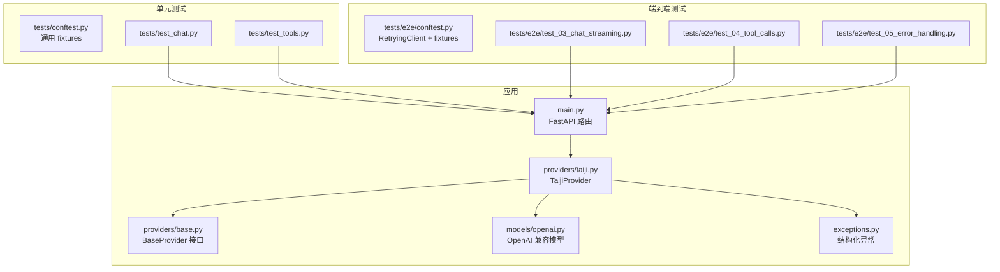
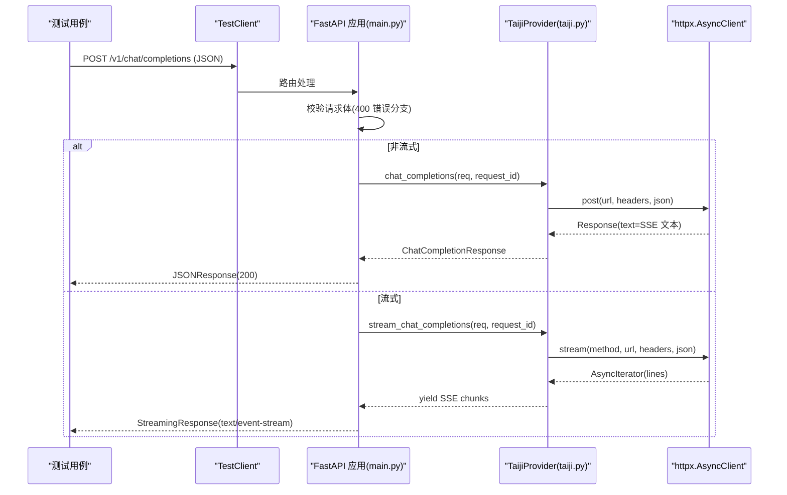
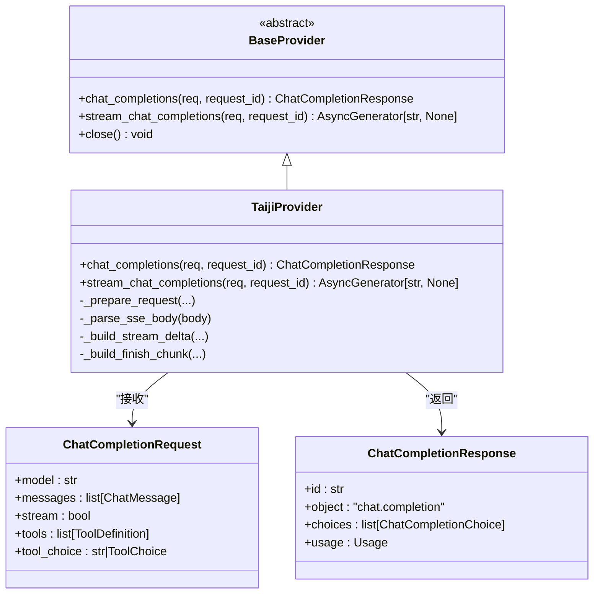
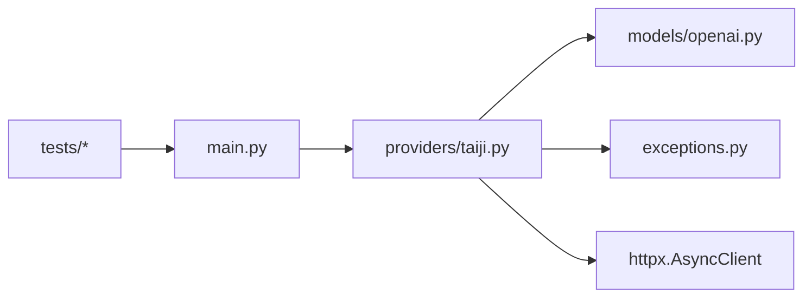

# 单元测试

<cite>
**本文引用的文件**   
- [tests/conftest.py](file://tests/conftest.py)
- [tests/e2e/conftest.py](file://tests/e2e/conftest.py)
- [tests/test_chat.py](file://tests/test_chat.py)
- [tests/test_tools.py](file://tests/test_tools.py)
- [tests/e2e/test_03_chat_streaming.py](file://tests/e2e/test_03_chat_streaming.py)
- [tests/e2e/test_04_tool_calls.py](file://tests/e2e/test_04_tool_calls.py)
- [tests/e2e/test_05_error_handling.py](file://tests/e2e/test_05_error_handling.py)
- [src/openai_provider/main.py](file://src/openai_provider/main.py)
- [src/openai_provider/providers/base.py](file://src/openai_provider/providers/base.py)
- [src/openai_provider/providers/taiji.py](file://src/openai_provider/providers/taiji.py)
- [src/openai_provider/models/openai.py](file://src/openai_provider/models/openai.py)
- [src/openai_provider/exceptions.py](file://src/openai_provider/exceptions.py)
- [pytest.ini](file://pytest.ini)
- [pyproject.toml](file://pyproject.toml)
</cite>

## 目录
1. [简介](#简介)
2. [项目结构](#项目结构)
3. [核心组件](#核心组件)
4. [架构总览](#架构总览)
5. [详细组件分析](#详细组件分析)
6. [依赖关系分析](#依赖关系分析)
7. [性能考虑](#性能考虑)
8. [故障排查指南](#故障排查指南)
9. [结论](#结论)
10. [附录](#附录)

## 简介
本文件面向测试工程师与开发者，系统化说明如何在本仓库中编写和运行单元测试与端到端（E2E）测试。重点覆盖：
- 测试夹具（fixtures）的复用与扩展
- Mock 对象创建与配置（同步/异步、非流式/流式）
- SSE 响应的模拟方法与解析策略
- 错误响应构造与异常处理验证
- Chat Completions API、工具调用（Tool Calls）与推理内容（reasoning_content）的测试要点
- 异步测试最佳实践与性能考量

## 项目结构
测试代码按职责分层组织：
- tests/conftest.py：通用 fixtures（SSE 文本/流式上下文、错误响应、解析辅助）
- tests/e2e/conftest.py：E2E 共享夹具（带重试的 httpx.Client、基础请求体、服务存活检测）
- tests/test_chat.py：基于 FastAPI TestClient 的单元测试，覆盖健康检查、模型列表、Chat Completions（非流式/流式）、认证等
- tests/test_tools.py：聚焦工具调用（tool_calls）的单元测试
- tests/e2e/test_*.py：真实服务联调测试，覆盖流式、工具调用、错误处理、并发等

图表来源
- [src/openai_provider/main.py:134-257](file://src/openai_provider/main.py#L134-L257)
- [src/openai_provider/providers/taiji.py:46-120](file://src/openai_provider/providers/taiji.py#L46-L120)
- [src/openai_provider/providers/base.py:7-46](file://src/openai_provider/providers/base.py#L7-L46)
- [src/openai_provider/models/openai.py:83-177](file://src/openai_provider/models/openai.py#L83-L177)
- [src/openai_provider/exceptions.py:8-40](file://src/openai_provider/exceptions.py#L8-L40)
- [tests/conftest.py:16-92](file://tests/conftest.py#L16-L92)
- [tests/e2e/conftest.py:47-91](file://tests/e2e/conftest.py#L47-L91)

章节来源
- [pytest.ini:1-3](file://pytest.ini#L1-L3)
- [pyproject.toml:29-31](file://pyproject.toml#L29-L31)

## 核心组件
- 通用 SSE 与非流式响应夹具
  - make_sse_response：构造非流式 SSE 文本响应（含 data: 行与 [DONE]）
  - make_error_response：构造 HTTP 错误响应
  - parse_sse_chunks：从 SSE 文本解析出 chunk 列表（不含 [DONE]）
- 流式响应夹具
  - MockStreamContext：实现 async context manager 与 aiter_lines，模拟 httpx.AsyncClient.stream
  - make_stream_mock：生成流式上下文
  - make_sse_lines：将 JSON 字符串列表转换为标准 SSE 行
- E2E 客户端
  - RetryingClient：包装 httpx.Client，对 502 自动重试
  - chat_payload/stream_payload：最小化聊天请求体

章节来源
- [tests/conftest.py:16-92](file://tests/conftest.py#L16-L92)
- [tests/conftest.py:98-160](file://tests/conftest.py#L98-L160)
- [tests/e2e/conftest.py:47-91](file://tests/e2e/conftest.py#L47-L91)
- [tests/e2e/conftest.py:94-106](file://tests/e2e/conftest.py#L94-L106)

## 架构总览
以下序列图展示一次 Chat Completions 请求在单元测试中的典型流程（以非流式为例），以及流式路径的差异点。

图表来源
- [src/openai_provider/main.py:134-257](file://src/openai_provider/main.py#L134-L257)
- [src/openai_provider/providers/taiji.py:670-780](file://src/openai_provider/providers/taiji.py#L670-L780)
- [src/openai_provider/providers/taiji.py:782-800](file://src/openai_provider/providers/taiji.py#L782-L800)

## 详细组件分析

### 1) 测试夹具与 Mock 策略
- 非流式 SSE 响应
  - 使用 make_sse_response 或自定义 AsyncMock，设置 status_code、text、headers
  - 适用于“一次性返回完整 SSE 文本”的场景
- 流式 SSE 响应
  - 使用 MockStreamContext 并 patch httpx.AsyncClient.stream，返回一个可迭代的 lines 序列
  - 适合需要逐行消费、断言中间状态的场景
- 错误响应
  - 使用 make_error_response 构造 4xx/5xx 响应，用于验证 ProviderError 到 OpenAI 风格错误的转换
- SSE 解析
  - parse_sse_chunks 统一从 text/event-stream 文本中提取有效 chunk，便于断言

章节来源
- [tests/conftest.py:16-92](file://tests/conftest.py#L16-L92)
- [tests/conftest.py:98-160](file://tests/conftest.py#L98-L160)

### 2) Chat Completions API 测试要点
- 非流式成功路径
  - 断言 object、model、choices[0].message.role/content、usage 字段
  - 参考路径：[tests/test_chat.py:74-91](file://tests/test_chat.py#L74-L91)
- 多段拼接
  - 多条 SSE data 行应拼接为完整 content
  - 参考路径：[tests/test_chat.py:94-106](file://tests/test_chat.py#L94-L106)
- 推理内容（reasoning_content）
  - 当包含 <think>...</think> 时，content 去除标签，reasoning_content 提取；空标签时省略 reasoning_content
  - 参考路径：[tests/test_chat.py:190-246](file://tests/test_chat.py#L190-L246)、[tests/test_chat.py:249-276](file://tests/test_chat.py#L249-L276)
- Token 计算
  - completion_tokens 应包含 reasoning_content 字符数；total = prompt + completion
  - 参考路径：[tests/test_chat.py:278-306](file://tests/test_chat.py#L278-L306)
- 未知字段容忍
  - extra fields 不应导致 400，应忽略
  - 参考路径：[tests/test_chat.py:332-357](file://tests/test_chat.py#L332-L357)
- 超长文本截断
  - 通过捕获实际发出的请求体，验证长度限制
  - 参考路径：[tests/test_chat.py:374-398](file://tests/test_chat.py#L374-L398)

章节来源
- [tests/test_chat.py:59-128](file://tests/test_chat.py#L59-L128)
- [tests/test_chat.py:160-246](file://tests/test_chat.py#L160-L246)
- [tests/test_chat.py:278-306](file://tests/test_chat.py#L278-L306)
- [tests/test_chat.py:332-398](file://tests/test_chat.py#L332-L398)

### 3) 流式响应（SSE）测试策略
- 基本格式
  - content-type 应为 text/event-stream；包含 no-cache 与 keep-alive 头；以 data: [DONE] 结尾
  - 参考路径：[tests/e2e/test_03_chat_streaming.py:13-28](file://tests/e2e/test_03_chat_streaming.py#L13-L28)
- Chunk 结构
  - 首个 chunk 携带 role=assistant；所有 chunk 的 object 为 chat.completion.chunk；id/model 一致
  - 参考路径：[tests/e2e/test_03_chat_streaming.py:30-69](file://tests/e2e/test_03_chat_streaming.py#L30-L69)
- finish_reason 时机
  - 仅在倒数第二个 chunk 出现，且值为 stop
  - 参考路径：[tests/e2e/test_03_chat_streaming.py:72-89](file://tests/e2e/test_03_chat_streaming.py#L72-L89)
- usage 信息
  - 最后一个 finish chunk 包含 usage，且 total = prompt + completion
  - 参考路径：[tests/e2e/test_03_chat_streaming.py:91-108](file://tests/e2e/test_03_chat_streaming.py#L91-L108)
- 多轮对话与极短提示
  - 多轮消息与极简输入均应正常流式返回
  - 参考路径：[tests/e2e/test_03_chat_streaming.py:111-146](file://tests/e2e/test_03_chat_streaming.py#L111-L146)

章节来源
- [tests/e2e/test_03_chat_streaming.py:13-146](file://tests/e2e/test_03_chat_streaming.py#L13-L146)

### 4) 工具调用（Tool Calls）测试
- 非流式
  - 返回 tool_calls 列表，finish_reason 为 tool_calls；content 可能为空或被省略
  - 参考路径：[tests/e2e/test_04_tool_calls.py:50-102](file://tests/e2e/test_04_tool_calls.py#L50-L102)
- 流式
  - 收集 delta.tool_calls，按 index 合并 arguments，最终拼成合法 JSON
  - 参考路径：[tests/e2e/test_04_tool_calls.py:104-154](file://tests/e2e/test_04_tool_calls.py#L104-L154)
- tool_choice 参数
  - 强制指定工具或禁止工具调用
  - 参考路径：[tests/e2e/test_04_tool_calls.py:156-187](file://tests/e2e/test_04_tool_calls.py#L156-L187)
- 多轮往返
  - user → assistant(tool_calls) → tool(result) → assistant(content)
  - 参考路径：[tests/e2e/test_04_tool_calls.py:189-226](file://tests/e2e/test_04_tool_calls.py#L189-L226)
- 单元测试覆盖
  - 注入 tools prompt、tool_result 消息、流式缓冲输出等
  - 参考路径：[tests/test_tools.py:134-235](file://tests/test_tools.py#L134-L235)、[tests/test_tools.py:241-326](file://tests/test_tools.py#L241-L326)

章节来源
- [tests/e2e/test_04_tool_calls.py:50-226](file://tests/e2e/test_04_tool_calls.py#L50-L226)
- [tests/test_tools.py:134-326](file://tests/test_tools.py#L134-L326)

### 5) 错误响应与异常处理
- 请求校验错误
  - 空体、非法 JSON、非法 role 等返回 400/422
  - 参考路径：[tests/e2e/test_05_error_handling.py:9-55](file://tests/e2e/test_05_error_handling.py#L9-L55)
- 流式错误
  - 无效 body 仍应返回 400/422；流式响应必须为 SSE
  - 参考路径：[tests/e2e/test_05_error_handling.py:57-77](file://tests/e2e/test_05_error_handling.py#L57-L77)
- Provider 错误映射
  - TaijiHTTPError/TaijiBusinessError 等被转换为 OpenAI 风格 error 体
  - 参考路径：[src/openai_provider/exceptions.py:8-40](file://src/openai_provider/exceptions.py#L8-L40)、[src/openai_provider/main.py:220-241](file://src/openai_provider/main.py#L220-L241)

章节来源
- [tests/e2e/test_05_error_handling.py:9-77](file://tests/e2e/test_05_error_handling.py#L9-L77)
- [src/openai_provider/exceptions.py:8-40](file://src/openai_provider/exceptions.py#L8-L40)
- [src/openai_provider/main.py:220-241](file://src/openai_provider/main.py#L220-L241)

### 6) 认证与鉴权测试
- 未配置 API_KEY 时不启用认证
- 配置后需携带正确 Bearer token，否则返回 401
- 参考路径：[tests/test_chat.py:455-508](file://tests/test_chat.py#L455-L508)

章节来源
- [tests/test_chat.py:455-508](file://tests/test_chat.py#L455-L508)

### 7) 类与接口关系（代码级）

图表来源
- [src/openai_provider/providers/base.py:7-46](file://src/openai_provider/providers/base.py#L7-L46)
- [src/openai_provider/providers/taiji.py:46-120](file://src/openai_provider/providers/taiji.py#L46-L120)
- [src/openai_provider/models/openai.py:83-143](file://src/openai_provider/models/openai.py#L83-L143)

## 依赖关系分析
- 测试层依赖
  - FastAPI TestClient 用于单元测试，直接挂载 app
  - httpx 用于 E2E 真实请求，封装重试逻辑
- 应用层依赖
  - main.py 路由依赖 providers.TaijiProvider
  - TaijiProvider 依赖 models.openai 数据模型与 exceptions 体系
- 外部依赖
  - httpx.AsyncClient.post/stream 是主要被测外部 I/O，测试中通过 patch 替换

图表来源
- [tests/test_chat.py:1-10](file://tests/test_chat.py#L1-L10)
- [tests/e2e/conftest.py:47-91](file://tests/e2e/conftest.py#L47-L91)
- [src/openai_provider/main.py:134-257](file://src/openai_provider/main.py#L134-L257)
- [src/openai_provider/providers/taiji.py:670-780](file://src/openai_provider/providers/taiji.py#L670-L780)

章节来源
- [tests/test_chat.py:1-10](file://tests/test_chat.py#L1-L10)
- [tests/e2e/conftest.py:47-91](file://tests/e2e/conftest.py#L47-L91)
- [src/openai_provider/main.py:134-257](file://src/openai_provider/main.py#L134-L257)
- [src/openai_provider/providers/taiji.py:670-780](file://src/openai_provider/providers/taiji.py#L670-L780)

## 性能考虑
- 流式测试
  - 优先使用 aiter_lines 逐行断言，避免一次性读取大响应
  - 使用 make_sse_lines 控制 chunk 数量，减少内存占用
- 并发测试
  - E2E 并发健康检查与聊天请求示例，注意线程池大小与服务限流
  - 参考路径：[tests/e2e/test_05_error_handling.py:79-107](file://tests/e2e/test_05_error_handling.py#L79-L107)
- 超时与重试
  - E2E 客户端内置 502 重试，避免偶发网络抖动影响稳定性
  - 参考路径：[tests/e2e/conftest.py:47-75](file://tests/e2e/conftest.py#L47-L75)

章节来源
- [tests/e2e/test_05_error_handling.py:79-107](file://tests/e2e/test_05_error_handling.py#L79-L107)
- [tests/e2e/conftest.py:47-75](file://tests/e2e/conftest.py#L47-L75)

## 故障排查指南
- 常见失败场景
  - 400/422：请求体校验失败（空体、非法 JSON、非法 role）
  - 502：后端 Provider 错误（HTTP 非 200、业务错误、网络异常）
  - 401：认证失败（未配置 API_KEY 则跳过）
- 定位建议
  - 查看 raw_request/raw_response 日志（由 main.py 记录）
  - 使用 parse_sse_chunks 快速定位 chunk 结构与 finish_reason 位置
  - 针对流式问题，优先断言首个 chunk 的 role 与 object，再逐步推进

章节来源
- [src/openai_provider/main.py:148-183](file://src/openai_provider/main.py#L148-L183)
- [src/openai_provider/main.py:220-241](file://src/openai_provider/main.py#L220-L241)
- [tests/conftest.py:80-92](file://tests/conftest.py#L80-L92)

## 结论
本项目的测试体系围绕 FastAPI TestClient 与 httpx 构建，通过统一的 SSE 夹具与流式上下文，覆盖了 Chat Completions、工具调用、推理内容与错误处理的多种场景。遵循本文的夹具与 Mock 策略，可高效扩展新的测试用例并保持稳定的断言质量。

## 附录

### 运行测试
- 安装依赖
  - pip install -e ".[dev]"
- 运行单元测试
  - pytest tests/test_chat.py tests/test_tools.py -v
- 运行 E2E 测试（需先启动服务）
  - bash start.sh dev --port 8199
  - pytest tests/e2e -v
- 仅运行特定标记或文件
  - pytest tests/e2e/test_03_chat_streaming.py -v
  - pytest tests/e2e/test_04_tool_calls.py::TestToolCallsNonStream -v

章节来源
- [pyproject.toml:18-31](file://pyproject.toml#L18-L31)
- [pytest.ini:1-3](file://pytest.ini#L1-L3)