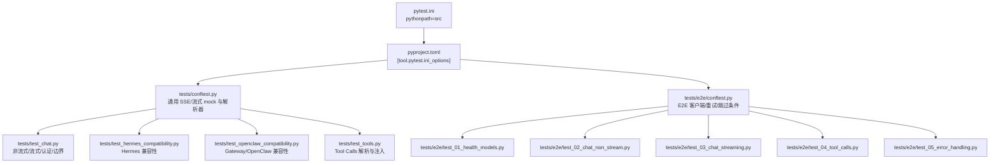
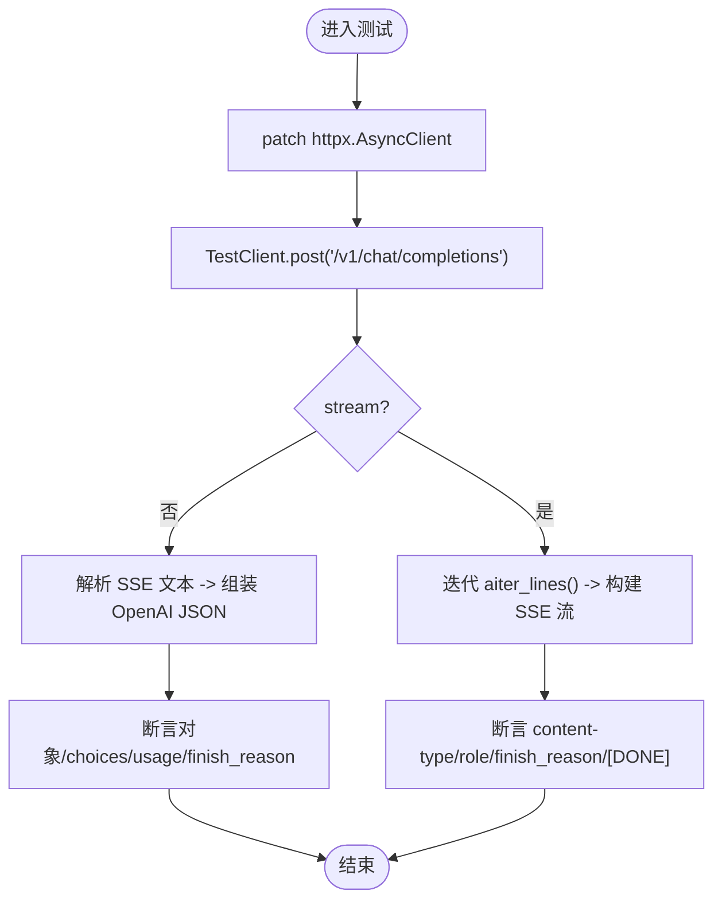
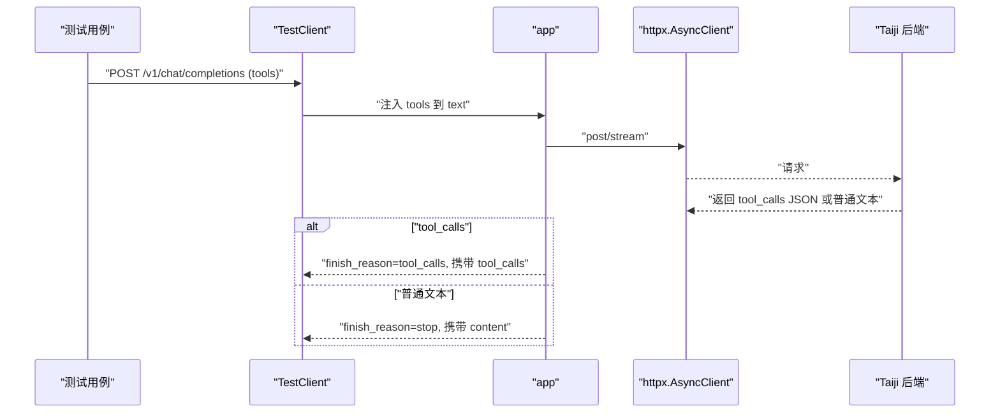
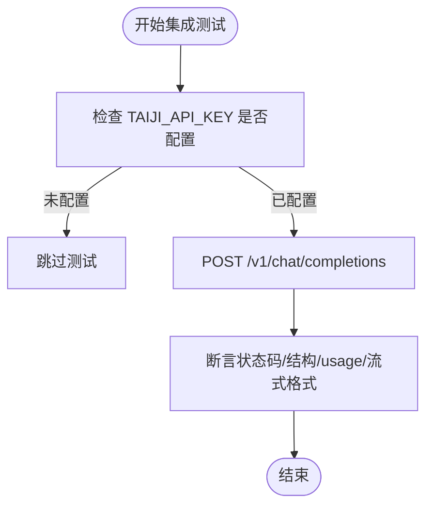
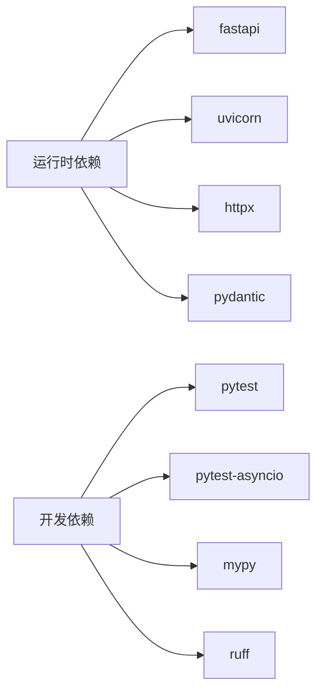

# 测试策略

<cite>
**本文引用的文件**   
- [pytest.ini](file://pytest.ini)
- [pyproject.toml](file://pyproject.toml)
- [requirements.txt](file://requirements.txt)
- [tests/conftest.py](file://tests/conftest.py)
- [tests/e2e/conftest.py](file://tests/e2e/conftest.py)
- [tests/test_chat.py](file://tests/test_chat.py)
- [tests/test_hermes_compatibility.py](file://tests/test_hermes_compatibility.py)
- [tests/test_openclaw_compatibility.py](file://tests/test_openclaw_compatibility.py)
- [tests/test_integration.py](file://tests/test_integration.py)
- [tests/test_tools.py](file://tests/test_tools.py)
- [tests/e2e/test_01_health_models.py](file://tests/e2e/test_01_health_models.py)
- [tests/e2e/test_02_chat_non_stream.py](file://tests/e2e/test_02_chat_non_stream.py)
- [tests/e2e/test_03_chat_streaming.py](file://tests/e2e/test_03_chat_streaming.py)
- [tests/e2e/test_04_tool_calls.py](file://tests/e2e/test_04_tool_calls.py)
- [tests/e2e/test_05_error_handling.py](file://tests/e2e/test_05_error_handling.py)
</cite>

## 目录
1. [引言](#引言)
2. [项目结构](#项目结构)
3. [核心组件](#核心组件)
4. [架构总览](#架构总览)
5. [详细组件分析](#详细组件分析)
6. [依赖关系分析](#依赖关系分析)
7. [性能考量](#性能考量)
8. [故障排查指南](#故障排查指南)
9. [结论](#结论)
10. [附录](#附录)

## 引言
本测试策略文档面向开发者与质量保障人员，系统化说明单元测试、集成测试与端到端（E2E）测试的组织方式、执行流程、配置与数据管理、模拟策略，以及与 OpenAI SDK 和 Hermes Agent 的兼容性验证方法。同时给出新测试用例编写规范、覆盖率要求与持续集成建议，确保测试可维护、可扩展且稳定可靠。

## 项目结构
仓库采用分层组织：
- 顶层配置：pytest 与 pyproject 配置统一入口；requirements 镜像开发依赖。
- tests：按类型划分单元/兼容/集成/E2E 测试，共享 fixtures 集中在 conftest。
- e2e：针对真实运行服务的 HTTP 调用测试，包含健康检查、模型发现、非流式/流式对话、工具调用与错误处理等场景。



图表来源
- [pytest.ini:1-3](file://pytest.ini#L1-L3)
- [pyproject.toml:29-31](file://pyproject.toml#L29-L31)
- [tests/conftest.py:1-160](file://tests/conftest.py#L1-L160)
- [tests/e2e/conftest.py:1-123](file://tests/e2e/conftest.py#L1-L123)

章节来源
- [pytest.ini:1-3](file://pytest.ini#L1-L3)
- [pyproject.toml:1-55](file://pyproject.toml#L1-L55)
- [requirements.txt:1-13](file://requirements.txt#L1-L13)

## 核心组件
- 测试框架与模式
  - pytest + pytest-asyncio，自动异步模式启用。
  - FastAPI TestClient 用于单测与兼容测试的无网络请求路径覆盖。
- 共享夹具与辅助函数
  - 通用 SSE 响应构造、流式上下文模拟、SSE 行生成与解析。
  - E2E 层提供带重试的 httpx.Client、服务存活检测、参数载荷 fixture。
- 测试分类
  - 单元测试：基于 Mock 的接口契约、SSE 解析、OpenAI 序列化行为、认证与边界。
  - 兼容性测试：Hermes（标准 OpenAI 客户端）、OpenClaw（Gateway/SSE 严格格式）。
  - 集成测试：真实 Taiji API 调用，校验完整链路。
  - E2E 测试：对运行中服务发起 HTTP 请求，覆盖健康、模型、对话、流式、工具与错误。

章节来源
- [pyproject.toml:29-31](file://pyproject.toml#L29-L31)
- [tests/conftest.py:1-160](file://tests/conftest.py#L1-L160)
- [tests/e2e/conftest.py:1-123](file://tests/e2e/conftest.py#L1-L123)

## 架构总览
下图展示从测试到应用再到后端的调用链路与关键断点。

```mermaid
sequenceDiagram
participant T as "测试用例"
participant TC as "FastAPI TestClient"
participant APP as "openai_provider.main.app"
participant HTTPX as "httpx.AsyncClient"
participant TAIJI as "Taiji 后端"
T->>TC : "POST /v1/chat/completions"
TC->>APP : "路由处理/鉴权/参数校验"
APP->>HTTPX : "post/stream(携带透传参数)"
alt "非流式"
HTTPX-->>TAIJI : "SSE 文本响应"
TAIJI-->>HTTPX : "data : {...}\ndata : [DONE]"
HTTPX-->>APP : "返回响应体"
APP-->>TC : "OpenAI JSON 响应"
else "流式"
HTTPX-->>TAIJI : "SSE 流"
TAIJI-->>HTTPX : "逐行 data : "
HTTPX-->>APP : "迭代 aiter_lines()"
APP-->>TC : "text/event-stream; charset=utf-8"
end
```

图表来源
- [tests/test_chat.py:73-121](file://tests/test_chat.py#L73-L121)
- [tests/test_chat.py:160-188](file://tests/test_chat.py#L160-L188)
- [tests/test_hermes_compatibility.py:74-96](file://tests/test_hermes_compatibility.py#L74-L96)
- [tests/test_openclaw_compatibility.py:166-188](file://tests/test_openclaw_compatibility.py#L166-L188)

## 详细组件分析

### 单元测试（Unit Tests）
- 目标
  - 验证 OpenAI 兼容接口契约（非流式/流式）、SSE 解析、reasoning_content 提取、token 计算、OpenAIModel 序列化省略 None、未知字段容忍、认证逻辑等。
- 关键实现要点
  - 使用 AsyncMock 与 patch 替换 httpx.AsyncClient.post/stream，构造 SSE 文本或流式上下文。
  - 通过 TestClient 直接调用 app，避免启动真实服务。
  - 断言包括状态码、Content-Type、JSON 结构、usage 字段一致性、finish_reason 时机等。
- 代表性用例
  - 非流式成功/多段拼接/provider 错误映射为 502。
  - 流式 role 在首 chunk、content 分片、finish_reason 仅在最后。
  - reasoning_content 独立 delta 输出与空 think 标签省略。
  - 未知字段静默忽略、超长文本截断、认证开关与 Bearer token 校验。



图表来源
- [tests/test_chat.py:73-121](file://tests/test_chat.py#L73-L121)
- [tests/test_chat.py:160-188](file://tests/test_chat.py#L160-L188)
- [tests/test_chat.py:190-246](file://tests/test_chat.py#L190-L246)
- [tests/test_chat.py:332-357](file://tests/test_chat.py#L332-L357)
- [tests/test_chat.py:455-507](file://tests/test_chat.py#L455-L507)

章节来源
- [tests/test_chat.py:1-508](file://tests/test_chat.py#L1-L508)

### 兼容性测试（Hermes 与 OpenClaw）
- Hermes（标准 OpenAI 客户端）
  - 验证基本非流式/多轮对话、参数透传（temperature/max_tokens/top_p/penalties/user/stop/n 等）、流式 SSE 结构、OpenAI 风格错误体、模型列表、Bearer 认证、边界场景（空内容/None 字段/不支持模型/忽略 n>1）。
- OpenClaw（Gateway/SSE 严格格式）
  - 验证 Content-Type、cache-control/connection 头、SSE 每行以 data: 开头并以 \n\n 分隔、role 仅首 chunk、finish_reason 时机、自定义 X- 头透传、超时与并发稳定性、404 OpenAI 风格、models 端点字段完整性。

```mermaid
classDiagram
class HermesCompatibility {
+ "基本非流式 Chat Completion"
+ "参数透传验证"
+ "流式响应结构"
+ "OpenAI 风格错误体"
+ "认证与边界"
}
class OpenClawCompatibility {
+ "SSE 严格格式"
+ "Header 透传"
+ "finish_reason 时机"
+ "并发与连接稳定性"
+ "模型列表与健康检查"
}
HermesCompatibility --> "使用 TestClient + Mock" : "隔离后端"
OpenClawCompatibility --> "使用 TestClient + Mock" : "隔离后端"
```

图表来源
- [tests/test_hermes_compatibility.py:74-96](file://tests/test_hermes_compatibility.py#L74-L96)
- [tests/test_hermes_compatibility.py:139-217](file://tests/test_hermes_compatibility.py#L139-L217)
- [tests/test_hermes_compatibility.py:287-324](file://tests/test_hermes_compatibility.py#L287-L324)
- [tests/test_openclaw_compatibility.py:166-188](file://tests/test_openclaw_compatibility.py#L166-L188)
- [tests/test_openclaw_compatibility.py:215-265](file://tests/test_openclaw_compatibility.py#L215-L265)
- [tests/test_openclaw_compatibility.py:379-417](file://tests/test_openclaw_compatibility.py#L379-L417)

章节来源
- [tests/test_hermes_compatibility.py:1-462](file://tests/test_hermes_compatibility.py#L1-L462)
- [tests/test_openclaw_compatibility.py:1-417](file://tests/test_openclaw_compatibility.py#L1-L417)

### 工具调用（Tool Calls）
- 目标
  - 验证 tool_calls 的解析、注入与多轮往返；支持非流式与流式两种模式。
- 关键点
  - 非流式：当模型返回 tool_calls JSON 时，正确解析并返回 OpenAI 格式；finish_reason 为 tool_calls；content 可能为空或被省略。
  - 流式：缓冲 tool_calls delta，最终输出 finish_reason=tool_calls；普通文本走常规流式路径。
  - 工具定义注入：将 tools 描述注入到发送给 Taiji 的 text 中；tool 角色消息作为 [Tool Result for ...] 追加。



图表来源
- [tests/test_tools.py:94-131](file://tests/test_tools.py#L94-L131)
- [tests/test_tools.py:134-168](file://tests/test_tools.py#L134-L168)
- [tests/test_tools.py:241-283](file://tests/test_tools.py#L241-L283)
- [tests/test_tools.py:199-235](file://tests/test_tools.py#L199-L235)

章节来源
- [tests/test_tools.py:1-384](file://tests/test_tools.py#L1-L384)

### 集成测试（Integration Tests）
- 目标
  - 真实调用 Taiji API，验证端到端链路、OpenAI 格式合规性、流式 SSE 结构与 usage 统计。
- 前置条件
  - 配置 TAIJI_API_KEY 与 TAIJI_SESSION_COOKIE（环境变量或配置文件），否则跳过。
- 典型场景
  - 短文本/系统提示/长文本截断、流式响应、usage 字段一致性、content 不含 think 标签。



图表来源
- [tests/test_integration.py:19-23](file://tests/test_integration.py#L19-L23)
- [tests/test_integration.py:26-46](file://tests/test_integration.py#L26-L46)
- [tests/test_integration.py:118-156](file://tests/test_integration.py#L118-L156)

章节来源
- [tests/test_integration.py:1-156](file://tests/test_integration.py#L1-L156)

### 端到端测试（E2E Tests）
- 目标
  - 对运行中的服务发起真实 HTTP 请求，覆盖健康检查、版本、模型发现、非流式/流式对话、工具调用与错误处理。
- 特性
  - 默认服务地址 http://localhost:8199，可通过 E2E_BASE_URL 覆盖。
  - 内置 RetryingClient 对 502 进行重试；服务不可达时自动跳过。
  - 统一的 SSE 解析器 parse_sse_chunks 便于断言。
- 模块划分
  - test_01_health_models：健康、版本、props/tags、模型列表与别名。
  - test_02_chat_non_stream：基础对话、usage、唯一 ID、时间戳、CORS。
  - test_03_chat_streaming：SSE 头、[DONE]、role/finish_reason/usage 时机、多轮。
  - test_04_tool_calls：非流式/流式 tool_calls、tool_choice、多轮往返。
  - test_05_error_handling：请求校验、流式错误、并发、认证、大负载。

```mermaid
sequenceDiagram
participant CI as "CI/本地"
participant S as "运行中服务"
participant EC as "E2E Client"
participant P as "Parse SSE"
CI->>EC : "启动 E2E 套件"
EC->>S : "GET /health"
S-->>EC : "200 {status : 'ok'}"
EC->>S : "POST /v1/chat/completions (stream=true)"
S-->>EC : "text/event-stream; charset=utf-8"
EC->>P : "parse_sse_chunks(text)"
P-->>EC : "chunks[]"
EC->>EC : "断言结构/usage/finish_reason/[DONE]"
```

图表来源
- [tests/e2e/conftest.py:27-40](file://tests/e2e/conftest.py#L27-L40)
- [tests/e2e/conftest.py:47-75](file://tests/e2e/conftest.py#L47-L75)
- [tests/e2e/conftest.py:108-123](file://tests/e2e/conftest.py#L108-L123)
- [tests/e2e/test_01_health_models.py:9-31](file://tests/e2e/test_01_health_models.py#L9-L31)
- [tests/e2e/test_03_chat_streaming.py:13-28](file://tests/e2e/test_03_chat_streaming.py#L13-L28)
- [tests/e2e/test_04_tool_calls.py:52-89](file://tests/e2e/test_04_tool_calls.py#L52-L89)

章节来源
- [tests/e2e/conftest.py:1-123](file://tests/e2e/conftest.py#L1-L123)
- [tests/e2e/test_01_health_models.py:1-103](file://tests/e2e/test_01_health_models.py#L1-L103)
- [tests/e2e/test_02_chat_non_stream.py:1-179](file://tests/e2e/test_02_chat_non_stream.py#L1-L179)
- [tests/e2e/test_03_chat_streaming.py:1-146](file://tests/e2e/test_03_chat_streaming.py#L1-L146)
- [tests/e2e/test_04_tool_calls.py:1-226](file://tests/e2e/test_04_tool_calls.py#L1-L226)
- [tests/e2e/test_05_error_handling.py:1-155](file://tests/e2e/test_05_error_handling.py#L1-L155)

## 依赖关系分析
- 运行时依赖
  - fastapi、uvicorn、httpx、pydantic、pydantic-settings。
- 开发依赖
  - pytest、pytest-asyncio、mypy、ruff。
- 测试相关
  - FastAPI TestClient 用于无网络测试；httpx 用于 E2E 真实调用。
  - pytest-asyncio 启用自动异步模式。



图表来源
- [pyproject.toml:10-24](file://pyproject.toml#L10-L24)
- [requirements.txt:1-13](file://requirements.txt#L1-L13)

章节来源
- [pyproject.toml:1-55](file://pyproject.toml#L1-L55)
- [requirements.txt:1-13](file://requirements.txt#L1-L13)

## 性能考量
- 流式响应
  - 优先使用 aiter_lines 增量消费，避免一次性加载大响应体。
  - 合理设置超时与重试（E2E 层已内置 502 重试）。
- 并发与资源
  - 使用线程池并发健康检查与聊天请求，确保互不干扰与唯一 ID。
- 内存与 CPU
  - 避免在测试中构造超大 payload；必要时在单测中捕获并断言截断逻辑。

## 故障排查指南
- 常见问题
  - 服务未启动：E2E 测试自动跳过，需先启动服务并配置凭据。
  - 认证失败：确认 API_KEY 与 Authorization: Bearer 是否正确。
  - SSE 解析异常：检查 data: 行与 [DONE] 标记；使用 parse_sse_chunks 辅助。
  - 超时/限流：E2E 层对 502 自动重试；若仍失败，检查后端状态与配额。
- 定位步骤
  - 查看响应状态码与 error.type/message。
  - 打印 chunks 列表，核对 role/content/finish_reason 时机。
  - 对比 OpenAI 官方响应结构，确保字段一致。

章节来源
- [tests/e2e/conftest.py:27-40](file://tests/e2e/conftest.py#L27-L40)
- [tests/e2e/test_05_error_handling.py:9-55](file://tests/e2e/test_05_error_handling.py#L9-L55)
- [tests/test_chat.py:109-121](file://tests/test_chat.py#L109-L121)

## 结论
本测试策略通过分层设计（单元/兼容/集成/E2E）与完善的夹具体系，全面覆盖了 OpenAI 兼容接口的功能、格式与稳定性。借助 Mock 与真实调用相结合的方法，既保证了快速反馈，又确保了端到端可靠性。遵循本文档的编写规范与最佳实践，可有效提升测试质量与可维护性。

## 附录

### 测试框架配置
- pytest 与异步
  - pythonpath 指向 src，启用 asyncio_mode=auto。
- 开发依赖
  - pytest、pytest-asyncio、mypy、ruff。
- 运行环境
  - Python >= 3.11。

章节来源
- [pytest.ini:1-3](file://pytest.ini#L1-L3)
- [pyproject.toml:29-31](file://pyproject.toml#L29-L31)
- [pyproject.toml:18-24](file://pyproject.toml#L18-L24)

### 测试数据管理与模拟策略
- 通用 SSE 与流式夹具
  - make_sse_response/make_stream_mock/make_sse_lines/parse_sse_chunks。
- E2E 客户端
  - RetryingClient 包装 httpx.Client，对 502 自动重试；会话级复用。
- 参数载荷
  - chat_payload/stream_payload 最小化请求体，便于组合扩展。

章节来源
- [tests/conftest.py:16-91](file://tests/conftest.py#L16-L91)
- [tests/e2e/conftest.py:47-75](file://tests/e2e/conftest.py#L47-L75)
- [tests/e2e/conftest.py:94-106](file://tests/e2e/conftest.py#L94-L106)

### 兼容性测试实现方法（OpenAI SDK 与 Hermes Agent）
- 标准 OpenAI 客户端（Hermes）
  - 验证基本调用、参数透传、流式结构、错误体、模型列表与认证。
- Gateway（OpenClaw）
  - 严格 SSE 格式、Header 透传、finish_reason 时机、并发与连接稳定性、404 风格。

章节来源
- [tests/test_hermes_compatibility.py:74-96](file://tests/test_hermes_compatibility.py#L74-L96)
- [tests/test_openclaw_compatibility.py:166-188](file://tests/test_openclaw_compatibility.py#L166-L188)

### 编写新测试用例的指导原则与最佳实践
- 命名与组织
  - 文件名体现场景（如 test_hermes_compatibility.py），类与方法名表达意图。
- 夹具优先
  - 复用 conftest 中的 SSE/流式夹具与解析器，减少重复代码。
- 明确断言
  - 断言状态码、Content-Type、JSON 结构、usage 一致性、finish_reason 时机、[DONE] 结尾。
- 隔离外部依赖
  - 单测使用 Mock；E2E 使用 RetryingClient 与服务存活检测。
- 可维护性
  - 保持最小必要请求体；参数化测试覆盖多种输入；避免硬编码敏感信息。

### 测试覆盖率要求
- 当前仓库未显式配置覆盖率阈值与报告插件。
- 建议
  - 引入 pytest-cov，设定最低覆盖率阈值（例如 80%），并在 CI 中阻断低覆盖率提交。
  - 重点覆盖：SSE 解析、reasoning_content 提取、tool_calls 解析与注入、认证与错误映射。

### 持续集成配置建议
- 阶段
  - 安装依赖 -> 静态检查（mypy/ruff）-> 单元测试 -> 兼容性测试 -> 集成/E2E（可选，按需开启）。
- 并行与缓存
  - 并行运行测试集；缓存 pip 包与虚拟环境。
- 环境与凭据
  - 使用安全存储注入 TAIJI_API_KEY/TAIJI_SESSION_COOKIE；E2E 服务地址通过变量注入。
- 结果上报
  - 生成测试报告与覆盖率报告，失败时立即通知。