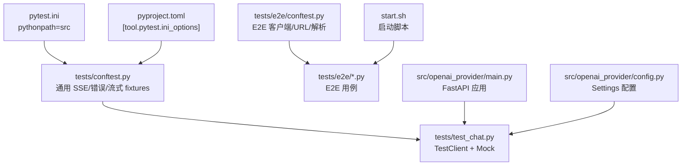
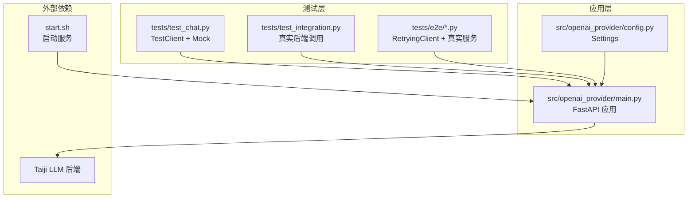
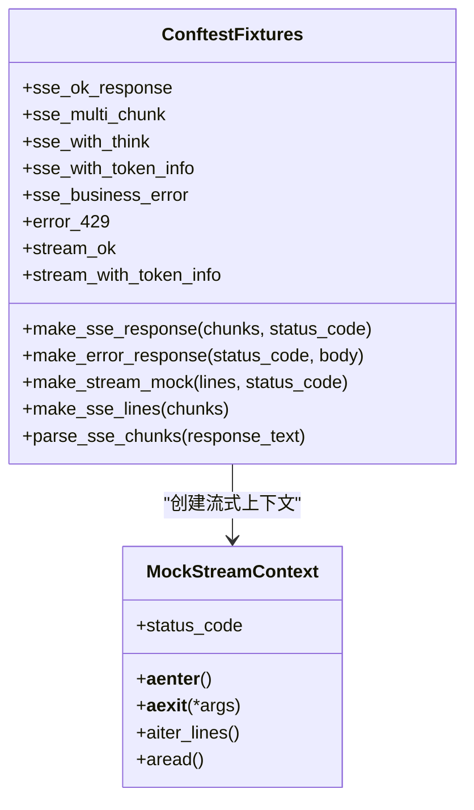
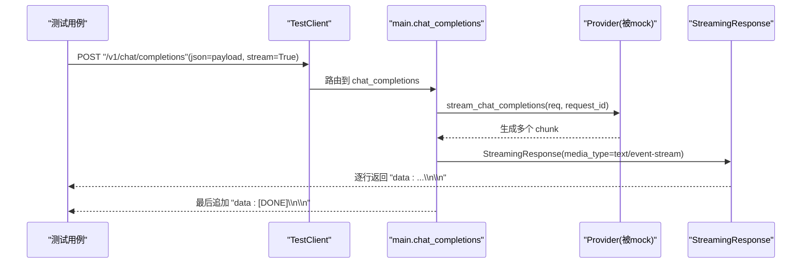
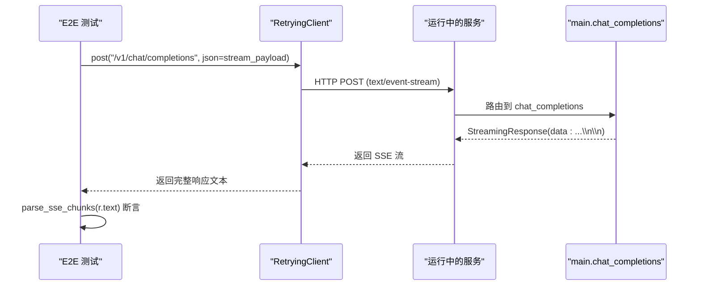
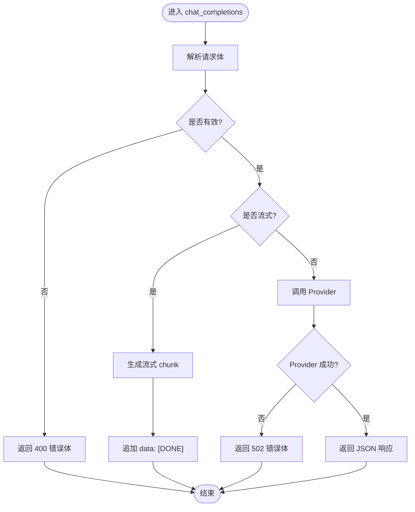
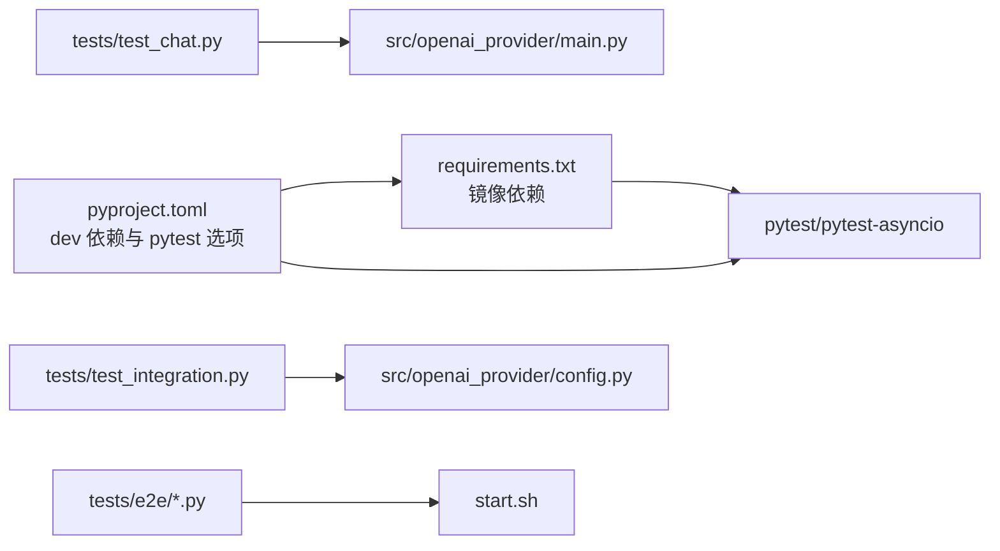

# 测试配置与管理

<cite>
**本文引用的文件**   
- [pytest.ini](file://pytest.ini)
- [pyproject.toml](file://pyproject.toml)
- [requirements.txt](file://requirements.txt)
- [tests/conftest.py](file://tests/conftest.py)
- [tests/e2e/conftest.py](file://tests/e2e/conftest.py)
- [tests/test_chat.py](file://tests/test_chat.py)
- [tests/test_integration.py](file://tests/test_integration.py)
- [tests/e2e/test_01_health_models.py](file://tests/e2e/test_01_health_models.py)
- [tests/e2e/test_03_chat_streaming.py](file://tests/e2e/test_03_chat_streaming.py)
- [tests/e2e/test_05_error_handling.py](file://tests/e2e/test_05_error_handling.py)
- [src/openai_provider/main.py](file://src/openai_provider/main.py)
- [src/openai_provider/config.py](file://src/openai_provider/config.py)
- [start.sh](file://start.sh)
</cite>

## 目录
1. [简介](#简介)
2. [项目结构](#项目结构)
3. [核心组件](#核心组件)
4. [架构总览](#架构总览)
5. [详细组件分析](#详细组件分析)
6. [依赖分析](#依赖分析)
7. [性能考虑](#性能考虑)
8. [故障排查指南](#故障排查指南)
9. [结论](#结论)
10. [附录](#附录)

## 简介
本文件面向测试工程师与开发者，系统化说明本项目的 pytest 配置、测试目录结构与命名约定；深入介绍共享 fixtures 的设计原则与最佳实践（SSE 响应模拟、错误处理、流式测试辅助函数）；解释测试环境变量管理与“测试数据库”（本项目为外部服务/后端 API，无本地数据库）的配置方式；并提供覆盖率统计、并行执行与持续集成集成的落地方案。

## 项目结构
测试相关的关键位置与职责：
- 根级配置
  - pytest.ini：设置 pythonpath，使 tests 可直接导入 src 下的包。
  - pyproject.toml：集中管理开发依赖与 pytest 的 asyncio 模式等选项。
  - requirements.txt：镜像运行时与开发依赖，便于快速安装。
- 共享 fixtures
  - tests/conftest.py：通用 SSE mock、错误响应构造、流式上下文模拟、SSE 解析工具与常用 fixtures。
  - tests/e2e/conftest.py：E2E 专用客户端（带重试）、基础 URL、请求体 fixtures、SSE 解析工具。
- 单元测试与集成测试
  - tests/test_chat.py：基于 FastAPI TestClient 的单元/集成混合用例，覆盖非流式、流式、认证、边界场景等。
  - tests/test_integration.py：真实调用 Taiji 后端的端到端链路验证（需配置 TAIJI_API_KEY）。
- E2E 测试
  - tests/e2e/*：对运行中的服务发起真实 HTTP 请求，包含健康检查、模型发现、流式聊天、错误处理等。

图示来源
- [pytest.ini:1-3](file://pytest.ini#L1-L3)
- [pyproject.toml:29-32](file://pyproject.toml#L29-L32)
- [tests/conftest.py:1-160](file://tests/conftest.py#L1-L160)
- [tests/e2e/conftest.py:1-123](file://tests/e2e/conftest.py#L1-L123)
- [tests/test_chat.py:1-508](file://tests/test_chat.py#L1-L508)
- [src/openai_provider/main.py:1-342](file://src/openai_provider/main.py#L1-L342)
- [src/openai_provider/config.py:1-56](file://src/openai_provider/config.py#L1-L56)
- [start.sh:1-123](file://start.sh#L1-L123)

章节来源
- [pytest.ini:1-3](file://pytest.ini#L1-L3)
- [pyproject.toml:1-55](file://pyproject.toml#L1-L55)
- [requirements.txt:1-13](file://requirements.txt#L1-L13)
- [tests/conftest.py:1-160](file://tests/conftest.py#L1-L160)
- [tests/e2e/conftest.py:1-123](file://tests/e2e/conftest.py#L1-L123)
- [tests/test_chat.py:1-508](file://tests/test_chat.py#L1-L508)
- [tests/test_integration.py:1-156](file://tests/test_integration.py#L1-L156)
- [tests/e2e/test_01_health_models.py:1-103](file://tests/e2e/test_01_health_models.py#L1-L103)
- [tests/e2e/test_03_chat_streaming.py:1-146](file://tests/e2e/test_03_chat_streaming.py#L1-L146)
- [tests/e2e/test_05_error_handling.py:1-155](file://tests/e2e/test_05_error_handling.py#L1-L155)
- [src/openai_provider/main.py:1-342](file://src/openai_provider/main.py#L1-L342)
- [src/openai_provider/config.py:1-56](file://src/openai_provider/config.py#L1-L56)
- [start.sh:1-123](file://start.sh#L1-L123)

## 核心组件
- pytest 配置入口
  - pytest.ini：设置 pythonpath=src，确保测试可直连导入 src 包。
  - pyproject.toml：在 [tool.pytest.ini_options] 中声明 pythonpath 与 asyncio_mode="auto"，统一 pytest 行为。
- 共享 fixtures（tests/conftest.py）
  - make_sse_response：构造非流式 SSE 文本响应（含 data: 行与 [DONE]）。
  - make_error_response：构造错误响应（状态码、文本、content-type）。
  - MockStreamContext / make_stream_mock：实现 httpx.stream 上下文协议，支持 aiter_lines/aread。
  - make_sse_lines：将 JSON chunks 转为标准 SSE 行列表。
  - parse_sse_chunks：从 SSE 文本解析出 chunk 字典列表（不含 [DONE]）。
  - 常用 fixtures：sse_ok_response、sse_multi_chunk、sse_with_think、sse_with_token_info、sse_business_error、error_429、stream_ok、stream_with_token_info。
- E2E 共享夹具（tests/e2e/conftest.py）
  - RetryingClient：包装 httpx.Client，对 502 自动重试。
  - base_url/client/chat_payload/stream_payload：会话级或测试级复用。
  - parse_sse_chunks：E2E 专用的 SSE 解析工具（容错 JSON 解析）。
- 应用与配置
  - src/openai_provider/main.py：FastAPI 应用，提供 /v1/chat/completions、/v1/models 等 OpenAI 兼容接口，支持流式与非流式。
  - src/openai_provider/config.py：基于 pydantic-settings 的全局 Settings，读取 .env 与环境变量，提供默认值与校验。

章节来源
- [pytest.ini:1-3](file://pytest.ini#L1-L3)
- [pyproject.toml:29-32](file://pyproject.toml#L29-L32)
- [tests/conftest.py:1-160](file://tests/conftest.py#L1-L160)
- [tests/e2e/conftest.py:1-123](file://tests/e2e/conftest.py#L1-L123)
- [src/openai_provider/main.py:1-342](file://src/openai_provider/main.py#L1-L342)
- [src/openai_provider/config.py:1-56](file://src/openai_provider/config.py#L1-L56)

## 架构总览
下图展示测试层如何与主应用交互，以及 E2E 测试如何通过真实 HTTP 访问运行中的服务。

图示来源
- [tests/test_chat.py:1-508](file://tests/test_chat.py#L1-L508)
- [tests/test_integration.py:1-156](file://tests/test_integration.py#L1-L156)
- [tests/e2e/test_01_health_models.py:1-103](file://tests/e2e/test_01_health_models.py#L1-L103)
- [tests/e2e/test_03_chat_streaming.py:1-146](file://tests/e2e/test_03_chat_streaming.py#L1-L146)
- [tests/e2e/test_05_error_handling.py:1-155](file://tests/e2e/test_05_error_handling.py#L1-L155)
- [src/openai_provider/main.py:1-342](file://src/openai_provider/main.py#L1-L342)
- [src/openai_provider/config.py:1-56](file://src/openai_provider/config.py#L1-L56)
- [start.sh:1-123](file://start.sh#L1-L123)

## 详细组件分析

### 共享 fixtures 设计与最佳实践
- 设计原则
  - 单一事实来源：所有 SSE 构造与解析逻辑集中在 conftest，避免在各测试文件中重复实现。
  - 分层清晰：通用 fixtures（tests/conftest.py）与 E2E fixtures（tests/e2e/conftest.py）分离，职责明确。
  - 可扩展性：通过工厂函数（make_*）组合复杂场景，如多段 SSE、think 标签、token 用量、业务错误等。
- 关键能力
  - 非流式 SSE 构造：make_sse_response 自动生成 data: 行与 [DONE]，并设置 content-type。
  - 错误响应构造：make_error_response 支持自定义状态码与 body。
  - 流式上下文模拟：MockStreamContext 实现 async with 与 aiter_lines，适配 httpx.AsyncClient.stream。
  - SSE 解析：parse_sse_chunks 过滤 [DONE] 并解析 JSON，E2E 版本增加 JSONDecodeError 容错。
- 使用建议
  - 优先使用 fixtures（如 sse_ok_response、stream_ok），减少样板代码。
  - 针对 think 标签与 token 用量场景，使用专用 fixtures（sse_with_think、sse_with_token_info、stream_with_token_info）。
  - 在需要精确控制 SSE 行的场景，使用 make_sse_lines 与 make_stream_mock 组合。

图示来源
- [tests/conftest.py:1-160](file://tests/conftest.py#L1-L160)

章节来源
- [tests/conftest.py:1-160](file://tests/conftest.py#L1-L160)

### SSE 响应模拟与流式测试流程
- 非流式路径
  - 通过 patch httpx.AsyncClient.post 返回 make_sse_response 构造的响应对象，断言最终 JSON 结构、usage、reasoning_content 等。
- 流式路径
  - 通过 patch httpx.AsyncClient.stream 返回 MockStreamContext，逐行 yield SSE 数据，断言 content-type、chunk 顺序、finish_reason 时机、[DONE] 结尾等。
- 典型序列图（流式）

图示来源
- [tests/test_chat.py:160-246](file://tests/test_chat.py#L160-L246)
- [src/openai_provider/main.py:185-218](file://src/openai_provider/main.py#L185-L218)

章节来源
- [tests/test_chat.py:160-246](file://tests/test_chat.py#L160-L246)
- [src/openai_provider/main.py:185-218](file://src/openai_provider/main.py#L185-L218)

### E2E 测试与真实服务交互
- 前置条件
  - 通过 start.sh dev --port 8199 启动服务。
  - 设置环境变量 E2E_BASE_URL（可选）以覆盖默认地址。
  - 若启用认证，需在 .env 或环境中配置 API_KEY。
- 特性
  - 服务存活检测：E2E 模块在加载时尝试 GET /health，未连通则跳过测试。
  - 重试机制：RetryingClient 对 502 自动重试，降低网络抖动影响。
  - 请求体 fixtures：chat_payload、stream_payload 简化用例编写。
- 典型序列图（E2E 流式）

图示来源
- [tests/e2e/conftest.py:47-91](file://tests/e2e/conftest.py#L47-L91)
- [tests/e2e/test_03_chat_streaming.py:13-70](file://tests/e2e/test_03_chat_streaming.py#L13-L70)
- [src/openai_provider/main.py:185-218](file://src/openai_provider/main.py#L185-L218)

章节来源
- [tests/e2e/conftest.py:1-123](file://tests/e2e/conftest.py#L1-L123)
- [tests/e2e/test_03_chat_streaming.py:1-146](file://tests/e2e/test_03_chat_streaming.py#L1-L146)
- [src/openai_provider/main.py:185-218](file://src/openai_provider/main.py#L185-L218)

### 错误处理与边界场景
- 非流式错误
  - ProviderError 映射为 502，并附带 OpenAI 风格 error 体。
  - 请求体验证失败返回 400，错误体包含 type 与 message。
- 流式错误
  - 流式异常会作为 data: {...} 的 chunk 返回，并在最后输出 [DONE]。
- 常见边界
  - 空请求体、非法 JSON、非法 role、超长 prompt、并发请求、大 system message、大量 messages。
- 流程图（错误分支）

图示来源
- [src/openai_provider/main.py:163-241](file://src/openai_provider/main.py#L163-L241)
- [tests/e2e/test_05_error_handling.py:9-77](file://tests/e2e/test_05_error_handling.py#L9-L77)

章节来源
- [src/openai_provider/main.py:163-241](file://src/openai_provider/main.py#L163-L241)
- [tests/e2e/test_05_error_handling.py:1-155](file://tests/e2e/test_05_error_handling.py#L1-L155)

### 测试目录结构与命名约定
- 目录组织
  - tests/：单元测试与集成测试（基于 TestClient 与 Mock）。
  - tests/e2e/：端到端测试（对运行中服务发起真实 HTTP 请求）。
- 命名约定
  - 测试文件：test_*.py，按功能或编号前缀组织（如 test_01_health_models.py、test_03_chat_streaming.py）。
  - 类与方法：使用描述性名称，体现被测场景（如 TestHealthEndpoint、test_health_returns_200_ok）。
  - Fixtures：在 conftest.py 中定义，按作用域（session/function）合理划分。

章节来源
- [tests/e2e/test_01_health_models.py:1-103](file://tests/e2e/test_01_health_models.py#L1-L103)
- [tests/e2e/test_03_chat_streaming.py:1-146](file://tests/e2e/test_03_chat_streaming.py#L1-L146)
- [tests/e2e/test_05_error_handling.py:1-155](file://tests/e2e/test_05_error_handling.py#L1-L155)

## 依赖分析
- 开发与测试依赖
  - pytest、pytest-asyncio、mypy、ruff 等通过 pyproject.toml 的 optional-dependencies.dev 与 requirements.txt 共同维护。
- 运行时依赖
  - fastapi、uvicorn、httpx、pydantic、pydantic-settings 等由 pyproject.toml 与 requirements.txt 同步。
- 测试与应用的耦合点
  - tests/test_chat.py 直接导入 openai_provider.main.app 并使用 TestClient。
  - tests/test_integration.py 依赖 settings.TAIJI_API_KEY 决定是否跳过。
  - tests/e2e 依赖运行中的服务与 E2E_BASE_URL。

图示来源
- [pyproject.toml:18-32](file://pyproject.toml#L18-L32)
- [requirements.txt:1-13](file://requirements.txt#L1-L13)
- [tests/test_chat.py:1-508](file://tests/test_chat.py#L1-L508)
- [tests/test_integration.py:1-156](file://tests/test_integration.py#L1-L156)
- [tests/e2e/conftest.py:1-123](file://tests/e2e/conftest.py#L1-L123)
- [src/openai_provider/main.py:1-342](file://src/openai_provider/main.py#L1-L342)
- [src/openai_provider/config.py:1-56](file://src/openai_provider/config.py#L1-L56)
- [start.sh:1-123](file://start.sh#L1-L123)

章节来源
- [pyproject.toml:1-55](file://pyproject.toml#L1-L55)
- [requirements.txt:1-13](file://requirements.txt#L1-L13)
- [tests/test_chat.py:1-508](file://tests/test_chat.py#L1-L508)
- [tests/test_integration.py:1-156](file://tests/test_integration.py#L1-L156)
- [tests/e2e/conftest.py:1-123](file://tests/e2e/conftest.py#L1-L123)
- [src/openai_provider/main.py:1-342](file://src/openai_provider/main.py#L1-L342)
- [src/openai_provider/config.py:1-56](file://src/openai_provider/config.py#L1-L56)
- [start.sh:1-123](file://start.sh#L1-L123)

## 性能考虑
- 流式响应
  - 服务端 StreamingResponse 逐块发送，客户端应增量消费，避免一次性读取整个响应体。
  - 断言 finish_reason 仅出现在倒数第二个 chunk，且 [DONE] 必须存在。
- 并发与重试
  - E2E 客户端内置 502 重试，有助于缓解上游限流或瞬时不可用。
  - 并发测试示例展示了线程池并发调用，注意连接池与超时设置。
- 资源清理
  - 应用生命周期中关闭 Provider 资源，测试环境应避免长时间占用连接。

[本节为通用指导，不直接分析具体文件]

## 故障排查指南
- 常见问题
  - 服务未启动：E2E 测试会在加载时检测 /health，未连通则跳过。请确认 start.sh dev --port 8199 已运行。
  - 认证失败：若配置了 API_KEY，未携带正确 Bearer token 将返回 401。
  - 流式格式错误：确保 content-type 包含 text/event-stream，并以 data: [DONE] 结尾。
  - 解析异常：E2E 的 parse_sse_chunks 对 JSON 解析失败进行容错，忽略无效行。
- 定位方法
  - 查看应用日志：logs/taiji-provider.log（JSON 结构化日志）。
  - 使用 E2E_FORCE 强制运行（即使服务不可达），以便观察错误信息。
  - 在测试中打印 chunks 预览，确认 SSE 内容是否符合预期。

章节来源
- [tests/e2e/conftest.py:27-40](file://tests/e2e/conftest.py#L27-L40)
- [src/openai_provider/main.py:319-330](file://src/openai_provider/main.py#L319-L330)
- [tests/e2e/test_05_error_handling.py:9-77](file://tests/e2e/test_05_error_handling.py#L9-L77)

## 结论
本项目测试体系围绕 pytest 构建，采用共享 fixtures 与分层目录组织，兼顾单元测试、集成测试与 E2E 测试。通过统一的 SSE 模拟与解析工具，显著降低了流式测试的复杂度；借助环境变量与 .env 管理配置，实现了灵活的测试环境切换。建议在 CI 中引入覆盖率统计与并行执行，进一步提升质量与效率。

[本节为总结性内容，不直接分析具体文件]

## 附录

### pytest 配置文件设置
- pytest.ini
  - pythonpath = src：允许 tests 直接导入 src 包。
- pyproject.toml
  - [tool.pytest.ini_options]
    - pythonpath = ["src"]
    - asyncio_mode = "auto"：自动识别异步测试。
- requirements.txt
  - 镜像 pyproject.toml 的 dev 依赖，便于快速安装。

章节来源
- [pytest.ini:1-3](file://pytest.ini#L1-L3)
- [pyproject.toml:29-32](file://pyproject.toml#L29-L32)
- [requirements.txt:8-13](file://requirements.txt#L8-L13)

### 测试目录结构与命名约定
- 目录
  - tests/：单元测试与集成测试。
  - tests/e2e/：端到端测试。
- 命名
  - 文件：test_*.py，可按编号或功能分组。
  - 类与方法：语义化命名，突出被测场景。
  - Fixtures：集中于 conftest.py，按作用域划分。

章节来源
- [tests/e2e/test_01_health_models.py:1-103](file://tests/e2e/test_01_health_models.py#L1-L103)
- [tests/e2e/test_03_chat_streaming.py:1-146](file://tests/e2e/test_03_chat_streaming.py#L1-L146)
- [tests/e2e/test_05_error_handling.py:1-155](file://tests/e2e/test_05_error_handling.py#L1-L155)

### 共享 fixtures 的设计原则与最佳实践
- 单一事实来源：SSE 构造与解析集中在 conftest。
- 分层清晰：通用 fixtures 与 E2E fixtures 分离。
- 可扩展性：工厂函数组合复杂场景。
- 使用建议：优先使用 fixtures，必要时用 make_* 精细控制。

章节来源
- [tests/conftest.py:1-160](file://tests/conftest.py#L1-L160)
- [tests/e2e/conftest.py:1-123](file://tests/e2e/conftest.py#L1-L123)

### SSE 响应模拟、错误处理与流式测试辅助函数
- SSE 模拟：make_sse_response、make_stream_mock、make_sse_lines。
- 错误处理：make_error_response、ProviderError 映射为 502。
- 流式辅助：MockStreamContext、parse_sse_chunks。

章节来源
- [tests/conftest.py:1-160](file://tests/conftest.py#L1-L160)
- [src/openai_provider/main.py:185-241](file://src/openai_provider/main.py#L185-L241)

### 测试环境变量管理与测试数据库配置
- 环境变量
  - API_KEY：可选认证密钥。
  - TAIJI_API_KEY、TAIJI_SESSION_COOKIE：后端鉴权。
  - APP_HOST、APP_PORT：服务监听。
  - E2E_BASE_URL：E2E 服务地址。
  - E2E_FORCE：强制运行 E2E（即使服务不可达）。
- “测试数据库”
  - 本项目无本地数据库，依赖外部 Taiji 后端；通过 Settings 与 .env 管理。

章节来源
- [src/openai_provider/config.py:12-56](file://src/openai_provider/config.py#L12-L56)
- [tests/e2e/conftest.py:20-40](file://tests/e2e/conftest.py#L20-L40)
- [start.sh:54-61](file://start.sh#L54-L61)

### 测试覆盖率统计、并行测试执行与持续集成集成
- 覆盖率
  - 安装 pytest-cov，运行：pytest --cov=openai_provider --cov-report=term-missing
- 并行执行
  - 安装 pytest-xdist，运行：pytest -n auto
- 持续集成（CI）
  - 步骤建议：
    - 安装依赖：pip install -r requirements.txt
    - 启动服务：bash start.sh dev --port 8199
    - 运行单元测试：pytest tests/test_chat.py
    - 运行集成测试（可选）：pytest tests/test_integration.py
    - 运行 E2E 测试（可选）：pytest tests/e2e/
    - 生成覆盖率报告：pytest --cov=openai_provider --cov-report=html
  - 环境变量准备：在 CI 中注入 API_KEY、TAIJI_API_KEY、TAIJI_SESSION_COOKIE 等。

[本节为通用指导，不直接分析具体文件]