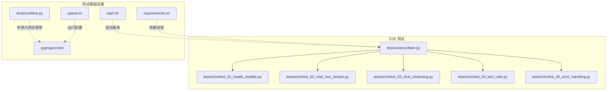
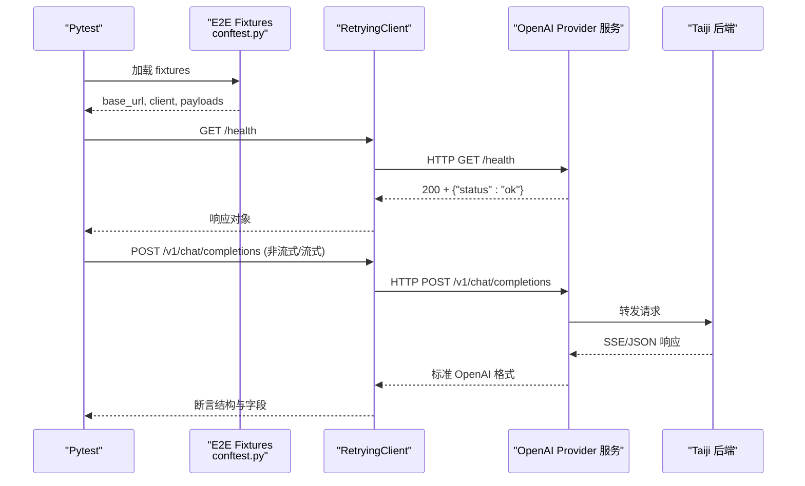
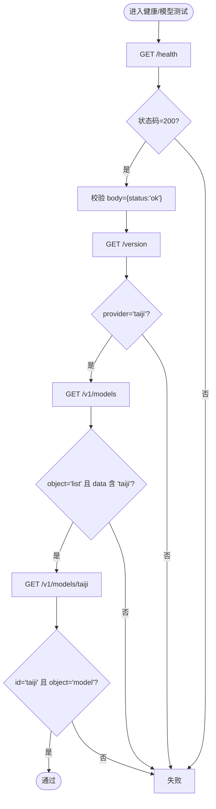
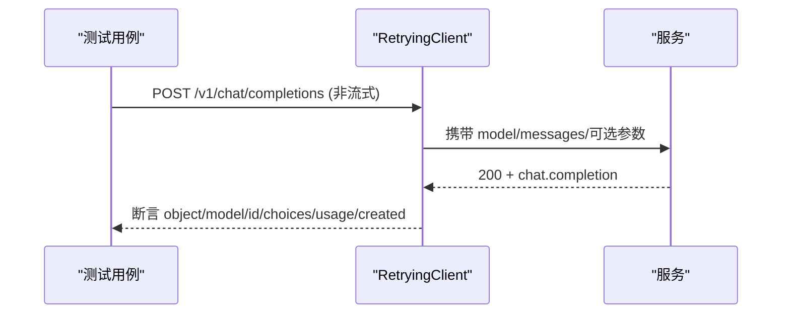
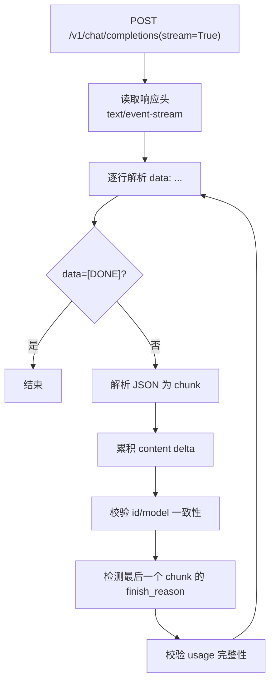
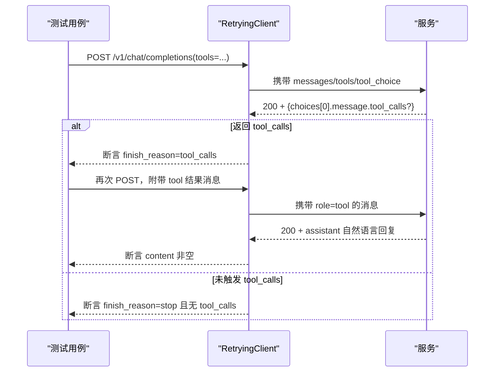
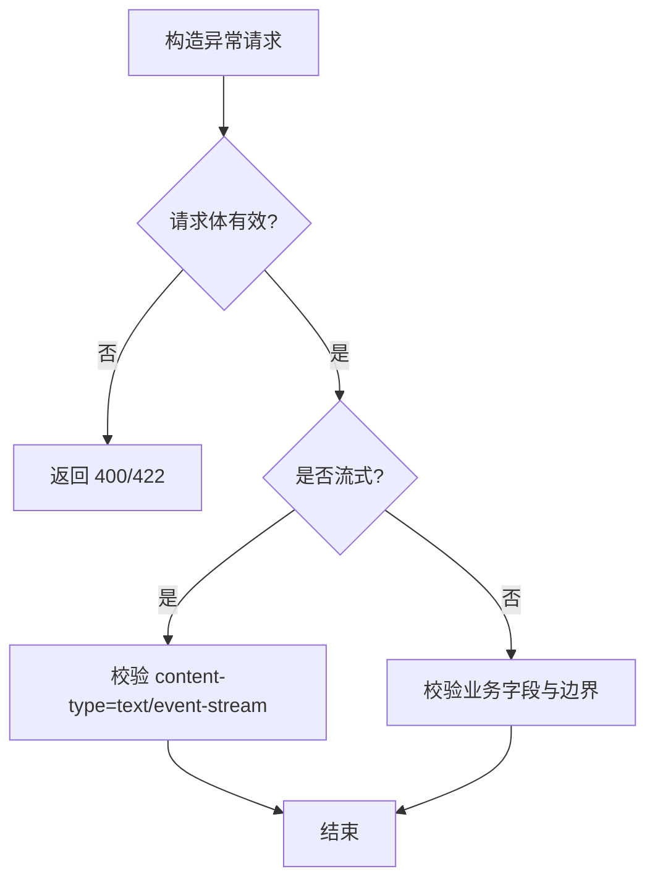
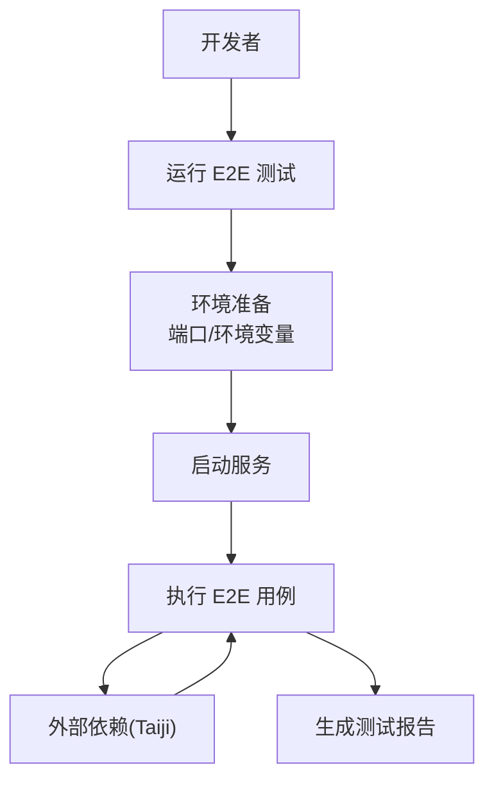
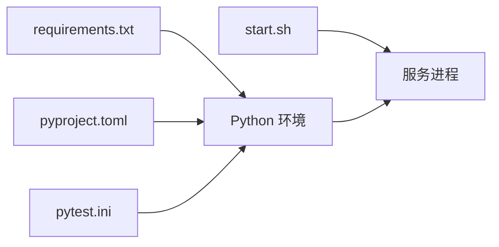

# 端到端测试

<cite>
**本文引用的文件**   
- [tests/e2e/conftest.py](file://tests/e2e/conftest.py)
- [tests/e2e/test_01_health_models.py](file://tests/e2e/test_01_health_models.py)
- [tests/e2e/test_02_chat_non_stream.py](file://tests/e2e/test_02_chat_non_stream.py)
- [tests/e2e/test_03_chat_streaming.py](file://tests/e2e/test_03_chat_streaming.py)
- [tests/e2e/test_04_tool_calls.py](file://tests/e2e/test_04_tool_calls.py)
- [tests/e2e/test_05_error_handling.py](file://tests/e2e/test_05_error_handling.py)
- [tests/conftest.py](file://tests/conftest.py)
- [pytest.ini](file://pytest.ini)
- [pyproject.toml](file://pyproject.toml)
- [start.sh](file://start.sh)
- [requirements.txt](file://requirements.txt)
</cite>

## 目录
1. [简介](#简介)
2. [项目结构](#项目结构)
3. [核心组件](#核心组件)
4. [架构总览](#架构总览)
5. [详细组件分析](#详细组件分析)
6. [依赖分析](#依赖分析)
7. [性能考虑](#性能考虑)
8. [故障排查指南](#故障排查指南)
9. [结论](#结论)
10. [附录](#附录)

## 简介
本文件面向“端到端（E2E）测试”的完整实践，覆盖健康检查、模型发现、聊天完成（非流式与流式）、工具调用以及错误处理的全链路验证。文档同时给出 E2E 环境配置、测试数据准备与管理、用例编写规范、断言策略、报告生成方法，以及对外部依赖与服务可用性问题的应对策略。

## 项目结构
E2E 测试位于 tests/e2e 目录下，围绕真实运行的服务发起 HTTP 请求进行验证；顶层 tests 目录包含基于 FastAPI TestClient 的单元测试与集成测试。关键文件职责如下：
- tests/e2e/conftest.py：E2E 共享 fixtures、重试客户端、SSE 解析器、跳过条件等
- tests/e2e/test_*.py：按场景拆分的 E2E 用例集
- tests/conftest.py：通用 SSE mock 与辅助函数（用于单元测试/集成测试）
- pytest.ini / pyproject.toml：pytest 运行参数与可选依赖
- start.sh：服务启动脚本（含环境变量说明）
- requirements.txt：运行时与开发依赖清单

图表来源
- [tests/e2e/conftest.py:1-123](file://tests/e2e/conftest.py#L1-L123)
- [tests/e2e/test_01_health_models.py:1-103](file://tests/e2e/test_01_health_models.py#L1-L103)
- [tests/e2e/test_02_chat_non_stream.py:1-179](file://tests/e2e/test_02_chat_non_stream.py#L1-L179)
- [tests/e2e/test_03_chat_streaming.py:1-146](file://tests/e2e/test_03_chat_streaming.py#L1-L146)
- [tests/e2e/test_04_tool_calls.py:1-226](file://tests/e2e/test_04_tool_calls.py#L1-L226)
- [tests/e2e/test_05_error_handling.py:1-155](file://tests/e2e/test_05_error_handling.py#L1-L155)
- [tests/conftest.py:1-160](file://tests/conftest.py#L1-L160)
- [pytest.ini:1-3](file://pytest.ini#L1-L3)
- [pyproject.toml:1-55](file://pyproject.toml#L1-L55)
- [start.sh:1-123](file://start.sh#L1-L123)
- [requirements.txt:1-13](file://requirements.txt#L1-L13)

章节来源
- [tests/e2e/conftest.py:1-123](file://tests/e2e/conftest.py#L1-L123)
- [tests/e2e/test_01_health_models.py:1-103](file://tests/e2e/test_01_health_models.py#L1-L103)
- [tests/e2e/test_02_chat_non_stream.py:1-179](file://tests/e2e/test_02_chat_non_stream.py#L1-L179)
- [tests/e2e/test_03_chat_streaming.py:1-146](file://tests/e2e/test_03_chat_streaming.py#L1-L146)
- [tests/e2e/test_04_tool_calls.py:1-226](file://tests/e2e/test_04_tool_calls.py#L1-L226)
- [tests/e2e/test_05_error_handling.py:1-155](file://tests/e2e/test_05_error_handling.py#L1-L155)
- [tests/conftest.py:1-160](file://tests/conftest.py#L1-L160)
- [pytest.ini:1-3](file://pytest.ini#L1-L3)
- [pyproject.toml:1-55](file://pyproject.toml#L1-L55)
- [start.sh:1-123](file://start.sh#L1-L123)
- [requirements.txt:1-13](file://requirements.txt#L1-L13)

## 核心组件
- 重试 HTTP 客户端：封装 httpx.Client，对 502 自动重试，提供 get/post/options/delete 等方法，统一超时与重试策略
- SSE 解析器：从 text/event-stream 文本中抽取 data 行并解析为 JSON chunk 列表，过滤 [DONE] 与无效行
- 会话级 fixtures：base_url、client、chat_payload、stream_payload，减少重复代码
- 跳过条件：当未设置强制标志且服务不可达时，自动跳过 E2E 用例，避免误报

章节来源
- [tests/e2e/conftest.py:47-75](file://tests/e2e/conftest.py#L47-L75)
- [tests/e2e/conftest.py:81-105](file://tests/e2e/conftest.py#L81-L105)
- [tests/e2e/conftest.py:108-123](file://tests/e2e/conftest.py#L108-L123)
- [tests/e2e/conftest.py:36-40](file://tests/e2e/conftest.py#L36-L40)

## 架构总览
E2E 测试通过 pytest 驱动，使用 RetryingClient 向已启动的服务发送 HTTP 请求，验证 OpenAI 兼容接口行为与健康、模型、聊天、工具与错误处理等场景。

图表来源
- [tests/e2e/conftest.py:47-75](file://tests/e2e/conftest.py#L47-L75)
- [tests/e2e/test_02_chat_non_stream.py:13-31](file://tests/e2e/test_02_chat_non_stream.py#L13-L31)
- [tests/e2e/test_03_chat_streaming.py:13-36](file://tests/e2e/test_03_chat_streaming.py#L13-L36)

## 详细组件分析

### 健康检查与模型发现
- 健康检查：GET /health 返回 200 与固定结构
- 版本信息：GET /version 返回 version 与 provider=taiji
- 属性与标签：/props、/v1/props 返回空对象；/api/tags 返回 models=[]
- 模型列表：GET /v1/models 返回 object=list，data 中包含 id=taiji 的条目，且每个模型具备必要字段
- 模型详情：GET /v1/models/taiji 返回 model 对象；未知模型返回 404 且 error 结构符合 OpenAI 风格
- 别名路由：/api/v1/models 与 /v1/models 行为一致
- 错误端点：未知路径返回 404 且 error.message/type 存在；不支持的方法返回 405

图表来源
- [tests/e2e/test_01_health_models.py:11-19](file://tests/e2e/test_01_health_models.py#L11-L19)
- [tests/e2e/test_01_health_models.py:24-31](file://tests/e2e/test_01_health_models.py#L24-L31)
- [tests/e2e/test_01_health_models.py:52-68](file://tests/e2e/test_01_health_models.py#L52-L68)
- [tests/e2e/test_01_health_models.py:70-82](file://tests/e2e/test_01_health_models.py#L70-L82)
- [tests/e2e/test_01_health_models.py:92-103](file://tests/e2e/test_01_health_models.py#L92-L103)

章节来源
- [tests/e2e/test_01_health_models.py:1-103](file://tests/e2e/test_01_health_models.py#L1-L103)

### 非流式聊天完成
- 基础流程：POST /v1/chat/completions 返回 chat.completion，choices[0].message.role=assistant，content 为非空字符串，finish_reason 为 stop 或 length
- usage 校验：prompt_tokens、completion_tokens 均大于 0，total_tokens 等于两者之和
- ID 唯一性：多次调用返回不同 id
- created 时间戳：在合理范围内
- think 标签清理：content 不应包含 <think> 标签
- system 消息：影响模型输出
- 参数边界：temperature=0/1.5 可接受；max_tokens 限制输出长度（后端可能不严格遵循）；未知字段被静默忽略
- 校验错误：缺少 messages、非法 JSON、temperature 越界应返回 400/422
- CORS：OPTIONS 预检与实际请求均返回允许头

图表来源
- [tests/e2e/test_02_chat_non_stream.py:13-31](file://tests/e2e/test_02_chat_non_stream.py#L13-L31)
- [tests/e2e/test_02_chat_non_stream.py:32-41](file://tests/e2e/test_02_chat_non_stream.py#L32-L41)
- [tests/e2e/test_02_chat_non_stream.py:51-58](file://tests/e2e/test_02_chat_non_stream.py#L51-L58)
- [tests/e2e/test_02_chat_non_stream.py:59-65](file://tests/e2e/test_02_chat_non_stream.py#L59-L65)
- [tests/e2e/test_02_chat_non_stream.py:85-124](file://tests/e2e/test_02_chat_non_stream.py#L85-L124)
- [tests/e2e/test_02_chat_non_stream.py:128-154](file://tests/e2e/test_02_chat_non_stream.py#L128-L154)
- [tests/e2e/test_02_chat_non_stream.py:158-179](file://tests/e2e/test_02_chat_non_stream.py#L158-L179)

章节来源
- [tests/e2e/test_02_chat_non_stream.py:1-179](file://tests/e2e/test_02_chat_non_stream.py#L1-L179)

### 流式聊天完成（SSE）
- 内容类型：text/event-stream
- 缓存与连接头：cache-control=no-cache，connection=keep-alive
- 结束标记：以 data: [DONE] 结尾
- 首块角色：第一个 chunk 携带 role=assistant
- 对象类型：所有 chunk 的 object=chat.completion.chunk
- 内容拼接：所有 delta.content 拼接后非空且不包含 <think>
- 一致性：同一流内 id 与 model 保持一致
- finish_reason：仅出现在倒数第二个 chunk（DONE 前），值为 stop
- usage：最后的 finish chunk 包含 usage，且 total_tokens=prompt_tokens+completion_tokens
- 多轮对话：system/user/assistant 交替的多轮流式调用正常
- 极短提示词：仍能正常返回 [DONE]

图表来源
- [tests/e2e/test_03_chat_streaming.py:13-36](file://tests/e2e/test_03_chat_streaming.py#L13-L36)
- [tests/e2e/test_03_chat_streaming.py:44-56](file://tests/e2e/test_03_chat_streaming.py#L44-L56)
- [tests/e2e/test_03_chat_streaming.py:57-70](file://tests/e2e/test_03_chat_streaming.py#L57-L70)
- [tests/e2e/test_03_chat_streaming.py:74-89](file://tests/e2e/test_03_chat_streaming.py#L74-L89)
- [tests/e2e/test_03_chat_streaming.py:93-108](file://tests/e2e/test_03_chat_streaming.py#L93-L108)
- [tests/e2e/test_03_chat_streaming.py:113-132](file://tests/e2e/test_03_chat_streaming.py#L113-L132)
- [tests/e2e/test_03_chat_streaming.py:137-146](file://tests/e2e/test_03_chat_streaming.py#L137-L146)

章节来源
- [tests/e2e/test_03_chat_streaming.py:1-146](file://tests/e2e/test_03_chat_streaming.py#L1-L146)

### 工具调用（Tool Calls）
- 非流式：
  - 带 tools 的请求可能返回 tool_calls，包含 function.name 与 arguments（合法 JSON）
  - 触发 tool_calls 时 finish_reason=tool_calls
  - 当返回 tool_calls 时，content 可为空或自然语言说明
- 流式：
  - 支持在 delta.tool_calls 中增量拼装 name 与 arguments
  - 普通消息不出现 tool_calls
- tool_choice：
  - 指定具体 function 名称可强制调用该工具
  - tool_choice=none 时不应返回 tool_calls
- 多轮往返：
  - user → assistant(tool_calls) → tool(result) → assistant(自然语言回复)

图表来源
- [tests/e2e/test_04_tool_calls.py:52-89](file://tests/e2e/test_04_tool_calls.py#L52-L89)
- [tests/e2e/test_04_tool_calls.py:106-141](file://tests/e2e/test_04_tool_calls.py#L106-L141)
- [tests/e2e/test_04_tool_calls.py:158-187](file://tests/e2e/test_04_tool_calls.py#L158-L187)
- [tests/e2e/test_04_tool_calls.py:191-226](file://tests/e2e/test_04_tool_calls.py#L191-L226)

章节来源
- [tests/e2e/test_04_tool_calls.py:1-226](file://tests/e2e/test_04_tool_calls.py#L1-L226)

### 错误处理与边界场景
- 请求校验：
  - 空体、空 messages、非法 JSON、非法 role 均返回 400/422
  - 超长 prompt 应能处理或返回合理错误（200/400/413）
- 流式错误：
  - 流式 + 无效体返回 400/422
  - 流式响应必须为 SSE
- 并发：
  - 并发健康检查全部成功
  - 并发聊天请求返回不同 id
- 认证：
  - 未配置 API_KEY 时无需认证即可访问；否则需要正确 Bearer token
  - 错误的 Bearer token 返回 401（若启用认证）
- 大负载：
  - 大 system message 与大量 messages 应被正常处理

图表来源
- [tests/e2e/test_05_error_handling.py:11-55](file://tests/e2e/test_05_error_handling.py#L11-L55)
- [tests/e2e/test_05_error_handling.py:59-77](file://tests/e2e/test_05_error_handling.py#L59-L77)
- [tests/e2e/test_05_error_handling.py:81-107](file://tests/e2e/test_05_error_handling.py#L81-L107)
- [tests/e2e/test_05_error_handling.py:111-128](file://tests/e2e/test_05_error_handling.py#L111-L128)
- [tests/e2e/test_05_error_handling.py:132-155](file://tests/e2e/test_05_error_handling.py#L132-L155)

章节来源
- [tests/e2e/test_05_error_handling.py:1-155](file://tests/e2e/test_05_error_handling.py#L1-L155)

### 概念总览（非代码映射）
下图展示 E2E 测试的典型生命周期与环境关系，便于理解整体流程与外部依赖交互。

## 依赖分析
- 运行依赖：fastapi、uvicorn、httpx、pydantic、pydantic-settings
- 开发依赖：pytest、pytest-asyncio、mypy、ruff
- pytest 配置：pythonpath=src，异步模式 auto
- 启动脚本：支持 dev/prod 模式、端口/主机/worker 参数，环境变量 APP_PORT、APP_HOST、API_KEY、TAIJI_API_KEY、TAIJI_SESSION_COOKIE

图表来源
- [requirements.txt:1-13](file://requirements.txt#L1-L13)
- [pyproject.toml:1-55](file://pyproject.toml#L1-L55)
- [pytest.ini:1-3](file://pytest.ini#L1-L3)
- [start.sh:1-123](file://start.sh#L1-L123)

章节来源
- [requirements.txt:1-13](file://requirements.txt#L1-L13)
- [pyproject.toml:1-55](file://pyproject.toml#L1-L55)
- [pytest.ini:1-3](file://pytest.ini#L1-L3)
- [start.sh:1-123](file://start.sh#L1-L123)

## 性能考虑
- 重试与超时：默认 120s 超时，502 最多重试 2 次，间隔 3s，适合真实 API 限流/抖动场景
- 并发安全：E2E 用例包含并发健康检查与并发聊天请求，确保服务在高并发下仍稳定
- SSE 解析：逐行解析并跳过无效行，降低网络抖动带来的解析失败风险
- 资源复用：session 级 client 复用连接，减少握手开销

## 故障排查指南
- 服务不可达导致跳过：
  - 现象：E2E 用例被跳过，提示服务不可达
  - 处理：确认服务已启动且端口可达；必要时设置 E2E_FORCE 强制运行
- 502 网关错误：
  - 现象：偶发 502，测试不稳定
  - 处理：利用内置重试机制；检查上游服务与网络状况
- 认证问题：
  - 现象：401 未授权
  - 处理：确认是否配置 API_KEY；如启用认证，请传入正确的 Authorization: Bearer <token>
- SSE 解析异常：
  - 现象：chunk 解析为空或丢失
  - 处理：检查响应是否为 text/event-stream；确认 data: [DONE] 结尾；查看 parse_sse_chunks 逻辑
- 模型/路由不一致：
  - 现象：/v1/models 与 /api/v1/models 返回不一致
  - 处理：对比两个路由的实现，确保别名路由行为一致

章节来源
- [tests/e2e/conftest.py:27-40](file://tests/e2e/conftest.py#L27-L40)
- [tests/e2e/conftest.py:47-75](file://tests/e2e/conftest.py#L47-L75)
- [tests/e2e/test_01_health_models.py:83-87](file://tests/e2e/test_01_health_models.py#L83-L87)
- [tests/e2e/test_05_error_handling.py:111-128](file://tests/e2e/test_05_error_handling.py#L111-L128)

## 结论
本 E2E 套件围绕真实服务与外部依赖，覆盖了健康检查、模型发现、聊天完成（非流式/流式）、工具调用与错误处理的完整链路。通过统一的 fixtures、重试客户端与 SSE 解析器，保证了测试的稳定性和可维护性。建议在生产环境中结合 CI 与报告系统持续运行，并对外部依赖进行降级与隔离，以提升整体质量保障能力。

## 附录

### E2E 环境配置与运行
- 前置条件：
  - 服务已通过 start.sh dev --port 8199 启动
  - .env 中配置 TAIJI_API_KEY 与 TAIJI_SESSION_COOKIE
  - 安装依赖：pip install httpx pytest pytest-asyncio
- 环境变量：
  - E2E_BASE_URL：覆盖服务地址（默认 http://localhost:8199）
  - E2E_FORCE：强制运行（即使服务不可达）
- 启动命令参考：
  - bash start.sh dev --port 8199
- 运行方式：
  - pytest tests/e2e -v
  - 生成报告：pytest tests/e2e -v --junitxml=report.xml

章节来源
- [tests/e2e/conftest.py:1-11](file://tests/e2e/conftest.py#L1-L11)
- [tests/e2e/conftest.py:20-40](file://tests/e2e/conftest.py#L20-L40)
- [start.sh:54-61](file://start.sh#L54-L61)

### 测试数据准备与管理
- 最小化聊天载荷：chat_payload（model=taiji，单条 user 消息）
- 流式载荷：stream_payload（在 chat_payload 基础上增加 stream=True）
- 工具定义：TOOLS（get_weather、calculate 两个函数工具）
- 多轮对话：messages 中混合 system/user/assistant/tool 角色

章节来源
- [tests/e2e/conftest.py:94-105](file://tests/e2e/conftest.py#L94-L105)
- [tests/e2e/test_04_tool_calls.py:12-47](file://tests/e2e/test_04_tool_calls.py#L12-L47)
- [tests/e2e/test_03_chat_streaming.py:113-132](file://tests/e2e/test_03_chat_streaming.py#L113-L132)

### 测试用例编写规范与断言策略
- 命名与组织：
  - 按场景分文件：健康/模型、非流式聊天、流式聊天、工具调用、错误处理
  - 类名与方法名清晰表达意图（如 TestHealthEndpoint、test_health_returns_200_ok）
- 断言要点：
  - 状态码与 Content-Type
  - OpenAI 兼容结构：object、model、id、choices、usage、created
  - 流式：text/event-stream、cache-control、connection、[DONE]、role、finish_reason、usage
  - 工具：tool_calls 结构、function.name、arguments 合法性、tool_choice 行为
  - 错误：error.message/type 存在，400/401/404/405/422 等
- 健壮性：
  - 使用 parse_sse_chunks 解析 SSE，容忍无效行
  - 对 502 自动重试，避免瞬时抖动导致失败
  - 对模型行为差异做宽松断言（如 max_tokens 不完全遵守）

章节来源
- [tests/e2e/test_01_health_models.py:11-19](file://tests/e2e/test_01_health_models.py#L11-L19)
- [tests/e2e/test_02_chat_non_stream.py:13-31](file://tests/e2e/test_02_chat_non_stream.py#L13-L31)
- [tests/e2e/test_03_chat_streaming.py:13-36](file://tests/e2e/test_03_chat_streaming.py#L13-L36)
- [tests/e2e/test_04_tool_calls.py:52-89](file://tests/e2e/test_04_tool_calls.py#L52-L89)
- [tests/e2e/test_05_error_handling.py:11-55](file://tests/e2e/test_05_error_handling.py#L11-L55)

### 测试报告生成方法
- 使用 pytest 的 junitxml 插件生成 XML 报告：
  - pytest tests/e2e -v --junitxml=report.xml
- 其他常见报告：
  - HTML 报告：pytest-html
  - Allure：allure-pytest

### 外部依赖与服务可用性问题的测试策略
- 服务不可达：
  - 自动跳过：未设置 E2E_FORCE 且服务不可达时跳过
  - 强制运行：设置 E2E_FORCE 以强制执行（适用于本地调试）
- 限流/超时：
  - 502 自动重试（最多 2 次，间隔 3s）
  - 长超时（120s）适配慢响应
- 认证：
  - 未配置 API_KEY 时无认证；配置后需正确 Bearer token
- 兼容性：
  - 对未知字段静默忽略，提升与不同客户端的兼容性

章节来源
- [tests/e2e/conftest.py:27-40](file://tests/e2e/conftest.py#L27-L40)
- [tests/e2e/conftest.py:47-75](file://tests/e2e/conftest.py#L47-L75)
- [tests/e2e/test_05_error_handling.py:111-128](file://tests/e2e/test_05_error_handling.py#L111-L128)