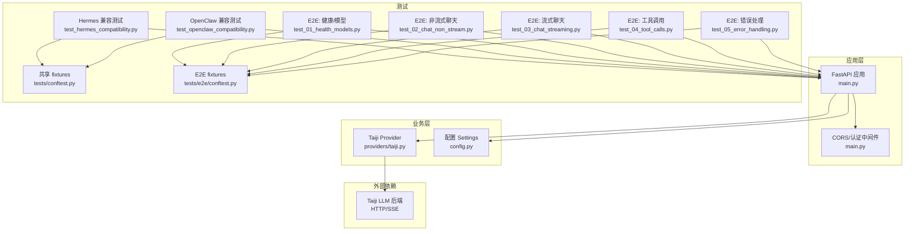
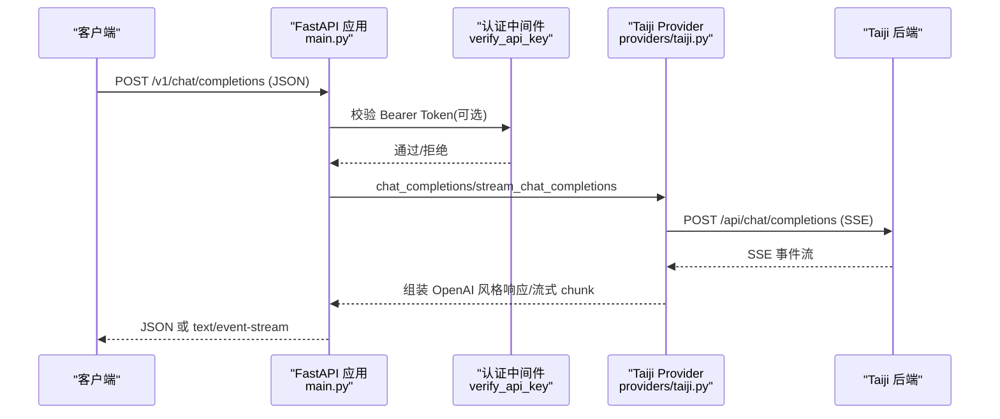
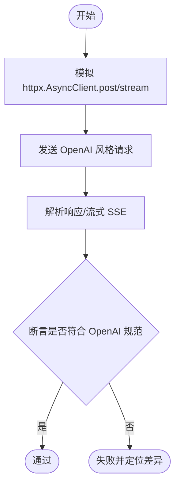
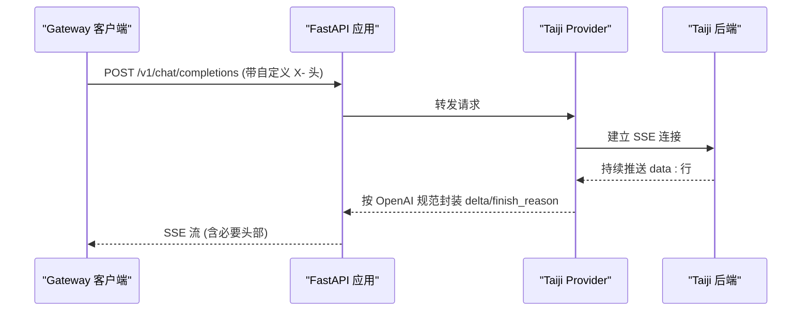
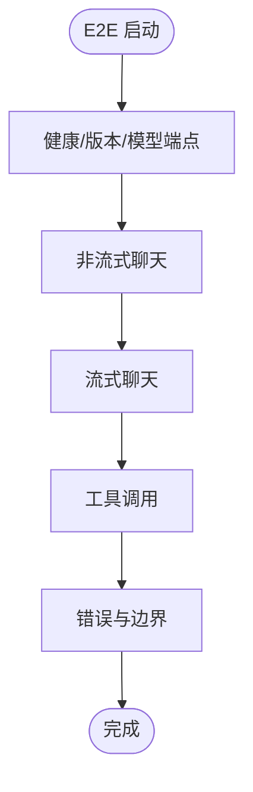
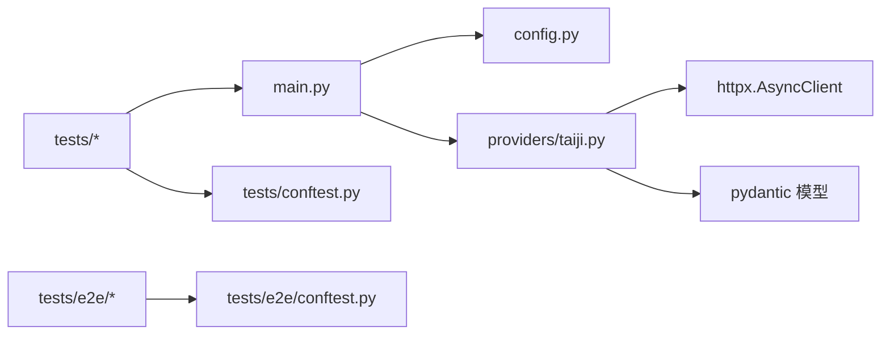

# 集成测试

<cite>
**本文引用的文件**   
- [tests/conftest.py](file://tests/conftest.py)
- [tests/e2e/conftest.py](file://tests/e2e/conftest.py)
- [src/openai_provider/main.py](file://src/openai_provider/main.py)
- [src/openai_provider/config.py](file://src/openai_provider/config.py)
- [src/openai_provider/providers/taiji.py](file://src/openai_provider/providers/taiji.py)
- [tests/test_hermes_compatibility.py](file://tests/test_hermes_compatibility.py)
- [tests/test_openclaw_compatibility.py](file://tests/test_openclaw_compatibility.py)
- [tests/e2e/test_01_health_models.py](file://tests/e2e/test_01_health_models.py)
- [tests/e2e/test_02_chat_non_stream.py](file://tests/e2e/test_02_chat_non_stream.py)
- [tests/e2e/test_03_chat_streaming.py](file://tests/e2e/test_03_chat_streaming.py)
- [tests/e2e/test_04_tool_calls.py](file://tests/e2e/test_04_tool_calls.py)
- [tests/e2e/test_05_error_handling.py](file://tests/e2e/test_05_error_handling.py)
- [start.sh](file://start.sh)
- [pyproject.toml](file://pyproject.toml)
</cite>

## 目录
1. [简介](#简介)
2. [项目结构](#项目结构)
3. [核心组件](#核心组件)
4. [架构总览](#架构总览)
5. [详细组件分析](#详细组件分析)
6. [依赖关系分析](#依赖关系分析)
7. [性能与稳定性考量](#性能与稳定性考量)
8. [故障排查指南](#故障排查指南)
9. [结论](#结论)
10. [附录：运行与配置](#附录运行与配置)

## 简介
本文件面向“FastAPI 应用与 Taiji 后端”的集成测试，覆盖以下目标：
- 端到端（E2E）请求-响应流程验证（非流式、流式 SSE、工具调用、错误处理）
- 认证中间件（可选 Bearer Token）行为验证
- 配置校验与环境变量加载
- Hermes Agent 与 OpenClaw 客户端兼容性测试实现说明
- 测试环境搭建与外部服务依赖管理策略

## 项目结构
仓库采用分层组织：
- src/openai_provider：FastAPI 网关主入口、配置、Provider 实现、数据模型
- tests：单元测试/兼容性测试 + e2e 真实服务测试
- start.sh：统一启动脚本（dev/prod）
- pyproject.toml：依赖与 pytest 配置

图表来源
- [src/openai_provider/main.py:1-120](file://src/openai_provider/main.py#L1-L120)
- [src/openai_provider/providers/taiji.py:1-120](file://src/openai_provider/providers/taiji.py#L1-L120)
- [src/openai_provider/config.py:1-56](file://src/openai_provider/config.py#L1-L56)
- [tests/test_hermes_compatibility.py:1-60](file://tests/test_hermes_compatibility.py#L1-L60)
- [tests/test_openclaw_compatibility.py:1-60](file://tests/test_openclaw_compatibility.py#L1-L60)
- [tests/e2e/test_01_health_models.py:1-40](file://tests/e2e/test_01_health_models.py#L1-L40)
- [tests/e2e/test_02_chat_non_stream.py:1-40](file://tests/e2e/test_02_chat_non_stream.py#L1-L40)
- [tests/e2e/test_03_chat_streaming.py:1-40](file://tests/e2e/test_03_chat_streaming.py#L1-L40)
- [tests/e2e/test_04_tool_calls.py:1-40](file://tests/e2e/test_04_tool_calls.py#L1-L40)
- [tests/e2e/test_05_error_handling.py:1-40](file://tests/e2e/test_05_error_handling.py#L1-L40)
- [tests/conftest.py:1-60](file://tests/conftest.py#L1-L60)
- [tests/e2e/conftest.py:1-40](file://tests/e2e/conftest.py#L1-L40)

章节来源
- [src/openai_provider/main.py:1-120](file://src/openai_provider/main.py#L1-L120)
- [src/openai_provider/config.py:1-56](file://src/openai_provider/config.py#L1-L56)
- [tests/conftest.py:1-60](file://tests/conftest.py#L1-L60)
- [tests/e2e/conftest.py:1-40](file://tests/e2e/conftest.py#L1-L40)

## 核心组件
- FastAPI 应用与路由
  - /v1/chat/completions：支持非流式与流式（SSE），返回 OpenAI 风格 JSON 或 SSE 事件流
  - /v1/models、/v1/models/{model_id}、/api/v1/models、/api/tags、/props、/v1/props、/version：模型发现与兼容端点
  - /health：健康检查
- 认证中间件
  - 基于 HTTPBearer 的可选 API Key 校验；未配置 API_KEY 时跳过认证
- CORS 中间件
  - 通过环境变量 CORS_ORIGINS 控制允许源
- Taiji Provider
  - 将 OpenAI Chat Completions 请求转换为 Taiji 后端调用
  - 解析 SSE 响应、提取文本、分离思考过程、提取 tool_calls、统计 token 用量
  - 构建流式 delta 与结束 chunk，保证 finish_reason 时机正确
- 配置模块
  - 使用 pydantic-settings 从环境变量与 .env 读取配置，提供默认值与类型校验

章节来源
- [src/openai_provider/main.py:128-317](file://src/openai_provider/main.py#L128-L317)
- [src/openai_provider/main.py:101-127](file://src/openai_provider/main.py#L101-L127)
- [src/openai_provider/main.py:91-100](file://src/openai_provider/main.py#L91-L100)
- [src/openai_provider/providers/taiji.py:46-120](file://src/openai_provider/providers/taiji.py#L46-L120)
- [src/openai_provider/providers/taiji.py:670-780](file://src/openai_provider/providers/taiji.py#L670-L780)
- [src/openai_provider/providers/taiji.py:782-800](file://src/openai_provider/providers/taiji.py#L782-L800)
- [src/openai_provider/config.py:12-56](file://src/openai_provider/config.py#L12-L56)

## 架构总览
下图展示了从客户端到 Taiji 后端的完整请求-响应路径，包括认证、CORS、日志、Provider 转换与 SSE 流式处理。

图表来源
- [src/openai_provider/main.py:134-257](file://src/openai_provider/main.py#L134-L257)
- [src/openai_provider/providers/taiji.py:670-780](file://src/openai_provider/providers/taiji.py#L670-L780)
- [src/openai_provider/providers/taiji.py:782-800](file://src/openai_provider/providers/taiji.py#L782-L800)

## 详细组件分析

### 组件A：Hermes 客户端兼容性测试
- 目标：确保对标准 OpenAI API 的行为一致（非流式、流式、参数透传、错误体格式、认证等）
- 关键断言
  - 非流式：object、model、choices、usage 字段完整性
  - 流式：content-type 为 SSE、每行 data: 前缀、[DONE] 结尾、第一个 chunk 携带 role、finish_reason 仅在最后一个内容 chunk
  - 参数透传：temperature、max_tokens、top_p、presence_penalty、frequency_penalty 等被转发至下游
  - 错误体：400 invalid_request_error、502 provider_error
  - 认证：未配置 API_KEY 时放行；配置后要求正确 Bearer Token
- 实现要点
  - 使用 TestClient 直接调用 FastAPI 应用
  - 使用 AsyncMock 和 patch 模拟 httpx.AsyncClient.post/stream 以隔离 Taiji 后端
  - 使用共享 fixtures 构造 SSE 响应与流式上下文

图表来源
- [tests/test_hermes_compatibility.py:74-114](file://tests/test_hermes_compatibility.py#L74-L114)
- [tests/test_hermes_compatibility.py:287-324](file://tests/test_hermes_compatibility.py#L287-L324)
- [tests/test_hermes_compatibility.py:331-363](file://tests/test_hermes_compatibility.py#L331-L363)
- [tests/test_hermes_compatibility.py:386-406](file://tests/test_hermes_compatibility.py#L386-L406)
- [tests/conftest.py:16-92](file://tests/conftest.py#L16-L92)

章节来源
- [tests/test_hermes_compatibility.py:1-462](file://tests/test_hermes_compatibility.py#L1-L462)
- [tests/conftest.py:1-160](file://tests/conftest.py#L1-L160)

### 组件B：OpenClaw 客户端兼容性测试
- 目标：针对 Gateway 模式客户端（如 openclaw）的严格 SSE 格式、Header 透传、长连接保持、超时与并发稳定性
- 关键断言
  - 非流式：application/json 响应体结构
  - 流式：text/event-stream、cache-control=no-cache、connection=keep-alive、data: 行与 [DONE] 标记
  - 首 chunk 携带 role，后续不再重复 role；finish_reason 仅出现在最后内容 chunk
  - 自定义 X- 头透传不报错；Accept: application/json 返回 JSON
  - 并发多请求互不干扰，ID 唯一
  - 404 返回 OpenAI 风格错误体
- 实现要点
  - 同样基于 TestClient 与 mock，重点验证 SSE 格式与头部
  - 构造多种流场景（慢速流、中途错误元数据）

图表来源
- [tests/test_openclaw_compatibility.py:166-189](file://tests/test_openclaw_compatibility.py#L166-L189)
- [tests/test_openclaw_compatibility.py:215-265](file://tests/test_openclaw_compatibility.py#L215-L265)
- [tests/test_openclaw_compatibility.py:355-373](file://tests/test_openclaw_compatibility.py#L355-L373)
- [src/openai_provider/main.py:211-218](file://src/openai_provider/main.py#L211-L218)

章节来源
- [tests/test_openclaw_compatibility.py:1-417](file://tests/test_openclaw_compatibility.py#L1-L417)

### 组件C：E2E 端到端测试套件
- 健康与模型发现
  - /health 返回 {"status":"ok"}
  - /version 包含 version 与 provider=taiji
  - /props、/v1/props 返回空对象
  - /api/tags 返回 {"models":[]}
  - /v1/models 列出 taiji 模型，/v1/models/{id} 获取单个模型，未知 id 返回 404
- 非流式聊天
  - 基本 user→assistant 回复，usage 字段有效，created 时间戳合理，content 不含 <think> 标签
  - system 消息影响输出；参数 temperature/max_tokens/top_p 等可接受
  - 非法 JSON 或缺少 messages 返回 400/422
  - CORS preflight 与实际请求均返回允许头
- 流式聊天
  - content-type 为 SSE，包含 no-cache 与 keep-alive
  - 首个 chunk 携带 role=assistant，所有 chunk object 为 chat.completion.chunk
  - 拼接 content delta 得到有意义文本，且无 <think> 标签
  - 所有 chunk 共享同一 completion ID 与 model
  - finish_reason 仅出现在倒数第二个 chunk，值为 stop
  - 最终 chunk 包含 usage，total_tokens=prompt+completion
- 工具调用
  - 非流式/流式均可触发 tool_calls，arguments 为合法 JSON
  - tool_choice 强制指定工具或禁止工具调用
  - 多轮往返：user → assistant(tool_calls) → tool(result) → assistant(自然语言)
- 错误处理与边界
  - 空体、空 messages、非法 JSON、非法 role 返回 400/422
  - 超长 prompt 应能处理或返回合理错误码
  - 并发健康检查与并发聊天请求稳定，ID 唯一
  - 认证：未配置 API_KEY 时放行；错误 Bearer Token 返回 401

图表来源
- [tests/e2e/test_01_health_models.py:1-103](file://tests/e2e/test_01_health_models.py#L1-L103)
- [tests/e2e/test_02_chat_non_stream.py:1-179](file://tests/e2e/test_02_chat_non_stream.py#L1-L179)
- [tests/e2e/test_03_chat_streaming.py:1-146](file://tests/e2e/test_03_chat_streaming.py#L1-L146)
- [tests/e2e/test_04_tool_calls.py:1-226](file://tests/e2e/test_04_tool_calls.py#L1-L226)
- [tests/e2e/test_05_error_handling.py:1-155](file://tests/e2e/test_05_error_handling.py#L1-L155)

章节来源
- [tests/e2e/test_01_health_models.py:1-103](file://tests/e2e/test_01_health_models.py#L1-L103)
- [tests/e2e/test_02_chat_non_stream.py:1-179](file://tests/e2e/test_02_chat_non_stream.py#L1-L179)
- [tests/e2e/test_03_chat_streaming.py:1-146](file://tests/e2e/test_03_chat_streaming.py#L1-L146)
- [tests/e2e/test_04_tool_calls.py:1-226](file://tests/e2e/test_04_tool_calls.py#L1-L226)
- [tests/e2e/test_05_error_handling.py:1-155](file://tests/e2e/test_05_error_handling.py#L1-L155)

### 组件D：认证中间件测试
- 行为
  - 当 API_KEY 为空时，任何请求均放行
  - 当 API_KEY 已配置时，缺少 Authorization 或 Bearer Token 不正确返回 401，且错误体包含 code=invalid_api_key
- 测试覆盖
  - Hermes 兼容测试中显式设置 settings.API_KEY 进行断言
  - E2E 错误处理测试覆盖未配置与错误 token 两种情况

章节来源
- [src/openai_provider/main.py:108-126](file://src/openai_provider/main.py#L108-L126)
- [tests/test_hermes_compatibility.py:386-406](file://tests/test_hermes_compatibility.py#L386-L406)
- [tests/e2e/test_05_error_handling.py:109-128](file://tests/e2e/test_05_error_handling.py#L109-L128)

### 组件E：配置验证与环境变量
- 配置项
  - TAIJI_BASE_URL、TAIJI_API_KEY、TAIJI_MAX_TEXT_LENGTH、TAIJI_CONTENT_FIELDS、TAIJI_SESSION_ID、TAIJI_SESSION_COOKIE
  - API_KEY（Provider 认证）、APP_HOST、APP_PORT、MODEL_CONTEXT_LENGTH、MODEL_MAX_COMPLETION_TOKENS、CORS_ORIGINS
- 验证方式
  - 通过 Settings 类自动类型校验与默认值兜底
  - 运行时由 main 应用读取并使用（如 CORS 允许源、模型能力暴露）

章节来源
- [src/openai_provider/config.py:12-56](file://src/openai_provider/config.py#L12-L56)
- [src/openai_provider/main.py:91-99](file://src/openai_provider/main.py#L91-L99)
- [src/openai_provider/main.py:272-286](file://src/openai_provider/main.py#L272-L286)

## 依赖关系分析
- 应用层依赖
  - FastAPI、Starlette 异常处理器、CORS 中间件、HTTPBearer 认证
  - 日志：结构化 JSON 日志，按大小轮转
- Provider 层依赖
  - httpx.AsyncClient 发起 HTTP/SSE 请求
  - tiktoken（可选）用于 token 估算
  - pydantic 模型用于请求/响应建模
- 测试依赖
  - pytest、pytest-asyncio、httpx（E2E）
  - unittest.mock.AsyncMock 与 patch 用于隔离外部依赖

图表来源
- [src/openai_provider/main.py:1-120](file://src/openai_provider/main.py#L1-L120)
- [src/openai_provider/providers/taiji.py:1-120](file://src/openai_provider/providers/taiji.py#L1-L120)
- [tests/conftest.py:1-60](file://tests/conftest.py#L1-L60)
- [tests/e2e/conftest.py:1-40](file://tests/e2e/conftest.py#L1-L40)

章节来源
- [src/openai_provider/main.py:1-120](file://src/openai_provider/main.py#L1-L120)
- [src/openai_provider/providers/taiji.py:1-120](file://src/openai_provider/providers/taiji.py#L1-L120)
- [tests/conftest.py:1-60](file://tests/conftest.py#L1-L60)
- [tests/e2e/conftest.py:1-40](file://tests/e2e/conftest.py#L1-L40)

## 性能与稳定性考量
- 流式传输
  - SSE 响应需包含 Cache-Control: no-cache 与 Connection: keep-alive，避免缓存与连接提前关闭
  - 首 chunk 必须携带 role，finish_reason 仅出现在最后一个内容 chunk，符合 OpenAI 规范
- 重试与容错
  - E2E 客户端内置 502 重试逻辑，缓解临时网络抖动
- 并发
  - 健康检查与聊天请求并发下应保持独立 ID 与正确状态码
- 资源清理
  - Provider 在应用生命周期结束时释放 httpx 客户端资源

章节来源
- [src/openai_provider/main.py:211-218](file://src/openai_provider/main.py#L211-L218)
- [tests/e2e/conftest.py:47-75](file://tests/e2e/conftest.py#L47-L75)
- [tests/e2e/test_05_error_handling.py:79-107](file://tests/e2e/test_05_error_handling.py#L79-L107)
- [src/openai_provider/main.py:81-87](file://src/openai_provider/main.py#L81-L87)

## 故障排查指南
- 常见问题
  - 401 认证失败：确认是否配置了 API_KEY 以及请求是否携带正确的 Bearer Token
  - 400/422 请求校验错误：检查 messages 是否为必填、JSON 是否合法、role 是否在允许范围
  - 502 提供者错误：检查 Taiji 后端可用性、网络连通性与限流
  - SSE 格式问题：确认 data: 行与 [DONE] 标记存在，content-type 为 text/event-stream
- 定位方法
  - 查看结构化日志（logs/taiji-provider.log），关注 raw_request/raw_response/provider_request/provider_response 日志
  - 使用 E2E 客户端的 _is_service_alive 检测服务可达性
  - 在兼容性测试中使用捕获函数记录下游请求参数与头部

章节来源
- [src/openai_provider/main.py:319-331](file://src/openai_provider/main.py#L319-L331)
- [src/openai_provider/main.py:49-69](file://src/openai_provider/main.py#L49-L69)
- [tests/e2e/conftest.py:27-40](file://tests/e2e/conftest.py#L27-L40)
- [tests/test_hermes_compatibility.py:57-68](file://tests/test_hermes_compatibility.py#L57-L68)

## 结论
本集成测试体系覆盖了 FastAPI 网关与 Taiji 后端的端到端交互，包括：
- 非流式与流式 SSE 的完整请求-响应流程
- 工具调用与多轮往返
- 认证中间件与 CORS 行为
- Hermes 与 OpenClaw 客户端兼容性
- 错误处理与边界场景
通过共享 fixtures 与 mock 机制，既保证了测试的稳定性，又能在真实环境下验证关键路径。

## 附录：运行与配置

### 环境准备
- Python 版本：>=3.11
- 安装依赖：pip install -r requirements.txt 或使用 pyproject 的 dev 可选依赖
- 环境变量（建议写入 .env）：
  - TAIJI_BASE_URL、TAIJI_API_KEY、TAIJI_SESSION_COOKIE、TAIJI_SESSION_ID
  - API_KEY（可选，启用 Bearer Token 认证）
  - APP_HOST、APP_PORT、CORS_ORIGINS、MODEL_CONTEXT_LENGTH、MODEL_MAX_COMPLETION_TOKENS

### 启动服务
- 开发模式（热重载）：bash start.sh dev --port 8199
- 生产模式（单进程或多 worker）：bash start.sh prod --workers N --port PORT

### 运行测试
- 单元与兼容性测试（无需真实服务）：
  - pytest tests/test_hermes_compatibility.py
  - pytest tests/test_openclaw_compatibility.py
- E2E 测试（需要运行中的服务）：
  - 先启动服务：bash start.sh dev --port 8199
  - 设置环境变量 E2E_BASE_URL=http://localhost:8199
  - 运行：pytest tests/e2e/

### 外部服务依赖管理策略
- 隔离外部依赖
  - 使用 AsyncMock 与 patch 模拟 httpx.AsyncClient.post/stream，避免真实网络调用
  - 使用共享 fixtures 生成标准 SSE 响应与流式上下文
- 真实环境回退
  - E2E 测试通过 RetryingClient 包装 httpx.Client，对 502 自动重试
  - 通过 _is_service_alive 检测服务可达性，必要时跳过测试

章节来源
- [start.sh:1-123](file://start.sh#L1-L123)
- [pyproject.toml:1-55](file://pyproject.toml#L1-L55)
- [tests/e2e/conftest.py:47-75](file://tests/e2e/conftest.py#L47-L75)
- [tests/conftest.py:45-74](file://tests/conftest.py#L45-L74)