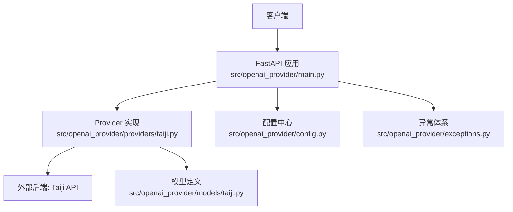
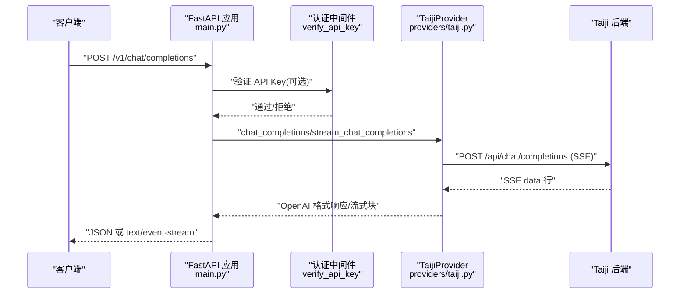
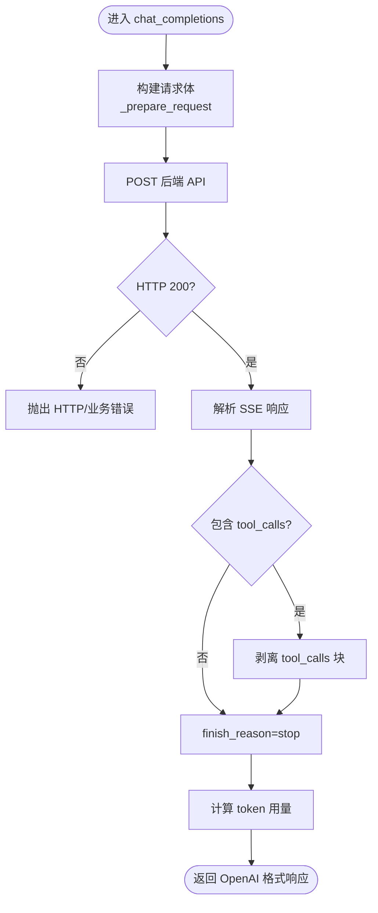
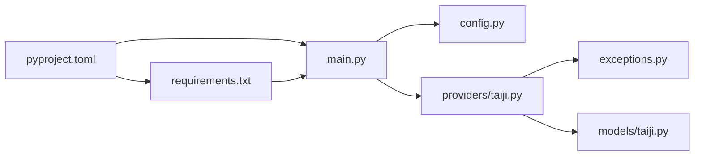

# 容器化部署

<cite>
**本文引用的文件**   
- [pyproject.toml](file://pyproject.toml)
- [requirements.txt](file://requirements.txt)
- [start.sh](file://start.sh)
- [src/openai_provider/main.py](file://src/openai_provider/main.py)
- [src/openai_provider/config.py](file://src/openai_provider/config.py)
- [src/openai_provider/providers/taiji.py](file://src/openai_provider/providers/taiji.py)
- [src/openai_provider/exceptions.py](file://src/openai_provider/exceptions.py)
- [src/openai_provider/models/taiji.py](file://src/openai_provider/models/taiji.py)
</cite>

## 目录
1. [简介](#简介)
2. [项目结构](#项目结构)
3. [核心组件](#核心组件)
4. [架构总览](#架构总览)
5. [详细组件分析](#详细组件分析)
6. [依赖分析](#依赖分析)
7. [性能考虑](#性能考虑)
8. [故障排查指南](#故障排查指南)
9. [结论](#结论)
10. [附录](#附录)

## 简介
本指南面向将本项目容器化并投入生产环境的工程师，覆盖以下主题：
- Dockerfile 编写最佳实践与多阶段构建策略
- 镜像构建优化（缓存、层大小、安全扫描）
- Docker Compose 编排（服务依赖、网络、数据卷）
- Kubernetes 部署清单（Deployment、Service、ConfigMap、Secret）
- 容器安全扫描与资源限制配置

## 项目结构
仓库采用 Python FastAPI 应用，入口为 uvicorn 启动的 ASGI 应用。关键运行参数通过环境变量注入，日志输出到本地 logs 目录，对外暴露 OpenAI 兼容接口并将请求转发至 Taiji LLM 后端。

图表来源
- [src/openai_provider/main.py:1-120](file://src/openai_provider/main.py#L1-L120)
- [src/openai_provider/providers/taiji.py:1-120](file://src/openai_provider/providers/taiji.py#L1-L120)
- [src/openai_provider/config.py:1-56](file://src/openai_provider/config.py#L1-L56)
- [src/openai_provider/exceptions.py:1-40](file://src/openai_provider/exceptions.py#L1-L40)
- [src/openai_provider/models/taiji.py:1-31](file://src/openai_provider/models/taiji.py#L1-L31)

章节来源
- [pyproject.toml:1-55](file://pyproject.toml#L1-L55)
- [requirements.txt:1-13](file://requirements.txt#L1-L13)
- [start.sh:1-123](file://start.sh#L1-L123)
- [src/openai_provider/main.py:1-120](file://src/openai_provider/main.py#L1-L120)
- [src/openai_provider/config.py:1-56](file://src/openai_provider/config.py#L1-L56)

## 核心组件
- 应用入口与路由：提供 /health、/v1/chat/completions、/v1/models 等端点，支持流式与非流式响应，统一错误格式。
- Provider 适配层：将 OpenAI 请求转换为 Taiji 后端调用，处理 SSE 解析、tool_calls 提取、think 标签分离与 token 统计。
- 配置系统：基于 pydantic-settings 的环境变量加载与校验，支持 .env 与默认值。
- 异常体系：结构化区分超时、HTTP 错误、业务错误与网络错误。
- 启动脚本：封装 dev/prod 模式、端口/主机/workers 参数与环境变量。

章节来源
- [src/openai_provider/main.py:128-342](file://src/openai_provider/main.py#L128-L342)
- [src/openai_provider/providers/taiji.py:46-120](file://src/openai_provider/providers/taiji.py#L46-L120)
- [src/openai_provider/config.py:12-56](file://src/openai_provider/config.py#L12-L56)
- [src/openai_provider/exceptions.py:8-40](file://src/openai_provider/exceptions.py#L8-L40)
- [start.sh:1-123](file://start.sh#L1-L123)

## 架构总览
下图展示了从客户端到后端的全链路流程，包括认证、CORS、日志、SSE 流式处理与错误转换。

图表来源
- [src/openai_provider/main.py:134-257](file://src/openai_provider/main.py#L134-L257)
- [src/openai_provider/providers/taiji.py:670-780](file://src/openai_provider/providers/taiji.py#L670-L780)

## 详细组件分析

### 应用入口与生命周期
- 生命周期钩子：初始化 JSON 结构化日志，进程退出时清理 Provider 资源。
- CORS：通过环境变量动态配置允许源。
- 健康检查：/health 返回状态。
- 认证：可选 Bearer Token 校验，未配置 API_KEY 则跳过。
- 日志：写入 logs 目录，按大小轮转。

章节来源
- [src/openai_provider/main.py:81-99](file://src/openai_provider/main.py#L81-L99)
- [src/openai_provider/main.py:105-126](file://src/openai_provider/main.py#L105-L126)
- [src/openai_provider/main.py:128-131](file://src/openai_provider/main.py#L128-L131)
- [src/openai_provider/main.py:49-68](file://src/openai_provider/main.py#L49-L68)

### Provider 适配层（非流式）
- 构建请求体：将 messages 转为纯文本，智能截断以不超过最大长度。
- 调用后端：使用 httpx 异步客户端发送请求，捕获超时与 HTTP 错误。
- 响应解析：解析 SSE 文本，提取内容、推理内容与 token 用量信息。
- tool_calls 处理：支持 XML/DSML 与 JSON 两种格式，自动剥离工具调用块。
- 错误映射：将后端错误映射为结构化异常。

图表来源
- [src/openai_provider/providers/taiji.py:670-780](file://src/openai_provider/providers/taiji.py#L670-L780)
- [src/openai_provider/providers/taiji.py:520-600](file://src/openai_provider/providers/taiji.py#L520-L600)
- [src/openai_provider/providers/taiji.py:633-668](file://src/openai_provider/providers/taiji.py#L633-L668)
- [src/openai_provider/providers/taiji.py:350-482](file://src/openai_provider/providers/taiji.py#L350-L482)

章节来源
- [src/openai_provider/providers/taiji.py:520-600](file://src/openai_provider/providers/taiji.py#L520-L600)
- [src/openai_provider/providers/taiji.py:670-780](file://src/openai_provider/providers/taiji.py#L670-L780)
- [src/openai_provider/providers/taiji.py:633-668](file://src/openai_provider/providers/taiji.py#L633-L668)
- [src/openai_provider/providers/taiji.py:350-482](file://src/openai_provider/providers/taiji.py#L350-L482)

### Provider 适配层（流式）
- 流式生成：逐块生成 OpenAI 风格的 delta，维护 role 发送状态与 think 标签缓冲。
- 结束块：携带 finish_reason 与 usage。
- 错误处理：在流中产出错误 chunk。

章节来源
- [src/openai_provider/providers/taiji.py:782-800](file://src/openai_provider/providers/taiji.py#L782-L800)
- [src/openai_provider/providers/taiji.py:602-631](file://src/openai_provider/providers/taiji.py#L602-L631)

### 配置与启动
- 配置项：后端地址、密钥、会话 Cookie、上下文长度、最大完成 token、CORS 等，均通过环境变量注入。
- 启动脚本：支持 dev/prod 模式，设置监听地址、端口与 worker 数量；检测依赖是否安装。

章节来源
- [src/openai_provider/config.py:12-56](file://src/openai_provider/config.py#L12-L56)
- [start.sh:1-123](file://start.sh#L1-L123)

### 异常体系
- 基类与派生类：区分超时、HTTP 错误、业务错误与网络错误，便于上层统一处理与日志记录。

章节来源
- [src/openai_provider/exceptions.py:8-40](file://src/openai_provider/exceptions.py#L8-L40)

## 依赖分析
- 运行时依赖：fastapi、uvicorn[standard]、httpx、pydantic、pydantic-settings。
- 开发依赖：pytest、pytest-asyncio、mypy、ruff。
- 包管理：pyproject.toml 与 requirements.txt 保持一致。

图表来源
- [pyproject.toml:1-55](file://pyproject.toml#L1-L55)
- [requirements.txt:1-13](file://requirements.txt#L1-L13)
- [src/openai_provider/main.py:1-30](file://src/openai_provider/main.py#L1-L30)
- [src/openai_provider/config.py:1-20](file://src/openai_provider/config.py#L1-L20)
- [src/openai_provider/providers/taiji.py:1-40](file://src/openai_provider/providers/taiji.py#L1-L40)
- [src/openai_provider/exceptions.py:1-20](file://src/openai_provider/exceptions.py#L1-L20)
- [src/openai_provider/models/taiji.py:1-20](file://src/openai_provider/models/taiji.py#L1-L20)

章节来源
- [pyproject.toml:1-55](file://pyproject.toml#L1-L55)
- [requirements.txt:1-13](file://requirements.txt#L1-L13)

## 性能考虑
- 多 Worker：生产环境建议根据 CPU 核数设置 UVICORN_WORKERS，提升并发能力。
- 流式响应：优先使用流式以减少首字节延迟。
- 日志落盘：日志轮转避免磁盘占满，生产环境建议将日志挂载到持久卷或转发到集中式日志系统。
- 外部依赖：httpx 连接池复用，合理设置超时时间。

章节来源
- [start.sh:108-121](file://start.sh#L108-L121)
- [src/openai_provider/main.py:185-218](file://src/openai_provider/main.py#L185-L218)
- [src/openai_provider/providers/taiji.py:593-600](file://src/openai_provider/providers/taiji.py#L593-L600)

## 故障排查指南
- 健康检查：访问 /health 确认服务可用。
- 认证失败：检查 API_KEY 是否正确注入，请求头是否携带正确的 Bearer Token。
- 后端错误：关注 ProviderError 子类（超时、HTTP、业务、网络），结合日志中的 request_id 定位问题。
- 日志位置：logs/taiji-provider.log，注意轮转策略与权限。

章节来源
- [src/openai_provider/main.py:128-131](file://src/openai_provider/main.py#L128-L131)
- [src/openai_provider/main.py:105-126](file://src/openai_provider/main.py#L105-L126)
- [src/openai_provider/exceptions.py:8-40](file://src/openai_provider/exceptions.py#L8-L40)
- [src/openai_provider/main.py:49-68](file://src/openai_provider/main.py#L49-L68)

## 结论
通过多阶段构建、最小化基础镜像、严格的安全扫描与合理的资源限制，可将该 FastAPI 应用稳定地部署到 Docker 与 Kubernetes 环境。配合 Compose 与 K8s 的配置管理，可实现灵活的编排与高可用运行。

## 附录

### Dockerfile 编写最佳实践与多阶段构建策略
- 构建阶段
  - 使用官方 Python 镜像作为基础，锁定版本（如 python:3.11-slim）。
  - 安装系统依赖后，复制 pyproject.toml 与 requirements.txt，预编译依赖缓存。
  - 仅复制 src 与必要脚本，避免引入测试与无关文件。
- 运行阶段
  - 使用更小的运行时镜像（如 python:3.11-slim），仅保留运行所需依赖。
  - 创建非 root 用户运行应用，降低安全风险。
  - 使用 start.sh 作为入口，传入 prod 模式与 workers 数量。
- 优化要点
  - 利用 Docker 层缓存：先复制依赖再复制源码。
  - 精简镜像体积：移除不必要的包与文档。
  - 安全加固：定期更新基础镜像，启用只读根文件系统。

章节来源
- [pyproject.toml:1-55](file://pyproject.toml#L1-L55)
- [requirements.txt:1-13](file://requirements.txt#L1-L13)
- [start.sh:1-123](file://start.sh#L1-L123)

### 镜像构建优化与多阶段构建示例（路径指引）
- 构建阶段：安装依赖、执行静态检查（可选）、打包 wheel。
- 运行阶段：复制 wheel 与运行时依赖，配置环境变量与启动命令。
- 参考路径
  - 依赖声明：[pyproject.toml:1-55](file://pyproject.toml#L1-L55)、[requirements.txt:1-13](file://requirements.txt#L1-L13)
  - 启动入口：[start.sh:1-123](file://start.sh#L1-L123)

### Docker Compose 编排配置
- 服务定义
  - 应用服务：基于构建上下文与镜像，暴露端口，注入环境变量（后端地址、密钥、会话 Cookie、CORS、监听地址与端口、workers）。
  - 可选：反向代理（Nginx/Traefik）用于 TLS 终止与路由。
- 网络配置
  - 自定义桥接网络，隔离内部服务通信。
- 数据卷管理
  - 挂载 logs 目录到宿主机或持久卷，便于日志采集与轮转。
- 依赖关系
  - 使用 depends_on 确保顺序启动（如有数据库或缓存服务）。

章节来源
- [src/openai_provider/config.py:24-47](file://src/openai_provider/config.py#L24-L47)
- [start.sh:11-13](file://start.sh#L11-L13)
- [src/openai_provider/main.py:49-68](file://src/openai_provider/main.py#L49-L68)

### Kubernetes 部署清单（Deployment、Service、ConfigMap、Secret）
- ConfigMap
  - 存放非敏感配置：后端地址、CORS 源、上下文长度、最大完成 token、监听地址与端口等。
- Secret
  - 存放敏感信息：API_KEY、TAIJI_API_KEY、TAIJI_SESSION_COOKIE 等。
- Deployment
  - 副本数与资源限制：requests/limits（CPU、内存）。
  - 探针：liveness/readiness 指向 /health。
  - 环境变量：从 ConfigMap 与 Secret 注入。
  - 卷挂载：logs 目录持久化。
- Service
  - ClusterIP 或 LoadBalancer，暴露端口与应用服务。

章节来源
- [src/openai_provider/config.py:24-47](file://src/openai_provider/config.py#L24-L47)
- [src/openai_provider/main.py:128-131](file://src/openai_provider/main.py#L128-L131)
- [src/openai_provider/main.py:49-68](file://src/openai_provider/main.py#L49-L68)

### 容器安全扫描与资源限制
- 安全扫描
  - 使用 Trivy 或 Snyk 对镜像进行漏洞扫描，阻断高危漏洞。
  - 定期更新基础镜像与依赖，最小化攻击面。
- 资源限制
  - 在 K8s 中设置 requests/limits，防止资源争用与 OOM。
  - 在 Docker 中通过 --cpus 与 --memory 限制容器资源。
- 运行安全
  - 非 root 用户运行，只读根文件系统，禁用不必要的能力。

章节来源
- [start.sh:108-121](file://start.sh#L108-L121)
- [src/openai_provider/main.py:49-68](file://src/openai_provider/main.py#L49-L68)