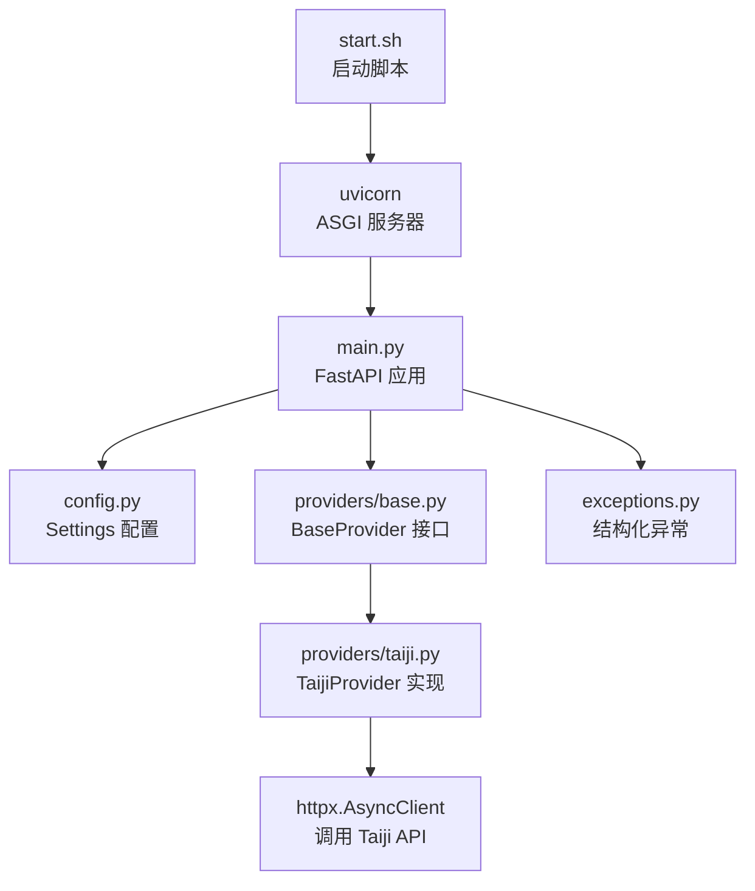
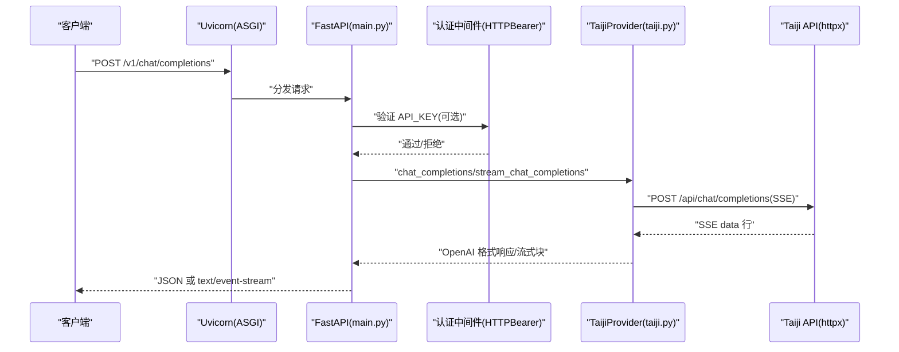
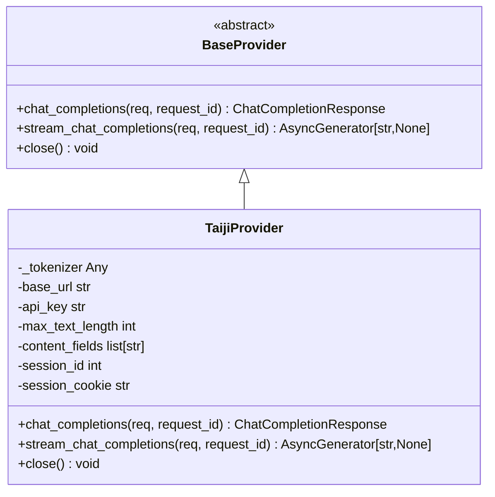

# 本地开发环境

<cite>
**本文引用的文件**   
- [start.sh](file://start.sh)
- [pyproject.toml](file://pyproject.toml)
- [requirements.txt](file://requirements.txt)
- [src/openai_provider/config.py](file://src/openai_provider/config.py)
- [src/openai_provider/main.py](file://src/openai_provider/main.py)
- [src/openai_provider/providers/base.py](file://src/openai_provider/providers/base.py)
- [src/openai_provider/providers/taiji.py](file://src/openai_provider/providers/taiji.py)
- [src/openai_provider/exceptions.py](file://src/openai_provider/exceptions.py)
- [tests/conftest.py](file://tests/conftest.py)
</cite>

## 目录
1. [简介](#简介)
2. [项目结构](#项目结构)
3. [核心组件](#核心组件)
4. [架构总览](#架构总览)
5. [详细组件分析](#详细组件分析)
6. [依赖与配置](#依赖与配置)
7. [启动与运行](#启动与运行)
8. [环境变量清单](#环境变量清单)
9. [常见开发与调试问题](#常见开发与调试问题)
10. [IDE 配置建议](#ide-配置建议)
11. [开发工作流最佳实践](#开发工作流最佳实践)
12. [结论](#结论)

## 简介
本指南面向本地开发者，帮助你从零搭建并运行 OpenAI 兼容的 Taiji 网关服务。内容涵盖 Python 版本要求、依赖安装、环境变量配置、开发/生产模式启动方式、常见问题排查与调试技巧，以及 IDE 与工作流建议。

## 项目结构
仓库采用 src 布局，核心为 FastAPI 应用与 Provider 抽象层：
- 入口与路由：FastAPI 应用定义在 main.py，提供 /v1/chat/completions、/v1/models 等端点
- Provider 抽象与实现：BaseProvider 定义接口，TaijiProvider 负责将请求转发到 Taiji 后端
- 配置：基于 pydantic-settings 的环境变量读取与校验
- 异常体系：结构化异常用于区分超时、HTTP 错误、业务错误等
- 测试：pytest + pytest-asyncio，conftest 提供 SSE mock 工具

图表来源
- [start.sh:1-123](file://start.sh#L1-L123)
- [src/openai_provider/main.py:1-342](file://src/openai_provider/main.py#L1-L342)
- [src/openai_provider/config.py:1-56](file://src/openai_provider/config.py#L1-L56)
- [src/openai_provider/providers/base.py:1-46](file://src/openai_provider/providers/base.py#L1-L46)
- [src/openai_provider/providers/taiji.py:1-800](file://src/openai_provider/providers/taiji.py#L1-L800)
- [src/openai_provider/exceptions.py:1-40](file://src/openai_provider/exceptions.py#L1-L40)

章节来源
- [start.sh:1-123](file://start.sh#L1-L123)
- [src/openai_provider/main.py:1-342](file://src/openai_provider/main.py#L1-L342)
- [src/openai_provider/config.py:1-56](file://src/openai_provider/config.py#L1-L56)
- [src/openai_provider/providers/base.py:1-46](file://src/openai_provider/providers/base.py#L1-L46)
- [src/openai_provider/providers/taiji.py:1-800](file://src/openai_provider/providers/taiji.py#L1-L800)
- [src/openai_provider/exceptions.py:1-40](file://src/openai_provider/exceptions.py#L1-L40)

## 核心组件
- 应用主模块（main.py）
  - 生命周期管理：初始化日志、关闭时释放 Provider 资源
  - CORS 中间件：通过环境变量控制允许的来源
  - 可选认证：当配置 API_KEY 时启用 HTTPBearer 校验
  - 路由：/health、/v1/chat/completions、/v1/models、/api/tags、/version 等
  - 全局异常处理：统一返回 OpenAI 风格错误体
- Provider 抽象（base.py）
  - 定义 chat_completions 与 stream_chat_completions 两个异步方法
- Taiji Provider（taiji.py）
  - 构建文本与工具提示、截断策略、token 估算
  - 解析 SSE 响应、提取 tool_calls、剥离思考标签
  - 非流式与流式两种调用路径
- 配置（config.py）
  - 使用 BaseSettings 从环境变量或 .env 加载，带默认值与范围校验
- 异常（exceptions.py）
  - ProviderError 基类及细分异常类型

章节来源
- [src/openai_provider/main.py:1-342](file://src/openai_provider/main.py#L1-L342)
- [src/openai_provider/providers/base.py:1-46](file://src/openai_provider/providers/base.py#L1-L46)
- [src/openai_provider/providers/taiji.py:1-800](file://src/openai_provider/providers/taiji.py#L1-L800)
- [src/openai_provider/config.py:1-56](file://src/openai_provider/config.py#L1-L56)
- [src/openai_provider/exceptions.py:1-40](file://src/openai_provider/exceptions.py#L1-L40)

## 架构总览
下图展示了从客户端到 Taiji 后端的完整请求链路，包括认证、CORS、日志、Provider 调用与 SSE 流式处理。

图表来源
- [src/openai_provider/main.py:134-257](file://src/openai_provider/main.py#L134-L257)
- [src/openai_provider/providers/taiji.py:670-780](file://src/openai_provider/providers/taiji.py#L670-L780)
- [src/openai_provider/providers/taiji.py:782-800](file://src/openai_provider/providers/taiji.py#L782-L800)

## 详细组件分析

### 启动脚本 start.sh
- 支持参数与环境变量覆盖端口、主机、worker 数量
- 自动设置 PYTHONPATH 指向 src，便于直接以包名导入
- 检测 Python 与依赖是否可用
- 开发模式：启用 --reload 热重载，单进程
- 生产模式：根据 workers 数量选择多 worker 或单进程

常用用法
- 开发模式：./start.sh dev
- 生产模式：./start.sh prod
- 指定端口：./start.sh dev --port 8081
- 指定主机：./start.sh prod --host 0.0.0.0
- 指定 workers：./start.sh prod --workers 4

章节来源
- [start.sh:1-123](file://start.sh#L1-L123)

### 配置系统 config.py
- 使用 pydantic-settings 的 BaseSettings，支持 .env 与默认值
- 关键字段：
  - TAIJI_BASE_URL、TAIJI_API_KEY、TAIJI_SESSION_COOKIE、TAIJI_SESSION_ID
  - APP_HOST、APP_PORT
  - CORS_ORIGINS、MODEL_CONTEXT_LENGTH、MODEL_MAX_COMPLETION_TOKENS
  - API_KEY（可选，用于 Bearer Token 认证）
- content_fields_list 属性用于解析逗号分隔字段列表

章节来源
- [src/openai_provider/config.py:1-56](file://src/openai_provider/config.py#L1-L56)

### 应用主模块 main.py
- 生命周期：setup_logging 输出 JSON 结构化日志到 logs/ 目录，按大小轮转
- CORS：从配置中解析允许来源
- 认证：若未配置 API_KEY 则跳过；否则校验 Bearer token
- 路由：
  - /health：健康检查
  - /v1/chat/completions：支持非流式与流式
  - /v1/models、/v1/models/{model_id}、/api/v1/models、/api/tags、/props、/version
- 异常处理：将 HTTPException 转换为 OpenAI 风格错误体

章节来源
- [src/openai_provider/main.py:1-342](file://src/openai_provider/main.py#L1-L342)

### Provider 抽象与实现
- BaseProvider：定义 chat_completions 与 stream_chat_completions 接口
- TaijiProvider：
  - 构建文本与工具提示，智能截断保证不超过最大长度
  - 解析 SSE 响应，提取 content、reasoning_content、tool_calls
  - 非流式：一次性返回 ChatCompletionResponse
  - 流式：生成 OpenAI 风格的 SSE chunk，最后发送 [DONE]

图表来源
- [src/openai_provider/providers/base.py:1-46](file://src/openai_provider/providers/base.py#L1-L46)
- [src/openai_provider/providers/taiji.py:46-120](file://src/openai_provider/providers/taiji.py#L46-L120)

章节来源
- [src/openai_provider/providers/base.py:1-46](file://src/openai_provider/providers/base.py#L1-L46)
- [src/openai_provider/providers/taiji.py:1-800](file://src/openai_provider/providers/taiji.py#L1-L800)

### 异常体系 exceptions.py
- ProviderError：所有 Provider 错误的基类
- TaijiTimeoutError：请求超时
- TaijiHTTPError：HTTP 状态码非 200
- TaijiBusinessError：HTTP 200 但包含业务错误字段
- TaijiRequestError：网络层错误（DNS、连接拒绝等）

章节来源
- [src/openai_provider/exceptions.py:1-40](file://src/openai_provider/exceptions.py#L1-L40)

## 依赖与配置

### Python 环境要求
- Python >= 3.11（由 pyproject.toml 指定）

章节来源
- [pyproject.toml:1-55](file://pyproject.toml#L1-L55)

### 依赖安装
- 运行时依赖：fastapi、uvicorn[standard]、httpx、pydantic、pydantic-settings
- 开发依赖：pytest、pytest-asyncio、mypy、ruff

推荐步骤
- 创建虚拟环境并激活
- 安装依赖：pip install -r requirements.txt
- 可选：pip install -e ".[dev]" 安装可编辑包与开发依赖

章节来源
- [requirements.txt:1-13](file://requirements.txt#L1-L13)
- [pyproject.toml:1-55](file://pyproject.toml#L1-L55)

### 环境变量与 .env
- 配置文件会从 .env 文件加载，编码 UTF-8
- 建议在项目根目录创建 .env，避免将敏感信息提交到版本库（已在 .gitignore 中忽略）

章节来源
- [src/openai_provider/config.py:1-56](file://src/openai_provider/config.py#L1-L56)

## 启动与运行

### 开发模式
- 特点：启用热重载，单进程，适合快速迭代
- 命令示例：
  - ./start.sh dev
  - ./start.sh dev --port 8081

### 生产模式
- 特点：多 worker 提升并发能力，无热重载
- 命令示例：
  - ./start.sh prod
  - ./start.sh prod --workers 4

### 健康检查
- 访问 http://localhost:8080/health 确认服务正常

章节来源
- [start.sh:1-123](file://start.sh#L1-L123)
- [src/openai_provider/main.py:128-131](file://src/openai_provider/main.py#L128-L131)

## 环境变量清单
以下为关键环境变量及其作用与默认值说明（来自配置模块）：
- TAIJI_BASE_URL：Taiji 后端地址，默认 https://ai.avuuq.cn
- TAIJI_API_KEY：Taiji API 密钥
- TAIJI_SESSION_COOKIE：会话 Cookie
- TAIJI_SESSION_ID：会话标识
- TAIJI_MAX_TEXT_LENGTH：最大文本长度，默认 800000
- TAIJI_CONTENT_FIELDS：内容字段优先级，逗号分隔
- API_KEY：Provider 认证密钥（可选）
- APP_HOST：监听地址，默认 0.0.0.0
- APP_PORT：监听端口，默认 8080
- MODEL_CONTEXT_LENGTH：模型上下文长度，默认 200000
- MODEL_MAX_COMPLETION_TOKENS：最大补全 token，默认 4096
- CORS_ORIGINS：允许的跨域来源，默认 "*"

注意：start.sh 也支持通过环境变量覆盖端口与主机，并在帮助信息中列出 API_KEY、TAIJI_API_KEY、TAIJI_SESSION_COOKIE。

章节来源
- [src/openai_provider/config.py:1-56](file://src/openai_provider/config.py#L1-L56)
- [start.sh:40-62](file://start.sh#L40-L62)

## 常见开发与调试问题

### 无法导入 openai_provider 包
- 现象：ModuleNotFoundError
- 原因：PYTHONPATH 未正确设置
- 解决：确保通过 start.sh 启动，或在终端执行 export PYTHONPATH="$(pwd)/src:$PYTHONPATH"

章节来源
- [start.sh:7-9](file://start.sh#L7-L9)

### 依赖缺失导致启动失败
- 现象：提示 fastapi 未安装
- 解决：pip install -r requirements.txt

章节来源
- [start.sh:92-96](file://start.sh#L92-L96)

### 端口占用
- 现象：启动时报端口已被占用
- 解决：更换端口或使用 --port 指定新端口

章节来源
- [start.sh:26-39](file://start.sh#L26-L39)

### 认证失败（401）
- 现象：请求返回 invalid_api_key
- 原因：已配置 API_KEY 但请求头未携带正确的 Bearer token
- 解决：在请求头添加 Authorization: Bearer <你的密钥>

章节来源
- [src/openai_provider/main.py:108-125](file://src/openai_provider/main.py#L108-L125)

### 后端返回业务错误（HTTP 200 但 code != 0）
- 现象：返回 provider_error
- 原因：Taiji 用 HTTP 200 包装业务错误
- 解决：检查 TAIJI_API_KEY、TAIJI_SESSION_COOKIE 等凭据是否正确

章节来源
- [src/openai_provider/providers/taiji.py:712-721](file://src/openai_provider/providers/taiji.py#L712-L721)
- [src/openai_provider/exceptions.py:28-33](file://src/openai_provider/exceptions.py#L28-L33)

### 流式响应不完整或乱码
- 现象：SSE 数据行解析异常
- 排查：查看 logs/taiji-provider.log 中的 raw_request/raw_response 日志
- 定位：检查 _parse_sse_body 逻辑与 SSE 格式是否符合预期

章节来源
- [src/openai_provider/main.py:185-218](file://src/openai_provider/main.py#L185-L218)
- [src/openai_provider/providers/taiji.py:633-668](file://src/openai_provider/providers/taiji.py#L633-L668)

### 文本过长被截断
- 现象：消息被截断并出现“earlier context truncated”提示
- 原因：超过 TAIJI_MAX_TEXT_LENGTH
- 解决：调整 TAIJI_MAX_TEXT_LENGTH 或优化消息长度

章节来源
- [src/openai_provider/providers/taiji.py:216-318](file://src/openai_provider/providers/taiji.py#L216-L318)

### 本地测试与 Mock
- 使用 tests/conftest.py 提供的 SSE mock 工具构造成功与错误场景
- 参考 fixture：sse_ok_response、sse_multi_chunk、sse_with_think、sse_business_error、stream_ok 等

章节来源
- [tests/conftest.py:1-160](file://tests/conftest.py#L1-L160)

## IDE 配置建议
- Python 解释器
  - 选择与 pyproject.toml 一致的 Python 版本（>=3.11）
  - 将项目根目录加入 PYTHONPATH，或直接使用 start.sh 启动
- 代码质量与格式化
  - Ruff：遵循 pyproject.toml 的配置（行宽 120，目标版本 py311）
  - Black：行宽 120，目标版本 py311
  - Mypy：严格模式，针对 tests.* 放宽类型约束
- 测试
  - 使用 pytest，自动发现 tests 目录
  - 借助 conftest.py 的 SSE mock 进行单元测试与集成测试
- 调试
  - 在 main.py 的异常处理器处设置断点，观察 OpenAI 风格错误体
  - 在 TaijiProvider 的 _prepare_request 与 _parse_sse_body 处断点，追踪请求与 SSE 解析

章节来源
- [pyproject.toml:29-55](file://pyproject.toml#L29-L55)
- [tests/conftest.py:1-160](file://tests/conftest.py#L1-L160)
- [src/openai_provider/main.py:319-330](file://src/openai_provider/main.py#L319-L330)

## 开发工作流最佳实践
- 分支与提交
  - 功能分支命名规范：feature/xxx、fix/xxx
  - 提交信息清晰描述变更目的与影响
- 本地验证
  - 启动开发模式：./start.sh dev
  - 使用 curl 或 Postman 调用 /health 与 /v1/chat/completions
  - 开启 CORS 时，确保前端来源在 CORS_ORIGINS 中
- 测试
  - 运行全部测试：pytest
  - 仅运行特定用例：pytest tests/e2e/test_01_health_models.py
- 代码质量
  - 运行 ruff 检查：ruff check
  - 运行 mypy 类型检查：mypy src
- 发布前检查
  - 确认环境变量安全（不在仓库中泄露）
  - 确认日志轮转目录 logs/ 存在且可写

## 结论
通过以上步骤，你可以在本地快速搭建并运行 OpenAI 兼容的 Taiji 网关服务。结合 start.sh 的开发/生产模式、完善的配置系统与异常体系，以及 pytest 的 SSE mock 工具，能够高效地进行功能开发与问题定位。建议在日常工作中遵循代码质量与测试流程，确保服务稳定可靠。