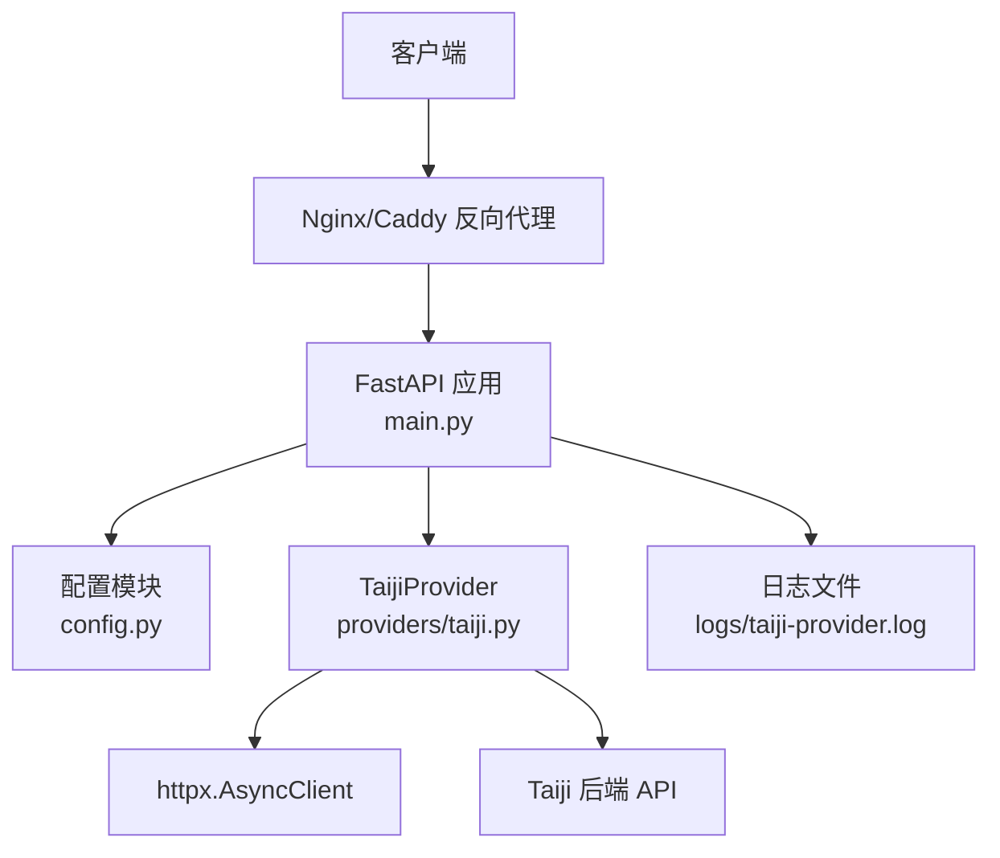
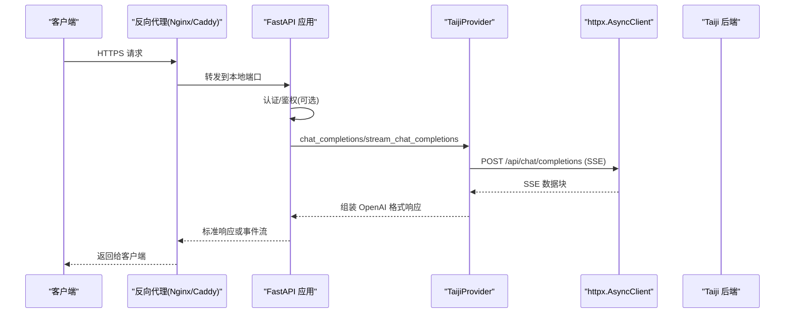
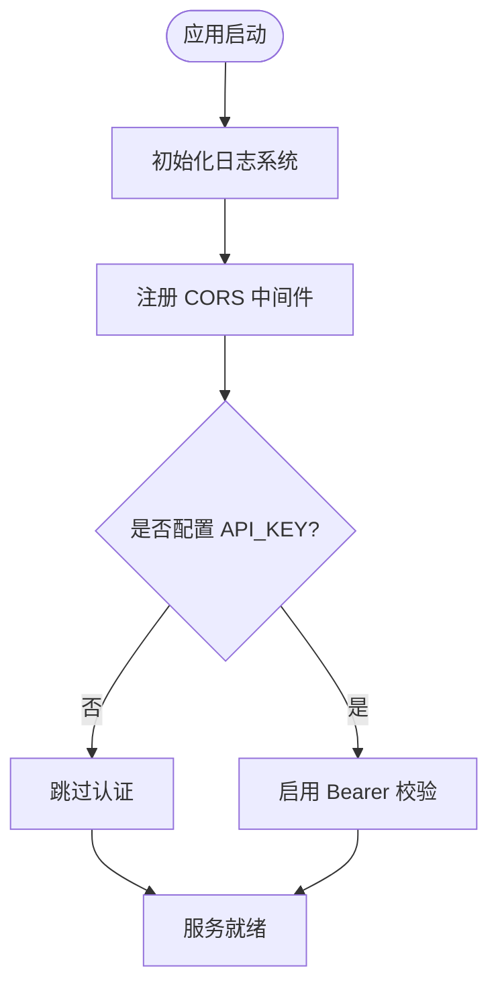
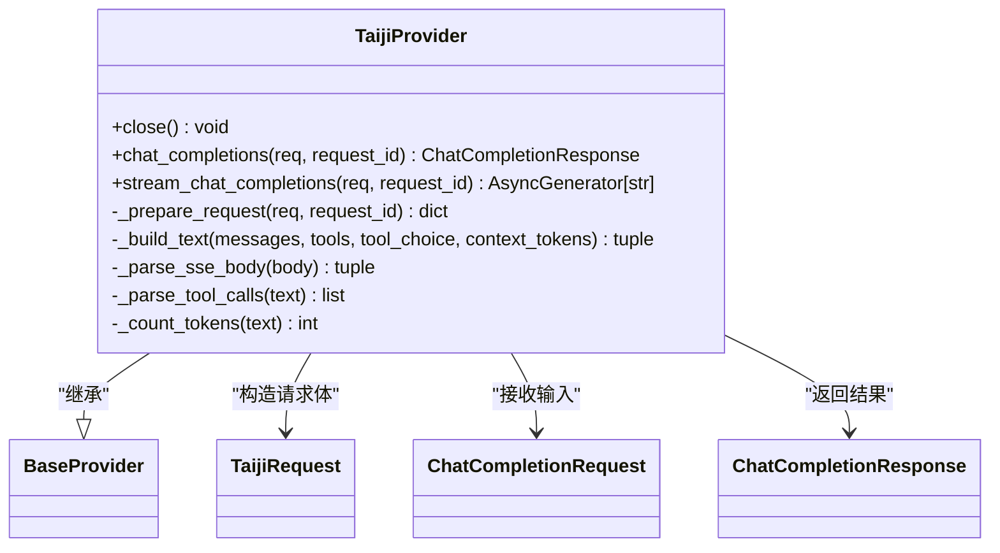
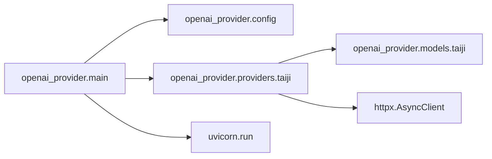
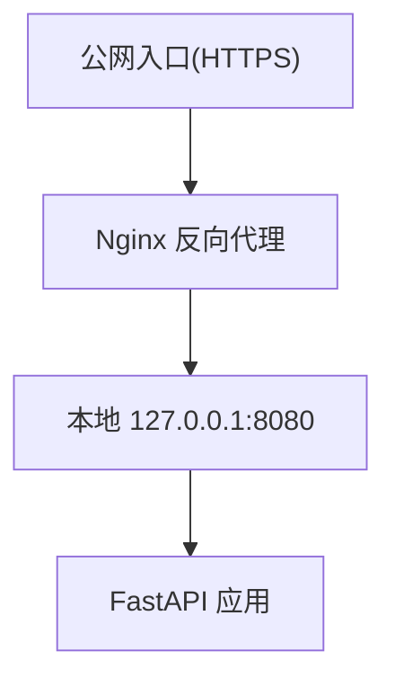
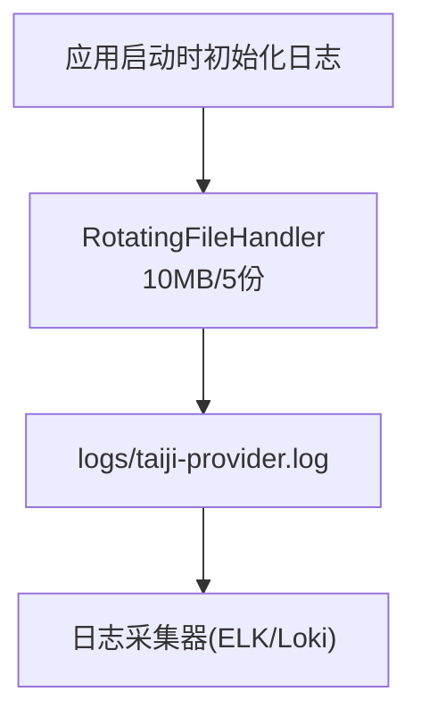

# 生产环境部署

<cite>
**本文引用的文件**   
- [src/openai_provider/main.py](file://src/openai_provider/main.py)
- [src/openai_provider/config.py](file://src/openai_provider/config.py)
- [src/openai_provider/providers/taiji.py](file://src/openai_provider/providers/taiji.py)
- [src/openai_provider/models/taiji.py](file://src/openai_provider/models/taiji.py)
- [start.sh](file://start.sh)
- [pyproject.toml](file://pyproject.toml)
</cite>

## 目录
1. [简介](#简介)
2. [项目结构](#项目结构)
3. [核心组件](#核心组件)
4. [架构总览](#架构总览)
5. [详细组件分析](#详细组件分析)
6. [依赖关系分析](#依赖关系分析)
7. [性能与容量规划](#性能与容量规划)
8. [反向代理与负载均衡](#反向代理与负载均衡)
9. [SSL 证书与安全加固](#ssl-证书与安全加固)
10. [监控、指标与可观测性](#监控指标与可观测性)
11. [日志轮转与采集](#日志轮转与采集)
12. [健康检查与就绪探针](#健康检查与就绪探针)
13. [进程守护与多实例编排](#进程守护与多实例编排)
14. [数据库连接池与外部依赖优化](#数据库连接池与外部依赖优化)
15. [内存管理与资源限制](#内存管理与资源限制)
16. [故障排查指南](#故障排查指南)
17. [结论](#结论)

## 简介
本指南面向生产环境，围绕多进程配置、性能调优、安全加固、反向代理（Nginx/Caddy）、SSL 证书、负载均衡、监控指标、日志轮转与健康检查等主题，提供端到端落地方案。本项目为 OpenAI 兼容的 Taiji LLM 网关，基于 FastAPI + Uvicorn 运行，通过环境变量驱动配置，支持可选 Bearer Token 认证、结构化 JSON 日志与 SSE 流式响应。

## 项目结构
- 应用入口与路由：FastAPI 应用定义、中间件、认证、健康检查、OpenAI 兼容端点
- 配置中心：基于 pydantic-settings 的环境变量加载与校验
- Provider 实现：将 OpenAI 请求转换为 Taiji 后端调用，处理 SSE 解析、工具调用、token 估算
- 启动脚本：开发/生产模式切换、Uvicorn 参数注入、多 worker 控制
- 构建与依赖：Python 版本约束、运行时依赖、可选开发依赖

图表来源
- [src/openai_provider/main.py:89-99](file://src/openai_provider/main.py#L89-L99)
- [src/openai_provider/config.py:12-55](file://src/openai_provider/config.py#L12-L55)
- [src/openai_provider/providers/taiji.py:53-60](file://src/openai_provider/providers/taiji.py#L53-L60)
- [src/openai_provider/providers/taiji.py:593-600](file://src/openai_provider/providers/taiji.py#L593-L600)

章节来源
- [src/openai_provider/main.py:89-99](file://src/openai_provider/main.py#L89-L99)
- [src/openai_provider/config.py:12-55](file://src/openai_provider/config.py#L12-L55)
- [start.sh:100-122](file://start.sh#L100-L122)
- [pyproject.toml:5-16](file://pyproject.toml#L5-L16)

## 核心组件
- 应用生命周期与中间件
  - 在应用启动时初始化日志系统，关闭时清理 Provider 资源；注册 CORS 中间件，按环境变量动态设置允许来源。
- 认证中间件
  - 可选 Bearer Token 校验，未配置 API_KEY 则跳过认证；错误返回 OpenAI 风格错误体。
- 健康检查端点
  - /health 返回简单状态，用于存活探针。
- 模型列表与版本探测
  - /v1/models、/api/v1/models、/version 等端点满足兼容性需求。
- 日志系统
  - JSON 结构化日志，输出到 logs 目录，使用 RotatingFileHandler 进行轮转。

章节来源
- [src/openai_provider/main.py:81-99](file://src/openai_provider/main.py#L81-L99)
- [src/openai_provider/main.py:105-126](file://src/openai_provider/main.py#L105-L126)
- [src/openai_provider/main.py:128-131](file://src/openai_provider/main.py#L128-L131)
- [src/openai_provider/main.py:272-316](file://src/openai_provider/main.py#L272-L316)
- [src/openai_provider/main.py:49-69](file://src/openai_provider/main.py#L49-L69)

## 架构总览
整体采用“反向代理 + 单应用多进程”模式：
- 反向代理负责 TLS 终止、静态资源、限流、访问控制、转发至内网端口
- 应用层由 FastAPI 暴露 OpenAI 兼容接口，内部通过 httpx 异步调用 Taiji 后端
- 日志落盘并轮转，便于集中采集与审计
- 通过环境变量统一配置服务监听、CORS、认证、模型能力等

图表来源
- [src/openai_provider/main.py:134-257](file://src/openai_provider/main.py#L134-L257)
- [src/openai_provider/providers/taiji.py:670-780](file://src/openai_provider/providers/taiji.py#L670-L780)
- [src/openai_provider/providers/taiji.py:782-800](file://src/openai_provider/providers/taiji.py#L782-L800)

## 详细组件分析

### 应用主入口与中间件
- 生命周期管理：启动时初始化日志，关闭时释放 Provider 资源
- CORS 中间件：从环境变量读取允许来源，支持凭据与通配方法/头
- 认证中间件：HTTPBearer 可选启用，未配置密钥则放行
- 异常处理器：统一将 HTTPException 转为 OpenAI 风格错误体

图表来源
- [src/openai_provider/main.py:81-99](file://src/openai_provider/main.py#L81-L99)
- [src/openai_provider/main.py:105-126](file://src/openai_provider/main.py#L105-L126)
- [src/openai_provider/main.py:319-330](file://src/openai_provider/main.py#L319-L330)

章节来源
- [src/openai_provider/main.py:81-99](file://src/openai_provider/main.py#L81-L99)
- [src/openai_provider/main.py:105-126](file://src/openai_provider/main.py#L105-L126)
- [src/openai_provider/main.py:319-330](file://src/openai_provider/main.py#L319-L330)

### 配置模块
- 读取顺序：环境变量 > .env 文件 > 默认值
- 关键项：
  - TAIJI_BASE_URL、TAIJI_API_KEY、TAIJI_MAX_TEXT_LENGTH、TAIJI_CONTENT_FIELDS、TAIJI_SESSION_ID、TAIJI_SESSION_COOKIE
  - API_KEY（可选）
  - APP_HOST、APP_PORT
  - MODEL_CONTEXT_LENGTH、MODEL_MAX_COMPLETION_TOKENS
  - CORS_ORIGINS

章节来源
- [src/openai_provider/config.py:12-55](file://src/openai_provider/config.py#L12-L55)

### Provider 实现（TaijiProvider）
- 请求准备：构造 TaijiRequest，透传 temperature/max_tokens/top_p/penalties 等参数
- 文本构建与截断：智能拼接 system/tools prompt 与最近对话，确保不超过最大长度
- 工具调用解析：支持 XML/DSML 与 JSON 两种格式，自动剥离 tool_calls 内容
- SSE 解析：提取 content/reasoning_content/token 用量信息
- 非流式/流式双路径：分别返回完整响应或逐块事件流

图表来源
- [src/openai_provider/providers/taiji.py:46-60](file://src/openai_provider/providers/taiji.py#L46-L60)
- [src/openai_provider/providers/taiji.py:520-600](file://src/openai_provider/providers/taiji.py#L520-L600)
- [src/openai_provider/providers/taiji.py:670-780](file://src/openai_provider/providers/taiji.py#L670-L780)
- [src/openai_provider/providers/taiji.py:782-800](file://src/openai_provider/providers/taiji.py#L782-L800)
- [src/openai_provider/models/taiji.py:8-21](file://src/openai_provider/models/taiji.py#L8-L21)

章节来源
- [src/openai_provider/providers/taiji.py:53-60](file://src/openai_provider/providers/taiji.py#L53-L60)
- [src/openai_provider/providers/taiji.py:520-600](file://src/openai_provider/providers/taiji.py#L520-L600)
- [src/openai_provider/providers/taiji.py:670-780](file://src/openai_provider/providers/taiji.py#L670-L780)
- [src/openai_provider/providers/taiji.py:782-800](file://src/openai_provider/providers/taiji.py#L782-L800)
- [src/openai_provider/models/taiji.py:8-21](file://src/openai_provider/models/taiji.py#L8-L21)

### 启动脚本与多进程
- 支持 dev/prod 模式，dev 开启热重载，prod 支持多 worker
- 通过环境变量 APP_HOST、APP_PORT、UVICORN_WORKERS 控制
- 生产模式下根据 workers 数量选择多进程或单进程启动

章节来源
- [start.sh:100-122](file://start.sh#L100-L122)
- [start.sh:11-13](file://start.sh#L11-L13)

## 依赖关系分析
- 运行时依赖：fastapi、uvicorn[standard]、httpx、pydantic、pydantic-settings
- Python 版本要求：>=3.11
- 可选开发依赖：pytest、mypy、ruff、black

图表来源
- [pyproject.toml:5-16](file://pyproject.toml#L5-L16)
- [src/openai_provider/main.py:333-341](file://src/openai_provider/main.py#L333-L341)

章节来源
- [pyproject.toml:5-16](file://pyproject.toml#L5-L16)

## 性能与容量规划
- 进程模型
  - 生产建议：workers = CPU 核数或略高（如 2×CPU），结合压测确定最佳并发度
  - 单进程适合调试或小流量场景
- 超时与连接
  - httpx 默认超时 60s，长文本生成需关注后端耗时；必要时调整上游代理超时
- 流式传输
  - SSE 流式可降低首字节延迟，注意代理层 keep-alive 与缓冲策略
- 文本长度限制
  - TAIJI_MAX_TEXT_LENGTH 保守设置为 800K，避免超长导致失败或 OOM

章节来源
- [src/openai_provider/providers/taiji.py:593-600](file://src/openai_provider/providers/taiji.py#L593-L600)
- [src/openai_provider/config.py:24-33](file://src/openai_provider/config.py#L24-L33)

## 反向代理与负载均衡

### Nginx 推荐配置要点
- 监听 443，启用 TLS，指向本地 8080
- 开启 gzip 压缩、keepalive 连接
- 设置合理的 proxy_read_timeout 以适配长流式响应
- 添加安全头（HSTS、X-Frame-Options、X-Content-Type-Options）
- 可选：限流、IP 白名单、访问日志

图表来源
- [start.sh:108-121](file://start.sh#L108-L121)

### Caddy 推荐配置要点
- 自动 HTTPS（ACME 证书）
- 反向代理到本地 8080
- 设置超时与压缩
- 添加安全头与访问日志

[本节为通用实践说明，不直接分析具体代码文件]

## SSL 证书与安全加固

### 证书管理
- Nginx：手动管理证书与私钥路径，定期续期
- Caddy：自动申请与续期 Let’s Encrypt 证书

### 安全加固清单
- 仅开放必要端口，禁用不必要的协议与算法
- 启用 HSTS、严格的安全头
- 最小化 CORS 允许来源，生产环境避免通配符
- 强制启用 API_KEY 认证，并在代理层做 IP 白名单或 WAF
- 限制请求体大小与速率，防止滥用

章节来源
- [src/openai_provider/config.py:46-47](file://src/openai_provider/config.py#L46-L47)
- [src/openai_provider/main.py:91-99](file://src/openai_provider/main.py#L91-L99)

## 监控指标与可观测性

### 内置指标
- 当前未内置 Prometheus 指标导出器，可通过以下方式扩展：
  - 引入 prometheus-fastapi-instrumentor 或 starlette-prometheus 暴露 /metrics
  - 自定义中间件统计 QPS、延迟分位、错误率
  - 对 Provider 调用埋点，记录下游耗时与错误码

### 链路追踪
- 利用 request_id 贯穿请求链路，结合结构化日志在 ELK/Loki 中检索
- 可在中间件中注入 trace_id，对接 Jaeger/OpenTelemetry

### 健康检查
- /health 返回 {"status":"ok"}，供 K8s liveness/readiness 探针使用

章节来源
- [src/openai_provider/main.py:128-131](file://src/openai_provider/main.py#L128-L131)

## 日志轮转与采集

### 日志结构与轮转
- JSON 结构化日志，包含 timestamp、level、logger、message、request_id 等字段
- 使用 RotatingFileHandler，单文件 10MB，保留 5 份
- 独立 logger 名称区分 raw_request/raw_response/provider_request/provider_response

图表来源
- [src/openai_provider/main.py:49-69](file://src/openai_provider/main.py#L49-L69)

章节来源
- [src/openai_provider/main.py:49-69](file://src/openai_provider/main.py#L49-L69)

## 健康检查与就绪探针
- 存活探针：GET /health 返回 200 表示进程存活
- 就绪探针：可扩展为检查依赖连通性（如 Taiji 后端可达性）后返回 200
- 在 K8s 中配置 livenessProbe 与 readinessProbe，避免误杀

章节来源
- [src/openai_provider/main.py:128-131](file://src/openai_provider/main.py#L128-L131)

## 进程守护与多实例编排

### 进程守护
- systemd：创建 service 单元，指定 ExecStart 调用 start.sh，设置 Restart=always
- Docker：使用官方 uvicorn 镜像，CMD 传入 host/port/workers，配合 healthcheck
- Kubernetes：Deployment 多副本 + Service + Ingress/Nginx Ingress

### 多进程配置
- 通过 UVICORN_WORKERS 控制 worker 数量
- 生产建议：workers ≈ CPU 核数 × 2，结合压测与资源配额调整

章节来源
- [start.sh:11-13](file://start.sh#L11-L13)
- [start.sh:108-121](file://start.sh#L108-L121)

## 数据库连接池与外部依赖优化
- 本项目未直连数据库，主要外部依赖为 Taiji 后端
- 连接与超时
  - httpx.AsyncClient 默认超时 60s，可根据业务调整
  - 在高并发下复用连接可减少握手开销（httpx 默认行为）
- 重试与熔断
  - 建议在代理层或上层网关实现重试与熔断策略
  - 应用层可按需增加指数退避重试逻辑

章节来源
- [src/openai_provider/providers/taiji.py:593-600](file://src/openai_provider/providers/taiji.py#L593-L600)

## 内存管理与资源限制
- 文本截断策略：超过 TAIJI_MAX_TEXT_LENGTH 时进行硬截断，避免过大请求
- 流式处理：SSE 逐块发送，降低峰值内存占用
- 容器资源：合理设置 requests/limits，避免被 OOM Killer 回收
- 垃圾回收：长时间运行的进程建议定期触发 GC 或重启 worker

章节来源
- [src/openai_provider/providers/taiji.py:531-537](file://src/openai_provider/providers/taiji.py#L531-L537)

## 故障排查指南
- 常见问题定位
  - 认证失败：检查 API_KEY 是否正确传递，确认代理层是否透传 Authorization
  - 超时：查看 provider_response 日志中的 latency_ms，评估是否需要增大超时或优化上游
  - 文本过长：关注 truncation 相关日志，调整 TAIJI_MAX_TEXT_LENGTH
- 日志关键字
  - raw_request/raw_response：原始请求与响应
  - provider_request/provider_response：下游调用详情
  - httpcore.connection/httpcore.http11：底层连接与 HTTP 交互

章节来源
- [src/openai_provider/main.py:149-183](file://src/openai_provider/main.py#L149-L183)
- [src/openai_provider/main.py:221-257](file://src/openai_provider/main.py#L221-L257)
- [src/openai_provider/providers/taiji.py:692-704](file://src/openai_provider/providers/taiji.py#L692-L704)

## 结论
本指南提供了从多进程启动、反向代理、TLS 与安全、监控与日志、健康检查到资源与性能调优的全链路生产部署方案。结合环境变量驱动的灵活配置与结构化日志，可在不同环境中快速落地并持续优化。建议在生产前完成压测与容量规划，逐步引入指标与追踪体系，完善告警与自愈机制。