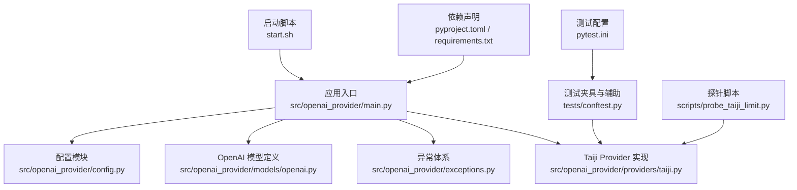
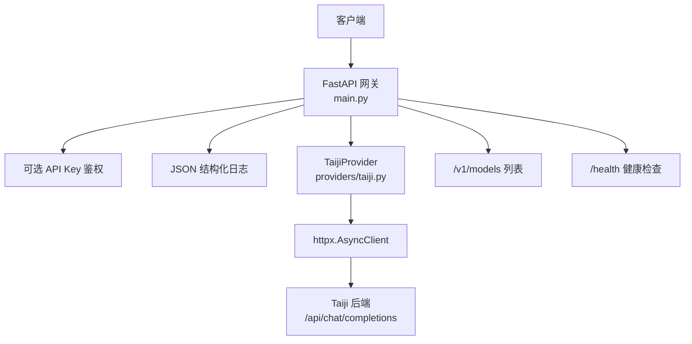
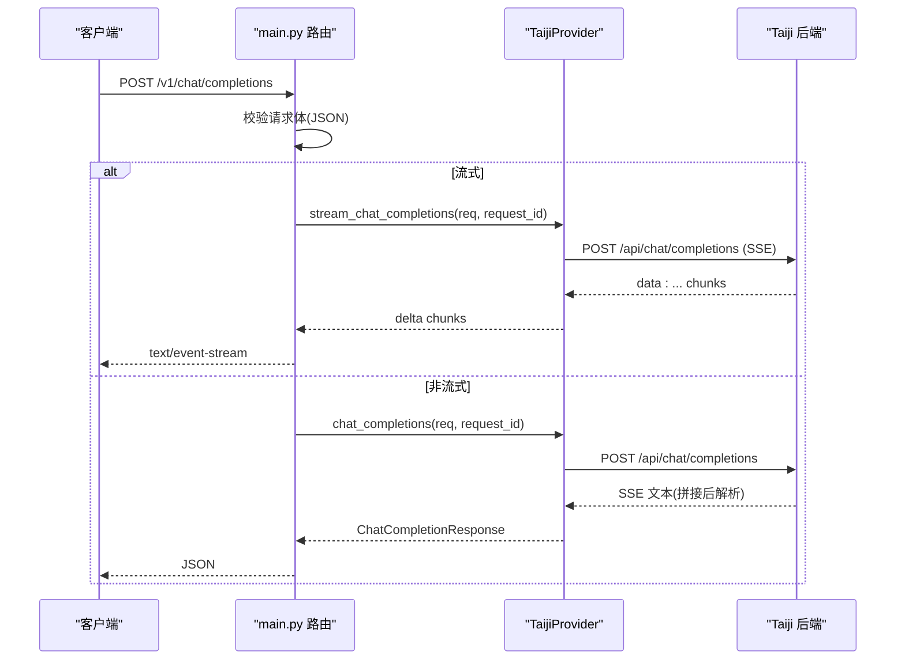
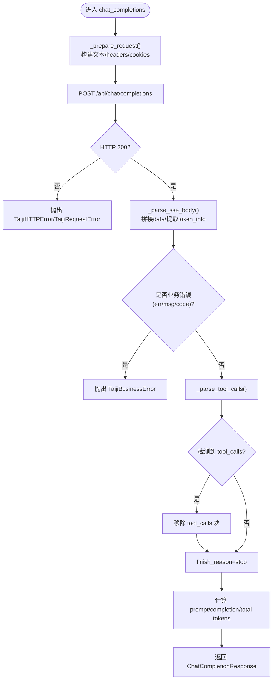
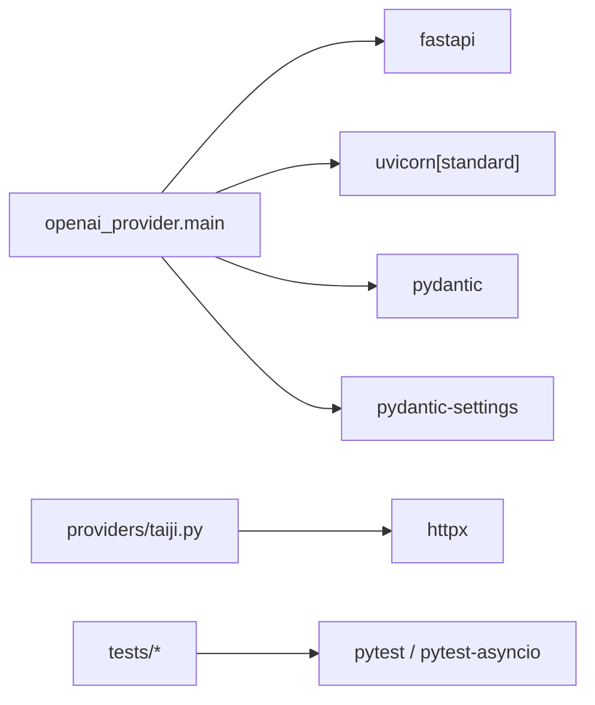

# 部署指南

<cite>
**本文引用的文件**   
- [pyproject.toml](file://pyproject.toml)
- [requirements.txt](file://requirements.txt)
- [start.sh](file://start.sh)
- [src/openai_provider/main.py](file://src/openai_provider/main.py)
- [src/openai_provider/config.py](file://src/openai_provider/config.py)
- [src/openai_provider/providers/taiji.py](file://src/openai_provider/providers/taiji.py)
- [src/openai_provider/models/openai.py](file://src/openai_provider/models/openai.py)
- [src/openai_provider/exceptions.py](file://src/openai_provider/exceptions.py)
- [tests/conftest.py](file://tests/conftest.py)
- [pytest.ini](file://pytest.ini)
- [scripts/probe_taiji_limit.py](file://scripts/probe_taiji_limit.py)
</cite>

## 目录
1. [简介](#简介)
2. [项目结构](#项目结构)
3. [核心组件](#核心组件)
4. [架构总览](#架构总览)
5. [详细组件分析](#详细组件分析)
6. [依赖关系分析](#依赖关系分析)
7. [性能考虑与调优](#性能考虑与调优)
8. [监控与日志收集](#监控与日志收集)
9. [安全加固](#安全加固)
10. [备份策略与灾难恢复](#备份策略与灾难恢复)
11. [扩展性与高可用部署模式](#扩展性与高可用部署模式)
12. [故障排查指南](#故障排查指南)
13. [结论](#结论)
14. [附录：环境变量清单](#附录环境变量清单)

## 简介
本指南面向开发与生产环境，提供从本地开发、容器化到 Kubernetes 和云服务的完整部署流程。项目是一个 OpenAI 兼容网关，将请求转发至 Taiji LLM 后端，支持非流式与流式响应、工具调用、思考内容分离与 Token 用量统计。文档涵盖镜像构建、Kubernetes 配置、云服务部署选项、性能调优、监控与日志、安全加固、备份与灾备、扩展性与高可用等主题。

## 项目结构
仓库采用 Python FastAPI 应用结构，核心入口位于 src/openai_provider/main.py，配置通过 pydantic-settings 管理，启动脚本 start.sh 封装了 uvicorn 运行参数。测试使用 pytest，E2E 用例在 tests/e2e 下。

图表来源
- [src/openai_provider/main.py:1-120](file://src/openai_provider/main.py#L1-L120)
- [src/openai_provider/config.py:1-56](file://src/openai_provider/config.py#L1-L56)
- [src/openai_provider/models/openai.py:1-177](file://src/openai_provider/models/openai.py#L1-L177)
- [src/openai_provider/exceptions.py:1-40](file://src/openai_provider/exceptions.py#L1-L40)
- [src/openai_provider/providers/taiji.py:1-120](file://src/openai_provider/providers/taiji.py#L1-L120)
- [start.sh:1-123](file://start.sh#L1-L123)
- [pyproject.toml:1-55](file://pyproject.toml#L1-L55)
- [requirements.txt:1-13](file://requirements.txt#L1-L13)
- [tests/conftest.py:1-160](file://tests/conftest.py#L1-L160)
- [pytest.ini:1-3](file://pytest.ini#L1-L3)
- [scripts/probe_taiji_limit.py:1-145](file://scripts/probe_taiji_limit.py#L1-L145)

章节来源
- [pyproject.toml:1-55](file://pyproject.toml#L1-L55)
- [requirements.txt:1-13](file://requirements.txt#L1-L13)
- [start.sh:1-123](file://start.sh#L1-L123)
- [src/openai_provider/main.py:1-120](file://src/openai_provider/main.py#L1-L120)
- [src/openai_provider/config.py:1-56](file://src/openai_provider/config.py#L1-L56)
- [src/openai_provider/providers/taiji.py:1-120](file://src/openai_provider/providers/taiji.py#L1-L120)
- [src/openai_provider/models/openai.py:1-177](file://src/openai_provider/models/openai.py#L1-L177)
- [src/openai_provider/exceptions.py:1-40](file://src/openai_provider/exceptions.py#L1-L40)
- [tests/conftest.py:1-160](file://tests/conftest.py#L1-L160)
- [pytest.ini:1-3](file://pytest.ini#L1-L3)
- [scripts/probe_taiji_limit.py:1-145](file://scripts/probe_taiji_limit.py#L1-L145)

## 核心组件
- 应用入口与路由：提供 /health、/v1/chat/completions、/v1/models、/version 等端点；内置 CORS、可选 API Key 认证、结构化 JSON 日志与健康检查。
- 配置系统：基于 pydantic-settings，读取顺序为“环境变量 > .env 文件 > 默认值”，包含 Taiji 后端地址、密钥、会话 Cookie、最大文本长度、CORS 源、监听地址与端口、模型能力暴露等。
- Provider 实现：将 OpenAI Chat Completions 请求转换为 Taiji API 调用，处理 SSE 解析、tool_calls 提取、think 标签分离、Token 估算与用量统计。
- 数据模型：OpenAI 兼容的请求与响应 Pydantic 模型，统一序列化行为（排除 None）。
- 异常体系：区分超时、HTTP 错误、业务错误与网络层错误，便于上层统一处理与返回 OpenAI 风格错误体。

章节来源
- [src/openai_provider/main.py:128-342](file://src/openai_provider/main.py#L128-L342)
- [src/openai_provider/config.py:12-56](file://src/openai_provider/config.py#L12-L56)
- [src/openai_provider/providers/taiji.py:46-120](file://src/openai_provider/providers/taiji.py#L46-L120)
- [src/openai_provider/models/openai.py:12-177](file://src/openai_provider/models/openai.py#L12-L177)
- [src/openai_provider/exceptions.py:8-40](file://src/openai_provider/exceptions.py#L8-L40)

## 架构总览
整体架构由客户端、FastAPI 网关、Provider 层与 Taiji 后端组成。网关负责协议适配、鉴权、日志与错误转换；Provider 负责请求构建、SSE 解析、工具调用与 Token 统计；最终请求转发至 Taiji 后端。

图表来源
- [src/openai_provider/main.py:128-342](file://src/openai_provider/main.py#L128-L342)
- [src/openai_provider/providers/taiji.py:520-600](file://src/openai_provider/providers/taiji.py#L520-L600)

## 详细组件分析

### 应用入口与生命周期
- 生命周期：初始化日志、关闭时清理 Provider 资源。
- 中间件：CORS 通过环境变量配置；可选 Bearer Token 认证。
- 路由：
  - /health：健康检查
  - /v1/chat/completions：OpenAI 兼容聊天补全（支持流式与非流式）
  - /v1/models、/v1/models/{model_id}、/api/v1/models：模型发现
  - /api/tags、/props、/v1/props：兼容性端点
  - /version：版本信息
- 异常处理：将 HTTPException 转换为 OpenAI 风格错误体。

图表来源
- [src/openai_provider/main.py:134-257](file://src/openai_provider/main.py#L134-L257)
- [src/openai_provider/providers/taiji.py:670-780](file://src/openai_provider/providers/taiji.py#L670-L780)
- [src/openai_provider/providers/taiji.py:782-800](file://src/openai_provider/providers/taiji.py#L782-L800)

章节来源
- [src/openai_provider/main.py:81-127](file://src/openai_provider/main.py#L81-L127)
- [src/openai_provider/main.py:128-342](file://src/openai_provider/main.py#L128-L342)

### 配置系统
- 读取顺序：环境变量 > .env 文件 > 默认值。
- 关键项：
  - 后端：TAIJI_BASE_URL、TAIJI_API_KEY、TAIJI_MAX_TEXT_LENGTH、TAIJI_CONTENT_FIELDS、TAIJI_SESSION_ID、TAIJI_SESSION_COOKIE
  - 服务：APP_HOST、APP_PORT、CORS_ORIGINS
  - 模型能力：MODEL_CONTEXT_LENGTH、MODEL_MAX_COMPLETION_TOKENS
  - 认证：API_KEY（可选）

章节来源
- [src/openai_provider/config.py:12-56](file://src/openai_provider/config.py#L12-L56)

### Provider 实现（TaijiProvider）
- 请求构建：将 OpenAI messages 转为 taiji 纯文本，智能截断以不超过最大长度；注入 tools prompt；构造 headers、cookies、URL。
- SSE 解析：按行解析 data 字段，提取字符串内容与 token 用量；剥离 <think> 推理内容；检测业务错误（err/msg/code）。
- 工具调用：支持 XML/DSML 与 JSON 两种格式，自动提取并清理 tool_calls。
- Token 统计：优先使用 taiji 返回的 completion_tokens，否则回退估算；total_tokens = prompt + completion。
- 流式输出：生成 OpenAI 兼容的 delta chunk，并在结束时发送 usage。

图表来源
- [src/openai_provider/providers/taiji.py:520-600](file://src/openai_provider/providers/taiji.py#L520-L600)
- [src/openai_provider/providers/taiji.py:633-668](file://src/openai_provider/providers/taiji.py#L633-L668)
- [src/openai_provider/providers/taiji.py:670-780](file://src/openai_provider/providers/taiji.py#L670-L780)

章节来源
- [src/openai_provider/providers/taiji.py:46-120](file://src/openai_provider/providers/taiji.py#L46-L120)
- [src/openai_provider/providers/taiji.py:520-600](file://src/openai_provider/providers/taiji.py#L520-L600)
- [src/openai_provider/providers/taiji.py:633-668](file://src/openai_provider/providers/taiji.py#L633-L668)
- [src/openai_provider/providers/taiji.py:670-780](file://src/openai_provider/providers/taiji.py#L670-L780)

### 数据模型（OpenAI 兼容）
- 基础模型：OpenAIModel 默认排除 None 字段。
- 请求：ChatCompletionRequest（含 temperature、max_tokens、top_p、tools、tool_choice 等）。
- 响应：ChatCompletionResponse、Usage、ChatCompletionMessage、ChatCompletionChoice。
- 流式：ChatCompletionStreamResponse、ChatCompletionDelta、ChatCompletionStreamChoice。

章节来源
- [src/openai_provider/models/openai.py:12-177](file://src/openai_provider/models/openai.py#L12-L177)

### 异常体系
- ProviderError 基类
- TaijiTimeoutError：请求超时
- TaijiHTTPError：非 200 状态码
- TaijiBusinessError：HTTP 200 但业务错误
- TaijiRequestError：网络层错误

章节来源
- [src/openai_provider/exceptions.py:8-40](file://src/openai_provider/exceptions.py#L8-L40)

## 依赖关系分析
- 运行时依赖：fastapi、uvicorn[standard]、httpx、pydantic、pydantic-settings。
- 开发依赖：pytest、pytest-asyncio、mypy、ruff。
- 包管理与构建：setuptools、wheel；Python >= 3.11。

图表来源
- [pyproject.toml:1-55](file://pyproject.toml#L1-L55)
- [requirements.txt:1-13](file://requirements.txt#L1-L13)
- [src/openai_provider/main.py:1-30](file://src/openai_provider/main.py#L1-L30)
- [src/openai_provider/providers/taiji.py:1-40](file://src/openai_provider/providers/taiji.py#L1-L40)
- [tests/conftest.py:1-30](file://tests/conftest.py#L1-L30)

章节来源
- [pyproject.toml:1-55](file://pyproject.toml#L1-L55)
- [requirements.txt:1-13](file://requirements.txt#L1-L13)

## 性能考虑与调优
- 进程与并发
  - 开发模式：单进程热重载（start.sh dev）。
  - 生产模式：多 worker（UVICORN_WORKERS），建议根据 CPU 核数设置 workers。
- 超时与连接
  - httpx 客户端默认超时 60s，可根据后端延迟调整。
- 文本长度限制
  - 通过 TAIJI_MAX_TEXT_LENGTH 控制最大输入长度；Provider 内部有智能截断与兜底硬截断。
- Token 统计
  - 优先使用 taiji 返回的 completion_tokens；缺失时回退估算；total_tokens 严格等于 prompt + completion。
- 流式优化
  - 使用 StreamingResponse 与 text/event-stream，减少首字节延迟。
- 日志级别
  - 生产建议使用 info 或 warn，避免 DEBUG 造成 IO 压力。

章节来源
- [start.sh:100-122](file://start.sh#L100-L122)
- [src/openai_provider/providers/taiji.py:520-600](file://src/openai_provider/providers/taiji.py#L520-L600)
- [src/openai_provider/providers/taiji.py:670-780](file://src/openai_provider/providers/taiji.py#L670-L780)
- [src/openai_provider/main.py:185-218](file://src/openai_provider/main.py#L185-L218)

## 监控与日志收集
- 结构化日志
  - JSONFormatter 输出到 logs/taiji-provider.log，按大小轮转（10MB，保留 5 份）。
  - 记录原始请求与响应摘要、latency_ms、status_code、request_id 等。
- 健康检查
  - /health 返回 {"status":"ok"}，可用于存活探针。
- 指标采集建议
  - 结合 uvicorn 指标与外部监控系统（如 Prometheus）采集 QPS、延迟、错误率。
  - 对 Provider 层增加自定义指标（如 provider_error、timeout、business_error）。

章节来源
- [src/openai_provider/main.py:32-69](file://src/openai_provider/main.py#L32-L69)
- [src/openai_provider/main.py:128-132](file://src/openai_provider/main.py#L128-L132)
- [src/openai_provider/providers/taiji.py:692-704](file://src/openai_provider/providers/taiji.py#L692-L704)

## 安全加固
- 认证
  - 可选 API Key（Bearer Token），未配置则跳过认证。
- CORS
  - 通过 CORS_ORIGINS 精确控制允许的来源，避免使用通配符在生产环境。
- 敏感信息
  - 使用环境变量或密钥管理服务注入 TAIJI_API_KEY、API_KEY、TAIJI_SESSION_COOKIE。
- 最小权限
  - 容器内仅开放必要端口；限制文件系统写入（只读根文件系统，logs 使用持久卷）。
- 传输安全
  - 前置反向代理（Nginx/Ingress）启用 TLS，强制 HTTPS。

章节来源
- [src/openai_provider/main.py:105-126](file://src/openai_provider/main.py#L105-L126)
- [src/openai_provider/main.py:91-99](file://src/openai_provider/main.py#L91-L99)
- [src/openai_provider/config.py:24-47](file://src/openai_provider/config.py#L24-L47)

## 备份策略与灾难恢复
- 日志备份
  - logs/taiji-provider.log 定期归档与压缩，保留策略与轮转数量一致。
- 配置与密钥
  - 使用配置中心或密钥管理服务，避免本地明文存储。
- 会话与状态
  - 当前无本地持久状态；若未来引入缓存或会话，需设计分布式共享与失效策略。
- 灾备演练
  - 定期演练重启、滚动升级与回滚流程，验证健康检查与流量切换。

章节来源
- [src/openai_provider/main.py:50-69](file://src/openai_provider/main.py#L50-L69)

## 扩展性与高可用部署模式
- 水平扩展
  - 多副本 Pod/实例，配合负载均衡器分发请求。
- 无状态设计
  - 应用无本地状态，适合横向扩展。
- 高可用
  - 多副本 + 健康检查 + 自动重启；上游负载均衡具备故障转移。
- 弹性伸缩
  - 基于 CPU/内存或自定义指标（QPS、延迟）进行自动扩缩容。

章节来源
- [src/openai_provider/main.py:81-89](file://src/openai_provider/main.py#L81-L89)
- [src/openai_provider/providers/taiji.py:62-64](file://src/openai_provider/providers/taiji.py#L62-L64)

## 故障排查指南
- 常见问题
  - 依赖未安装：启动脚本会检查 fastapi 是否存在。
  - 认证失败：检查 API_KEY 是否正确传入。
  - 后端错误：Provider 会将 HTTP 非 200 与业务错误转换为结构化异常。
  - 超时：检查 TAIJI_BASE_URL 可达性与网络状况。
- 诊断步骤
  - 查看 logs/taiji-provider.log 中的 raw_request/raw_response/provider_request/provider_response 日志。
  - 使用 /health 与 /version 确认服务可用性。
  - 使用探针脚本 probe_taiji_limit.py 探测后端最大文本长度与连通性。

章节来源
- [start.sh:92-96](file://start.sh#L92-L96)
- [src/openai_provider/main.py:108-126](file://src/openai_provider/main.py#L108-L126)
- [src/openai_provider/providers/taiji.py:682-720](file://src/openai_provider/providers/taiji.py#L682-L720)
- [scripts/probe_taiji_limit.py:1-145](file://scripts/probe_taiji_limit.py#L1-145)

## 结论
本项目提供了 OpenAI 兼容的 Taiji 网关，具备完善的配置、日志、认证与错误处理能力。通过合理的进程与并发配置、结构化日志与监控、安全加固与高可用部署，可在开发与生产环境中稳定运行。建议在生产中启用多副本、TLS、密钥管理与集中式日志收集，并结合探针脚本持续评估后端能力边界。

## 附录：环境变量清单
- TAIJI_BASE_URL：Taiji 后端地址
- TAIJI_API_KEY：Taiji API 密钥
- TAIJI_MAX_TEXT_LENGTH：最大文本长度
- TAIJI_CONTENT_FIELDS：SSE 响应中提取内容的字段名（逗号分隔）
- TAIJI_SESSION_ID：会话标识
- TAIJI_SESSION_COOKIE：会话 Cookie
- API_KEY：Provider 认证密钥（可选）
- APP_HOST：监听地址
- APP_PORT：监听端口
- MODEL_CONTEXT_LENGTH：上下文长度
- MODEL_MAX_COMPLETION_TOKENS：最大完成 token
- CORS_ORIGINS：允许的跨域来源
- UVICORN_WORKERS：worker 数量（生产模式）

章节来源
- [src/openai_provider/config.py:24-47](file://src/openai_provider/config.py#L24-L47)
- [start.sh:11-13](file://start.sh#L11-L13)