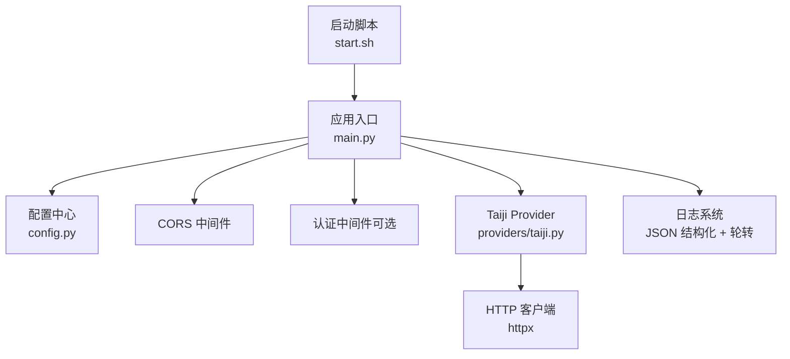
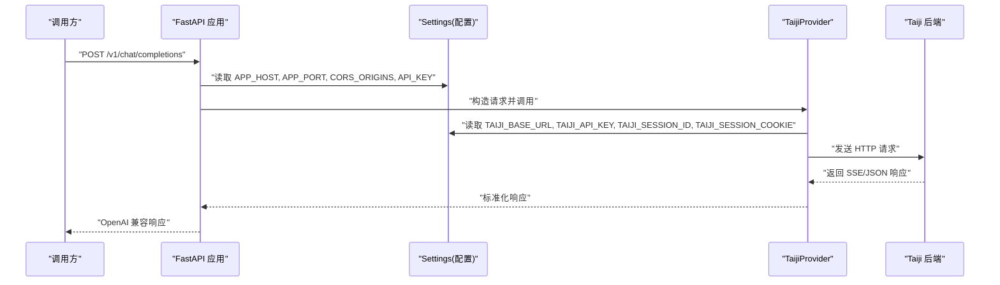
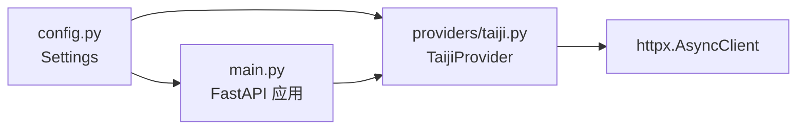

# 配置管理

<cite>
**本文引用的文件**
- [src/openai_provider/config.py](file://src/openai_provider/config.py)
- [src/openai_provider/main.py](file://src/openai_provider/main.py)
- [src/openai_provider/providers/taiji.py](file://src/openai_provider/providers/taiji.py)
- [start.sh](file://start.sh)
- [pyproject.toml](file://pyproject.toml)
- [.gitignore](file://.gitignore)
</cite>

## 目录
1. [简介](#简介)
2. [项目结构](#项目结构)
3. [核心组件](#核心组件)
4. [架构总览](#架构总览)
5. [详细组件分析](#详细组件分析)
6. [依赖关系分析](#依赖关系分析)
7. [性能与容量规划](#性能与容量规划)
8. [故障排查指南](#故障排查指南)
9. [结论](#结论)
10. [附录](#附录)

## 简介
本指南聚焦于项目的配置管理体系，覆盖所有环境变量、默认值、验证规则、优先级、安全最佳实践、热重载机制以及不同部署场景的配置示例。目标是帮助开发者与运维人员快速、正确地完成本地开发、测试与生产环境的配置与迁移。

## 项目结构
本项目采用基于 FastAPI 的网关服务，将 OpenAI 兼容接口转发至 Taiji LLM 后端。配置通过 pydantic-settings 集中管理，支持 .env 文件与环境变量覆盖，并在应用启动时加载。

图表来源
- [src/openai_provider/main.py:89-99](file://src/openai_provider/main.py#L89-L99)
- [src/openai_provider/config.py:12-55](file://src/openai_provider/config.py#L12-L55)
- [src/openai_provider/providers/taiji.py:46-61](file://src/openai_provider/providers/taiji.py#L46-L61)
- [start.sh:98-122](file://start.sh#L98-L122)

章节来源
- [src/openai_provider/config.py:12-55](file://src/openai_provider/config.py#L12-L55)
- [src/openai_provider/main.py:89-99](file://src/openai_provider/main.py#L89-L99)
- [src/openai_provider/providers/taiji.py:46-61](file://src/openai_provider/providers/taiji.py#L46-L61)
- [start.sh:98-122](file://start.sh#L98-L122)

## 核心组件
- 配置模型 Settings：集中定义所有配置项，提供类型校验、范围约束与解析方法。
- 应用主模块 main：初始化日志、CORS、认证、路由与异常处理，读取配置并驱动服务。
- Taiji Provider：从配置中读取后端连接参数，构建请求、解析响应、统计 token。
- 启动脚本 start.sh：封装 uvicorn 启动命令，支持 dev/prod 模式与常用参数。

章节来源
- [src/openai_provider/config.py:12-55](file://src/openai_provider/config.py#L12-L55)
- [src/openai_provider/main.py:49-99](file://src/openai_provider/main.py#L49-L99)
- [src/openai_provider/providers/taiji.py:46-61](file://src/openai_provider/providers/taiji.py#L46-L61)
- [start.sh:100-122](file://start.sh#L100-L122)

## 架构总览
配置在应用生命周期早期被加载，随后用于：
- 设置 CORS 允许源
- 启用/禁用 API Key 认证
- 暴露模型能力元信息（上下文长度、最大生成 token）
- 建立到 Taiji 后端的 HTTP 连接参数（基础 URL、鉴权头、会话 Cookie）

图表来源
- [src/openai_provider/main.py:134-257](file://src/openai_provider/main.py#L134-L257)
- [src/openai_provider/providers/taiji.py:520-600](file://src/openai_provider/providers/taiji.py#L520-L600)
- [src/openai_provider/config.py:24-47](file://src/openai_provider/config.py#L24-L47)

## 详细组件分析

### 配置模型 Settings
- 读取顺序：环境变量 > .env 文件 > 默认值
- 编码：.env 使用 UTF-8
- 未知字段：忽略
- 内置验证：数值范围、非空字符串等由 Field 与类型声明保证

关键配置项一览（按功能分组）：
- Taiji 后端连接
  - TAIJI_BASE_URL：后端基础地址
  - TAIJI_API_KEY：后端鉴权密钥
  - TAIJI_MAX_TEXT_LENGTH：文本上限（字符数），最小 1000
  - TAIJI_CONTENT_FIELDS：SSE 内容字段名列表（逗号分隔）
  - TAIJI_SESSION_ID：会话标识
  - TAIJI_SESSION_COOKIE：会话 Cookie
- Provider 认证（可选）
  - API_KEY：Barear Token 认证密钥；为空则不启用认证
- 服务监听
  - APP_HOST：监听地址
  - APP_PORT：监听端口，范围 1-65535
- 模型能力（对外暴露）
  - MODEL_CONTEXT_LENGTH：上下文长度
  - MODEL_MAX_COMPLETION_TOKENS：最大生成长度
- CORS
  - CORS_ORIGINS：允许的来源（逗号分隔或 *）

解析辅助：
- content_fields_list：将 TAIJI_CONTENT_FIELDS 解析为列表

章节来源
- [src/openai_provider/config.py:12-55](file://src/openai_provider/config.py#L12-L55)

### 应用主模块 main
- 日志：JSON 结构化输出，写入 logs/ 目录，单文件 10MB，保留 5 份
- CORS：根据 CORS_ORIGINS 动态配置
- 认证：若未设置 API_KEY，跳过认证；否则校验 Bearer Token
- 路由：/health、/v1/chat/completions、/v1/models、/api/tags、/version 等
- 异常：统一转换为 OpenAI 风格错误体

章节来源
- [src/openai_provider/main.py:49-99](file://src/openai_provider/main.py#L49-L99)
- [src/openai_provider/main.py:105-126](file://src/openai_provider/main.py#L105-L126)
- [src/openai_provider/main.py:128-331](file://src/openai_provider/main.py#L128-L331)

### Taiji Provider
- 从配置读取后端连接参数与内容字段解析策略
- 构建请求：包含 headers、cookies、超时、URL 等
- 解析 SSE：提取文本、思考过程、tool_calls、token 用量
- 截断策略：确保不超过 TAIJI_MAX_TEXT_LENGTH

章节来源
- [src/openai_provider/providers/taiji.py:46-61](file://src/openai_provider/providers/taiji.py#L46-L61)
- [src/openai_provider/providers/taiji.py:520-600](file://src/openai_provider/providers/taiji.py#L520-L600)
- [src/openai_provider/providers/taiji.py:633-668](file://src/openai_provider/providers/taiji.py#L633-L668)

### 启动脚本 start.sh
- 支持 dev/prod 两种模式
- 支持 --port、--host、--workers 参数
- 自动检测 Python 与依赖
- 默认日志级别 info，dev 模式开启热重载

章节来源
- [start.sh:100-122](file://start.sh#L100-L122)

## 依赖关系分析
- 运行时依赖：fastapi、uvicorn、httpx、pydantic、pydantic-settings
- 配置依赖：pydantic-settings 负责 .env 与环境变量合并与校验
- 网络依赖：httpx 异步客户端访问 Taiji 后端

图表来源
- [pyproject.toml:10-16](file://pyproject.toml#L10-L16)
- [src/openai_provider/config.py:12-22](file://src/openai_provider/config.py#L12-L22)
- [src/openai_provider/main.py:89-99](file://src/openai_provider/main.py#L89-L99)
- [src/openai_provider/providers/taiji.py:593-599](file://src/openai_provider/providers/taiji.py#L593-L599)

章节来源
- [pyproject.toml:10-16](file://pyproject.toml#L10-L16)
- [src/openai_provider/config.py:12-22](file://src/openai_provider/config.py#L12-L22)
- [src/openai_provider/providers/taiji.py:593-599](file://src/openai_provider/providers/taiji.py#L593-L599)

## 性能与容量规划
- 文本长度限制：TAIJI_MAX_TEXT_LENGTH 建议保守设置，避免超出后端限制导致硬截断
- 并发与 Worker：生产环境可通过 --workers 提升吞吐；注意无状态共享内存限制
- 日志体积：默认 10MB 轮转，保留 5 份；高流量场景需关注磁盘占用
- 超时：Provider 内部 httpx 超时固定为 60s，可根据后端 SLA 调整

[本节为通用指导，无需代码引用]

## 故障排查指南
- 认证失败：检查 API_KEY 是否配置且正确；确认请求头携带正确的 Bearer Token
- CORS 跨域：核对 CORS_ORIGINS 是否包含前端域名；浏览器控制台查看预检请求
- 后端不可达：检查 TAIJI_BASE_URL、TAIJI_API_KEY、TAIJI_SESSION_COOKIE 是否正确
- 文本过长：观察日志中的截断提示；适当增大 TAIJI_MAX_TEXT_LENGTH 或优化消息
- 日志定位：logs/taiji-provider.log 包含原始请求与响应摘要，便于问题复现

章节来源
- [src/openai_provider/main.py:105-126](file://src/openai_provider/main.py#L105-L126)
- [src/openai_provider/main.py:49-69](file://src/openai_provider/main.py#L49-L69)
- [src/openai_provider/providers/taiji.py:520-543](file://src/openai_provider/providers/taiji.py#L520-L543)

## 结论
本项目通过集中式配置模型与严格的类型校验，实现了可移植、可验证、易维护的配置体系。结合启动脚本与日志机制，能够快速适配开发与生产环境。遵循本文的安全与容量建议，可进一步提升稳定性与可观测性。

[本节为总结，无需代码引用]

## 附录

### 环境变量清单与说明
- TAIJI_BASE_URL：Taiji 后端基础地址
- TAIJI_API_KEY：Taiji 后端鉴权密钥
- TAIJI_MAX_TEXT_LENGTH：文本上限（字符数），最小 1000
- TAIJI_CONTENT_FIELDS：SSE 内容字段名列表（逗号分隔）
- TAIJI_SESSION_ID：会话标识
- TAIJI_SESSION_COOKIE：会话 Cookie
- API_KEY：Provider 层 Bearer Token 认证密钥（可选）
- APP_HOST：监听地址
- APP_PORT：监听端口，范围 1-65535
- MODEL_CONTEXT_LENGTH：对外暴露的上下文长度
- MODEL_MAX_COMPLETION_TOKENS：对外暴露的最大生成长度
- CORS_ORIGINS：允许的来源（逗号分隔或 *）

章节来源
- [src/openai_provider/config.py:24-47](file://src/openai_provider/config.py#L24-L47)

### 配置优先级与默认值
- 优先级：环境变量 > .env 文件 > 默认值
- 默认值：见各配置项默认值与范围约束
- 验证规则：数值范围、必填字段由 pydantic Field 与类型声明保证

章节来源
- [src/openai_provider/config.py:12-22](file://src/openai_provider/config.py#L12-L22)
- [src/openai_provider/config.py:24-47](file://src/openai_provider/config.py#L24-L47)

### 安全配置最佳实践
- 敏感信息：仅通过环境变量注入，不要提交 .env 到版本库（已在 .gitignore 中排除）
- 最小权限：API_KEY 仅在需要时启用；生产环境强制启用
- CORS 白名单：生产环境明确列出允许的域名，避免使用通配符
- 传输安全：确保 HTTPS 接入；后端鉴权头不包含在日志中
- 密钥轮换：定期更换 TAIJI_API_KEY 与 API_KEY，并通过配置中心更新

章节来源
- [.gitignore:15-16](file://.gitignore#L15-L16)
- [src/openai_provider/main.py:105-126](file://src/openai_provider/main.py#L105-L126)
- [src/openai_provider/providers/taiji.py:578-579](file://src/openai_provider/providers/taiji.py#L578-L579)

### 配置热重载机制
- 开发模式：通过 start.sh 的 dev 模式或 uvicorn --reload 实现代码热重载
- 配置热重载：当前配置在进程启动时加载，不支持运行时热重载；修改配置需重启服务
- 建议：在 CI/CD 中通过环境变量注入配置，避免频繁重启

章节来源
- [start.sh:100-106](file://start.sh#L100-L106)
- [src/openai_provider/main.py:333-341](file://src/openai_provider/main.py#L333-L341)

### 不同部署场景配置示例
- 开发环境
  - 目标：快速迭代，启用热重载，宽松 CORS
  - 建议：APP_PORT=8080，CORS_ORIGINS=*，API_KEY 留空
- 测试环境
  - 目标：模拟真实调用，关闭热重载，严格 CORS
  - 建议：APP_PORT=8080，CORS_ORIGINS=指定测试域名，API_KEY 启用
- 生产环境
  - 目标：稳定、安全、可观测
  - 建议：多 worker，严格 CORS 白名单，强制 API_KEY，合理日志级别与轮转

[本节为概念性示例，无需代码引用]

### 配置文件模板与迁移指南
- 模板要点
  - 创建 .env 文件，填入必要的环境变量
  - 参考 .gitignore 确保 .env 不被提交
- 迁移步骤
  - 从旧环境导出环境变量
  - 对照本文“环境变量清单”逐项映射到新环境
  - 在 CI/CD 或容器编排平台注入环境变量
  - 启动服务并验证健康端点与模型列表

章节来源
- [.gitignore:15-16](file://.gitignore#L15-L16)
- [src/openai_provider/main.py:128-131](file://src/openai_provider/main.py#L128-L131)
- [src/openai_provider/main.py:272-292](file://src/openai_provider/main.py#L272-L292)