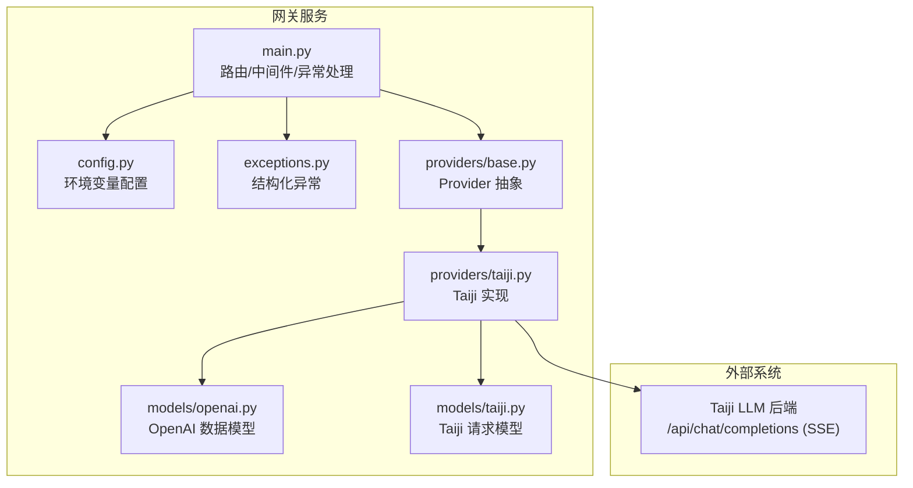
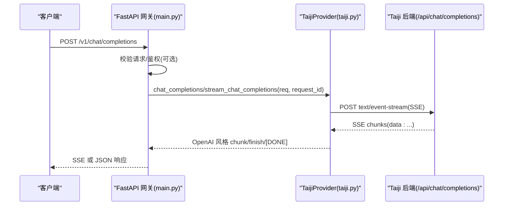
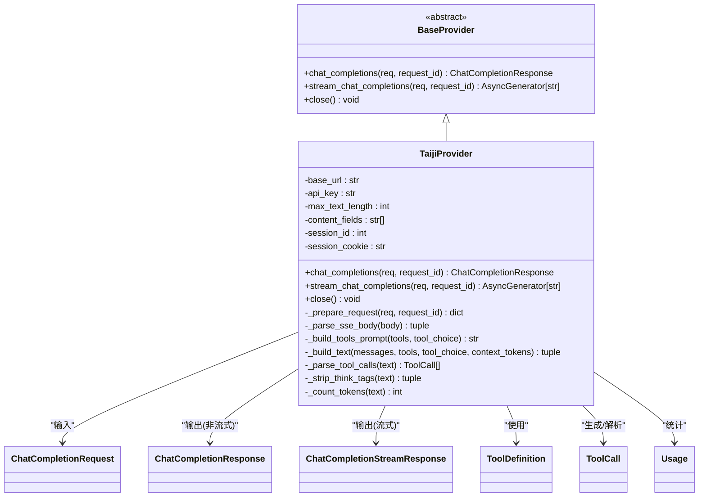
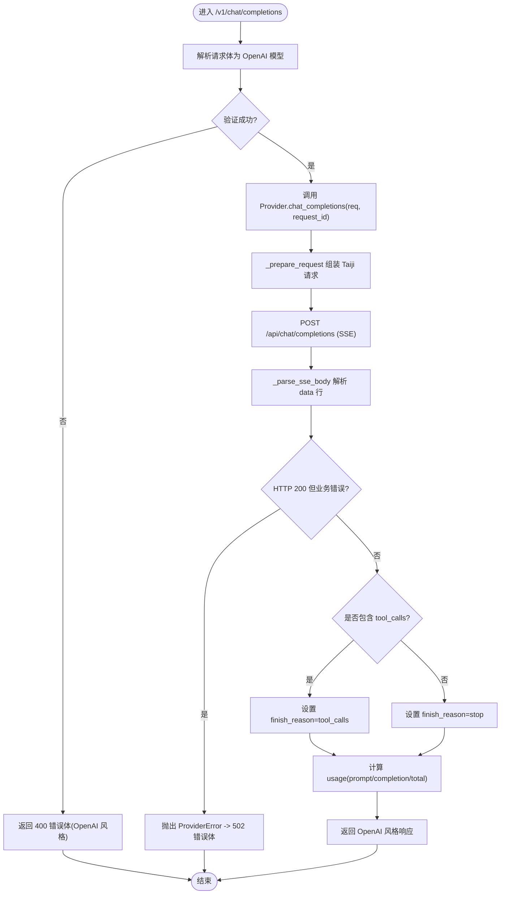
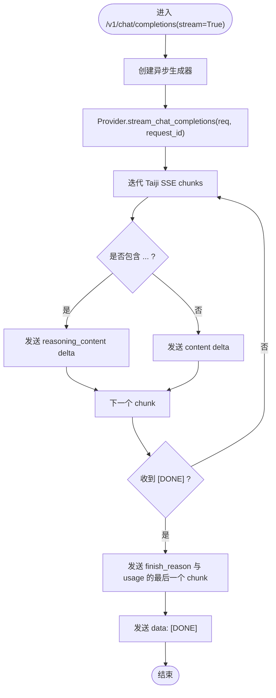
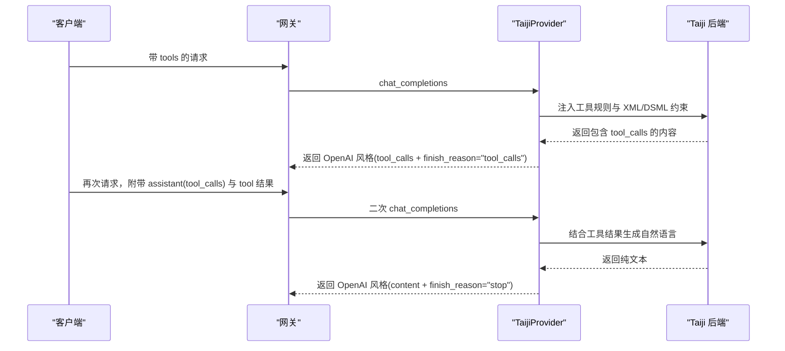
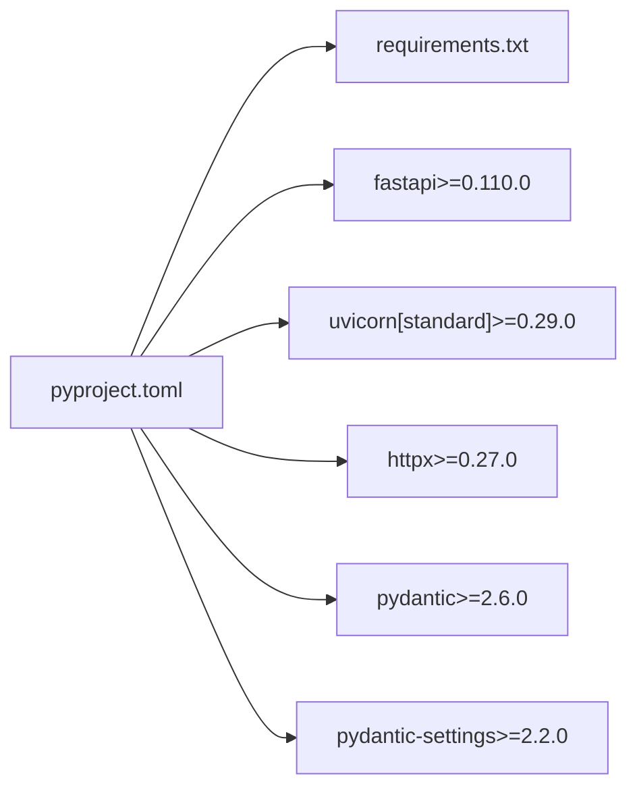

# 项目概述

<cite>
**本文引用的文件**   
- [src/openai_provider/main.py](file://src/openai_provider/main.py)
- [src/openai_provider/config.py](file://src/openai_provider/config.py)
- [src/openai_provider/exceptions.py](file://src/openai_provider/exceptions.py)
- [src/openai_provider/providers/base.py](file://src/openai_provider/providers/base.py)
- [src/openai_provider/providers/taiji.py](file://src/openai_provider/providers/taiji.py)
- [src/openai_provider/models/openai.py](file://src/openai_provider/models/openai.py)
- [src/openai_provider/models/taiji.py](file://src/openai_provider/models/taiji.py)
- [pyproject.toml](file://pyproject.toml)
- [requirements.txt](file://requirements.txt)
- [start.sh](file://start.sh)
- [tests/e2e/conftest.py](file://tests/e2e/conftest.py)
- [tests/e2e/test_01_health_models.py](file://tests/e2e/test_01_health_models.py)
- [tests/e2e/test_03_chat_streaming.py](file://tests/e2e/test_03_chat_streaming.py)
- [tests/e2e/test_04_tool_calls.py](file://tests/e2e/test_04_tool_calls.py)
</cite>

## 目录
1. [简介](#简介)
2. [项目结构](#项目结构)
3. [核心组件](#核心组件)
4. [架构总览](#架构总览)
5. [详细组件分析](#详细组件分析)
6. [依赖关系分析](#依赖关系分析)
7. [性能与可扩展性](#性能与可扩展性)
8. [故障排查指南](#故障排查指南)
9. [结论](#结论)
10. [附录：使用与部署示例](#附录使用与部署示例)

## 简介
本项目是一个 OpenAI 兼容的 Taiji 网关，目标是将 Taiji LLM 后端的 API 转换为 OpenAI 标准格式，提供 /v1/chat/completions、/v1/models 等端点，支持非流式与流式（SSE）响应、工具调用（tool_calls）、推理内容透传（reasoning_content），以及可选的 Bearer Token 认证。通过 FastAPI + Uvicorn 构建轻量网关，以 Provider 抽象隔离后端实现，便于扩展更多 LLM 后端。

## 项目结构
- src/openai_provider
  - main.py：FastAPI 应用入口、路由、中间件、异常处理、日志配置
  - config.py：基于 pydantic-settings 的环境配置
  - exceptions.py：Provider 层结构化异常体系
  - models/openai.py：OpenAI 风格请求/响应模型
  - models/taiji.py：Taiji 后端请求体模型
  - providers/base.py：Provider 抽象接口
  - providers/taiji.py：Taiji Provider 具体实现（SSE 解析、tool_calls 提取、think 标签分离、token 估算）
- tests/e2e：端到端测试，覆盖健康检查、模型发现、流式响应、工具调用、错误处理
- start.sh：一键启动脚本（dev/prod 模式）
- pyproject.toml / requirements.txt：运行时与开发依赖

图表来源
- [src/openai_provider/main.py:1-342](file://src/openai_provider/main.py#L1-L342)
- [src/openai_provider/config.py:1-56](file://src/openai_provider/config.py#L1-L56)
- [src/openai_provider/exceptions.py:1-40](file://src/openai_provider/exceptions.py#L1-L40)
- [src/openai_provider/providers/base.py:1-46](file://src/openai_provider/providers/base.py#L1-L46)
- [src/openai_provider/providers/taiji.py:1-996](file://src/openai_provider/providers/taiji.py#L1-L996)
- [src/openai_provider/models/openai.py:1-177](file://src/openai_provider/models/openai.py#L1-L177)
- [src/openai_provider/models/taiji.py:1-31](file://src/openai_provider/models/taiji.py#L1-L31)

章节来源
- [src/openai_provider/main.py:1-342](file://src/openai_provider/main.py#L1-L342)
- [src/openai_provider/config.py:1-56](file://src/openai_provider/config.py#L1-L56)
- [src/openai_provider/providers/base.py:1-46](file://src/openai_provider/providers/base.py#L1-L46)
- [src/openai_provider/providers/taiji.py:1-996](file://src/openai_provider/providers/taiji.py#L1-L996)
- [src/openai_provider/models/openai.py:1-177](file://src/openai_provider/models/openai.py#L1-L177)
- [src/openai_provider/models/taiji.py:1-31](file://src/openai_provider/models/taiji.py#L1-L31)

## 核心组件
- 网关入口与路由
  - 提供 OpenAI 兼容端点：/v1/chat/completions、/v1/models、/v1/models/{model_id}、/api/v1/models、/api/tags、/props、/v1/props、/version、/health
  - 统一将 HTTPException 转换为 OpenAI 风格错误体
  - 可选 Bearer Token 认证（API_KEY 环境变量控制）
  - CORS 中间件、JSON 结构化日志、生命周期管理
- Provider 抽象与实现
  - BaseProvider 定义 chat_completions 与 stream_chat_completions 接口
  - TaijiProvider 负责：
    - 将 OpenAI messages/tools/tool_choice 转为 Taiji 文本指令（含工具选择规则与 XML/DSML 格式约束）
    - 智能截断超长上下文（保留 system 与 tools prompt，从后往前追加对话）
    - SSE 响应解析、tool_calls 提取（XML/JSON 双回退）、think 标签剥离并透传 reasoning_content
    - token 计数（优先 tiktoken，回退字符估算）
    - 构造 OpenAI 风格的非流式与流式响应
- 数据模型
  - OpenAI 风格请求/响应模型（含 tool_calls、reasoning_content、usage）
  - Taiji 请求体模型（允许透传 temperature、max_tokens 等）

章节来源
- [src/openai_provider/main.py:128-331](file://src/openai_provider/main.py#L128-L331)
- [src/openai_provider/providers/base.py:1-46](file://src/openai_provider/providers/base.py#L1-L46)
- [src/openai_provider/providers/taiji.py:46-996](file://src/openai_provider/providers/taiji.py#L46-L996)
- [src/openai_provider/models/openai.py:1-177](file://src/openai_provider/models/openai.py#L1-L177)
- [src/openai_provider/models/taiji.py:1-31](file://src/openai_provider/models/taiji.py#L1-L31)

## 架构总览
整体采用“网关 + Provider”分层：
- 网关层（FastAPI）：负责协议适配、鉴权、CORS、日志、异常转换、SSE 转发
- Provider 层：封装不同 LLM 后端的差异，对外暴露统一接口
- 模型层：OpenAI 风格与 Taiji 风格的数据模型互转

图表来源
- [src/openai_provider/main.py:134-257](file://src/openai_provider/main.py#L134-L257)
- [src/openai_provider/providers/taiji.py:670-996](file://src/openai_provider/providers/taiji.py#L670-L996)

## 详细组件分析

### 类与接口关系（代码级）

图表来源
- [src/openai_provider/providers/base.py:1-46](file://src/openai_provider/providers/base.py#L1-L46)
- [src/openai_provider/providers/taiji.py:46-996](file://src/openai_provider/providers/taiji.py#L46-L996)
- [src/openai_provider/models/openai.py:1-177](file://src/openai_provider/models/openai.py#L1-L177)

章节来源
- [src/openai_provider/providers/base.py:1-46](file://src/openai_provider/providers/base.py#L1-L46)
- [src/openai_provider/providers/taiji.py:46-996](file://src/openai_provider/providers/taiji.py#L46-L996)
- [src/openai_provider/models/openai.py:1-177](file://src/openai_provider/models/openai.py#L1-L177)

### 关键流程：Chat Completions（非流式）

图表来源
- [src/openai_provider/main.py:134-257](file://src/openai_provider/main.py#L134-L257)
- [src/openai_provider/providers/taiji.py:670-780](file://src/openai_provider/providers/taiji.py#L670-L780)

章节来源
- [src/openai_provider/main.py:134-257](file://src/openai_provider/main.py#L134-L257)
- [src/openai_provider/providers/taiji.py:670-780](file://src/openai_provider/providers/taiji.py#L670-L780)

### 关键流程：Chat Completions（流式 SSE）

图表来源
- [src/openai_provider/main.py:185-218](file://src/openai_provider/main.py#L185-L218)
- [src/openai_provider/providers/taiji.py:782-996](file://src/openai_provider/providers/taiji.py#L782-L996)

章节来源
- [src/openai_provider/main.py:185-218](file://src/openai_provider/main.py#L185-L218)
- [src/openai_provider/providers/taiji.py:782-996](file://src/openai_provider/providers/taiji.py#L782-L996)

### 工具调用（tool_calls）与多轮往返
- 工具注册：在 messages 中传入 tools 列表，Provider 会注入工具选择规则与 XML/DSML 格式约束到 system 提示
- 工具选择：支持 tool_choice 参数（auto/none/指定函数），影响模型行为
- 解析与清理：同时支持 XML/DSML 与 JSON 格式的 tool_calls；若存在 tool_calls，会从 content 中移除对应块
- 多轮往返：assistant 消息携带 tool_calls，随后以 role=tool 的消息回填结果，模型据此生成最终自然语言回复

图表来源
- [src/openai_provider/providers/taiji.py:122-204](file://src/openai_provider/providers/taiji.py#L122-L204)
- [src/openai_provider/providers/taiji.py:350-482](file://src/openai_provider/providers/taiji.py#L350-L482)
- [src/openai_provider/providers/taiji.py:670-780](file://src/openai_provider/providers/taiji.py#L670-L780)

章节来源
- [src/openai_provider/providers/taiji.py:122-204](file://src/openai_provider/providers/taiji.py#L122-L204)
- [src/openai_provider/providers/taiji.py:350-482](file://src/openai_provider/providers/taiji.py#L350-L482)
- [src/openai_provider/providers/taiji.py:670-780](file://src/openai_provider/providers/taiji.py#L670-L780)
- [tests/e2e/test_04_tool_calls.py:1-226](file://tests/e2e/test_04_tool_calls.py#L1-L226)

### 推理内容透传（reasoning_content）
- 当 Taiji 返回包含 <think>...</think> 的内容时，网关会将其剥离并放入 reasoning_content 字段
- 非流式：一次性剥离并返回 reasoning_content
- 流式：实时检测 think 标签边界，增量发送 reasoning_content delta，确保客户端可逐步展示思考过程

章节来源
- [src/openai_provider/providers/taiji.py:511-518](file://src/openai_provider/providers/taiji.py#L511-L518)
- [src/openai_provider/providers/taiji.py:852-900](file://src/openai_provider/providers/taiji.py#L852-L900)

## 依赖关系分析
- 运行时依赖
  - fastapi、uvicorn[standard]：Web 框架与 ASGI 服务器
  - httpx：异步 HTTP 客户端，用于调用 Taiji 后端
  - pydantic、pydantic-settings：数据模型与环境配置
- 开发依赖
  - pytest、pytest-asyncio、mypy、ruff：测试、类型检查与代码规范

图表来源
- [pyproject.toml:1-55](file://pyproject.toml#L1-L55)
- [requirements.txt:1-13](file://requirements.txt#L1-L13)

章节来源
- [pyproject.toml:1-55](file://pyproject.toml#L1-L55)
- [requirements.txt:1-13](file://requirements.txt#L1-L13)

## 性能与可扩展性
- 连接与超时
  - 对 Taiji 后端使用 httpx.AsyncClient，默认超时 60s，避免长连接占用
- 流式传输
  - 网关直接转发 SSE，减少内存拷贝；仅在必要时拼接与解析
- 上下文截断
  - 智能截断策略保证 system 与 tools prompt 始终保留，最大化可用上下文
- 可扩展性
  - Provider 抽象使新增后端只需实现两个方法，即可复用网关能力

[本节为通用指导，不直接分析具体文件]

## 故障排查指南
- 常见错误分类
  - ProviderError 基类及其子类：超时、HTTP 错误、业务错误、网络错误
  - 网关层将 ProviderError 映射为 502 错误体，其他 HTTPException 映射为 OpenAI 风格错误体
- 定位建议
  - 查看 logs/taiji-provider.log 中的 raw_request/raw_response/provider_request/provider_response 日志
  - 关注 status_code、latency_ms、error.type/code/message 字段
- 典型问题
  - 401：未配置或错误的 API_KEY
  - 400：请求体不符合 OpenAI 模型校验
  - 502：Taiji 后端返回非 200 或业务错误（err/msg/code）

章节来源
- [src/openai_provider/exceptions.py:1-40](file://src/openai_provider/exceptions.py#L1-L40)
- [src/openai_provider/main.py:319-331](file://src/openai_provider/main.py#L319-L331)
- [src/openai_provider/providers/taiji.py:670-721](file://src/openai_provider/providers/taiji.py#L670-L721)

## 结论
本网关以最小成本实现了 OpenAI 兼容层，重点解决了 Taiji 后端的 SSE 解析、工具调用、推理内容透传与上下文截断等问题。通过 Provider 抽象与严格的数据模型校验，既保证了兼容性，又具备良好的可扩展性与可维护性。

[本节为总结，不直接分析具体文件]

## 附录：使用与部署示例
- 安装依赖
  - pip install -r requirements.txt
- 配置环境变量
  - TAIJI_BASE_URL、TAIJI_API_KEY、TAIJI_SESSION_COOKIE（可选）
  - API_KEY（可选，启用 Bearer Token 认证）
  - APP_HOST、APP_PORT、CORS_ORIGINS、MODEL_CONTEXT_LENGTH、MODEL_MAX_COMPLETION_TOKENS
- 启动服务
  - 开发模式：bash start.sh dev --port 8199
  - 生产模式：bash start.sh prod --workers N --port PORT
- 常用端点
  - GET /health
  - GET /version
  - GET /v1/models、GET /v1/models/{model_id}
  - POST /v1/chat/completions（支持 stream=true）
- 参考测试
  - 健康与模型发现：tests/e2e/test_01_health_models.py
  - 流式响应：tests/e2e/test_03_chat_streaming.py
  - 工具调用：tests/e2e/test_04_tool_calls.py
  - E2E 夹具与重试：tests/e2e/conftest.py

章节来源
- [start.sh:1-123](file://start.sh#L1-L123)
- [tests/e2e/test_01_health_models.py:1-103](file://tests/e2e/test_01_health_models.py#L1-L103)
- [tests/e2e/test_03_chat_streaming.py:1-146](file://tests/e2e/test_03_chat_streaming.py#L1-L146)
- [tests/e2e/test_04_tool_calls.py:1-226](file://tests/e2e/test_04_tool_calls.py#L1-L226)
- [tests/e2e/conftest.py:1-123](file://tests/e2e/conftest.py#L1-L123)