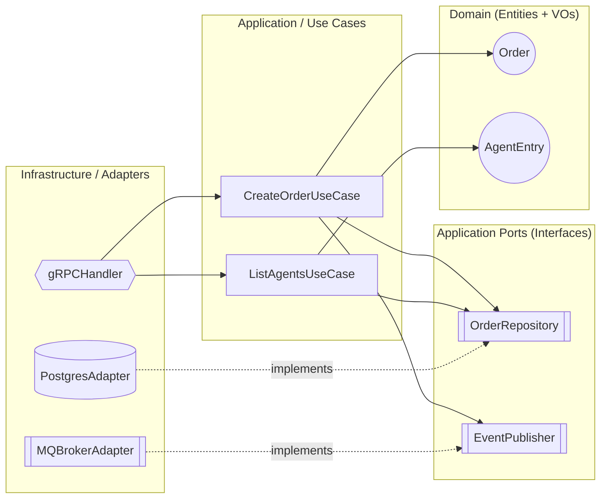
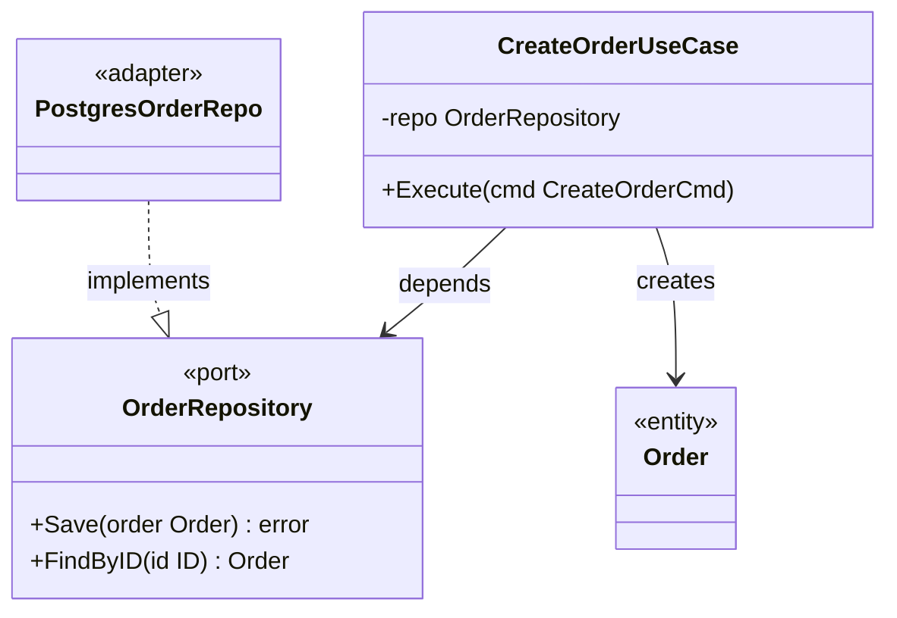

# Arch-Design — Reference

Detailed conventions, templates, and protocols for the `arch-design` skill. Loaded only when needed (progressive disclosure from [SKILL.md](SKILL.md)).

---

## 1. Mermaid Diagram Conventions

Use one of these two canonical layouts. Pick the simpler one that fits the system.

### Layout A — Concentric (flowchart with subgraphs)



### Layout B — Class diagram (Hexagonal)



### Diagram rules

- **Direction of arrows = direction of source-code dependency**, never of runtime data flow.
- Adapters point **inward** to ports (`-.implements.->` or `..|>`).
- Use cases point **inward** to ports and entities.
- The Domain layer must have **zero outgoing arrows** to outer layers.
- Label every port with `<<port>>` or `[[Port]]` shape; every adapter with `<<adapter>>`.

---

## 2. ARCHITECTURE.md Template

```markdown
# Architecture Specification — <Bounded Context Name>

> Phase 2 output. Source of truth for layer boundaries.
> Aligned with: [LANGUAGE.md](./LANGUAGE.md), [BRD.md](./BRD.md)

## 0. Architecture Overview

> Overwritten every round — always reflects the latest architecture picture.

- **Pattern**: Monolith
- **Layers**: Domain → Port → App → Infra (4-layer)
- **PoEAA**: Domain Model (rich Order aggregate, complex invariants)
- **Persistence**: PostgreSQL (primary), Redis (cache)
- **Messaging**: RocketMQ (async event publishing)
- **Ports**: 3 — OrderRepository, EventPublisher, NotificationPort
- **Adapters**: 5 — PostgresOrderRepo, RocketMQAdapter, GRPCHandler, RedisCacheAdapter, FsAdapter
- **Tracer Bullet**: Actor creates order via gRPC → system persists to PostgreSQL → publishes OrderCreated event → observable in dashboard

## 1. Layers & Components

### 1.1 Domain Layer
| Component | Type | Responsibility |
|-----------|------|----------------|
| Order     | Entity | ... |
| Money     | Value Object | ... |

### 1.2 Application Ports (Interfaces)
| Port | Methods | Defined by | Implemented by |
|------|---------|------------|----------------|
| OrderRepository | Save / FindByID | UseCase | PostgresOrderRepo |
| EventPublisher  | Publish         | UseCase | RocketMQAdapter   |

### 1.3 Application Use Cases
| Use Case | Required Ports | Domain Entities Touched |
|----------|----------------|-------------------------|
| CreateOrderUseCase | OrderRepository, EventPublisher | Order |

### 1.4 Infrastructure / Adapters
| Adapter | Implements | External Tech |
|---------|------------|---------------|
| PostgresOrderRepo | OrderRepository | PostgreSQL 15 |
| RocketMQAdapter   | EventPublisher  | RocketMQ 5    |
| GRPCHandler       | (driving)       | gRPC / Protobuf |

## 2. Dependency Flow Diagram

<insert Mermaid diagram here>

## 3. DIP Enforcement

| External Tech | Decoupling Port | Notes |
|---------------|-----------------|-------|
| PostgreSQL    | OrderRepository | Domain has no SQL/ORM types |
| RocketMQ      | EventPublisher  | Domain emits plain DomainEvent value object |
| gRPC (server) | (driven side)   | Handler converts proto ↔ domain at boundary |
| gRPC (client/CLI) | (driving side) | Client adapter translates proto → domain/display types before use case layer |

## 4. Package Layout Guidance (Go)

> Specify package structure and dependency direction.

```
cmd/
  <entry>/              # Composition root (only cmd/ imports infra/)
internal/
  domain/               # Pure domain types (zero deps)
  port/                 # All port interfaces
    <module>/           # Per-module port (e.g., census/, intent/)
  app/                  # Transaction Script functions (imports domain + port)
  config/               # Config loading (cross-cutting)
  infra/                # All adapters (driven + driving)
    <tech>/             # Per-technology adapter
```

## 5. Architecture Decision Records

| ADR | Title | Status | Key Decision | Date |
|-----|-------|--------|-------------|------|
| [ADR-001](./adr/001-use-postgresql-storage.md) | PostgreSQL 作为主存储 | Accepted | ACID 事务 + JSONB 灵活性 | 2025-01-15 |

> ADR 详细指南见 [references/adr-guide.md](references/adr-guide.md)。每个重大技术选型（持久化、通信协议、架构模式、第三方服务）都需要一条 ADR。Phase 2 完成时所有 ADR 必须为 Accepted 或 Superseded 状态。

## 6. Open Questions / Deferred Decisions

- [ ] ...

## 7. Change History (in T{N}.md)

> No longer in ARCHITECTURE.md. Change history is tracked per-task in `kanban/tasks/T{N}.md`.
> See [kanban-spec.md](../kanban-spec.md) §3 for T{N}.md format.

## 8. Cross-Cutting Strategies

> Architecture-level strategy decisions only. Implementation details belong to detail phase.

| Concern | Strategy | Owning Layer | Notes |
|---------|----------|-------------|-------|
| Error Handling | Result type | App layer | Domain returns Result, App translates to HTTP/gRPC error |
| Data Consistency | Local transaction | App layer | Each use case = one DB transaction |
| DI Strategy | Constructor injection | cmd/ composition root | Wire all deps at startup |
| Concurrency Model | Goroutine per request | Adapter layer | Worker pool deferred (see Open Questions) |
| Configuration | Env vars + defaults | Infra layer | Viper with env override |
| Observability | Structured logging (slog) | Infra middleware | Trace ID via context propagation |
```

---

## 3. Pre-Output Self-Audit (在交付前自检)

Before writing `ARCHITECTURE.md`, silently verify:

- [ ] **Architecture Overview (§0) is current.** If any port, adapter, pattern, or technology changed this round, §0 must be rewritten before hand-off.
- [ ] **Cross-Cutting Strategies (§8) are complete.** Every concern has a strategy + owning layer, or explicit N/A.
- [ ] Every term used appears in `LANGUAGE.md` (no invented names).
- [ ] Every external tech from the Step 2.5 inventory has a corresponding port.
- [ ] No port is defined by an adapter (DIP — port lives with consumer).
- [ ] No Domain entity imports from `infrastructure/` or third-party packages.
- [ ] Mermaid diagram has zero arrows leaving the Domain subgraph.
- [ ] Ports follow ISP — no fat interfaces with mixed read/write/admin methods.
- [ ] All adapters (driven + driving) are under `infra/`; `cmd/` contains only entry points.
- [ ] Port interfaces are grouped under `port/` (or embedded in usecase package for OO style).
- [ ] Driving adapters (CLI, HTTP client, gRPC client) translate wire-format types (proto/DTO) into domain/display types before the use case layer.
- [ ] **Post-Rename Doc Sync**: When the design session involved renaming a port, adapter, or domain term, grep the entire project for the old name — LANGUAGE.md, BRD.md, DESIGN.md, design/modules/*/module.md, design/modules/*/interfaces/*.md — and fix every stale reference before writing.
- [ ] Every significant technology choice in ARCHITECTURE.md §1.4 (Infrastructure/Adapters) has a corresponding ADR in `adr/`.
- [ ] ARCHITECTURE.md §5 ADR Index table matches actual `adr/` directory contents (every file has a row, every row has a file).
- [ ] Every ADR's Status is `Accepted` or `Superseded` — no `Proposed` ADR leaves Phase 2.
- [ ] ADR IDs are sequential with no gaps (001, 002, 003...).
- [ ] Superseded ADRs correctly reference the replacing ADR number.
- [ ] **T{N}.md Change History has this round's entry.** All port/adapter/pattern changes from this round are recorded with impact classification.
- [ ] **Impact Assessment is complete.** Every Change History entry has a corresponding impact classification (⚠️ Breaking or ➕ Additive).

If any check fails, fix the design **before** writing the file.

---

## 3A. Impact Assessment Guide (v1.12.0+)

When comparing this round's changes against downstream artifacts, use this decision matrix:

| Change Type | Downstream Artifact | Classification | Action Required |
|------------|-------------------|---------------|----------------|
| Port renamed/retired | DESIGN.md, module.md, interfaces/ | ⚠️ Breaking | Downstream must update all references |
| Adapter removed/replaced | DESIGN.md, module.md | ⚠️ Breaking | Downstream must re-validate adapter usage |
| Architecture pattern changed | DESIGN.md, all modules | ⚠️ Breaking | Downstream must re-validate structure |
| New port added | DESIGN.md, modules | ➕ Additive | Downstream may add related modules |
| New adapter added | DESIGN.md | ➕ Additive | Downstream may add adapter skeleton |
| ADR Superseded | ARCHITECTURE.md §5 index | ➕ Additive | Downstream may update references |

**First round:** No prior T{N}.md Change History exists → skip Impact Assessment, set Change History to "Initial design."

---

## 3B. Redo Workflow Guide

When T{N} has prior design entries in Change History (redo scenario):

### Startup Flow
1. Read T{N}.md Change History → note prior design changes
2. Read upstream align's output:
   - `LANGUAGE.md` + `BRD.md` (current latest overview)
   - `align/brds/brd-t{N}.md` (this task's BRD snapshot)
   - **BRD Conflict Check**: Compare `brd-t{N}.md` vs `BRD.md` → if scope/rules/terms differ, present to user for resolution
3. **Present prior design to user:**
   - §0 Architecture Overview (current)
   - §8 Cross-Cutting Strategies (current)
   - §5 ADR Index (current list)
4. Ask: "以上为上轮设计产出，哪些需要更新？"
5. User confirms scope → only re-execute affected steps

### ADR Redo Rules
| Scenario | Action |
|----------|--------|
| Decision still valid, no change needed | Keep as `Accepted`, no action |
| Decision invalidated by align change | Set to `Superseded`, create new ADR with link |
| Decision needs refinement | Update existing ADR content, keep `Accepted` |
| New decision needed (new tech/pattern) | Create new ADR |

### §8 Cross-Cutting Redo Rules
- Do NOT silently retain existing strategies
- Present each strategy to user: "Error Handling: Result type @ App layer — still valid?"
- If align Breaking change affects a strategy (e.g., new MQ added → Consistency strategy may change), flag it explicitly

---

## 4. Clarification Protocol

If the alignment artifacts (`LANGUAGE.md` / `BRD.md`) are ambiguous on a boundary decision, **ask exactly one question** at a time and wait. Do not invent answers. Do not write `ARCHITECTURE.md` until ambiguity is resolved.

Example:
> "用户在 NFR 对话中提到需要 PostgreSQL 和 local FS 两种持久化。Should `Imprint` use a single `ImprintStore` port covering both, or split into `ImprintMetaRepo` (Postgres) + `ImprintBlobStore` (FS)? — Pick one."
