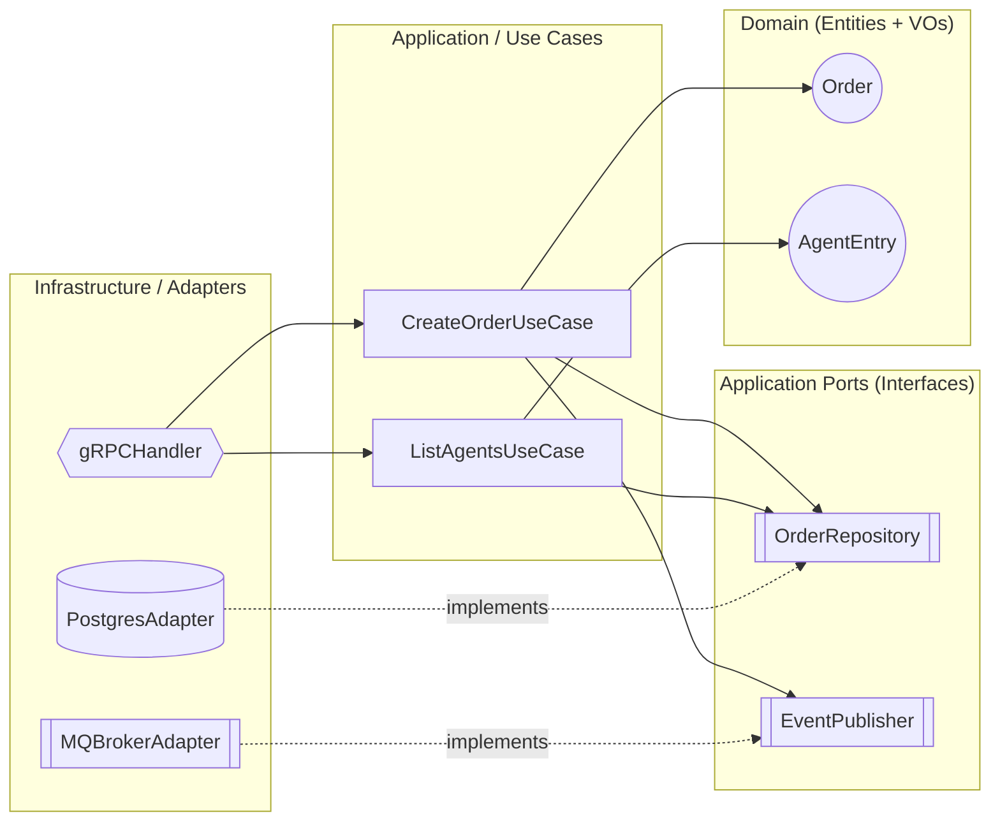
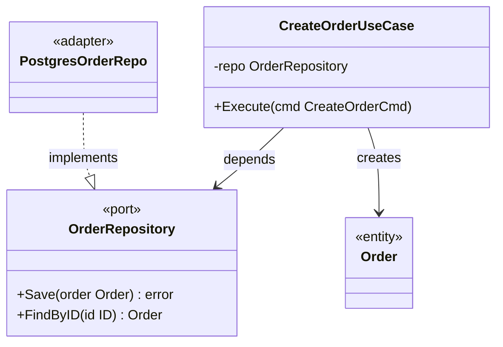
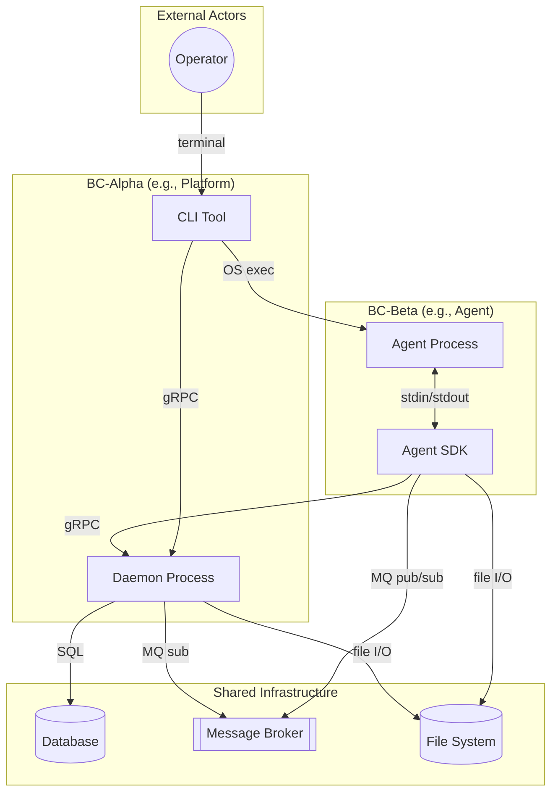

# Arch-Design — Reference

Detailed conventions, templates, and protocols for the `arch-design` skill. Loaded only when needed (progressive disclosure from [SKILL.md](SKILL.md)).

---

## 1. Mermaid Diagram Conventions

Use one of these two canonical layouts. Pick the simpler one that fits the system.

### Layout A — Concentric (flowchart with subgraphs)



### Layout B — Class diagram (Hexagonal)



### Diagram rules

- **Direction of arrows = direction of source-code dependency**, never of runtime data flow.
- Adapters point **inward** to ports (`-.implements.->` or `..|>`).
- Use cases point **inward** to ports and entities.
- The Domain layer must have **zero outgoing arrows** to outer layers.
- Label every port with `<<port>>` or `[[Port]]` shape; every adapter with `<<adapter>>`.

### Layout C — System Context / Application Topology (multi-BC projects)

**When to use**: Mandatory when `docs/arch/PHASES.md` lists 2+ BCs. Optional for single-BC projects.

**Arrow semantics**: Arrows represent **runtime communication direction** (not source-code dependency). Every arrow MUST be labeled with the protocol/channel name.



**Layout C rules**:
- Group processes by BC using `subgraph` with BC name + PoEAA pattern label.
- External actors (Operator, Creator, third-party services) in their own subgraph.
- Shared infrastructure (DB, MQ, FS) in a separate `Infra` subgraph.
- Label every arrow with the communication protocol (gRPC, MQ pub/sub, stdin/stdout, OS exec, SQL, file I/O).
- Use `-.-` (dotted) for async/eventual communication; `-->` (solid) for synchronous calls.

### Layout D — Independent Module Split (multi-process monorepos)

**When to use**: Mandatory when SYSTEM.md shows 2+ BCs that run as **independent processes** with separate entry points and potential independent deployment. Each BC is a completely separate module (own `go.mod`, `cmd/`, `internal/`, `docs/`, `scripts/`). **Zero shared code** between BCs — cross-BC communication is via messages only.

**Key principles**:
- Each BC is an independent module — no shared `pkg/`, no shared `internal/`, no cross-module imports.
- Each BC defines its own domain types, port interfaces, config loading, and infrastructure adapters.
- Cross-BC communication contracts are defined by message schemas (MQ topics, protobuf), not Go types.
- Ports that were previously "shared" (e.g., IntentClient with Publish + Subscribe) are **split by responsibility**: each BC defines only the port methods it consumes.

**Directory structure**:
```
<project-root>/                  # Not a Go module
├── AGENTS.md
├── docs/                        # Project-level docs only (PHASES.md, SYSTEM.md)
├── <bc-slug-a>/                 # BC-A — independent module
│   ├── go.mod                   # module github.com/<org>/<project>/<bc-slug-a>
│   ├── cmd/<entry>/
│   ├── internal/{domain,port,app,config,infra}/
│   ├── docs/                    # BC-specific design docs
│   └── scripts/
└── <bc-slug-b>/                 # BC-B — independent module
    ├── go.mod                   # module github.com/<org>/<project>/<bc-slug-b>
    ├── cmd/<entry>/
    ├── internal/...
    ├── docs/
    └── scripts/
```

---

## 2. ARCHITECTURE.md Template

```markdown
# Architecture Specification — <Bounded Context Name>

> Phase 2 output. Source of truth for layer boundaries.
> Aligned with: [LANGUAGE.md](./LANGUAGE.md), [CONTEXT.md](./CONTEXT.md)

## 0. System Context Overview (mandatory when 2+ BCs)

> System topology: see [SYSTEM.md](../../../arch/SYSTEM.md)

## 1. Layers & Components

### 1.1 Domain Layer
| Component | Type | Responsibility |
|-----------|------|----------------|
| Order     | Entity | ... |
| Money     | Value Object | ... |

### 1.2 Application Ports (Interfaces)
| Port | Methods | Defined by | Implemented by |
|------|---------|------------|----------------|
| OrderRepository | Save / FindByID | UseCase | PostgresOrderRepo |
| EventPublisher  | Publish         | UseCase | RocketMQAdapter   |

### 1.3 Application Use Cases
| Use Case | Required Ports | Domain Entities Touched |
|----------|----------------|-------------------------|
| CreateOrderUseCase | OrderRepository, EventPublisher | Order |

### 1.4 Infrastructure / Adapters
| Adapter | Implements | External Tech |
|---------|------------|---------------|
| PostgresOrderRepo | OrderRepository | PostgreSQL 15 |
| RocketMQAdapter   | EventPublisher  | RocketMQ 5    |
| GRPCHandler       | (driving)       | gRPC / Protobuf |

## 2. Dependency Flow Diagram

<insert Mermaid diagram here>

## 3. DIP Enforcement

| External Tech | Decoupling Port | Notes |
|---------------|-----------------|-------|
| PostgreSQL    | OrderRepository | Domain has no SQL/ORM types |
| RocketMQ      | EventPublisher  | Domain emits plain DomainEvent value object |
| gRPC (server) | (driven side)   | Handler converts proto ↔ domain at boundary |
| gRPC (client/CLI) | (driving side) | Client adapter translates proto → domain/display types before use case layer |

## 4. Package Layout Guidance (Go)

> Specify package structure and dependency direction.

```
cmd/
  <entry>/              # Composition root (only cmd/ imports infra/)
internal/
  domain/               # Pure domain types (zero deps)
  port/                 # All port interfaces
    <module>/           # Per-module port (e.g., census/, intent/)
  app/                  # Transaction Script functions (imports domain + port)
  config/               # Config loading (cross-cutting)
  infra/                # All adapters (driven + driving)
    <tech>/             # Per-technology adapter
```

**Multi-BC monorepo — Independent Module Split (MANDATORY when ≥2 BCs with independent processes)**:
Each BC MUST be an independent module with its own `go.mod`, `cmd/`, `internal/`, `docs/`, and `scripts/`. **Zero shared code** — no `pkg/`, no shared `internal/`. Cross-BC ports are split by responsibility: each BC defines only the port methods it consumes (e.g., BC-A has `EventSubscriber`, BC-B has `EventPublisher` — no shared `IntentClient` interface). Cross-BC communication is via message contracts (MQ topics, protobuf schemas), not Go type imports.

## 5. Open Questions / Deferred Decisions

- [ ] ...
```

---

## 2A. SYSTEM.md Template

When 2+ BCs are registered in `docs/arch/PHASES.md`, create or update `docs/arch/SYSTEM.md` using this template:

```markdown
# System Architecture Overview — <Project Name>

> Cross-BC system topology. Source of truth for process inventory and inter-BC communication.
> Generated by /arch-design when 2+ BCs are registered.
> Last updated: <YYYY-MM-DD>

---

## 1. Application Topology Diagram

<insert Layout C Mermaid diagram here>

## 2. Process Inventory

| Process | Entry Point | BC | Role | Protocols |
|---------|------------|----|------|----------|
| <Process Name> | cmd/<entry>/main.go | <BC Name> | <one-line role> | <comma-separated protocols> |

## 3. Cross-BC Communication Matrix

| From (BC) | To (BC) | Protocol | Channel | Purpose |
|-----------|---------|----------|---------|--------|
| <BC-A> (<component>) | <BC-B> (<component>) | <gRPC/MQ/...> | <method/topic> | <one-line purpose> |

## 4. BC Code Ownership (Current + Planned)

> Each BC is an independent module. No shared packages.

| Package Path | Module | Status | Notes |
|-------------|--------|--------|-------|
| `<bc-slug>/internal/domain/` | <bc-slug> | 现有 / 规划中 | <notes> |
| `<bc-slug>/internal/port/<module>/` | <bc-slug> | 现有 / 规划中 | <notes> |
| `<bc-slug>/internal/app/` | <bc-slug> | 现有 / 规划中 | <notes> |
| `<bc-slug>/internal/infra/<tech>/` | <bc-slug> | 现有 / 规划中 | <notes> |
| `<bc-slug>/cmd/<entry>/` | <bc-slug> | 现有 / 规划中 | <notes> |
```

---

## 3. Pre-Output Self-Audit (在交付前自检)

Before writing `ARCHITECTURE.md`, silently verify:

- [ ] Every term used appears in `LANGUAGE.md` (no invented names).
- [ ] Every external tech listed in `CONTEXT.md` has a corresponding port.
- [ ] No port is defined by an adapter (DIP — port lives with consumer).
- [ ] No Domain entity imports from `infrastructure/` or third-party packages.
- [ ] Mermaid diagram has zero arrows leaving the Domain subgraph.
- [ ] Ports follow ISP — no fat interfaces with mixed read/write/admin methods.
- [ ] All adapters (driven + driving) are under `infra/`; `cmd/` contains only entry points.
- [ ] Port interfaces are grouped under `port/` (or embedded in usecase package for OO style).
- [ ] Driving adapters (CLI, HTTP client, gRPC client) translate wire-format types (proto/DTO) into domain/display types before the use case layer.
- [ ] When 2+ BCs registered: Layout C diagram is present in SYSTEM.md, showing all processes, infrastructure, and communication protocols.
- [ ] When 2+ BCs registered: ARCHITECTURE.md §0 links to SYSTEM.md.
- [ ] When 2+ BCs with independent processes: Layout D — each BC is an independent module (own `go.mod`, `cmd/`, `internal/`). No shared `pkg/` or cross-module imports. Cross-BC ports are split by responsibility.
- [ ] When 2+ BCs with independent processes: SYSTEM.md §4 Code Ownership shows module paths (`<bc-slug>/internal/...`), not flat `internal/` paths.
- [ ] When ARCHITECTURE.md contains runtime interaction diagrams (e.g., §2.2 sequence diagrams): every cross-BC communication arrow in the diagram MUST match a row in SYSTEM.md §3 Communication Matrix (protocol, direction, channel). If SYSTEM.md says "MQ only" but the diagram shows gRPC, flag the inconsistency and fix before writing.
- [ ] When ARCHITECTURE.md contains an Event Contract table (§6 Cross-BC Event Contract): each row's "Platform Action" column MUST be consistent with SYSTEM.md §3 Communication Matrix — no direct API calls if SYSTEM.md declares message-only communication.
- [ ] **Post-Rename Doc Sync**: When the design session involved renaming a port, adapter, or domain term, grep the entire project for the old name — LANGUAGE.md, CONTEXT.md, SYSTEM.md, DESIGN.md, design/modules/*/module.md, design/modules/*/interfaces/*.md — and fix every stale reference before writing.

If any check fails, fix the design **before** writing the file.

---

## 4. Clarification Protocol

If the alignment artifacts (`LANGUAGE.md` / `CONTEXT.md`) are ambiguous on a boundary decision, **ask exactly one question** at a time and wait. Do not invent answers. Do not write `ARCHITECTURE.md` until ambiguity is resolved.

Example:
> "`CONTEXT.md` lists both `PostgreSQL` and `local FS` as persistence. Should `Imprint` use a single `ImprintStore` port covering both, or split into `ImprintMetaRepo` (Postgres) + `ImprintBlobStore` (FS)? — Pick one."
