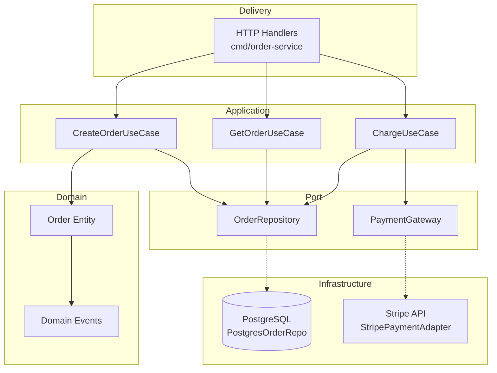

# arch-design Golden Examples

Examples based on a fictional **Order Service** BC (Go, Modular Monolith, PostgreSQL + Stripe).

---

## Example 1: ARCHITECTURE.md §0 Architecture Overview

```markdown
## §0 Architecture Overview

| Axis | Decision |
|------|----------|
| BC | Order Service |
| Pattern | Modular Monolith |
| Layers | Domain → Port → App → Infra |
| PoEAA | Data Mapper + Unit of Work |
| Persistence | PostgreSQL 16 (primary) |
| Messaging | None (synchronous only for v1) |
| Ports | 2: OrderRepository, PaymentGateway |
| Adapters | 2: PostgresOrderRepo, StripePaymentAdapter |
| Tracer Bullet | Customer → POST /orders → order persisted, OrderID returned |
```

**Why this is good**:
- Every axis has a concrete decision (no "TBD" or "multiple options")
- Tracer Bullet is a complete sentence: actor → action → outcome
- PoEAA pattern matches the persistence choice (Data Mapper for PostgreSQL)

---

## Example 2: Mermaid Diagram (Concentric Layout A)



**Diagram rules followed**:
- `-->` solid arrows: compile-time dependency (inner → outer)
- `-.->` dashed arrows: runtime adapter implementation (port → adapter)
- Domain at center, Infrastructure at edges (concentric flow)
- No arrows from Domain to Infrastructure (Dependency Rule)
- Port interfaces in their own subgraph (not inside adapter packages)

---

## Example 3: ADR (Architecture Decision Record)

```markdown
# ADR-001: PostgreSQL as Primary Persistence

## Status
Accepted

## Context
The Order Service needs to store orders with strong consistency guarantees.
Orders have relational structure (Order → LineItems → Products) that benefits
from ACID transactions. Read patterns are primarily single-entity lookups by ID.

## Decision
Use PostgreSQL 16 as the primary data store. Access via Data Mapper pattern
(PostgresOrderRepo implements port.OrderRepository).

## Alternatives Considered
| Option | Pros | Cons | Verdict |
|--------|------|------|---------|
| PostgreSQL | ACID, relational fit, team expertise | Ops overhead | **Selected** |
| DynamoDB | Zero ops, fast single-item | No joins, eventual consistency | Rejected — orders need joins |
| SQLite | Zero ops, embedded | No concurrent writes | Rejected — multi-instance deploy |

## Consequences
- **Positive**: Strong consistency for order state transitions
- **Negative**: Requires connection pool management, migration tooling
- **Mitigation**: Use pgx pool + goose for migrations
```

**Why this is good**:
- Status is `Accepted` (not `Proposed` — Phase 2 is done)
- Alternatives table shows WHY others were rejected (not just listed)
- Consequences include both positive AND negative (honest assessment)
- Mitigation addresses the negative consequence

---

## Example 4: §8 Cross-Cutting Strategies (excerpt)

```markdown
## 8. Cross-Cutting Strategies

### 8.1 Error Handling
| Layer | Strategy |
|-------|----------|
| Domain | Return typed errors (ErrOrderNotFound, ErrInvalidQuantity) |
| Port | Propagate domain errors as-is |
| App | Wrap with context: `fmt.Errorf("create order: %w", err)` |
| Infra | Translate driver errors to domain errors (e.g., pgx.ErrNoRows → ErrOrderNotFound) |
| Delivery | Map domain errors to HTTP status codes (RFC 7807) |

### 8.2 Logging
| Layer | Strategy |
|-------|----------|
| Domain | NO logging (emit domain events instead) |
| App | Structured logging at use case entry/exit |
| Infra | Driver-level logging (SQL queries, API calls) |
```

**Why this is good**:
- Error handling strategy is per-layer (not a blanket "use errors package")
- Domain logging explicitly says NO — this is a common mistake worth preventing
- Each layer has a distinct responsibility (no overlap, no gaps)
