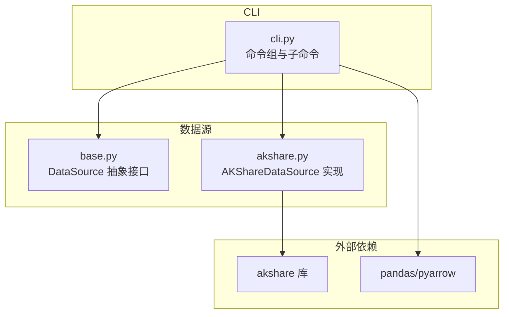
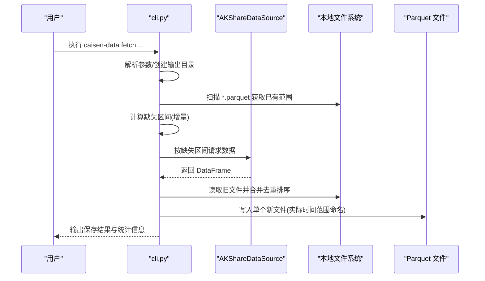
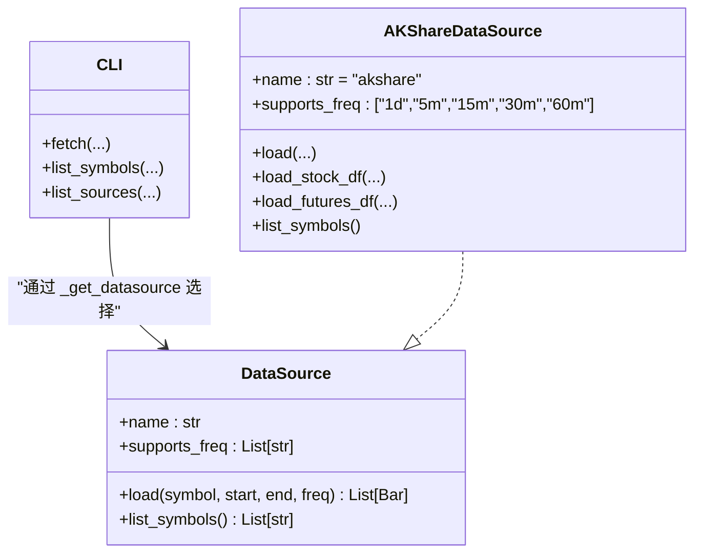
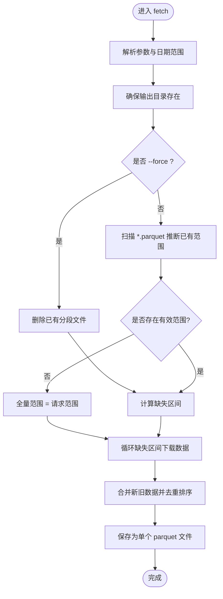

# CLI 命令参考

<cite>
**本文引用的文件**
- [src/caisen_data/cli.py](file://src/caisen_data/cli.py)
- [src/caisen_data/sources/akshare.py](file://src/caisen_data/sources/akshare.py)
- [src/caisen_data/sources/base.py](file://src/caisen_data/sources/base.py)
- [README.md](file://README.md)
- [pyproject.toml](file://pyproject.toml)
- [tests/test_cli_increment.py](file://tests/test_cli_increment.py)
</cite>

## 目录
1. [简介](#简介)
2. [项目结构](#项目结构)
3. [核心组件](#核心组件)
4. [架构总览](#架构总览)
5. [详细命令参考](#详细命令参考)
6. [依赖关系分析](#依赖关系分析)
7. [性能与增量更新机制](#性能与增量更新机制)
8. [故障排除指南](#故障排除指南)
9. [结论](#结论)
10. [附录：常用示例速查](#附录常用示例速查)

## 简介
本参考文档面向使用 caisen-data 命令行工具的用户，全面记录所有可用命令（fetch、list-symbols、list-sources）的语法、参数说明、行为细节与常见用例。重点解释增量更新的实现策略（缺失区间计算、多文件合并为单文件、自动清理旧文件），并提供错误处理与排障建议。

## 项目结构
该仓库提供基于 Click 的 CLI 入口，封装数据源抽象接口，并内置 AKShare 数据源实现。CLI 负责解析参数、计算增量范围、调用数据源、合并与持久化结果。

图表来源
- [src/caisen_data/cli.py:126-314](file://src/caisen_data/cli.py#L126-L314)
- [src/caisen_data/sources/base.py:14-43](file://src/caisen_data/sources/base.py#L14-L43)
- [src/caisen_data/sources/akshare.py:37-245](file://src/caisen_data/sources/akshare.py#L37-L245)

章节来源
- [src/caisen_data/cli.py:1-314](file://src/caisen_data/cli.py#L1-L314)
- [src/caisen_data/sources/base.py:1-43](file://src/caisen_data/sources/base.py#L1-L43)
- [src/caisen_data/sources/akshare.py:1-245](file://src/caisen_data/sources/akshare.py#L1-L245)
- [pyproject.toml:22-26](file://pyproject.toml#L22-L26)

## 核心组件
- CLI 命令组与子命令：定义 fetch、list-symbols、list-sources 三个命令，统一通过 Click 注册。
- 增量辅助函数：从文件名解析日期范围、计算已有范围、合并相邻/重叠区间、计算缺失区间、合并 parquet 文件。
- 数据源抽象与实现：DataSource 抽象接口；AKShareDataSource 实现股票与期货主力合约的数据加载。

章节来源
- [src/caisen_data/cli.py:19-116](file://src/caisen_data/cli.py#L19-L116)
- [src/caisen_data/sources/base.py:14-43](file://src/caisen_data/sources/base.py#L14-L43)
- [src/caisen_data/sources/akshare.py:37-245](file://src/caisen_data/sources/akshare.py#L37-L245)

## 架构总览
下图展示 CLI 到数据源的调用流程以及本地文件的读写路径。

图表来源
- [src/caisen_data/cli.py:132-276](file://src/caisen_data/cli.py#L132-L276)
- [src/caisen_data/sources/akshare.py:115-190](file://src/caisen_data/sources/akshare.py#L115-L190)

## 详细命令参考

### 全局安装与入口
- 可执行命令名：caisen-data
- 入口脚本由项目配置注册，指向 cli.main。

章节来源
- [pyproject.toml:22-23](file://pyproject.toml#L22-L23)
- [src/caisen_data/cli.py:307-312](file://src/caisen_data/cli.py#L307-L312)

### 命令：fetch
用途：下载 K 线数据，支持增量更新与自动合并。

语法
- caisen-data fetch --symbol <标的代码> --start <YYYY-MM-DD> --end <YYYY-MM-DD> [--freq <频率>] [--output-dir <输出目录>] [--source <数据源>] [--force]

参数说明
- --symbol, -s（必填）：标的代码。A 股如 000001.SZ；期货主力合约可使用 ag、m、lh 等简写。
- --start（必填）：开始日期，格式 YYYY-MM-DD。
- --end（必填）：结束日期，格式 YYYY-MM-DD。
- --freq（可选，默认 1d）：数据频率。支持 1d、5m、15m、30m、60m。注意：股票数据仅支持日线。
- --output-dir（可选，默认用户主目录下的 data 文件夹）：数据输出根目录。
- --source（可选，默认 akshare）：数据源名称。当前仅支持 akshare。
- --force（可选）：强制模式。删除已有分段文件后全量重新下载。

行为与规则
- 输出目录结构：{output_dir}/{symbol}/{freq}/。
- 增量逻辑：
  - 若存在历史文件，则根据文件名推断已有时间范围，计算缺失区间，仅下载缺失部分。
  - 若无历史文件或启用 --force，则全量下载。
- 合并策略：
  - 将新增数据与已有数据合并，按 timestamp 去重并排序。
  - 合并完成后删除旧的分段文件，最终保存为单个 parquet 文件。
- 文件命名：{actual_start}_{actual_end}.parquet，其中 start/end 为合并后的实际数据起止日期。
- 频率限制：
  - 股票数据仅支持 1d；分钟级频率对股票会报错。
  - 期货数据支持 1d 与多种分钟频率。

典型场景
- 首次下载某标的日线数据。
- 扩展时间范围进行增量更新。
- 指定分钟级别频率下载期货数据。
- 强制覆盖已有数据重新抓取。

章节来源
- [src/caisen_data/cli.py:132-276](file://src/caisen_data/cli.py#L132-L276)
- [src/caisen_data/sources/akshare.py:115-190](file://src/caisen_data/sources/akshare.py#L115-L190)
- [README.md:15-48](file://README.md#L15-L48)

### 命令：list-symbols
用途：列出可用标的列表（当前实现为 A 股）。

语法
- caisen-data list-symbols [--source <数据源>]

参数说明
- --source（可选，默认 akshare）：数据源名称。

行为与规则
- 通过数据源的 list_symbols 接口获取标的列表。
- 当前实现返回 A 股代码（带 .SZ/.SH 后缀），超过一定数量时仅显示前若干条并提示剩余数量。

章节来源
- [src/caisen_data/cli.py:279-297](file://src/caisen_data/cli.py#L279-L297)
- [src/caisen_data/sources/akshare.py:227-245](file://src/caisen_data/sources/akshare.py#L227-L245)

### 命令：list-sources
用途：列出可用的数据源。

语法
- caisen-data list-sources

行为与规则
- 当前仅支持 akshare。

章节来源
- [src/caisen_data/cli.py:300-305](file://src/caisen_data/cli.py#L300-L305)

## 依赖关系分析
- CLI 依赖 click 构建命令行界面，依赖 pandas/pyarrow 进行数据读写。
- 数据源抽象 DataSource 定义了 load 与 list_symbols 接口。
- AKShareDataSource 实现了股票与期货主力合约的数据加载，内部调用 akshare 库。
- 当未安装 caisen 包时，返回 Bar 对象的接口会抛出明确错误；DataFrame 接口无需 caisen 依赖。

图表来源
- [src/caisen_data/sources/base.py:14-43](file://src/caisen_data/sources/base.py#L14-L43)
- [src/caisen_data/sources/akshare.py:37-245](file://src/caisen_data/sources/akshare.py#L37-L245)
- [src/caisen_data/cli.py:119-124](file://src/caisen_data/cli.py#L119-L124)

章节来源
- [src/caisen_data/sources/base.py:1-43](file://src/caisen_data/sources/base.py#L1-L43)
- [src/caisen_data/sources/akshare.py:1-245](file://src/caisen_data/sources/akshare.py#L1-L245)
- [src/caisen_data/cli.py:119-124](file://src/caisen_data/cli.py#L119-L124)

## 性能与增量更新机制

### 增量更新流程

图表来源
- [src/caisen_data/cli.py:132-276](file://src/caisen_data/cli.py#L132-L276)

### 关键算法与复杂度
- 文件名解析与已有范围推断：遍历目录中 parquet 文件，解析文件名中的起止日期，时间复杂度 O(N)，N 为文件数。
- 区间归一化（合并相邻/重叠）：先排序再线性扫描，时间复杂度 O(N log N)。
- 缺失区间计算：线性扫描已有序区间，时间复杂度 O(M)，M 为已有区间数。
- 文件合并与去重：读取多个 parquet 文件，concat 后按 timestamp 去重并排序，时间复杂度 O(K log K)，K 为总行数。

章节来源
- [src/caisen_data/cli.py:19-116](file://src/caisen_data/cli.py#L19-L116)
- [tests/test_cli_increment.py:18-231](file://tests/test_cli_increment.py#L18-L231)

### 文件合并与自动清理
- 合并策略：将新增 DataFrame 与已有数据合并，按 timestamp 去重并排序，保证数据一致性。
- 自动清理：合并完成后删除旧的分段文件，最终只保留一个以实际起止日期命名的 parquet 文件。

章节来源
- [src/caisen_data/cli.py:237-276](file://src/caisen_data/cli.py#L237-L276)

## 故障排除指南

常见问题与解决
- 未知数据源错误
  - 现象：提示“未知数据源”。
  - 原因：--source 传入的值不在支持列表中。
  - 处理：使用 list-sources 查看支持的数据源，或保持默认 akshare。
- 股票数据频率不支持
  - 现象：请求股票分钟数据时报错。
  - 原因：股票数据仅支持 1d。
  - 处理：将 --freq 设置为 1d。
- 缺少依赖导致导入失败
  - 现象：提示 akshare 未安装或 caisen 未安装。
  - 处理：安装 akshare；如需返回 Bar 对象，请安装 caisen。
- 网络或 API 异常
  - 现象：获取数据失败并打印异常信息。
  - 处理：检查网络连接与目标服务可用性；必要时重试或缩小时间范围。
- 无数据返回
  - 现象：提示未能获取到任何数据。
  - 处理：确认标的代码是否正确、时间范围是否合理、数据源是否支持该标的。

章节来源
- [src/caisen_data/cli.py:181-233](file://src/caisen_data/cli.py#L181-L233)
- [src/caisen_data/sources/akshare.py:115-190](file://src/caisen_data/sources/akshare.py#L115-L190)

## 结论
本 CLI 提供了简洁易用的数据获取能力，结合增量更新与自动合并策略，显著降低重复下载成本并保持本地数据整洁。对于 A 股与期货主力合约，用户可通过少量参数快速完成数据准备，满足回测与分析需求。

## 附录：常用示例速查
- 下载白银主力合约日线数据
  - caisen-data fetch --symbol ag --start 2023-01-01 --end 2024-12-31 --freq 1d
- 下载 A 股日线数据
  - caisen-data fetch --symbol 000001.SZ --start 2023-01-01 --end 2024-12-31 --freq 1d
- 下载期货 5 分钟数据
  - caisen-data fetch --symbol ag --start 2023-01-01 --end 2024-12-31 --freq 5m
- 强制重新下载
  - caisen-data fetch --symbol ag --start 2023-01-01 --end 2024-12-31 --force
- 增量扩展时间范围
  - 第一次：caisen-data fetch --symbol ag --start 2024-01-01 --end 2024-06-30
  - 第二次：caisen-data fetch --symbol ag --start 2024-01-01 --end 2024-12-31
- 列出可用标的
  - caisen-data list-symbols
- 列出数据源
  - caisen-data list-sources

章节来源
- [README.md:15-62](file://README.md#L15-L62)