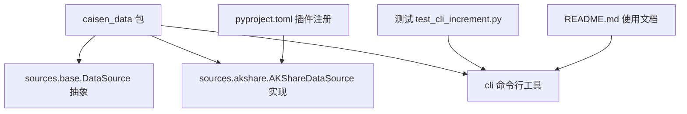
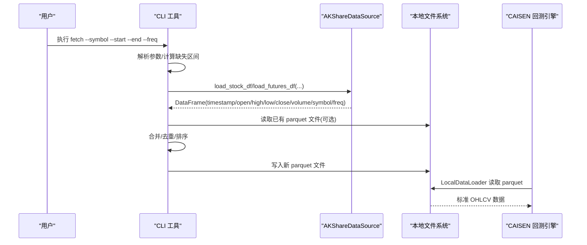
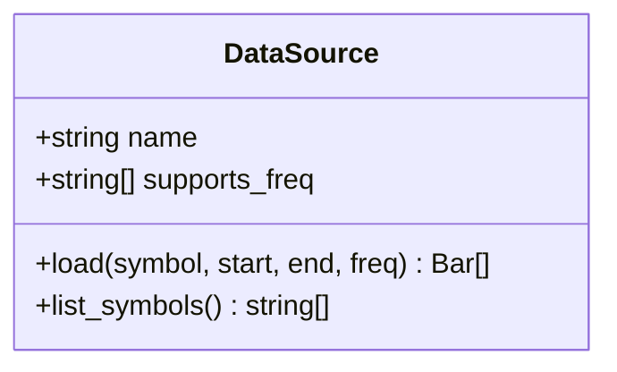
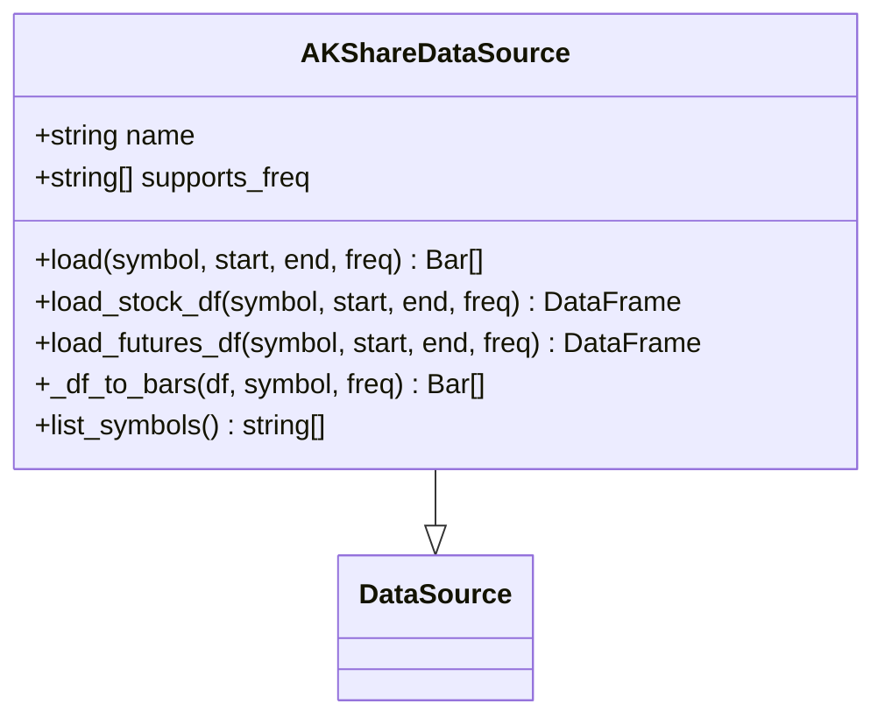
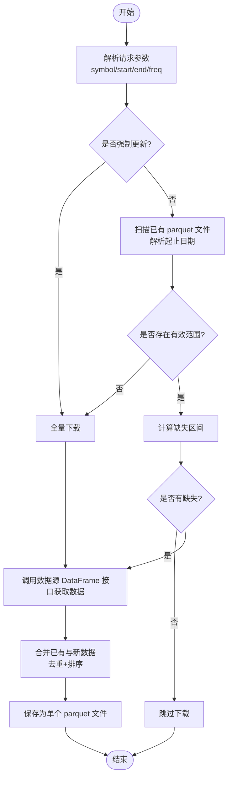
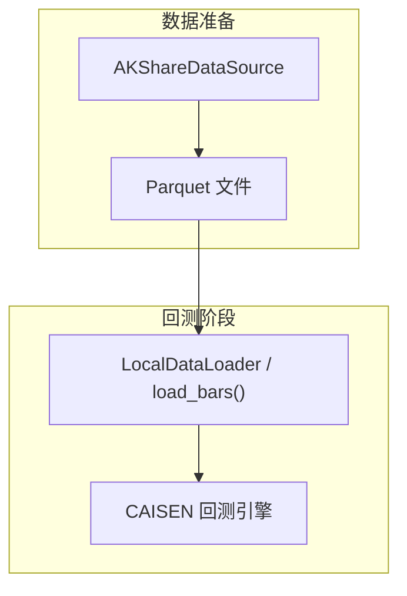
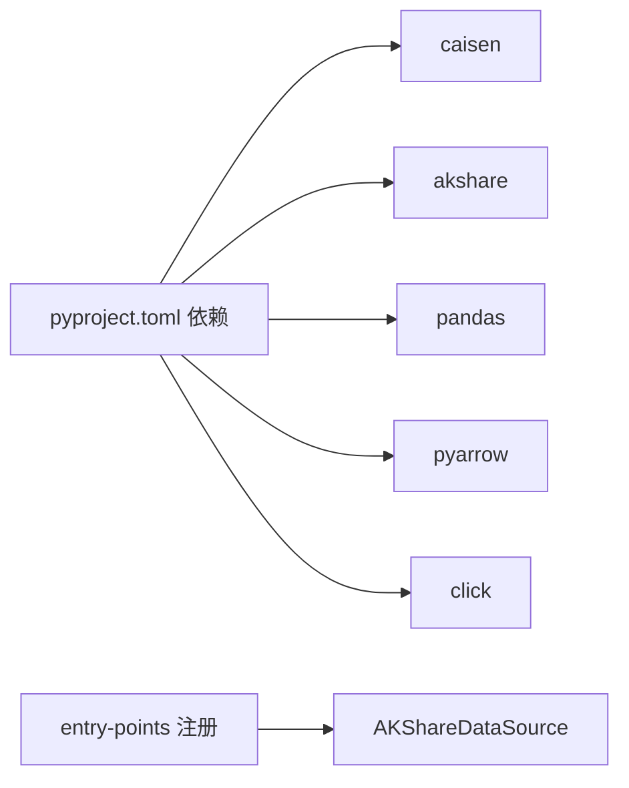

# Python API 参考

<cite>
**本文引用的文件**
- [README.md](file://README.md)
- [pyproject.toml](file://pyproject.toml)
- [__init__.py](file://src/caisen_data/__init__.py)
- [base.py](file://src/caisen_data/sources/base.py)
- [akshare.py](file://src/caisen_data/sources/akshare.py)
- [cli.py](file://src/caisen_data/cli.py)
- [test_cli_increment.py](file://tests/test_cli_increment.py)
</cite>

## 目录
1. [简介](#简介)
2. [项目结构](#项目结构)
3. [核心组件](#核心组件)
4. [架构总览](#架构总览)
5. [详细组件分析](#详细组件分析)
6. [依赖关系分析](#依赖关系分析)
7. [性能考虑](#性能考虑)
8. [故障排查指南](#故障排查指南)
9. [结论](#结论)
10. [附录](#附录)

## 简介
本仓库为 CAISEN 回测系统提供数据抓取与本地化能力，通过抽象的数据源接口统一接入外部数据（当前实现 AKShare），并以 Parquet 格式持久化到本地。Python API 暴露了数据源抽象基类 DataSource 和具体实现 AKShareDataSource，支持日线与分钟线数据的获取、增量更新以及标的列表查询。CLI 工具封装了下载、合并、去重、增量计算等常用流程，便于快速构建本地数据仓库并与 caisen 的 LocalDataLoader 协作进行回测。

## 项目结构
- src/caisen_data：包根，包含模块入口、日志初始化、数据源抽象与实现、CLI 工具
- src/caisen_data/sources：数据源抽象与具体实现
- tests：单元测试，覆盖 CLI 增量逻辑
- README.md：使用说明、数据格式、与 caisen 集成说明
- pyproject.toml：构建配置、脚本入口、caisen 插件注册

图表来源
- [__init__.py:1-8](file://src/caisen_data/__init__.py#L1-L8)
- [base.py:14-43](file://src/caisen_data/sources/base.py#L14-L43)
- [akshare.py:37-245](file://src/caisen_data/sources/akshare.py#L37-L245)
- [cli.py:1-314](file://src/caisen_data/cli.py#L1-L314)
- [pyproject.toml:25-26](file://pyproject.toml#L25-L26)

章节来源
- [__init__.py:1-8](file://src/caisen_data/__init__.py#L1-L8)
- [README.md:1-144](file://README.md#L1-L144)
- [pyproject.toml:1-29](file://pyproject.toml#L1-L29)

## 核心组件
- 数据源抽象基类 DataSource
  - 职责：定义统一的 K 线加载接口与可选的标的列表接口
  - 关键方法：load(symbol, start, end, freq)、list_symbols()
  - 设计要点：通过抽象方法强制子类实现；默认 supports_freq 仅含 "1d"；Bar 类型在导入失败时降级为 None，子类需在返回 Bar 前检查并给出明确错误提示
- AKShareDataSource 实现
  - 职责：基于 AKShare 拉取股票与期货主力合约数据，标准化列名，转换为 DataFrame 或 Bar 列表
  - 关键方法：load()、load_stock_df()、load_futures_df()、_df_to_bars()、list_symbols()
  - 特性：支持频率 ["1d", "5m", "15m", "30m", "60m"]；自动映射期货主力合约符号；分钟数据按日期范围过滤；DataFrame 接口无需 caisen 依赖
- CLI 工具
  - 职责：提供 fetch、list-symbols、list-sources 命令；实现增量下载、多文件合并、去重排序、保存为单个 parquet 文件
  - 关键函数：parse_date_range_from_filename()、get_existing_range()、normalize_ranges()、find_range_gaps()、merge_parquet_files()
- 包入口与日志
  - 初始化日志 NullHandler，避免未配置 handler 时的警告
- 插件注册
  - 通过 entry-points 将 AKShareDataSource 注册到 caisen 的数据源发现机制中

章节来源
- [base.py:14-43](file://src/caisen_data/sources/base.py#L14-L43)
- [akshare.py:37-245](file://src/caisen_data/sources/akshare.py#L37-L245)
- [cli.py:1-314](file://src/caisen_data/cli.py#L1-L314)
- [__init__.py:1-8](file://src/caisen_data/__init__.py#L1-L8)
- [pyproject.toml:25-26](file://pyproject.toml#L25-L26)

## 架构总览
整体流程：CLI 根据用户参数计算缺失区间，调用数据源的 DataFrame 接口获取数据，合并已有数据后去重排序，保存为单个 parquet 文件。CAISEN 回测引擎通过 LocalDataLoader 读取本地 parquet 数据进行回测。

图表来源
- [cli.py:126-276](file://src/caisen_data/cli.py#L126-L276)
- [akshare.py:115-190](file://src/caisen_data/sources/akshare.py#L115-L190)
- [README.md:103-116](file://README.md#L103-L116)

## 详细组件分析

### 数据源抽象基类 DataSource
- 设计模式
  - 抽象基类 + 模板方法思想：定义统一接口，子类按需扩展
  - 可扩展点：supports_freq、name、list_symbols()、新增 load_*_df() 系列接口
- 关键属性与方法
  - name: str = "base"
  - supports_freq: List[str] = ["1d"]
  - load(symbol: str, start: date, end: date, freq: str = "1d") -> List[Bar]
  - list_symbols() -> List[str]
- 异常处理
  - 当 Bar 不可用时，子类应在返回 Bar 前抛出 ImportError，并提供安装指引或使用 DataFrame 接口的建议
- 复杂度
  - 抽象层无额外开销；实际性能取决于子类实现

图表来源
- [base.py:14-43](file://src/caisen_data/sources/base.py#L14-L43)

章节来源
- [base.py:14-43](file://src/caisen_data/sources/base.py#L14-L43)

### AKShareDataSource 实现
- 职责与特性
  - 统一 AKShare 股票与期货数据获取
  - 标准化列名为 timestamp/open/high/low/close/volume
  - 支持 DataFrame 接口（无需 caisen）与 Bar 列表接口（需 caisen）
  - 分钟数据按请求日期范围过滤
- 关键方法与行为
  - load(symbol, start, end, freq) -> List[Bar]
    - 自动判断股票/期货路径
    - 若 Bar 不可用则抛出 ImportError
  - load_stock_df(symbol, start, end, freq="1d") -> pd.DataFrame
    - 仅支持日线
    - 返回标准化列，附加 symbol 与 freq
  - load_futures_df(symbol, start, end, freq="1d") -> pd.DataFrame
    - 支持日线和分钟线
    - 分钟数据按时间范围过滤
  - _df_to_bars(df, symbol, freq) -> List[Bar]
    - 列式预处理，逐行构造 Bar
    - 若 Bar 不可用则抛出 ImportError
  - list_symbols() -> List[str]
    - 获取 A 股代码并生成 .SZ/.SH 后缀
- 异常与边界
  - akshare 未安装：ImportError
  - 非支持的频率：ValueError（股票）
  - 网络或 API 异常：由上层捕获并记录日志
- 性能优化
  - 优先使用 DataFrame 接口避免 Bar 对象转换开销
  - 列式数值转换与填充，减少空值导致的异常

图表来源
- [akshare.py:37-245](file://src/caisen_data/sources/akshare.py#L37-L245)
- [base.py:14-43](file://src/caisen_data/sources/base.py#L14-L43)

章节来源
- [akshare.py:37-245](file://src/caisen_data/sources/akshare.py#L37-L245)

### CLI 增量与合并流程
- 核心函数
  - parse_date_range_from_filename(filename) -> (date, date) | None
  - get_existing_range(data_dir) -> (date | None, date | None)
  - normalize_ranges(ranges) -> list[(date, date)]
  - find_range_gaps(requested_start, requested_end, existing_ranges) -> list[(date, date)]
  - merge_parquet_files(data_dir) -> DataFrame
- 行为说明
  - 增量：基于文件名解析已有范围，计算缺失区间
  - 合并：读取所有 parquet，concat、去重、排序、重置索引
  - 输出：合并后的单一 parquet 文件，文件名使用实际数据起止日期
- 测试覆盖
  - 对日期解析、范围归并、缺口计算、文件合并等进行断言

图表来源
- [cli.py:19-116](file://src/caisen_data/cli.py#L19-L116)
- [cli.py:126-276](file://src/caisen_data/cli.py#L126-L276)

章节来源
- [cli.py:19-116](file://src/caisen_data/cli.py#L19-L116)
- [cli.py:126-276](file://src/caisen_data/cli.py#L126-L276)
- [test_cli_increment.py:1-231](file://tests/test_cli_increment.py#L1-231)

### 与 CAISEN 回测系统的集成
- 插件注册
  - 通过 entry-points 将 AKShareDataSource 注册到 caisen 的数据源发现机制，名称为 "akshare"
- 数据流
  - caisen-data 负责从外部 API 拉取数据并落盘为 parquet
  - CAISEN 通过 LocalDataLoader 或 load_bars() 读取本地 parquet 进行回测
- 约定
  - parquet 列名与顺序：timestamp/open/high/low/close/volume/symbol/freq
  - 频率与标的命名规范遵循 AKShareDataSource 的输出

图表来源
- [pyproject.toml:25-26](file://pyproject.toml#L25-L26)
- [README.md:103-116](file://README.md#L103-L116)

章节来源
- [pyproject.toml:25-26](file://pyproject.toml#L25-L26)
- [README.md:103-116](file://README.md#L103-L116)

## 依赖关系分析
- 运行时依赖
  - caisen>=0.1.0：用于 Bar 类型与回测集成
  - akshare>=1.12.0：外部数据源
  - pandas、pyarrow：数据处理与 parquet 读写
  - click：CLI 框架
- 可选依赖
  - dev: pytest
- 插件机制
  - entry-points."caisen.datasources": 将 AKShareDataSource 注册为可用数据源

图表来源
- [pyproject.toml:11-26](file://pyproject.toml#L11-L26)

章节来源
- [pyproject.toml:11-26](file://pyproject.toml#L11-L26)

## 性能考虑
- 优先使用 DataFrame 接口
  - CLI 在获取数据时优先调用 load_stock_df/load_futures_df，避免 Bar 对象转换带来的额外开销
- 列式预处理
  - _df_to_bars 中对列进行向量化转换与填充，减少逐行字典构造的开销
- 增量与合并
  - 基于文件名解析已有范围，避免读取大量内容
  - 合并后去重与排序保证数据一致性，但需注意大数据集下的内存占用
- 存储格式
  - Parquet 具备高效压缩与列式存储优势，适合大规模历史数据

[本节为通用指导，不直接分析具体文件]

## 故障排查指南
- 常见异常与处理
  - ImportError("akshare not installed"): 安装 akshare 后再运行
  - ImportError("caisen 未安装..."): 安装 caisen 或使用 DataFrame 接口
  - ValueError("股票数据仅支持日线"): 修改 freq 为 "1d"
  - 网络或 API 异常：查看日志输出，确认网络连通性与 AKShare 接口可用性
- 日志配置
  - 包默认添加 NullHandler，避免未配置 handler 时的警告；建议在应用层配置 logger 以输出到文件或控制台
- 增量问题定位
  - 检查文件名是否符合 YYYYMMDD_YYYYMMDD.parquet 规范
  - 使用 list-symbols 验证标的列表是否正常
  - 使用 force 模式重新下载并观察合并结果

章节来源
- [akshare.py:51-90](file://src/caisen_data/sources/akshare.py#L51-L90)
- [akshare.py:129-132](file://src/caisen_data/sources/akshare.py#L129-L132)
- [cli.py:227-230](file://src/caisen_data/cli.py#L227-L230)
- [__init__.py:7-8](file://src/caisen_data/__init__.py#L7-L8)

## 结论
本模块通过抽象数据源接口与 AKShare 实现，提供了稳定、可扩展的数据获取能力，并结合 CLI 实现了增量下载与本地化存储。与 CAISEN 的集成通过插件注册与标准 parquet 格式约定完成，便于在回测系统中直接使用。推荐在生产环境中合理配置日志、监控网络与 API 状态，并根据数据规模选择 DataFrame 接口以提升性能。

[本节为总结性内容，不直接分析具体文件]

## 附录

### Python API 参考

- 包入口
  - 版本与日志初始化
    - __version__: 字符串版本号
    - 日志：为 "caisen_data" 添加 NullHandler，避免未配置 handler 的警告
  - 参考路径
    - [__init__.py:1-8](file://src/caisen_data/__init__.py#L1-L8)

- 数据源抽象基类 DataSource
  - 属性
    - name: str = "base"
    - supports_freq: List[str] = ["1d"]
  - 方法
    - load(symbol: str, start: date, end: date, freq: str = "1d") -> List[Bar]
      - 参数
        - symbol: 标的代码，如 "000001.SZ" 或 "ag"
        - start: 开始日期
        - end: 结束日期
        - freq: 频率，如 "1d", "5m"
      - 返回
        - List[Bar]：K 线数据列表
      - 异常
        - 当 Bar 不可用时，子类应抛出 ImportError 并给出安装指引
    - list_symbols() -> List[str]
      - 返回可用标的列表，默认返回空列表
  - 参考路径
    - [base.py:14-43](file://src/caisen_data/sources/base.py#L14-L43)

- AKShareDataSource 实现
  - 属性
    - name = "akshare"
    - supports_freq = ["1d", "5m", "15m", "30m", "60m"]
  - 方法
    - load(symbol: str, start: date, end: date, freq: str = "1d") -> List[Bar]
      - 自动判断股票/期货路径
      - 若 Bar 不可用则抛出 ImportError
      - 参考路径
        - [akshare.py:43-58](file://src/caisen_data/sources/akshare.py#L43-L58)
    - load_stock_df(symbol: str, start: date, end: date, freq: str = "1d") -> pd.DataFrame
      - 仅支持日线
      - 返回标准化列：timestamp/open/high/low/close/volume/symbol/freq
      - 异常：akshare 未安装抛出 ImportError；非 "1d" 抛出 ValueError
      - 参考路径
        - [akshare.py:115-145](file://src/caisen_data/sources/akshare.py#L115-L145)
    - load_futures_df(symbol: str, start: date, end: date, freq: str = "1d") -> pd.DataFrame
      - 支持日线与分钟线
      - 分钟数据按日期范围过滤
      - 返回标准化列：timestamp/open/high/low/close/volume/symbol/freq
      - 异常：akshare 未安装抛出 ImportError
      - 参考路径
        - [akshare.py:147-190](file://src/caisen_data/sources/akshare.py#L147-L190)
    - _df_to_bars(df: pd.DataFrame, symbol: str, freq: str) -> List[Bar]
      - 列式预处理后逐行构造 Bar
      - 若 Bar 不可用则抛出 ImportError
      - 参考路径
        - [akshare.py:192-225](file://src/caisen_data/sources/akshare.py#L192-L225)
    - list_symbols() -> List[str]
      - 获取 A 股代码并生成 .SZ/.SH 后缀
      - 异常：网络或 API 异常被捕获并记录日志，返回空列表
      - 参考路径
        - [akshare.py:227-245](file://src/caisen_data/sources/akshare.py#L227-L245)

- CLI 工具
  - 命令
    - fetch：下载 K 线数据（自动保存 + 增量更新）
      - 选项
        - --symbol/-s：标的代码（必填）
        - --start：开始日期 YYYY-MM-DD（必填）
        - --end：结束日期 YYYY-MM-DD（必填）
        - --freq：频率 1d/5m/15m/30m/60m（默认 1d）
        - --output-dir：输出目录（默认用户主目录 data）
        - --source：数据源（默认 akshare）
        - --force：强制重新下载
      - 行为
        - 计算缺失区间，优先使用 DataFrame 接口获取数据
        - 合并已有数据，去重排序，保存为单个 parquet 文件
      - 参考路径
        - [cli.py:132-276](file://src/caisen_data/cli.py#L132-L276)
    - list-symbols：列出可用标的
      - 参考路径
        - [cli.py:279-297](file://src/caisen_data/cli.py#L279-L297)
    - list-sources：列出可用数据源
      - 参考路径
        - [cli.py:300-305](file://src/caisen_data/cli.py#L300-L305)
  - 辅助函数
    - parse_date_range_from_filename(filename) -> (date, date) | None
    - get_existing_range(data_dir) -> (date | None, date | None)
    - normalize_ranges(ranges) -> list[(date, date)]
    - find_range_gaps(requested_start, requested_end, existing_ranges) -> list[(date, date)]
    - merge_parquet_files(data_dir) -> DataFrame
    - 参考路径
      - [cli.py:19-116](file://src/caisen_data/cli.py#L19-L116)

- 与 CAISEN 集成
  - 插件注册
    - entry-points."caisen.datasources": akshare -> AKShareDataSource
    - 参考路径
      - [pyproject.toml:25-26](file://pyproject.toml#L25-L26)
  - 数据格式约定
    - 列名：timestamp/open/high/low/close/volume/symbol/freq
    - 参考路径
      - [README.md:117-131](file://README.md#L117-L131)

- 使用示例（路径引用）
  - Python API 基本用法
    - [README.md:64-82](file://README.md#L64-L82)
  - CLI 下载与增量
    - [README.md:15-48](file://README.md#L15-L48)
  - 增量逻辑单元测试
    - [test_cli_increment.py:1-231](file://tests/test_cli_increment.py#L1-231)