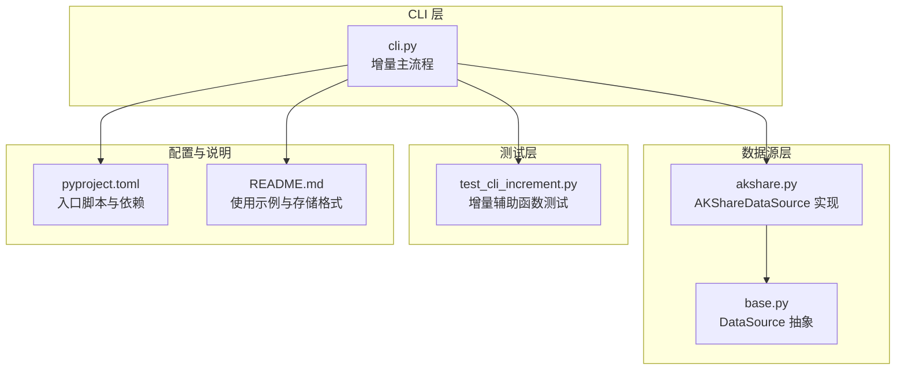
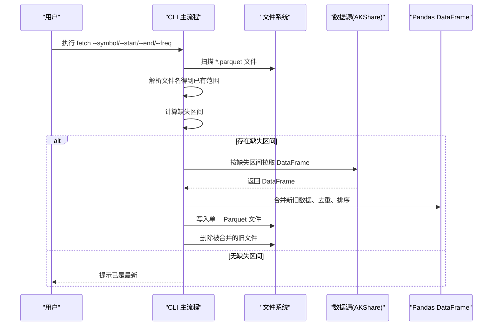
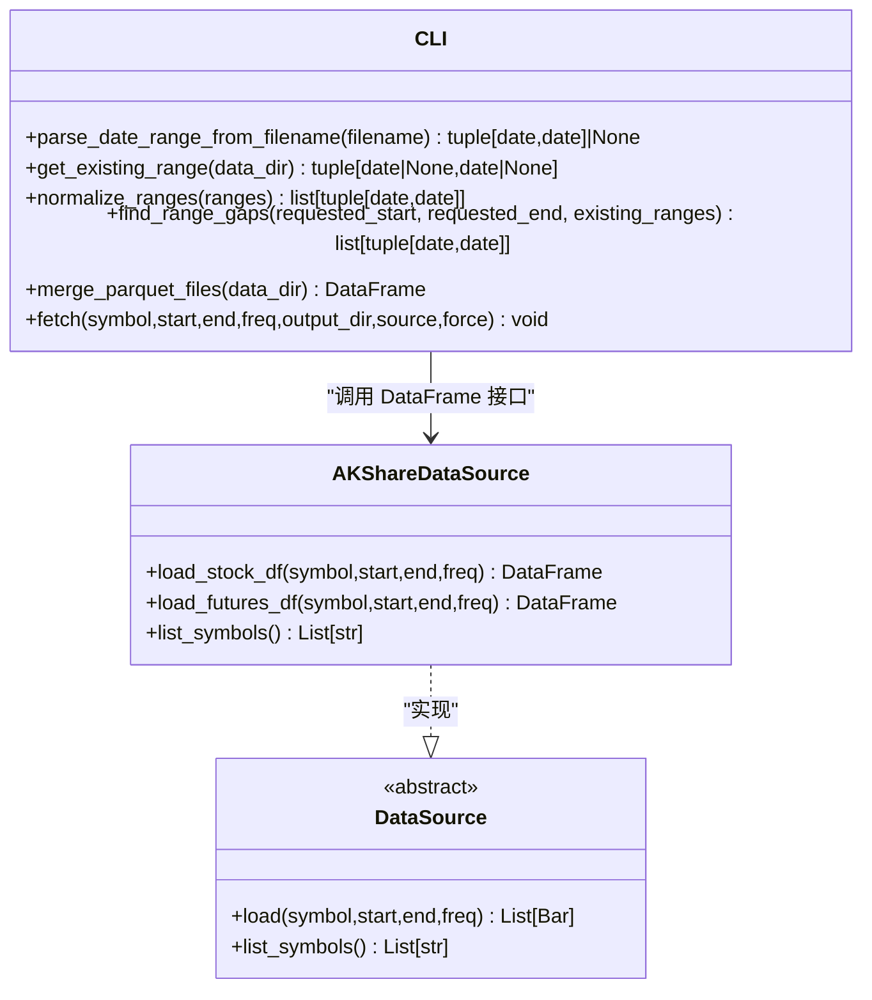
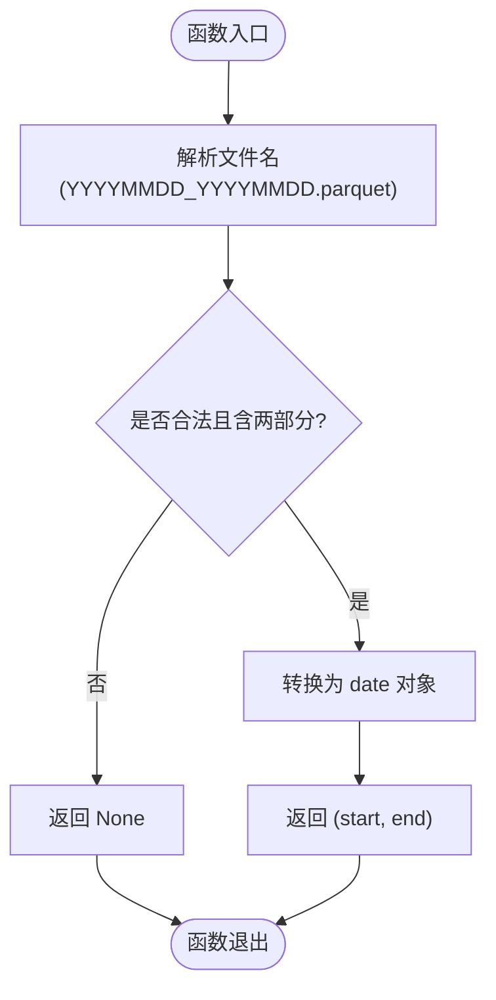
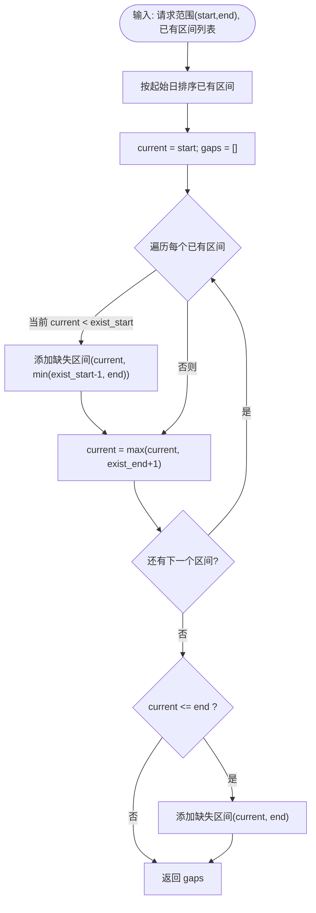
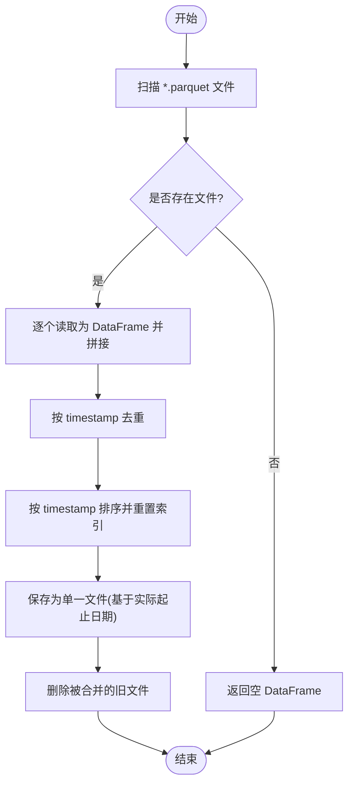
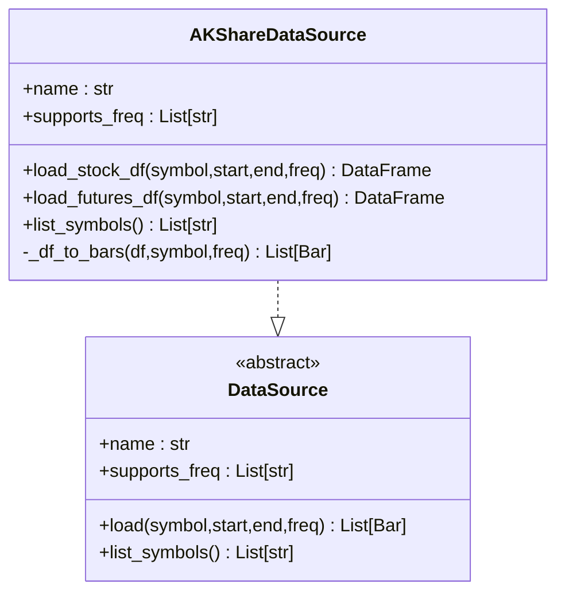
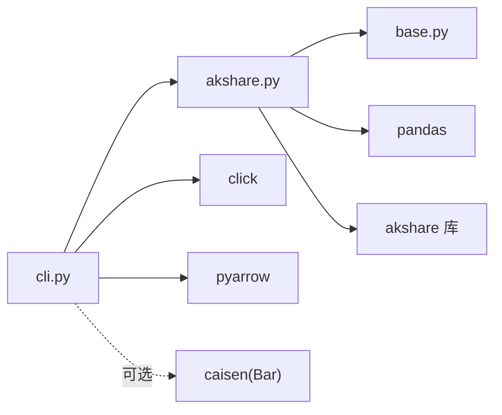
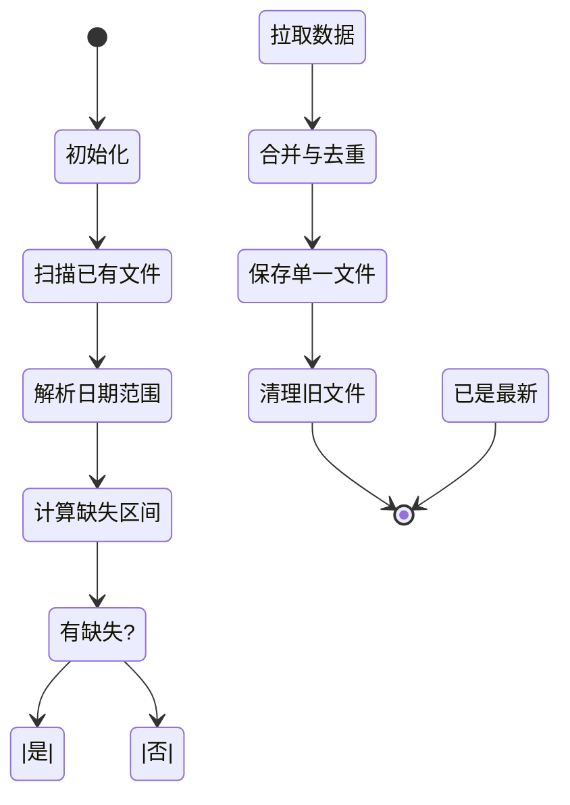

# 增量更新机制

<cite>
**本文引用的文件**   
- [README.md](file://README.md)
- [cli.py](file://src/caisen_data/cli.py)
- [akshare.py](file://src/caisen_data/sources/akshare.py)
- [base.py](file://src/caisen_data/sources/base.py)
- [test_cli_increment.py](file://tests/test_cli_increment.py)
- [pyproject.toml](file://pyproject.toml)
</cite>

## 目录
1. [简介](#简介)
2. [项目结构](#项目结构)
3. [核心组件](#核心组件)
4. [架构总览](#架构总览)
5. [详细组件分析](#详细组件分析)
6. [依赖关系分析](#依赖关系分析)
7. [性能考虑](#性能考虑)
8. [故障排查指南](#故障排查指南)
9. [结论](#结论)
10. [附录](#附录)

## 简介
本技术文档围绕“增量更新机制”展开，系统性阐述以下能力与实现：
- 增量算法核心原理：现有数据扫描、缺失区间计算、重叠检测逻辑
- 日期范围解析算法：文件名到日期区间的解析、边界与异常处理
- 文件合并策略：多文件合并为单个文件的算法与去重机制
- 自动清理机制：识别并删除被合并的旧文件
- 流程图与状态转换图：可视化增量更新流程
- 性能优化建议与大规模数据处理最佳实践
- 调试技巧与常见问题解决方案

该机制通过 CLI 命令触发，结合本地 Parquet 文件命名约定与时间戳去重，实现高效、幂等的数据增量更新。

## 项目结构
仓库采用分层组织方式：
- CLI 层：负责参数解析、增量决策、文件读写与合并
- 数据源层：抽象接口与 AKShare 具体实现
- 测试层：覆盖增量相关辅助函数与行为断言
- 配置与说明：包元信息、入口脚本、使用说明

图表来源
- [cli.py:1-314](file://src/caisen_data/cli.py#L1-L314)
- [base.py:1-43](file://src/caisen_data/sources/base.py#L1-L43)
- [akshare.py:1-245](file://src/caisen_data/sources/akshare.py#L1-L245)
- [test_cli_increment.py:1-231](file://tests/test_cli_increment.py#L1-L231)
- [pyproject.toml:1-29](file://pyproject.toml#L1-L29)
- [README.md:1-144](file://README.md#L1-L144)

章节来源
- [README.md:1-144](file://README.md#L1-L144)
- [pyproject.toml:1-29](file://pyproject.toml#L1-L29)

## 核心组件
- 增量主流程（CLI）
  - 负责解析命令行参数、确定增量范围、调用数据源下载、合并与保存、清理旧文件
- 日期范围解析与区间计算
  - 从文件名解析起止日期；计算请求范围与已有范围的差集（缺失区间）
- 文件合并与去重
  - 读取目录下所有分段 Parquet，按时间戳去重并排序，输出单一文件
- 数据源抽象与实现
  - DataSource 抽象接口；AKShareDataSource 提供股票/期货 DataFrame 加载能力

章节来源
- [cli.py:19-116](file://src/caisen_data/cli.py#L19-L116)
- [cli.py:140-276](file://src/caisen_data/cli.py#L140-L276)
- [base.py:14-43](file://src/caisen_data/sources/base.py#L14-L43)
- [akshare.py:37-245](file://src/caisen_data/sources/akshare.py#L37-L245)

## 架构总览
增量更新的整体流程如下：
- 用户通过 CLI 指定标的、频率与时间范围
- CLI 扫描本地文件，基于文件名推断已有数据的时间范围
- 计算缺失区间，必要时进入强制全量模式
- 调用数据源获取缺失区间的 DataFrame
- 将新数据与已有数据合并、去重、排序，写入单一 Parquet 文件
- 删除被合并的分段旧文件，保持目录整洁

图表来源
- [cli.py:140-276](file://src/caisen_data/cli.py#L140-L276)
- [akshare.py:115-190](file://src/caisen_data/sources/akshare.py#L115-L190)

## 详细组件分析

### 增量主流程（CLI）
- 参数解析与路径准备
  - 解析 start/end 为 date 对象，创建输出目录结构 {output_dir}/{symbol}/{freq}
- 强制模式
  - 若启用 --force，先删除已有分段文件，再全量下载
- 已有范围推断
  - 仅扫描文件名，无需读取内容，快速估算已有最小/最大日期
- 缺失区间计算
  - 将已有范围归一化后，计算请求范围与已有范围的差集
- 数据获取
  - 优先使用 DataFrame 接口（避免 Bar 对象转换开销），失败时回退到 Bar 列表转换
- 合并与保存
  - 合并新旧数据，按 timestamp 去重并排序，生成单一文件
- 自动清理
  - 删除被合并的分段旧文件，保持目录整洁

章节来源
- [cli.py:140-276](file://src/caisen_data/cli.py#L140-L276)

#### 增量主流程类图

图表来源
- [cli.py:19-116](file://src/caisen_data/cli.py#L19-L116)
- [akshare.py:115-190](file://src/caisen_data/sources/akshare.py#L115-L190)
- [base.py:14-43](file://src/caisen_data/sources/base.py#L14-L43)

### 日期范围解析算法
- 文件名解析
  - 约定文件名形如 YYYYMMDD_YYYYMMDD.parquet，解析出起止日期
  - 对非法或单部分文件名返回 None，保证健壮性
- 已有范围聚合
  - 遍历目录中所有 parquet 文件，解析有效文件名，汇总最小开始与最大结束
- 边界与异常处理
  - 空目录、不存在目录、无效文件名均安全返回 (None, None)

章节来源
- [cli.py:19-53](file://src/caisen_data/cli.py#L19-L53)
- [test_cli_increment.py:23-36](file://tests/test_cli_increment.py#L23-L36)
- [test_cli_increment.py:156-176](file://tests/test_cli_increment.py#L156-L176)

#### 文件名解析流程图

图表来源
- [cli.py:19-29](file://src/caisen_data/cli.py#L19-L29)

### 重叠检测与缺失区间计算
- 重叠检测与归一化
  - 将多个日期区间按起始日排序，合并相邻或重叠区间，得到不重叠的区间集合
- 缺失区间计算
  - 在请求范围内，逐段比较已有区间，收集未被覆盖的子区间作为缺失区间
- 复杂度
  - 排序 O(n log n)，线性扫描 O(n)，总体 O(n log n)
- 边界情况
  - 无已有数据：返回整个请求范围
  - 已有范围完全覆盖请求范围：返回空列表
  - 已有范围在请求范围之外：忽略外部部分，仅关注交集

章节来源
- [cli.py:56-103](file://src/caisen_data/cli.py#L56-L103)
- [test_cli_increment.py:43-85](file://tests/test_cli_increment.py#L43-L85)
- [test_cli_increment.py:93-148](file://tests/test_cli_increment.py#L93-L148)

#### 缺失区间计算流程图

图表来源
- [cli.py:71-103](file://src/caisen_data/cli.py#L71-L103)

### 文件合并策略与去重机制
- 多文件合并
  - 读取目录下所有 parquet 文件，拼接为统一 DataFrame
- 去重与排序
  - 以 timestamp 为键进行去重，随后按 timestamp 升序排序，重置索引
- 输出单一文件
  - 根据实际数据的最小/最大时间戳生成文件名，保存为单个 parquet
- 自动清理
  - 合并完成后删除被合并的分段旧文件，保持目录整洁

章节来源
- [cli.py:106-116](file://src/caisen_data/cli.py#L106-L116)
- [cli.py:237-276](file://src/caisen_data/cli.py#L237-L276)
- [test_cli_increment.py:183-216](file://tests/test_cli_increment.py#L183-L216)

#### 合并与去重流程图

图表来源
- [cli.py:106-116](file://src/caisen_data/cli.py#L106-L116)
- [cli.py:237-276](file://src/caisen_data/cli.py#L237-L276)

### 自动清理机制
- 触发时机
  - 当存在已有分段文件且成功合并为新文件后
- 清理策略
  - 遍历目录中所有 parquet 文件并逐一删除，确保只保留最终合并结果
- 安全性
  - 仅在合并成功后执行，避免误删未参与合并的文件

章节来源
- [cli.py:249-252](file://src/caisen_data/cli.py#L249-L252)

### 数据源集成（AKShare）
- 抽象接口
  - DataSource 定义 load 与 list_symbols 方法
- AKShare 实现
  - 支持股票日线与期货日/分钟线
  - 提供 DataFrame 接口，避免 Bar 对象转换开销
  - 列名标准化、时间戳类型校验、volume 缺省填充
  - 分钟数据按日期范围过滤

章节来源
- [base.py:14-43](file://src/caisen_data/sources/base.py#L14-L43)
- [akshare.py:37-245](file://src/caisen_data/sources/akshare.py#L37-L245)

#### 数据源类图

图表来源
- [base.py:14-43](file://src/caisen_data/sources/base.py#L14-L43)
- [akshare.py:37-245](file://src/caisen_data/sources/akshare.py#L37-L245)

## 依赖关系分析
- 模块耦合
  - CLI 依赖数据源抽象与 AKShare 实现
  - AKShare 依赖 pandas、pyarrow（Parquet 读写）、click（CLI）
- 外部依赖
  - akshare：网络数据获取
  - caisen：可选依赖，用于 Bar 对象构造（DataFrame 接口可绕过）
- 入口与脚本
  - pyproject 注册 CLI 入口点，便于命令行直接调用

图表来源
- [cli.py:1-10](file://src/caisen_data/cli.py#L1-L10)
- [akshare.py:1-20](file://src/caisen_data/sources/akshare.py#L1-L20)
- [pyproject.toml:11-26](file://pyproject.toml#L11-L26)

章节来源
- [pyproject.toml:11-26](file://pyproject.toml#L11-L26)

## 性能考虑
- 内存与 I/O
  - 合并阶段一次性读取所有分段文件，建议在大数据场景下分批合并或流式处理
  - 使用 Parquet 列式存储与压缩，减少磁盘占用与 IO 成本
- 去重与排序
  - 去重与排序基于 timestamp，建议确保时间戳唯一性与有序性，避免重复计算
- 网络请求
  - 优先使用 DataFrame 接口，避免 Bar 对象转换开销
  - 合理切分缺失区间，避免单次请求过大导致超时或限流
- 并发与批处理
  - 对多标的或多频率任务，可在上层调度器中并行执行，注意控制并发度与资源占用
- 缓存与幂等
  - 增量更新天然幂等，相同输入不会产生额外副作用；可利用文件名与时间戳做幂等校验

[本节为通用指导，不涉及具体文件分析]

## 故障排查指南
- 常见错误与定位
  - 未知数据源：检查 --source 参数与可用数据源列表
  - 无法列出标的：确认 akshare 安装与网络连通性
  - 获取失败：查看日志中的具体异常信息，确认 API 可用性
- 日志与调试
  - 使用 logger 记录关键步骤与异常，便于问题回溯
  - 打印缺失区间与实际数据范围，验证增量逻辑是否符合预期
- 数据一致性
  - 合并后检查 timestamp 的唯一性与连续性
  - 对比新旧文件行数与去重前后差异，确保去重正确
- 权限与路径
  - 确认输出目录存在且具备写权限
  - 默认数据目录位于用户主目录下的 data 文件夹，避免硬编码路径

章节来源
- [cli.py:181-233](file://src/caisen_data/cli.py#L181-L233)
- [akshare.py:227-245](file://src/caisen_data/sources/akshare.py#L227-L245)

## 结论
本增量更新机制通过文件名解析、区间归一化与缺失区间计算，实现了高效、幂等的增量数据更新。合并与去重策略保证了数据一致性与完整性，自动清理机制维持了目录整洁。配合 DataFrame 接口与 Parquet 存储，系统在易用性与性能之间取得良好平衡。针对大规模数据场景，建议进一步优化合并与 I/O 策略，并在上层调度中引入并发与重试机制。

[本节为总结性内容，不涉及具体文件分析]

## 附录

### 增量更新状态转换图

[此图为概念性状态转换，不直接映射具体源码文件]

### 使用示例与参考
- README 提供了 CLI 用法、增量行为说明与数据格式定义
- 测试用例覆盖了日期解析、区间归一化、缺失区间计算、文件合并与去重等行为

章节来源
- [README.md:30-52](file://README.md#L30-L52)
- [README.md:90-131](file://README.md#L90-L131)
- [test_cli_increment.py:1-231](file://tests/test_cli_increment.py#L1-L231)