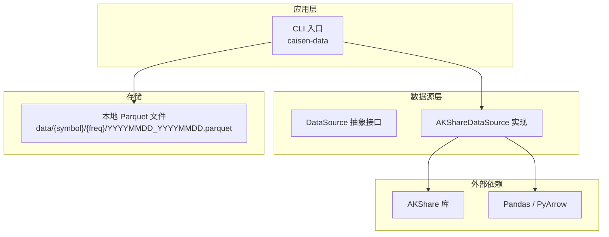
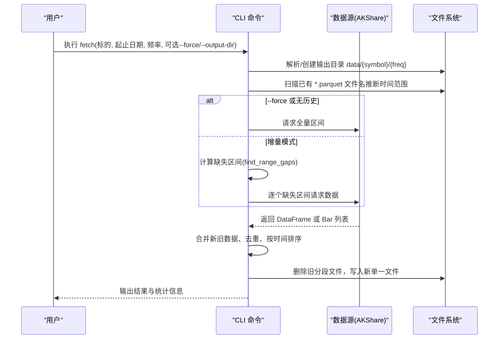
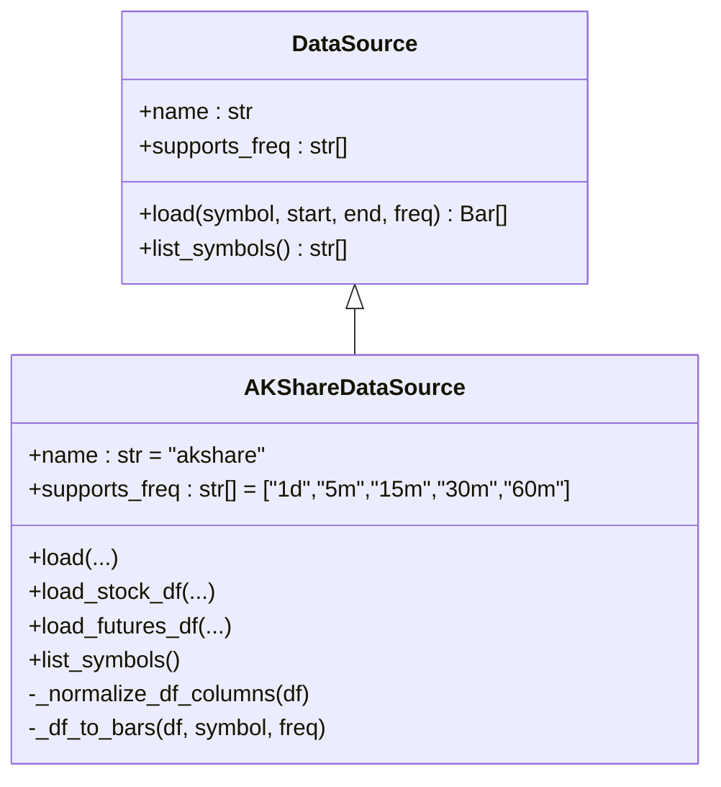
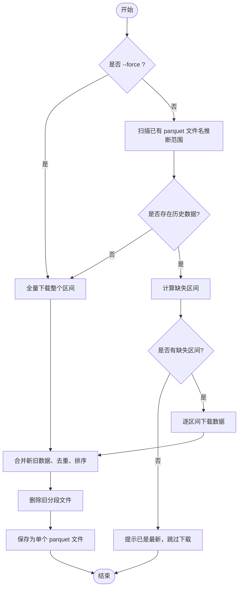
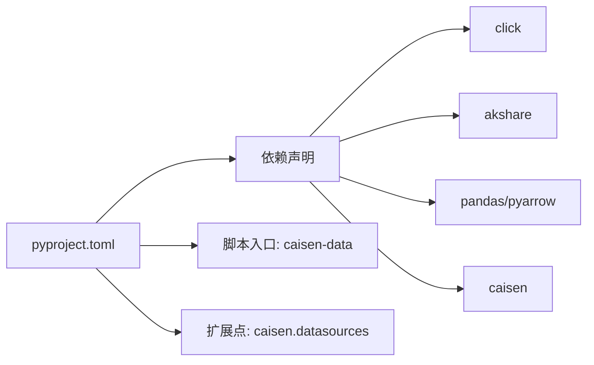

# 快速开始

<cite>
**本文引用的文件**
- [README.md](file://README.md)
- [pyproject.toml](file://pyproject.toml)
- [src/caisen_data/__init__.py](file://src/caisen_data/__init__.py)
- [src/caisen_data/cli.py](file://src/caisen_data/cli.py)
- [src/caisen_data/sources/base.py](file://src/caisen_data/sources/base.py)
- [src/caisen_data/sources/akshare.py](file://src/caisen_data/sources/akshare.py)
- [tests/test_cli_increment.py](file://tests/test_cli_increment.py)
</cite>

## 目录
1. [简介](#简介)
2. [项目结构](#项目结构)
3. [核心组件](#核心组件)
4. [架构总览](#架构总览)
5. [详细组件分析](#详细组件分析)
6. [依赖关系分析](#依赖关系分析)
7. [性能与增量更新](#性能与增量更新)
8. [故障排查指南](#故障排查指南)
9. [结论](#结论)
10. [附录：常用命令速查](#附录常用命令速查)

## 简介
caisen-data 是 caisen 回测系统的数据抓取模块，负责从外部数据源（如 AKShare）拉取 A 股与期货主力合约的 K 线数据，清洗并持久化为本地 Parquet 文件，供回测引擎高效加载。本快速开始指南涵盖环境要求、安装步骤、基本配置、CLI 使用示例（含期货白银主力合约、A 股、多频率与强制更新）、增量更新工作流，以及 Python API 的基本用法和最佳实践建议。

## 项目结构
仓库采用“源码在 src 下 + 可执行 CLI + 数据源插件化”的组织方式：
- CLI 入口：命令行工具提供下载、增量合并、列出标的/数据源等能力
- 数据源抽象：DataSource 基类定义统一接口
- 具体实现：AKShareDataSource 对接 AKShare，支持 A 股日线与期货日/分钟线
- 包元信息：Python 版本约束、依赖、脚本入口与扩展点注册

图表来源
- [src/caisen_data/cli.py:126-140](file://src/caisen_data/cli.py#L126-L140)
- [src/caisen_data/sources/base.py:14-43](file://src/caisen_data/sources/base.py#L14-L43)
- [src/caisen_data/sources/akshare.py:37-41](file://src/caisen_data/sources/akshare.py#L37-L41)
- [pyproject.toml:22-26](file://pyproject.toml#L22-L26)

章节来源
- [pyproject.toml:1-29](file://pyproject.toml#L1-L29)
- [src/caisen_data/__init__.py:1-8](file://src/caisen_data/__init__.py#L1-L8)

## 核心组件
- CLI 模块
  - 提供 fetch/list-symbols/list-sources 子命令
  - 支持 --force 强制覆盖、--output-dir 自定义输出目录、--source 指定数据源
  - 自动计算缺失区间、合并已有数据、去重排序、保存为单个 Parquet 文件
- 数据源抽象
  - DataSource 定义 load() 与 list_symbols() 接口
- AKShare 数据源
  - 支持 A 股日线与期货主力合约（日/5m/15m/30m/60m）
  - 提供 DataFrame 接口（无需 caisen 依赖）与 Bar 列表接口（需 caisen 依赖）
  - 内置主力合约映射与列名标准化逻辑

章节来源
- [src/caisen_data/cli.py:126-314](file://src/caisen_data/cli.py#L126-L314)
- [src/caisen_data/sources/base.py:14-43](file://src/caisen_data/sources/base.py#L14-L43)
- [src/caisen_data/sources/akshare.py:37-245](file://src/caisen_data/sources/akshare.py#L37-L245)

## 架构总览
下图展示一次典型的数据获取与落盘流程，包括增量判断、缺失区间计算、下载、合并与清理旧文件。

图表来源
- [src/caisen_data/cli.py:140-276](file://src/caisen_data/cli.py#L140-L276)
- [src/caisen_data/cli.py:19-103](file://src/caisen_data/cli.py#L19-L103)
- [src/caisen_data/sources/akshare.py:115-190](file://src/caisen_data/sources/akshare.py#L115-L190)

## 详细组件分析

### CLI 组件
- 关键参数
  - --symbol/-s：标的代码（如 ag、000001.SZ）
  - --start/--end：起止日期（YYYY-MM-DD）
  - --freq：频率（1d/5m/15m/30m/60m）
  - --output-dir：输出根目录（默认用户主目录下的 data）
  - --source：数据源名称（当前支持 akshare）
  - --force：强制重新下载并覆盖已有文件
- 增量逻辑
  - 通过文件名 YYYYMMDD_YYYYMMDD.parquet 解析已有范围
  - 计算缺失区间后仅下载缺口部分
  - 合并后去重、排序，并删除旧分段文件，最终保存为单个文件
- 辅助命令
  - list-symbols：列出可用标的（由数据源实现）
  - list-sources：列出可用数据源

章节来源
- [src/caisen_data/cli.py:126-314](file://src/caisen_data/cli.py#L126-L314)
- [tests/test_cli_increment.py:1-231](file://tests/test_cli_increment.py#L1-L231)

### 数据源抽象与 AKShare 实现
- 抽象接口
  - load(symbol, start, end, freq) -> List[Bar]
  - list_symbols() -> List[str]
- AKShareDataSource
  - 支持频率：1d/5m/15m/30m/60m（股票仅日线）
  - 主力合约映射：ag/m/lh 等
  - DataFrame 接口：load_stock_df/load_futures_df（无需 caisen 依赖）
  - Bar 接口：load() 内部调用 DataFrame 接口并转换为 Bar 列表（需要 caisen 依赖）
  - 列名标准化：将不同 API 返回的中文列名统一为标准 OHLCV 格式
  - 分钟数据过滤：对分钟级数据按日期范围二次过滤

图表来源
- [src/caisen_data/sources/base.py:14-43](file://src/caisen_data/sources/base.py#L14-L43)
- [src/caisen_data/sources/akshare.py:37-245](file://src/caisen_data/sources/akshare.py#L37-L245)

章节来源
- [src/caisen_data/sources/base.py:1-43](file://src/caisen_data/sources/base.py#L1-L43)
- [src/caisen_data/sources/akshare.py:1-245](file://src/caisen_data/sources/akshare.py#L1-L245)

### 增量更新流程图

图表来源
- [src/caisen_data/cli.py:140-276](file://src/caisen_data/cli.py#L140-L276)
- [src/caisen_data/cli.py:19-103](file://src/caisen_data/cli.py#L19-L103)

## 依赖关系分析
- 构建与运行
  - Python >= 3.10
  - 依赖：caisen、akshare、pandas、pyarrow、click
  - 开发依赖：pytest
- 脚本入口
  - 安装后可直接运行 caisen-data 命令
- 扩展点
  - 通过 entry-points 注册数据源到 caisen.datasources 命名空间

图表来源
- [pyproject.toml:1-29](file://pyproject.toml#L1-L29)

章节来源
- [pyproject.toml:1-29](file://pyproject.toml#L1-L29)

## 性能与增量更新
- 增量优先
  - 默认基于文件名推断已有范围，避免重复下载
  - 仅下载缺失区间，减少网络与 I/O 开销
- 合并策略
  - 合并时按 timestamp 去重并排序，保证数据一致性
  - 合并完成后删除旧分段文件，保持目录整洁
- 分钟数据处理
  - 分钟级数据会进行二次时间范围过滤，确保精确匹配
- 强制更新
  - 使用 --force 可清空已有文件并全量重新下载，适用于数据源变更或修复场景

章节来源
- [src/caisen_data/cli.py:140-276](file://src/caisen_data/cli.py#L140-L276)
- [src/caisen_data/sources/akshare.py:147-190](file://src/caisen_data/sources/akshare.py#L147-L190)

## 故障排查指南
- 常见错误与处理
  - 未安装 akshare：导入失败或运行时抛出 ImportError
    - 解决：安装 akshare 后再运行
  - 未安装 caisen：当使用 load() 返回 Bar 对象时报错
    - 解决：安装 caisen，或使用 load_*_df() 接口直接获取 DataFrame
  - 股票频率不支持非日线：传入非 1d 会报错
    - 解决：股票数据仅支持 1d
  - 未知数据源：--source 传值不在支持列表
    - 解决：使用 akshare
- 日志与调试
  - 模块已设置 NullHandler，避免空处理器警告；可在上层应用配置更详细的日志级别
- 测试用例参考
  - 增量相关函数（范围解析、合并、去重、缺失区间计算）均有单元测试覆盖，可作为行为参考

章节来源
- [src/caisen_data/sources/akshare.py:115-190](file://src/caisen_data/sources/akshare.py#L115-L190)
- [src/caisen_data/__init__.py:1-8](file://src/caisen_data/__init__.py#L1-L8)
- [tests/test_cli_increment.py:1-231](file://tests/test_cli_increment.py#L1-L231)

## 结论
caisen-data 提供了轻量、可扩展的数据抓取与本地化管理能力，结合 CLI 与 Python API 可满足日常回测数据准备需求。推荐优先使用增量更新策略，配合合理的频率与时间窗口，以获得稳定高效的回测体验。

## 附录：常用命令速查
- 基础安装与环境
  - 环境要求：Python 3.10+
  - 安装：pip install -e .
- CLI 示例
  - 下载期货白银主力合约（日线）
    - caisen-data fetch --symbol ag --start 2023-01-01 --end 2024-12-31 --freq 1d
  - 下载 A 股数据（日线）
    - caisen-data fetch --symbol 000001.SZ --start 2023-01-01 --end 2024-12-31 --freq 1d
  - 指定频率（5m/15m/30m/60m）
    - caisen-data fetch --symbol ag --start 2023-01-01 --end 2024-12-31 --freq 5m
  - 强制更新（覆盖已有文件）
    - caisen-data fetch --symbol ag --start 2023-01-01 --end 2024-12-31 --force
- 增量更新工作流
  - 首次下载生成单文件
    - caisen-data fetch --symbol ag --start 2024-01-01 --end 2024-06-30
  - 扩展范围自动合并
    - caisen-data fetch --symbol ag --start 2024-01-01 --end 2024-12-31
- 其他命令
  - 列出可用标的：caisen-data list-symbols
  - 列出可用数据源：caisen-data list-sources
- Python API 基本用法
  - 导入与创建数据源实例
    - from caisen_data.sources.akshare import AKShareDataSource
    - ds = AKShareDataSource()
  - 加载数据（DataFrame 接口，无需 caisen 依赖）
    - bars_df = ds.load_futures_df("ag", start_date, end_date, "1d")
    - stock_df = ds.load_stock_df("000001.SZ", start_date, end_date, "1d")
  - 加载数据（Bar 列表接口，需安装 caisen）
    - bars = ds.load("ag", start_date, end_date, "1d")
- 最佳实践建议
  - 优先使用增量更新，仅在必要时使用 --force
  - 股票数据仅支持日线；期货支持日线与分钟线
  - 合理选择时间窗口与频率，满足回测策略需求
  - 如需在 caisen 生态中使用 Bar 对象，请确保安装 caisen

章节来源
- [README.md:1-144](file://README.md#L1-L144)
- [src/caisen_data/cli.py:126-314](file://src/caisen_data/cli.py#L126-L314)
- [src/caisen_data/sources/akshare.py:115-190](file://src/caisen_data/sources/akshare.py#L115-L190)