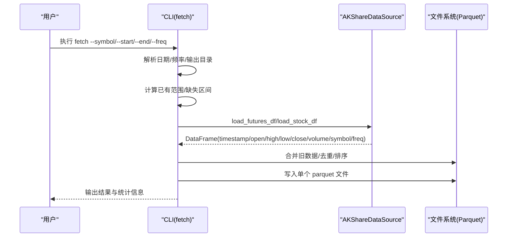
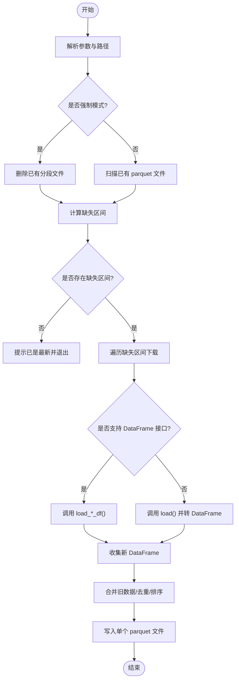
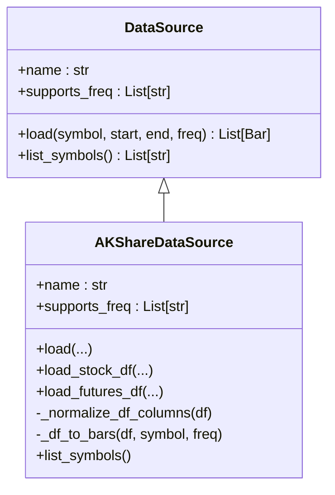
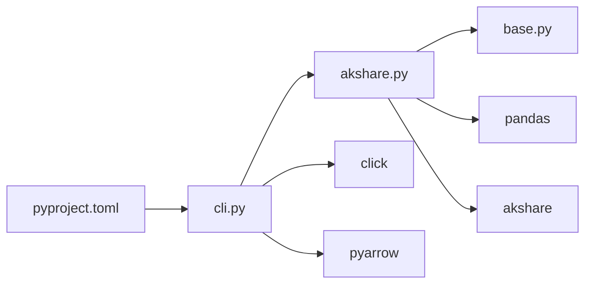

# 故障排除

<cite>
**本文引用的文件**   
- [README.md](file://README.md)
- [pyproject.toml](file://pyproject.toml)
- [src/caisen_data/__init__.py](file://src/caisen_data/__init__.py)
- [src/caisen_data/cli.py](file://src/caisen_data/cli.py)
- [src/caisen_data/sources/base.py](file://src/caisen_data/sources/base.py)
- [src/caisen_data/sources/akshare.py](file://src/caisen_data/sources/akshare.py)
- [tests/test_cli_increment.py](file://tests/test_cli_increment.py)
</cite>

## 目录
1. [简介](#简介)
2. [项目结构](#项目结构)
3. [核心组件](#核心组件)
4. [架构总览](#架构总览)
5. [详细组件分析](#详细组件分析)
6. [依赖关系分析](#依赖关系分析)
7. [性能考虑](#性能考虑)
8. [故障排除指南](#故障排除指南)
9. [结论](#结论)
10. [附录](#附录)

## 简介
本指南面向使用 caisen-data 数据抓取模块的用户与运维人员，聚焦于常见问题定位与解决、日志分析方法、性能优化建议、错误信息解读、系统监控与健康检查、升级迁移与兼容性处理，以及社区支持与反馈渠道。内容基于仓库源码与文档整理，确保可操作且可追溯。

## 项目结构
caisen-data 是一个为回测系统提供本地数据源的 Python 包，提供 CLI 与 Python API，默认从 AKShare 拉取 A 股与期货主力合约数据，落盘为 Parquet 文件，支持增量合并与去重。

```mermaid
graph TB
subgraph "CLI"
CLI["cli.py<br/>命令行入口"]
end
subgraph "数据源"
Base["base.py<br/>DataSource 抽象接口"]
AK["akshare.py<br/>AKShare 实现"]
end
subgraph "配置与元信息"
Init["__init__.py<br/>版本与日志初始化"]
PyProj["pyproject.toml<br/>依赖与脚本入口"]
Readme["README.md<br/>使用说明与数据格式"]
end
subgraph "测试"
Tests["test_cli_increment.py<br/>增量逻辑单元测试"]
end
CLI --> AK
AK --> Base
CLI --> Init
PyProj --> CLI
Readme --> CLI
Tests --> CLI
```

图表来源
- [src/caisen_data/cli.py:1-314](file://src/caisen_data/cli.py#L1-L314)
- [src/caisen_data/sources/base.py:1-43](file://src/caisen_data/sources/base.py#L1-L43)
- [src/caisen_data/sources/akshare.py:1-245](file://src/caisen_data/sources/akshare.py#L1-L245)
- [src/caisen_data/__init__.py:1-8](file://src/caisen_data/__init__.py#L1-L8)
- [pyproject.toml:1-29](file://pyproject.toml#L1-L29)
- [README.md:1-144](file://README.md#L1-L144)
- [tests/test_cli_increment.py:1-231](file://tests/test_cli_increment.py#L1-L231)

章节来源
- [README.md:1-144](file://README.md#L1-L144)
- [pyproject.toml:1-29](file://pyproject.toml#L1-L29)
- [src/caisen_data/cli.py:1-314](file://src/caisen_data/cli.py#L1-L314)
- [src/caisen_data/sources/base.py:1-43](file://src/caisen_data/sources/base.py#L1-L43)
- [src/caisen_data/sources/akshare.py:1-245](file://src/caisen_data/sources/akshare.py#L1-L245)
- [src/caisen_data/__init__.py:1-8](file://src/caisen_data/__init__.py#L1-L8)
- [tests/test_cli_increment.py:1-231](file://tests/test_cli_increment.py#L1-L231)

## 核心组件
- CLI 命令：提供 fetch、list-symbols、list-sources 等命令，负责参数解析、增量计算、下载与保存。
- 数据源抽象：DataSource 定义统一接口，便于扩展新数据源。
- AKShare 数据源：实现股票与期货主力合约的数据获取与标准化，返回 DataFrame 或 Bar 对象（可选）。
- 增量与合并：基于文件名解析时间范围，计算缺失区间，合并并去重后写入单个 Parquet 文件。
- 日志与版本：包级初始化设置 NullHandler，避免无处理器警告；提供版本号。

章节来源
- [src/caisen_data/cli.py:126-314](file://src/caisen_data/cli.py#L126-L314)
- [src/caisen_data/sources/base.py:14-43](file://src/caisen_data/sources/base.py#L14-L43)
- [src/caisen_data/sources/akshare.py:37-245](file://src/caisen_data/sources/akshare.py#L37-L245)
- [src/caisen_data/__init__.py:1-8](file://src/caisen_data/__init__.py#L1-L8)

## 架构总览
下图展示了从 CLI 到数据源再到本地存储的调用流程，以及关键异常点与日志输出位置。



图表来源
- [src/caisen_data/cli.py:140-276](file://src/caisen_data/cli.py#L140-L276)
- [src/caisen_data/sources/akshare.py:115-190](file://src/caisen_data/sources/akshare.py#L115-L190)

## 详细组件分析

### CLI 组件（fetch 流程）
- 功能要点
  - 支持强制模式覆盖旧文件。
  - 通过文件名推断已有数据范围，计算缺失区间进行增量下载。
  - 优先使用 DataFrame 接口，避免 Bar 转换开销；若无则回退到 Bar 列表再转 DataFrame。
  - 合并旧数据、去重 timestamp、排序后保存为单个 Parquet 文件。
- 常见异常点
  - 未知数据源名称。
  - 网络或外部 API 异常导致获取失败。
  - 无数据区间被跳过。
- 日志与输出
  - 使用 logging 记录错误与调试信息，同时通过 click.echo 向终端输出进度与结果。



图表来源
- [src/caisen_data/cli.py:140-276](file://src/caisen_data/cli.py#L140-L276)

章节来源
- [src/caisen_data/cli.py:19-116](file://src/caisen_data/cli.py#L19-L116)
- [src/caisen_data/cli.py:140-276](file://src/caisen_data/cli.py#L140-L276)
- [tests/test_cli_increment.py:1-231](file://tests/test_cli_increment.py#L1-L231)

### 数据源抽象与 AKShare 实现
- DataSource 抽象接口
  - 定义统一的 load(symbol, start, end, freq) 与 list_symbols() 方法。
- AKShareDataSource
  - 支持股票（仅日线）与期货（日线和分钟线）数据获取。
  - 提供 DataFrame 接口（无需 caisen 依赖），以及 Bar 对象接口（需要 caisen 依赖）。
  - 内部对列名进行标准化，保证输出一致。
  - 分钟数据按请求日期范围过滤。



图表来源
- [src/caisen_data/sources/base.py:14-43](file://src/caisen_data/sources/base.py#L14-L43)
- [src/caisen_data/sources/akshare.py:37-245](file://src/caisen_data/sources/akshare.py#L37-L245)

章节来源
- [src/caisen_data/sources/base.py:1-43](file://src/caisen_data/sources/base.py#L1-L43)
- [src/caisen_data/sources/akshare.py:1-245](file://src/caisen_data/sources/akshare.py#L1-L245)

## 依赖关系分析
- 运行时依赖
  - caisen（可选用于 Bar 对象）、akshare、pandas、pyarrow、click。
- 脚本入口
  - 通过 pyproject.toml 注册 caisen-data 命令。
- 插件式数据源
  - 通过 entry-points 将 akshare 数据源注册到 caisen 生态。



图表来源
- [pyproject.toml:1-29](file://pyproject.toml#L1-L29)
- [src/caisen_data/cli.py:1-314](file://src/caisen_data/cli.py#L1-L314)
- [src/caisen_data/sources/akshare.py:1-245](file://src/caisen_data/sources/akshare.py#L1-L245)
- [src/caisen_data/sources/base.py:1-43](file://src/caisen_data/sources/base.py#L1-L43)

章节来源
- [pyproject.toml:1-29](file://pyproject.toml#L1-L29)

## 性能考虑
- 批量处理
  - 优先使用 DataFrame 接口减少对象构造开销；在 CLI 中已内置此策略。
- 缓存策略
  - 当前采用“增量+去重”的文件级缓存机制，避免重复下载与合并冗余。
- 资源管理
  - 合并时先读取所有分段文件再 concat，适合中小规模数据；超大范围建议分时段多次增量更新，避免单次内存峰值过高。
- I/O 优化
  - 最终落盘为单个 Parquet 文件，利于后续读取；若历史数据极大，可考虑分区存储策略（需自行扩展）。

章节来源
- [src/caisen_data/cli.py:189-276](file://src/caisen_data/cli.py#L189-L276)
- [src/caisen_data/sources/akshare.py:192-225](file://src/caisen_data/sources/akshare.py#L192-L225)

## 故障排除指南

### 一、安装与环境问题
- 症状
  - 运行 caisen-data 报 ImportError 或找不到命令。
- 可能原因
  - 未安装依赖（akshare、pandas、pyarrow、click、caisen）。
  - 虚拟环境未激活或 pip 安装路径不在 PATH。
- 排查步骤
  - 确认 Python 版本满足要求（>=3.10）。
  - 重新安装包：pip install -e .
  - 验证命令可用：caisen-data list-sources
- 参考依据
  - 依赖声明与脚本入口见配置文件。

章节来源
- [pyproject.toml:1-29](file://pyproject.toml#L1-L29)

### 二、网络连接与外部 API 失败
- 症状
  - 下载过程中报错、超时或返回空数据。
- 可能原因
  - 网络不可达、代理未配置、AKShare 服务限流或变更。
- 排查步骤
  - 检查网络连通性与代理设置。
  - 降低并发与缩小时间窗口重试。
  - 查看日志中的错误信息，定位具体区间失败。
- 日志定位
  - CLI 层捕获异常并记录错误日志，同时打印简要信息。

章节来源
- [src/caisen_data/cli.py:226-229](file://src/caisen_data/cli.py#L226-L229)

### 三、数据源访问失败（akshare 未安装或缺少依赖）
- 症状
  - 抛出 ImportError 提示缺少 akshare 或 caisen。
- 可能原因
  - 未安装 akshare 或 caisen 包。
- 排查步骤
  - 安装 akshare：pip install akshare
  - 如需 Bar 对象接口，安装 caisen：pip install caisen
  - 使用 DataFrame 接口可避免 caisen 依赖。
- 相关错误信息
  - “akshare not installed...”
  - “caisen 未安装，无法使用 load() 返回 Bar 对象...”

章节来源
- [src/caisen_data/sources/akshare.py:51-52](file://src/caisen_data/sources/akshare.py#L51-L52)
- [src/caisen_data/sources/akshare.py:68-72](file://src/caisen_data/sources/akshare.py#L68-L72)
- [src/caisen_data/sources/akshare.py:84-88](file://src/caisen_data/sources/akshare.py#L84-L88)
- [src/caisen_data/sources/akshare.py:194-197](file://src/caisen_data/sources/akshare.py#L194-L197)

### 四、权限问题（无法写入数据目录）
- 症状
  - 创建目录或写入 Parquet 文件时报权限错误。
- 可能原因
  - 输出目录不可写，或磁盘挂载只读。
- 排查步骤
  - 使用 --output-dir 指定有写权限的路径。
  - 检查目标目录权限与磁盘空间。
- 参考说明
  - 默认数据目录为用户主目录下的 data 文件夹。

章节来源
- [src/caisen_data/cli.py:146-148](file://src/caisen_data/cli.py#L146-L148)
- [README.md:32-33](file://README.md#L32-L33)

### 五、存储空间不足
- 症状
  - 写入 Parquet 文件失败或磁盘已满。
- 可能原因
  - 目标磁盘空间不足。
- 排查步骤
  - 清理历史数据或更换更大容量磁盘。
  - 调整输出目录至其他分区。
- 参考说明
  - 数据以 Parquet 格式保存，目录结构含 symbol 与 freq 子目录。

章节来源
- [README.md:92-101](file://README.md#L92-L101)

### 六、增量与合并异常（重复、缺失、顺序错乱）
- 症状
  - 数据重复、时间戳顺序不正确、合并后行数异常。
- 可能原因
  - 多文件合并时未正确去重或排序。
- 排查步骤
  - 使用测试用例验证合并与去重逻辑。
  - 检查文件名是否符合 YYYYMMDD_YYYYMMDD.parquet 规范。
- 参考依据
  - 合并函数会去重 timestamp 并按时间排序。

章节来源
- [src/caisen_data/cli.py:106-116](file://src/caisen_data/cli.py#L106-L116)
- [tests/test_cli_increment.py:199-216](file://tests/test_cli_increment.py#L199-L216)

### 七、频率与标的不匹配
- 症状
  - 股票数据请求非日线频率时报错。
- 可能原因
  - 股票数据仅支持日线。
- 排查步骤
  - 将 freq 设置为 1d。
  - 使用期货代码以支持分钟线。
- 相关错误信息
  - “股票数据仅支持日线 (1d)，当前请求: ...”

章节来源
- [src/caisen_data/sources/akshare.py:131-132](file://src/caisen_data/sources/akshare.py#L131-L132)

### 八、未知数据源
- 症状
  - 提示未知数据源名称。
- 可能原因
  - source 参数传入不支持的名称。
- 排查步骤
  - 使用 list-sources 查看可用数据源。
  - 使用 akshare 作为数据源。

章节来源
- [src/caisen_data/cli.py:183-186](file://src/caisen_data/cli.py#L183-L186)
- [src/caisen_data/cli.py:300-305](file://src/caisen_data/cli.py#L300-L305)

### 九、列出标的失败
- 症状
  - 列出 A 股标的时报错或返回空列表。
- 可能原因
  - akshare 未安装或网络异常。
- 排查步骤
  - 安装 akshare 并检查网络。
  - 查看日志中的错误信息。

章节来源
- [src/caisen_data/sources/akshare.py:229-245](file://src/caisen_data/sources/akshare.py#L229-L245)
- [src/caisen_data/cli.py:294-297](file://src/caisen_data/cli.py#L294-L297)

### 十、日志分析与调试技巧
- 启用详细日志
  - 在调用方配置 logger，设置级别为 DEBUG 或 INFO，以便看到更多细节。
- 关注的关键日志点
  - 获取失败、未知数据源、A 股列表获取失败等错误日志。
  - 删除旧文件、合并统计等调试信息。
- 快速定位
  - 根据 CLI 输出的区间与错误信息，结合日志定位具体失败区间。

章节来源
- [src/caisen_data/__init__.py:7-8](file://src/caisen_data/__init__.py#L7-L8)
- [src/caisen_data/cli.py:183-186](file://src/caisen_data/cli.py#L183-L186)
- [src/caisen_data/cli.py:226-229](file://src/caisen_data/cli.py#L226-L229)
- [src/caisen_data/sources/akshare.py:243-245](file://src/caisen_data/sources/akshare.py#L243-L245)

### 十一、错误代码与异常信息含义
- ImportError（akshare 未安装）
  - 含义：缺少 akshare 依赖。
  - 处理：安装 akshare。
- ImportError（caisen 未安装）
  - 含义：使用 Bar 对象接口时需要 caisen。
  - 处理：安装 caisen 或使用 DataFrame 接口。
- ValueError（频率不支持）
  - 含义：股票数据仅支持日线。
  - 处理：将 freq 设为 1d。
- 通用 Exception（网络/IO 异常）
  - 含义：外部 API 或文件系统异常。
  - 处理：检查网络、代理、磁盘与权限。

章节来源
- [src/caisen_data/sources/akshare.py:51-52](file://src/caisen_data/sources/akshare.py#L51-L52)
- [src/caisen_data/sources/akshare.py:68-72](file://src/caisen_data/sources/akshare.py#L68-L72)
- [src/caisen_data/sources/akshare.py:84-88](file://src/caisen_data/sources/akshare.py#L84-L88)
- [src/caisen_data/sources/akshare.py:131-132](file://src/caisen_data/sources/akshare.py#L131-L132)
- [src/caisen_data/sources/akshare.py:194-197](file://src/caisen_data/sources/akshare.py#L194-L197)
- [src/caisen_data/cli.py:226-229](file://src/caisen_data/cli.py#L226-L229)

### 十二、系统监控与健康检查
- 健康检查项
  - 数据源可用性：尝试 list-symbols 或拉取小范围数据。
  - 存储可用性：检查输出目录存在并可写。
  - 数据完整性：校验最近生成的 Parquet 文件行数与时间范围。
- 监控建议
  - 定期任务执行增量更新，记录成功/失败状态。
  - 对失败区间进行告警与重试。
- 参考说明
  - 数据保存目录结构与字段定义。

章节来源
- [README.md:92-101](file://README.md#L92-L101)
- [README.md:117-131](file://README.md#L117-L131)

### 十三、升级与迁移指南
- 升级步骤
  - 更新包版本：pip install -e . --upgrade
  - 检查依赖版本约束，必要时调整。
- 迁移注意事项
  - 数据格式保持不变（Parquet 列名与类型）。
  - 增量逻辑基于文件名解析，保持命名规范即可无缝迁移。
- 兼容性
  - Python 版本要求 >=3.10。
  - 若引入新数据源，遵循 DataSource 接口并在 entry-points 注册。

章节来源
- [pyproject.toml:10-17](file://pyproject.toml#L10-L17)
- [pyproject.toml:25-26](file://pyproject.toml#L25-L26)
- [README.md:117-131](file://README.md#L117-L131)

### 十四、社区支持与反馈渠道
- 问题反馈
  - 提交 Issue 时附上：操作系统、Python 版本、依赖版本、复现步骤、日志片段。
- 贡献方式
  - 遵循现有接口扩展数据源，补充单元测试。
- 参考说明
  - README 包含使用说明与数据格式，有助于快速定位问题。

章节来源
- [README.md:1-144](file://README.md#L1-L144)

## 结论
通过理解 CLI 的增量与合并逻辑、数据源接口的差异与依赖、以及日志与异常信息的含义，用户可以高效定位并解决网络、权限、存储、兼容性与性能相关问题。建议在大规模数据场景下采用分批增量与合理的存储策略，并结合健康检查与监控提升稳定性。

## 附录
- 常用命令速查
  - 下载数据：caisen-data fetch --symbol ag --start 2023-01-01 --end 2024-12-31 --freq 1d
  - 列出标的：caisen-data list-symbols
  - 列出数据源：caisen-data list-sources
- 数据格式参考
  - Parquet 列：timestamp、open、high、low、close、volume、symbol、freq

章节来源
- [README.md:15-28](file://README.md#L15-L28)
- [README.md:117-131](file://README.md#L117-L131)