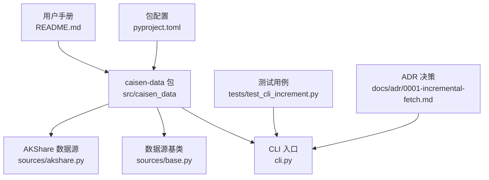
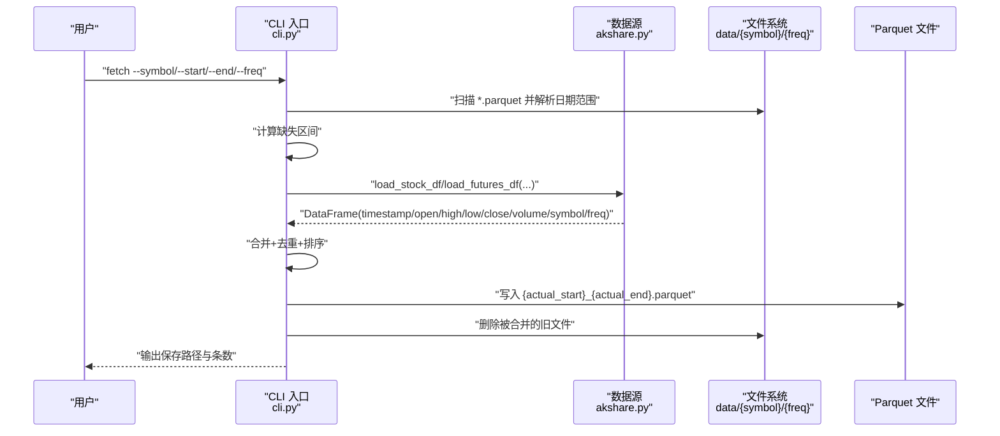
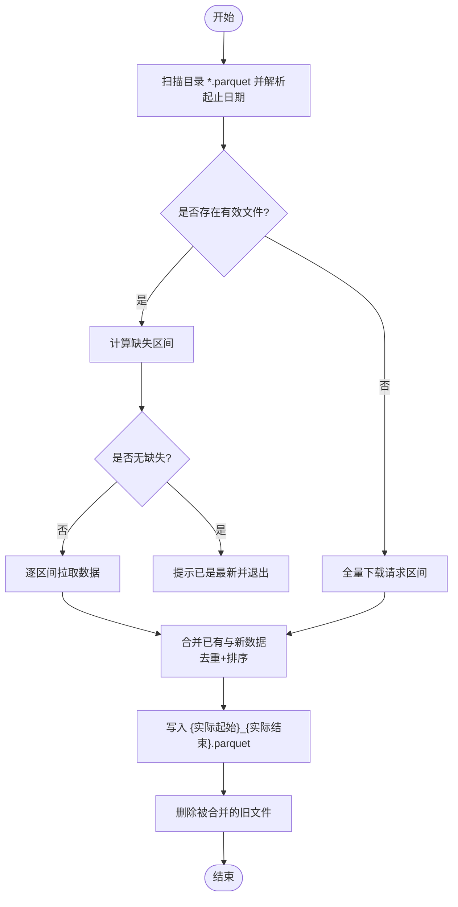
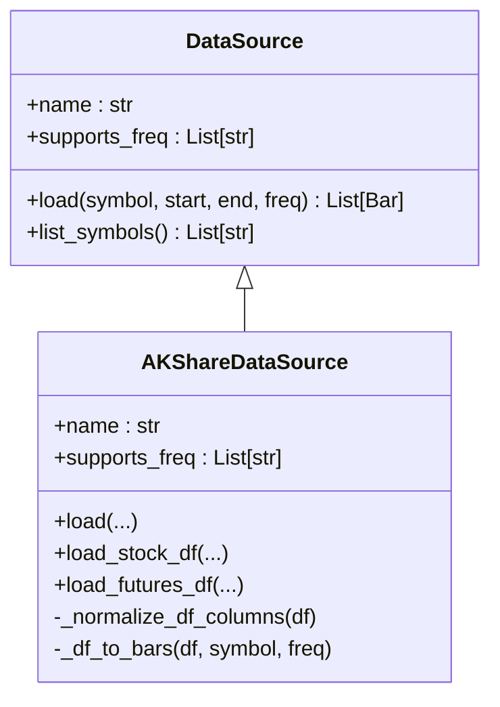
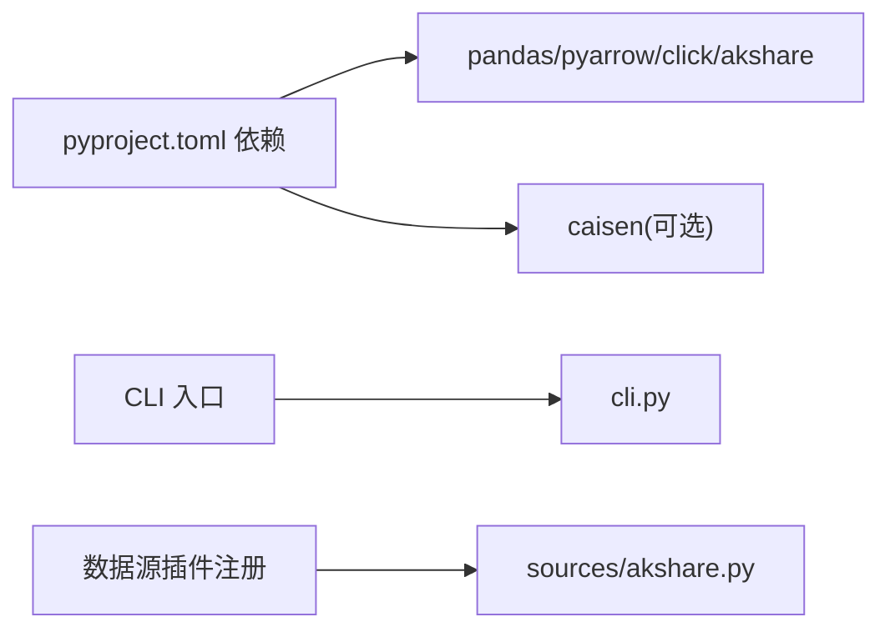
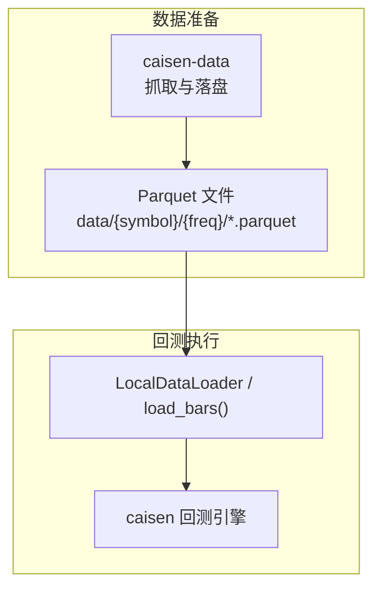

# 数据存储格式

<cite>
**本文引用的文件**   
- [README.md](file://README.md)
- [pyproject.toml](file://pyproject.toml)
- [src/caisen_data/__init__.py](file://src/caisen_data/__init__.py)
- [src/caisen_data/cli.py](file://src/caisen_data/cli.py)
- [src/caisen_data/sources/base.py](file://src/caisen_data/sources/base.py)
- [src/caisen_data/sources/akshare.py](file://src/caisen_data/sources/akshare.py)
- [tests/test_cli_increment.py](file://tests/test_cli_increment.py)
- [docs/adr/0001-incremental-fetch.md](file://docs/adr/0001-incremental-fetch.md)
</cite>

## 目录
1. [简介](#简介)
2. [项目结构](#项目结构)
3. [核心组件](#核心组件)
4. [架构总览](#架构总览)
5. [详细组件分析](#详细组件分析)
6. [依赖关系分析](#依赖关系分析)
7. [性能与存储特性](#性能与存储特性)
8. [数据验证与完整性检查](#数据验证与完整性检查)
9. [迁移与备份策略](#迁移与备份策略)
10. [查询与分析最佳实践](#查询与分析最佳实践)
11. [与 CAISEN 回测系统对接](#与-caisen-回测系统对接)
12. [故障排查指南](#故障排查指南)
13. [结论](#结论)

## 简介
本文件面向 caisen-data 的数据存储格式，系统性说明 Parquet 格式的选择原因与优势、目录结构与命名规范、K 线标准字段定义、增量合并与版本管理、数据验证与完整性检查、迁移与备份策略，以及查询分析与和 CAISEN 回测系统的对接方式。文档同时给出架构图与流程图，帮助读者快速理解从数据抓取到落盘再到回测加载的完整链路。

## 项目结构
仓库采用“源码 + 测试 + 示例数据目录”的组织方式：
- src/caisen_data：核心模块（CLI、数据源抽象与 AKShare 实现）
- tests：增量逻辑与合并逻辑的单元测试
- data/ag：示例标的目录（按标的与频率分层）
- docs/adr：架构决策记录（如增量抓取）
- README.md：使用说明与数据格式概览
- pyproject.toml：包元数据与依赖声明

图表来源
- [src/caisen_data/cli.py:1-314](file://src/caisen_data/cli.py#L1-L314)
- [src/caisen_data/sources/base.py:1-43](file://src/caisen_data/sources/base.py#L1-L43)
- [src/caisen_data/sources/akshare.py:1-245](file://src/caisen_data/sources/akshare.py#L1-L245)
- [tests/test_cli_increment.py:1-231](file://tests/test_cli_increment.py#L1-L231)
- [docs/adr/0001-incremental-fetch.md:1-130](file://docs/adr/0001-incremental-fetch.md#L1-L130)
- [pyproject.toml:1-29](file://pyproject.toml#L1-L29)
- [README.md:1-144](file://README.md#L1-L144)

章节来源
- [README.md:90-101](file://README.md#L90-L101)
- [pyproject.toml:11-17](file://pyproject.toml#L11-L17)

## 核心组件
- CLI 层：提供 fetch/list-symbols/list-sources 命令，负责增量计算、范围合并、Parquet 读写与清理。
- 数据源抽象：DataSource 定义 load() 与 list_symbols() 接口，便于扩展新数据源。
- AKShare 数据源：实现股票与期货数据的 DataFrame 获取与标准化，支持多频率分钟级数据。
- 增量与合并：基于文件名解析已有时间范围，计算缺失区间，下载后合并去重并写回单个文件。

章节来源
- [src/caisen_data/cli.py:19-116](file://src/caisen_data/cli.py#L19-L116)
- [src/caisen_data/sources/base.py:14-43](file://src/caisen_data/sources/base.py#L14-L43)
- [src/caisen_data/sources/akshare.py:37-245](file://src/caisen_data/sources/akshare.py#L37-L245)

## 架构总览
整体流程：CLI 接收参数 → 解析已有数据范围 → 计算缺失区间 → 调用数据源获取 DataFrame → 合并去重排序 → 写入单一 Parquet 文件 → 删除旧分段文件。

图表来源
- [src/caisen_data/cli.py:140-276](file://src/caisen_data/cli.py#L140-L276)
- [src/caisen_data/sources/akshare.py:115-190](file://src/caisen_data/sources/akshare.py#L115-L190)

## 详细组件分析

### 目录结构与命名规范
- 目录层次：按标的与频率组织，形如 data/{symbol}/{freq}/
- 文件命名：{YYYYMMDD}_{YYYYMMDD}.parquet，表示该文件包含的实际起止日期
- 默认输出目录：用户主目录下的 data 文件夹，可通过 --output-dir 覆盖

章节来源
- [README.md:90-101](file://README.md#L90-L101)
- [src/caisen_data/cli.py:14-148](file://src/caisen_data/cli.py#L14-L148)

### K 线数据标准格式（OHLCV）
- 列名与类型
  - timestamp：datetime，时间戳
  - open/high/low/close：float，价格
  - volume：float，成交量
  - symbol：string，标的代码
  - freq：string，数据频率（如 1d, 5m, 15m, 30m, 60m）
- 时间戳处理
  - 统一转换为 datetime 类型；分钟数据在获取后进行时间范围过滤
- 数据去重与排序
  - 以 timestamp 为键去重，并按 timestamp 升序排列

章节来源
- [README.md:117-131](file://README.md#L117-L131)
- [src/caisen_data/sources/akshare.py:92-113](file://src/caisen_data/sources/akshare.py#L92-L113)
- [src/caisen_data/sources/akshare.py:183-190](file://src/caisen_data/sources/akshare.py#L183-L190)
- [src/caisen_data/cli.py:106-116](file://src/caisen_data/cli.py#L106-L116)

### 增量抓取与合并算法
- 已有范围识别：仅通过文件名解析，无需读取文件内容
- 缺失区间计算：对请求范围与已有范围求差集
- 合并策略：多文件合并为单文件，去重并排序，随后删除旧文件
- 强制更新：--force 模式会删除已有文件并全量重新下载

图表来源
- [src/caisen_data/cli.py:19-116](file://src/caisen_data/cli.py#L19-L116)
- [docs/adr/0001-incremental-fetch.md:45-111](file://docs/adr/0001-incremental-fetch.md#L45-L111)

章节来源
- [src/caisen_data/cli.py:140-276](file://src/caisen_data/cli.py#L140-L276)
- [docs/adr/0001-incremental-fetch.md:1-130](file://docs/adr/0001-incremental-fetch.md#L1-L130)

### 数据源抽象与 AKShare 实现
- DataSource 抽象类定义了统一的 load() 与 list_symbols() 接口
- AKShareDataSource 实现了股票与期货的 DataFrame 接口，并对不同 API 返回列进行标准化映射
- 分钟数据需额外按日期范围过滤；日线由 API 直接返回指定范围

图表来源
- [src/caisen_data/sources/base.py:14-43](file://src/caisen_data/sources/base.py#L14-L43)
- [src/caisen_data/sources/akshare.py:37-245](file://src/caisen_data/sources/akshare.py#L37-L245)

章节来源
- [src/caisen_data/sources/base.py:1-43](file://src/caisen_data/sources/base.py#L1-L43)
- [src/caisen_data/sources/akshare.py:1-245](file://src/caisen_data/sources/akshare.py#L1-L245)

## 依赖关系分析
- 运行时依赖
  - pandas、pyarrow：用于 DataFrame 操作与 Parquet 读写
  - akshare：外部行情数据源
  - click：命令行工具框架
  - caisen：可选依赖，用于 Bar 对象转换（当使用 load() 返回 Bar 列表时）
- 包入口与插件注册
  - CLI 入口脚本：caisen-data = caisen_data.cli:main
  - 数据源插件注册：entry-points."caisen.datasources" 指向 AKShareDataSource

图表来源
- [pyproject.toml:11-26](file://pyproject.toml#L11-L26)
- [src/caisen_data/cli.py:1-12](file://src/caisen_data/cli.py#L1-L12)
- [src/caisen_data/sources/akshare.py:1-22](file://src/caisen_data/sources/akshare.py#L1-L22)

章节来源
- [pyproject.toml:1-29](file://pyproject.toml#L1-L29)

## 性能与存储特性
- 选择 Parquet 的原因与优势
  - 高效压缩：列式存储结合多种编码，显著降低磁盘占用与 I/O
  - 列式存储：适合金融时序数据的列投影与聚合查询
  - 跨平台兼容：PyArrow 生态成熟，Python/R/Spark/Jupyter 等均可高效读写
- 存储与合并优化
  - 合并后去重与排序，避免重复时间戳带来的冗余
  - 将多个分段文件合并为单文件，减少小文件开销，提升后续读取效率
- 注意事项
  - 合并过程需要内存承载多 DataFrame，历史数据通常只合并一次
  - 分钟级数据量较大，建议按合理的时间窗口分批下载与合并

章节来源
- [README.md:117-131](file://README.md#L117-L131)
- [src/caisen_data/cli.py:106-116](file://src/caisen_data/cli.py#L106-L116)
- [src/caisen_data/cli.py:235-276](file://src/caisen_data/cli.py#L235-L276)

## 数据验证与完整性检查
- 基础校验规则
  - 时间戳非空且可解析为 datetime
  - OHLC 数值型字段非空或经 coerce 填充为 0
  - volume 缺失时填充为 0
  - 最终结果按 timestamp 排序且唯一
- 增量一致性
  - 通过文件名解析已有范围，确保缺失区间计算正确
  - 合并后去重，保证同一时间戳不重复
- 测试覆盖
  - 文件名解析、范围归并、缺失区间计算、合并去重均有对应测试

章节来源
- [src/caisen_data/sources/akshare.py:92-113](file://src/caisen_data/sources/akshare.py#L92-L113)
- [src/caisen_data/cli.py:106-116](file://src/caisen_data/cli.py#L106-L116)
- [tests/test_cli_increment.py:23-216](file://tests/test_cli_increment.py#L23-L216)

## 迁移与备份策略
- 迁移
  - 由于采用标准 Parquet 与清晰目录结构，可直接复制 data 目录完成迁移
  - 若升级 schema（新增列），建议在写入前做向后兼容处理，并在合并阶段保留旧列
- 备份
  - 定期快照 data 目录（建议使用支持增量快照的工具）
  - 重要节点可在合并完成后立即生成校验文件（如 md5sum）以便恢复后校验
- 回滚
  - 合并前保留旧文件副本，合并成功后再删除；失败则回滚至旧文件集合

章节来源
- [docs/adr/0001-incremental-fetch.md:97-111](file://docs/adr/0001-incremental-fetch.md#L97-L111)
- [src/caisen_data/cli.py:249-252](file://src/caisen_data/cli.py#L249-L252)

## 查询与分析最佳实践
- 读取策略
  - 优先使用列投影，仅读取需要的列（如 timestamp/open/high/low/close）
  - 利用 PyArrow/Pandas 的分区与筛选能力，按时间范围过滤后再聚合
- 性能建议
  - 尽量使用已合并的单文件，避免大量小文件导致的元数据开销
  - 对高频数据（分钟级）可按周/月切分文件，进一步降低单次读取压力
- 典型分析
  - 统计某标的在某区间的最高/最低/均值成交量
  - 计算移动均线、波动率等衍生指标

章节来源
- [README.md:117-131](file://README.md#L117-L131)
- [src/caisen_data/cli.py:106-116](file://src/caisen_data/cli.py#L106-L116)

## 与 CAISEN 回测系统对接
- 数据流向
  - caisen-data 负责抓取与落盘（Parquet）
  - caisen 通过 LocalDataLoader 或 load_bars() 加载本地数据运行回测
- 集成要点
  - 确保数据目录一致（默认 ~/data）
  - 保持字段与类型一致（timestamp/open/high/low/close/volume/symbol/freq）
  - 如需在 Python 中直接使用，可通过 AKShareDataSource.load_*_df 接口获取 DataFrame

图表来源
- [README.md:103-115](file://README.md#L103-L115)

章节来源
- [README.md:103-115](file://README.md#L103-L115)

## 故障排查指南
- 常见问题
  - 未安装 akshare：抛出 ImportError，请安装依赖
  - 未安装 caisen：使用 load() 返回 Bar 列表时会报错，改用 load_*_df 接口
  - 未知数据源：CLI 会提示不支持的数据源名称
  - 网络异常或 API 限流：日志记录错误信息，建议重试或缩小时间窗口
- 定位方法
  - 查看 CLI 日志输出与 logger 记录
  - 检查 data 目录下文件名是否符合 YYYYMMDD_YYYYMMDD.parquet 规范
  - 使用 list-symbols 确认标的可用性

章节来源
- [src/caisen_data/sources/akshare.py:51-72](file://src/caisen_data/sources/akshare.py#L51-L72)
- [src/caisen_data/sources/akshare.py:129-132](file://src/caisen_data/sources/akshare.py#L129-L132)
- [src/caisen_data/cli.py:182-186](file://src/caisen_data/cli.py#L182-L186)
- [src/caisen_data/cli.py:227-233](file://src/caisen_data/cli.py#L227-L233)

## 结论
本方案以 Parquet 为核心存储格式，结合清晰的目录与命名规范、稳健的增量合并机制与完善的测试覆盖，为 CAISEN 回测系统提供了高效、可靠、可扩展的数据基础设施。遵循本文档的规范与实践，可在保证数据质量的前提下显著提升数据获取与回测效率。