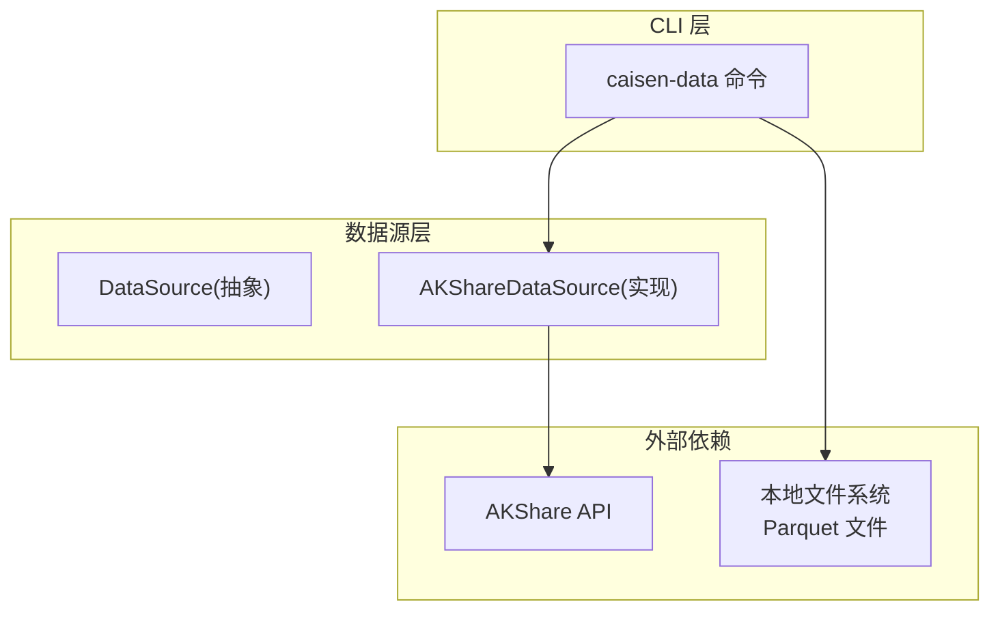
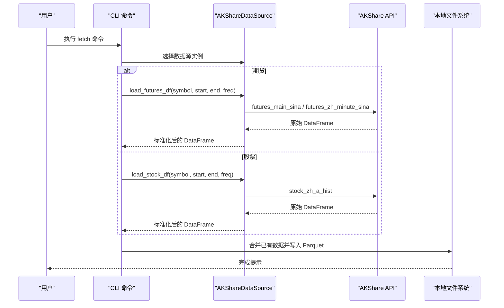
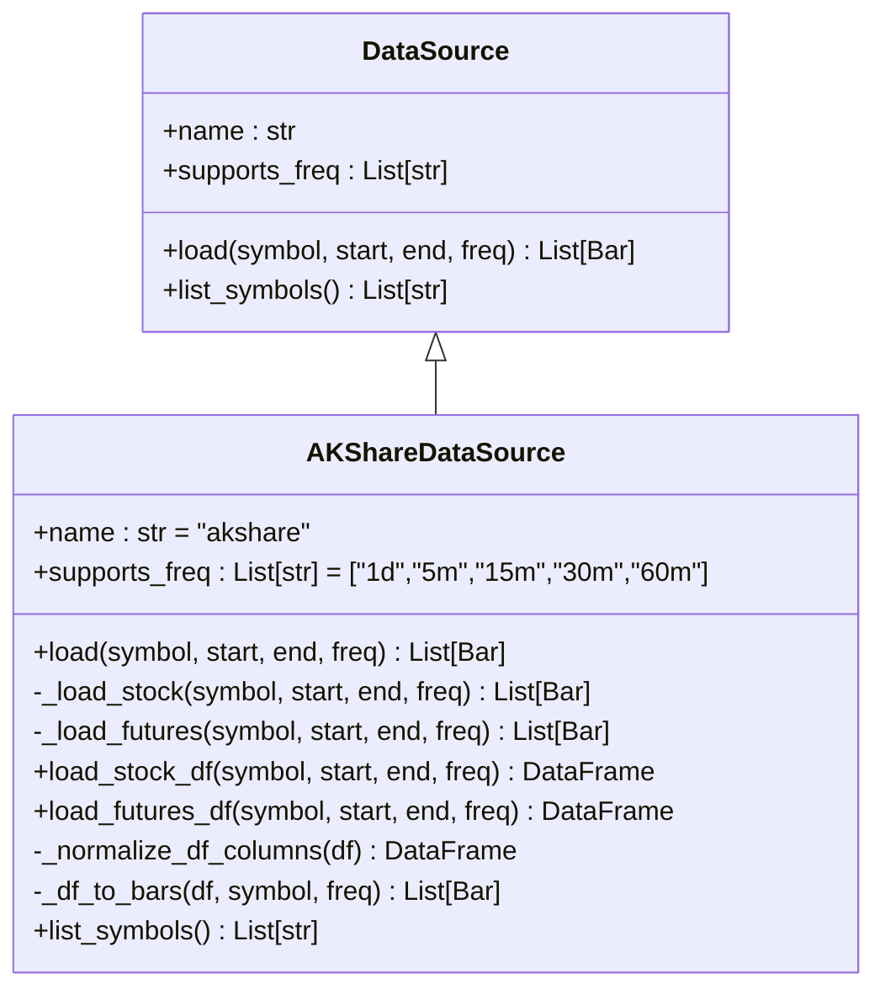
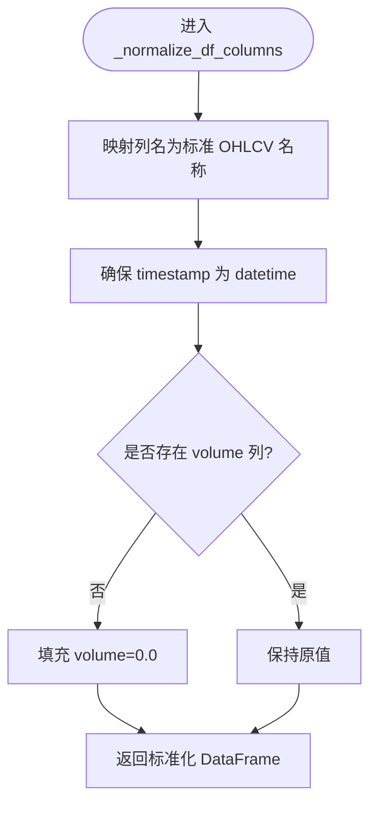
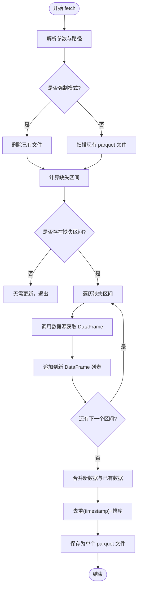
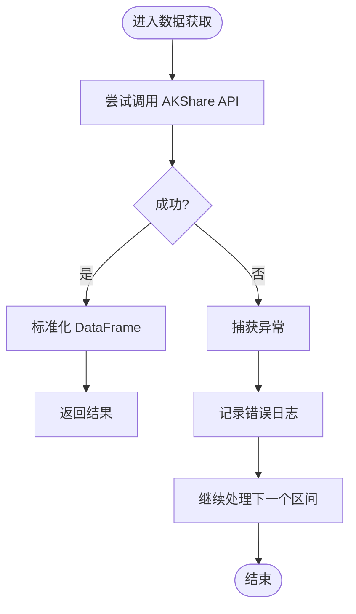
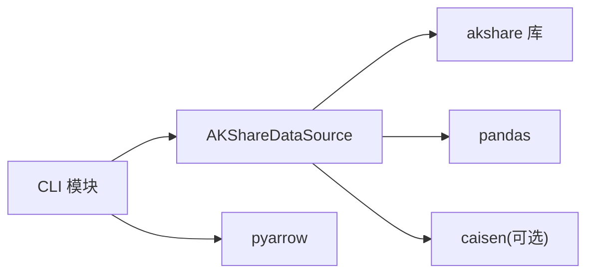

# AKShare 数据源实现

<cite>
**本文引用的文件**
- [akshare.py](file://src/caisen_data/sources/akshare.py)
- [base.py](file://src/caisen_data/sources/base.py)
- [__init__.py](file://src/caisen_data/sources/__init__.py)
- [cli.py](file://src/caisen_data/cli.py)
- [README.md](file://README.md)
- [pyproject.toml](file://pyproject.toml)
</cite>

## 目录
1. [简介](#简介)
2. [项目结构](#项目结构)
3. [核心组件](#核心组件)
4. [架构总览](#架构总览)
5. [详细组件分析](#详细组件分析)
6. [依赖关系分析](#依赖关系分析)
7. [性能考虑](#性能考虑)
8. [故障排查指南](#故障排查指南)
9. [结论](#结论)
10. [附录](#附录)

## 简介
本文件面向开发者，系统性解析 caisen-data 项目中 AKShare 数据源的实现。重点覆盖：
- AKShareDataSource 类与 AKShare API 的集成方式、数据获取逻辑与错误处理机制
- 不同频率（日线、5分钟、15分钟等）K 线数据的差异化处理策略
- 重试机制、超时处理与异常恢复现状与建议
- 数据标准化流程（字段映射、类型转换、校验）
- 性能优化技巧（批量请求、缓存策略、并发处理）
- 数据流图与错误处理流程图，帮助理解实现细节

## 项目结构
本项目采用“数据源抽象 + 具体实现”的分层组织方式：
- 抽象接口：DataSource 定义统一的数据加载与标的列表能力
- 具体实现：AKShareDataSource 基于 AKShare 提供 A 股与期货主力合约数据
- CLI 工具：负责增量下载、合并、保存为 Parquet 文件，并调用数据源
- 配置与入口：通过 pyproject.toml 注册 entry-point，暴露命令行入口

图表来源
- [akshare.py:37-245](file://src/caisen_data/sources/akshare.py#L37-L245)
- [base.py:14-43](file://src/caisen_data/sources/base.py#L14-L43)
- [cli.py:126-314](file://src/caisen_data/cli.py#L126-L314)

章节来源
- [README.md:1-144](file://README.md#L1-L144)
- [pyproject.toml:1-29](file://pyproject.toml#L1-L29)

## 核心组件
- DataSource 抽象基类：定义 load() 与 list_symbols() 接口，约定返回 Bar 对象列表与可用标的列表
- AKShareDataSource：实现上述接口，封装对 AKShare 的调用，支持股票与期货主力合约，支持多频率
- CLI 模块：实现增量抓取、缺失区间计算、文件合并与保存，以及列出标的与数据源

章节来源
- [base.py:14-43](file://src/caisen_data/sources/base.py#L14-L43)
- [akshare.py:37-245](file://src/caisen_data/sources/akshare.py#L37-L245)
- [cli.py:126-314](file://src/caisen_data/cli.py#L126-L314)

## 架构总览
整体数据流从 CLI 发起，经数据源访问 AKShare API，返回 DataFrame 或 Bar 列表，最终落盘为 Parquet 文件。

图表来源
- [cli.py:140-276](file://src/caisen_data/cli.py#L140-L276)
- [akshare.py:115-190](file://src/caisen_data/sources/akshare.py#L115-L190)

## 详细组件分析

### AKShareDataSource 类分析
该类是数据源的核心实现，职责包括：
- 根据 symbol 判断股票或期货，分别走不同分支
- 调用 AKShare 对应 API 获取原始数据
- 将不同 API 返回的列名统一为标准 OHLCV 格式
- 可选地将 DataFrame 转换为 Bar 对象列表（需安装 caisen）

图表来源
- [base.py:14-43](file://src/caisen_data/sources/base.py#L14-L43)
- [akshare.py:37-245](file://src/caisen_data/sources/akshare.py#L37-L245)

#### 与 AKShare API 的集成方式
- 股票日线：调用 stock_zh_a_hist，参数包含代码、周期、起止日期、复权方式
- 期货日线：调用 futures_main_sina，使用主力合约符号映射表
- 期货分钟线：调用 futures_zh_minute_sina，按 period 映射到 5/15/30/60 分钟

章节来源
- [akshare.py:115-145](file://src/caisen_data/sources/akshare.py#L115-L145)
- [akshare.py:147-190](file://src/caisen_data/sources/akshare.py#L147-L190)

#### 数据获取逻辑与频率策略
- 股票仅支持日线；若传入非日线频率会抛出 ValueError
- 期货支持日线与多种分钟线；分钟线在 API 拉取后按时间范围过滤
- 分钟线 period 映射：5m→5、15m→15、30m→30、60m→60

章节来源
- [akshare.py:131-132](file://src/caisen_data/sources/akshare.py#L131-L132)
- [akshare.py:166-190](file://src/caisen_data/sources/akshare.py#L166-L190)

#### 数据标准化流程
- 列名映射：将中文列名（如“开盘价”、“成交量”）映射为标准英文列名（open、volume 等）
- 时间戳规范化：确保 timestamp 为 datetime 类型
- 缺失字段填充：若无 volume 则填充为 0.0
- 输出列顺序：timestamp、symbol、freq、open、high、low、close、volume（仅保留存在的列）

图表来源
- [akshare.py:92-113](file://src/caisen_data/sources/akshare.py#L92-L113)

#### 异常与错误处理
- 依赖检查：未安装 akshare 时抛出 ImportError；未安装 caisen 且需要 Bar 对象时抛出 ImportError
- 参数校验：股票不支持非日线频率时抛出 ValueError
- 网络/上游异常：当前实现未捕获 AKShare 内部异常，由上层 CLI 统一 try-except 记录日志并继续处理其他区间
- 列表获取失败：list_symbols 捕获异常并记录日志，返回空列表

章节来源
- [akshare.py:51-52](file://src/caisen_data/sources/akshare.py#L51-L52)
- [akshare.py:68-72](file://src/caisen_data/sources/akshare.py#L68-L72)
- [akshare.py:84-88](file://src/caisen_data/sources/akshare.py#L84-L88)
- [akshare.py:129-132](file://src/caisen_data/sources/akshare.py#L129-L132)
- [akshare.py:161-162](file://src/caisen_data/sources/akshare.py#L161-L162)
- [akshare.py:227-245](file://src/caisen_data/sources/akshare.py#L227-L245)
- [cli.py:227-229](file://src/caisen_data/cli.py#L227-L229)

#### 重试机制、超时处理与异常恢复
- 当前实现未内置重试与超时控制
- 建议：
  - 在调用 AKShare API 处增加可配置的超时参数（如 requests timeout）
  - 引入指数退避重试（针对网络抖动、限流）
  - 对特定异常（如连接超时、HTTP 5xx）进行重试，对参数错误直接失败
  - 在 CLI 层增加全局重试与断点续传（按区间粒度）

章节来源
- [akshare.py:115-190](file://src/caisen_data/sources/akshare.py#L115-L190)
- [cli.py:193-229](file://src/caisen_data/cli.py#L193-L229)

#### 性能优化要点
- 列式处理：_df_to_bars 预先提取列为 numpy/pandas 序列，避免逐行字典构造开销
- 类型转换：使用 pd.to_numeric(errors="coerce") 与 fillna(0) 提升鲁棒性与速度
- 批量合并：CLI 侧先收集多个区间的 DataFrame，再一次性 concat、去重、排序与落盘
- 建议进一步优化：
  - 批量请求：对同一标的的多区间合并为一次 API 调用（受限于 AKShare 接口限制）
  - 缓存策略：对相同 symbol+freq+date_range 的结果做内存或磁盘缓存
  - 并发处理：对多标的并行拉取（注意限速与稳定性），或使用异步 IO

章节来源
- [akshare.py:192-225](file://src/caisen_data/sources/akshare.py#L192-L225)
- [cli.py:235-276](file://src/caisen_data/cli.py#L235-L276)

### CLI 增量抓取与合并流程
CLI 负责：
- 解析文件名中的日期范围，推断已有数据的时间跨度
- 计算缺失区间并进行增量下载
- 合并新旧数据、去重、排序，保存为单个 Parquet 文件
- 删除被合并的旧分段文件，保持目录整洁

图表来源
- [cli.py:140-276](file://src/caisen_data/cli.py#L140-L276)

章节来源
- [cli.py:19-103](file://src/caisen_data/cli.py#L19-L103)
- [cli.py:106-116](file://src/caisen_data/cli.py#L106-L116)
- [cli.py:140-276](file://src/caisen_data/cli.py#L140-L276)

### 错误处理流程图

图表来源
- [cli.py:193-229](file://src/caisen_data/cli.py#L193-L229)
- [akshare.py:115-190](file://src/caisen_data/sources/akshare.py#L115-L190)

## 依赖关系分析
- 运行时依赖：
  - akshare：用于获取 A 股与期货数据
  - pandas：数据处理与序列化
  - pyarrow：Parquet 读写
  - click：命令行框架
  - caisen：可选依赖，用于 Bar 对象（当需要返回 Bar 列表时）
- 包入口与插件注册：
  - 通过 pyproject.toml 的 entry-points 将 AKShareDataSource 注册为 caisen 的数据源

图表来源
- [pyproject.toml:11-26](file://pyproject.toml#L11-L26)
- [akshare.py:8-12](file://src/caisen_data/sources/akshare.py#L8-L12)
- [akshare.py:18-21](file://src/caisen_data/sources/akshare.py#L18-L21)

章节来源
- [pyproject.toml:11-26](file://pyproject.toml#L11-L26)
- [__init__.py:1-6](file://src/caisen_data/sources/__init__.py#L1-L6)

## 性能考虑
- 列式处理与向量化转换：减少 Python 层循环与字典构造开销
- 批量合并与去重：在内存中集中处理，降低 I/O 次数
- 建议优化：
  - 批量请求：尽可能合并时间窗口以减少 API 调用次数（受限于 AKShare 接口）
  - 缓存策略：对相同请求的 DataFrame 结果进行缓存（内存或磁盘）
  - 并发处理：多标的并行拉取，配合速率限制与熔断保护
  - 超时与重试：在网络不稳定场景下提高成功率

章节来源
- [akshare.py:192-225](file://src/caisen_data/sources/akshare.py#L192-L225)
- [cli.py:235-276](file://src/caisen_data/cli.py#L235-L276)

## 故障排查指南
- 常见错误与定位：
  - 未安装 akshare：导入阶段或方法调用时抛出 ImportError，需安装依赖
  - 未安装 caisen：当需要返回 Bar 对象时抛出 ImportError，可改用 DataFrame 接口
  - 股票频率不支持：传入非日线频率会抛出 ValueError
  - 网络异常：AKShare 内部异常未被显式捕获，CLI 层记录错误并继续
- 排查步骤：
  - 确认依赖安装：akshare、pandas、pyarrow、click；如需 Bar 对象，安装 caisen
  - 检查 symbol 与 freq 组合是否符合支持范围
  - 查看日志输出，定位具体失败的区间与错误信息
  - 使用 --force 重新下载以排除历史文件干扰
- 日志与调试：
  - CLI 与数据源均使用 logging 记录关键信息与错误
  - 可通过调整日志级别观察更详细的执行过程

章节来源
- [akshare.py:51-52](file://src/caisen_data/sources/akshare.py#L51-L52)
- [akshare.py:68-72](file://src/caisen_data/sources/akshare.py#L68-L72)
- [akshare.py:84-88](file://src/caisen_data/sources/akshare.py#L84-L88)
- [akshare.py:129-132](file://src/caisen_data/sources/akshare.py#L129-L132)
- [akshare.py:161-162](file://src/caisen_data/sources/akshare.py#L161-L162)
- [cli.py:227-229](file://src/caisen_data/cli.py#L227-L229)
- [cli.py:288-297](file://src/caisen_data/cli.py#L288-L297)

## 结论
AKShareDataSource 提供了统一的接口来拉取 A 股与期货主力合约数据，并通过标准化的列名与类型转换保证下游一致性。CLI 实现了增量抓取与文件合并，便于长期维护与回测使用。当前实现未内置重试与超时控制，建议在数据源层增加可配置的超时与重试策略，并在 CLI 层引入并发与缓存以提升性能与稳定性。

## 附录
- 支持的频率：
  - 股票：仅 1d
  - 期货：1d、5m、15m、30m、60m
- 数据保存格式：
  - Parquet，包含 timestamp、symbol、freq、open、high、low、close、volume
- 示例用法参考 README 与 CLI 命令说明

章节来源
- [README.md:84-144](file://README.md#L84-L144)
- [akshare.py:41-41](file://src/caisen_data/sources/akshare.py#L41-L41)
- [akshare.py:115-190](file://src/caisen_data/sources/akshare.py#L115-L190)