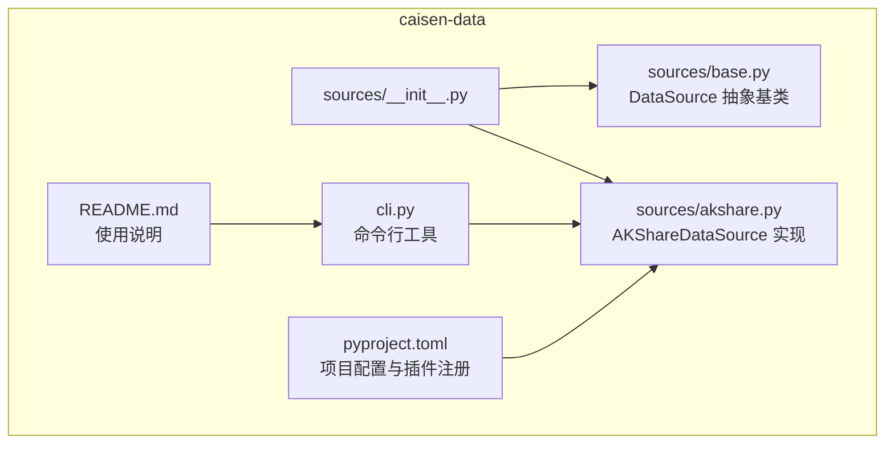
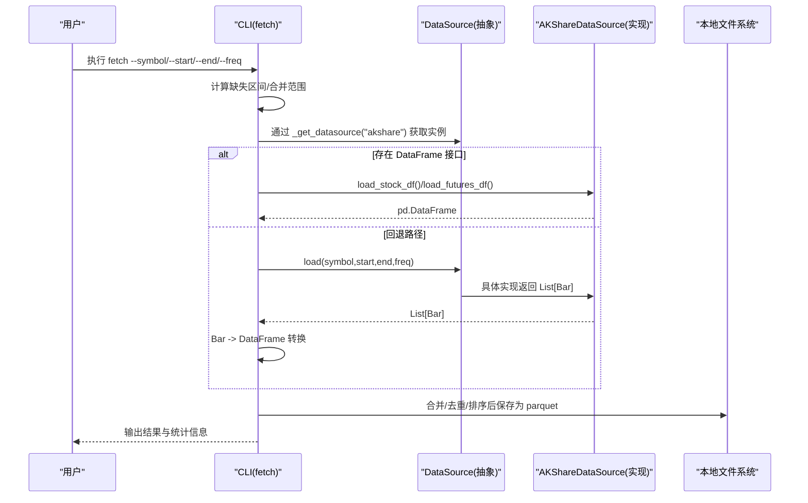
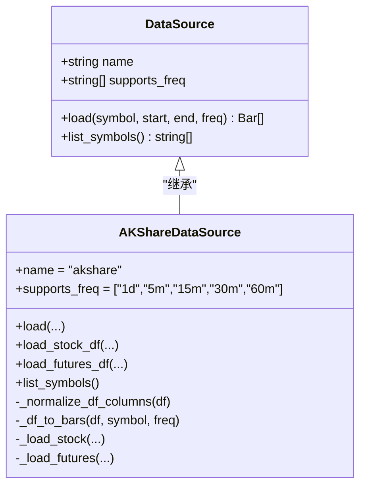
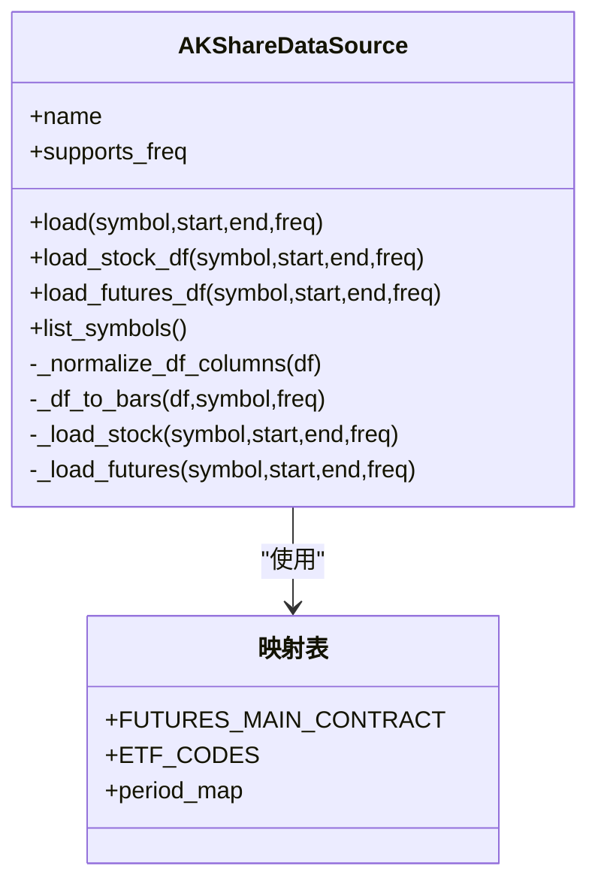
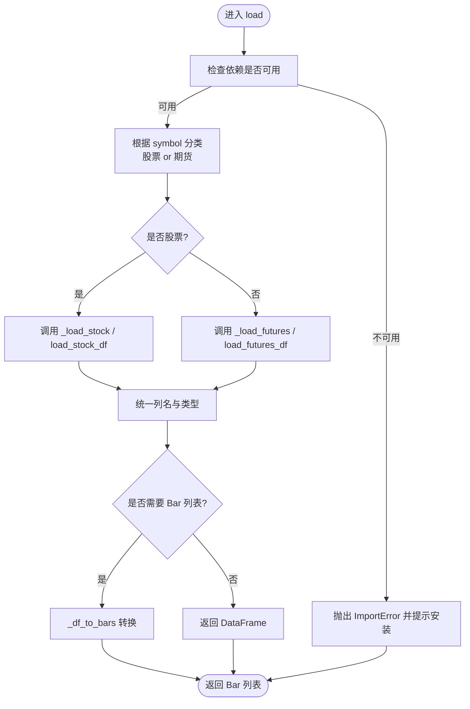
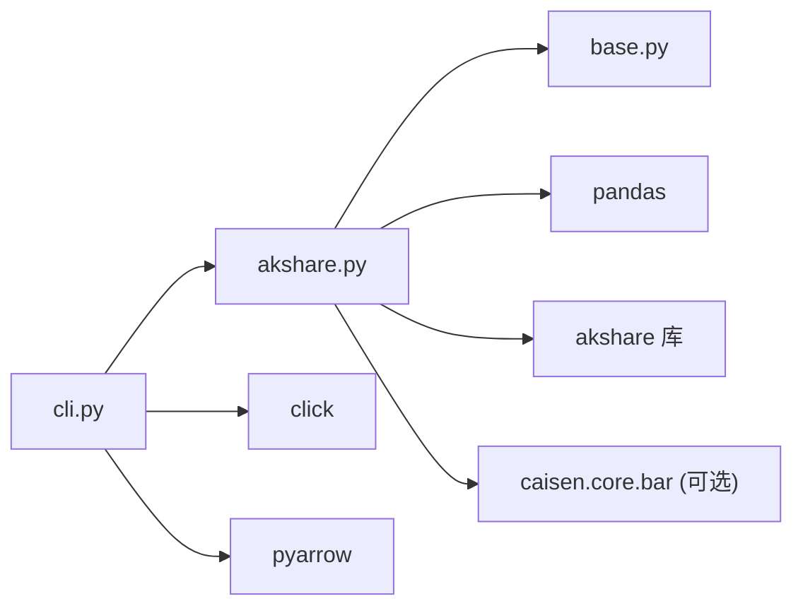
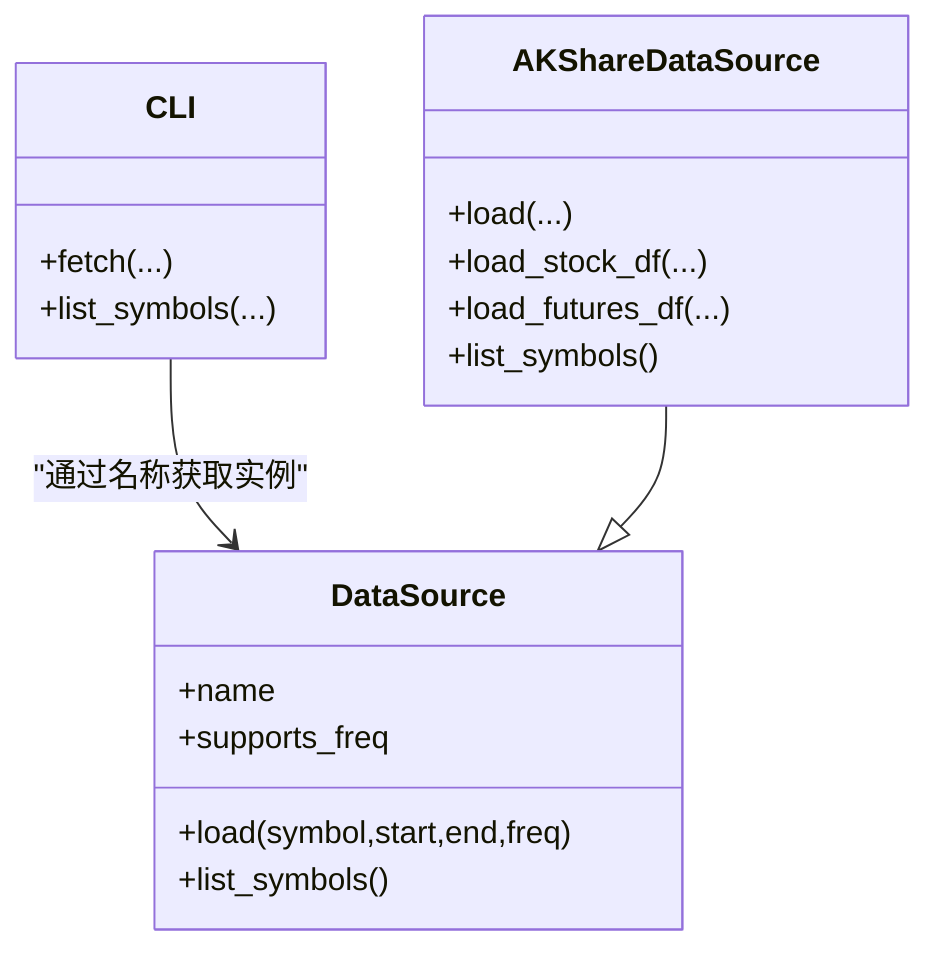

# 数据源抽象设计

<cite>
**本文引用的文件**   
- [base.py](file://src/caisen_data/sources/base.py)
- [akshare.py](file://src/caisen_data/sources/akshare.py)
- [__init__.py](file://src/caisen_data/sources/__init__.py)
- [cli.py](file://src/caisen_data/cli.py)
- [README.md](file://README.md)
- [pyproject.toml](file://pyproject.toml)
</cite>

## 目录
1. [引言](#引言)
2. [项目结构](#项目结构)
3. [核心组件](#核心组件)
4. [架构总览](#架构总览)
5. [详细组件分析](#详细组件分析)
6. [依赖关系分析](#依赖关系分析)
7. [性能考量](#性能考量)
8. [故障排查指南](#故障排查指南)
9. [结论](#结论)
10. [附录](#附录)

## 引言
本文件围绕“数据源抽象设计”展开，聚焦 DataSource 抽象基类的设计理念与实现要点。文档将系统阐述统一接口定义、模板方法模式的应用、插件化架构的优势；深入解析 load() 方法的参数规范、返回值格式与错误处理机制；解释 supports_freq 属性的作用与频率支持策略；说明 list_symbols() 的扩展点设计；并给出保持接口稳定与向后兼容的设计原则与最佳实践。文末提供接口关系图与继承层次结构图，帮助开发者快速理解抽象层的设计思路。

## 项目结构
本项目采用“按功能域组织”的结构：数据源抽象与具体实现位于 sources 子包中，CLI 入口位于 cli.py，元信息与可选依赖在 pyproject.toml 中声明。

图表来源
- [__init__.py:1-6](file://src/caisen_data/sources/__init__.py#L1-L6)
- [base.py:1-43](file://src/caisen_data/sources/base.py#L1-L43)
- [akshare.py:1-245](file://src/caisen_data/sources/akshare.py#L1-L245)
- [cli.py:1-314](file://src/caisen_data/cli.py#L1-L314)
- [pyproject.toml:1-29](file://pyproject.toml#L1-L29)
- [README.md:1-144](file://README.md#L1-L144)

章节来源
- [__init__.py:1-6](file://src/caisen_data/sources/__init__.py#L1-L6)
- [base.py:1-43](file://src/caisen_data/sources/base.py#L1-L43)
- [akshare.py:1-245](file://src/caisen_data/sources/akshare.py#L1-L245)
- [cli.py:1-314](file://src/caisen_data/cli.py#L1-L314)
- [pyproject.toml:1-29](file://pyproject.toml#L1-L29)
- [README.md:1-144](file://README.md#L1-L144)

## 核心组件
- DataSource 抽象基类：定义统一的数据加载接口与默认行为，作为所有数据源的契约。
- AKShareDataSource 具体实现：基于 AKShare 获取股票与期货主力合约数据，并提供 DataFrame 便捷接口与 Bar 对象转换。
- CLI 工具：封装增量下载、合并与持久化逻辑，并通过反射式调用数据源接口完成数据拉取。

章节来源
- [base.py:14-43](file://src/caisen_data/sources/base.py#L14-L43)
- [akshare.py:37-245](file://src/caisen_data/sources/akshare.py#L37-L245)
- [cli.py:119-276](file://src/caisen_data/cli.py#L119-L276)

## 架构总览
下图展示了从 CLI 到数据源抽象再到具体实现的调用链，以及数据落盘流程。

图表来源
- [cli.py:140-276](file://src/caisen_data/cli.py#L140-L276)
- [akshare.py:115-190](file://src/caisen_data/sources/akshare.py#L115-L190)
- [akshare.py:192-225](file://src/caisen_data/sources/akshare.py#L192-L225)
- [base.py:20-39](file://src/caisen_data/sources/base.py#L20-L39)

## 详细组件分析

### DataSource 抽象基类
- 设计理念
  - 统一接口：以 load() 为核心，屏蔽不同数据源差异，向上层提供一致的数据获取体验。
  - 模板方法模式：基类提供默认行为（如 list_symbols 返回空列表），子类按需覆盖，减少重复代码。
  - 插件化架构：通过 supports_freq 与 name 等属性描述能力，结合外部注册机制（见 pyproject.toml）实现可插拔扩展。
- 关键成员
  - name: 数据源标识名，便于日志与选择。
  - supports_freq: 支持的频率集合，用于校验与提示。
  - load(): 抽象方法，要求子类实现 K 线数据加载。
  - list_symbols(): 默认返回空列表，子类可重写以暴露可用标的。
- 设计原则与最佳实践
  - 接口稳定性：新增参数应带默认值，避免破坏既有调用方。
  - 向后兼容：对旧版本实现，优先通过可选参数或特性检测兼容。
  - 明确错误语义：当依赖缺失时抛出明确的 ImportError，便于上层捕获与提示。
  - 类型标注：使用 typing.List 与日期类型，提升可读性与静态检查能力。

章节来源
- [base.py:14-43](file://src/caisen_data/sources/base.py#L14-L43)

#### 继承层次结构图

图表来源
- [base.py:14-43](file://src/caisen_data/sources/base.py#L14-L43)
- [akshare.py:37-245](file://src/caisen_data/sources/akshare.py#L37-L245)

### AKShareDataSource 具体实现
- 职责边界
  - 负责与 AKShare API 交互，统一列名与数据类型，返回标准化 DataFrame 或 Bar 列表。
  - 区分股票与期货数据路径，提供专用 DataFrame 接口以提升性能。
- 关键方法
  - load(): 根据 symbol 判断股票/期货，路由至对应加载器。
  - load_stock_df()/load_futures_df(): 直接返回 DataFrame，避免 Bar 对象转换开销。
  - _df_to_bars(): 批量列式处理，构造 Bar 列表。
  - list_symbols(): 获取 A 股列表，过滤并拼接交易所后缀。
- 错误处理
  - 未安装 akshare 或 caisen 时抛出 ImportError，并附带安装提示。
  - 频率不合法时抛出 ValueError，明确不支持的频率。
  - 网络异常或解析失败时记录日志并返回空结果，保证健壮性。

章节来源
- [akshare.py:37-245](file://src/caisen_data/sources/akshare.py#L37-L245)

#### 类图（含内部方法与映射）

图表来源
- [akshare.py:23-34](file://src/caisen_data/sources/akshare.py#L23-L34)
- [akshare.py:166-175](file://src/caisen_data/sources/akshare.py#L166-L175)
- [akshare.py:92-113](file://src/caisen_data/sources/akshare.py#L92-L113)
- [akshare.py:192-225](file://src/caisen_data/sources/akshare.py#L192-L225)

### load() 方法详解
- 参数规范
  - symbol: 标的代码，股票形如 "000001.SZ"/"600000.SH"，期货为主力合约简称（如 "ag"）。
  - start/end: 开始与结束日期（date 类型）。
  - freq: 数据频率，字符串形式，如 "1d"、"5m"、"15m"、"30m"、"60m"。
- 返回值格式
  - 返回 Bar 对象的列表，每个 Bar 包含时间戳、OHLCV 字段及 symbol/freq 元信息。
- 错误处理机制
  - 依赖缺失：若未安装 akshare 或 caisen，抛出 ImportError 并给出安装指引。
  - 频率不支持：如股票仅支持日线，传入分钟频率会抛出 ValueError。
  - 数据为空：返回空列表，由上层决定后续处理。
- 设计要点
  - 路由策略：根据 symbol 前缀或映射表判断资产类别，分派到专用加载器。
  - 性能优化：优先走 DataFrame 接口，避免不必要的对象转换。

章节来源
- [base.py:20-39](file://src/caisen_data/sources/base.py#L20-L39)
- [akshare.py:43-90](file://src/caisen_data/sources/akshare.py#L43-L90)
- [akshare.py:115-190](file://src/caisen_data/sources/akshare.py#L115-L190)

#### 流程图（load 决策与分支）

图表来源
- [akshare.py:43-90](file://src/caisen_data/sources/akshare.py#L43-L90)
- [akshare.py:92-113](file://src/caisen_data/sources/akshare.py#L92-L113)
- [akshare.py:192-225](file://src/caisen_data/sources/akshare.py#L192-L225)

### supports_freq 属性与频率支持策略
- 作用
  - 声明数据源支持的频率集合，供上层进行能力探测与校验。
- 当前实现
  - 基类默认支持 ["1d"]。
  - AKShareDataSource 扩展支持 ["1d", "5m", "15m", "30m", "60m"]。
- 策略建议
  - 在 load 入口处校验 freq 是否在 supports_freq 内，否则抛出 ValueError。
  - 对不同频率采用不同的 API 与数据清洗策略（例如分钟级需额外时间过滤）。

章节来源
- [base.py:17-18](file://src/caisen_data/sources/base.py#L17-L18)
- [akshare.py:40-41](file://src/caisen_data/sources/akshare.py#L40-L41)
- [akshare.py:131-132](file://src/caisen_data/sources/akshare.py#L131-L132)
- [akshare.py:166-175](file://src/caisen_data/sources/akshare.py#L166-L175)

### list_symbols() 扩展点设计
- 默认行为
  - 基类返回空列表，表示“不提供标的列表”。
- 扩展方式
  - 子类可重写该方法，返回可用的标的集合（如 A 股全量代码）。
- 使用场景
  - CLI 提供 list-symbols 命令，调用数据源的 list_symbols 展示可用标的。
- 健壮性
  - 网络异常或依赖缺失时，记录日志并返回空列表，避免中断主流程。

章节来源
- [base.py:41-43](file://src/caisen_data/sources/base.py#L41-L43)
- [akshare.py:227-245](file://src/caisen_data/sources/akshare.py#L227-L245)
- [cli.py:279-297](file://src/caisen_data/cli.py#L279-L297)

### 插件化架构与注册机制
- 注册方式
  - 通过 pyproject.toml 的 entry-points 将数据源类注册到命名空间，便于动态发现与加载。
- 优势
  - 解耦：新增数据源无需修改核心逻辑，只需注册即可被识别。
  - 可扩展：上层可通过名称选择数据源，支持多数据源并存与切换。
- 现状
  - 当前 CLI 使用硬编码映射获取数据源实例，未来可迁移到基于 entry-points 的动态加载。

章节来源
- [pyproject.toml:25-26](file://pyproject.toml#L25-L26)
- [cli.py:119-123](file://src/caisen_data/cli.py#L119-L123)

## 依赖关系分析
- 模块耦合
  - CLI 依赖 AKShareDataSource 的具体实现，但通过抽象接口隔离了业务逻辑。
  - AKShareDataSource 依赖 pandas、akshare 与可选的 caisen.core.bar。
- 外部依赖
  - akshare：行情数据获取。
  - pandas/pyarrow：数据处理与 Parquet 存储。
  - click：命令行框架。
  - caisen：可选依赖，用于 Bar 对象构造。

图表来源
- [cli.py:1-314](file://src/caisen_data/cli.py#L1-L314)
- [akshare.py:1-245](file://src/caisen_data/sources/akshare.py#L1-L245)
- [base.py:1-43](file://src/caisen_data/sources/base.py#L1-L43)

章节来源
- [cli.py:1-314](file://src/caisen_data/cli.py#L1-L314)
- [akshare.py:1-245](file://src/caisen_data/sources/akshare.py#L1-L245)
- [base.py:1-43](file://src/caisen_data/sources/base.py#L1-L43)

## 性能考量
- 优先使用 DataFrame 接口：CLI 在具备 DataFrame 接口时直接调用，避免 Bar 对象转换带来的内存与 CPU 开销。
- 列式处理：_df_to_bars 预先提取列为 numpy/pandas 数组，减少逐行迭代成本。
- 增量与合并：基于文件名推断已有范围，避免重复读取大文件；合并时去重与排序，确保最终一致性。
- 存储格式：Parquet 列式压缩，适合大规模时序数据的读写与分析。

章节来源
- [cli.py:194-222](file://src/caisen_data/cli.py#L194-L222)
- [akshare.py:192-225](file://src/caisen_data/sources/akshare.py#L192-L225)
- [cli.py:106-116](file://src/caisen_data/cli.py#L106-L116)

## 故障排查指南
- 常见错误与定位
  - ImportError: akshare not installed
    - 现象：调用数据源时报缺少 akshare。
    - 处理：安装 akshare 后再试。
  - ImportError: caisen 未安装
    - 现象：使用 load() 返回 Bar 对象时报缺少 caisen。
    - 处理：安装 caisen，或使用 DataFrame 接口替代。
  - ValueError: 频率不支持
    - 现象：股票请求非日线频率。
    - 处理：改为 "1d" 或切换到支持分钟级的数据源。
  - 网络异常或解析失败
    - 现象：list_symbols 或加载数据返回空或报错。
    - 处理：查看日志，重试或更换网络环境。
- 调试建议
  - 启用日志：关注 logger 输出，定位失败区间与原因。
  - 最小复现：缩小时间范围与标的，逐步验证接口可用性。
  - 依赖检查：确认 akshare、pandas、pyarrow、caisen 版本兼容。

章节来源
- [akshare.py:51-52](file://src/caisen_data/sources/akshare.py#L51-L52)
- [akshare.py:68-72](file://src/caisen_data/sources/akshare.py#L68-L72)
- [akshare.py:129-132](file://src/caisen_data/sources/akshare.py#L129-L132)
- [akshare.py:227-245](file://src/caisen_data/sources/akshare.py#L227-L245)
- [cli.py:227-230](file://src/caisen_data/cli.py#L227-L230)

## 结论
DataSource 抽象基类通过统一接口与默认行为，实现了数据源的解耦与可扩展性。AKShareDataSource 在此基础上提供了高效的数据获取与转换能力，配合 CLI 的增量与合并策略，形成完整的数据流水线。遵循接口稳定与向后兼容的原则，可在不破坏现有调用的前提下持续扩展新的数据源与频率支持。

## 附录

### 接口关系图（面向调用方）

图表来源
- [base.py:14-43](file://src/caisen_data/sources/base.py#L14-L43)
- [akshare.py:37-245](file://src/caisen_data/sources/akshare.py#L37-L245)
- [cli.py:119-123](file://src/caisen_data/cli.py#L119-L123)

### 设计原则与最佳实践清单
- 接口稳定性
  - 新增参数必须带默认值，避免破坏既有调用。
  - 对旧实现采用特性检测与回退路径。
- 错误语义清晰
  - 依赖缺失抛 ImportError，频率非法抛 ValueError，网络异常记录日志并返回空结果。
- 可扩展性
  - 通过 supports_freq 与 name 描述能力，结合 entry-points 实现插件化。
- 性能优先
  - 优先 DataFrame 接口，避免对象转换；列式处理与去重排序。
- 文档与示例
  - 提供 README 与 CLI 示例，降低接入成本。

章节来源
- [base.py:14-43](file://src/caisen_data/sources/base.py#L14-L43)
- [akshare.py:37-245](file://src/caisen_data/sources/akshare.py#L37-L245)
- [pyproject.toml:25-26](file://pyproject.toml#L25-L26)
- [README.md:64-82](file://README.md#L64-L82)